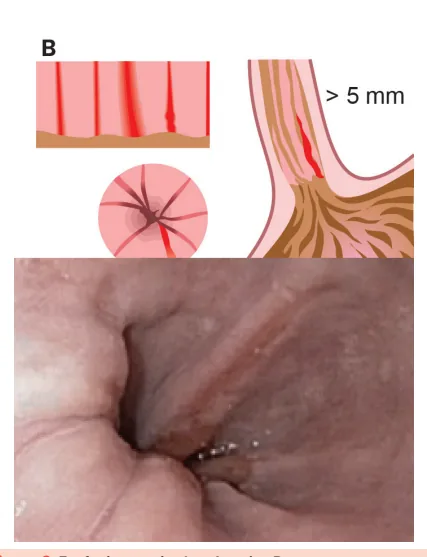
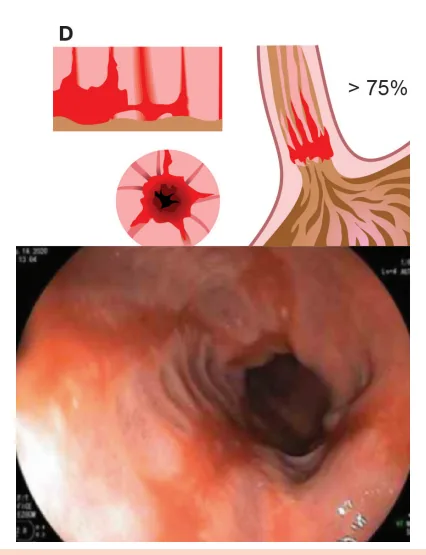
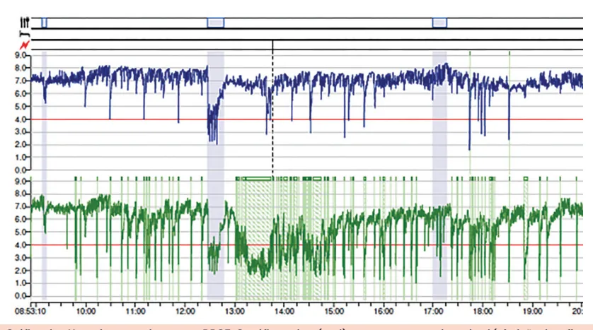
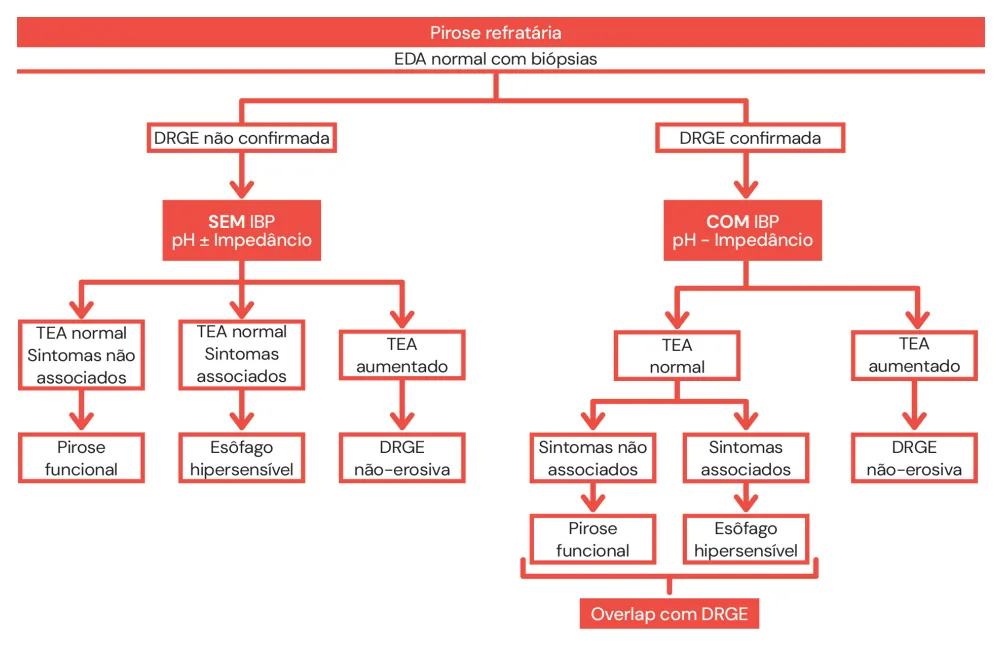
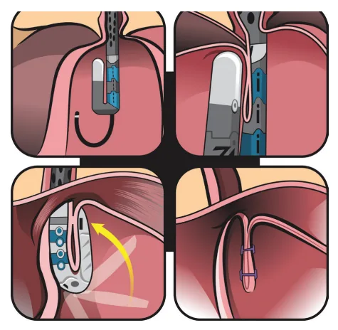
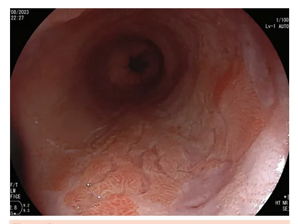
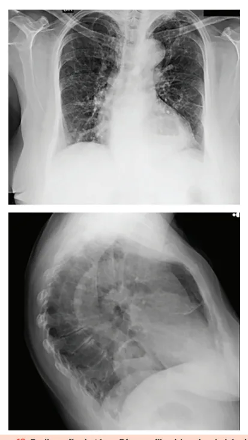
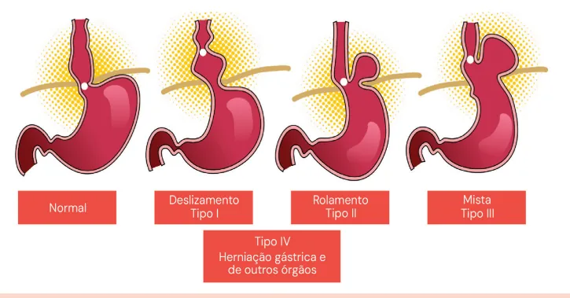
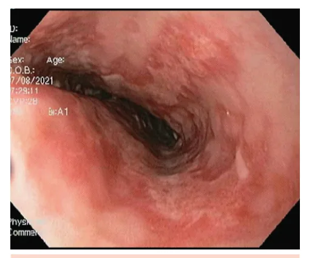

# DRGE

<!-- page:1 -->

## DOENÇA DO REFLUXO

## GASTROESOFÁGICO (DRGE)

GASTROESOFÁGICO DRGE (CM) Barret (CM) Sintomas → Típico: pirose e regurgitação T Atípico: Dor torácica, tosse, rouquidão… Diagnóstico t

1. Quadro clínico e teste terapêutico com IBP (baixo custo, pouco acurado) a

2. EDA (invasivo, avaliar complicações e diag diferenciais, esofagite em apenas 30-40% T

3. pHmetria (± Impedâncio): padrão-ouro, porém B

desconfortável - realizar apenas se refratariedade M ou programação de procedimento invasivo R Conduta: S

- Sem sinais de alarme: IBP 4-8 semanas g

- Sinais de alarme ou sintomas refratários A ou recorrentes: EDA O

- Sintomas extraesofágicos isolados: tendência atual Q de investigar antes teste terapêutico → e

## FISIOPATOLOGIA

- Ocorre pelo retorno do conteúdo gástrico até a mucosa esofágica.

## MECANISMOS PATOLÓGICOS

- Relaxamento transitório do esfíncter inferior do Q esôfago (EIE) quando não deveria relaxar. I

- Hipotonia do esfíncter esofagiano inferior.

- Outros mecanismos: elevação da pressão abdominal;

diminuição do esvaziamento gástrico, por exemplo, em pacientes com gastroparesia; redução da salivação (saliva é importante para o clearance esofágico); E acid pocket;

## EPIDEMIOLOGIA

- Acomete cerca de 10-20% da população ocidental.

## SINTOMAS

## TÍPICOS

- Pirose (também conhecida como azia).

- Regurgitação.

## SINTOMAS ATÍPICOS

- Dor torácica não cardíaca.

- Globus faríngeo. A

- Tosse crônica. B

- Rouquidão. C

- Pigarro. D

- Desgaste do esmalte dentário. z O (DRGE)

Tratamento

- Medidas gerais: perda de peso, alimentação, cessar tabagismo, medicamentos

- Fármacos: IBP, PCABs, AntiH2, antiácidos, alginato, baclofeno

- Invasivos: Fundoplicatura cirúrgica,

Tratamentos endoscópicos Barrett: Mucosa rosa salmão - AP: metaplasia intestinal Risco de câncer (maior se longo >3 cm ou displasia)

Sem displasia: vigilância 3-5 anos // Displasia baixo grau: Repetir EDA em 6 meses ou tto endoscópico // Alto grau: Ressecção ou ablação endoscópica Outras esofagites:

Química, medicamentosa, infecciosa (candidíase → fluconazol, herpes → aciclovir, CMV → ganciclovir), esofagite eosinofílica

- Halitose → 90% dos quadros de halitose se dá por patologias na cavidade oral;

- Aftas orais.

## DIAGNÓSTICO

## QUADRO CLÍNICO + TESTE TERAPÊUTICO COM

## INIBIDOR DA BOMBA DE PRÓTONS (IBP)

- Simples e com baixo custo.

- Sensibilidade 60-80%; especifi cidade 30-70%;

- É positivo em outras patologias.

## ENDOSCOPIA

- Tem custo inerente, além de ser um método invasivo;

- É bastante utilizado, contudo demonstra baixa sensibilidade;

- É útil para a avaliação de complicações e para diagnósticos diferenciais;

- Para o estabelecimento do diagnóstico, é necessária a presença de esofagite.

- Cerca de 60-70% dos pacientes apresentam endoscopia sem alterações; Somente em 30-40% dos casos existem achados característicos de refluxo → esofagite. A esofagite é a inflamação da mucosa esofágica, geralmente associada à DRGE.

- Classificação de Los Angeles:

A. Erosões lineares não confluentes < 5 mm; B. Erosões lineares não confluentes > 5 mm; C. Erosões confluentes que ocupam < 75% da luz do órgão;

D. Erosões confluentes que ocupam > 75% da luz do órgão;

- Confira Figura 1 , Figura 2 , Figura 3 e Figura 4 na próxima página

---

<!-- page:2 -->

Figura 1: Esofagite erosiva Los Angeles A. Figura 3: Esofagite erosiva Los Angeles C. Figura 2: Esofagite erosiva Los Angeles B. Figura 4: Esofagite erosiva Los Angeles D.

ATENÇÃO: Nas definições atuais, as lesões grau A não confirmam o diagnóstico. O diagnóstico de DRGE pode ser confirmado pela presença de esofagite erosiva graus B, C ou D, Barrett ou estenose péptica.

Complicações:

- Úlcera;

- Estenose;

- Barrett – caracteriza-se pela mucosa do esôfago distal, em coloração “salmão”.

Figura 5: Úlcera em transição esôfago-gástrica.

---

<!-- page:3 -->

Figura 6: Estenose péptica. Figura 7: Esôfago de Barrett. Figura 8: Gráfico de pHmetria em paciente com DRGE. O gráfico acima (azul) representa o canal proximal (aferição de refluxo proximal) e o gráfico abaixo (verde) representa o canal distal (aferição de refluxo distal, com canal posicionado 5 cm acima da borda superior do esfíncter inferior). A linha vermelha em ambos os canais representa pH 4, sendo que quando o pH cai abaixo desta linha vermelha significa que houve refluxo.

pHmetria Impedanciometria

- Atua pela medição do pH esofágico em 24 horas;

- Cateter similar à pHmetria, mas dispõe de anéis

- É o exame padrão-ouro, porém desconfortável; no cateter que identificam o movimento do bolo

- Requer manometria antes e pode depender da alimentar e se o refluxo é ácido ou não;

variação do dia.

- Mais cara e menos disponível;

- Também é útil para avaliar se a refratariedade dos programação cirúrgica ou doença refratária. ácido associado.

OBS.: o exame deve ser realizado se houver sintomas da DRGE é decorrente de refluxo não Recomendações: MANEJO É realizada geralmente após a suspensão de IBP por, pelo Como abordar?

menos, 7 dias – a não ser que haja certeza do diagnóstico

- Ausência de sinais de alarme → IBP 4 a 8 semanas;

de DRGE e queira avaliar refratariedade ao tratamento.

- Sinais de alarme, sintomas refratários ou sintomas

- Avaliação: TEA = tempo de exposição ácida (com recorrentes? → Endoscopia digestiva alta; TEA < 4% → descarta presença de exame (se possível).

pH < 4); | Suspender o uso de IBP por 2-4 semanas antes do refluxo patológico;

- Sintomas extraesofágicos isolados? Tendência atual é TEA 4 e 6% → há possibilidade de refluxo (evidência recomendar investigação antes de terapia empírica limítrofe para diagnóstico);

- Verificar Figura 9 na próxima página TEA > 6% → estabelece diagnóstico.

- DeMeester (escore com 6 variáveis) > 14,7→ sugere DRGE.

---

<!-- page:4 -->

## FLUXOGRAMA DE PIROSE REFRATÁRIA

Figura 9: Fluxograma de Investigação de pirose refratária

## COMO TRATAR?

## MEDIDAS ANTIRREFLUXO

- Perda de peso.

- Elevação da cabeceira (15 cm).

- Alimentação – Considerar individualidade de cada paciente, pois podem existir variações;

- Evitar alimentos gordurosos, condimentos, frituras; Evitar bebidas gaseificadas e bebidas alcoólicas; Evitar alguns medicamentos – bloqueadores do canal de cálcio;

- Não deitar após a refeição;

- Fracionamento da dieta;

- Cessação do tabagismo.

## FÁRMACOS

- IBP;

- Anti-H2;

- PCABs;

- Procinéticos → se houver suspeita de retardo do esvaziamento gástrico associado;

- Antiácidos;

- Alginato – atua no bolsão ácido (acid pocket);

- Baclofeno. CIRURGIA

- Fundoplicatura; Nissen → total; Dor / Toupet → parcial.

- Indicações: Desejo de cessar o uso de IBPs; Má adesão medicamentosa; Efeitos colaterais às medicações;

Hérnia volumosa; Esofagite refratária;

- Aspiração refratária.

## TRATAMENTOS ENDOSCÓPICOS

Indicações e recomendações:

- Desejo de cessar o uso de IBPs;

- Deve-se realizar manometria e pHmetria anteriormente ao procedimento.

Radiofrequência Stretta;

- Estimula a proliferação de fibras de colágeno para tentar aumentar o tônus do EIE;

- Estudos evidenciaram a redução dos sintomas, contudo não foi evidenciado redução do tempo de exposição ácida → houve redução de sensibilidade? Figura 10

TIF – Fundoplicatura transoral sem incisão Figura 11 ; Contraindicações a ambos procedimentos:

- Hérnia de hiato > 2-3 cm;

- Disfagia;

- Esofagite grau C ou D;

- Presença de estenoses;

- Hipotonia importante no EIE.

- Verificar Figura 10 e Figura 11 na próxima página

---

<!-- page:5 -->

## TRATAMENTO

- IBP para todos os pacientes.

- Fundoplicatura – pode ser considerada para o

Figura 10: Tratamento endoscópico por radiofrequência para DRGE

- - - Figura 11: Fundoplicatura endoscópica

- L

## ESÔFAGO DE BARRETT

## CONSIDERAÇÕES INICIAIS

- Suspeita-se quando presença de epitélio de coloração rosa-salmão em esôfago distal na endoscopia.

- Anatomopatológico: evidência de epitélio colunar com metaplasia intestinal em esôfago distal. Q

- Evolução: inflamação + cicatrização crônica → metaplasia → displasia → adenocarcinoma.

- H

- Figura 12: Esôfago de Barrett controle dos sintomas.

## CLASSIFICAÇÃO E SEGUIMENTO

ATENÇÃO: na presença de displasia, sugere-se a revisão por patologista experiente. Um esôfago inflamado pode parecer que tem displasia quando, na verdade, é só inflamação.

Tabela 1: Conduta em Esôfago de Barrett Vigilância epidemiológica a cada Sem displasia 3-5 anos Nova EDA a cada 6 meses / 1 ano

- durante o primeiro ano. Após tal período, manter seguimento anual baixo grau endoscópica alto grau

Displasia de Discutir ressecção ou Ablação Terapia endoscópica Displasia de Ressecção - mucosectomia/ESD Ablação Proceder com estadiamento Adenocarcinoma Manejo conforme o estadiamento

## EXTENSÃO DE ACOMETIMENTO

- < 3 cm;

- Sem displasia;

- Risco de adenocarcinoma: 0,07% ao ano;

- Risco de displasia de alto grau ou adenocarcinoma:

0,29% ao ano;

- Seguimento: a cada 5 anos (?).

Longo:

- 3 cm;

- Sem displasia; risco de adenocarcinoma: 0,25% ao ano;

- Risco de displasia de alto grau ou adenocarcinoma:

0,91% ao ano;

- Seguimento: a cada 3 anos (?)

## QUANDO PROCEDER COM O RASTREAMENTO

- Sintomas crônicos (> 5 anos) ou frequentes (>

1x/semana);

- Deve ser associado a 2 dos critérios a seguir: Homem; Obesidade; > 50 anos; Histórico de tabagismo; Branco; Histórico familiar positivo para parentes de 1° grau.

## HÉRNIA DE HIATO

- Quando o estômago ultrapassa o hiato diafragmático e hérnia para a cavidade torácica.

---

<!-- page:6 -->

Classificação: Normal

- Tipo 1; F igura 14 e 15 Deslizamento → transição esôfago-gástrica acima do pinçamento diafragmático

- Tipo 2: figura 16 Rolamento → deslocamento cranial do fundo gástrico;

- Tipo 3; Figura 17 Mista – combinação do tipo I e II;

- Tipo 4 Herniação gástrica e de outros órgãos.

Figura 13: Radiografía de tórax PA e perfil evidenciando hérnia de hiato Figura 17: Representação esquemática das hérnias de hiato confo Figura 14: Hérnia de hiato tipo I - imagem endoscópica em visão frontal, demonstrando junção esôfago-gástrica acima do pinçamento diafragmático.

Figura 15: Hérnia de hiato tipo I - imagem endoscópica em retrovisão Figura 16: Hérnia de hiato tipo II - imagem endoscópica em retrovisão.

orme tipo.

---

<!-- page:7 -->

## OUTRAS ESOFAGITES REFERÊNCIAS

OBSERVE A IMAGEM A SEGUIR Figura 1: Esofagite erosiva Los Angeles A.

- Imunohistoquímica → Esofagite por herpes simples. A

Figura 18: Esofagite infecciosa por herpes simples

## NEM TODA ESOFAGITE É POR DOENÇA DO

## REFLUXO

Outras causas:

- Química A

- Medicamentosa;

## Esofagite infecciosa

- Esofagite eosinofílica. A

Suspeitar: A

- Odinogafia, disfagia;

- Associação: imunodeprimidos (neoplasia, SIDA), DM, uso de antibióticos, uso de corticoides. A

Candidíase:

- Mais comum; F

- Caracteriza-se pela presença de e placas esbranquiçadas;

- Tratamento → fluconazol.

Herpética (HSV-1):

- Maior parte dos quadros não demonstra herpes labial concomitante;

- Caracterizada pela presença de vesículas e algumas ulcerações;

- Tratamento → aciclovir.

## CMV

- Úlcera extensa geralmente única;

- Tratamento → ganciclovir. Arquivo pessoal.

Figura 2: Esofagite erosiva Los Angeles B. Arquivo pessoal. Figura 3: Esofagite erosiva Los Angeles C.

Arquivo pessoal. Figura 4: Esofagite erosiva Los Angeles D. Arquivo pessoal. Figura 5: Úlcera em transição esôfago-gástrica.

Arquivo pessoal. Figura 6: Estenose péptica. Arquivo pessoal. Figura 7: Esôfago de Barrett. Arquivo pessoal.

Figura 8: Gráfico de pHmetria em paciente com DRGE. Arquivo pessoal. Figura 12: Esôfago de Barrett Arquivo pessoal.

Figura 13: Radiografia de tórax PA e perfil evidenciando hérnia de hiato. Arquivo pessoal. Figura 14: Hérnia de hiato tipo I - imagem endoscópica em visão frontal, demonstrando junção esôfago-gástrica acima do pinçamento diafragmático.

Arquivo pessoal. Figura 15: Hérnia de hiato tipo I - imagem endoscópica em retrovisão. Arquivo pessoal.

Figura 16: Hérnia de hiato tipo II - imagem endoscópica em retrovisão. Arquivo pessoal. Figura 17: Representação esquemática das hérnias de hiato conforme tipo.

Arquivo pessoal. Figura 18: Esofagite infecciosa por herpes simples. Fonte: https://gastropedia.pub/pt/tag/moniliase-esofagica/ Tag: monilíase esofágica

