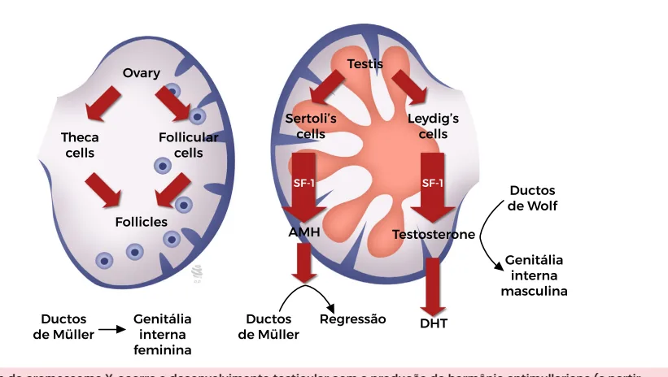

# Embriologia do Sistema Genital Feminino

<!-- page:1 -->

## EMBRIOLOGIA DO SISTEMA

## GENITAL FEMININO

Embriologia do sistema genital feminino

- Até 6 semanas as gônadas são indiferenciadas e

- A testosterona é convertida em diidrotestosterona há persistência dos ductos mesonéfricos (Wolff) e (DHT), forma mais ativa, pela enzima 5-alfaparamesonéfricos (Muller); redutase, sendo responsável pela diferenciação da

- A presença do fator determinante do testículos próstata e da genitália externa masculina;

(FDT) presente no gene SRY leva à diferenciação da

- Na ausência do gene SRY há diferenciação da gônada em testículo; gônada em ovários;

- No testículo há: células de Sertoli → Produção

- A ausência de AMH leva ao desenvolvimento dos de hormônio antimulleriano (AMH), que leva a ductos de Muller que se diferenciam em tubas regressão dos ductos de Muller; células de Leydig → uterinas, útero e terço superior da vagina;

Produção de testosterona que leva a manutenção

- Na ausência de testosterona e DHT há degeneração dos ductos de Wolff e sua diferenciação em dos ductos de Wolff e diferenciação da genitália vesícula seminal, ductos deferentes e epidídimo; externa feminina;

## FORMAÇÃO DAS GÔNADAS DIFERENCIAÇÃO GONADAL

- O sistema urogenital se forma a partir dos seguintes

- Abaixo de 7 semanas as gônadas são indiferenciadas tecidos: ectoderma, mesoderma e endoderma; e há persistência das seguintes estruturas:

- Até 6 semanas de vida as gônadas são indiferenciadas; | Ductos mesonéfricos (Wolff);

- O sexo genético que definirá a diferenciação gonadal; | Ductos paramesonéfricos (Muller); Seio urogenital;

GÔNADA MASCULINA | Tubérculo genital, tumefações genitais e

- O fator determinante testicular (FDT) contido no pregas genitais;

cromossomo Y sinaliza que a gônada precisa se

- Sexo fetal:

diferenciar em testículo; | Testículos desenvolvem-se quando a região

- No testículo há duas populações de determinante do sexo do cromossomo Y (gene células importantes: SRY) está presente; Células de Sertoli → Produção de hormônio | Ovários desenvolvem-se quando o SRY antimulleriano (AMH), que leva a regressão dos está ausente; Células de Leydig → Produção de testosterona com crossover que leva à presença do gene que leva à manutenção dos ductos de Wolff e SRY → fenótipo masculino com infertilidade sua diferenciação em vesícula seminal, ductos por azoospermia;

ductos de Muller; | Síndrome do Homem XX: cariótipo 46 XX deferentes e epidídimo;

- Testículos possuem células de:

- Além da formação de testosterona, há a sua conversão | Sertoli → produção de AMH que leva a regressão em dihidrotestosterona (DHT), forma mais ativa, pela dos ductos de Muller;

enzima 5-alfa-redutase; | Leydig → produção de testosterona, diferencia

- A DHT é responsável pela diferenciação da próstata e os ductos de Wolff em vesícula seminal, ductos da genitália externa masculina; deferentes e epidídimo; DHT produzida da conversão de testosterona pela

GÔNADA FEMININA 5-alfa-redutase leva à diferenciação da próstata e

- Na ausência de FDT há diferenciação da gônada da genitália externa masculina;

em ovários;

- Ovários:

- A ausência de AMH leva ao desenvolvimento dos | Ausência de AMH leva a diferenciação dos ductos ductos de Muller que se diferenciam em tubas de Muller em tubas uterinas, útero e terço superior uterinas, útero e terço superior da vagina; da vagina;

- Na ausência de testosterona e DHT há degeneração | Ausência de testosterona → degeneração dos dos ductos de Wolff e diferenciação da genitália ductos de Wolff e genitália externa feminina; Verificar Figura 1 na próxima página

externa feminina;

---

<!-- page:2 -->

Figura 1: Esquematização da diferenciação gonadal acima explicada.

---

<!-- page:3 -->

## GENITÁLIA EXTERNA

- Começa a sua diferenciação por volta de 9-10 semanas;

Tabela 1: Tabela 1: Diferenciação das estruturas sob ação da dihidrotestost Sob a Tubérculo Genital Glande Pregas urogenitais Corpo Pregas labioescrotais Bolsa Seio urogenital Pró Figura 2: Diante do cromossomo Y, ocorre o desenvolvimento tes das células de Sertoli) e de testosterona (a partir das células de L testosterona, ao desenvolvimento da genitália masculina pelos du NA PRÁTICA

- Exemplo -> Síndrome de Morris: cariótipo 46 XY; insensibilidade periférica aos androgênios → fenótipo e genitália externa feminina;

sterona (DHT) ação DHT Sem ação DHT e do pênis Clitóris o do pênis Pequenos lábios (lábios internos)

testicular Grandes lábios (lábios externos) óstata Vagina distal sticular com a produção de hormônio antimulleriano (a partir Leydig). O HAM irá levar à regressão dos ductos de Muller, e a utos de Wolff, a partir da conversão em di-hidrotestosterona.

REFERÊNCIAS Figura 1: Esquematização da diferenciação gonadal acima explicada. Adaptado de: Livro Ginecologia de Williams - 2ª Edição/2014 - Joseph I.

Schaffer, Barbara L. Hoffman e John O. Schorge. Figura 2: Diante do cromossomo Y, ocorre o desenvolvimento testicular com a produção de hormônio antimulleriano – HAM (a partir das células de Sertoli) e de testosterona (a partir das células de Leydig). O HAM irá levar à regressão dos ductos de Muller, e a testosterona, ao desenvolvimento da genitália masculina pelos dutos de Wolff, a partir da conversão em di-hidrotestosterona.

Adaptado de: DHT. Moore KL, Persaud TVN. Embriologia clínica. 6.ed. Guanabara Koogan, 2000.

