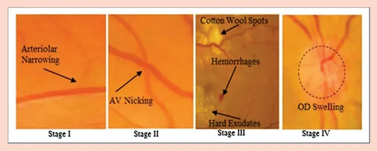
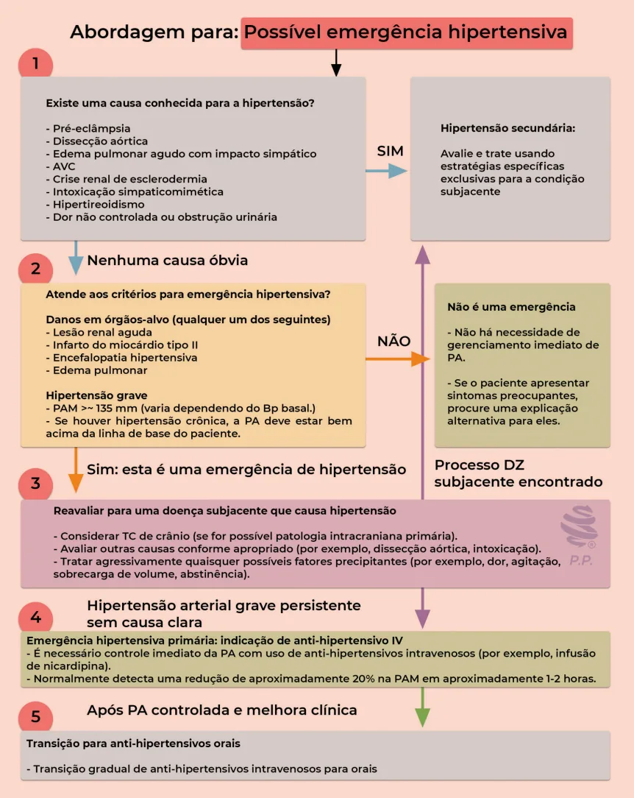
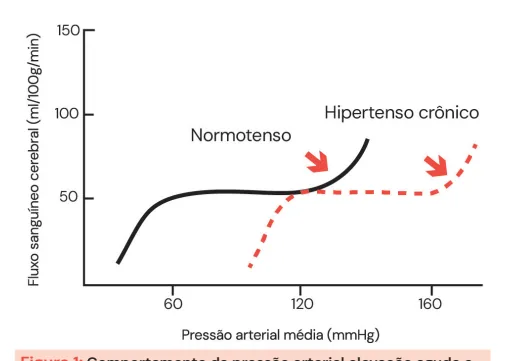
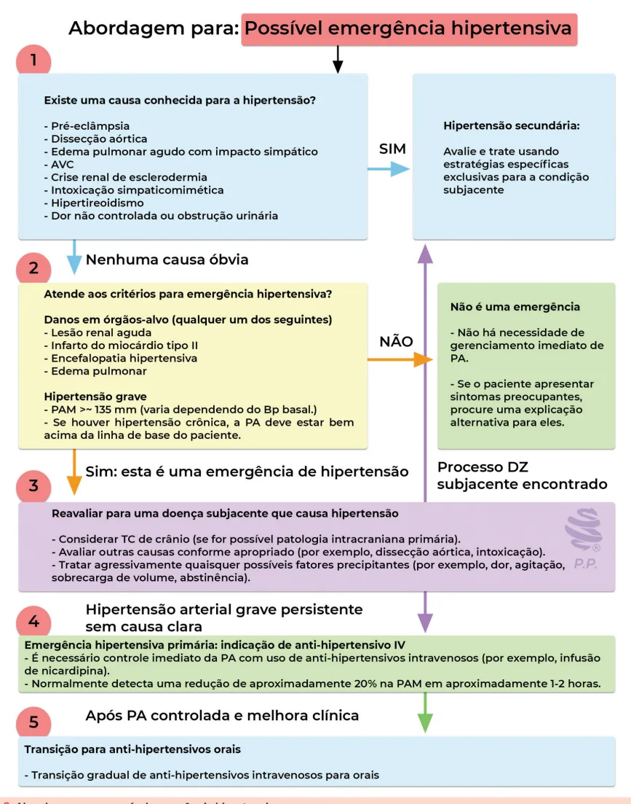
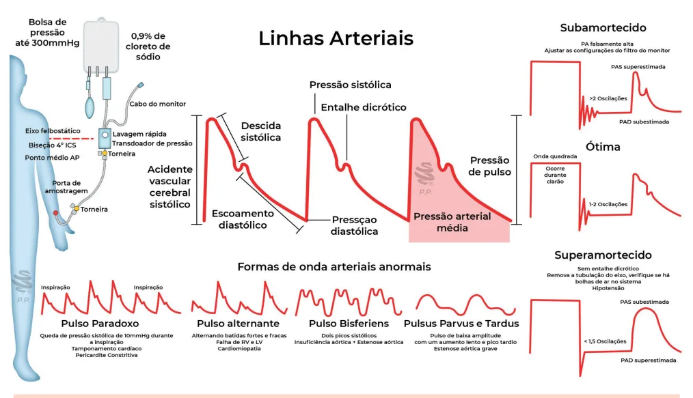
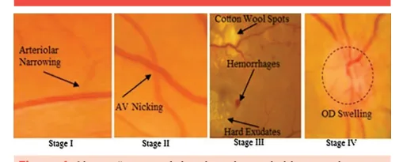

# emergências hipertensivas

<!-- page:1 -->

Emergência Hipertensiva (CM) EMERGÊNCIA HIPERTENSIVA

- PAS >180 mmHg e/ou PAD > 120 mmHg E lesão de órgão-alvo: Quais são os órgãos-alvo? Neurológico, cardíaco, vascular, renal.

- Na prova, o que é chamado de emergência hipertensiva? Encefalopatia hipertensiva, EAP hipertensivo, eclâmpsia, dissecção aórtica, infarto agudo do miocárdio com hipertensão associada, por simpatomiméticos; Mediante paciente com PA elevada e na suspeita de lesão de órgão-alvo, realizar investigação completa para identificar o caso.

AVC, crise renal esclerodérmica, intoxicação

- Tratamento: redução da PA, além do tratamento específico para condição alvo, se existente: Reduzir PA no primeiro momento em até 25%, com meta de normalização posteriormente → cada doença tem sua regra; Exceções: AVC (trombólise), dissecção aguda de aorta, AVCh.

Normal = PA precisa 1,5 - 2 oscilações D.V Onda quadrada SUPERamortecido = pressão arterial falsamente BAIXA <1,5 oscilações Ausência de incisura dicrótica Solução: Remova o excesso de tubos e quaisquer bolhas de ar.

SUBamortecido = pressão arterial falsamente ALTA <2 oscilações Espinhos artificiais adicionai Correção: ajuste as configurações do filtro no monitor - Utilizar vasodilatadores endovenosos (Brasil):

nitroglicerina e nitroprussiato: | Nitroglicerina mas utilizada em quadros que afetam o coração → IAM, edema agudo de pulmão.

- Depois, fazer o descalonamento com anti-hipertensivos orais.

## “URGÊNCIA HIPERTENSIVA (UH)”

- Termo que tende a deixar de ser utilizado → pressão arterial marcadamente elevada assintomática;

- Não precisa internar e pode ser tratada com anti-hipertensivos orais e encaminhamento ambulatorial.

- Avaliar fatores contribuintes para elevação de PA (que não EH): dor, agitação, hipervolemia, abstinência etc.

## PRESSÃO ARTERIAL INVASIVA

- Na lavagem do sistema, observamos a curva quadrada: Após, é possível ver se a PAI está normal, supramortecida ou subamortecida; O normal é que tenhamos um entalhe dicrótico seguido de um escoamento diastólico: Se apresentar mais de um entalhe, ou mesmo nenhum, necessita de regulação → não é possível confiar na curva.

Tabela 1: Classificação da retinopatia hipertensiva de KWB. Estreitamento arteriolar e alteração do Grupo I reflexo arteriolar leves Estreitamento arteriolar e alteração Grupo II do reflexo arteriolar mais acentuado e cruzamento arteríolo-venular Alterações do Grupo II, hemorragia Grupo III is retiniana e exsudatos Grupo IV Alterações do Grupo III e papiledema

---

<!-- page:2 -->

## CONCEITOS

| Eventos incomuns no departamento de emergência. Estimativas americanas afirmam que eles EMERGÊNCIA HIPERTENSIVA respondem por cerca de 1-2/1.000.000 casos;

- Como podemos definir um paciente com quadro de | As emergências mais comuns foram os emergência hipertensiva? eventos cerebrovasculares e o edema Pacientes com pressão sistólica > 180 mmHg ou pulmonar cardiogênico. Entre os órgãos afetados temos os sistemas:

pressão diastólica > 120 mmHg e com sinais de lesão de órgão-alvo; “URGÊNCIA” HIPERTENSIVA

- Termo em desuso, começou a ser chamada de neurológico (ex. encefalopatia hipertensiva); pressão arterial marcadamente elevada assintomática, cardíaco (ex. IAM tipo II); vascular (ex. EAP, anemia ou seja, elevação da pressão a valores de emergência hemolítica microangiopática); renal (ex. lesão hipertensiva, mas sem comprometimento do renal aguda). órgão-alvo.

- Sobre as emergências hipertensivas:

---

<!-- page:3 -->

## CLASSIFICAÇÃO E ABORDAGEM

| 10-20% nas primeiras 1h-2h do quadro; | 5-15% nas primeiras 24 horas até atingir 25% do

- As emergências hipertensivas são divididas em valor inicial; Primárias: a pressão arterial é o causador de

primárias e secundárias: | Posterior normalização se possível.

- Algumas fontes sugerem baixar 25% na primeira hora; Primárias: a pressão arterial é o causador de todo o problema: Exemplos: encefalopatia hipertensiva, IAM tipo II por hipertensão e lesão renal aguda. Secundárias: a doença tem sua própria fisiopatologia, mas a hipertensão é um contribuinte importante e deve ser tratada também: Exemplos: eclâmpsia, AVCi e AVCh, dissecção de aorta.

- Avaliar presença de TCE, presença de sintomas neurológicos (estupor, coma, agitação, delirium, AVC), papiledema, evidência de lesões hipertensivas, dor torácica, náuseas ou vômitos, dor nas costas de forte intensidade, dispneia, gestação, sinais de eclâmpsia, pré-eclâmpsia, uso de drogas: Realizar sempre avaliação clínica ampla, exames direcionados para sua hipótese diagnóstica e tratamento da PA junto ao quadro clínico.

Figura 1: Comportamento da pressão arterial elevação aguda e crônica.

## EXAMES COMPLEMENTARES

- Solicitar de acordo com a suspeita: ECG; RX; Urina tipo I; Eletrólitos e função renal; TSH e T4L; Troponina e BNP; TC crânio ou RNM de crânio; TC contrastada de aorta.

## TRATAMENTO

## EMERGÊNCIA HIPERTENSIVA

- O tratamento ideal da emergência hipertensiva varia de acordo com a emergência em questão, mas temos algumas medidas gerais – com algumas exceções: Não abaixar a pressão muito rápido.

- Lembrar a regrinha de ouro: - Algumas fontes sugerem baixar 25% na primeira hora;

- Talvez seja mais adequado o uso da PAM, é o que o manguito realmente está medindo: PAM provavelmente tem uma correlação melhor;

o risco parece estar mais associado à PAD do que à PAS; é mais fácil de se guiar através da PAM (1 variável apenas).

Exceções - conduta segundo a lesão de órgão-alvo

- Acidente vascular encefálico isquêmico: se trombólise Após trombólise, manter <180x105.

→ manter PA < 185/110mmHg; se não → tolerar até 220/120mmHg:

- Dissecção aguda de aorta: a pressão arterial sistólica deve ser reduzida rapidamente para 100-120mmHg (PAS): Lembre-se de sempre utilizar primeiro o betabloqueador e depois o vasodilatador → vasodilatador pode causar uma taquicardia reflexa.

- Acidente vascular cerebral hemorrágico: normalmente pressão arterial sistólica mantida entre 140-160 mmHg.

Classificação dos agentes anti-hipertensivos

- Agentes tituláveis: duração da ação menor que Devem ser dados em infusão contínua; Exemplos: nitroglicerina, nitroprussiato, esmolol e clevedipina.

30 minutos:

- Agentes quase tituláveis: duração da ação entre 1-2h: Administrados em infusão contínua, mas com manejos mais complicados; Exemplos: diltiazem, nicardipina.

- Agentes não tituláveis (bolus): duração da ação maior que 1-2 horas: Medicações administradas em bolus; Exemplos: labetalol, metoprolol.

Medicamentos

- Nitroglicerina: Promove vasodilatação coronariana; Tem meia-vida curta; Contraindicações: utilização de inibidores da fosfodiesterase; hipertensão intracraniana; PRESS; Efeitos adversos: dor de cabeça, taquicardia reflexa e taquifilaxia.

- Nitroprussiato de sódio: Tem meia vida-curta; Pode ocasionar roubo de fluxo coronariano, aumento da pressão intracraniana e variações abruptas de pressão arterial; A infusão contínua piora a acidose lática e pode promover intoxicação por cianeto.

- Transacionar as medicações em endovenosas para a via oral: Bloqueadores de canais de cálcio; IECA/BRA; Hidralazina; Nitratos; Betabloqueadores; Clonidina.

---

<!-- page:4 -->

## “URGÊNCIA” HIPERTENSIVA

- Sempre acalmar o paciente quanto à benignidade do

- Não há necessidade de admissão ou encaminhamento quadro e não necessidade de tratamento intensivo hospitalar e tratamento agressivo da PA na emergência;

desses pacientes:

- Verificar Figura 2 O tratamento é com anti-hipertensivos

## PRESSÃO ARTERIAL INVASIVA (PAI)

orais e encaminhamento para acompanhamento ambulatorial.

- Sempre avaliar tratar condições que podem estar

- Avaliação mais precisa da pressão arterial:

levando o paciente a apresentar aumento da | Geralmente útil na emergência hipertensiva. pressão arterial:

- É importante avaliar uma ascensão (pressão de pulso), Dor: analgesia adequada; seguida de uma descida (descida sistólica), seguida de Agitação: benzodiazepínicos, antipsicóticos; um entalhe dicrótico que marca e início do escomento Hipervolemia: diuréticos; diastólico. “Linhas Arteriais”. Figura 2 ; Abstinência: benzodiazepínicos, opióides; Retenção urinária: sondagem vesical.

Figura 2: Abordagem para possível emergência hipertensiva.

---

<!-- page:5 -->

Figura 3: Funcionamento e curvas da PAI.

- Nota nas curvas à direita da imagem que, na lavagem do sistema, observamos a curva quadrada: Após, é possível ver se a PAI está normal, supramortecida ou subamortecida; O normal é que tenhamos um entalhe dicrótico seguido de um escoamento diastólico: Se apresentar mais de um entalhe, ou mesmo nenhum, necessita de regulação → não é possível confiar na curva.

RETINOPATIA HIPERTENSIVA Figura 4: Alterações e estágios da retinopatia hipertensiva. “Legenda da imagem na tabela ao lado” Tabela 1: Classificação da retinopatia hipertensiva de KWB.

Grupo Estreitamento arteriolar e alteração do reflexo I arteriolar leves Estreitamento arteriolar e alteração do reflexo Grupo arteriolar mais acentuado e cruzamento II l arteríolo-venular Grupo Alterações do Grupo II, hemorragia retiniana e III exsudatos Grupo Alterações do Grupo III e papiledema IV

## REFERÊNCIAS

Figura 2: Abordagem para possível emergência hipertensiva. Adaptado de EMCrit. EMCrit Project. Disponível em: https://emcrit.org.

Figura 4: Alterações e estágios da retinopatia hipertensiva. Shahzad Akbar, et al; Decision support system for detection of hypertensive retinopathy using arteriovenous ratio, Artificial Intelligence in Medicine, Volume 90, 2018.

