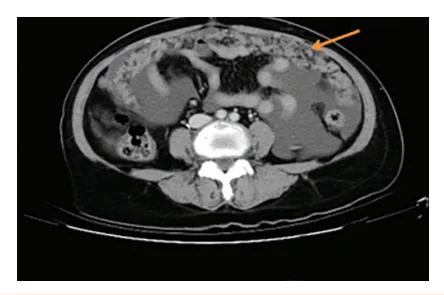
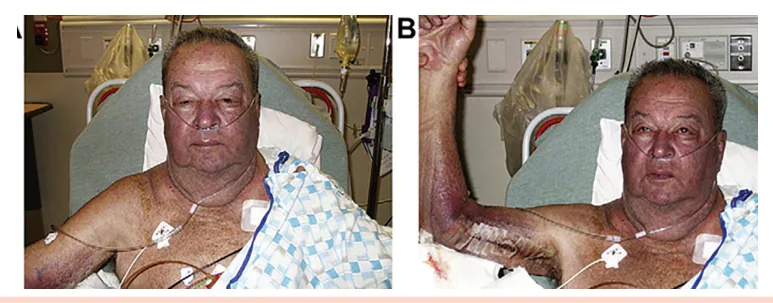
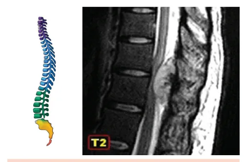

# Emergências Oncológicas

<!-- page:1 -->

Emergências Oncológicas (CM) Obstrução intestinal maligna

- Ausência de fezes e flatos + dor + náuseas e vômitos;

- Condutas: Jejum + sonda nasogástrica (SNG) aberta

+ terapia medicamentosa;

- Condutas medicamentosas: opioides fortes, dexametasona, antieméticos;

Evitar metoclopramida. Síndrome da veia cava superior

- Edema de membros superiores e face + pletora facial;

- Conduta: + tratamento da neoplasia

(biópsia é fundamental); Hipercalcemia da malignidade

- Condição associada a mau prognóstico;

- Conduta: hidratação vigorosa + bisfosfonatos + tratamento da neoplasia.

## OBSTRUÇÃO INTESTINAL

## MALIGNA

- Obstrução intestinal em pacientes com comprometimento neoplásico intra-abdominal e/ ou pélvico.

## NEOPLASIAS MAIS ASSOCIADAS

- 20–50%: trato ginecológico, principalmente ovário;

- 10–28%: trato gastrointestinal, especialmente colorretal e gástrico;

- Frequente em pacientes com carcinomatose peritoneal.

## QUADRO CLÍNICO

- Dor abdominal em cólica;

- Distensão abdominal;

- Náuseas e vômitos – principal;

- Parada da eliminação de flatos e fezes ou diarreia paradoxal.

## EXAME FÍSICO

- Ausência de ruídos hidroaéreos → considerar oclusão intestinal maligna;

- Presença de som metálico → considerar suboclusão intestinal maligna.

TIPOS DE OBSTRUÇÃO Mecânica

- Extrínseca: Compressão; Radiação (fibrose actínica); Aderências.

Intrínseca

- Obstrução direta pelo tumor;

- Linite gástrica. Síndrome de compressão medular

- Dor + déficit motor/sensitivo;

- Diagnóstico: RNM de coluna total; tratamento a cirúrgico ou radioterapia.

Neutropenia febril

- Febre + neutropenia;

- Estratificar risco com escore MASCC (maior ou igual a 21 é baixo risco);

- Baixo risco: ciprofloxacino + amox-clavulanato;

- Alto risco: Cefepime (ou tazocin) + avaliar critérios para vancomicina.

Síndrome de lise tumoral

- Aumento de ácido úrico, potássio e fósforo e queda do cálcio;

- Conduta inicial: hidratação vigorosa.

Funcional

- Infiltração: Mesentério; Nervos envolvidos na motilidade.

- Neuropatia paraneoplásica;

- Íleo paralítico secundário;

- Infecções: Ascite Afecções intra ou retroperitoneais. Medicamentos.

## EXAMES COMPLEMENTARES

- Radiografia de abdome: em posição supina; exame inicial; baixa sensibilidade; Obstrução de delgado: evidenciada com, ao menos, dois níveis hidroaéreos; Obstrução de cólon: observa-se cólon proximal dilatado e o cólon distal sem ar.

- Tomografia computadorizada de abdome com contraste intravenoso: Exame de escolha: apresenta sensibilidade de 93% e especificidade de 99%; Objetivos: Diagnosticar carcinomatose; Confirmar obstrução mecânica e sua topografia; Identificar possíveis emergências cirúrgicas Estabelecer diagnóstico diferencial com bridas, principalmente.

(perfuração, p. ex.);

- Radiografia com contraste baritado oral;

Ressonância nuclear magnética RNM) abdominopélvica.

- Verificar Figura 1 na próxima página

---

<!-- page:2 -->

## CONDUTAS

- Jejum ou dieta líquida;

- Sonda nasogástrica aberta;

- Corticosteroide → dexametasona 8 mg, intravenosa,

2x ao dia (na literatura, recomenda-se doses de

- Figura 1: Nível hidroaéreo.

- O

- Figura 2: Tomografia computadorizada de abdome com infiltração peritoneal difusa e ascite.

- TRATAMENTO FARMACOLÓGICO

- Corticosteróides – principalmente dexametasona: Redução do edema peritumoral; Apresenta efeito antiemético central; S Idealmente, deve ser utilizado por pelo menos

10 dias.

- Antieméticos: Redução de náuseas e vômitos; Haloperidol: 1° linha; Antagonista 5-HT3: 2° linha; Metoclopramida: usada somente nos casos de obstrução incompleta pelo efeito pró-cinético A olanzapina é um antipsicótico que também pode ser uma opção para controle de náuseas e vômitos.

(pode piorar cólicas); E

- Inibidor de bomba de próton (exemplo: omeprazol): Redução da secreção gástrica; Redução do refluxo biliar; Promove alívio da dor esofágica.

- Anticolinérgicos (escopolamina): Útil para o manejo de vômitos e dor em cólica em pacientes com oclusão total; Contraindicação: glaucoma, retenção urinária; Efeitos colaterais: boca seca, taquicardia, agitação.

- Análogo de somatostatina (octreotida): Inibe a secreção de VIP e substância P; Redução do fluxo esplâncnico e portal; Redução da secreção do delgado e motilidade gastrointestinal; Aumenta a reabsorção gastrointestinal de água e eletrólitos. 2x ao dia (na literatura, recomenda-se doses de

6-16mg/dia);

- Analgésicos: Opióide → Morfina 2 mg, intravenosa, de 4 em 4 horas; Escopolamina, 20 mg, intravenosa, de 6 em 6 horas (se obstrução total) - efeito antissecretor e antiespasmódico.

- Antieméticos: Ondansetrona 8 mg, intravenosa, de 8 em 8 horas; Haloperidol 1 mg, intravenosa, de 8 em 8 horas; Evitar metoclopramida até que seja descartada obstrução total.

- Caso o paciente não apresente melhora após 3-5 dias subcutânea ou intravenosa) - efeito antissecretor.

→ associar octreotide (150 mcg, de 6 em 6 horas, via

## OUTRAS OPÇÕES TERAPÊUTICAS

- Cirurgia: apenas para os casos selecionados de obstrução localizada/ ponto único ou abdome agudo

→ avaliar a proporcionalidade;

- Tratamento oncológico específico – apenas em pacientes com boa performance e em neoplasias quimiossensíveis;

- Outras terapias de suporte: stents metálicos, autoexpansivos, gastrostomia descompressiva.

## SÍNDROME DA VEIA CAVA

## SUPERIOR

- É qualquer condição que leve à obstrução do fluxo sanguíneo através da VCS;

- Fisiopatologia: Compressão extrínseca (principal), invasão tumoral direta à VCS e trombose venosa (pode estar associada a cateter).

## ETIOLOGIA

- 50% - câncer de pulmão não pequenas células;

- 25-35% - câncer de pulmão pequenas células;

- 10 - 15% - linfoma não Hodgkin;

- 20% - outras causas benignas: Trombose de cateter (grande maioria): port-o-cath, Fibrose vascular (radioterapia prévia).

PICC, catéter de diálise; Atentar para faixa etária do paciente. Em um paciente jovem, a etiologia de linfoma é mais frequente do que de câncer de pulmão, por exemplo.

- Confirmação histológica e diagnóstica com biópsia é fundamental, pois até 60% dos pacientes se apresentam com síndrome de veia cava superior sem sintomas prévios da neoplasia.

---

<!-- page:3 -->

- Emergência:

- O quadro clínico é exuberante, contudo | Se edema cerebral, estridor laríngeo ou raramente é emergência! comprometimento hemodinâmico;

- Manifestações: | Terapia endovascular – rápido alívio sintomático Edema de face (82%), pescoço e membros (46%); (stent / trombectomia). Estase jugular (63%) e circulação colateral (53%);

- Outras condutas possíveis: Dispneia (54%) e tosse (54%); | Diuréticos: pode ser considerado, porém atentar Pletora facial, rouquidão. para hipovolemia; Em quadros mais graves: | Corticosteroides: úteis em neoplasias Alteração do nível de consciência; respondedoras, como linfomas e timomas, Compressão traqueal; entretanto podem gerar falso negativo em Edema laríngeo caracterizado por estridor. biópsias. Portanto, realizar apenas após a Sinal de Pemberton: ao elevar os membros confirmação histopatológica.

superiores, ocorre aumento da pletora facial.

## HIPERCALCEMIA DA MALIGNIDADE

- Verificar Figura 3 paciente com síndrome de veia cava superior. DADOS EPIDEMIOLÓGICOS

Pletora facial ao elevar os membros superiores em

- Ocorre em até 30% dos pacientes oncológicos no

DIAGNÓSTICO curso da doença;

- Angiotomografia de tórax;

- Prevalência estimada em 2-3%;

- Biópsia – diagnóstico histopatológico para definição

- Tumores mais associados:

de etiologia. | Câncer de pulmão não pequenas células (sobretudo escamoso); TRATAMENTO | Câncer de mama;

- Estabilização clínica: | Mieloma múltiplo; Protocolo ABC; | CEC de cabeça e pescoço; Cabeceira elevada; | Carcinoma urotelial e tumores renais. Restrição hídrica;

- É 4x mais comum em pacientes estádio clínico IV; Suporte de O2;

- Demonstra pior prognóstico; Evitar hipervolemia.

- Mortalidade em 30 dias → Até 50%.

- O tratamento principal consiste em tratar a neoplasia de base! Esse tratamento deve ser realizado após a ETIOLOGIAS definição etiológica pela biópsia:

- Secreção de PTHrp – maioria dos casos (80%); Quimioterapia:

- Metástases osteolíticas (20%) – ativação tumoral Tratamento inicial para tumores sensíveis de osteoclastos;

→ câncer de pulmão de pequenas células,

- Produção de 1,25-dihidroxivitamina D (<1%) – linfomas.

linfoma não-Hodgkin ou câncer de

- Secreção ectópica de PTH (<1%) – ovário, pulmonar células germinativas; pequenas células, medular de tireoide. Melhora sintomática em 1 – 2 semanas; Radioterapia: Avaliar em tumores radiossensíveis; Melhora sintomática em 72h. Se trombose venosa associada → anticoagulação plena.

Figura 3: Sinal de Pemberton.

---

<!-- page:4 -->

## QUADRO CLÍNICO DIAGNÓSTICO DIFERENCIAL

Tabela 1: Quadro clínico da hipercalcemia da malignidade,

- Hiperparatireoidismo primário: Hipercalcemia;

conforme tempo de instalação da hipercalcemia. | PTH elevado/normal-alto; Agudas Crônicas | Hipofosfatemia (PTH eleva a fosfatúria);

Agudas Crônicas Anorexia, náusea, Dispepsia, Gastrointestinais vômitos obstipação

- Poliúria, polidipsia estupor, coma bloqueio atrioventricular,

Renais Nefrolitíase Confusão mental, Neuromusculares Fraqueza Bradicardia, Cardíacas Hipertensão QT curto

- Classificação

- Hipercalcemia: Leve: 10,5 – 11,9 mg/dL; Moderado: 12 – 13,0 mg/dL; Grave: > 14 mg/dL.

- Verificar Figura 4

Homeostase óssea PTHrP & PTH Vitamina D Metástase osteolítica -75% hid A r lf o a x - il 1 a - se -20% I

- Osteoblasto - RANKL dihidrox 1 ic , 2 o 5 le - c alciferol Ca++

- Mam T a G , O U. v T á G rio I, , C L C in P f , oma, Ovário e Linfoma Mama e MM

- Paratireoide da malignidade.

Figura 4: Alteração da homeostase do cálcio na hipercalcemia Homeostase Hormônios Vitamina 1, 25PTH Calcitonina dihidroxicolec Intestin Vitamina D Figura 5: Homeostase óssea fisiológica. | Hipofosfatemia (PTH eleva a fosfatúria);

| Calciúria de 24h > 200; | Fração de excreção de cálcio > 1%.

- Verificar Figura 5

## HOMEOSTASE DO CÁLCIO

Em 80% dos casos, há presença de adenoma solitário; enquanto em 20%, há hiperplasia das parótidas.

- Hipercalcemia hipocalciúrica familiar: Diferencia-se do hiperparatireoidismo pela calciúria reduzida; Ao restante, mantém o mesmo perfil de alterações laboratoriais.

- Hipercalcemia associada a doença granulomatosas: Por produção de vitamina D → granulomatose com poliangiite, sarcoidose, tuberculose, hanseníase.

Mieloma múltiplo tipicamente não eleva fosfatase alcalina!

## ABORDAGEM TERAPÊUTICA

Investigação

- Solicitação do cálcio iônico, PTH e vitamina D;

- Corrigir o valor de cálcio total (CaT) para albumina se cálcio iônico indisponível;

- CaT corrigido = CaT (mg/dL) + 0,8 (4 – albumina (g/dL).

- Verificar Figura 6 e óssea a D Células ósseas calciferol no RANKL RANK osteoprotegerina

Osteoblastos Osteoclastos

---

<!-- page:5 -->

Abordagem Tratamento específico de acordo com mecanismo etiológico Redução PTH Aumento Calciurese *Calcitonina *Hidratação Redução de absorção Redução de reabsorção óssea intestinal de cálcio *Bifosfonatos *Glicocorticoides *Denosumabe Figura 6: Esquema ilustrativo para tratamento da hipercalcemia da malignidade.

Tratamento geral | Contudo, apresenta efeito rápido e fugaz → pode

- Hidratação intravenosa: 200 – 300 mL/h de cursar com taquifilaxia.

soro fisiológico;

- Corticosteroide:

- Débito urinário: 100 – 150 mL/hora; | Útil para quadros associados à produção de

- Furosemida: 20 – 40 mg, intravenosa, se 1,25-dihidroxivitamina D.

houver hipervolemia.

- Hemodiálise:

Tratamento específico | Considerar em casos graves e refratários com

- Inibidores da reabsorção óssea: insuficiência cardíaca severa e/ou doença renal Pamidronato 60 - 90 mg, intravenoso, em 2h: crônica/injúria renal aguda. ClCr < 30 ml/min - não recomendado; ClCr maior ou igual a 30 - sem necessidade Suspender a administração de lítio, tiazídicos e a de ajuste. reposição de cálcio! Ácido zoledrônico 4 mg, intravenoso, em 15 – Mais eficaz que o pamidronato no tempo para

30 minutos:

## SÍNDROME DE COMPRESSÃO

controle da calcemia;

## | Cr > 4,5 mg/dL - uso não recomendado; MEDULAR

| No caso de hipercalcemia da malignidade, não é necessário o ajuste para a função renal (no uso

- Ocasionada por compressão, deslocamento ou em outros cenários, o ajuste para a função renal, encarceramento do saco dural que envolve a medula é realizado de maneira diferente). espinhal ou a cauda equina por lesão neoplásica;

- Até 50% dos pacientes têm acometimento em mais de mandíbula, fraturas atípicas de fêmur, uveíte,

Efeitos colaterais do ácido zoledrônico: osteonecrose de uma área da coluna;

- Ocorre em até 5% dos pacientes com neoplasia sintomas flu-like, disfunção renal. avançada nos últimos 2 anos de vida. Denosumabe 120 mg, subcutâneo: Anticorpo contra o RANKL, molécula secretada pelos osteoblastos que irá ativar os osteoclastos e, assim, estimular reabsorção óssea; Opção em pacientes com doença renal grave para os quais os bisfosfonatos estão contraindicados; Considerar em casos refratários ao ácido zoledrônico.

Outras opções terapêuticas

- Calcitonina: Esquema: 4 – 8 UI/kg, subcutânea ou intravenosa; Considerar iniciar em conjunto com bifosfonatos em cálcio total >14 mg/dL para redução mais Figura 7: Compressão do saco dural envolvendo a medula rápida da calcemia enquanto o efeito ótimo do espinhal.

bisfosfonato ainda não iniciou;

---

<!-- page:6 -->

## LOCALIZAÇÃO DA COMPRESSÃO MEDULAR

- Analgesia com uso de opioides fortes;

- 10% cervical;

- Profilaxia para TEV (tromboembolismo venoso);

- 60-70% torácica;

- Repouso:

- 20-30% lombossacra. | Coluna instável → repouso no leito e imobilização com órteses;

## TUMORES MAIS ASSOCIADOS

- Câncer de pulmão (25%);

- Câncer de próstata (16%);

- Mieloma múltiplo (11%);

- Câncer de mama (7%).

- Dor: É o sintoma mais comum; ocorre em até 95% dos casos; Precede os sintomas neurológicos; Pior à noite.

- Déficit motor: 2° sintoma mais comum; Lesão de 1° neurônio motor → Babinski C positivo e hiperreflexia.

- Déficit sensorial: Auxilia a localizar o nível de compressão medular; Costuma ocorrer antes do déficit motor.

- Déficit autonômico: Disfunção esfincteriana urinária e intestinal.

## DIAGNÓSTICO E INVESTIGAÇÃO

- O diagnóstico precoce e o rápido início terapêutico são essenciais para limitar a ocorrência de sequelas

(iniciar o tratamento na suspeita do diagnóstico);

- Exames complementares: 1° opcão: RNM de coluna cervical + torácica + lombar + sacral (idealmente em 24h da suspeita); Alternativa: tomografia computadorizada de coluna cervical + torácica + lombar + sacral. Toda a coluna deve ser avaliada uma vez que é muito comum existirem mais de um sítio de metástase.

- Importante: se não há diagnóstico prévio de neoplasia, deve-se considerar investigação de sítio primário (mamografia, tomografia computadorizada de abdome/tórax, PET-CT, PSA) e biópsia da lesão em coluna.

Em oncologia, saber de qual tumor se trata é essencial para o planejamento terapêutico. TRATAMENTO

- Corticosteroide: Dexametasona 10 mg, intravenosa em bolus, A seguido de 4- 6 mg de 6 em 6 horas; Redução do edema vasogênico decorrente da isquemia medular; Ivermectina 12 mg, oral, em dose única (profilaxia de estrongiloidíase disseminada pelas altas doses de corticoide), omeprazol (profilaxia de úlcera gástrica pelas altas doses de corticoide) e controle glicêmico. com órteses; Coluna estável →não indicado repouso absoluto.

- Cirurgia é a escolha, principalmente se: Déficits com pouco tempo de instalação (< 72 horas); Instabilidade de coluna (suspeitar se piora considerável à movimentação); Tumores pouco sensíveis à radioterapia.

- Radioterapia é a escolha, principalmente se: Tumores radiossensíveis.

- E a quimioterapia de urgência? Raramente feita. Geralmente tumor não é altamente quimiossensível; Pode demorar dias a semanas para ter efeito.

## NEUTROPENIA FEBRIL

## CRITÉRIOS DIAGNÓSTICOS

- Febre: Temperatura oral ≥ 38,3 °C em uma medida ou temperatura oral ≥ 38,0 °C, por 1 hora.

- Neutropenia: < 500 neutrófilos ou < 1000 neutrófilos com previsão de queda em 48 horas;

- Neutropenia prolongada (>7 dias): maior risco de infecções clinicamente significativas;

No geral, a contagem de neutrófilos atinge seu nadir de <500 em uma mediana de 12 a 14 dias a partir do primeiro dia de quimioterapia.

- 10 – 50% dos pacientes com neoplasias sólidas em tratamento;

- É frequente em tumores hematológicos, alcançando

80% dos pacientes;

- Quando suspeitar: quimioterapia nas últimas 6 semanas + febre (mesmo que referida pelo paciente).

Tabela 2: Classificação da gravidade da neutropenia. Leve ≥1000 a 1500 Moderada ≥500 e <1000 Grave <500 Profunda <100 Tempo de internação médio: 9,6 dias;

mortalidade: 10%. AVALIAÇÃO INICIAL

- Exame físico completo: Incluindo avaliação de pele, orofaringe, genitália; Não realizar toque retal! Há risco de translocação bacteriana.

- Exames complementares: Laboratoriais: Hemograma; Função renal; Função hepática;

---

<!-- page:7 -->

| Eletrólitos; CONDUTAS | Provas de atividade inflamatória;

- Admissão, triagem, coleta de exames laboratoriais Hemocultura: 2 pares com 10 mL por frasco – um (incluindo culturas) e avaliação de cateteres par de cateter, se houver; (se presentes); Urina tipo 1;

- Tempo porta-antibiótico: < 60 minutos (alguns Urina tipo 1; Urocultura; Radiografia de tórax; Considerar painel viral se síndrome gripal.

- Agentes bacterianos → depende do perfil do hospital!

- Patógenos gram-positivos comuns: Staphylococci coagulase negativo; Staphylococcus aureus, incluindo meticilina-resistente; Enterococcus spp, incluindo vancomicina-resistente; Streptococcus viridans; Streptococcus pneumoniae; Streptococcus pyogenes.

- Patógenos gram-negativos comuns: Escherichia coli; Klebsiella spp; Enterobacter spp; Pseudomonas aeruginosa; Citrobacter spp; Acinetobacter spp; Stenotrophomonas maltophilia.

## MASCC SCORE

- Para classificar o risco!

- Baixo risco para valores ≥ 21.

Tabela 3: Critérios de MASCC (Multinational Association of Supportive Care in Cancer). Características Pontuação “Carga” de doença (considerando todas as comorbidades)

Sintomas leves ou ausentes 5 Sintomas moderados 3 Sem hipotensão 5 Sem DPOC 4 Tumor sólido ou hematológico sem infecção fúngica Sem desidratação 3 Paciente ambulatorial (não internado no início NF)

Idade < 60 anos 3 - Tempo porta-antibiótico: < 60 minutos (alguns especialistas sugerem <30min);

- Baixo risco (≥ 21): Antibioticoterapia oral: amoxicilinaclavulanato + ciprofloxacino; Alérgicos à penicilina: clindamicina; A primeira dose de antibiótico deve ser realizada de modo intravenoso, em ambiente hospitalar; Observação: de 4 – 24 horas → caso estável, manter tratamento ambulatorial, via oral.

- Alto risco: Tratamento intra-hospitalar; Antibioticoterapia de amplo espectro: A escolha inicial depende do protocolo institucional; Piperacilina-tazobactam ou cefepime; Carbapenêmico – menos frequente.

Para os casos com presença de infecção recente por bactéria multidroga resistente, guiar a terapêutica pela última cultura.

- Adicionar cobertura para gram-positivos com vancomicina se estiverem presentes os critérios da associadas à cateter hemodinâmica quinolona de neutropenia febril de 2024 recomenda contra a adição empírica de vancomicina nas seguintes situações: pneumonia, mucosite, colonização prévia e febre persistente ou recorrente.

Tabela 4. Alternativa: Linezolida. Tabela 4: Critérios para adição de vancomicina. Suspeita de infecções Pneumonia documentada HMC com cocos gram + Instabilidade *** Infecção de pele Mucosite grave *** ATB profilático com Colonização prévia *** A Associação Brasileira de Hematologia, Terapia Celular e Hemoterapia (ABHH) em seu consenso

- Reavaliação a cada 48 – 72 horas, se não houver melhora: Reavaliar antibiótico (considerar ampliar a cobertura); Considerar novos exames, como tomografia computadorizada de tórax e dos seios da face cultura para fungos, Considerar adicionar antifúngico empírico: após em pacientes neutropênicos de alto risco que se espera que tenham uma duração total de neutropenia >7 dias (nos quais a reavaliação sistemática não apontou uma causa):

(foco infeccioso oculto/fechado), galactomanana, 4 a 7 dias de febre persistente ou recorrente

---

<!-- page:8 -->

| Equinocandinas;

- Aumento da incidência nos últimos anos em Anfotericina B; tumores sólidos pelo surgimento de terapias mais Voriconazol. eficazes, apesar de manter maior incidência em Outros exames guiados pelos sintomas: tumores hematológicos. Se diarreia → pesquisar Clostridium, Tabela 5: Se diarreia → pesquisar Clostridium, coprocultura, protoparasitológico de fezes; Tomografia computadorizada de abdome → para avaliação de colite neutropênica.

## TEMPO PARA TRATAMENTO

- Caso seja identificado o foco: Guiar o antibiótico e o tempo de tratamento para o foco! (ex.: infecção de corrente sanguínea, broncopneumonia, colite).

- Sem foco definido: Manter antibioticoterapia até: Paciente afebril por 48 horas; Culturas negativas e neutrófilos > 500 céls/mm3 e em ascensão.

## USO DE FATOR ESTIMULADOR DE COLÔNIAS

## GRANULOCÍTICAS (G-CSF)

- Regra geral: Sem indicação de uso para pacientes na vigência de neutropenia febril → apenas reduz o tempo de internação e não altera a sobrevida global; Se houver risco de neutropenia da quimioterapia ≥ Em pacientes com episódio prévio de neutropenia febril, indicado como profilaxia secundária nos ciclos subsequentes de quimioterapia (OBS: Sem indicação de redução de dose de quimioterapia L para pacientes que já tiveram neutropenia febril). L g

20% → indicado como profilaxia primária!

## SÍNDROME DE LISE TUMORAL

l

- Síndrome causada a partir da liberação maciça de componentes intracelulares na corrente sanguínea por lise tumoral;

- É mais comum a ocorrência após o início do tratamento (até 7 dias após);

- Fatores de risco: Disfunção renal prévia; Desidratação; Tumores de alta taxa proliferativa; Grande volume de doença; Alta sensibilidade ao tratamento instituído. Tabela 5: Tumores sólidos mais associados à síndrome de lise tumoral.

Tumores Sólidos Câncer de pulmão de pequenas células Tumores germinativos (ex: testículo) Sarcomas e melanomas metastáticos Meduloblastoma e neuroblastoma Câncer de próstata metastático Câncer de mama metastático Tabela 6: Tumores hematológicos mais associados à síndrome de lise tumoral.

Tumores hematológicos Leucemia linfoblástica aguda (LLA) Leucemia mieloide aguda (LMA) Linfoma não-hodgkin (LNH)

LLC, LMC, Linfoma de Hodgkin LSN: limite superior de normalidade; ATLL: Leucemia/ Linfoma de Células T do Adulto; DGCB: difuso de grandes células B; DHL: desidrogenase lática ou lactato desidrogenase.

- Não é necessário decorar a tabela acima, entretanto apenas “bata o olho” para perceber que certas neoplasias (ex.: linfoma de Burkitt) apresentam maior risco de desenvolver síndrome de lise tumoral, sobretudo quando há alto volume de doença e turnover celular;

- A depender do risco de síndrome de lise tumoral, diferentes estratégias de profilaxia são propostas, como será discutido abaixo.

- Verificar Tabela 7 na próxima página

---

<!-- page:9 -->

## ESTRATIFICAÇÃO DE RISCO

Tabela 7: Estratificação de risco de síndrome de lise tumoral. Doença de baixo risco (< 1% risco Doença de risco intermediário (1–5% risco Doença de alto risco (>5% risco de SLT) de SLT) de SLT)

de SLT) d Tumores sólidos quimioterapia (n A maioria dos tumores sólidos de células germin com doença vol ava Mieloma múltiplo Linfoma de c Linfoma de célul linfoma DGCBC, l Leucemia mieloide crônica transformação, lin LSN sem Linfoma de célul Linfomas não Hodgkin indolentes linfoma DGCBC, l (zona marginal, folicular)

DHL ≥ 2x o LS LLA (leucemia lin Linfoma de Hodgkin leucócitos < 100 Leucemia linfocítica crônica (LLC) LLC tratada com v com contagem de linfócitos < 50 de linfócitos ≥ 25 m mil sem tratamento com venetoclax, com citopenia sign sem citopenia significativa claro b Leucemia mieloide aguda (LMA)

LMA com contage com contagem de leucócitos de 25 a < 25 x 10⁹/L Doença de risco intermediário com ácido úrico, fósforo e/ou fosfato acima do LSN

## ESTRATÉGIAS DE PROFILAXIA

Tabela 8: Profilaxia da síndrome de lise tumoral de acordo com a Baixo risco Risco in Sem indicação de monitoramento Controle labora laboratorial médico Hidratação via oral Hidr Sem indicação de profilaxia Alop com alopurinol de SLT) de SLT)

altamente sensíveis à neuroblastoma, tumor Linfoma difuso de grandes células nativas, tumor de Wilms B em estádio III/IV com LDH ≥ 2x lumosa ou em estágio o LSN ançado)

células plasmáticas Linfoma plasmablástico las T periféricas, ATLL, linfoma do manto com Linfoma de Burkitt nfoma com DHL ≥ 2x o m massa bulky Linfoma de células T periféricas, las T periféricas, ATLL, ATLL, linfoma DGCBC, linfoma do linfoma do manto com manto com massa bulky e DHL ≥ SN sem massa bulky 2x o LSN Leucemia linfoblástica Aguda com nfoblástica aguda) com leucócitos > 100 x 10⁹/L e DHL ≥ 0 x 10⁹/L e DHL ≤ o LSN 2x o LSN venetoclax e contagem LLC tratada com venetoclax e mil ou linfócitos < 25 mil linfócitos ≥ 50 mil com citopenia nificativa e alto risco de significativa basal elevado em de glóbulos brancos LMA com contagem de glóbulos a 100 x 10⁹/L brancos > 100 x 10⁹/L Doença de risco intermediário — com disfunção renal ou envolvimento renal classificação de risco.

ntermediário Alto risco atorial a critério do Controle laboratorial diário é especialista recomendado ratação* Hidratação* purinol** Alopurinol** Rasburicase***

---

<!-- page:10 -->

* Hidratação com objetivo de manter o débito urinário | Potencial de lise: maior que 2 mL/kg/hora. Se necessário, o uso de | Alta taxa de proliferação;

diuréticos pode ser feito. | Sensibilidade ao tratamento oncológico; ** Alopurinol: Dose: 100 mg VO a cada 8h, podendo ser | Intensidade da terapia;

reduzida pela metade em contexto de lesão renal aguda. | Desidrogenase lática ou lactato desidrogenase reduzida pela metade em contexto de lesão renal aguda.

*** Rasburicase: Indicada para pacientes com hiperuricemia prévia, com ácido úrico > 7,5 mg/dL.

- Dose: rasburicase 0,15 – 0,2 mg/kg uma vez ao dia, variando de 1 a 7 dias a depender do quadro clínico e evolução laboratorial.

Contraindicada em pacientes com histórico consistente de deficiência de G6PD. DIAGNÓSTICO

- Critérios de Cairo-Bishop: Laboratoriais: 2 ou mais exames alterados ou; Q Clínico-laboratoriais: síndrome de lise tumoral laboratorial + 1 dos critérios clínicos.

- Tabela 9: Critérios laboratoriais de Cairo-Bishop.

- Síndrome de lise tumoral laboratorial aumento de 25% aumento de 25% queda de 25%

Anormalidade metabólica Critério Superior a 4.5 mg/dl Hiperfosfatemia Superior a 6 mmol/L ou Hiperpotassemia Inferior a 7,0 mg/dL ou Hipocalcemia Superior a 8,0 mg/dL ou Hiperuricemia aumento de 25%

- Tabela 10: Critérios clínicos de Cairo-Bishop.

- Síndrome de lise tumoral clínica

- Critério

- Arritmia/ morte súbita por hipercalcemia neuromuscular por hipercalcemia oligúria (diurese < 0,5 ml/ kg/h por 6 horas) reduzido! Cálcio cai!

Arritmia/morte súbita, convulsão e irritabilidade IRA (aumento superior a 0,3 mg/dL na creatinina) ou Na síndrome de lise tumoral, o cálcio é

- FATORES DE RISCO

- Relacionados ao tumor: Volume de doença: Bulky tumoral (> 10 cm) ou metástases extensas; Infiltração de órgãos sólidos Envolvimento da medula óssea; Infiltração renal ou obstrução pós-renal. | Desidrogenase lática ou lactato desidrogenase elevada (> 2 LSN), leucocitose (> 25.000).

(fígado, esplenomegalia);

- Relacionados ao paciente: Doença renal crônica ou nefropatia incipiente; Oligúria/anúria; Desidratação; Hipotensão e depleção de volume; Acidez urinária (aumenta a precipitação de cristais); Exposição a nefrotoxinas; Hiperuricemia (> 7,5 mg/dL).

- Os sintomas são relacionados aos distúrbios eletrolíticos e uremia;

- Logo, é comum a ocorrência de nefropatia por urato e deposição de fosfato de cálcio;

- Manifestações clínicas: Náuseas e vômitos; Diarreia; Oligúria; Letargia; Tetania; Convulsões; Arritmias; Parada cardiorrespiratória.

## TRATAMENTO

- Monitorização de preferência em leito de UTI (unidade de terapia intensiva);

- Dosar eletrólitos, ácido úrico, função renal – a cada

4 – 6 horas;

- Hidratação intravenosa vigorosa com 200ml/kg a cada 24h para manter débito urinário >2ml/kg/h. Caso débito contraído → diurético!

- Agentes hipouricemiantes: Alopurinol: reduz a formação de ácido úrico, porém não reduz a concentração de que já foi formado; Rasburicase: escolha quando ácido úrico >8 mg/ dL. Irá solubilizar e favorecer eliminação renal do ácido úrico.

O alopurinol requer correção para a função renal!

- Correção dos distúrbios eletrolíticos;

- Avaliar diálise.

Não fazer alcalinização da urina, em face da piora dos cristais de fosfato de cálcio.

---

<!-- page:11 -->

## REFERÊNCIAS

Tabela 3:: Critérios de MASCC (Multinational Association of Supportive Care in Cancer). Figura 1:: Nível hidroaéreo. Adaptado de TAJ, M.; NADEEM, M.; MAQSOOD, S.; SHAH, T.; FARZANA, T.;

SHAMSI, T. S. Validation of MASCC score for risk stratification in patients HARTUNG, Michael P. Peritoneal carcinomatosis. Radiopaedia.org, 2018.

of hematological disorders with febrile neutropenia. Indian Journal of Case courtesy of Dr Michael P Hartung, rID: 60910. Disponível em: https:// Case courtesy of Dr Michael P Hartung, rID: 60910. Disponível em: https:// radiopaedia.org/cases/60910. Acesso em: 14 jul. 2025.

Figura 2:: Tomografia computadorizada de abdome com infiltração peritoneal difusa e ascite. WANG, K. Y.; LEE, W. J.; LIN, H. J. Omental cake. International Journal of Emergency Medicine, v. 3, p. 477–478, 2010. Disponível em: https://doi.

org/10.1007/s12245-010-0247-y. Acesso em: 14 jul. 2025. Figura 3:: Sinal de Pemberton. Acervo Medcof.

Tabela 1:: Quadro clínico da hipercalcemia da malignidade, conforme tempo de instalação da hipercalcemia.

Acervo Medcof. Figura 4:: Alteração da homeostase do cálcio na hipercalcemia da malignidade. Acervo Medcof.

Figura 5:: Homeostase óssea fisiológica. Acervo Medcof. Figura 6:: Esquema ilustrativo para tratamento da hipercalcemia da malignidade.

Acervo Medcof. Figura 7:: Compressão do saco dural envolvendo a medula espinhal. Acervo Medcof. Tabela 2:: Classificação da gravidade da neutropenia.

Acervo Medcof. Hematology and Blood Transfusion, v. 33, n. 3, p. 355–360, 2016. DOI: https://doi.org/10.1007/s12288-016-0730-7. Acesso em: 14 jul. 2025.

Tabela 4:: Critérios para adição de vancomicina. Acervo Medcof. Tabela 5:: Tumores sólidos mais associados à síndrome de lise tumoral.

Acervo Medcof. Tabela 6:: Tumores hematológicos mais associados à síndrome de lise tumoral. Acervo Medcof.

Tabela 7:: Estratificação de risco de síndrome de lise tumoral. HOSPITAL ISRAELITA ALBERT EINSTEIN. Síndrome da lise tumoral. Medical Suite – Prática Médica, [s.d.]. Disponível em: https://medicalsuite.einstein.

br/pratica-medica/Pathways/Lise-Tumoral.pdf. Acesso em: 14 jul. 2025. Tabela 8:: Profilaxia da síndrome de lise tumoral de acordo com a classificação de risco.

HOSPITAL ISRAELITA ALBERT EINSTEIN. Síndrome da lise tumoral. Medical Suite – Prática Médica, [s.d.]. Disponível em: https://medicalsuite.einstein.

br/pratica-medica/Pathways/Lise-Tumoral.pdf. Acesso em: 14 jul. 2025. Tabela 9:: Critérios laboratoriais de Cairo-Bishop.

Adaptado de PURI, I.; SHARMA, D.; GUNTURU, K. S.; AHMED, A. A. Diagnosis and management of tumor lysis syndrome. Journal of Community Hospital Internal Medicine Perspectives, v. 10, n. 3, p. 269–272, 2020. DOI: https:// doi.org/10.1080/20009666.2020.1761185. Acesso em: 14 jul. 2025.

Tabela 10:: Critérios clínicos de Cairo-Bishop. Adaptado de PURI, I.; SHARMA, D.; GUNTURU, K. S.; AHMED, A. A. Diagnosis and management of tumor lysis syndrome. Journal of Community Hospital Internal Medicine Perspectives, v. 10, n. 3, p. 269–272, 2020. DOI: https:// doi.org/10.1080/20009666.2020.1761185. Acesso em: 14 jul. 2025.
