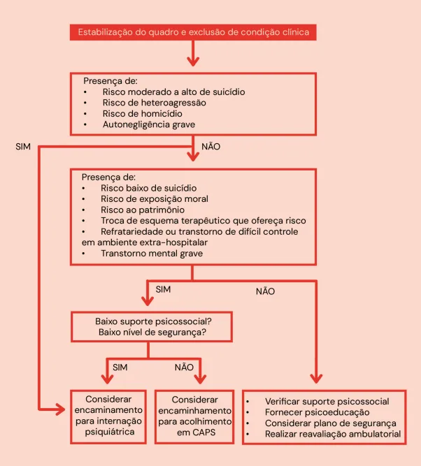
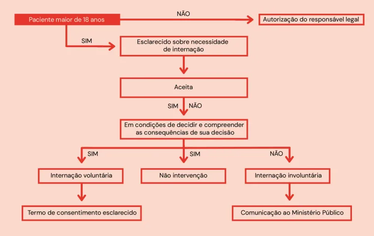
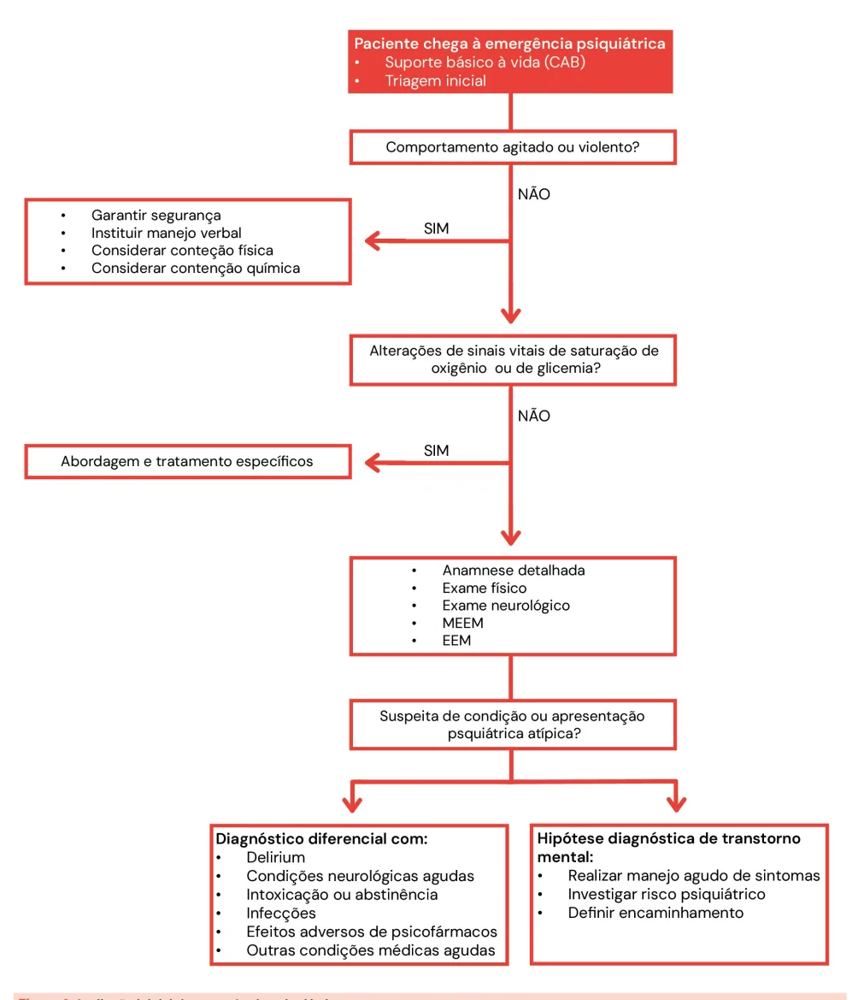
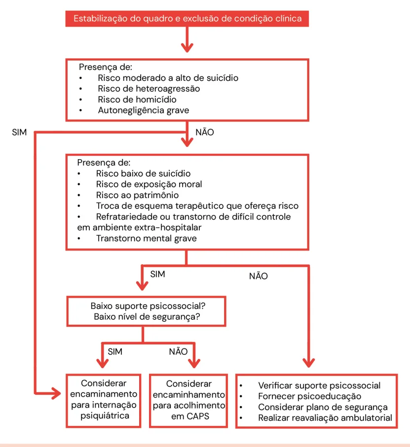
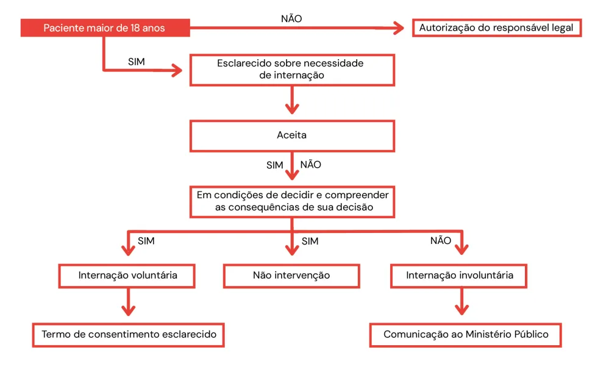
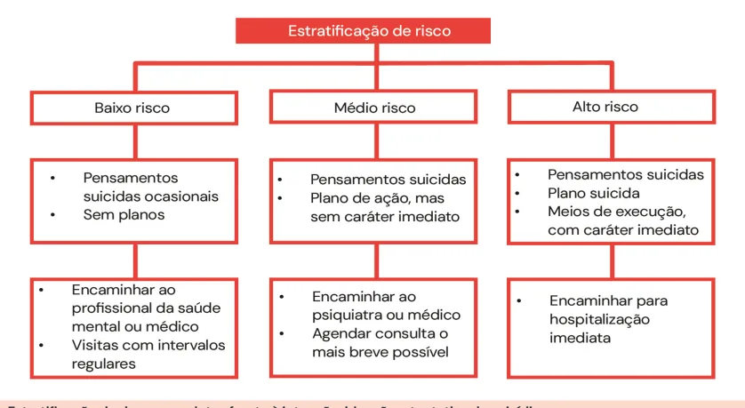

# Emergências Psiquiátricas

<!-- page:1 -->

psiquiatria (CM) AVALIAÇÃO INICIAL avaliação do risco psiquiátrico e determinação Se confirmada hipótese de transtorno mental, do encaminhamento:

deve-se proceder ao manejo agudo dos sintomas e à

## INTERNAÇÃO PSIQUIÁTRICA

---

<!-- page:2 -->

## SUICÍDIO SÍNDROME SEROTONINÉRGICA

Fatores de risco

- Excesso de atividade serotoninérgica no sistema

Mnemônico “SAD PERSONAS”: nervoso central e periférico;

- S exo;

- Mais comumente resulta da associação:

- A usência de cônjuge, abuso na infância, alta | IMAO (inibidor da monoamina oxidase) + hospitalar psiquiátrica recente; inibidores da recaptação de serotonina e/

- D epressão, desemprego, dor crônica, desespero, ou noradrenalina ou estes isoladamente em dor psíquica, desesperança; altas doses.

- P révia tentativa, personalidade vulnerável, parentes

- Tríade: distúrbios cognitivos-comportamentais, com histórico de suicídio; autonômicos e neuromusculares;

- E tanol e outras substâncias psicoativas,

- Tratamento: além das medidas de suporte e dependência química; suspensão do fármaco, utiliza-se ciproeptadina.

- R acionalidade comprometida (psicoses, déficits SÍNDROME NEUROLÉPTICA MALIGNA cognitivos), delírio, delirium;

- Lembre das manifestações clínicas e laboratoriais

- S uporte social deficitário, sozinho, desamparo; pelo mnemônico “Que MERDA!”:

- O rganização do plano; | Mente alterada;

- N ível etário extremo (jovem/idoso); | Elevação de temperatura, leucócitos e CPK;

- A cesso a meios letais; | Rigidez muscular;

- S aúde comprometida. | Disautonomia;

Estratificação de risco e conduta | Antipsicóticos causam.

- Depende de três perguntas fundamentais:

- Tratamento: além das medidas de suporte e Pensa? (há ideação suicida?); suspensão do fármaco, utiliza-se dantrolene Como? (há plano?); (relaxante muscular), bromocriptina (agonista Quando? (há intenção iminente?). dopaminérgico) e lorazepam.

- Baixo risco: Pensamentos suicidas ocasionais; Sem plano; Encaminhar a profissional de saúde mental/médico; Consultas com intervalos regulares.

- Médio risco: Pensamentos suicidas; Plano de ação, mas sem caráter imediato; Encaminhar ao psiquiatra ou médico; Agendar consulta o mais breve possível.

- Alto risco: Pensamentos suicidas; Plano suicida + meios de execução com caráter imediato; Encaminhar para hospitalização imediata.

## AVALIAÇÃO INICIAL

- Segunda: realizar avaliação efetiva;

As três prioridades em qualquer emergência

- Terceira: facilitar a intervenção adequada.

psiquiátrica incluem:

- Verificar Figura 1 na próxima página

- Primeira: garantir a segurança;

---

<!-- page:3 -->

Figura 1: Avaliação inicial da emergência psiquiátrica. Conforme o fluxograma acima, nos casos de transtorno mental, além do manejo agudo dos sintomas (ex.: agitação, psicose, etc.), deve-se investigar o risco psiquiátrico associado e definir o encaminhamento (ex.: internação, CAPS, etc.). A Figura 2 na próxima página, aborda melhor estas duas últimas etapas:

---

<!-- page:4 -->

Figura 2: Estratificação do risco psiquiátrico e definição do encaminhamento.

## INTERNAÇÃO PSIQUIÁTRICA FATORES DE RISCO

Nos casos em que, pelos fluxogramas anteriores, for determinada a internação psiquiátrica, os seguintes MNEMÔNICO “SAD PERSONAS”:

passos devem ser adotados:

- S exo;

- Verificar Figura 3 na próxima página

- A usência de cônjuge, abuso na infância, alta hospitalar psiquiátrica recente;

## SUICÍDIO

- D epressão, desemprego, dor crônica, desespero, dor psíquica, desesperança;

## CONCEITOS

- P révia tentativa, personalidade vunerável, parentes

- Intenção suicida: desejo que um ato autolesivo resulte com histórico de suicídio;

em morte;

- E tanol e outras substâncias psicoativas,

- Ideação suicida: pensamentos passivos sobre desejar dependência química;

estar morto ou pensamentos ativos sobre se matar,

- R acionalidade comprometida: psicoses, déficits não acompanhados de comportamento preparatório; cognitivos, delírio, delirium;

- Tentativa de suicídio: comportamento autolesivo

- S uporte social deficitário, sozinho, desamparo;

com consequências não fatais, acompanhado de

- O rganização do plano;

evidências (explícitas ou implícitas) de que a pessoa

- N ível etário extremo: jovens e idosos;

pretendia morrer;

- A cesso a meios letais;

- Suicídio: morte autoprovocada com evidências

- S aúde comprometida.

(explícitas ou implícitas) de que a pessoa pretendia morrer.

---

<!-- page:5 -->

O suicídio é mais frequente entre homens, devido Alta letalidade ao uso de métodos mais letais. Já as mulheres

- Planejamento concreto, já com data e realizam mais tentativas de suicídio, mas com método estabelecidos;

menor letalidade.

- Planos de alta letalidade incluem: Pular de local alto;

FATORES PROTETORES | Arma de fogo;

- Apoio da família, de amigos e de outras | Enforcamento;

pessoas significativas; | Ingestão de veneno;

- Crenças religiosas, culturais e étnicas; | Ingestão de grande quantidade de fármacos

- Envolvimento na comunidade; (muitas vezes de acesso controlado).

- Vida social satisfatória;

- Acesso fácil a meio letais (ex.: paciente possui arma

- Rede social significativa; em casa);

- Acesso a serviços e cuidados de saúde mental;

- Elaboração de carta de despedida;

- Emprego;

- Procedimentos para não ser descoberto.

- Estilo de vida saudável;

- Gravidez; ESTRATIFICAÇÃO DO RISCO E CONDUTA

- Criança na família.

- A fim de determinar a conduta frente a um paciente com intenção, ideação ou tentativa de suicídio, é

CARACTERÍSTICAS DA IDEAÇÃO SUICIDA necessário sempre responder a três questionamentos: Baixa letalidade | Pensa? (há ideação suicida?);

- Ideação suicida sem plano; | Como? (há plano?);

- Ideias crônicas de morte; | Quando? (há intenção iminente?).

- Planos vagos ou de baixa letalidade;

- A partir destas três perguntas, estratificamos o risco e

- Planos de baixa letalidade incluem: determinamos a conduta, conforme mostra a Figura 4: Ingestão de pequena quantidade de medicamento

- Verificar Figura 4 na próxima página de venda livre (ex: dipirona, paracetamol em dose não letal); Cortes superficiais nos punhos ou antebraços sem risco de sangramento fatal; Tentativas realizadas em local e horário com grande chance de ser interrompido.

Figura 3: Condutas frente à indicação de internação psiquiátrica.

---

<!-- page:6 -->

Figura 4: Estratificação de risco e condutas frente à intenção, ideaçã

## REAÇÕES ADVERSAS GRAVES A

## PSICOFÁRMACOS SÍNDROME SEROTONINÉRGICA

- Causada por excesso de serotonina no sistema nervoso central e periférico;

- Geralmente associada à combinação de: ISRS (inibidores seletivos da recaptação de serotonina)/ISRN (inibidores seletivos da recaptação de noradrenalina) + iMAO (inibidor da monoamina oxidase), ou sobredose isolada destas medicações (ex: fluoxetina, tramadol, MDMA);

- Tríade clássica de sintomas: Alterações do estado mental: ansiedade, confusão, agitação, delírio; Disfunção autonômica: hipertermia, diaforese, taquicardia, hipertensão, náuseas, vômitos, diarreia; Anormalidades neuromusculares: hiperreflexia, clônus (ocular ou induzido), mioclonia, tremor, sinal de Babinski bilateral.

- Conduta: Suspender imediatamente o(s) agente(s) serotonérgico(s); Suporte clínico (hidratação, monitorização); Sedação com benzodiazepínicos; Antagonista serotoninérgico: Ciproeptadina via oral, início 12 mg + 2 mg a cada

2h se necessário. SÍNDROME NEUROLÉPTICA MALIGNA A

- Efeito adverso grave de antipsicóticos (mais comum com típicos: haloperidol, flufenazina);

- Resulta do bloqueio dopaminérgico D2 excessivo nas A seguintes estruturas: Hipotálamo, levando à desregulação térmica; A Gânglios da base, levando à rigidez muscular extrema.

- Quadro clínico típico: A Alteração do estado mental: confusão, mutismo, delirium; Rigidez muscular intensa; ão e tentativa de suicídio. Hipertermia (febre alta, progressiva); Disautonomia: taquicardia, hipotensão, taquipneia, sudorese profusa;

- Achados laboratoriais: Aumento de CPK (creatinoquinase), leucocitose, mioglobinúria; Há risco de injúria renal aguda por rabdomiólise.

- Para lembrar mais facilmente das manifestações clínicas e laboratoriais, pode-se usar o mnemônico: Mente alterada; Elevação de temperatura , leucócitos e CPK; Rigidez muscular; Disautonomia; Antipsicóticos causam.

“Que MERDA!”:

- Conduta: Suspender o antipsicótico imediatamente; Medidas de suporte intensivo: hidratação, monitoramento, resfriamento externo; Fármacos específicos: Dantrolene (relaxante muscular); Bromocriptina (agonista dopaminérgico); Amantadina (agonista dopaminérgico alternativo); Lorazepam (sedação).

## REFERÊNCIAS

Figura 1: Avaliação inicial da emergência psiquiátrica. Acervo Medcof. Figura 2: Estratificação do risco psiquiátrico e definição do encaminhamento.

Acervo Medcof. Figura 3: Condutas frente à indicação de internação psiquiátrica. Acervo Medcof. Figura 4: Estratificação de risco e condutas frente à intenção, ideação e tentativa de suicídio.

Acervo Medcof.

