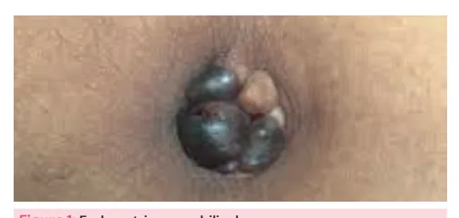
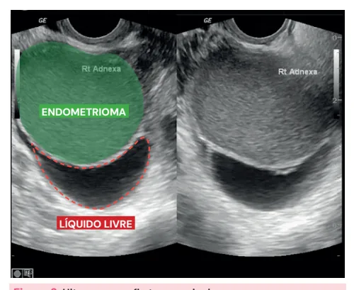
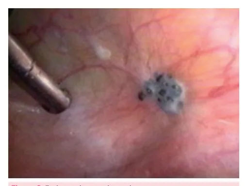

# Endometriose

<!-- page:1 -->

- Doença crônica, estrogênio-dependente, relacionada à menacme;
- Fisiopatologia: tecido endometrial fora da cavidade uterina;
- Sintomas: dismenorreia, dispareunia de profundidade e dor pélvica crônica; sintomas urinários ou intestinais a depender da localização dos focos de endometriose;
- Associação com infertilidade;
- Exames complementares: USG pélvico com preparo intestinal ou ressonância magnética.

## Considerações Gerais

- A endometriose é uma doença ginecológica crônica, estrogênio-dependente e multifatorial;
- É mais prevalente em mulheres em idade reprodutiva, os sintomas tendem a melhorar após a menopausa;
- É a presença de tecido endometrial fora do útero. Mais comum na pelve, mas pode estar presente em qualquer ponto da superfície peritoneal;
- Classificada em **peritoneal, ovariana e profunda** (penetra o espaço retroperitoneal ou parede dos órgãos pélvicos com profundidade de pelo menos 5 mm).

## Etiologia

### Teorias

- **Sampson (menstruação retrógrada)**: teoria de que existe um refluxo tubário do conteúdo menstrual com implantação de células endometriais no peritônio e demais órgãos revestidos pelo peritônio, caso a paciente tenha ambiente hormonal e imunológico adequado;
- **Metaplasia celômica**: as lesões se originam de tecidos normais através do processo de transformação metaplásica;
- **Genética**: predisposição genética ou alterações epigenéticas associadas a modificações no ambiente peritoneal poderiam iniciar a doença partindo de qualquer tipo celular.

### Fatores de Risco

- Histórico familiar;
- Primiparidade tardia e nuliparidade: há associação de endometriose com infertilidade. Será que essas mulheres não engravidam porque têm infertilidade e por isso aparece como fator de risco? Ou seria o contrário?
- Ciclos menstruais curtos e fluxo menstrual excessivo: associação da endometriose com adenomiose;
- IMC baixo;
- Consumo de álcool e cafeína;
- Malformações mullerianas - refluxo do sangue menstrual.

## Quadro Clínico

### Sintomas

- Lembrar dos **D's**: dismenorreia, dor pélvica crônica e dispareunia de profundidade;
- Disúria e disquezia se houver focos de endometriose na bexiga ou no TGI;
- Alterações intestinais cíclicas (distensão abdominal, sangramento nas fezes, constipação, disquezia, dor anal);
- Alterações urinárias cíclicas (disúria, hematúria, polaciúria, urgência miccional);
- Infertilidade – tanto pelas aderências que se formam sobre as lesões endometrióticas quanto por alterações da motilidade tubária e endometrioma.

### Exame Físico

- Implantes endometrióticos, principalmente em fundo de saco vaginal;
- Nodulações dolorosas, principalmente em fundo de saco vaginal;
- Espessamento de ligamentos uterossacros;
- Útero pouco móvel e doloroso;
- Anexos fixos e dolorosos;
- Massas anexiais.

Figura 1: Endometrioma umbilical.

---

<!-- page:2 -->

## Diagnóstico

### Exames Complementares

- Exame físico: suspeita clínica;
- A ultrassonografia transvaginal pode ser útil, principalmente nos casos de endometriomas, mas não é suficiente para caracterizar as lesões de endometriose. Por isso, diante de quadros clínicos suspeitos devemos indicar dois exames mais específicos: **USG pélvico e transvaginal com preparo intestinal**; **RNM pélvica com protocolo específico**;
- Obs.: os exames de imagem possuem boa sensibilidade para lesões profundas e endometriomas, mas não para lesões superficiais e aderências finas;
- Padrão-ouro para diagnóstico de endometriose é a **laparoscopia com biópsia**;
- **CA 125** (marcador tumoral inespecífico) pode estar aumentado, mas não tem valor no diagnóstico.

Figura 2: Ultrassonografia transvaginal. Formação cística unilocular de margens bem delimitadas, apresentando finos ecos (debris) difusos e homogêneos de permeio em aspecto de "vidro fosco", sugestivo de conteúdo hemático localizado na região anexial direita, sugestivo de endometrioma.

Figura 3: Endometriose peritoneal. Lesões vermelhas (ativas), pretas (aspecto de queimadura por pólvora) ou brancas (cicatriciais).

Figura 4: Endometriomas ovarianos: conteúdo espesso achocolatado.

Figura 5: Endometriose profunda - componentes posteriores. Falemos de ressecção (excisão) da endometriose e não de cauterização!

## Tratamento

### Tratamento Clínico – Primeira Linha

- Objetivo: controle de dor pélvica;
- Sempre primeira escolha, exceto se indicações absolutas para procedimento cirúrgico;
- **Progestagênio contínuo** – oral, injetável, SIU-LNG ou implante subdérmico;
- **Anticoncepcional combinado** – sem consenso sobre administração contínua ou cíclica, ou forma de administração (oral, injetável, adesivo ou anel vaginal);
- **Danazol** – inibe a liberação de LH e esteroidogênese, aumenta a testosterona livre; atualmente em desuso devido a efeitos colaterais;
- **Análogo de GnRH** – muitos efeitos colaterais; não pode ser usado a longo prazo, uma vez que induz estado menopausal transitório;
- **AINEs**;
- Acupuntura, fisioterapia pélvica, psicoterapia, uso de Gabapentina e Amitriptilina.

### Tratamento da Dor

- Visa amenorreia → progestagênios contínuos, SIU-LNG, anticoncepcional combinado;
- Casos refratários → cirurgia (ressecar todos os focos de endometriose);
- Quando indicar cirurgia direto? Risco de obstrução (comprometimento de delgado ou apêndice cecal), >50% de acometimento de alça de cólon, acometimento de ureter;
- Infertilidade: avaliar demais agravos à fertilidade – FIV x cirurgia.

### Tratamento Cirúrgico

- Indicações: endometrioma ovariano > 6 cm; lesão em ureter, íleo, apêndice e retossigmoide (se sinais de suboclusão); falha de tratamento clínico;
- Objetivo: remoção completa de todos os focos de endometriose, tentando preservar função reprodutiva;
- Via ideal: videolaparoscopia.

---

<!-- page:3 -->

### Endometriose Intestinal

- **Shaving** – lesões pequenas e superficiais;
- **Ressecção em disco**: ressecção de nódulos até 3 cm, incluindo todas as camadas da parede anterior do reto;
- **Ressecção segmentar**: ressecção de um segmento do retossigmoide. Lesões maiores que 3 cm ou duas ou mais lesões intestinais.

### Endometrioma Ovariano

- **Ooforoplastia** – melhor chance de gestação, melhor controle de dor, menor taxa de recidiva;
- Drenagem do conteúdo e cauterização da cápsula.

## Tratamento da Infertilidade

- 30 a 50% das mulheres com endometriose têm infertilidade;
- Estima-se que a cirurgia de endometriose aumenta a taxa de gravidez espontânea em cerca de 30 a 40%;
- A abordagem da infertilidade no contexto da endometriose é controversa: deve-se avaliar fatores prognósticos ao encaminhar para o tratamento cirúrgico ou para FIV. Mulheres jovens, com boa reserva ovariana e sem outros fatores de infertilidade podem ter melhores chances de gestação após o tratamento da endometriose;
- Tratamento medicamentoso hormonal – não melhora fertilidade;
- Análogo de GnRH melhora a taxa de gestação se administrado 3 meses pré-FIV;
- Investigação inicial:
  - Avaliação da ovulação: história clínica;
  - Avaliação de fator masculino: espermograma;
  - Avaliação da extensão de doença: USGTV com preparo intestinal ou RNM;
  - Avaliação de reserva ovariana: AMH e contagem de folículos antrais (CFA);
  - Avaliação de acometimento tubário: histerossalpingografia.

### Endometriosis Fertility Index (EFI)

- Pode ser extrapolado para o aconselhamento;
- Parâmetros clínicos e radiológicos: idade da mulher, tempo de infertilidade, gestação prévia e extensão de acometimento.

Figura 6: Fluxograma para condução dos casos de infertilidade de pacientes com diagnóstico de endometriose.

> ⚠️ Fluxograma reconstruído a partir de OCR de duas colunas — confira contra a fonte original.

Suspeita de Endometriose → quadro clínico/exame físico/exames de imagem → dor pélvica e/ou infertilidade:

- Endometrioma ovariano > 6 cm, ou lesão em ureter, íleo, apêndice ou retossigmoide (com sinais de suboclusão) → tratamento cirúrgico;
- Ausência desses critérios → avaliar fatores prognósticos (idade, tempo de infertilidade, reserva ovariana, outros fatores de infertilidade):
  - **Bom prognóstico** → reprodução assistida de baixa complexidade;
  - **Mau prognóstico** → fertilização in vitro (alta complexidade). Sem gestação → tratamento cirúrgico. Sem gestação após cirurgia → reavaliar.

### Classificação ASRM

- **Estágio I (Endometriose Mínima)**: escore 1-5, implantes isolados e sem aderências significantes;
- **Estágio II (Endometriose Leve)**: escore 6-15, implantes superficiais com menos de 5 cm, sem aderências significantes;
- **Estágio III (Endometriose Moderada)**: escore 16-40, múltiplos implantes, aderências peritubárias e periovarianas evidentes;
- **Estágio IV (Endometriose Grave)**: escore > 40, múltiplos implantes superficiais e profundos, incluindo endometriomas, aderências densas e firmes.

### Bom Prognóstico

- Idade < 35 anos;
- Boa reserva ovariana;
- Ausência de fator masculino;
- Tubas funcionais.
- Conduta: dor ou endometriose superficial → laparoscopia; sem dor e endometriose profunda → fertilização in vitro (FIV).

### Mau Prognóstico

- Idade > 35 anos;
- Baixa reserva ovariana;
- Fator masculino;
- Fator tubário.
- Conduta: fertilização in vitro (FIV).

## Referências

Figura 1: Endometrioma umbilical. SANTOS FILHO, P. V. D. et al. Primary umbilical endometriosis. Revista do Colégio Brasileiro de Cirurgiões, v. 45, n. 3, 21 jun. 2018. Disponível em: https://revista.cbc.org.br/detalhe_artigo.asp?id=3202.

Figura 2: Ultrassonografia transvaginal. PATEL, M. S. Endometrioma | Radiology Case | Radiopaedia.org. Disponível em: https://radiopaedia.org/cases/endometrioma.

Figura 3: Endometriose peritoneal. GONZAGA, F. Endometriose. Disponível em: https://www.drfranciscogonzaga.com.br/site/endometriose/.

Figura 4: Endometriomas ovarianos: conteúdo espesso achocolatado. GONZAGA, F. Endometriose. Disponível em: https://www.drfranciscogonzaga.com.br/site/endometriose/.

Figura 5: Endometriose profunda – componente posterior. A ENDOMETRIOSE E EU. Falemos de ressecção (excisão) da endometriose e não de cauterização. Disponível em: https://aendometrioseeeu.com.br/falemos-de-resseccao-excisao-da-endometriose-e-nao-de-cauterizacao/.

Figura 6: Fluxograma para condução dos casos de infertilidade de pacientes com diagnóstico de endometriose. GONZAGA, F. Endometriose. Disponível em: https://www.drfranciscogonzaga.com.br/site/endometriose/.
