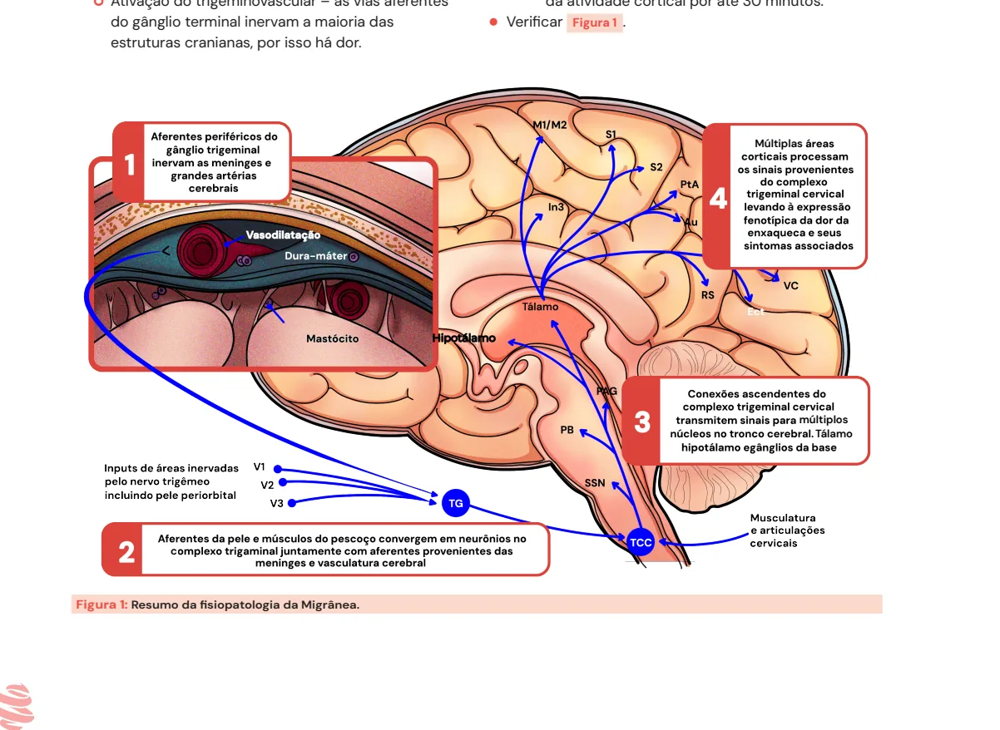
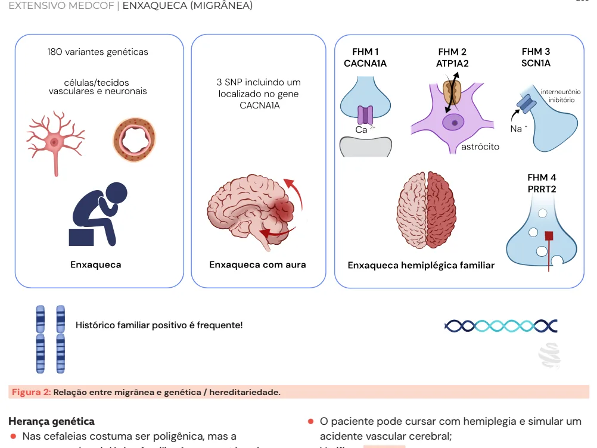

# Enxaqueca (migrânea)

<!-- page:1 -->

Enxaqueca / migrânea (CM) INTRODUÇÃO P

- ENXAQUECA = cefaleia UNILATERAL + PULSÁTIL +

- FOTO/FONOFOBIA + NÁUSEAS/VÔMITOS.

## TRATAMENTO

- Crise

- “Passo-a-passo”: Analgésicos, anti-inflamatórios, triptanos;

- Lembrar dos Gepants e Lasmiditan.

## EPIDEMIOLOGIA

- Atinge até 15% da população: Predomínio em mulheres jovens (2:1).

- Pico de prevalência é entre 30-50 anos;

- Histórico familiar positivo é bastante frequente!

## FISIOPATOLOGIA

Podemos dividi-la didaticamente em 3 pontos:

- Cefaleia: Ativação do trigeminovascular – as vias aferentes do gânglio terminal inervam a maioria das estruturas cranianas, por isso há dor.

c Figura 1: Resumo da fisiopatologia da Migrânea. Profilático

- Prestar atenção aos efeitos colaterais e contraindicações;

- Betabloqueadores: NÃO indicar para asmáticos ou portadores de DPOC;

- Topiramato: bom para obesos, cuidado com nefrolitíase e glaucoma;

- Valproato: teratogênico.

- CGRP (peptídeo relacionado ao gene da calcitonina): Está envolvido na dilatação arterial, inflamação neurogênica, ativação de nociceptores meníngeos; É a principal molécula inflamatória da dor na enxaqueca (ativação de nociceptores).

- Aura: Explicada pela depressão alastrante cortical, também chamada de depressão alastrante de Leão Ocorre uma despolarização das membranas celulares neuronais e gliais, seguida de inibição da atividade cortical por até 30 minutos.

(neurofisiologista brasileiro que a descreveu):

- Verificar Figura 1 .

Múltiplas à múltiplos Tálamo

---

<!-- page:2 -->

Histórico familiar positivo é frequente! Figura 2: Relação entre migrânea e genética / hereditariedade.

Herança genética

- Nas cefaleias costuma ser poligênica, mas a enxaqueca hemiplégica familiar é a que está mais relacionada a um gene específico;

- Enxaqueca hemiplégica familiar (sigla FHM na imagem) está muito relacionada à herança genética, sendo que existem 4 tipos dessa doença, e o gene CACNA1A é o mais comumente associado à FHM 1, o subtipo mais frequente;

Cefaleia precoce

## Intensidade Incômoda

Congestão nasal Aura Mialgia Alt. neurológicas Premonitórios reversíveis: visuais somatossensitivas Alt. humor Fadiga Dist. cognitivos Mialgia Avidez por doces Pré-cefaleia Leve Moderada Figura 3: As 4 fases da migrânea: pródromo, aura, cefaleia e pósd - O paciente pode cursar com hemiplegia e simular um acidente vascular cerebral;

- Verificar Figura 2 .

## QUADRO CLÍNICO

- Podemos dividir a enxaqueca didaticamente em quatro grandes fases: prodrômica → aura → cefaleia → período “pósdromo’’.

Cefaleia Avançada Unilateral Pulsátil Náusea Fotofobia Fonofobia o Osmofobia Pósdromo Fadiga Alt. cognitivas Mialgias Forte Pós-cefaleia Tempo dromo.

---

<!-- page:3 -->

Figura 4: Principais auras visuais da Migrânea Espectro de fortificaçã PRÓDROMOS D

- Sintomas premonitórios: bocejos, fadiga, desejo por alimentos doces: C Iniciam em torno de 48 horas antes da cefaleia. E

## AURA B

- Déficit neurológico reversível: Apenas 20% dos pacientes possuem; C Aura visual é a mais comum (a maioria sendo escotomas cintilantes e espectro de fortificação); Podem ocorrer também alterações sensitivas, de linguagem e motoras (+ raras); Pode preceder a cefaleia ou aparecer junto; Duração de 5 a 60 minutos.

- Verificar Figura 4 . A

## CEFALEIA

Precoce

- Incômoda, congestão nasal e mialgia; E

Avançada A

- Unilateral, pulsátil, náusea, fotofobia, B fonofobia e osmofobia: A osmofobia não está relacionada aos critérios diagnósticos de enxaqueca, mas é algo bem relatado pelos pacientes.

## PÓSDROMO

- Fadiga;

- Alteração cognitiva; C

- Mialgia. ão (A, B, D), escotoma (B) e cintilações (C).

## DIAGNÓSTICO

## CRITÉRIOS

Enxaqueca sem aura A. Pelo menos 5 crises preenchendo os critérios B, C e D; B. Ataque de cefaleia com duração de 4 a 72 horas (sem tratamento ou tratada sem sucesso);

C. A cefaleia tem pelo menos 2 das seguintes características: | Localização UNILATERAL; | PULSÁTIL; | Intensidade MODERADA ou GRAVE;

| Agravamento ou evitação de atividade física de rotina (caminhar, subir, escadas). A. Durante a cefaleia, pelo menos 1 dos seguintes:

1. Náusea, vômito ou ambos;

2. Fotofobia e fonofobia.

- A dor não é melhor explicada por outro diagnóstico.

Enxaqueca com aura A. Pelo menos 5 ataques cumprindo B e C; B. 1 ou mais dos seguintes sintomas da aura totalmente reversíveis:

| Visual; | Sensorial; | Fala e/ou linguagem; | Motor; | Tronco cerebral; | Retina. C. Pelo menos 3 das 6 características seguintes:

| Pelo menos um sintoma de aura se espalha gradualmente em mais de 5 minutos; | 2 ou mais sintomas da aura ocorrem em sucessão;

| Cada sintoma de aura dura de 5 a 60 minutos; | Pelo menos um sintoma de aura é unilateral;

---

<!-- page:4 -->

| Pelo menos um sintoma de aura é positivo (visual, CLASSES MEDICAMENTOSAS auditivo, sensitivo); Betabloqueadores | A aura é acompanhada ou seguida dentro de

- Propranolol, metoprolol e timolol – nível A

60 minutos por dor de cabeça. Tabela 1: Características da cefaleia enxaquecosa.

- PUMA 4-72 Pulsátil Unilateral Moderada a forte intensidade Agravada por atividades físicas rotineiras Dura de 4-72h

## CLASSIFICAÇÃO

- Migrânea episódica: 1-14 episódios de cefaleia por mês.

- Migrânea crônica: ≥ 15 dias de cefaleia por mês, por pelo menos 3 meses.

## CEFALEIA POR USO EXCESSIVO DE

## ANALGÉSICOS

- É uma doença específica, geralmente associada a outras cefaleias primárias (como a própria enxaqueca);

- Cefaleia por 15 dias ou mais no mês, por 3 meses ou mais, com cefaleia primária pré-existente (geralmente migrânea crônica): ≥ 15 dias: analgésicos comuns e AINES; ≥ 10 dias: triptanos, ergotamínicos, barbitúricos, opioides e combinações de analgésicos.

- Predomínio em mulheres (3:1);

- Tratamento: orientar a redução dos analgésicos e associar uma profilaxia (por exemplo: topiramato).

## TRATAMENTO PROFILÁTICO

## DA ENXAQUECA

## PRINCÍPIOS GERAIS

- Avaliar se existe indicação (número de crises/mês): “3 é demais” → 3 crises por mês por mais de 3 meses.

- Checar as comorbidades dos pacientes (asma, obesidade, glaucoma, hipertensão arterial sistêmica, etc): Algumas medicações ajudam e outras devem ser evitadas conforme cada comorbidade; Checar possíveis benefícios adicionais (por exemplo: topiramato em paciente com obesidade).

- Aguardar pelo menos 4 a 6 semanas de tratamento antes de dizer que houve falha.

Indicação

- Pacientes que apresentam 3 ou mais crises de enxaqueca ao mês, por mais de 3 meses;

- Episódios muito incapacitantes, com prejuízo na vida do paciente;

- Refratariedade às medicações abortivas (ou com efeitos adversos significativos). de evidência: Uma alternativa pode ser o atenolol, com menor nível de evidência; Não prescrever para asmáticos/DPOC e cuidado com cardiopatas.

Bloqueadores do canal de cálcio

- Flunarizina – 3 a 10 mg/dia;

- Efeitos colaterais: ganho de peso, parkinsonismo secundário e depressão.

Anticonvulsivantes

- Topiramato: Ótima opção para pacientes com obesidade; Posologia: 25 a 100 mg/dia; Cuidado com história de nefrolitíase e glaucoma; Efeitos colaterais: parestesias e déficits cognitivos.

- Valproato de sódio: Posologia de 250 a 1.000 mg/dia; Evitar usar em mulheres jovens → teratogênico; Efeito colateral: teratogênica, aumento de peso e pelos; Riscos: trombocitopenia e hepatotoxicidade.

- Levetiracetam: Posologia: 250 a 1.500 mg/dia;

;

- Sem benefícios: lamotrigina, carbamazepina, oxcarbazepina, clonazepam e fenitoína.

Anti-hipertensivos (sim)

- O paciente não precisa ser hipertenso para iniciar profilaxia com essas medicações;

- BRA e IECA: Lisinopril 10-40 mg; Condesartana 8-16mg.

Antidepressivos Abaixo do maior para o menor nível de evidência:

- Amitriptilina: 12,5 – 75 mg/dia: Cuidado com pacientes obesos e/ou idosos.

- Venlafaxina: 75 a 150 mg/dia;

- Nortriptilina: 10 a 75 mg/dia.

Anticorpos monoclonais anti-peptídeo relacionado ao gene da calcitonina (anti-CGRP)

- Bem tolerados, com rápido início de ação (em torno de 1 semana): Nível A de evidência; Já podem ser prescritos como primeira linha.

- Não são permitidos ainda em gestantes;

- Representantes: galcanezumabe e fremanezumabe

(disponíveis no Brasil), erenumabe e eptinezumabe.

## MEDIDAS NÃO FARMACOLÓGICAS

- Verificar Tabela 2 na próxima página.

## TRATAMENTO DAS CRISES

- Sempre tratar em degraus, começar com uma classe medicamentosa e ir aumentando conforme resposta;

- Verificar Tabela 3 na próxima página.

---

<!-- page:5 -->

Tabela 2: Mnemônico MEDUSA para tratamento não medicamentoso da enxaqueca. M Manejo do ESTRESSE Estimular meditação, relaxamento e avaliar o nível de estresse regularmente E EXERCÍCIO físico 30-60 minutos por 3 a 5x/semana D DIÁRIO de crises Estimular uso regular - digital ou impresso Não usar tabaco e baixo consumo de álcool (máximo 1 dose padrão/d para U Uso TABACO/ÁLCOOL mulheres e 2 doses/d homens)

S SONO Higiene otimizada para qualidade e quantidade Beber em média 2 litros de água/dia, evitar jejum e excesso cafeína (200 mg/dia), A ALIMENTAÇÃO refeições regulares e saudáveis qualitativamente Tabela 3: Tratamento abortivo da crise enxaquecosa - passo-a-passo.

- Analgésicos simples Primeira opção Dipirona ou paracetamol Preferencialmente EV ou IM

- Anti-inflamatórios não esteroidais Cetoprofeno, naproxeno ou ibuprofeno Preferencialmente EV ou IM

- Triptanos Sumatriptano (SC), naratriptano, rizatriptano, zolmitriptano (VO) Criados especificamente para enxaqueca Mecanismo de ação: são agonistas dos receptores 5HT-1B e 5HT-1D, relacionados à serotonina; Contraindicações: história de AVC ou IAM, doença arterial obstrutiva periférica e HAS sem controle – devido à sua ação vasoconstritora.

- Antipsicóticos (casos refratários) Clorpromazina EV Droperidol IM - se não tiver alteração de QT Menores níveis de evidência

- Outros Corticoides (dexametasona) Reduz a recorrência da cefaleia → sem ação analgésica! Antieméticos (metoclopramida ou bromoprida) Efeito adicional analgésico (principalmente metoclopramida) Derivados do Ergô Cada vez menos utilizados devido efeitos adversos Tontura, astenia, náuseas e vômitos

- Não prescrever opioides (codeína, tramadol, morfina, etc) Sem eficácia comprovada Risco de dependência.

Novidades

- GEPANTS Antagonistas de CGRP Rimegepant e ubrogepant. Indicado para pacientes com contraindicações aos triptanos ou resposta ruim a esse grupo

- Lasmiditan Agonista seletivo de receptores 5HT-1F Indicado para pacientes que respondem bem aos triptanos, mas que tiveram efeitos colaterais cardiovasculares → seguro do ponto de vista cardiovascular.

## REFERÊNCIAS

Figura 4: Principais auras visuais da Migrânea. Sociedade Brasileira de Cefaleias. [s.d.]. Disponível em: https://www.sbcefaleia.com.br/.
