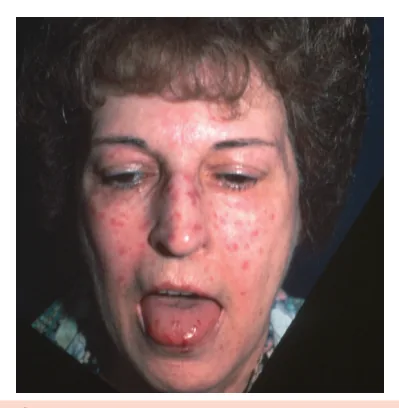
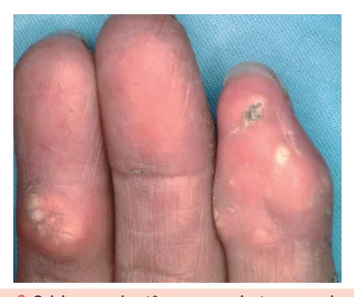
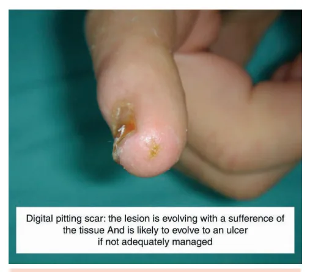
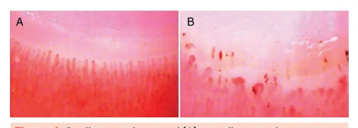
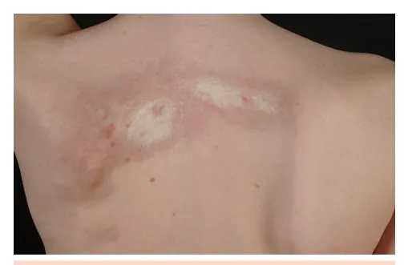
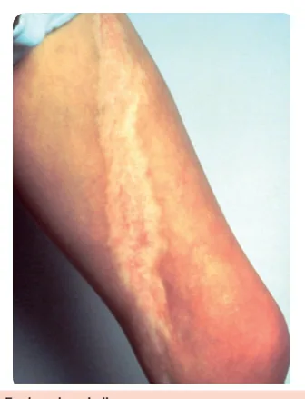

# Esclerose Sistêmica

<!-- page:1 -->

Esclerose Sistêmica (CM)

- Doença autoimune sistêmica com fibrose cutânea e

- Espessamento distal às metacarpofalangeanas visceral progressiva; (4 pontos);

- Diferente da esclerodermia (morfeia, esclerodermia

- Úlceras digitais (2 pontos);

linear), que cursa com espessamento cutâneo sem

- Microcicatrizes digitais (3 pontos);

manifestações sistêmicas.

- Fenômeno de Raynaud (3 pontos);

Formas clínicas

- Telangiectasias (2 pontos);

- Cutânea limitada: fenômeno de Raynaud, acomete

- Capilaroscopia alterada (2 pontos);

face e extremidades distal ao cotovelo e joelho;

- Autoanticorpos específicos (3 pontos);

autoanticorpo anti-centrômero; risco aumentado

- Doença intersticial pulmonar ou hipertensão de hipertensão pulmonar. Pode se manifestar como pulmonar (2 pontos).

a síndrome CREST. Tratamento

- Cutânea difusa: espessamento rápido no

- Fenômeno de Raynaud e úlceras digitais:

tronco e regiões proximais ao cotovelo e bloqueadores de canal de cálcio, sildenafil, análogos joelhos; risco elevado de doença intersticial de prostaciclina intravenosa, bosentana (prevenção pulmonar; autoanticorpos anti-Scl-70 e anti- das úlceras);

RNA polimerase III.

- Crise renal esclerodérmica: inibidores da

- Sine escleroderma: sem espessamento cutâneo, ECA (iECA);

mas com manifestações viscerais típicas.

- Fibrose cutânea: metotrexato, micofenolato de

Exames complementares mofetil, ciclofosfamida, rituximabe;

- FAN positivo na maioria (padrão centromérico

- Doença intersticial pulmonar: micofenolato de ou nucleolar); mofetil, ciclofosfamida, rituximabe, tocilizumabe;

- Autoanticorpos: anti-Scl-70 (associado a doença

- Hipertensão pulmonar: bosentana, sildenafil, intersticial pulmonar), anti-centrômero (associado análogos de prostaciclina;

a hipertensão pulmonar), anti-RNA polimerase III

- Esofagopatia: inibidores de bomba de prótons e

(risco de crise renal e neoplasias); pró-cinéticos;

- Tomografia de tórax: pneumonia intersticial não

- Transplante autólogo de medula óssea para formas específica (PINE) é o mais comum. agressivas precoces com acometimento

Critérios de classificação cutâneo e pulmonar.

- Critérios ACR/EULAR 2013; esclerose sistêmica se

≥ 9 pontos;

- Espessamento cutâneo proximal às metacarpofalangeanas (9 pontos, critério suficiente);

- Evolui com fibrose progressiva da pele e órgãos internos.

- Doença autoimune sistêmica crônica, caracterizada por fibrose progressiva da pele e de órgãos internos, FORMAS CLÍNICAS além de vasculopatia e ativação imune. Forma cutânea limitada

- Espessamento cutâneo restrito à face, pescoço e

EPIDEMIOLOGIA áreas distais (mãos, pés);

- Doença rara: incidência estimada de 11

- Fenômeno de Raynaud geralmente precede, em anos, casos/milhão/ano; outras manifestações:

- Estima-se cerca de 50.000 casos no Brasil; | O fenômeno de Raynaud caracteriza-se por

- Predomínio feminino (4:1); mudança trifásica de coloração (palidez, pela

- Maior frequência entre 45 e 65 anos; vasoconstrição → cianose, pela hipóxia → eritema,

- Importante morbidade, mesmo em formas pela reperfusão) dos dedos desencadeada por frio cutâneas leves. ou estresse; Pode acometer também pés, orelhas e nariz;

FISIOPATOLOGIA | Pode evoluir com úlceras digitais e microcicatrizes

- Disfunção endotelial e ativação imune, evoluindo com (pitting scars).

vasculopatia obliterante;

- Alta associação com hipertensão pulmonar;

- Há ativação de fibroblastos e produção excessiva de

- Autoanticorpo associado: anti-centrômero.

colágeno e matriz extracelular;

- Inclui a síndrome CREST:

---

<!-- page:2 -->

| Calcinoses;

- Alta associação com doença intersticial Raynaud; pulmonar, acometimento renal (crise renal Esofagopatia (doença do refluxo gastroesofágico); esclerodérmica) e cardíaco; Esclerodactilia; Telangiectasias. O padrão de doença intersticial pulmonar mais Telangiectasias.

- F

Figura 1: Fenômeno de Raynaud.

- E

- Figura 2: Esclerose sistêmica forma cutânea limitada.

- Espessamento da pele da face determinando microstomia e múltiplas telangiectasias em face e língua.

- Figura 3: Calcinoses subcutâneas em paciente com esclerose sistêmica forma limitada.

Forma cutânea difusa O

- Espessamento cutâneo rápido e extenso, envolvendo tronco, face e segmentos proximais de membros

(ombros e coxas);

- Fenômeno de Raynaud também precede em anos outras manifestações; O padrão de doença intersticial pulmonar mais comum na esclerose sistêmica é a pneumonia intersticial não específica (PINE)!

- Autoanticorpos associados: Anti-Scl-70 (anti-topoisomerase I); Anti-RNA polimerase III.

O anti-RNA polimerase III também está associado a risco aumentado de crise renal esclerodérmica e de neoplasias!

Forma sine escleroderma

- Acometimento visceral presente (doença intersticial pulmonar, esofagopatia, etc.), mas sem espessamento cutâneo;

- Pode haver fenômeno de Raynaud e telangiectasias;

- Risco de subdiagnóstico.

## EXAMES LABORATORIAIS

- FAN (fator antinuclear): Presente na grande maioria dos pacientes com esclerose sistêmica; Padrões mais frequentes: Nucleolar; Centromérico (padrão associado ao anti-centrômero).

- CPK (creatinofosfoquinase): Avaliar em caso de mialgias ou fraqueza muscular; Elevação sugere miosite associada.

- BNP (peptídeo natriurético tipo B): Pode estar elevado em hipertensão pulmonar ou disfunção cardíaca; Atua como fator prognóstico e marcador de gravidade.

- Autoanticorpos específicos: Anti-Scl-70 (anti-topoisomerase I): Associado à forma cutânea difusa; Forte correlação com doença intersticial pulmonar. Anti-centrômero: Associado à forma cutânea limitada; Frequentemente relacionado à hipertensão pulmonar. Anti-RNA polimerase III: Associado à forma cutânea difusa de rápida progressão; Forte associação com crise renal esclerodérmica; Pode estar relacionado a neoplasias.

## OUTROS EXAMES COMPLEMENTARES

- Capilaroscopia periungueal: padrão SD

(scleroderma pattern);

- Tomografia computadorizada de tórax: PINE é o padrão de acometimento intersticial mais comum;

---

<!-- page:3 -->

- Manometria esofágica: pode mostrar hipotonia do Esclerodactilia (espessamento dos dedos) associada esfíncter esofágico inferior e aperistalse do terço distal a espessamento proximal às metacarpofalangeanas.

do esôfago; Observa-se também a postura da mão “em garra”.

- Endoscopia digestiva alta: pode mostrar graus variados de esofagite.

variados de esofagite. Figura 4: Capilaroscopia normal (A) e capilaroscopia com padrão SD (B). O padrão SD (scleroderma pattern) é característico da esclerose sistêmica, refletindo a vasculopatia capilar típica da doença.

## CRITÉRIOS DE CLASSIFICAÇÃO

- Critérios ACR/EULAR 2013;

- Os critérios não são aplicáveis a pacientes que possuem espessamento cutâneo que poupa os dedos dedos, caracterizando a esclerodactilia).

(o espessamento da esclerose sistêmica acomete os Tabela 1: Critérios de classificação para esclerose sistêmica ACR/EULAR 2013.

Achado Pontos Espessamento cutâneo proximal às metacarpofalangeanas Espessamento cutâneo distal às metacarpofalangeanas (esclerodactilia)

Úlcera digital 2 Microcicatriz (pitting scar) 3 Fenômeno de Raynaud 3 Autoanticorpos específicos positivos (anti-Scl-70 ou anti-centrômero ou RNA 3 polimerase III)

Telangiectasias 2 Capilaroscopia alterada 2 Doença intersticial pulmonar ou hipertensão arterial pulmonar ≥9 pontos classificam como esclerose sistêmica!

Figura 5: Espessamento cutâneo em paciente com esclerose sistêmica. Figura 6: Pitting scar (microcicatriz) em polegar de paciente com esclerose sistêmica.

## TRATAMENTO

- O tratamento depende das manifestações clínicas de cada paciente:

Tabela 2: Tratamento conforme a manifestação clínica da esclerose sistêmica. Manifestação Tratamento Bloqueador de canal de cálcio Fenômeno de (ex.: nifedipino, anlodipino), Raynaud sildenafil, análogos de prostaciclina intravenosos Bloqueadores do canal de cálcio, sildenafil Úlceras digitais Bosentana previne novas úlceras Inibidores da ECA (ex.: captopril)

Crise renal em doses altas, mesmo com esclerodérmica creatinina elevada Metotrexato, micofenolato Pele (fibrose ativa) de mofetila, ciclofosfamida, rituximabe Micofenolato de mofetila, Doença intersticial ciclofosfamida, rituximabe, pulmonar tocilizumabe Análogos de prostaciclina Hipertensão (ex.:iloprost), bosentana, pulmonar sildenafil Inibidor da bomba de Esofagopatia prótons, pró-cinéticos (ex.:

domperidona) Transplante autólogo de medula Casos graves e óssea (melhora cutânea e precoces pulmonar intersticial)

---

<!-- page:4 -->

## ESCLERODERMIA REFERÊNCIAS

- É uma condição diferente da esclerose sistêmica; Figura 1: Fenômeno de Raynaud.

- Caracteriza-se por espessamento e endurecimento da MYDR. Raynaud’s disease. Dermatology, Heart Attacks and Strokes, pele, devido à deposição de colágeno na derme; Symptoms. Disponível em: https://mydr.com.au/symptoms/raynaudspele, devido à deposição de colágeno na derme; S d

- No entanto, não há acometimento de órgãos internos nem manifestações sistêmicas;

- Anticorpos específicos para a esclerose sistêmica A são negativos; d r

- Clinicamente, pode se apresentar em duas formas principais: Morfeia: Placas únicas ou múltiplas, endurecidas, com A aspecto perolado ou cor de marfim, geralmente d r localizadas em tronco ou membros; Podem ter halo lilás periférico em fase ativa.

c h b e r Figura 7: Morfeia em placas. Presença de duas placas endurecidas de aspecto d r perolado em dorso.

| Esclerodermia linear: | Espessamento cutâneo em faixa linear, mais comum em crianças; A | Pode afetar membros ou face (ex: “golpe de S c sabre” na fronte), com risco de limitação funcional e deformidades.

- A d r

Figura 8: Esclerodermia linear. Symptoms. Disponível em: https://mydr.com.au/symptoms/raynaudsdisease/. Acesso em: 18 jun. 2025.

Figura 2: Esclerose sistêmica forma cutânea limitada. AMERICAN COLLEGE OF RHEUMATOLOGY. Biblioteca de Imagens da Reumatologia. Atlanta, GA: ACR, c2025. Disponível em: https:// rheumatology.org/image-library. Acesso em: 18 junho 2025.

Figura 3: Calcinoses subcutâneas em paciente com esclerose sistêmica forma limitada. AMERICAN COLLEGE OF RHEUMATOLOGY. Biblioteca de Imagens da Reumatologia. Atlanta, GA: ACR, c2025. Disponível em: https:// rheumatology.org/image-library. Acesso em: 18 junho 2025..

Figura 4: Capilaroscopia normal (A) e capilaroscopia com padrão SD (B). SOUZA, Eduardo José do Rosário e; KAYSER, Cristiane. Nailfold capillaroscopy: relevance to the practice of rheumatology. Revista Brasileira de Reumatologia, v. 55, n. 3, p. 264–272, maio/jun. 2015. DOI:

https://doi.org/10.1016/j.rbr.2014.09.003. Disponível em: https://www.scielo. br/j/rbr/a/pHhWJDpKm6GP4yM8pJB7bPd/?lang=en. Acesso em:

18 jun. 2025. Tabela 1: Critérios de classificação para esclerose sistêmica ACR/EULAR 2013. Adaptado de HOLLIMAN, Kathy. ACR Issues sJIA Recommendations, SSc Classification Criteria. The Rheumatologist, 1 out. 2013. Disponível em: https://www.the-rheumatologist.org/article/acr-issues-sjiarecommendations-ssc-classification-criteria/4/. Acesso em: 18 jun. 2025.

Figura 5: Espessamento cutâneo em paciente com esclerose sistêmica. AMERICAN COLLEGE OF RHEUMATOLOGY. Biblioteca de Imagens da Reumatologia. Atlanta, GA: ACR, c2025. Disponível em: https:// rheumatology.org/image-library. Acesso em: 18 junho 2025.

Figura 6: Pitting scar (microcicatriz) em polegar de paciente com esclerose sistêmica. ATLAS OF DIGITAL ULCERS AND LESIONS. In: Atlas of Ulcers in Systemic Sclerosis., 2018. p. 219–231. Disponível em: https://link.springer.com/ chapter/10.1007/978-3-319-98477-3_25. Acesso em: 18 jun. 2025.

Tabela 2: Tratamento para cada manifestação clínica da esclerose sistêmica. Acervo Medcof. Figura 7: Morfeia em placas.

HAUTLEXIKON. Zirkumskripte Sklerodermie (Morphea) – Ursachen, Symptome & Therapie. Disponível em: https://online-hautarzt.net/ zirkumskripte-sklerodermie/. Acesso em: 18 jun. 2025.

Figura 8: Esclerodermia linear. AMERICAN COLLEGE OF RHEUMATOLOGY. Biblioteca de Imagens da Reumatologia. Atlanta, GA: ACR, c2025. Disponível em: https:// rheumatology.org/image-library. Acesso em: 18 junho 2025.

