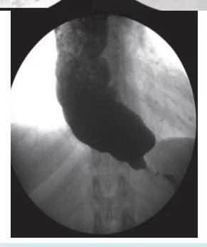
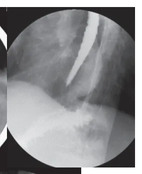
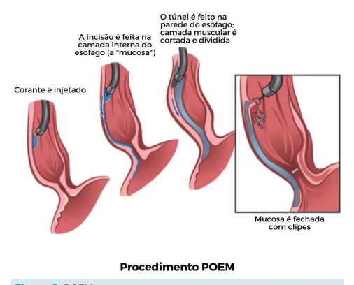
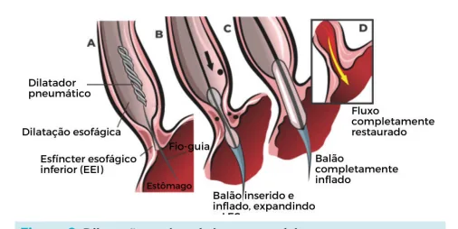

# Esôfago — Acalasia

<!-- page:1 -->

## Visão Geral

**Fisiopatologia:**

- Degeneração progressiva do plexo mioentérico (Auerbach) e submucoso (Meissner).
- Relaxamento incompleto do esfíncter esofágico inferior (EEI).
- Aperistalse do corpo esofágico.

**Exames:**

- **EDA:** não serve para diagnóstico → serve para excluir neoplasia.
- **EED (esofagograma):** avalia o grau de dilatação do esôfago (classificação de Rezende-Mascarenhas) → determina o tipo de tratamento.
- **Manometria:** padrão-ouro.

## Epidemiologia

- Principal distúrbio motor do esôfago.
- Acalasia é um fator de risco para desenvolvimento de neoplasia de esôfago, principalmente CEC.

## Fisiopatologia

- Degeneração progressiva do plexo mioentérico (Auerbach) e submucoso (Meissner), levando ao relaxamento incompleto do esfíncter esofágico inferior (EEI) e aperistalse do corpo esofágico.
- A hipertonia do EEI pode estar associada, mas ocorre na minoria dos casos de acalasia.
- O achado principal na manometria é o relaxamento incompleto sem hipertonia do EEI, associado com aperistalse do corpo esofágico.

## Etiologia

**Doença de Chagas = principal causa no Brasil!**

- Megaesôfago Chagásico (90% dos casos no Brasil) → parasitismo direto das células nervosas (minoria dos casos), ação inflamatória/neurotoxinas, mecanismo autoimune.
- Comum acometimento de esôfago, sigmoide e coração, com BRD+BDAS (bloqueio de ramo direito e bloqueio divisional ântero-superior).
- **Outras etiologias:** idiopática (principal etiologia em regiões não endêmicas de Doença de Chagas); gás mostarda (lesão nervosa direta); genética.

**Tratamento (resumo por grau):**

- **Forma Incipiente (Grau 1):** dilatação endoscópica, toxina botulínica. Cirurgia e POEM são opções.
- **Forma Não Avançada (Grau 2 e 3):** cardiomiotomia + fundoplicatura (Heller-Pinotti) ou POEM (problema = DRGE).
- **Forma Avançada (Grau 4):** esofagectomia, cirurgia de Thal-Hatafuku, mucosectomia ou cirurgia de Serra-Dória.

## Manifestações Clínicas

**Disfagia de longa duração:**

- Ao contrário da neoplasia de esôfago (disfagia de curta duração, meses).
- Início com disfagia a sólidos, progressiva.

**Regurgitação:**

- Retorno de alimento sem ânsia de vômito, esôfago-esofágica.

**Uso de coluna d'água:**

- Necessidade de ingestão de água para auxiliar na deglutição de alimentos sólidos.

**Globus:**

- Sensação de "bolo na garganta".

**Emagrecimento:**

- Emagrecimento lento; o paciente vai se acostumando.

## Exames Complementares

### EDA

- Primeiro exame a ser solicitado.
- **Objetivo:** excluir diagnósticos diferenciais (neoplasia).
- Identificação de lesões pré-malignas (cromoscopia com lugol identifica áreas suspeitas para displasia, que devem ser biopsiadas — áreas iodo-negativas são suspeitas).
- Não é um exame adequado para o diagnóstico de acalasia (é difícil o endoscopista identificar durante o exame a dilatação do esôfago, devido à insuflação de gás durante o procedimento).

### EED (Esofagograma)

- Permite identificar o grau de dilatação do esôfago.
- Importante para escolha do tratamento do paciente.
- Administração de contraste de bário via oral, com obtenção de série de radiografias.

---

<!-- page:2 -->

## Achados do EED

1. Dilatação do esôfago (normalmente o esôfago possui <3 cm; quando maior que a largura do corpo vertebral, provavelmente está aumentado).
2. Estase de contraste (retardo de esvaziamento).
3. Presença de ondas terciárias (contrações não peristálticas).
4. Estreitamento do esôfago no EEI ("bico de pássaro"/"cauda de rato").
5. Ausência de bolha gástrica.

*Figura 1: EED com dilatação do esôfago, estase do contraste, estreitamento do esôfago no EEI (bico de pássaro/cauda de rato), ausência de bolha gástrica, ondas terciárias.*

## Classificação de Rezende-Mascarenhas

**Grupo I:**

- Esôfago até 4 cm.
- Esôfago de calibre aparentemente normal ao exame radiológico. Trânsito lento. Surtos de ondas terciárias. Pequena retenção na radiografia tomada um minuto após a ingestão de sulfato de bário.

**Grupo II:**

- Esôfago entre 4-7 cm.
- Esôfago com pequeno a moderado aumento do calibre. Apreciável retenção de contraste. Presença frequente de ondas terciárias, associadas ou não a hipertonia do esôfago.

**Grupo III:**

- Esôfago entre 7-10 cm.
- Esôfago com grande aumento de diâmetro. Atividade motora reduzida. Hipotonia do esôfago inferior. Grande retenção de contraste.

**Grupo IV:**

- Esôfago maior que 10 cm.
- Dolicomegaesôfago (esôfago "deita" no diafragma). Esôfago com grande capacidade de retenção, atônico, alongado, dobrando-se sobre a cúpula diafragmática.

## Manometria

- Terceiro exame a ser solicitado — exame padrão-ouro.

1. Relaxamento incompleto do esfíncter esofágico inferior (EEI).
2. Aperistalse do corpo esofágico.
3. Hipertonia do EEI (incomum).

### Manometria Convencional

- Estudo elétrico do esôfago.
- Composto de 8 canais: 4 canais no corpo esofágico e 4 canais radiais no EEI.
- **Exame normal:** há geração de ondas peristálticas ao administrar copo de água ao paciente, e relaxamento completo do EEI.
- **Achados de acalasia:** relaxamento incompleto do EEI, aperistalse do corpo esofágico.

### Manometria de Alta Resolução

- Traduz em gráfico e em cores as pressões esofágicas, com utilização de mais canais.

## Classificação de Pinotti (EED + Manometria)

**Incipiente, Grau I:**

- Dilatação pequena ou ausente (<4 cm) + manometria com alterações mínimas (ausência de relaxamento do EEI, presença de ondas terciárias).

**Não avançada, Grau II e III:**

- Estase do contraste (dilatação <10 cm) + períodos de aperistalse na manometria.

**Avançada, Grau IV:**

- Dolicomegaesôfago (dilatação >10 cm) + atonia total do esôfago na manometria.

## Tratamento

### Tratamento Clínico

- Pouco empregado.
- Nitrato sublingual ou bloqueador de canal de cálcio diidropiridínico (nifedipino).
- **Efeito colateral:** hipotensão e cefaleia.
- Pode ser utilizado para pacientes com poucos sintomas e alto risco cirúrgico.

### Dilatação Endoscópica Pneumática

- Dilatação da transição esôfago-gástrica, com rompimento das fibras musculares que possuem relaxamento incompleto.
- Método de escolha para pacientes com alto risco cirúrgico.
- Alta recidiva.
- Resultado ruim em pacientes jovens.
- **Risco:** laceração do esôfago; necessidade de vários procedimentos consecutivos a cada 4-6 meses. Pode ser associada à injeção de toxina botulínica.

---

<!-- page:3 -->

### Injeção de Toxina Botulínica

- Relaxamento do EEI, com possibilidade de manutenção do esvaziamento.
- **Desvantagem:** preserva esôfago com disfunção motora; melhora temporária dos sintomas, tornando-se ineficaz e havendo necessidade de esofagectomia a posteriori (aproximadamente 6 meses), com necessidade de procedimentos consecutivos.

### Tratamento Endoscópico

- Mucosectomia com reconstrução com tubo gástrico.
- Esofagectomia com técnica rudimentar, com reconstrução com tubo gástrico.

### Tratamento Cirúrgico

**Cardiomiotomia + fundoplicatura a Heller-Pinotti:**

- **Indicação:** principalmente formas grau 2 e grau 3 (não avançadas).
- **Padrão-ouro.**
- **Cardiomiotomia:** miotomia ampla de 7 a 9 cm, desde a cárdia até o esôfago distal (6 cm em esôfago inferior e 3 cm abaixo da TEG) — deve-se ter certeza de que abriu o EEI.
- **Fundoplicatura a Heller-Pinotti:** póstero-latero-anterior (parcial a 270°), com diminuição do refluxo gastroesofágico (principal benefício em relação ao POEM).
- Não confundir com a hiatoplastia com fundoplicatura a Nissen (cirurgia de refluxo gastroesofágico com plastia do hiato diafragmático e fundoplicatura total).

**POEM (Miotomia Endoscópica Peroral):**

- **Benefício:** utiliza orifício natural (boca).
- Incisão na mucosa, túnel submucoso e miotomia ampla, com fechamento com clip.
- **Principal complicação:** refluxo (muito refluxo).
- **Outras complicações (raras):** perfuração esofágica, pneumotórax, pneumoperitônio, mediastinite.
- A morbidade do POEM e do procedimento cirúrgico são comparáveis, e ambos são seguros.

*Figura 2: Dilatação endoscópica pneumática.*

*Figura 3: POEM.*

## Resumo do Tratamento

- **Grau I - Incipiente:** tratamento clínico ou cardiomiotomia a Heller-Pinotti (em paciente com bom status de performance, mesmo que grau incipiente); dilatação endoscópica, POEM e injeção de toxina botulínica são opções.
- **Grau II e Grau III - Não avançada:** cardiomiotomia a Heller-Pinotti; dilatação endoscópica, POEM e injeção de toxina botulínica são opções.
- **Grau IV - Avançada:** esofagectomia; mucosectomia com reconstrução com tubo gástrico; Thal-Hatafuku e Serra-Dória são opções.
  - Cardiomiotomia + fundoplicatura totalmente anterior a 180° (mais feita nos EUA).

## Tratamento de Formas Avançadas

**Esofagectomia:**

- Por toracoscopia ou transhiatal (THE).
- **Indicação:** formas avançadas de acalasia.
- Reconstrução com tubo gástrico.

**Cirurgia de Thal-Hatafuku (esofagogastroplastia):**

- **Indicação:** formas avançadas de acalasia, em que o paciente não tem status de performance para esofagectomia.
- Consiste basicamente em uma abertura de todas as camadas da parede, que se estende de 3 a 6 cm acima e 2 a 3 cm abaixo da cárdia, em direção à grande curvatura gástrica. Resulta em uma brecha que é fechada rebatendo-se sobre ela a parede anterior do fundo gástrico.
- **Desvantagem:** preserva esôfago com disfunção motora, com possibilidade de manutenção de esvaziamento ineficaz e necessidade de esofagectomia a posteriori.

**Cirurgia de Serra-Dória combinada a vagotomia:**

- Anastomose látero-lateral entre o esôfago terminal e o fundo gástrico, visando facilitar o esvaziamento esofágico, associada a uma gastrectomia parcial em Y de Roux, prevenindo refluxo biliar.

---

<!-- page:4 -->

## Causas Frequentes de Recidiva da Disfagia

**Disfagia precoce (semanas a meses):**

1. Miotomia curta/incompleta.
2. Migração aguda (migração da fundoplicatura abdominal para o tórax, em que ocorre rotação, podendo causar disfagia).

- Início dos sintomas na transição da alimentação líquida à pastosa, para consistência normal.
- **Conduta:** EDA, EED, manometria.
- **Tratamento:** cirúrgico.

**Disfagia tardia (após anos):**

- Fibrose (cárdia).
- Reaproximação das bordas da miotomia.
- Refluxo intenso, com estenose péptica secundária a refluxo gastroesofágico.
- Mega avançado (evolução da doença).
- Neoplasia (risco aumentado de CEC e adenocarcinoma; permanece sendo necessário seguimento com EDA).

- Obs.: realizar seguimento do paciente com EDA, pois se mantém o risco de CEC.

## Referências

Figura 1: EED com dilatação do esôfago, estase do contraste, estreitamento do esôfago no EEI. Fonte: www.radiopaedia.org

Figura 2: Dilatação endoscópica pneumática. Adaptado de www.endoscopiaterapeutica.com.br

Figura 3: POEM. Adaptado de www.endoscopiaterapeutica.com.br
