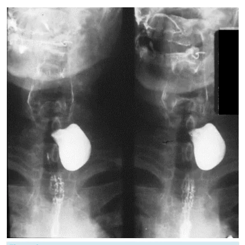
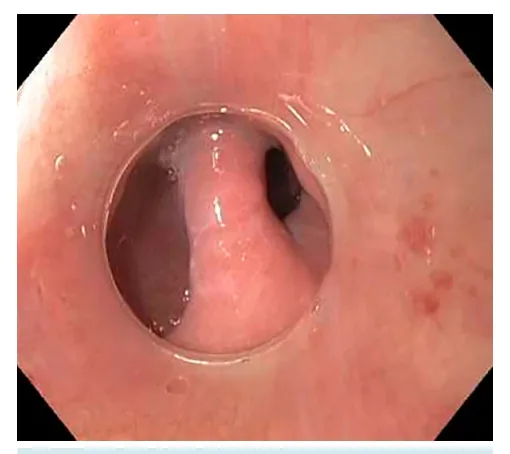
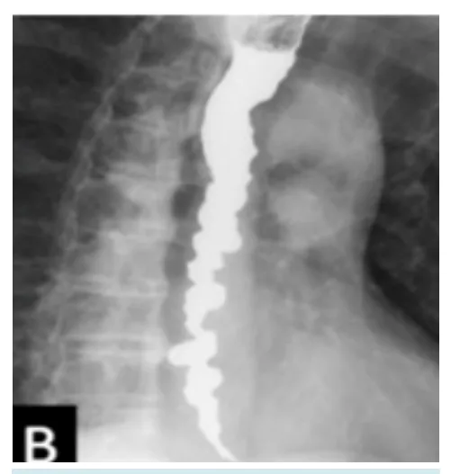
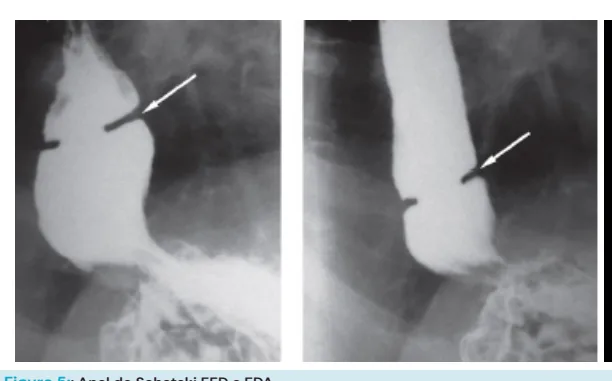

# Esôfago — Diagnósticos Diferenciais de Disfagia

<!-- page:1 -->

## Visão Geral

**Divertículo de Zenker:**

- Pulsão (falso divertículo).
- Triângulo de Killian.
- Tratamento (divertículos grandes): miotomia do cricofaríngeo + diverticulectomia.

**Divertículo de esôfago médio:**

- Tração (verdadeiro divertículo).
- Relacionado à tuberculose mediastinal.

**Divertículos epifrênicos:**

- Esôfago inferior, pulsão (falso).
- Tratamento: diverticulectomia + miotomia ampla.

## Disfagia

- **Definição:** dificuldade de deglutição.
- É um sinal de alarme e deve ser investigado com EDA + EED + manometria.

## Diagnósticos Diferenciais

- **Acalasia:** principal distúrbio motor primário do esôfago.
- **Esclerose sistêmica:** principal distúrbio motor secundário do esôfago. Doença autoimune, na forma limitada (síndrome de CREST). Pode haver acometimento esofágico com aperistalse e hipotonia do esfíncter esofágico inferior (EEI).
- **Divertículos faringoesofágicos:** divertículo de Zenker, epifrênico, de tração.
- **Esofagite eosinofílica:** doença inflamatória diagnosticada com achado de mais de 15 eosinófilos por campo de aumento no esôfago.
- **Compressões extrínsecas:** tumores de cabeça e pescoço; artéria subclávia direita aberrante → disfagia lusória.
- **Estenose de esôfago:** ingestão de soda cáustica; estenose péptica com anéis de Schatzki.
- **Neoplasia de esôfago:** disfagia importante de evolução recente.

### Tabela 1: Diagnósticos Diferenciais de Disfagia

> ⚠️ Tabela reconstruída a partir de OCR — confira contra a fonte original.

| Categoria | Causas |
|---|---|
| Alterações motoras esofágicas/orofaríngeas | Acalasia; Esclerose Sistêmica |
| Divertículos faringoesofágicos | Divertículo de Zenker; divertículo epifrênico; divertículo de tração |
| Compressão extrínseca | Neoplasia de cabeça e pescoço; artéria subclávia direita aberrante (disfagia lusória) |
| Doença inflamatória | Esofagite eosinofílica |
| Estenose de esôfago | Estenose péptica, anel de Schatzki, ingestão de cáustico |
| Neoplasia | Neoplasia de esôfago |

**Esofagite eosinofílica:**

- Disfagia.
- >15 eosinófilos/CGA (campo de grande aumento).
- Traqueização do esôfago.
- Tratamento: budesonida VO ou antileucotrienos.

**Disfagia lusória:**

- Artéria subclávia direita aberrante.

**Esclerose sistêmica:**

- Acometimento esofágico secundário.

**Acalasia:** ver material específico.

## Divertículos Esofágicos

### Divertículos de Pulsão

- **Definição:** falsos divertículos (não possuem todos os componentes da parede do esôfago — normalmente somente mucosa e submucosa).
- **Fisiopatologia:** aumento de pressão endoluminal com alteração motora do esôfago.
- **Exemplos:**
  - **Divertículo de Zenker:** o principal das provas. Distúrbio motor peristáltico do esôfago.
  - **Divertículo epifrênico:** logo acima do diafragma.
- **Tratamento:** diverticulectomia + miotomia ampla, da base do divertículo até o esfíncter esofagiano inferior (a miotomia pode prevenir formação de fístula).

### Divertículos de Tração

- **Epidemiologia:** raros. Relacionados a afecções mediastinais (tuberculose/adenomegalias) que levam à fibrose e retração local, tracionando o esôfago.
- **Definição:** são divertículos verdadeiros (possuem todas as camadas do esôfago — mucosa, submucosa e muscular).

> Lembrando que o esôfago não tem serosa.

## Divertículo de Zenker

### Definição

- Pseudodivertículo faringoesofágico de pulsão, causado por hipertonia do músculo cricofaríngeo.

### Epidemiologia

- Idosos (normalmente >70 anos).

### Fisiopatologia

- Herniação da mucosa e da submucosa (pseudodivertículo) através da área anatômica conhecida como triângulo de Killian.
- **Triângulo de Killian:** constituído superiormente pelos músculos tireofaríngeos (ou músculos constritores da faringe) e, inferiormente, pelo músculo cricofaríngeo.

---

<!-- page:2 -->

## Manifestações Clínicas

- Disfagia.
- Tosse.
- Pneumonia de repetição.
- Sensação de corpo estranho em região cervical, com manobra cervical para deglutição.
- Halitose.

## Investigação

- **Primeiro exame: EDA** (visualização de divertículo com septo separando a luz do esôfago da saculação em fundo cego — divertículo de Zenker). Atenção: a EDA pode perfurar.
- **Segundo exame: EED** (possibilita estudo de tamanho, profundidade e espessura do divertículo).

*Figura 1: Endoscopia digestiva alta com visualização de divertículo com septo separando luz do esôfago de saculação em fundo cego (divertículo de Zenker).*

*Figura 2: Estudo contrastado de esôfago-estômago-duodeno (EED) com achado de divertículo de Zenker.*

## Tratamento

- Depende do tamanho do divertículo e da sintomatologia.
- **Divertículos <2 cm e assintomáticos:** acompanhamento.
- **Divertículos >5 cm:** miotomia do cricofaríngeo + diverticulectomia.
- **Tratamento endoscópico (septostomia):** miotomia ou diverticulopexia é opção para divertículos menores.

## Esofagite Eosinofílica

- Distúrbio inflamatório do esôfago.
- Associado a alergias (atopias, rinite alérgica, asma).
- Homens jovens, com disfagia e impactação alimentar.

### Endoscopia

- Micropústulas esofágicas (infiltrados eosinofílicos).
- Traqueização do esôfago (em doença avançada).

### Diagnóstico

- Biópsias randômicas do esôfago → mais de 15 eosinófilos/campo de grande aumento.

### Diagnóstico Diferencial

- Candidíase esofágica.

### Tratamento

- Clínico: budesonida VO ou antileucotrieno.

*Figura 3: Esofagite eosinofílica com micropústulas esofágicas, traqueização e lâmina com mais de 15 eosinófilos por campo de grande aumento.*

---

<!-- page:3 -->

## Disfagia Lusória

### Definição

- Disfagia causada por artéria subclávia direita aberrante.

### Fisiopatologia

- A artéria subclávia direita aberrante possui origem à esquerda do arco aórtico, com caminho retroesofágico (posterior). Normalmente, a artéria subclávia direita se origina do tronco braquiocefálico, à frente do esôfago.
- Com a idade e desenvolvimento de aterosclerose, o paciente pode ter obstrução do esôfago pela compressão da artéria subclávia direita aberrante.

### Diagnóstico e Tratamento

- **Primeiro exame:** EDA. Achado de massa compressiva pulsátil na parede posterior do esôfago. **Não biopsiar!**
- **Tratamento clínico e multidisciplinar:** adaptação da dieta (mais pastosa, líquida, de forma lenta).
- Tratamento cirúrgico é mórbido.

## Acometimento Esofágico Relacionado à Esclerose Sistêmica

- Secundário à síndrome CREST (esclerose sistêmica limitada).
- Mulher, meia-idade.
- **Principal distúrbio motor secundário!**

### Manifestações Clínicas

- Desenvolvimento de disfagia associado a refluxo gastroesofágico.

### Exames de Imagem

- **Manometria:** aperistalse do esôfago, principalmente dos 2/3 inferiores. Esfíncter esofágico inferior hipotônico.

### Tratamento

- Clínico: adaptação de dieta e inibidor de bomba de prótons.
- Tratamento conforme sintomatologia e comorbidades (esofagectomia com reconstrução com tubo gástrico; bypass). Não se pode fazer hiatoplastia com fundoplicatura devido à aperistalse.

## Distúrbios Primários Motores do Esôfago

- **Acalasia** (ver material específico).
- **Espasmo esofágico** — diagnóstico diferencial de síndrome coronariana aguda.
  - **Fisiopatologia:** espasmos difusos do esôfago de forma esporádica. Contração sincrônica com ondas de alta amplitude.
  - **Manifestações clínicas:** dor torácica.
  - **Exame de imagem:** aspecto de esôfago em "saca-rolhas" ao EED.
  - **Tratamento:** bloqueadores de canal de cálcio e nitratos.
- **Esôfago hipercontrátil (jackhammer):** onda peristáltica hipercontrátil, principalmente em esôfago distal.
- **Motilidade esofágica ineficaz:** dismotilidade do esôfago (ondas peristálticas com menor intensidade) relacionada a refluxo gastroesofágico (agressão crônica do epitélio do esôfago pelo refluxo). Peristalse ineficaz.

*Figura 4: Espasmo esofágico ao EED, com aspecto de saca-rolhas.*

## Pseudoacalásias

- Distúrbio esofágico que imita acalasia.
- Em casos mais severos, pode haver aperistalse do corpo esofágico na manometria.
- **Principais causas:** neoplasia de esôfago, ou neoplasia que leva à compressão extrínseca do esôfago, ou cirurgia esofágica prévia que leve à compressão extrínseca do hiato esofágico ou da válvula da hiatoplastia com fundoplicatura.

## Anéis ou Membranas Esofágicas

### Síndrome de Plummer-Vinson

- Mais comum em mulheres.
- Membrana esofágica + anemia ferropriva + queilite angular + onicodistrofia.
- Risco aumentado de CEC de esôfago.

### Anel de Schatzki

- Anel da transição esofagogástrica (associação com estenose péptica e DRGE).
- **Tratamento:** dilatação pneumática esofágica e IBP em dose plena. Discutir cirurgia em pacientes com estenoses muito grandes, não dilatáveis.

---

<!-- page:4 -->

*Figura 5: Anel de Schatzki ao EED e à EDA.*

## Referências

Figura 1: Endoscopia digestiva alta com visualização de divertículo com septo separando luz do esôfago de saculação em fundo cego — divertículo de Zenker. Fonte: www.endoscopiaterapeutica.com.br

Figura 2: Estudo contrastado de esôfago-estômago-duodeno (EED) com achado de divertículo de Zenker. Fonte: www.endoscopiaterapeutica.com.br

Figura 3: Esofagite eosinofílica com micropústulas esofágicas, traqueização e lâmina com mais de 15 eosinófilos por campo de grande aumento. Fonte: www.endoscopiaterapeutica.com.br

Figura 4: Espasmo esofageano ao EED, em aspecto de saca-rolhas. Fonte: www.endoscopiaterapeutica.com.br

Figura 5: Anel de Schatzki ao EED e à EDA. Fonte: https://endoscopiaterapeutica.com.br/

