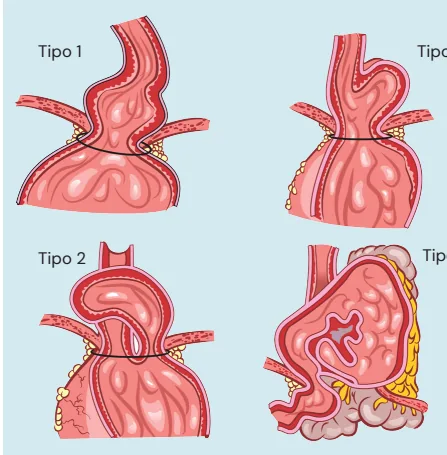
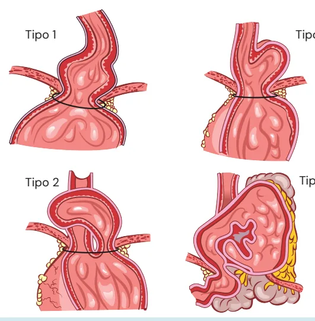

# Esôfago Hérnias de Hiato

<!-- page:1 -->

Esôfago (CIR) Tipo 1 Tipo 3 Tipo 2 Tipo 4

## EPIDEMIOLOGIA

- 10% da população apresenta hérnia de hiato e a minoria possui indicação de tratamento cirúrgico

## FISIOPATOLOGIA

- Alargamento do hiato (frouxidão dos pilares diafragmáticos)

- Aumento da pressão intra abdominal (por exemplo:

pós abdominoplastia, muito exercício físico abdominal, obesidade)

- **Encurtamento esofágico (menos evidências)

## DIAGNÓSTICO

- Padrão ouro: RX contrastado (avaliação anatômica, tamanho, volume, órgãos herniados, classificação)

- Endoscopia TEG (pregas gástricas) >= 2cm acima do pinçamento diafragmático Superestima pacientes com hérnias de hiato (pode haver aumento da pressão gástrica com insuflação de ar durante o exame)

- Pode predispor a DRGE (minoria dos pacientes com hérnia de hiato possuem refluxo. Há apenas indicação de cirurgia quando paciente com hérnia de hiato e ou em bons respondedores, porém dependentes de omeprazol) Tipo 1 - por deslizamento (90%)

DRGE e não respondedor a seu tratamento clínico

- Alargamento do hiato esofágico associado a diminuição do tônus da membrana frenoesofágica, o que permite que a porção intra-abdominal do esôfago e parte do estômago deslizem para o tórax

Tipo 2 - paraesofágica (por rolamento) - (rara)

- A JEG (junção esofago-gástrica) permanece em sua localização normal enquanto uma parte do estômago hernia acima do diafragma

Tipo 3 - Paraesofágica - hérnia mista (tipo 1 + 2)

- A JEG é deslocada para o tórax com uma grande porção do estômago outras vísceras)

Tipo 4 - Paraesofágica - hérnia mista (migração de

- Presença de outras vísceras, como cólon delgado, baço ou pâncreas/volvo gástrico

- Tríade de Borchard (diagnóstico de volvo gástrico): dor em região epigástrica + ânsia de vômito sem exteriorizar conteúdo + dificuldade + incapacidade de passar uma sonda nasoenteral.

- Pode causar disfagia por impactação do bolo alimentar por alteração anatômica local

## CLASSIFICAÇÃO

Tipo 1 - por deslizamento (90%)

- Alargamento do hiato esofágico associado a diminuição do tônus da membrana frenoesofágica, o que permite que a porção intra-abdominal do esôfago e parte do estômago deslizem para o tórax

Tipo 2 - paraesofágica (por rolamento) - (rara)

- A JEG (junção esofago-gástrica) permanece em sua localização normal enquanto uma parte do estômago hernia acima do diafragma

Tipo 3 - Paraesofágica - hérnia mista (tipo 1 + 2)

- A JEG é deslocada para o tórax com uma grande porção do estômago vísceras)

Tipo 4 - Paraesofágica - hérnia mista (migração de outras

- Presença de outras vísceras, como cólon delgado, baço ou pâncreas/volvo gástrico

- Tríade de Borchard (diagnóstico de volvo gástrico): dor em região epigástrica + ânsia de vômito sem exteriorizar conteúdo + dificuldade + incapacidade de passar uma sonda nasoenteral.

---

<!-- page:2 -->

Tipo 1 Tipo 3 Tipo 2 Tipo 4 Figura 1: Classificação de hérnias de hiato

## TRATAMENTO

- Hérnia tipo I - mesmo princípio tratamento da DRGE =

IBP dose plena e medidas comportamentais;

- Hérnia tipo II/III/IV - depende da sintomatologia: Obstrução alimentar (disfagia ou volvo) = cirurgia Úlcera de Cameron (úlcera vascular no local da hérnia) = cirurgia Refluxo = mesmo princípio tratamento DRGE Assintomático = seguimento

Cirurgia:

- Indicação: DRGE refratário a medidas clínicas + hérnia de hiato Hérnia de hiato dependente de omeprazol Hérnia de hiato associada a úlcera de cameron Hérnia de hiato associada a obstrução alimentar ** Hérnias tipos II e IV têm maior risco de sintomas e complicações - mais liberal para tratamento cirúrgico **

- Técnica = Hiatoplastia + Fundoplicatura de preferência a Nissen

- Hérnias grandes → plicatura da valva do estômago aos pilares diafragmáticos associada ou não a plicatura do estômago à parede abdominal.

