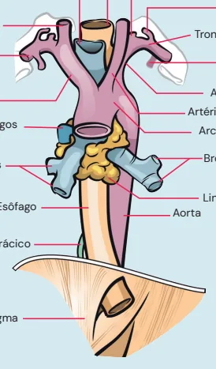
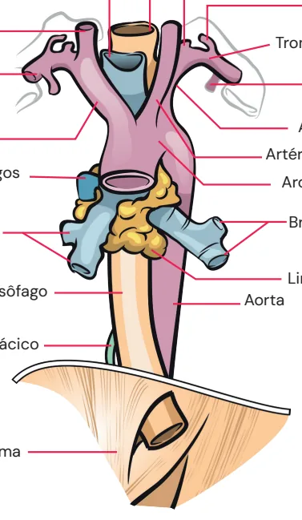
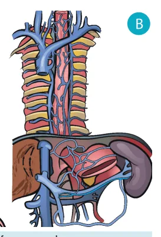
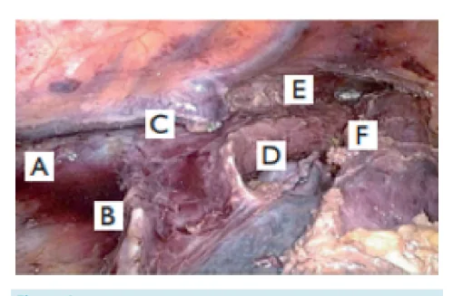
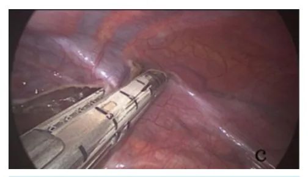

# Esôfago — Introdução

<!-- page:1 -->

## Anatomia do Esôfago

- **Porções do esôfago:** esôfago cervical, torácico e abdominal.
- O esôfago se inicia na orofaringe e termina no abdome, possuindo relação com traqueia, aorta, subclávias, tronco braquiocefálico, veia ázigos e coluna vertebral.
- O esôfago **não possui serosa**, diferentemente de outras vísceras abdominais, implicando disseminação tumoral linfática mais precoce em relação a tumores de outros órgãos.
- O 1/3 superior do esôfago é constituído por musculatura esquelética, enquanto os 2/3 inferiores são constituídos por musculatura lisa, o que faz com que a velocidade de impulso elétrico no terço superior seja maior que nos terços inferiores, evidenciada na manometria.

> ⚠️ Diagrama anatômico (relações do esôfago com traqueia, artérias subclávia e carótida direitas, artéria braquiocefálica, arco da veia ázigos, brônquios direitos, ducto torácico, diafragma) reconstruído a partir de OCR — confira contra a fonte original.

### Irrigação Arterial

- Não há uma artéria única que irrigue o esôfago; são vários pequenos ramos que o irrigam:
  - **Terço superior:** ramos das artérias tireoideas inferiores (ramos do tronco tireocervical) e brônquicas (ramos diretos da aorta).
  - **Terço médio:** ramos esofágicos da aorta e das artérias brônquicas.
  - **Terço inferior:** ramos da artéria gástrica esquerda e das artérias frênicas inferiores.
- Como o esôfago não possui artéria única, em uma esofagectomia, por exemplo, faz-se ligadura de vários pequenos vasos que circundam o esôfago. Um vaso importante identificado na cirurgia é o ramo da artéria brônquica, visto após ligadura da crossa da veia ázigos, que deve ser ligada, pois pode levar a sangramento importante.

### Drenagem Venosa

- Não há uma veia única que drena o esôfago.

---

<!-- page:2 -->

- **Terço superior:** veias tireoideas inferiores + veias jugulares.
- **Terço médio:** sistema ázigos.
- **Terço inferior/fundo gástrico:** veia cava inferior + sistema porta.

> Obs.: a veia ázigos é uma veia que corre paralela à coluna torácica e cruza na frente do esôfago na crossa da veia ázigos, etapa importante da esofagectomia.

### Inervação

- Ramos do nervo vago. No tórax, o nervo vago está tanto à direita quanto à esquerda do esôfago; assim que há a transição toracoabdominal, o nervo esquerdo passa para anterior e o nervo direito para posterior.
- O nervo vago é importante para inervação de todas as outras vísceras, piloro, secreção ácida gástrica, etc.
- **Macete:** vogal-vogal (Esquerdo, Anterior), consoante-consoante (Direito, Posterior).

### Drenagem Linfática

- Complexa. Normalmente, os linfonodos seguem a irrigação arterial do órgão:
  - **Esôfago superior:** cadeias cervicais e mediastinais.
  - **Esôfago inferior:** linfonodos celíacos — na esofagectomia oncológica, deve-se fazer linfadenectomia do tronco celíaco (principalmente cadeia 9, 8a), assim como do mediastino inferior, paratraqueais, infracarinal e até recorrenciais.
- Os japoneses fazem até linfadenectomia cervical, não muito feita no Ocidente.

*Figura 1: (A) Inervação do esôfago: ramos do nervo vago. (B) Drenagem venosa do esôfago.*

*Figura 2: Relação do esôfago com estruturas cervicais, torácicas e abdominais (traqueia, artéria subclávia direita, artéria carótida comum direita, artéria braquiocefálica, arco da veia ázigos, brônquios direitos, ducto torácico, diafragma, artéria vertebral, tronco costocervical, tronco tireocervical, artéria torácica interna/mamária interna, artéria subclávia esquerda, artéria carótida comum esquerda, arco aórtico, brônquios esquerdos, linfonodos traqueobrônquicos, aorta).*

---

<!-- page:3 -->

*Figura 3: Anatomia após esofagectomia. O esôfago está sendo rebatido para cima. Relação anatômica com pericárdio, veia pulmonar esquerda (A), veia pulmonar direita (B), brônquio-fonte esquerdo (C), carina (E), brônquio-fonte direito (D). O esôfago tem relação íntima com essas estruturas, e uma linfadenectomia muito importante realizada durante a esofagectomia transtorácica é a do linfonodo infracarinal (entre os brônquios-fontes e acima do pericárdio).*

*Figura 4: Anatomia após esofagectomia transtorácica. Brônquio-fonte esquerdo (A), brônquio-fonte direito (B), crossa da veia ázigos ligada (C), e todo o território dos linfonodos paratraqueais/recorrenciais (E)(F), localizados acima da carina — local em que se pode ou não fazer linfadenectomia, como por exemplo em alguns casos de CEC quando há suspeita de acometimento dos linfonodos recorrenciais.*

*Figura 5: Ligadura da crossa da veia ázigos. Etapa extremamente importante na esofagectomia com linfadenectomia apropriada. Após a ligadura da veia ázigos, há evidência de uma artéria (ramo da artéria brônquica), que deve ser ligada durante o procedimento.*

## Referência

Figura 3: Anatomia após esofagectomia. Acervo pessoal Medcof, modificado.

Figura 4: Anatomia após esofagectomia transtorácica. Acervo pessoal Medcof, modificado.

Figura 5: Ligadura da crossa da veia ázigos. Acervo pessoal Medcof, modificado.

