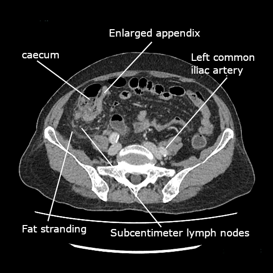

# ABDOME AGUDO INFLAMATÓRIO

O abdome agudo inflamatório é, sem dúvida, o tema que você mais encontrará no seu plantão de cirurgia e, consequentemente, o que mais aparecerá na sua prova de residência. Quando falamos em "inflamatório", estamos descrevendo um processo de irritação peritoneal decorrente de uma inflamação ou infecção de um órgão intra-abdominal.

Diferente do abdome agudo obstrutivo (onde o problema é o trânsito) ou do hemorrágico (onde o problema é o volume), aqui o marcador principal é a **dor abdominal de início insidioso que se agrava com o tempo**, acompanhada de sinais de resposta inflamatória sistêmica.

## Apendicite Aguda: A Soberana das Provas

Se você tiver que dominar apenas um assunto para a prova, que seja este. A apendicite aguda é a causa mais comum de abdome agudo cirúrgico no mundo, afetando todas as faixas etárias, com um pico de incidência entre a segunda e terceira décadas de vida.

### Fisiopatologia: O porquê da dor migratória

Por que a dor da apendicite começa no epigástrio e depois vai para a fossa ilíaca direita (FID)? Isso não é capricho do destino, é neuroanatomia pura.

Tudo começa com a **obstrução da luz apendicular**. Em jovens, a causa principal é a hiperplasia linfoide (pós-infecção viral); em idosos, cuidado: o culpado costuma ser o fecalito (ou apendicolito) ou, menos comum mas importante, uma neoplasia de ceco.

Uma vez obstruído, o apêndice continua produzindo muco. A pressão intraluminal sobe, distendendo a parede. Essa distensão estimula fibras nervosas viscerais (fibras C), que levam a informação para a medula nos níveis de T8 a T10. O cérebro interpreta isso como uma dor mal localizada na região periumbilical ou epigástrica.

Conforme a inflamação progride e atinge a serosa do apêndice e o peritônio parietal adjacente, fibras somáticas (fibras A-delta) são estimuladas. Estas são precisas. Elas dizem exatamente onde dói: no ponto de McBurney. É por isso que a **migração da dor** é o sintoma com maior valor preditivo para o diagnóstico.

### Microbiologia: Quem mora lá?

A flora da apendicite é polimicrobiana. Os principais vilões que você deve marcar na prova são a *Escherichia coli* (Gram-negativa) e o *Bacteroides fragilis* (anaeróbio).

**Dica de prova:** Se a questão mencionar uma apendicite perfurada, a flora se torna ainda mais complexa, podendo incluir *Pseudomonas*. Mas atenção: o *Clostridium difficile* **NÃO** faz parte da patogênese habitual da apendicite aguda.

### Quadro Clínico e Exame Físico

O diagnóstico da apendicite é eminentemente **clínico**. Guarde os sinais clássicos, pois as bancas os utilizam para descrever o caso clínico sem dar o nome da doença:

- **Sinal de Blumberg:** Dor à descompressão brusca no ponto de McBurney. Indica irritação peritoneal.

- **Sinal de Rovsing:** Dor na FID ao comprimir a fossa ilíaca esquerda (FIE). Por que acontece? Porque você desloca o gás do cólon retrógradamente, distendendo o ceco e o apêndice inflamado.

- **Sinal de Dunphy:** Dor na FID que piora com a tosse. É um sinal refinado de irritação peritoneal.

- **Sinal do Psoas:** Dor à extensão da coxa direita (comum em apêndices retrocecais).

- **Sinal do Obturador:** Dor à rotação interna da coxa direita (comum em apêndices pélvicos).

## Diagnóstico por Imagem: Quando pedir?

Em homens jovens com quadro clássico, o diagnóstico pode ser clínico. No entanto, a tendência moderna (e o que cai em prova) é a confirmação por imagem para reduzir apendicectomias brancas.

- **Ultrassonografia (USG):** Primeira escolha em crianças e gestantes. Vemos um apêndice não compressível, com diâmetro > 6 mm.

- **Tomografia Computadorizada (TC) de Abdome:** É o **padrão-ouro** para adultos e idosos. Tem sensibilidade e especificidade superiores a 95%. Os achados incluem: apêndice > 6 mm, borramento da gordura pericecal, presença de apendicolito e realce da parede.

**Cuidado:** Se a TC mostrar "gás fora da alça" ou "infiltração pericecal importante", estamos diante de uma apendicite complicada (perfurada).

### Classificação e Conduta

Aqui é onde o aluno costuma errar. A conduta depende do estágio da doença.

| Estágio | Descrição | Conduta Sugerida |
| --- | --- | --- |
| **Grau I** | Edematosa (catarral) | Apendicectomia + ATB profilático |
| **Grau II** | Flegmonosa (supurativa) | Apendicectomia + ATB profilático |
| **Grau III** | Gangrenosa (necrótica) | Apendicectomia + ATB terapêutico |
| **Grau IV** | Perfurada (com peritonite ou abscesso) | Ver abaixo (conduta individualizada) |

**Apendicite Complicada (Plastrão ou Abscesso):**
Se o paciente chega com mais de 5-7 dias de evolução, massa palpável e estabilidade clínica, ele provavelmente formou um **plastrão** (o bloqueio do omento e alças).

- **Conduta:** Antibioticoterapia IV + Suporte. Se houver abscesso > 4-6 cm, a **drenagem percutânea guiada por imagem** é a primeira linha.

- **Apendicectomia de intervalo:** Realizada após 6 a 8 semanas. Por que não operar na hora? Porque o tecido está friável e inflamado, o risco de lesão intestinal e fístula é altíssimo.

**Apendicite com Peritonite Difusa:**
Aqui não tem conversa. É emergência cirúrgica. Lavagem exaustiva da cavidade e apendicectomia. A via laparoscópica é preferível por reduzir infecção de parede, embora o risco de abscesso intracavitário pós-operatório seja similar ou levemente maior em casos muito supurados.

## Diverticulite Aguda: A "Apendicite à Esquerda"

A diverticulite é a inflamação de um divertículo (geralmente de pulsão) no cólon, sendo o sigmoide o local mais afetado. É a doença do paciente mais velho, embora a incidência em jovens venha crescendo.

### Fisiopatologia

Diferente do que se pensava antigamente, a semente de tomate não causa diverticulite. A causa é a obstrução do colo do divertículo por um pequeno fecalito, levando a aumento da pressão, isquemia e microperfuração.

### Diagnóstico: O que NÃO fazer

O quadro clássico é: idoso com dor em FIE, febre e leucocitose.
O exame de escolha é a **TC de abdome com contraste**. Ela confirma o diagnóstico e, mais importante, faz o estadiamento pela Classificação de Hinchey.

**ERRO CLÁSSICO DE PROVA:** Marcar colonoscopia ou enema opaco na fase aguda. **NUNCA** faça isso. O risco de transformar uma microperfuração em uma perfuração franca por insuflação de ar é enorme. A colonoscopia deve ser feita 4 a 6 semanas após a resolução do quadro para excluir neoplasia colorretal.

### Classificação de Hinchey e Tratamento

Esta tabela você precisa tatuar no braço para a prova:

| Hinchey | Descrição | Conduta |
| --- | --- | --- |
| **Ia** | Flegmão / Inflamação pericólica | ATB oral + Dieta líquida (Ambulatorial) |
| **Ib** | Abscesso pericólico ou mesentérico (< 4-5cm) | ATB IV + Internação |
| **II** | Abscesso pélvico ou à distância | ATB IV + Drenagem Percutânea |
| **III** | Peritonite Purulenta generalizada | Cirurgia de Urgência |
| **IV** | Peritonite Fecal generalizada | Cirurgia de Urgência (Hartmann) |

**Por que Cirurgia de Hartmann no Hinchey IV?**
Em um ambiente de peritonite fecal (fezes na cavidade), o cólon está inflamado e o paciente muitas vezes instável. Tentar uma anastomose primária (emendar o intestino) é pedir para a costura abrir. Fazemos a ressecção do sigmoide, fechamos o coto retal e fazemos uma colostomia terminal.

**Diverticulite não complicada (Hinchey I):** Se o paciente estiver bem, sem sinais de irritação peritoneal e tolerando dieta, o tratamento pode ser ambulatorial com ATB oral (Ciprofloxacino + Metronidazol) e dieta de baixos resíduos.

## Doença Inflamatória Pélvica (DIP) e Outros Diagnósticos

No abdome agudo inflamatório, o diagnóstico diferencial é vasto. Em mulheres jovens, a DIP é a grande simuladora da apendicite.

### Síndrome de Fitz-Hugh-Curtis

Imagine uma paciente com dor pélvica crônica que agora apresenta dor em hipocôndrio direito. Na laparoscopia, você vê aderências em "corda de violino" entre a cápsula de Glisson (fígado) e a parede abdominal. Isso é a Síndrome de Fitz-Hugh-Curtis, uma perihepatite causada por *Neisseria gonorrhoeae* ou *Chlamydia trachomatis*.

### Divertículo de Zenker

Embora não seja uma causa de abdome agudo, ele aparece nas questões de cirurgia digestiva inflamatória/estrutural. É um **divertículo de pulsão** (falso divertículo) que ocorre no **triângulo de Killian** (entre as fibras do músculo tireofaríngeo e cricofaríngeo). O paciente queixa-se de disfagia, halitose e regurgitação de alimentos antigos.

### Pseudomixoma Peritoneal

Se a questão descrever "ascite mucinosa", "material gelatinoso na paracentese" ou "implantes peritoneais" em um paciente que teve um quadro de apendicite ou massa apendicular, pense em Pseudomixoma Peritoneal. A origem mais comum é um cistoadenocarcinoma mucinoso do apêndice que rompeu.

## Complicações Pós-Operatórias e Abscessos

O Dr. Will sempre lembra nas discussões do MedEvo: "A cirurgia não termina quando o cirurgião fecha a pele". O pós-operatório é um período crítico.

### Abscesso Intra-abdominal Pós-Operatório

Se o paciente operou uma apendicite complicada e, no 5º ao 7º dia pós-operatório, volta a ter febre, leucocitose e dor abdominal, suspeite de abscesso residual.

- **Diagnóstico:** TC de abdome.

- **Tratamento:** Se o abscesso for acessível, a **drenagem percutânea guiada por imagem** é o padrão. Se o paciente estiver instável ou com sinais de peritonite difusa, reabordagem cirúrgica.

### Fístulas Digestivas

Uma complicação temida após cirurgias colorretais. Se houver saída de conteúdo entérico pelo dreno ou pela ferida operatória:

- **Estabilizar:** Corrigir distúrbios hidroeletrolíticos e controlar a sepse.

- **Nutrição:** O suporte nutricional é fundamental. Fístulas de alto débito (> 500 ml/dia) geralmente requerem Nutrição Parenteral Total (NPT) para "dar descanso" ao intestino.

- **Localizar:** Definir a anatomia da fístula após a fase aguda.

### Complicações Pulmonares

A febre no 1º ou 2º dia pós-operatório de cirurgia abdominal alta ou média raramente é infecção de ferida. Pense em **atelectasia**. O tratamento é fisioterapia respiratória e deambulação precoce.

## Abscesso Hepático: Piogênico vs. Amebiano

Um tema que as bancas adoram para diferenciar o tratamento.

- **Abscesso Piogênico:** Geralmente polimicrobiano (E. coli, Klebsiella). Ocorre por via biliar (colangite) ou portal (apendicite). **Tratamento:** ATB + Drenagem (percutânea é preferível).

- **Abscesso Amebiano:** Causado pela *Entamoeba histolytica*. Geralmente é um abscesso único, no lobo direito, com aspecto de "pasta de anchovas". **Tratamento:** Metronidazol. A drenagem é reservada apenas para casos de risco de ruptura ou falha do tratamento clínico.

## Tabelas Comparativas para Revisão Rápida

### Diagnóstico Diferencial de Dor em Fossa Ilíaca Direita

| Causa | Pista Clínica | Exame de Escolha |
| --- | --- | --- |
| **Apendicite** | Migração da dor, anorexia, Blumberg+ | TC de Abdome |
| **DIP / Abscesso Tubo-ovariano** | Corrimento vaginal, dor à mobilização do colo | USG Transvaginal |
| **Gravidez Ectópica** | Atraso menstrual, choque (se rota) | Beta-hCG + USG |
| **Adenite Mesentérica** | Criança com IVAS recente | USG (Linfonodos > 8mm) |
| **Diverticulite de Meckel** | Quadro idêntico à apendicite, mas em íleo | Cintilografia (raro cair) |

### Antibioticoterapia no Abdome Agudo Inflamatório

| Cenário | Esquema Sugerido |
| --- | --- |
| **Comunitário Leve/Moderado** | Ciprofloxacino + Metronidazol OU Ceftriaxone + Metronidazol |
| **Grave / Hospitalar** | Piperacilina/Tazobactam OU Carbapenêmico |
| **Apendicite Não Complicada** | Profilaxia (dose única na indução) |
| **Diverticulite Hinchey I** | Oral (Ambulatorial) por 7-10 dias |

## Pontos-Chave para Prova

- **Apendicite Aguda:** É a causa mais comum de abdome agudo inflamatório em todas as idades.

- **Sinal de Rovsing:** Dor na FID ao comprimir a FIE. Clássico de prova.

- **Sinal de Dunphy:** Dor ao tossir. Indica irritação peritoneal.

- **Padrão-ouro Diverticulite:** TC de abdome com contraste. **Colonoscopia é contraindicada na fase aguda.**

- **Hinchey III e IV:** Tratamento é cirúrgico. Hinchey IV (peritonite fecal) exige Cirurgia de Hartmann.

- **Abscesso Apendicular:** Se > 4-6 cm, conduta é ATB + Drenagem Percutânea + Apendicectomia de intervalo (6-8 semanas).

- **Microbiologia:** *E. coli* e *Bacteroides fragilis* são os protagonistas.

- **Divertículo de Zenker:** Localizado no triângulo de Killian, acima do músculo cricofaríngeo. É um divertículo de pulsão.

- **Síndrome de Fitz-Hugh-Curtis:** Perihepatite por DIP (Neisseria/Chlamydia). Aderências em "corda de violino".

- **Pseudomixoma Peritoneal:** Origem mais comum é o apêndice. Caracterizado por ascite mucinosa.

- **Abscesso Pós-Operatório:** Suspeitar se febre persistente após o 5º dia. Drenagem percutânea é a primeira escolha se houver coleção bem delimitada.

- **Atelectasia:** Principal causa de febre nas primeiras 48h de pós-operatório abdominal.

- **Drenagem de Abscesso Hepático:** Piogênico drena; Amebiano trata com Metronidazol (drena só se risco de ruptura).

- **Incidentaloma Adrenal:** Se ≥ 5 cm, a recomendação é a remoção cirúrgica pelo risco de malignidade. 🛡️

 Cópia offline para consulta pessoal.
 Fonte original:
 [https://www.medevo.com.br/material-apoio/ler/8aa4609d-f5d4-4daf-b9ff-1c0b5d29fbd1](https://www.medevo.com.br/material-apoio/ler/8aa4609d-f5d4-4daf-b9ff-1c0b5d29fbd1)
