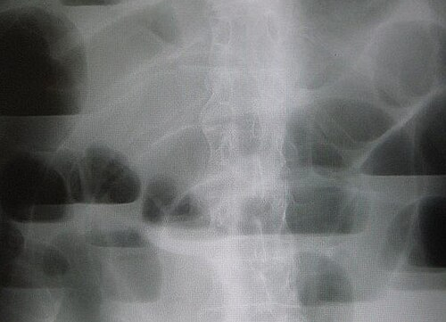
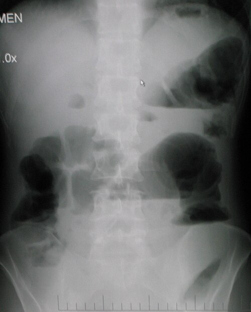

# ABDOME AGUDO OBSTRUTIVO

O abdome agudo obstrutivo é uma das síndromes mais frequentes nos plantões de cirurgia e, consequentemente, um dos temas prediletos das bancas de residência. Para entender esse tema, você não deve decorar uma lista de causas; você precisa entender a **dinâmica do fluxo intestinal**.

Imagine o trato gastrointestinal como uma rodovia. A obstrução pode acontecer porque houve um desmoronamento na pista (causa mecânica) ou porque os carros simplesmente pararam de funcionar (causa funcional). Se você entende onde é o bloqueio e por que ele aconteceu, o diagnóstico e a conduta tornam-se lógicos.

## Classificação e Fisiopatologia: O "Porquê" dos Sintomas

A primeira grande divisão que você deve fazer na sua cabeça é entre **obstrução mecânica** e **obstrução funcional**.

Na obstrução mecânica, existe um obstáculo físico real. O intestino tenta vencer esse obstáculo aumentando o peristaltismo (o que gera a dor em cólica e os ruídos hidroaéreos aumentados, por vezes metálicos). Já na obstrução funcional (íleo paralítico ou pseudo-obstrução), o problema é a motilidade. O intestino está "preguiçoso", parado, e os ruídos estarão reduzidos ou ausentes.

### A Cascata de Eventos

Quando o trânsito para, o conteúdo (líquidos e gases) acumula-se a montante (antes) do ponto de obstrução. Isso leva a:

- **Distensão abdominal:** O acúmulo de gás (engolido e produzido por bactérias) e líquido (secreções digestivas) estica a parede intestinal.

- **Sequestro de líquidos (Terceiro Espaço):** A distensão aumenta a pressão intraluminal, dificultando o retorno venoso e linfático. O líquido "vaza" para a luz intestinal e para o peritônio. É por isso que o paciente obstruído desidrata rápido, mesmo sem vomitar muito.

- **Proliferação bacteriana e translocação:** O estase favorece o crescimento de bactérias que podem atravessar a parede intestinal comprometida.

- **Isquemia e Perfuração:** Se a pressão for maior que a pressão de perfusão capilar, a alça sofre necrose (estrangulamento).

**Dica do Dr. Will:** Em provas, se falarem em "alça fechada", ligue o sinal de alerta. Isso ocorre quando a alça está obstruída em dois pontos (ex: um volvo ou uma obstrução de cólon com válvula ileocecal competente). O risco de isquemia e perfuração aqui é altíssimo e muito mais rápido!

## Etiologia: Quem é o Culpado?

As causas mudam completamente dependendo de onde está a obstrução. No MedEvo, sempre reforçamos: olhe para a idade do paciente e o histórico cirúrgico.

## Obstrução de Intestino Delgado (Alta)

É a causa mais comum de obstrução mecânica.

- **Aderências (Bridas):** Disparado a causa nº 1 em adultos com cirurgia prévia. Se o enunciado diz "paciente com cicatriz de laparotomia", sua primeira hipótese deve ser brida.

- **Hérnias da Parede Abdominal:** Segunda causa mais comum. Nunca, jamais, termine um exame físico de abdome agudo sem palpar as regiões inguinais. Uma hérnia encarcerada é uma causa cirúrgica óbvia.

- **Neoplasias:** Menos comuns no delgado que no cólon, mas podem ocorrer (adenocarcinoma, linfoma, metástases).

- **Íleo Biliar:** Uma "pérola" de prova. Um cálculo biliar grande passa por uma fístula colecistoentérica e entala, geralmente na válvula ileocecal.

### Obstrução de Intestino Grosso (Baixa)

- **Câncer Colorretal:** A causa nº 1 de obstrução de cólon em adultos. Geralmente é um quadro mais insidioso, com perda de peso e alteração do hábito intestinal prévios.

- **Vólvulo (Volvo):** É a torção da alça sobre seu próprio eixo mesentérico. O local mais comum é o **sigmoide**, seguido pelo ceco. É típico do idoso, muitas vezes acamado ou com doenças neurológicas (chagásicos também são alvo fácil).

- **Fecaloma:** Comum em idosos e pacientes psiquiátricos. O toque retal faz o diagnóstico.

| Localização | Causa Principal | Achado Radiológico Típico |
| --- | --- | --- |
| **Delgado** | Bridas / Aderências | Empilhamento de moedas (valvulae conniventes) |
| **Cólon** | Câncer Colorretal | Distensão periférica, haustrações |
| **Cólon (Volvo)** | Volvo de Sigmoide | Sinal do "Grão de Café" ou "U Invertido" |

## Quadro Clínico: A Arte de Diferenciar

Os quatro pilares do abdome agudo obstrutivo são: **dor abdominal, vômitos, distensão e parada de eliminação de gases e fezes.**

A ordem e a intensidade desses sintomas te dizem onde está o problema:

- **Obstrução Alta (Delgado Proximal):** Vômitos precoces e biliosos, dor intensa, distensão abdominal discreta (o conteúdo sai por cima).

- **Obstrução Baixa (Cólon):** Distensão abdominal acentuada, vômitos tardios (podendo ser fecaloides), parada de eliminação de gases e fezes bem marcada.

**Cuidado com o erro clássico:** Achar que vômito fecaloide é sinal de obstrução alta. Errado! O vômito fecaloide indica que o conteúdo ficou parado tempo suficiente para sofrer ação bacteriana, o que é típico de obstruções **distais** (jejuno distal, íleo ou cólon).

### O Exame Físico

Além da inspeção (procurar cicatrizes e abaulamentos de hérnias), a ausculta é fundamental. No início, os ruídos são aumentados e metálicos (luta). Com o tempo, o intestino "cansa" e entra em silêncio.
A percussão revela hipertimpanismo. O toque retal é obrigatório para descartar fecaloma e tumores de reto baixo.

## Diagnóstico por Imagem: O que as Bancas Cobram

A rotina de abdome agudo (RX de tórax em pé, RX de abdome em pé e deitado) ainda é o ponto de partida.

- **Radiografia de Delgado:** Você verá alças centralizadas com pregas que atravessam toda a luz da alça (valvulae conniventes), o famoso **empilhamento de moedas**.

2. **Radiografia de Cólon:** Alças periféricas com haustrações que NÃO atravessam toda a luz.
3. **Volvo de Sigmoide:** Imagem clássica em "U invertido" ou "fruto do cacau" ou "grão de café". A alça nasce na pelve e sobe até o diafragma.

4. **Íleo Biliar:** Procure pela **Tríade de Rigler**:
 * Pneumobilia (ar na via biliar).
 * Obstrução de delgado (níveis hidroaéreos).
 * Cálculo biliar ectópico (geralmente na fossa ilíaca direita).

**Tomografia de Abdome:** É o padrão-ouro atual. Ela não só confirma a obstrução, mas localiza o ponto de transição (onde a alça dilatada vira alça colapsada) e, mais importante, vê **sinais de sofrimento de alça** (edema de mesentério, líquido livre, realce ausente da parede).

## Manejo Inicial: O Protocolo de Sobrevivência

Antes de decidir se o paciente vai para o centro cirúrgico, você deve estabilizá-lo. Isso cai muito em prova como "conduta inicial".

- **Nada por via oral (NPO):** Não queremos aumentar a pressão intraluminal.

- **Hidratação Venosa Vigorosa:** O paciente está desidratado pelo terceiro espaço. Use Cristaloides (Ringer Lactato ou Soro Fisiológico).

- **Sonda Nasogástrica (SNG) em aspiração:** Fundamental para descompressão gástrica, reduzindo o risco de broncoaspiração e aliviando o desconforto.

- **Correção de Distúrbios Hidroeletrolíticos:**

- Obstruções altas com vômitos frequentes levam à **Alcalose Metabólica Hipoclorêmica e Hipocalêmica**. Por que? Porque o paciente perde H+ e Cl- no vômito e o rim, tentando poupar volume, acaba excretando K+.

## Tratamento: Conservador ou Cirúrgico?

Aqui é onde o cirurgião decide o destino do paciente.

### Quando ser Conservador?

Indicado principalmente para **obstrução por bridas** sem sinais de estrangulamento.

- Protocolo: NPO + SNG + Hidratação por 24-48 horas.

- O uso de contraste hidrossolúvel (Gastrografin) via oral pode ter papel terapêutico, pois sua alta osmolaridade "puxa" água para a luz e ajuda a desfazer a obstrução.

- Se em 48h não houver melhora (eliminação de gases/fezes), o tratamento conservador falhou e a cirurgia é indicada.

### Quando Operar Imediatamente?

- **Sinais de Peritonite:** Dor à descompressão, defesa abdominal. Indica perfuração ou isquemia.

- **Estrangulamento:** Febre, leucocitose, acidose metabólica, dor contínua e desproporcional.

- **Obstrução de Alça Fechada:** Volvo ou hérnia encarcerada.

- **Obstrução Completa:** Sem passagem de nenhum gás ou líquido pelo ponto de obstrução.

### Situações Específicas (As Queridinhas das Provas)

#### 1. Volvo de Sigmoide

Se o paciente está estável e **sem sinais de peritonite**, a conduta inicial é a **descompressão endoscópica** (colonoscopia ou sigmoidoscopia).

- Por que? Para transformar uma urgência em uma cirurgia eletiva. O índice de recorrência do volvo é altíssimo (>60%), então, após descomprimir, o paciente deve ser preparado para uma sigmoidectomia eletiva na mesma internação.

- Se houver peritonite ou falha na descompressão: Cirurgia de urgência (Geralmente **Cirurgia de Hartmann** - ressecção do sigmoide, fechamento do coto retal e colostomia terminal).

#### 2. Síndrome de Ogilvie (Pseudo-obstrução Colônica Aguda)

É uma obstrução funcional do cólon, comum em pacientes graves (UTI, pós-operatório de ortopedia, grandes traumas). O cólon dilata sem haver um tumor ou volvo.

- Risco: Perfuração cecal se o diâmetro for > 10-12 cm.

- Tratamento: Primeiro, medidas conservadoras e correção de eletrólitos. Se falhar ou ceco > 12 cm, usar **Neostigmina** (inibidor da acetilcolinesterase).

- **Atenção:** A Neostigmina pode causar bradicardia severa. Tenha atropina à mão!

#### 3. Íleo Pós-Operatório

É a paralisia fisiológica do intestino após cirurgia. A ordem de retorno da motilidade é:

- Intestino Delgado: < 24 horas.

- Estômago: 24-48 horas.

- Cólon: 48-72 horas.

- Se o paciente não evacua após 3 dias de cirurgia abdominal, chamamos de íleo paralítico prolongado. O tratamento é suporte e exclusão de causas mecânicas ou abscessos.

## Tabelas Comparativas para Revisão Rápida

### Tabela 1: Diferenciação Clínica

| Característica | Obstrução de Delgado | Obstrução de Cólon |
| --- | --- | --- |
| **Dor** | Cólica periumbilical intensa | Cólica hipogástrica, menos intensa |
| **Vômitos** | Precoces, biliosos | Tardios, fecaloides |
| **Distensão** | Discreta / Central | Acentuada / Periférica |
| **Constipação** | Pode demorar a aparecer | Precoce e absoluta |
| **Causa Comum** | Bridas / Hérnias | Câncer / Volvo |

### Tabela 2: Distúrbios Metabólicos

| Tipo de Obstrução | Distúrbio Ácido-Básico | Mecanismo |
| --- | --- | --- |
| **Alta (Gástrica/Duodenal)** | Alcalose Metabólica Hipoclorêmica | Perda de suco gástrico (HCl) |
| **Baixa (Íleo/Cólon)** | Acidose Metabólica | Desidratação, isquemia, perda de secreções alcalinas |

### Tabela 3: Manejo do Volvo de Sigmoide

| Condição Clínica | Conduta de Escolha |
| --- | --- |
| **Sem Peritonite / Estável** | Descompressão Endoscópica + Cirurgia Eletiva posterior |
| **Com Peritonite / Isquemia** | Cirurgia de Urgência (Hartmann) |
| **Falha na Endoscopia** | Cirurgia de Urgência |

## Diagnóstico Diferencial e Pegadinhas

Muitas vezes, a banca vai te dar um quadro de obstrução, mas a causa é "médica".

- **Distúrbios Eletrolíticos:** A **hipocalemia** (baixo potássio) é uma causa clássica de íleo funcional. Outras causas: hipomagnesemia, uremia. Curiosamente, a hiperpotassemia NÃO costuma causar íleo (pegadinha frequente).

- **Infarto Mesentérico (Abdome Agudo Vascular):** No início, o paciente tem dor desproporcional ao exame físico, mas o trânsito para. A diferença é que o componente isquêmico é primário.

- **Apendicite Perfurada:** Pode gerar um bloqueio inflamatório que "gruda" as alças de delgado, simulando uma obstrução mecânica por brida.

**Exemplo Clínico:** Paciente de 70 anos, acamado, com distensão abdominal súbita e RX mostrando uma alça enorme em "U invertido". Qual a conduta?
1º Estabilizar (SNG, Hidratação).
2º Se não houver sinais de peritonite: Sigmoidoscopia descompressiva.
3º Programar cirurgia definitiva.

## Complicações e Prognóstico

A maior complicação é a **perfuração**. No cólon, o local mais comum de perfurar por distensão é o **ceco**, mesmo que a obstrução seja no reto (Lei de Laplace: a tensão na parede é maior onde o raio é maior). Se o ceco estiver com > 10 cm, o risco é iminente.

Outra complicação importante é a **Síndrome de Alça Fechada**. Imagine um volvo de ceco ou uma obstrução de cólon esquerdo com uma válvula ileocecal que não deixa o conteúdo voltar para o delgado. O cólon vira uma câmara de pressão que não tem para onde escapar. A isquemia ocorre em horas, não dias.

## Pontos-Chave para Prova

- **Causa nº 1 de obstrução de delgado:** Bridas/Aderências (em quem já operou).

- **Causa nº 1 de obstrução de cólon:** Câncer Colorretal.

- **Tríade de Rigler (Íleo Biliar):** Pneumobilia + Obstrução de delgado + Cálculo ectópico.

- **Sinal do Grão de Café:** Patognomônico de Volvo de Sigmoide.

- **Alcalose Metabólica Hipoclorêmica e Hipocalêmica:** Típica de obstruções altas com muitos vômitos.

- **Toque Retal:** Obrigatório para descartar fecaloma em idosos com obstrução baixa.

- **Válvula Ileocecal Competente:** Transforma obstrução de cólon em alça fechada (maior risco de perfuração cecal).

- **Neostigmina:** Tratamento farmacológico para Síndrome de Ogilvie (se falha de medidas conservadoras).

- **Volvo de Sigmoide Estável:** Descompressão endoscópica é a primeira linha.

- **Critério de Cirurgia na Brida:** Falha do tratamento clínico em 48h ou sinais de estrangulamento (febre, leucocitose, peritonite).

- **O que NÃO fazer:** Não dar laxantes para um paciente com suspeita de obstrução mecânica (risco de perfuração).

- **Ordem de retorno da motilidade:** Delgado (<24h) -> Estômago (24-48h) -> Cólon (48-72h).

- **Diâmetro do Ceco:** > 10-12 cm é sinal de alerta máximo para risco de ruptura.

- **Hérnias Inguinais:** Sempre palpar em todo paciente com abdome agudo obstrutivo. 🩺

 Cópia offline para consulta pessoal.
 Fonte original:
 [https://www.medevo.com.br/material-apoio/ler/efdae7a5-06d7-46d8-9cdf-4959fae4f10d](https://www.medevo.com.br/material-apoio/ler/efdae7a5-06d7-46d8-9cdf-4959fae4f10d)
