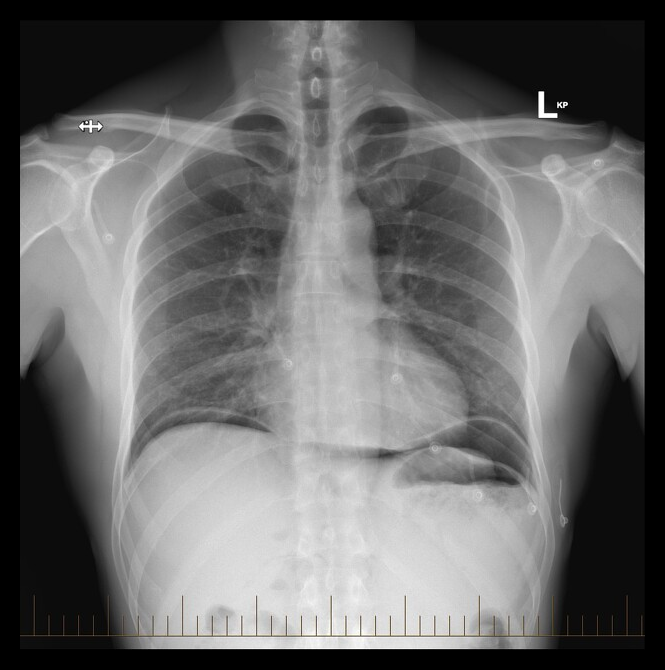
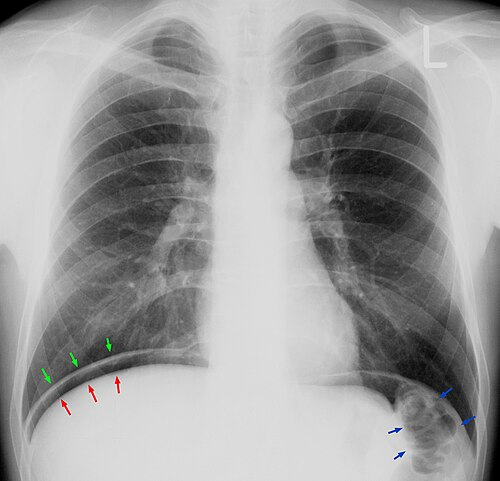

# ABDOME AGUDO PERFURATIVO

O abdome agudo perfurativo é, talvez, a emergência mais dramática que você encontrará no plantão de cirurgia. Não estamos falando de uma dor que "vem e vai" ou de um desconforto vago. Estamos falando de um evento súbito, uma ruptura na integridade do trato gastrointestinal que lança conteúdo gástrico, biliar ou fecal diretamente na cavidade peritoneal.

Para entender o abdome agudo perfurativo, você precisa visualizar o peritônio como uma membrana extremamente reativa. Quando algo que deveria estar dentro do tubo digestivo cai ali, a resposta é imediata. Primeiro, temos uma peritonite química (especialmente nas perfurações gastroduodenais); depois, inevitavelmente, evoluímos para uma peritonite bacteriana e choque séptico.

## Fisiopatologia: O Porquê da Gravidade

Por que o paciente com perfuração choca tão rápido? A resposta está na Resposta Metabólica ao Trauma (REMT) e na translocação bacteriana. Quando ocorre a perfuração, o organismo tenta "bloquear" a área com o omento (o "policial do abdome") e alças intestinais adjacentes. Se esse bloqueio falha, o conteúdo se espalha.

Nas perfurações de estômago e duodeno, o pH ácido causa uma queimadura química imediata. O paciente apresenta aquela dor "em facada" que o deixa imóvel. Já nas perfurações de cólon (como na diverticulite ou perfuração cecal), o problema principal não é a acidez, mas a carga bacteriana massiva. É a peritonite fecalóide, que leva ao choque séptico em poucas horas.

Um conceito que as bancas amam é a **Lei de Laplace**. Imagine uma obstrução intestinal distal (um câncer de reto, por exemplo) com uma válvula ileocecal competente. O ceco é a parte do cólon com maior diâmetro. Segundo Laplace, a tensão na parede é diretamente proporcional ao raio (T = P × r). Por isso, em uma obstrução de alça fechada, o ceco é o primeiro a sofrer isquemia e perfurar, mesmo que o tumor esteja lá embaixo no reto. Isso é a **perfuração cecal por distensão**.

## Etiologias Principais e Fatores de Risco

Você precisa saber identificar o perfil do paciente para acertar a questão. Não é apenas "abdome agudo", é "quem é esse paciente?".

### Úlcera Péptica Perfurada

Historicamente a causa mais comum. O perfil clássico é o paciente que usa AINEs (Anti-inflamatórios Não Esteroidais) cronicamente ou corticoides.

- **Atenção:** Pacientes com Lúpus Eritematoso Sistêmico em uso de corticoide podem perfurar sem apresentar os sinais clássicos de irritação peritoneal, pois o corticoide mascara a inflamação.

- A dor é súbita, epigástrica, e rapidamente se torna difusa.

### Doença Diverticular Complicada

Aqui falamos de cólon sigmoide. O paciente geralmente tem história de constipação e dor crônica no quadrante inferior esquerdo. Quando perfura para a cavidade livre (Hinchey III ou IV), o quadro é de peritonite franca.

### Perfuração Esofágica

Menos comum, mas letal. Pode ser iatrogênica (após endoscopia), por vômitos vigorosos (Síndrome de Boerhaave) ou por corpos estranhos.

- **Dica de Ouro:** Se a questão mencionar **Divertículo de Zenker** (que fica no triângulo de Killian, entre os músculos tireofaríngeo e cricofaríngeo), lembre-se que a perfuração pode ocorrer durante a passagem de uma sonda ou endoscópio. O achado radiológico clássico aqui é o **enfisema mediastinal** (pneumomediastino).

## Apendicite Aguda Perfurada

É a evolução natural da apendicite não tratada. Ocorre geralmente após 48-72 horas de evolução. A dor, que era localizada na fossa ilíaca direita, torna-se difusa com a perfuração e generalização da peritonite.

## Quadro Clínico e Exame Físico: A Arte de Tocar o Paciente

O diagnóstico de abdome agudo perfurativo é, primariamente, clínico. O paciente chega com **dor abdominal súbita e intensa**. Ele não quer se mexer. Diferente da cólica renal, onde o paciente rola na maca, o paciente com peritonite fica estático, pois qualquer movimento do diafragma ou da parede abdominal dói.

### Sinais Patognomônicos e Epônimos (O que cai na prova)

- **Abdome em Tábua:** É a rigidez involuntária da musculatura abdominal. O abdome fica duro, tenso, impossível de deprimir.

- **Sinal de Jobert:** É o desaparecimento da macicez hepática à percussão, sendo substituída por timpanismo.

Isso acontece porque o ar livre na cavidade (pneumoperitônio) se posiciona entre o fígado e a parede toracoabdominal.
 * *Cuidado:* Não confunda com a Síndrome de Chilaiditi, que é a interposição do cólon entre o fígado e o diafragma, causando um "falso Jobert".
3. **Sinal de Blumberg:** Dor à descompressão brusca. Se for difuso, indica peritonite generalizada.

No MedEvo, sempre reforçamos: se o paciente tem dor súbita + abdome em tábua + sinal de Jobert, você já tem o diagnóstico clínico de abdome agudo perfurativo. O próximo passo é confirmar com imagem e preparar a cirurgia.

## Propedêutica Radiológica: Enxergando o Ar

O exame inicial de escolha é a **Rotina de Abdome Agudo**, que consiste em:

- Radiografia de tórax em ortostase (em pé).

- Radiografia de abdome em ortostase.

- Radiografia de abdome em decúbito dorsal.

**Por que o RX de tórax é melhor que o de abdome para ver pneumoperitônio?**
Porque o diafragma é a parte mais alta da cavidade abdominal quando o paciente está em pé. Pequenas quantidades de ar (tão pouco quanto 1-2 ml) podem ser visualizadas como uma lâmina crescente abaixo da cúpula diafragmática. Isso é o **Sinal de Popper**.

### Sinais Radiológicos Específicos

- **Sinal de Rigler (ou Sinal da Dupla Parede):** Em um RX de abdome em decúbito, normalmente só vemos a mucosa do intestino (por causa do gás interno). Se houver gás *fora* da alça também, a parede intestinal fica delineada dos dois lados. Isso indica pneumoperitônio maciço.

- **Sinal do Ligamento Falciforme:** O ar livre na cavidade delineia o ligamento falciforme do fígado.

- **Sinal do Pingo de Vela:** Este é um achado de imagem (ou cirúrgico) relacionado à esteatonecrose na pancreatite aguda, mas às vezes aparece em diagnósticos diferenciais de abdome agudo.

**E se o paciente não puder ficar em pé?**
Fazemos o **RX de abdome em decúbito lateral esquerdo com raios horizontais**. O ar vai subir e se posicionar entre o fígado e a parede lateral direita do abdome. Por que o lado esquerdo para baixo? Para que o ar não se confunda com a bolha gástrica no lado esquerdo.

## Diagnóstico Diferencial: Nem tudo que brilha é ouro

Muitas vezes, o pneumoperitônio pode ter causas não cirúrgicas. As bancas adoram cobrar isso para ver se você vai operar alguém sem necessidade.

| Causa Cirúrgica | Causa Não Cirúrgica (Pneumoperitônio "Falso") |
| --- | --- |
| Úlcera Péptica Perfurada | Barotrauma (ventilação mecânica) |
| Diverticulite Aguda Complicada | Pneumatose Cística Intestinal |
| Perfuração por Isquemia Mesentérica | Pós-operatório imediato (até 7-10 dias) |
| Perfuração Traumática | Relação sexual (raro, por entrada de ar vaginal) |
| Apendicite Perfurada | Doença Pulmonar Obstrutiva Crônica (DPOC) |

**Atenção ao Infarto Entero-Mesentérico:** O idoso com dor abdominal desproporcional ao exame físico (dói muito, mas o abdome ainda está flácido no início) e sinais de choque deve acender o alerta para isquemia intestinal. Se houver pneumoperitônio tardio, a alça já necrosou e perfurou.

## Manejo Terapêutico: O Tempo é Tecido

O tratamento do abdome agudo perfurativo é uma **emergência cirúrgica**. Não se perde tempo "estudando" o paciente por dias.

### Estabilização Inicial

- **Jejum absoluto e Sonda Nasogástrica (SNG):** Para descompressão gástrica e evitar broncoaspiração.

- **Hidratação Vigorosa:** O paciente perde muito líquido para o "terceiro espaço" (peritônio inflamado).

- **Antibioticoterapia Empírica:** Deve ser iniciada IMEDIATAMENTE. O foco é cobrir Gram-negativos e anaeróbios (flora intestinal). Ex: Ceftriaxona + Metronidazol ou Piperacilina/Tazobactam.

- **Analgesia e Monitorização:** Lactato sérico é um excelente marcador de perfusão tecidual e gravidade na sepse abdominal.

### Condutas Cirúrgicas Específicas

#### 1. Úlcera Péptica Perfurada

A conduta depende do tamanho da perfuração e do tempo de evolução.

- **Rafia Simples + Patch de Omento (Manobra de Graham):** É o padrão-ouro. Você sutura a perfuração e coloca um pedaço de omento por cima para garantir a vedação.

- **Vagotomia e Piloroplastia:** Considerada em casos selecionados de úlcera duodenal recorrente em pacientes estáveis, mas a tendência moderna é ser menos agressivo na urgência e tratar o *H. pylori* e usar IBP (Inibidores de Bomba de Prótons) depois.

- **Gastrectomia:** Reservada para suspeita de malignidade gástrica (úlcera gástrica suspeita) ou perfurações gigantes que não permitem rafia.

#### 2. Diverticulite Perfurada (Hinchey III e IV)

Se houver peritonite purulenta ou fecalóide generalizada, a cirurgia de escolha é a **Cirurgia de Hartmann**.

- **O que é?** Retossigmoidectomia (retira a parte doente) + Colostomia terminal (o cólon proximal sai pela pele) + Fechamento do coto retal (o reto fica "sepultado" lá dentro).

- **Por que não anastomosar (emendar) na hora?** Porque em um ambiente de peritonite fecal e instabilidade, o risco da emenda abrir (deiscência) é altíssimo. É melhor salvar a vida do paciente agora e reconstruir o trânsito em 3 a 6 meses.

#### 3. Perfuração Cecal

Se o ceco perfurou por causa de uma obstrução distal (ex: tumor de reto), não adianta só fechar o buraquinho. Você tem que tratar a causa.

- **Colectomia Direita + Ileostomia à Mikulicz** ou apenas a colectomia com estomia dependendo das condições do paciente.

## Situações Especiais e Complicações

### O Paciente Imunodeprimido ou Dialítico

Estes pacientes (incluindo transplantados e portadores de HIV) podem ter perfurações intestinais por patógenos atípicos (como CMV) ou por isquemia. A clínica é muito frustra. Às vezes, a única dica é uma febre persistente ou uma leve distensão abdominal. O limiar para solicitar uma Tomografia Computadorizada (TC) deve ser baixo.

### Síndrome Compartimental Abdominal (SCA)

Em casos de grande inflamação e reposição volêmica maciça, a pressão intra-abdominal (PIA) pode subir acima de 20 mmHg com disfunção de órgãos. Isso é uma emergência. O tratamento é a **laparotomia descompressiva** e deixar o abdome em peritoneostomia (abdome aberto).

### Complicações Pós-Operatórias

- **Abscesso Subfrênico:** Comum após perfurações de abdome superior. O paciente evolui com febre em "picos" no 5º-7º dia pós-op. O espaço de Morrison (hepatorrenal) é um local frequente de acúmulo de secreção.

- **Fístulas Digestivas:** Quando a sutura não cicatriza bem.

- **Íleo Paralítico:** Ausência de movimentos intestinais no pós-operatório. Se não houver sinais de peritonite, o manejo é conservador (jejum, hidratação, procinéticos).

## Tabelas Comparativas para Revisão Rápida

### Tabela 1: Diagnóstico Diferencial de Dor Abdominal Súbita

| Patologia | Características Clínicas | Achado de Imagem |
| --- | --- | --- |
| **Úlcera Perfurada** | Dor súbita "em facada", abdome em tábua | Pneumoperitônio (90% dos casos) |
| **Pancreatite Aguda** | Dor em barra, vômitos, história de cálculos | Edema pancreático na TC, Amilase/Lipase > 3x |
| **Aneurisma de Aorta** | Dor lombar/abdominal, massa pulsátil, choque | Dilatação da aorta na TC/USG |
| **Isquemia Mesentérica** | Dor desproporcional, fatores de risco (FA) | Pneumatose intestinal (tardio) |

### Tabela 2: Classificação de Hinchey (Diverticulite) e Conduta

| Estágio | Descrição | Conduta Sugerida |
| --- | --- | --- |
| **I** | Abscesso pericólico pequeno | ATB + Dieta |
| **II** | Abscesso pélvico ou à distância | Drenagem percutânea + ATB |
| **III** | Peritonite purulenta generalizada | Cirurgia (Hartmann ou Lavagem Laparoscópica) |
| **IV** | Peritonite fecalóide generalizada | Cirurgia de Hartmann (Obrigatório) |

### Tabela 3: Antibioticoterapia Comum no Abdome Agudo Perfurativo

| Esquema | Cobertura | Uso Comum |
| --- | --- | --- |
| **Ceftriaxona + Metronidazol** | Gram-negativos e Anaeróbios | Comunidade (Apendicite, Úlcera) |
| **Ciprofloxacino + Metronidazol** | Gram-negativos e Anaeróbios | Alérgicos a Penicilina |
| **Piperacilina + Tazobactam** | Amplo espectro (inclui Pseudomonas) | Infecção Hospitalar ou Sepse Grave |
| **Ertapenem** | Amplo espectro | Casos de ESBL (comunidade) |

## Preenchimento da Declaração de Óbito (DO)

Este é um tema que cai muito em provas de Preventiva/Cirurgia. Se o paciente morre por abdome agudo perfurativo:

- **Parte I (Cadeia Causal):**

- (a) Causa imediata: Choque Séptico

- (b) Causa intermediária: Peritonite Fecalóide

- (c) Causa básica: Diverticulite Aguda Perfurada

- **Parte II:** Comorbidades que contribuíram, mas não entraram na sequência direta. Ex: Diabetes Mellitus, Hipertensão Arterial.

## Pontos-Chave para Prova

- **Sinal de Jobert:** Timpanismo onde deveria ser macicez (fígado). Indica pneumoperitônio.

- **Sinal de Rigler:** Visualização de ambos os lados da parede intestinal no RX. Indica pneumoperitônio.

- **Pneumoperitônio no Pós-operatório:** É normal até o 7º-10º dia. Se houver piora clínica após isso, suspeite de deiscência de anastomose.

- **Úlcera Péptica:** A causa mais comum de perfuração em abdome superior. O uso de AINEs é o principal fator de risco.

- **Tratamento da Úlcera Perfurada:** Rafia + Patch de Graham (omentopexy).

- **Cirurgia de Hartmann:** Retossigmoidectomia + Colostomia terminal + Sepultamento do reto. Indicada em peritonite difusa por diverticulite.

- **Lei de Laplace:** Explica por que o ceco perfura em obstruções distais (maior raio = maior tensão).

- **Perfuração Esofágica:** Causa pneumomediastino e enfisema subcutâneo cervical.

- **Contraindicação Absoluta:** NUNCA peça Endoscopia Digestiva Alta (EDA) se houver suspeita de úlcera perfurada (o ar insuflado vai piorar o pneumoperitônio e o extravasamento).

- **Lactato Sérico:** Principal marcador de gravidade e resposta ao tratamento na sepse abdominal.

- **Sinal de Popper:** Ar subdiafragmático no RX de tórax.

- **Antibiótico:** Deve cobrir Gram-negativos (E. coli, Klebsiella) e anaeróbios (B. fragilis).

- **Idosos e Corticoides:** Podem não ter febre ou abdome em tábua mesmo com perfuração franca.

- **Pneumoperitônio sem Peritonite:** Pense em causas não cirúrgicas (barotrauma, pneumatose).

- **Sinal do Pingo de Vela:** Áreas de esteatonecrose na pancreatite (não é perfurativo, mas cai como diferencial).

- **Conduta no Trauma:** Se houver pneumoperitônio após trauma penetrante ou contuso, a indicação é Laparotomia Exploradora imediata.

Como Dr. Will sempre diz nas aulas do MedEvo: "No abdome agudo perfurativo, o bisturi é o melhor antibiótico". Não adianta apenas medicar se a fonte da contaminação não for bloqueada. O sucesso do tratamento depende da tríade: Estabilização Hemodinâmica + Antibiótico Precoce + Controle Cirúrgico do Foco.

 Cópia offline para consulta pessoal.
 Fonte original:
 [https://www.medevo.com.br/material-apoio/ler/9075dd01-b513-4fe7-b714-723308d5cb27](https://www.medevo.com.br/material-apoio/ler/9075dd01-b513-4fe7-b714-723308d5cb27)
