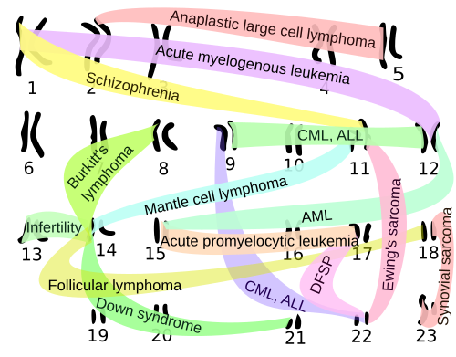
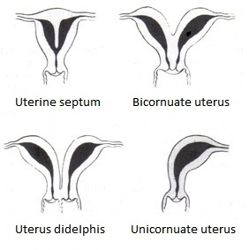
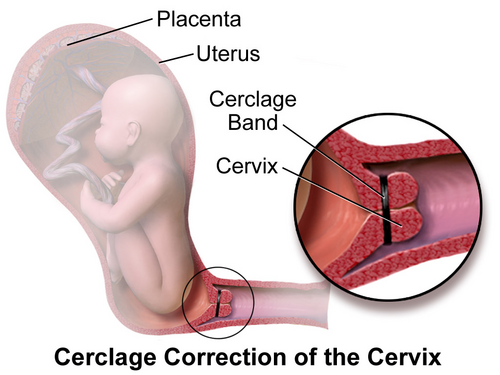

# ABORTAMENTO DE REPETIÇÃO

O abortamento de repetição, também chamado de abortamento habitual ou recorrente, é um dos temas mais desafiadores da obstetrícia e, consequentemente, um dos favoritos das bancas de residência. Aqui, o examinador não quer apenas que você saiba diagnosticar um aborto, ele quer que você saiba investigar o casal e propor uma conduta que evite a próxima perda.

Como professor, vejo muitos alunos se perderem tentando decorar listas infinitas de causas. O segredo para dominar este tema é entender que estamos lidando com uma falha reprodutiva crônica. Vamos organizar o raciocínio para que você nunca mais esqueça o que pedir e o que fazer.

## Definição e Critérios Diagnósticos

A definição clássica, adotada pela Organização Mundial da Saúde (OMS) e tradicionalmente cobrada em provas, é a ocorrência de 3 ou mais perdas gestacionais consecutivas antes de 22 semanas de gestação ou com peso fetal inferior a 500 gramas.

No entanto, preste atenção em uma mudança importante nas diretrizes recentes, como as da FEBRASGO (2023). Atualmente, já se recomenda iniciar a investigação após 2 perdas gestacionais consecutivas. Por que isso mudou? Porque o risco de uma terceira perda após duas interrupções já é significativamente alto (cerca de 30%), justificando a busca por causas tratáveis.

**Dica de Prova:** Se a questão perguntar a definição clássica, marque 3 perdas. Se perguntar sobre a conduta atual em um cenário clínico de uma paciente com 2 perdas e muita ansiedade, a investigação já pode ser iniciada.

## Etiologia e Fisiopatologia: O "Porquê" das Perdas

Para entender o abortamento de repetição, precisamos dividir as causas em grandes grupos. Lembre-se: em cerca de 50% dos casos, mesmo após uma investigação exaustiva, a causa permanecerá idiopática (desconhecida).

### Causas Genéticas

Esta é a causa mais comum de abortos esporádicos (primeira gestação que se perde), mas no abortamento de repetição, o foco muda.

No primeiro trimestre, a principal causa de aborto é a trissomia autossômica (sendo a trissomia do 16 a mais frequente em termos globais). Contudo, a anomalia cromossômica isolada mais comum encontrada em materiais de aborto é a Monossomia do X (Síndrome de Turner, 45,X).

No casal com perdas recorrentes, o problema muitas vezes não é um erro aleatório na divisão celular do embrião, mas sim uma alteração estrutural nos pais. Em 3 a 5% dos casais com aborto habitual, um dos genitores é portador de uma translocação balanceada. Eles são saudáveis, mas seus gametas podem gerar embriões com desequilíbrios cromossômicos fatais.

*Figura 1 - Visão geral das translocações cromossômicas: casais portadores de translocações balanceadas são fenotipicamente normais, mas podem gerar embriões com desequilíbrios letais. Fonte: Mikael Häggström, Domínio Público | Wikimedia Commons*

### Causas Anatômicas

Aqui o problema é o "recipiente". Malformações uterinas (müllerianas) dificultam a implantação ou o crescimento do feto.

O útero septado é a malformação mais associada ao abortamento de repetição e ao pior prognóstico obstétrico. Isso ocorre porque o septo é um tecido fibroso, mal vascularizado. Se o embrião se implanta ali, ele não recebe nutrientes adequados e a gestação falha.

*Figura 2 - Classificação das malformações uterinas müllerianas: observe o útero septado (septate), que é a malformação mais associada ao abortamento de repetição. Fonte: EternamenteAprendiz, CC BY-SA 4.0 | Wikimedia Commons*

Outra causa anatômica crítica é a Insuficiência Istmocervical (IIC). Diferente do útero septado, que causa perdas precoces, a IIC é a principal causa de perdas tardias (segundo trimestre). O colo do útero é "fraco" e dilata sem dor conforme o peso do útero aumenta.

### Causas Imunológicas: Síndrome Antifosfolípide (SAF)

A SAF é a "queridinha" das provas de residência. É uma trombofilia adquirida onde o corpo produz anticorpos que atacam a placenta e promovem tromboses nos vasos deciduais.

Para o Dr. Will e toda a equipe do MedEvo, este é o ponto onde o aluno não pode errar: o diagnóstico de SAF exige um critério clínico E um critério laboratorial. Não adianta ter apenas o exame positivo se não houver história clínica, e vice-versa.

### Causas Endócrinas e Estilo de Vida

Distúrbios metabólicos não controlados criam um ambiente hostil para a gestação. Hipotireoidismo (mesmo o subclínico com TSH elevado), Diabetes Mellitus descompensado e Síndrome dos Ovários Policísticos (SOP) estão no radar. O controle rigoroso com levotiroxina antes e durante a gestação é fundamental para prevenir novas perdas.

Fatores como obesidade (IMC > 30), tabagismo (mais de 10 cigarros/dia) e consumo excessivo de cafeína também elevam o risco.

## Quadro Clínico e Diagnóstico Diferencial

O quadro clínico varia drasticamente conforme a etiologia. Saber diferenciar o "jeito" que a paciente perde a gestação é o que vai te dar o diagnóstico na prova.

- **Aneuploidias (Genética):** Geralmente perdas muito precoces (antes de 10 semanas), muitas vezes como aborto retido (o embrião para de crescer, mas não há sangramento imediato).

- **Insuficiência Istmocervical (Anatômica):** Perda tardia (16 a 24 semanas), caracterizada por dilatação cervical indolor, expulsão rápida de concepto vivo e sem malformações. A paciente costuma dizer: "Doutor, eu não senti nada, só senti um peso e o bebê nasceu".

- **SAF (Imunológica):** Pode causar desde múltiplos abortos precoces até óbitos fetais tardios, pré-eclâmpsia grave precoce ou insuficiência placentária.

### Tabela 1: Diagnóstico Diferencial das Perdas Recorrentes

| Causa | Época da Perda | Características Clínicas |
| --- | --- | --- |
| **Genética (Casal)** | 1º Trimestre | Abortos retidos ou incompletos precoces. |
| **Útero Septado** | 1º ou 2º Trimestre | Falha de implantação ou perda precoce. |
| **IIC** | 2º Trimestre | Dilatação indolor, feto vivo, parto rápido. |
| **SAF** | Qualquer época | Tromboses, perdas recorrentes, PE grave. |
| **Hipotireoidismo** | 1º Trimestre | Perdas precoces, muitas vezes associadas a infertilidade. |

## Investigação Diagnóstica: O que solicitar?

Não peça tudo para todos. A investigação deve ser direcionada, mas para a prova, você precisa saber o "pacote básico" de investigação do aborto habitual:

- **Cariótipo de banda G do casal:** Para buscar translocações balanceadas.

- **Avaliação Anatômica:** Ultrassonografia transvaginal (preferencialmente 3D) ou Histeroscopia. A Histerossalpingografia (HSG) avalia bem a cavidade, mas não diferencia útero septado de bicorno (o que é vital para a conduta).

- **Pesquisa de SAF:** Solicitar Anticoagulante Lúpico, Anticorpos Anticardiolipina (IgG e IgM) e Anti-beta2-glicoproteína I (IgG e IgM).

- **Avaliação Endócrina:** TSH, T4 livre, Glicemia de jejum (ou HbA1c) e Prolactina.

**Cuidado:** As bancas adoram colocar "Pesquisa de Trombofilias Hereditárias" (Fator V de Leiden, etc.) como rotina para aborto de 1º trimestre. Segundo a FEBRASGO (2023), isso NÃO é recomendado rotineiramente para perdas precoces, pois não há evidência de que o tratamento mude o desfecho. Guarde a investigação de trombofilias hereditárias para perdas tardias ou histórico de trombose venosa.

## Síndrome Antifosfolípide (SAF) em Detalhes

Como este tema cai muito, vamos fixar os critérios de Sydney para o diagnóstico.

### Tabela 2: Critérios de Sydney para SAF

| Categoria | Critérios (Exige 1 Clínico + 1 Laboratorial) |
| --- | --- |
| **Clínico (Vascular)** | 1 ou mais episódios de trombose arterial ou venosa confirmada. |
| **Clínico (Obstétrico)** | **A)** 3 ou mais abortos < 10 sem (excluídas causas anatômicas/genéticas). **B)** 1 ou mais mortes fetais > 10 sem (feto morfologicamente normal). **C)** 1 ou mais partos prematuros < 34 sem por PE grave ou insuficiência placentária. |
| **Laboratorial** | **A)** Anticoagulante Lúpico positivo. **B)** Anticardiolipina IgG/IgM (> 40 GPL/MPL ou percentil > 99). **C)** Anti-beta2-glicoproteína I IgG/IgM (percentil > 99). |

**Regra de Ouro:** O critério laboratorial deve ser positivo em duas ocasiões com pelo menos 12 semanas de intervalo. Um exame positivo isolado não diagnostica SAF, pois pode ser um falso-positivo transitório por infecção.

## Tratamento e Manejo

O tratamento é estritamente dependente da causa identificada.

### Manejo da SAF

O tratamento padrão para gestantes com SAF obstétrica é a combinação de Ácido Acetilsalicílico (AAS) em baixa dose (81 a 100 mg/dia) e Heparina de Baixo Peso Molecular (Enoxaparina) em dose profilática (ex: 40 mg/dia).

- Se a paciente já teve trombose prévia (SAF trombótica), a dose da heparina deve ser terapêutica (ajustada pelo peso).

- O AAS deve ser iniciado preferencialmente antes da concepção ou assim que a gravidez for confirmada.

### Manejo da Insuficiência Istmocervical (IIC)

O tratamento é a cerclagem uterina, que consiste em uma sutura "em bolsa" ao redor do colo para mantê-lo fechado. A técnica mais comum é a de McDonald.

*Figura 3 - Cerclagem cervical: sutura em bolsa ao redor do colo uterino para mantê-lo fechado, prevenindo a dilatação prematura na insuficiência istmocervical. Fonte: BruceBlaus, CC BY-SA 4.0 | Wikimedia Commons*

Existem três cenários para a cerclagem:

- **Profilática (por história):** Indicada para pacientes com história clássica de 2 ou mais perdas tardias. Realizada entre 12 e 14 semanas de gestação, após o USG morfológico de 1º trimestre confirmar a vitalidade e ausência de malformações.

- **Terapêutica (por USG):** Indicada para pacientes com história de 1 perda tardia ou parto prematuro prévio que, na gestação atual, apresentam colo curto (< 25 mm) na ultrassonografia realizada entre 16 e 24 semanas.

- **De Emergência (ou de resgate):** Realizada quando a paciente já apresenta dilatação cervical e membranas visíveis ao exame especular, na ausência de trabalho de parto ou infecção.

### Manejo Anatômico e Endócrino

- **Útero Septado:** O tratamento é a ressecção do septo por via histeroscópica. Isso melhora significativamente as taxas de nascidos vivos.

- **Hipotireoidismo:** Ajustar a dose de levotiroxina para manter o TSH preferencialmente abaixo de 2,5 mUI/L no primeiro trimestre.

## Situações Especiais e Pegadinhas

**Intervalo Intergestacional:** Muitos acreditam que esperar muito tempo após um aborto protege a próxima gestação. Errado. Estudos mostram que um intervalo curto (< 6 meses) não aumenta o risco de novo aborto e pode até ter melhores desfechos em alguns cenários.

**Progesterona:** A progesterona vaginal é amplamente utilizada. Ela tem benefício comprovado em pacientes com colo curto (< 25 mm) para prevenir parto prematuro, mas seu papel no abortamento de repetição de primeiro trimestre é restrito a casos específicos onde há sangramento na gestação atual e histórico de perdas. Não é a "cura" para IIC.

**Endometriose:** Cuidado! A endometriose é causa de infertilidade e dor pélvica, mas não é considerada uma causa primária de abortamento de repetição nas diretrizes principais.

## Pontos-Chave para Prova

- **Definição Clássica:** 3 ou mais perdas consecutivas < 22 semanas. Investigação atual inicia com 2 perdas.

- **Causa Genética mais comum (Aborto Esporádico):** Trissomias autossômicas (Trissomia do 16 é a mais comum).

- **Anomalia Cromossômica isolada mais comum:** Monossomia do X (45,X - Síndrome de Turner).

- **Causa Genética no Casal:** Translocação balanceada (3-5% dos casais com perdas recorrentes).

- **Malformação Uterina de pior prognóstico:** Útero septado (tratamento: histeroscopia).

- **Quadro Clínico da IIC:** Dilatação cervical indolor, perdas no 2º trimestre, expulsão rápida de feto vivo.

- **Cerclagem Profilática:** Realizada entre 12-14 semanas em pacientes com história típica.

- **Diagnóstico de SAF:** 1 critério clínico + 1 laboratorial (confirmado após 12 semanas).

- **Tratamento SAF na Gestação:** AAS + Heparina (Enoxaparina).

- **Hipotireoidismo:** Deve ser tratado rigorosamente; TSH alvo < 2,5 no início da gestação.

- **O que NÃO investigar de rotina no 1º tri:** Trombofilias hereditárias (Fator V de Leiden, Mutação da Protrombina).

- **Pegadinha:** Miomectomia com abertura da cavidade aumenta o risco de rotura uterina, não é causa clássica de aborto de repetição (embora miomas submucosos sejam).

- **Erro Comum:** Achar que progesterona substitui a cerclagem na IIC clássica. Na IIC verdadeira, a falha é mecânica e exige sutura.

- **Fator de Risco:** Idade materna avançada é o fator de risco isolado mais importante para perdas por aneuploidias.

- **Prognóstico:** Mesmo sem causa identificada (idiopático), a chance de uma gestação de sucesso na próxima tentativa é de cerca de 60-70% com suporte emocional e pré-natal adequado.

 Cópia offline para consulta pessoal.
 Fonte original:
 [https://www.medevo.com.br/material-apoio/ler/af702cf8-62f2-4281-994f-9b0215f8c270](https://www.medevo.com.br/material-apoio/ler/af702cf8-62f2-4281-994f-9b0215f8c270)
