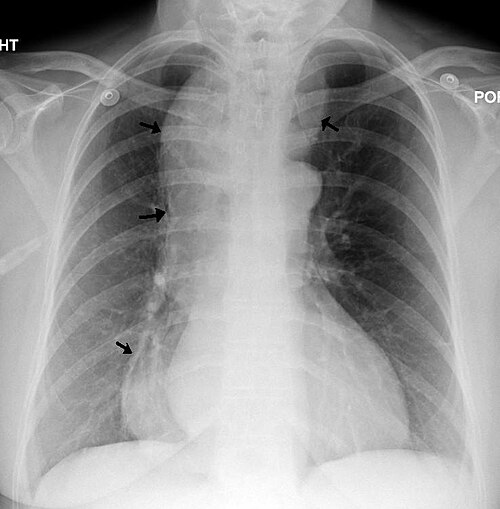
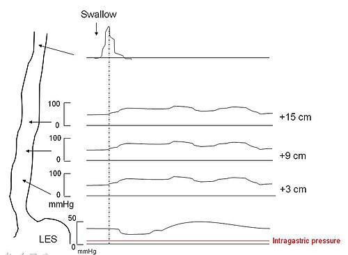
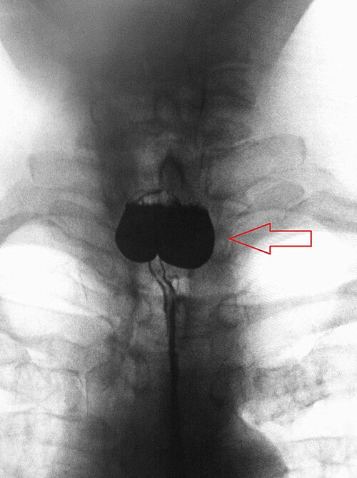

# ACALASIA

Olá, futuro residente! Se você está aqui, é porque sabe que **Acalasia** não é apenas "um esôfago que não abre". Para as bancas de residência médica, este é um dos temas mais ricos em detalhes fisiopatológicos, classificações radiológicas e, principalmente, decisões cirúrgicas.

Neste material, não vamos apenas listar fatos. Vamos entender a lógica por trás de cada conduta. Por que operamos o Grau II e não apenas dilatamos? Por que a manometria mudou a forma como enxergamos a doença? Ao final desta leitura, você estará pronto para gabaritar qualquer questão, desde a anatomia básica até as técnicas cirúrgicas avançadas como o POEM e a Esofagectomia.

## 1. O Coração do Problema: Fisiopatologia e Etiologia

Para entender a acalasia, você precisa visualizar o plexo mioentérico de Auerbach. Na acalasia, ocorre uma **degeneração progressiva dos neurônios inibitórios** (aqueles que liberam óxido nítrico e VIP). Sem a inibição, o Esfíncter Esofágico Inferior (EEI) permanece em estado de contração tônica e não relaxa frente ao estímulo da deglutição.

Além disso, o corpo do esôfago perde sua coordenação motora, resultando em **aperistalse**.

### Acalasia Idiopática vs. Megaesôfago Chagásico

No Brasil, você não pode falar de acalasia sem falar de **Doença de Chagas**. Embora a apresentação clínica seja idêntica, a causa é diferente:

- **Acalasia Idiopática:** Destruição neuronal de causa desconhecida (provavelmente autoimune/viral).

- **Megaesôfago Chagásico:** Destruição direta do plexo pelo *Trypanosoma cruzi*.

**Dica de Prova:** As bancas adoram perguntar sobre a "acalasia secundária". Lembre-se que o Chagas destrói não só o plexo de Auerbach (motor), mas também o de Meissner (sensitivo/secretor). Além disso, o paciente chagásico pode ter outras "megas" (megacólon) e cardiopatia.

## 2. Quadro Clínico: O Caminho da Disfagia

O sintoma cardeal é a **disfagia progressiva**. Mas cuidado: na acalasia, a disfagia costuma ser tanto para sólidos quanto para líquidos desde o início, ou evolui rapidamente para ambos. Isso a diferencia do câncer de esôfago, onde a disfagia é tipicamente mecânica (sólidos primeiro, líquidos muito depois).

### Sinais e Sintomas Típicos:

- **Regurgitação:** Alimentos não digeridos, muitas vezes noturna (risco altíssimo de pneumonia aspirativa).

- **Perda de Peso:** Devido à restrição alimentar crônica.

- **Dor Retroesternal:** Mais comum nas fases iniciais ou na acalasia espástica (Tipo III).

- **Halitose:** Pelo apodrecimento dos restos alimentares retidos no esôfago dilatado.

**Exemplo Clínico:** Paciente de 55 anos, natural de Minas Gerais, queixa-se de que "a comida entala no peito" há 2 anos. Relata que precisa beber muita água para a comida descer e que acorda com o travesseiro sujo de comida. **Suspeita imediata: Megaesôfago (provavelmente chagásico).**

## 3. O Arsenal Diagnóstico

Aqui é onde a maioria dos alunos se confunde. Vamos estabelecer a hierarquia:

### A. Endoscopia Digestiva Alta (EDA)

**Por que fazer primeiro?** Para excluir câncer (pseudoacalasia). A EDA na acalasia pode mostrar resíduos alimentares e um esôfago dilatado, mas o examinador sentirá uma "resistência elástica" na passagem pelo cárdia. Se a resistência for fixa e intransponível, suspeite de neoplasia.

### B. Esofagograma Baritado

É o exame que nos dá a anatomia e permite a **Classificação de Rezende-Mascarenhas** (essencial para a prova!). O sinal clássico é o **"Bico de Pássaro"** ou "Chama de Vela" (estreitamento distal com dilatação a montante).

*Figura 1 - Radiografia de tórax em paciente com acalasia: as setas indicam o contorno do esôfago massivamente dilatado, com retenção de alimentos e secreções. Fonte: James Heilman, MD, CC BY-SA 3.0 | Wikimedia Commons*

| Grau (Rezende) | Diâmetro do Esôfago | Achados Radiológicos |
| --- | --- | --- |
| **I** | < 4 cm | Trânsito lento, pequena retenção de contraste. |
| **II** | 4 - 7 cm | Dilatação moderada, retenção apreciável, ondas terciárias. |
| **III** | 7 - 10 cm | Grande dilatação, hipotonia, grande retenção. |
| **IV** | > 10 cm | Dolicomegaesôfago (esôfago em "S" ou "meia"), acinético. |

### C. Manometria Esofágica (Padrão-Ouro)

A manometria confirma o diagnóstico. Os critérios clássicos são:

- **Aperistalse** do corpo esofágico.

- **Falha no relaxamento do EEI** (Pressão Residual Elevada).

- Hipertonia do EEI (frequente, mas não obrigatória).

**Atenção à Classificação de Chicago 4.0:**
As provas modernas cobram os subtipos manométricos, pois eles definem o prognóstico:

- **Tipo I (Clássica):** Sem pressurização no corpo esofágico.

- **Tipo II (Pressurização Pan-esofágica):** É a que melhor responde ao tratamento (Heller ou Dilatação).

- **Tipo III (Espástica):** Contrações prematuras/espásticas. É a mais difícil de tratar, sendo o POEM a primeira escolha aqui.

*Figura 2 - Esquema manométrico da acalasia: demonstra contrações aperistálticas, aumento da pressão intraesofágica e falha no relaxamento do esfíncter esofágico inferior (EEI). Fonte: JC Petit, CC BY 3.0 | Wikimedia Commons*

## 4. Diagnóstico Diferencial: O Divertículo de Zenker

Muitas questões colocam um idoso com disfagia e regurgitação para você marcar acalasia, mas a resposta é **Divertículo de Zenker**. Como diferenciar?

O Zenker é um **pseudodivertículo de pulsão** que ocorre no **Triângulo de Killian** (área de fraqueza entre as fibras do músculo tireofaríngeo e cricofaríngeo).

- **Clínica do Zenker:** Disfagia orofaríngea (alta), halitose fétida e uma característica única: **regurgitação de alimentos ingeridos há dias** e melhora da queixa com compressão manual do pescoço.

- **Conduta no Zenker:** Esofagograma primeiro! Evite a EDA inicial pelo risco de perfuração do saco diverticular.

*Figura 3 - Radiografia em AP demonstrando Divertículo de Zenker: pseudodivertículo de pulsão no Triângulo de Killian, diagnóstico diferencial importante da acalasia. Fonte: James Heilman, MD, CC BY-SA 4.0 | Wikimedia Commons*

## 5. Tratamento: Do Clínico ao Radical

Como diz o **Dr. Will** em suas aulas no **MedEvo**, o tratamento da acalasia é paliativo no sentido funcional: nós não devolvemos o peristaltismo, nós apenas "quebramos" a barreira do esfíncter para a gravidade ajudar a comida a descer.

### A. Tratamento Clínico e Endoscópico

- **Nitratos e Bloqueadores de Cálcio (Nifedipino):** Reservados para pacientes sem condições cirúrgicas. Eficácia baixa e muitos efeitos colaterais (cefaleia, hipotensão).

- **Toxina Botulínica:** Injetada no EEI. Ótima para idosos muito graves, mas o efeito dura pouco (6 meses).

- **Dilatação Pneumática:** Balão que "rasga" as fibras do EEI. Boa resposta nos Graus I e II, mas tem risco de perfuração (3%).

### B. Tratamento Cirúrgico (O Padrão-Ouro)

Para a maioria dos pacientes (Graus II e III), a conduta de escolha é a **Miotomia de Heller associada a uma Fundoplicatura**.

**Por que associar a fundoplicatura?**
Se você faz a miotomia (corta o músculo do esfíncter), você acaba com a barreira contra o refluxo. Se não fizer uma válvula (fundoplicatura parcial, como Dor ou Toupet), o paciente troca a disfagia por uma esofagite grave.

**Técnica de Heller-Pinotti:** É a miotomia laparoscópica (estendendo-se 6cm no esôfago e 2cm no estômago) associada à fundoplicatura que cobre a área da miotomia.

### C. O que fazer no Megaesôfago Avançado (Grau IV)?

Aqui o esôfago virou um "saco" de bário, sem tônus e tortuoso. A miotomia não resolve porque a gravidade não consegue vencer a tortuosidade.

- **Esofagectomia:** É o tratamento definitivo. Geralmente transhiatal.

- **Cirurgia de Thal-Hatafuku:** Uma opção de "cardioplastia" para casos selecionados ou refratários, onde se faz uma abertura ampla da transição e usa-se o fundo gástrico para fechar a brecha.

- **Cirurgia de Serra-Dória:** Anastomose entre o esôfago e o estômago (esofagogastroanastomose) associada a uma gastrectomia parcial em Y-de-Roux.

**Pérola de Prova:** Se o paciente com megaesôfago Grau IV está desnutrido grave, a conduta inicial NÃO é a cirurgia, mas sim a **otimização nutricional** (Enteral por sonda ou Parenteral) por 7 a 14 dias.

## 6. Anatomia e Conceitos Correlatos (O que cai "em volta")

As bancas de cirurgia adoram cobrar anatomia do esôfago junto com acalasia. Memorize:

- **Irrigação do Esôfago Cervical:** Artéria tireoidiana inferior.

- **Drenagem Linfática:**

- Superior: Cadeias cervicais e jugulares.

- Médio: Linfonodos mediastinais.

- Inferior: Linfonodos celíacos e gástricos esquerdos.

- **Relações Anatômicas:** O esôfago corre atrás da traqueia e à frente da coluna. No abdome, o tronco celíaco fica logo abaixo do hiato diafragmático.

**Cuidado com o "Distrator" dos Rins:** Em provas de anatomia cirúrgica, costumam perguntar a posição renal. Lembre-se: o polo superior dos rins é mais **medial e posterior** devido à inclinação do músculo psoas maior.

## 7. Situações Especiais e Complicações

### Pseudoacalasia

É o câncer de cárdia mimetizando acalasia. Suspeite se: idade > 60 anos, perda de peso muito rápida (< 6 meses) e dificuldade extrema de passar o endoscópio.

### Acalasia e Câncer

O paciente com acalasia tem um risco 10 a 50 vezes maior de desenvolver **Carcinoma Espinocelular (CEC)** de esôfago devido à irritação crônica do alimento retido (esofagite de estase). O rastreio com EDA é recomendado, embora o intervalo seja controverso.

### POEM (Peroral Endoscopic Myotomy)

A "queridinha" das provas recentes. É uma miotomia feita inteiramente por endoscopia (cria-se um túnel na submucosa).

- **Vantagem:** Excelente para Acalasia Tipo III (espástica), pois permite miotomias longas no corpo esofágico.

- **Desvantagem:** Taxas de refluxo pós-operatório maiores que a cirurgia de Heller, pois não há como fazer fundoplicatura pelo endoscópio.

## Pontos-Chave para Prova 💡

- **Definição Manométrica:** Aperistalse + Falha no relaxamento do EEI (IRP > 15 mmHg na manometria de alta resolução).

- **Padrão-Ouro Diagnóstico:** Manometria esofágica.

- **Padrão-Ouro Cirúrgico:** Cardiomiotomia à Heller + Fundoplicatura parcial (Heller-Pinotti).

- **Classificação de Rezende:** Grau I (<4cm), II (4-7cm), III (7-10cm), IV (>10cm ou dolicomegaesôfago).

- **Conduta no Grau IV:** Esofagectomia (se houver condições clínicas) ou Serra-Dória/Thal-Hatafuku.

- **Divertículo de Zenker:** Ocorre no Triângulo de Killian. Tratamento é Miotomia do Cricofaríngeo + Diverticulectomia/Pexia.

- **Acalasia Tipo III (Chicago):** Melhor tratada com POEM.

- **Complicação Tardia:** Carcinoma Espinocelular (CEC) por esofagite de estase.

- **Anatomia:** Esôfago cervical é irrigado pela artéria tireoidiana inferior.

- **Contraindicações de TIPS (Pegadinha comum):** Insuficiência Cardíaca, Hipertensão Pulmonar Grave, Sepse.

- **Anatomia Renal:** Polo superior é medial e posterior (relação com o Psoas).

- **O que NÃO fazer:** Não fazer EDA como primeiro exame no Zenker; não operar Grau IV desnutrido sem antes nutrir.

- **Leiomioma:** Tumor benigno mais comum do esôfago; tratamento é enucleação (não confundir com acalasia!).

- **Anel de Schatzki:** Causa disfagia intermitente ("Sindrome do Steakhouse"), associado a DRGE e hérnia de hiato, não é distúrbio motor.

- **Miotomia de Heller:** Deve-se cortar as fibras circulares do esôfago (miotomia) e não apenas a mucosa.

- **Regurgitação Noturna:** Principal fator de risco para pneumonia aspirativa e abscesso pulmonar na acalasia.

 Cópia offline para consulta pessoal.
 Fonte original:
 [https://www.medevo.com.br/material-apoio/ler/71d1d4dc-c5ee-4a74-ae01-a34ff591d049](https://www.medevo.com.br/material-apoio/ler/71d1d4dc-c5ee-4a74-ae01-a34ff591d049)
