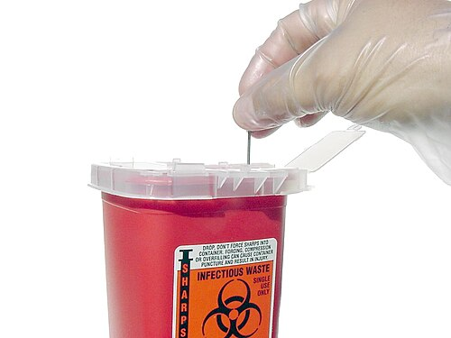

# ACIDENTES DE TRABALHO

Para entender acidentes de trabalho em provas de residência, você precisa vestir duas roupas diferentes: a do médico assistente, que cuida do paciente, e a do perito/gestor, que entende a burocracia legal. As bancas amam transitar entre esses dois mundos. O conceito fundamental não vem da medicina, mas da lei. Segundo a Lei 8.213/91, o acidente de trabalho é aquele que ocorre pelo exercício do trabalho a serviço da empresa, provocando lesão corporal ou perturbação funcional que cause a morte, a perda ou a redução, permanente ou temporária, da capacidade para o trabalho.

Note que a definição é ampla. Não é apenas o "tombo no chão da fábrica". Se o trabalhador sofre um infarto por estresse extremo ou desenvolve uma tendinite por esforço repetitivo, isso também pode ser enquadrado. O ponto central aqui é o nexo causal, ou seja, a prova de que o evento ou a doença tem relação direta com a atividade laboral.

## Classificação dos Acidentes de Trabalho

Dividimos os acidentes em três grandes grupos que você deve ter na ponta da língua, pois as condutas mudam conforme a categoria.

### Acidente Típico

É o evento súbito, imprevisto e traumático. É o operário que cai do andaime ou o cozinheiro que corta a mão. Ele ocorre no local e no horário de trabalho. Aqui, o nexo é óbvio e imediato.

### Acidente de Trajeto (Equiparado)

Este é um prato cheio para pegadinhas. O acidente de trajeto ocorre no percurso da residência para o trabalho ou vice-versa, independentemente do meio de transporte (carro próprio, ônibus ou a pé).

Cuidado: a legislação brasileira não estabelece um tempo máximo para esse trajeto. Se o trabalhador mora a duas horas da empresa e sofre um acidente no caminho, ainda é acidente de trajeto. No entanto, se ele desviar do caminho para ir ao shopping ou resolver problemas pessoais, o nexo é quebrado. A banca vai tentar te confundir dizendo que o trabalhador estava em seu carro particular, o que não anula o direito.

### Doenças Ocupacionais

Aqui o bicho pega. As doenças ocupacionais são divididas em duas:

- Doença Profissional (Ergonopatia): É aquela inerente à profissão. Se você é mineiro e tem silicose, a relação é presumida. A atividade específica gera a doença.

- Doença do Trabalho (Mesopatia): É aquela desencadeada pelas condições especiais em que o trabalho é realizado. Exemplo: um administrativo que trabalha em um ambiente extremamente ruidoso e desenvolve surdez. A surdez não é inerente ao ato de digitar, mas ao ambiente onde ele digita.

## A Comunicação de Acidente de Trabalho (CAT)

Se existe um tema que você não pode errar, é a CAT. Ela é o documento que formaliza o acidente perante a Previdência Social.

### Quem deve emitir e qual o prazo?

A responsabilidade primária é da empresa. O prazo legal é de até o primeiro dia útil seguinte ao da ocorrência. Se houver morte, a emissão deve ser imediata.

Mas e se a empresa se recusar? Aqui mora a pegadinha clássica. Se a empresa não emitir, o próprio trabalhador, seus dependentes, o sindicato da categoria, o médico assistente ou qualquer autoridade pública podem formalizá-la. O médico não deve apenas "esperar" a empresa; se ele constata o nexo, ele deve orientar e, se necessário, emitir.

### Por que emitir a CAT mesmo em acidentes leves?

Muitos alunos erram ao achar que a CAT só serve para quem vai se afastar. Errado. A CAT deve ser emitida para QUALQUER acidente de trabalho ou doença ocupacional, independentemente da gravidade ou da necessidade de afastamento. Ela serve para fins estatísticos, epidemiológicos e para garantir direitos futuros caso uma lesão leve se torne crônica. Como o Dr. Will sempre reforça em suas discussões, a CAT é um instrumento de vigilância, não apenas um papel para o INSS.

## Nexo Causal e Classificação de Schilling

Como provar que a doença é do trabalho? Usamos a Classificação de Schilling, que divide as patologias em três grupos baseados na relação com o labor:

- Schilling I: O trabalho é causa necessária. Sem o trabalho, a doença não existiria. Exemplo clássico: Silicose, Intoxicação por Chumbo.

- Schilling II: O trabalho é um fator contributivo, mas não o único. A doença poderia existir sem o trabalho, mas ele a antecipou ou agravou. Exemplos: Hipertensão Arterial, Doença Coronariana, Varizes de membros inferiores.

- Schilling III: O trabalho é um gatilho ou fator desencadeante de um distúrbio latente. Exemplo: Dermatite de contato, Asma ocupacional, alguns transtornos mentais.

Lembre-se: para a prova, se o trabalho contribuiu, há nexo. Não precisa ser a única causa.

## Direitos Previdenciários e Estabilidade

Quando o acidente acontece, o trabalhador entra em um regime de proteção especial.

### Os primeiros 15 dias

Nos primeiros 15 dias de afastamento, a responsabilidade pelo pagamento do salário é da empresa. O contrato de trabalho está interrompido.

### A partir do 16º dia

Se o afastamento ultrapassar 15 dias, o trabalhador deve ser encaminhado à perícia médica do INSS. Se o perito confirmar o nexo, o trabalhador passa a receber o Auxílio-Doença Acidentário (B91).

Diferença crucial:

- Auxílio-doença comum (B31): Não exige nexo com o trabalho. Não dá direito à estabilidade.

- Auxílio-doença acidentário (B91): Exige nexo. Dá direito a 12 meses de estabilidade no emprego após o retorno às atividades e obriga a empresa a continuar depositando o FGTS durante todo o período de afastamento.

Muitas questões de prova colocam o trabalhador sendo demitido logo após voltar de um afastamento por acidente. Isso é ilegal se ele recebeu o B91. A estabilidade é de um ano.

## Acidentes com Material Biológico

Este é o tema mais comum para o médico, pois acontece conosco. O protocolo de atendimento após um acidente perfurocortante é figurinha carimbada em exames.

### Conduta Imediata

Ocorreu o acidente? Primeiro: cuidados locais. Lavar com água e sabão em abundância. Não se recomenda o uso de soluções irritantes ou a expressão forçada do local (espremer o dedo), pois isso pode aumentar a área de lesão e facilitar a entrada de patógenos.

*Figura 1 - Recipiente de descarte para materiais perfurocortantes: o descarte correto em recipiente rígido e identificado com símbolo de risco biológico é fundamental para prevenir acidentes com material biológico. Fonte: William Rafti, CC BY 2.5 | Wikimedia Commons*

### Avaliação do Risco

Precisamos avaliar o material (sangue e fluidos com sangue visível são de alto risco; urina, suor e lágrima são de baixo risco, a menos que tenham sangue) e o tipo de exposição (percutânea é mais grave que em mucosa).

Líquido amniótico é considerado fluido de risco para transmissão de HIV e hepatites. Guarde isso, pois as bancas adoram colocar obstetras se acidentando no parto.

### Sorologias Basais

Devemos colher sorologias do paciente fonte (se conhecido e consentido) e do acidentado imediatamente. O objetivo das sorologias do acidentado no tempo zero não é diagnosticar a infecção do acidente atual (que levaria semanas para positivar), mas sim documentar que ele já não era portador da doença antes do evento. Isso é fundamental para o nexo causal e para o seguro.

### Profilaxia Pós-Exposição (PEP)

- HIV: Se indicado, deve ser iniciada preferencialmente nas primeiras 2 horas, com limite de 72 horas. O esquema padrão atual envolve Tenofovir + Lamivudina + Dolutegravir por 28 dias.

- Hepatite B: Depende do status vacinal do acidentado e da sorologia do fonte (HBsAg). Se o acidentado não é vacinado ou é não-respondedor (Anti-HBs < 10), pode ser necessário vacina e Imunoglobulina específica (IGHAHB).

- Hepatite C: Não existe profilaxia medicamentosa ou vacina. O acompanhamento é feito com sorologia e carga viral para diagnóstico precoce e tratamento se houver conversão.

## Notificação: SINAN vs. CAT

Aqui está o erro que separa quem passa de quem fica. Existe uma confusão enorme entre a notificação para a Previdência e a notificação para a Saúde Pública.

A CAT (Comunicação de Acidente de Trabalho) é um documento previdenciário. Ela serve para garantir direitos ao trabalhador segurado pelo INSS (CLT). O trabalhador informal ou o servidor público estatutário não emitem CAT da mesma forma que o celetista.

O SINAN (Sistema de Informação de Agravos de Notificação) é um instrumento de vigilância epidemiológica do SUS. Acidentes de trabalho graves (morte, mutilação, menores de 18 anos) ou acidentes com material biológico são de notificação compulsória no SINAN para QUALQUER trabalhador, seja ele formal, informal, autônomo ou doméstico.

Se um entregador de aplicativo (sem carteira assinada) sofre um acidente grave, você NÃO abre CAT (pois ele não tem vínculo previdenciário formal que a aceite facilmente via empresa), mas você DEVE notificar no SINAN. No MedEvo, sempre lembramos: a saúde pública quer saber de todos, a previdência só de quem contribui.

## Acidentes por Animais Peçonhentos e Agrotóxicos

Embora pareçam temas de infectologia ou toxicologia, quando ocorrem durante o trabalho, tornam-se acidentes de trabalho.

### Acidente Escorpiônico

Muito comum em trabalhadores da construção civil e limpeza urbana. A conduta principal é a analgesia. Em casos leves, o bloqueio local com lidocaína 2% (sem vasoconstritor) é muito eficaz. Casos moderados e graves exigem o soro antiescorpiônico em ambiente hospitalar.

*Figura 2 - Tityus serrulatus (escorpião amarelo): espécie responsável pela maioria dos acidentes escorpiônicos graves no Brasil, frequente em áreas urbanas e muito relevante na saúde do trabalhador da construção civil. Fonte: Fernanda, CC BY-SA 4.0 | Wikimedia Commons*

### Agrotóxicos

Trabalhadores rurais estão expostos a organofosforados e carbamatos. Estes inibem a acetilcolinesterase, gerando uma síndrome colinérgica (miose, bradicardia, sialorreia, broncoespasmo). O tratamento envolve a estabilização e o uso de Atropina (antagonista muscarínico). A dosagem de colinesterase plasmática e eritrocitária ajuda no diagnóstico e acompanhamento.

## Responsabilidades e Prevenção

A segurança do trabalho é regida pelas Normas Regulamentadoras (NRs). Duas são essenciais para o seu conhecimento:

- NR 7 (PCMSO): Estabelece o Programa de Controle Médico de Saúde Ocupacional. É aqui que se define a obrigatoriedade do ASO (Atestado de Saúde Ocupacional) em exames admissionais, periódicos, de retorno ao trabalho, de mudança de função e demissionais. O ASO deve ser emitido em duas vias (uma para o trabalhador, outra para a empresa).

- NR 5 (CIPA): Trata da Comissão Interna de Prevenção de Acidentes. É um grupo formado por representantes do empregador e dos empregados que investiga acidentes e propõe melhorias.

Em caso de acidente fatal, a investigação deve ser imediata, envolvendo a CIPA e, muitas vezes, a perícia da polícia técnica para avaliar falhas estruturais ou negligência.

## Indicadores de Saúde do Trabalhador

Como medimos se uma empresa ou setor é perigoso? Não basta olhar o número absoluto de acidentes, pois uma empresa com 10.000 funcionários terá mais acidentes que uma de 10, mesmo sendo mais segura.

O indicador mais acurado é a Densidade de Incidência (ou Coeficiente de Frequência). Ele relaciona o número de acidentes com o número de horas-homem trabalhadas. Isso permite comparar empresas de tamanhos diferentes de forma justa.

Outro indicador importante é o Coeficiente de Gravidade, que leva em conta os dias perdidos por afastamento. Um acidente que gera uma amputação "pesa" mais que um que gera dois dias de repouso.

## Reabilitação e Custos

Um ponto que cai muito em prova e gera confusão: quem paga a reabilitação física do trabalhador acidentado?
Embora o acidente seja de trabalho e o INSS pague o benefício em dinheiro, a reabilitação física (fisioterapia, próteses, terapia ocupacional) é custeada e oferecida pelo SUS. O empregador não tem a obrigação legal de pagar a clínica de fisioterapia particular, embora deva manter o vínculo e os depósitos de FGTS.

## Tabela Comparativa: Doença Profissional vs. Doença do Trabalho

| Característica | Doença Profissional (Ergonopatia) | Doença do Trabalho (Mesopatia) |
| --- | --- | --- |
| **Definição** | Inerente à atividade profissional. | Relacionada às condições do ambiente. |
| **Exemplo** | Silicose em mineiros. | Surdez por ruído em escritório. |
| **Nexo Causal** | Presumido pela profissão. | Precisa ser comprovado pelo ambiente. |
| **Rol da Previdência** | Consta em lista oficial. | Frequentemente exige perícia detalhada. |

## Tabela de Conduta em Acidente Biológico (HIV)

| Status do Paciente Fonte | Conduta para o Acidentado |
| --- | --- |
| HIV Positivo | Iniciar PEP imediatamente (até 72h). |
| HIV Negativo (teste rápido) | Não realizar PEP; monitorar. |
| Fonte Desconhecida | Avaliar risco do acidente (agulha oca, sangue visível). |
| Fonte Recusa Exame | Tratar como se fosse positivo se o risco for alto. |

## Tabela de Benefícios INSS

| Benefício | Sigla | Estabilidade | FGTS no Afastamento |
| --- | --- | --- | --- |
| Auxílio-Doença Comum | B31 | Não | Não |
| Auxílio-Doença Acidentário | B91 | Sim (12 meses) | Sim |
| Aposentadoria por Invalidez | B92 | N/A | Não |
| Auxílio-Acidente (Sequela) | B94 | Não | Não |

## O Papel do Médico Assistente no Acidente de Trabalho

Muitas vezes, você será o médico da UPA que recebe o acidentado. Sua função não é apenas suturar ou medicar. Você deve:

- Registrar detalhadamente no prontuário a história do acidente (hora, local, o que estava fazendo). Isso é a base para o nexo futuro.

- Emitir o atestado médico com o tempo de afastamento necessário.

- Orientar o paciente a procurar a empresa para a emissão da CAT.

- Se a empresa se recusar, você pode e deve preencher os campos médicos da CAT para que o trabalhador leve ao sindicato ou ao INSS.

- Notificar no SINAN se for um caso grave ou com material biológico.

Lembre-se: o nexo técnico individual pode ser estabelecido por qualquer médico que identifique a relação entre a patologia e o trabalho. Não é exclusividade do médico do trabalho da empresa.

## Situações Especiais e Pegadinhas de Prova

### Motociclistas Entregadores

O aumento de acidentes com motociclistas é um problema de saúde pública. As provas cobram a visão preventiva: não basta dar capacete (EPI). A prevenção real passa por mudanças na remuneração (acabar com prêmios por rapidez que incentivam o risco) e melhoria da fiscalização e infraestrutura urbana.

### Violência Sexual

Se uma trabalhadora sofre violência sexual no trajeto ou no local de trabalho, isso é acidente de trabalho? Sim, é equiparado. No entanto, se o abuso ocorrer após o encerramento da jornada e sem relação com o trajeto, a notificação é de violência interpessoal no SINAN, e não necessariamente uma CAT de acidente de trabalho típico, a menos que se prove o nexo com a função.

### Manipuladores de Alimentos

Questão clássica de medicina do trabalho: quais exames pedir no periódico de quem mexe com comida? O foco é evitar a transmissão de doenças para os consumidores. O protocolo padrão envolve Hemograma, Urina I, Parasitológico de Fezes e Coprocultura.

## Pontos-Chave para Prova

- CAT deve ser emitida até o 1º dia útil após o acidente; em caso de óbito, a emissão é imediata.

- O acidente de trajeto é equiparado ao acidente de trabalho e não tem tempo limite fixado em lei.

- O Auxílio-Doença Acidentário (B91) garante 12 meses de estabilidade após a alta do INSS.

- Durante o afastamento por B91, a empresa é obrigada a manter o depósito do FGTS.

- A reabilitação física do acidentado é responsabilidade do SUS, não do INSS.

- Notificação no SINAN é obrigatória para acidentes graves, fatais, com menores ou material biológico, independentemente do vínculo (formal ou informal).

- Schilling I: Trabalho é causa necessária (ex: silicose).

- Schilling II: Trabalho é fator contributivo (ex: HAS, infarto).

- Schilling III: Trabalho é gatilho/agravante (ex: asma, dermatite).

- Em acidentes biológicos, a lavagem deve ser apenas com água e sabão; nada de soluções irritantes.

- A PEP para HIV deve ser iniciada em até 72 horas, mas o ideal é nas primeiras 2 horas.

- A sorologia do acidentado no "tempo zero" serve para provar que ele era negativo antes do acidente.

- Qualquer médico pode estabelecer o nexo causal e emitir a CAT se a empresa se recusar.

- O ASO (Atestado de Saúde Ocupacional) deve ser sempre emitido em duas vias.

- A densidade de incidência é o melhor indicador para comparar riscos entre empresas de tamanhos diferentes.

- O uso de EPI (Equipamento de Proteção Individual) só deve ser considerado após esgotadas as medidas de proteção coletiva.

- A não emissão da CAT pela empresa é infração passível de multa, mesmo que o acidente seja leve. 🩺

 Cópia offline para consulta pessoal.
 Fonte original:
 [https://www.medevo.com.br/material-apoio/ler/9f8bb58d-5360-4e21-b078-75a737fd0e95](https://www.medevo.com.br/material-apoio/ler/9f8bb58d-5360-4e21-b078-75a737fd0e95)
