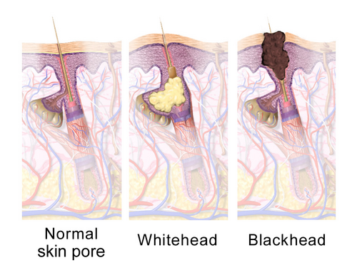
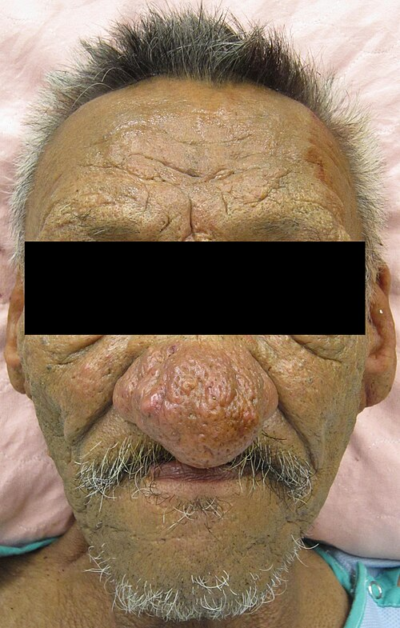
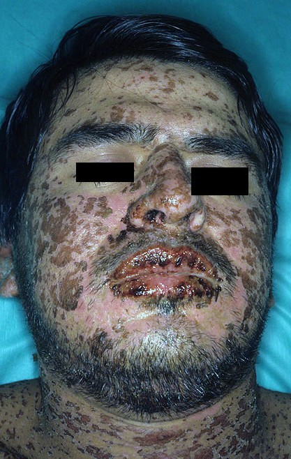

# ACNE E ROSÁCEA

Para entender dermatologia em provas de residência, você precisa parar de tentar decorar nomes de pomadas e começar a entender a **unidade pilossebácea**. Quase tudo o que discutiremos aqui — da acne juvenil à rosácea do idoso — gira em torno desse pequeno ecossistema composto por um pelo e sua glândula sebácea anexa.

Nas próximas linhas, vou te conduzir pelo raciocínio clínico que as bancas esperam de você. Não quero que você apenas saiba que "isotretinoína trata acne grave"; quero que você entenda por que ela é a única droga que realmente "cura" o processo fisiopatológico.

## Acne Vulgar: A Fisiopatologia que Cai

A acne não é "sujeira" na pele. É uma doença inflamatória crônica. Para a prova, você deve dominar os **quatro pilares fisiopatológicos**. Se você entender isso, o tratamento vira consequência lógica:

- **Hiperqueratose Folicular:** O "funil" do folículo entope porque as células mortas não descamam direito. Isso forma o microcomedão (o precursor de tudo).

- **Hiperprodução Sebácea:** Sob estímulo androgênico (testosterona e DHT), a glândula produz sebo em excesso. É por isso que a acne explode na puberdade.

- **Colonização por *Cutibacterium acnes*:** Essa bactéria (antigamente chamada de *Propionibacterium*) adora comer sebo em ambiente sem oxigênio (o folículo entupido).

- **Inflamação:** A presença da bactéria e o extravasamento de sebo para a derme disparam uma cascata inflamatória.

*Figura 1 - Unidade pilossebácea e formação da acne: a obstrução folicular pelo sebo e queratina cria o microcomedão, com posterior colonização bacteriana e inflamação. Fonte: BruceBlaus/Blausen Medical, CC BY 3.0 | Wikimedia Commons*

**Dica de Prova:** As bancas adoram perguntar qual o papel dos andrógenos. Lembre-se: a glândula sebácea é um órgão alvo periférico. Mesmo com níveis séricos normais de hormônios, o paciente pode ter acne por maior sensibilidade local ou conversão enzimática aumentada.

### Classificação Clínica (O Guia da Conduta)

Você não prescreve nada sem classificar. As bancas usam a classificação de I a IV (ou V, dependendo da referência, mas a I-IV é a clássica da SBD):

- **Grau I (Acne Comedoniana):** Apenas cravos (comedões abertos e fechados). Sem inflamação.

- **Grau II (Acne Pápulo-pustular):** Cravos + "espinhas" (pápulas e pústulas inflamadas).

- **Grau III (Acne Nódulo-cística):** Presença de nódulos e cistos dolorosos. Risco alto de cicatriz.

- **Grau IV (Acne Conglobata):** Nódulos que se comunicam (túneis/fístulas), abscessos e cicatrizes graves. Frequentemente no dorso e tórax.

- **Grau V (Acne Fulminans):** É a emergência da acne. Quadro súbito, febre, leucocitose, poliartralgia e lesões necróticas.

## O Arsenal Terapêutico: Por que fazemos o que fazemos?

Aqui é onde o aluno MedEvo brilha. Não decore receitas; entenda o mecanismo.

### Tratamento Tópico (Acne Leve a Moderada)

- **Retinoides Tópicos (Tretinoína, Adapaleno):** São a base do tratamento. Por quê? Porque eles combatem o pilar nº 1 (são comedolíticos). Eles "desentopem" o folículo.

- *Erro comum:* O paciente acha que o remédio não funciona porque a pele descama e irrita no início. Oriente o uso em noites alternadas.

- **Peróxido de Benzoíla (PBO):** É um agente oxidante potente. Ele mata o *C. acnes* e, o mais importante, **não causa resistência bacteriana**.

- *Estratégia de Prova:* Nunca use antibiótico tópico (Clindamicina) sozinho por muito tempo. Sempre associe ao PBO para evitar resistência.

- **Antibióticos Tópicos:** Clindamicina e Eritromicina. Usados para reduzir a carga bacteriana na acne Grau II.

### Tratamento Sistêmico

- **Antibióticos Orais (Tetraciclinas):** Doxiciclina e Limecliclina são as favoritas. Elas não servem apenas para "matar bactéria", mas sim pelo seu **efeito anti-inflamatório**.

- *Cuidado:* Contraindicadas em gestantes e crianças < 8 anos (mancham os dentes e interferem no crescimento ósseo).

- **Terapia Hormonal (Mulheres):** Anticoncepcionais com progestagênios antiandrogênicos (Ciproterona, Drospirenona) e Espironolactona.

- *Cenário Clínico:* Mulher de 25 anos, acne na "zona U" (mandíbula), piora pré-menstrual e hirsutismo. Investigar SOP (Síndrome dos Ovários Policísticos).

## Isotretinoína Oral: O "Rei" das Questões

A isotretinoína (Roacutan®) é o único fármaco que atua nos **4 pilares da acne**. Ela atrofia a glândula sebácea.

**Indicações Clássicas:**

- Acne Grau III e IV.

- Acne resistente ao tratamento convencional (antibiótico oral falhou).

- Acne com tendência importante a cicatrizes definitivas.

- Impacto psicossocial grave.

**O que você PRECISA saber para a prova:**

- **Teratogenicidade:** É o efeito adverso mais grave. Contraindicação ABSOLUTA na gestação. A paciente deve usar dois métodos anticoncepcionais e ter teste de gravidez negativo mensal.

- **Monitoramento Laboratorial:** Devemos dosar Transaminases (TGO/TGP) e Perfil Lipídico (Triglicerídeos e Colesterol).

- *Pérola Clínica:* Elevações leves de triglicerídeos (até 300-400 mg/dL) geralmente não exigem interrupção, apenas ajuste dietético. Se passar de 500-800 mg/dL, o risco é de pancreatite aguda.

- **Mitos de Prova:** Diabetes Mellitus **NÃO** é contraindicação absoluta, mas exige monitoramento rigoroso da glicemia. Depressão exige cautela, mas não proíbe o uso se o paciente estiver estável.

## Rosácea: O Diagnóstico Diferencial Crucial

Muitos alunos confundem Rosácea com Acne. Como diferenciar? **A Rosácea NÃO tem comedões (cravos).** Se a questão descreve um paciente de 40 anos com "espinhas" e vermelhidão, mas diz que não há cravos, o diagnóstico é Rosácea.

### Os 4 Subtipos da Rosácea

- **Eritemato-telangiectásica:** Vermelhidão persistente (flushing) e vasinhos (telangiectasias) no centro da face. Gatilhos: álcool, sol, pimenta, calor.

- **Pápulo-pustular:** Parece acne, mas sobre uma base eritematosa e sem comedões.

- **Fimatosa:** Hipertrofia das glândulas e fibrose. O exemplo clássico é o **Rinofima** (nariz bulboso), mais comum em homens.

*Figura 2 - Rinofima grave: hipertrofia das glândulas sebáceas e fibrose no nariz, subtipo fimatoso da rosácea, mais frequente em homens. Fonte: James Heilman, MD, CC BY-SA 3.0 | Wikimedia Commons*
4. **Ocular:** Blefarite, conjuntivite e sensação de corpo estranho. Pode ocorrer antes das lesões na pele!

### Tratamento da Rosácea

- **Medidas Gerais:** Fotoproteção rigorosa e evitar gatilhos.

- **Tópico:** Metronidazol, Ácido Azelaico ou Ivermectina (foco no ácaro *Demodex folliculorum*).

- **Sistêmico:** Doxiciclina em subdose (40mg) para efeito anti-inflamatório ou Isotretinoína em doses baixas para casos refratários.

## Farmacodermias: Onde a Dermatologia vira Emergência

As bancas amam misturar acne com reações medicamentosas graves. Vamos organizar isso.

### 1. Síndrome de Stevens-Johnson (SSJ) e Necrólise Epidérmica Tóxica (NET)

São reações de hipersensibilidade tardia (tipo IV) a drogas (Sulfas, Anticonvulsivantes como Carbamazepina e Fenitoína, AINEs).

- **Clínica:** Pródromos gripais seguidos de lesões em alvo atípicas, bolhas e **descolamento epidérmico**.

- **Diferença:** SSJ (< 10% da superfície corporal), NET (> 30%). Entre 10-30% é a sobreposição.

- **Manejo:** Suporte em UTI/Unidade de Queimados. **Suspender a droga agressora imediatamente** é a medida que mais reduz mortalidade. O uso de corticoides é controverso e não é o "padrão-ouro" absoluto.

*Figura 3 - Síndrome de Stevens-Johnson: lesões cutâneas disseminadas com descolamento epidérmico < 10% da superfície corporal, causada por hipersensibilidade tardia a fármacos. Fonte: Dr. Thomas Habif/Dermnet, CC BY-SA 3.0 | Wikimedia Commons*

### 2. Síndrome DRESS

*Drug Reaction with Eosinophilia and Systemic Symptoms*.

- **Tríade:** Exantema morbiliforme + Febre + Linfadenopatia.

- **Laboratório:** Eosinofilia importante e alteração de função hepática (Hepatite medicamentosa).

- **Drogas comuns:** Fenitoína, Alopurinol.

- **Tratamento:** Suspender droga e, aqui sim, Corticoide Sistêmico em doses altas com desmame lento.

### 3. Erupção Acneiforme (Acne Medicamentosa)

Diferente da acne vulgar, ela é **monomórfica** (todas as lesões estão no mesmo estágio, geralmente pápulas eritematosas) e não tem comedões.

- **Causas:** Corticoides sistêmicos (a mais comum em provas!), Vitaminas do complexo B, Lítio.

## Acne Ocupacional e Outras Formas

Como diz o Dr. Will, a prova quer saber se você reconhece o ambiente do paciente.

- **Elaioconiose:** Acne causada pelo contato com óleos de corte, graxas e hidrocarbonetos em mecânicos e metalúrgicos. As lesões aparecem nas áreas de contato (coxas, antebraços).

- **Cloracne:** Causada por hidrocarbonetos clorados (dioxinas). É uma forma grave e persistente.

- **Hidradenite Supurativa:** Não é acne, mas o "primo rico". Inflamação das glândulas apócrinas (axilas, virilhas). Tratamento envolve clindamicina + rifampicina e, em casos graves, biológicos (Adalimumabe).

## Hiperidrose e Unhas: Tópicos de "Rodapé" que Caem

### Hiperidrose Primária

Suor excessivo (palmas, plantas, axilas) sem causa secundária.

- **Tratamento Inicial:** Cloreto de alumínio tópico.

- **Segunda linha:** Toxina Botulínica (eficácia de 6-12 meses).

- **Definitivo:** Simpatectomia Torácica Endoscópica (Cuidado: complicação frequente é a **hiperidrose compensatória** em tronco/coxas).

### Unhas: Psoríase vs. Onicomicose

- **Psoríase Ungueal:** "Unha em dedal" (pitting/depressões cupuliformes), mancha em "gota de óleo", hiperqueratose subungueal.

- **Onicomicose:** Frequentemente associada a *Tinea pedis*. O diagnóstico exige micológico direto/cultura antes de iniciar antifúngico oral (Terbinafina/Itraconazol).

## Tabelas Comparativas para Fixação

### Tabela 1: Classificação e Conduta na Acne Vulgar

| Grau | Lesão Predominante | Tratamento de Escolha |
| --- | --- | --- |
| **I** | Comedões (Cravos) | Retinoide tópico (Adapaleno/Tretinoína) |
| **II** | Pápulas e Pústulas | Retinoide tópico + PBO + Antibiótico Tópico |
| **III** | Nódulos e Cistos | Antibiótico Oral (Doxiciclina) + Tópicos |
| **IV** | Conglobata (Fístulas) | Isotretinoína Oral (1ª escolha) |
| **V** | Fulminans (Sistêmico) | Corticoide Sistêmico + Isotretinoína posterior |

### Tabela 2: Acne Vulgar vs. Rosácea vs. Erupção Acneiforme

| Característica | Acne Vulgar | Rosácea | Erupção Acneiforme |
| --- | --- | --- | --- |
| **Comedões** | Presentes (obrigatório) | Ausentes | Ausentes |
| **Idade Típica** | Adolescência | 30-50 anos | Qualquer (pós-droga) |
| **Localização** | Face, Dorso, Tórax | Centro da face | Tronco e Face |
| **Morfologia** | Polimórfica | Eritema/Telangiectasias | Monomórfica |
| **Causa** | Multifatorial | Gatilhos/Demodex | Corticoide/Lítio/B12 |

### Tabela 3: SJS vs. NET vs. DRESS

| Critério | SJS | NET | DRESS |
| --- | --- | --- | --- |
| **Descolamento** | < 10% SC | > 30% SC | Raro/Ausente |
| **Mucosas** | Acometimento grave | Acometimento grave | Raro |
| **Eosinofilia** | Ausente | Ausente | Presente (> 1500/mm³) |
| **Latência** | 1 a 3 semanas | 1 a 3 semanas | 2 a 8 semanas (longa) |
| **Órgão Alvo** | Pele | Pele | Fígado/Rins |

## Pontos-Chave para Prova 💡

- **Acne Comedoniana (Grau I):** O tratamento é EXCLUSIVAMENTE tópico. Não use antibiótico oral aqui.

- **Resistência Bacteriana:** Evite usar antibióticos tópicos ou orais por mais de 3-4 meses. Sempre associe Peróxido de Benzoíla.

- **Isotretinoína e Gestação:** Contraindicação absoluta. O risco de malformação (SNC, cardíaca) é altíssimo mesmo com doses baixas.

- **Isotretinoína e Lípides:** Triglicerídeos > 800 mg/dL = Risco de Pancreatite. Monitorar, mas não se assuste com aumentos leves.

- **Rosácea:** O diagnóstico é clínico. Não há necessidade de biópsia na maioria dos casos. O diferencial com acne é a ausência de comedões.

- **SJS/NET:** A primeira e mais importante medida é suspender o fármaco suspeito. O tratamento é suporte (hidratação, curativos, controle de infecção).

- **Eritema Multiforme:** Frequentemente associado ao vírus Herpes Simples (HSV). Apresenta as clássicas "lesões em alvo" ou "tiro ao alvo" (três zonas de cor).

- **DRESS:** Lembre-se da latência longa (até 2 meses após iniciar a droga) e da eosinofilia. O fígado é o órgão sistêmico mais afetado.

- **Acne na Mulher Adulta:** Se houver irregularidade menstrual ou sinais de virilização, peça Testosterona Total, Livre e SDHEA para investigar SOP ou tumores adrenais.

- **Acetato de Mafenida:** Usado em queimados, pode causar acidose metabólica por inibição da anidrase carbônica.

- **Hiperidrose:** A simpatectomia é excelente para mãos, mas o paciente deve ser avisado sobre o suor compensatório em outras áreas.

- **Psoríase Ungueal:** O "pitting" (unha em dedal) é muito característico, mas não patognomônico. Pode simular onicomicose (onicodistrofia).

- **Elaioconiose:** É a acne do mecânico. O tratamento envolve higiene e cessação da exposição ao óleo mineral.

- **Corticoides:** Podem causar acne (erupção acneiforme) e também são usados para tratar as formas mais graves de acne inflamatória (Fulminans) para "esfriar" o quadro antes da isotretinoína.

Este material resume o que há de mais moderno e cobrado nas provas de residência médica no Brasil, seguindo as diretrizes da Sociedade Brasileira de Dermatologia. Se você dominar esses conceitos e as diferenciações das tabelas, estará pronto para qualquer questão de dermatologia clínica. No MedEvo, focamos no que realmente cai.

 Cópia offline para consulta pessoal.
 Fonte original:
 [https://www.medevo.com.br/material-apoio/ler/cb9e0e4e-706e-414f-b499-b540256831cc](https://www.medevo.com.br/material-apoio/ler/cb9e0e4e-706e-414f-b499-b540256831cc)
