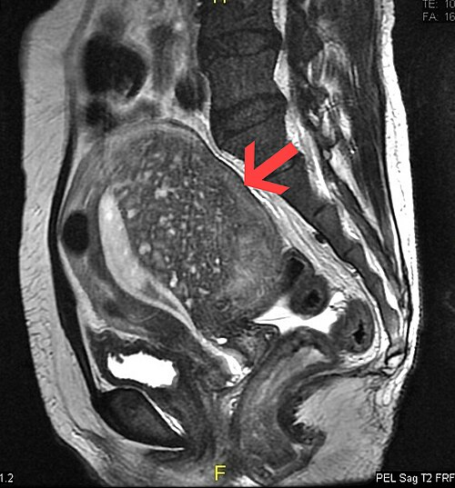
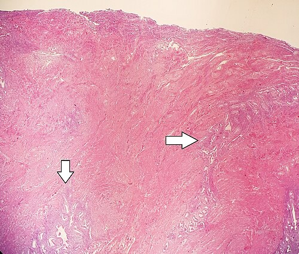

# ADENOMIOSE

## O que é e por que acontece? (Fisiopatologia)

Para entender a adenomiose, você precisa visualizar o útero não como um órgão estático, mas como uma interface dinâmica. A definição clássica, que você encontrará em qualquer prova de residência, é a presença de glândulas e estroma endometrial infiltrados no miométrio, associada à hipertrofia e hiperplasia das fibras musculares lisas adjacentes.

Mas por que isso acontece? Por que o endométrio, que deveria ficar restrito à cavidade uterina, resolve "invadir" a parede muscular?

Existem duas teorias principais que as bancas adoram cobrar. A primeira, e mais aceita, é a teoria da **invaginação da camada basal do endométrio**. Imagine que a zona juncional (aquela fronteira entre o endométrio e o miométrio) sofre uma quebra de integridade. Isso geralmente ocorre devido a traumas uterinos, como partos, curetagens ou cesáreas. Uma vez que essa barreira é rompida, o endométrio penetra no miométrio.

A segunda teoria é a da **metaplasia mulleriana**. Aqui, acredita-se que resquícios de tecido mulleriano embrionário, que já estavam "dormentes" no miométrio, sofrem uma diferenciação e se transformam em tecido endometrial. Essa teoria ajuda a explicar casos raros em pacientes que nunca passaram por cirurgias uterinas.

**O "Porquê" dos Sintomas:**
Por que a paciente com adenomiose sangra tanto e sente tanta dor? O tecido endometrial ectópico (fora do lugar) responde aos estímulos hormonais do ciclo menstrual. Ele prolifera e descama. Como esse sangue não tem por onde sair, ele gera pequenos focos de hemorragia interna no músculo, causando um processo inflamatório crônico. Essa inflamação leva à hipertrofia do miométrio, o que explica o útero aumentado e a dor intensa (dismenorreia).

**Dica de Prova:** Muitas questões tentam confundir adenomiose com endometriose. Lembre-se: na adenomiose, o tecido está **dentro** do músculo uterino. Na endometriose, o tecido está **fora** do útero (peritônio, ovários, ligamentos). Como o Dr. Will costuma dizer nas aulas, a adenomiose é a "endometriose do útero", mas com comportamento clínico e epidemiológico distinto.

*Figura 1 - RM sagital da pelve feminina mostrando adenomiose na parede posterior do útero: note o espessamento significativo do miométrio com múltiplos focos de hiperintensidade (glândulas endometriais ectópicas). Fonte: Dr. Varun Babu/Radiopaedia, CC BY-SA 4.0 | Wikimedia Commons*

## Quem é a paciente da Adenomiose? (Epidemiologia)

Diferente da endometriose, que frequentemente é diagnosticada em mulheres jovens e nuligestas, a "paciente clássica" da adenomiose nas provas é a **mulher multípara, entre 35 e 50 anos**.

Os principais fatores de risco que você deve memorizar são:

- **Multiparidade:** O estiramento das fibras uterinas e o processo de parto facilitam a quebra da zona juncional.

- **Cirurgias Uterinas Prévias:** Curetagens, cesáreas e miomectomias são "portas de entrada" para o endométrio invadir o miométrio.

- **Idade:** A prevalência aumenta significativamente na quarta e quinta décadas de vida, muitas vezes regredindo após a menopausa, já que a doença é dependente de estrogênio.

**Erro clássico de prova:** Achar que a adenomiose é exclusiva de multíparas. Embora seja o perfil mais comum, ela pode ocorrer em nuligestas. No entanto, se a questão trouxer uma paciente de 45 anos, com 3 filhos e sangramento aumentado, seu primeiro pensamento deve ser adenomiose.

## O que a paciente sente? (Quadro Clínico)

A tríade clássica da adenomiose é composta por:

- **Sangramento Uterino Anormal (SUA):** Geralmente manifestado como menorragia (aumento do volume e da duração do fluxo).

- **Dismenorreia Secundária:** Uma dor que costuma ser progressiva e incapacitante.

- **Aumento do Volume Uterino:** A paciente sente o útero "pesado" ou percebe um aumento do volume abdominal.

Diferente da dismenorreia primária (aquela que a adolescente tem desde a menarca e que melhora com o tempo), a dismenorreia da adenomiose é **progressiva**. Ela piora com o passar dos anos.

**Exemplo Clínico:** Imagine uma paciente de 42 anos, G3P3 (três partos normais), que refere que nos últimos dois anos seu fluxo menstrual dobrou de volume e ela passou a precisar de analgésicos potentes para conseguir trabalhar durante a menstruação. Ao exame físico, você nota um útero aumentado, de consistência amolecida e doloroso à palpação. Esse é o "quadro de livro" da adenomiose.

**Atenção à Dispareunia:** Embora a dispareunia de profundidade seja um sintoma muito forte para endometriose profunda, ela também pode ocorrer na adenomiose, especialmente se houver um útero retrovertido e muito inflamado. Porém, se a questão focar apenas em dispareunia e dor pélvica crônica sem alteração de fluxo, pense mais em endometriose.

## O desafio do Exame Físico

No exame físico, o achado patognomônico (se é que podemos chamar assim em uma prova) é o **útero globoso**, aumentado de volume (geralmente não ultrapassando 12-14 cm ou o tamanho de uma gestação de 12 semanas) e de consistência **amolecida ou elástica**.

Diferente do útero com miomas, que é endurecido e irregular (cheio de "calombos"), o útero da adenomiose é mais uniforme, embora possa ser assimétrico se a doença for focal.

**Pérola de Prova:** Se a questão descrever um "útero fixo e retrovertido", pense em endometriose profunda com acometimento de ligamentos uterossacros. Se descrever um "útero globoso, doloroso e móvel", a aposta principal é adenomiose.

## Diagnóstico: Do Olhar Clínico à Imagem

Antigamente, dizia-se que o diagnóstico de adenomiose era apenas histopatológico (após a retirada do útero). Hoje, isso mudou. A tecnologia de imagem nos permite um diagnóstico de alta suspeição com excelente acurácia.

### Ultrassonografia Transvaginal (USTV)

É o exame de primeira linha. Mas não é qualquer ultrassom. O examinador deve seguir os critérios do **Consenso MUSA (Morphological Uterus Sonographic Assessment)**.

Os sinais ultrassonográficos que você precisa decorar para a prova são:

- **Assimetria das paredes miometriais:** Uma parede (geralmente a posterior) é muito mais espessa que a outra.

- **Cistos miometriais:** Pequenas áreas anecoicas no meio do músculo (sangue retido).

- **Ilhotas hiperecogênicas:** Pontos brilhantes no miométrio que representam o estroma endometrial.

- **Sombreamento em "leque" ou "raios de sol":** Sombras lineares que partem da zona juncional.

- **Estrias subendometriais:** Linhas finas que invadem o miométrio a partir do endométrio.

- **Zona Juncional irregular ou espessada.**

### Ressonância Magnética (RM) de Pelve

A RM é considerada por muitos o melhor exame pré-operatório, com sensibilidade e especificidade superiores à ultrassonografia convencional, especialmente para diferenciar adenomiose de miomatose.

O critério diagnóstico mais cobrado em provas na RM é o **espessamento da Zona Juncional (ZJ)**:

- **ZJ > 12 mm:** Diagnóstico muito provável de adenomiose.

- **ZJ < 8 mm:** Exclui adenomiose.

- **ZJ entre 8 e 12 mm:** Zona cinzenta, onde outros sinais (como focos de alto sinal em T2) devem ser avaliados.

**Por que a RM é importante?** Porque ela ajuda a mapear a doença. A adenomiose pode ser **difusa** (espalhada por todo o miométrio) ou **focal** (formando um "adenomioma"). O adenomioma pode ser facilmente confundido com um mioma intramural, mas a RM consegue diferenciá-los: o mioma tem limites bem definidos e uma pseudocápsula, enquanto o adenomioma tem limites imprecisos e "se mistura" com o miométrio normal.

### Diagnóstico Histopatológico

Não se esqueça: o **diagnóstico definitivo** continua sendo o histopatológico da peça cirúrgica (histerectomia). A biópsia de endométrio (por curetagem ou AMIU) **não serve** para diagnosticar adenomiose, pois ela coleta apenas a camada funcional e basal, sem atingir o miométrio onde a doença reside.

| Característica | Adenomiose | Miomatose Uterina |
| --- | --- | --- |
| **Consistência** | Amolecida / Elástica | Endurecida / Firme |
| **Formato do Útero** | Globoso / Simétrico | Irregular / Multinodular |
| **Limites na Imagem** | Imprecisos / Mal definidos | Bem definidos (Pseudocápsula) |
| **Sinal na RM** | Zona Juncional espessada | Nódulo hipointenso bem delimitado |
| **Resposta Clínica** | Melhora com bloqueio hormonal | Melhora com bloqueio, mas o nódulo persiste |

## Diagnóstico Diferencial: Não confunda!

Este é o ponto onde o aluno do MedEvo ganha a questão. As bancas amam colocar casos clínicos limítrofes.

- **Endometriose:** A dor é o sintoma principal. O sangramento costuma ser normal. O diagnóstico é sugerido por mapeamento para endometriose ou RM e confirmado por videolaparoscopia.

- **Miomatose:** O sangramento é o sintoma principal. A dor ocorre se o mioma for submucoso (cólica expelindo o mioma) ou se houver degeneração. O útero é endurecido.

- **Pólipos Endometriais:** Causam sangramento intermenstrual ou spotting, mas raramente causam dor intensa ou aumento do volume uterino.

- **Dismenorreia Membranácea:** Uma condição rara onde a paciente expele um "molde" inteiro do endométrio de uma vez, causando uma dor lancinante que cessa após a expulsão.

## Tratamento: Do Controle de Sintomas à Cura

O tratamento da adenomiose depende de dois fatores fundamentais: a **gravidade dos sintomas** e o **desejo reprodutivo**. No MedEvo, sempre ensinamos que não tratamos o exame de imagem, tratamos a paciente.

### Tratamento Clínico (Controle de Sintomas)

O objetivo aqui é induzir a atrofia do tecido endometrial ectópico e controlar a inflamação.

- **Anti-inflamatórios Não Esteroidais (AINEs):** Usados apenas para controle da dor durante a menstruação. Não tratam a causa, apenas o sintoma.

- **Contraceptivos Hormonais Combinados:** Podem ser usados de forma contínua para evitar a menstruação. É uma excelente primeira escolha para pacientes jovens ou com sintomas leves.

- **Sistema Intrauterino de Levonorgestrel (SIU-LNG / Mirena):** Atualmente é considerado por muitas diretrizes (incluindo a FEBRASGO) como o **padrão-ouro para tratamento clínico**. Ele libera progesterona localmente, causando atrofia do endométrio e da zona juncional, reduzindo drasticamente o sangramento e a dor.

- **Progestagênios Isolados:** (Ex: Dienogeste 2mg/dia). Muito eficazes no controle da dor, agindo de forma semelhante ao que fazem na endometriose.

- **Análogos do GnRH:** (Ex: Leuprolida). Causam um estado de "pseudomenopausa". São extremamente eficazes, mas o uso é limitado pelo tempo (máximo 6 meses) devido aos efeitos colaterais (osteoporose, fogachos). Podem ser usados no pré-operatório para reduzir o volume uterino.

### Tratamento Cirúrgico

- **Histerectomia:** É o único **tratamento definitivo**. Indicada para pacientes com prole definida e sintomas refratários ao tratamento clínico. Pode ser total ou subtotal, embora a total seja preferível para evitar a persistência de focos de adenomiose no colo uterino.

- **Cirurgias Conservadoras (Adenomiomectomia):** Tentativa de retirar apenas o foco de adenomiose. É uma cirurgia tecnicamente muito difícil porque, como vimos, a adenomiose não tem plano de clivagem (diferente do mioma). É reservada para casos selecionados de mulheres que desejam gestar e têm adenomiose focal importante.

- **Embolização de Artérias Uterinas (EAU):** Uma opção para quem não quer operar, mas os resultados na adenomiose são menos previsíveis do que nos miomas.

**Dica de Ouro:** Se a questão de prova trouxer uma paciente com prole definida, falha do tratamento clínico e sintomas graves, não hesite: a resposta é **Histerectomia**.

## Adenomiose e Infertilidade

Este é um tema que tem ganhado destaque. A adenomiose prejudica a fertilidade por vários mecanismos:

- **Alteração da Peristalse Uterina:** O útero doente contrai de forma desordenada, dificultando o transporte dos espermatozoides.

- **Ambiente Inflamatório:** O excesso de radicais livres e citocinas inflamatórias no miométrio e na cavidade endometrial prejudica a implantação do embrião.

- **Falha de Implantação:** A zona juncional alterada não permite uma decidualização adequada.

Em pacientes que vão realizar Fertilização In Vitro (FIV), muitas vezes utilizamos análogos do GnRH por 2 a 3 meses antes da transferência embrionária para "esfriar" o útero e aumentar as chances de sucesso.

## Situações Especiais e Pegadinhas

**1. Adenomiose e CA-125:**
O CA-125 pode estar aumentado na adenomiose? Sim! Assim como na endometriose, na miomatose e em processos inflamatórios pélvicos. Um CA-125 elevado em uma paciente com útero aumentado não significa necessariamente câncer de ovário. Serve mais para acompanhamento do que para diagnóstico.

**2. A "Dismenorreia Membranácea":**
Cuidado com essa descrição em provas. Se a paciente relata dor intensa seguida da expulsão de um tecido que parece um "saco" ou "molde do útero", isso é dismenorreia membranácea, uma condição associada a altos níveis de progesterona, e não necessariamente adenomiose.

**3. Dor Miofascial Pélvica:**
Muitas pacientes com dor pélvica crônica por adenomiose ou endometriose desenvolvem uma dor secundária na musculatura do assoalho pélvico. Nesses casos, o tratamento da doença de base pode não ser suficiente. O uso de **Duloxetina** ou fisioterapia pélvica pode ser necessário para tratar essa dor neuropática/miofascial.

## Pontos-Chave para Prova

- **Definição:** Glândulas e estroma endometrial no miométrio com hipertrofia muscular adjacente.

- **Perfil Típico:** Multípara, 35-50 anos, com queixa de sangramento aumentado e dor progressiva.

- **Fatores de Risco:** Multiparidade e cirurgias uterinas prévias (cesárea, curetagem).

- **Tríade Clínica:** Sangramento Uterino Anormal (SUA) + Dismenorreia Secundária + Útero Globoso/Aumentado.

- **Exame Físico:** Útero de consistência amolecida, aumentado de volume e doloroso.

- **Padrão-Ouro Diagnóstico:** Histopatológico da peça operatória (Histerectomia).

- **Exame de Imagem Inicial:** USTV com critérios MUSA (cistos miometriais, sombras em leque, assimetria de paredes).

- **Critério de RM:** Espessamento da Zona Juncional > 12 mm.

- **Tratamento Clínico de Escolha:** SIU-LNG (Mirena) ou progestagênios contínuos.

- **Tratamento Definitivo:** Histerectomia (indicada se prole definida e falha clínica).

- **Diferencial com Mioma:** O mioma tem limites precisos e pseudocápsula; a adenomiose é infiltrativa e mal delimitada.

- **Diferencial com Endometriose:** Endometriose é fora do útero; adenomiose é dentro do músculo uterino.

- **Infertilidade:** A adenomiose causa falha de implantação e ambiente inflamatório hostil ao embrião.

- **Biópsia Endometrial:** NÃO faz diagnóstico de adenomiose.

- **Metaplasia Mulleriana:** Teoria que explica a adenomiose em pacientes sem fatores de risco cirúrgicos.

- **Tratamento Empírico:** Em adolescentes com dismenorreia suspeita, pode-se iniciar ACO ou progesterona antes de exames invasivos. 🩺

 Cópia offline para consulta pessoal.
 Fonte original:
 [https://www.medevo.com.br/material-apoio/ler/f32682d6-58af-4e18-b755-6b1551f17830](https://www.medevo.com.br/material-apoio/ler/f32682d6-58af-4e18-b755-6b1551f17830)
