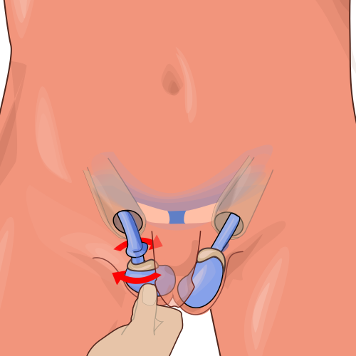
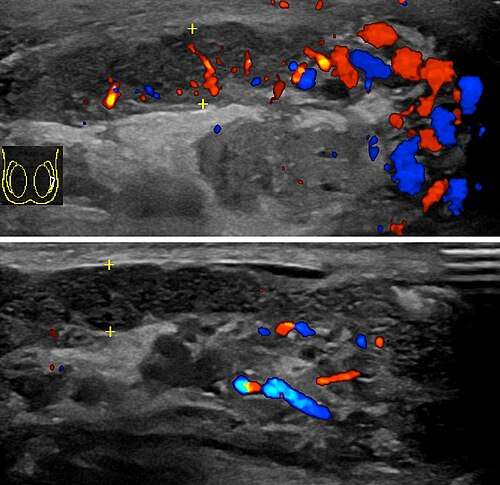

# AFECÇÕES ESCROTAIS AGUDAS: TORÇÃO, ORQUITE, EPIDIDIMITE

O escroto agudo é uma das situações mais dramáticas da urologia e uma das favoritas das bancas de residência. Por quê? Porque o tempo aqui é, literalmente, parênquima testicular. Se você demora a diagnosticar uma torção, o paciente perde o testículo. Se você opera uma orquiepididimite desnecessariamente, submete o paciente a um risco cirúrgico evitável.

Como professor, vejo muitos alunos decorando sinais isolados, mas o segredo da prova (e da vida real) é entender a fisiopatologia para diferenciar essas entidades no "olho do furacão" do pronto-socorro.

## Torção Testicular: A Emergência "Tempo-Dependente"

A torção testicular é a rotação do cordão espermático sobre seu próprio eixo, o que interrompe o suprimento sanguíneo para o testículo. É a causa mais comum de perda testicular em adolescentes.

### Fisiopatologia e Anatomia: O "Badalo de Sino"

Para o testículo torcer, ele precisa estar "solto" dentro da túnica vaginal. Normalmente, o testículo é fixado posteriormente. Em alguns pacientes, a túnica vaginal envolve o testículo e o cordão espermático de forma anormalmente alta. Isso é a **deformidade em badalo de sino** (bell-clapper deformity).

Imagine um sino: ele balança livremente porque só está preso pelo topo. Se o testículo está assim, qualquer contração brusca do músculo cremaster (frio, trauma leve, ou mesmo durante o sono) pode fazê-lo girar.

Existem dois tipos principais que você precisa diferenciar:

- **Torção Intravaginal:** É a clássica do adolescente. Ocorre dentro da túnica vaginal devido à deformidade citada.

- **Torção Extravaginal:** Ocorre quase exclusivamente em recém-nascidos. Aqui, todo o conteúdo (testículo + túnica vaginal) gira, pois as fixações escrotais ainda não estão firmes.

*Figura 1 - Torção testicular: rotação do cordão espermático sobre seu eixo, levando à isquemia do parênquima testicular. A deformidade em "badalo de sino" (bell-clapper) permite essa rotação anormal. Fonte: Hariadhi, CC BY-SA 4.0 | Wikimedia Commons*

### Quadro Clínico: A Tríade da Torção

A banca vai te dar um caso de um adolescente (12-18 anos) que acorda de madrugada com uma **dor súbita e excruciante**.

Ao exame físico, você deve procurar três achados clássicos:

- **Testículo Elevado e Horizontalizado (Sinal de Angel):** Como o cordão "encurtou" ao girar, o testículo sobe.

- **Reflexo Cremastérico Ausente:** Este é o sinal clínico mais sensível. Se você estimula a face interna da coxa e o testículo não sobe, a suspeita de torção vai para o topo.

- **Sinal de Prehn Negativo:** Se você elevar o testículo com a mão e a dor **não melhorar** (ou até piorar), o sinal é negativo. Isso sugere torção.

**Cuidado:** Muitos alunos acham que a ausência de febre exclui epididimite ou que a presença de náuseas confirma torção. Embora náuseas e vômitos sejam comuns na torção devido à intensidade da dor, o diagnóstico é eminentemente clínico baseado na anatomia e no reflexo cremastérico.

### Diagnóstico: O Papel do Doppler

Aqui está a maior pegadinha de prova: **Torção testicular é um diagnóstico clínico.**

Se a suspeita for alta, a conduta é a **exploração cirúrgica imediata**. Segundo as diretrizes da Sociedade Brasileira de Urologia (SBU), você não deve atrasar a cirurgia para realizar exames de imagem se o quadro for clássico.

O **Ultrassom Doppler Colorido** é o padrão-ouro quando há dúvida diagnóstica (ex: dor há mais de 24h, quadro arrastado). O achado típico é a **ausência ou redução acentuada do fluxo sanguíneo** no parênquima testicular. Se o Doppler mostrar fluxo normal, você respira e pensa em outros diferenciais.

### Manejo Cirúrgico: O que fazer no centro cirúrgico?

O tempo é crucial. Se operado em até 6 horas, a taxa de salvamento é de quase 100%. Após 24 horas, a chance cai para menos de 10%.

- **Distorção Manual:** Pode ser tentada enquanto a sala cirúrgica é preparada. A regra é "abrir um livro": a maioria das torções ocorre para dentro (medial), então você gira para fora (lateral). Mas atenção: isso não substitui a cirurgia!

- **Exploração Escrotal:** Se o testículo estiver viável após a distorção (retomar a cor rósea), fazemos a **Orquidopexia** (fixação).

- **O Detalhe de Ouro:** Você **DEVE** realizar a orquidopexia contralateral. Por que? Porque a deformidade em badalo de sino costuma ser bilateral. Se torceu de um lado, o outro está em risco.

- **Orquiectomia:** Se o testículo estiver francamente necrótico (preto/azulado e sem sangramento após 20 min de aquecimento com compressas), ele deve ser removido para evitar a formação de anticorpos antiespermatozoides que poderiam atacar o testículo saudável remanescente.

## Epididimite e Orquiepididimite

Diferente da torção, aqui o processo é inflamatório/infeccioso. A infecção geralmente começa no epidídimo (epididimite) e pode se estender ao testículo (orquiepididimite).

### Etiologia: A Idade é a Chave

Para acertar a questão de tratamento, você precisa olhar a idade do paciente:

- **Crianças e Idosos (>35 anos):** Geralmente causada por uropatógenos comuns (**Escherichia coli**, Pseudomonas). Está associada a malformações urinárias em crianças ou hiperplasia prostática/cateterismo em idosos.

- **Homens Jovens e Sexualmente Ativos (<35 anos):** É considerada uma Infecção Sexualmente Transmissível (IST). Os agentes são **Chlamydia trachomatis** e **Neisseria gonorrhoeae**.

### Quadro Clínico e o Sinal de Prehn

A dor na epididimite costuma ser **insidiosa** (vai piorando ao longo de dias), diferente da torção que é súbita. O paciente pode ter sintomas urinários associados (disúria, polaciúria) e febre.

No exame físico:

- **Sinal de Prehn Positivo:** Ao elevar o escroto, o paciente sente alívio da dor. Isso acontece porque você reduz a tensão do epidídimo inflamado contra a gravidade.

- **Reflexo Cremastérico Presente:** O reflexo está preservado porque não há isquemia nervosa ou torção do cordão.

- **Epidídimo Espessado:** Na palpação, você sente o epidídimo (que fica atrás do testículo) endurecido e muito doloroso.

*Figura 2 - Ultrassom Doppler colorido na epididimite: aumento do fluxo sanguíneo no epidídimo afetado (acima) comparado ao lado normal (abaixo), demonstrando o padrão inflamatório hiperêmico. Fonte: Mikael Häggström, CC0 | Wikimedia Commons*

### Tratamento Farmacológico

Como ensinamos no MedEvo, o tratamento deve ser direcionado à causa provável. Não adianta dar apenas analgésico.

| Perfil do Paciente | Agentes Prováveis | Esquema Terapêutico (SBU/MS) |
| --- | --- | --- |
| < 35 anos (Suspeita de IST) | Chlamydia / Gonococo | Ceftriaxone 500mg IM (dose única) + Doxiciclina 100mg VO 12/12h por 10-14 dias |
| > 35 anos ou Baixo Risco IST | Coliformes (E. coli) | Levofloxacino 500mg VO 1x/dia ou Ofloxacino 300mg 12/12h por 10-14 dias |
| Prática de Sexo Anal Insertivo | Coliformes + IST | Ceftriaxone + Fluoroquinolona (para cobrir ambos) |

Além dos antibióticos, o tratamento não-farmacológico inclui: repouso, suspensório escrotal (para manter o Prehn positivo o dia todo) e gelo local.

## Torção de Apêndice Testicular (Hidátide de Morgagni)

Esta é a causa mais comum de escroto agudo em crianças de 7 a 12 anos. O apêndice testicular é um remanescente embrionário (ducto de Müller) que não tem função, mas pode torcer.

**O Pulo do Gato para a Prova:**
A dor é aguda, mas o estado geral da criança é bom. O reflexo cremastérico está **presente**.
O sinal patognomônico é o **Sinal do Ponto Azul** (Blue Dot Sign): uma pequena mancha azulada visível através da pele do escroto na parte superior do testículo, que nada mais é do que o apêndice necrosado.

**Conduta:** Diferente da torção de cordão, aqui o tratamento é **conservador**. Analgésicos, anti-inflamatórios e repouso. A hidátide vai necrosar e ser reabsorvida sem danos ao testículo.

## Orquite Viral (Caxumba)

A orquite isolada é rara, exceto na etiologia viral. A caxumba (Parotidite) é a causa clássica. Cerca de 20-30% dos homens pós-púberes com caxumba desenvolverão orquite.

- **Clínica:** Ocorre geralmente 4 a 7 dias após a parotidite.

- **Complicação:** A atrofia testicular ocorre em 50% dos casos, mas a infertilidade total é rara, pois o acometimento costuma ser unilateral.

- **Tratamento:** Apenas suporte. Não há antiviral específico nem indicação de corticoide para prevenir atrofia segundo as evidências mais robustas.

## Diagnóstico Diferencial: Tabela Comparativa

Esta tabela é o que você precisa revisar 5 minutos antes da prova.

| Característica | Torção Testicular | Orquiepididimite | Torção de Apêndice |
| --- | --- | --- | --- |
| **Idade Típica** | Adolescentes (12-18a) | Jovens (<35) ou Idosos | Crianças (7-12a) |
| **Início da Dor** | Súbito (agudo) | Gradual (insidioso) | Agudo/Subagudo |
| **Reflexo Cremastérico** | Ausente | Presente | Presente |
| **Sinal de Prehn** | Negativo (piora/sem melhora) | Positivo (melhora) | Indiferente |
| **Sintomas Urinários** | Raros | Comuns (disúria) | Ausentes |
| **Doppler** | Fluxo ausente/reduzido | Fluxo aumentado (hiperemia) | Fluxo normal |
| **Conduta** | Cirurgia de Urgência | Antibióticos | Analgesia (Conservador) |

## Priapismo: A Outra Emergência Urológica

Embora não seja uma "afecção escrotal" propriamente dita, o priapismo aparece no mesmo bloco de questões de emergência urológica. É a ereção persistente (>4 horas) não relacionada ao desejo sexual.

### Priapismo Isquêmico (Baixo Fluxo)

É o mais comum e o mais perigoso. Há uma obstrução do retorno venoso. O sangue fica "preso" e estagnado, levando a hipóxia e acidose.

- **Causas:** Anemia falciforme (clássico em provas!), uso de drogas eréteis, psicotrópicos.

- **Clínica:** Dor intensa, corpos cavernosos rígidos, mas a glande permanece flácida.

- **Tratamento:** Emergência!

- Aspiração dos corpos cavernosos (sangue vem escuro/acidótico).

- Irrigação com soro fisiológico.

- Injeção intracavernosa de alfa-agonistas (**Fenilefrina** é a droga de escolha).

- Se falhar: Shunts cirúrgicos.

### Priapismo Não-Isquêmico (Alto Fluxo)

Geralmente após trauma perineal que cria uma fístula entre a artéria cavernosa e o corpo cavernoso.

- **Clínica:** Ereção menos rígida, indolor. O sangue é oxigenado (vermelho vivo).

- **Tratamento:** Não é emergência imediata. Pode-se observar ou realizar embolização arterial seletiva.

## Varicocele e Outras Massas Escrotais

Para diferenciar do escroto agudo, lembre-se que a varicocele é uma dilatação das veias do plexo pampiniforme, geralmente à **esquerda** (devido à anatomia da veia renal esquerda).

- **Clínica:** "Saco de vermes" à palpação, piora com manobra de Valsalva, melhora ao deitar.

- **Indicação Cirúrgica:** Não operamos todas! Segundo o Dr. Will, as indicações clássicas de prova são:

- Atrofia testicular (diferença de volume >20% entre os testículos).

- Infertilidade conjugal com alteração no espermograma.

- Dor testicular crônica importante.

**Atenção:** Uma varicocele que surge subitamente à direita ou que não regride na posição supina deve acender um alerta para **massa retroperitoneal** (ex: Tumor de Células Renais) obstruindo a veia cava.

## Pontos-Chave para Prova

- **Torção Testicular = Emergência Cirúrgica.** O tempo de ouro são 6 horas. Se a suspeita for alta, não espere o USG.

- **Reflexo Cremastérico Ausente** é o sinal clínico mais confiável para torção testicular em adolescentes.

- **Sinal de Prehn:** Alivia na epididimite (positivo), não alivia ou piora na torção (negativo).

- **Orquidopexia Bilateral:** Sempre fixar o lado contralateral na torção, pois a deformidade anatômica (badalo de sino) costuma ser bilateral.

- **Sinal do Ponto Azul:** Patognomônico de torção de apêndice testicular; tratamento é conservador.

- **Epididimite < 35 anos:** Tratar como IST (Ceftriaxone + Doxiciclina). Cobrir Neisseria e Chlamydia.

- **Epididimite > 35 anos:** Tratar uropatógenos (Fluoroquinolonas).

- **Priapismo Isquêmico:** Sangue escuro/acidótico. Tratamento com aspiração e fenilefrina. Comum na anemia falciforme.

- **Varicocele à Direita Isolada:** Suspeitar de processo expansivo retroperitoneal (tumor renal).

- **Atrofia Testicular na Varicocele:** Indicação formal de cirurgia em adolescentes (diferença de volume > 20% ou 2 desvios padrão).

- **Orquiectomia na Torção:** Só se o testículo estiver inviável. Se houver dúvida, fixe. Se tirar, fixe o outro.

- **Reflexo Cremastérico Presente:** Praticamente exclui torção de cordão, apontando para epididimite ou torção de apêndice.

- **USG Doppler:** Exame de escolha na dúvida, mas nunca deve atrasar a cirurgia na suspeita clínica forte.

- **Caxumba:** Orquite é complicação pós-puberal; tratamento é apenas suporte. 💡

 Cópia offline para consulta pessoal.
 Fonte original:
 [https://www.medevo.com.br/material-apoio/ler/5dd51527-6b08-44d1-a2d3-66b741c5b242](https://www.medevo.com.br/material-apoio/ler/5dd51527-6b08-44d1-a2d3-66b741c5b242)
