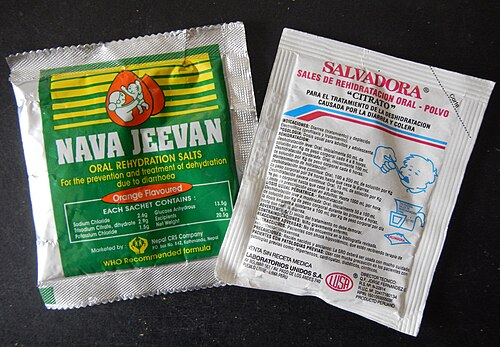

# AIDPI: MANEJO INTEGRADO DAS DOENÇAS PREVALENTES DA INFÂNCIA

O AIDPI não é apenas um conjunto de fluxogramas; é uma estratégia de saúde pública desenhada para reduzir a mortalidade infantil focando no que realmente mata as crianças. Se você tentar decorar as tabelas sem entender a lógica por trás delas, vai errar questões de caso clínico que trazem nuances. O segredo aqui é a sistematização: avaliar, classificar e tratar.

## O que é e por que existe o AIDPI?

A estratégia AIDPI (Atenção Integrada às Doenças Prevalentes na Infância) foi criada pela OMS e UNICEF, sendo adotada no Brasil pelo Ministério da Saúde. O objetivo é simples, mas ambicioso: tratar a criança como um todo, e não apenas a queixa principal.

Por que isso é importante? Porque, na prática, uma criança com diarreia pode estar também desnutrida ou com o esquema vacinal atrasado. Se o médico foca apenas no intestino, perde a chance de intervir em fatores que aumentam a mortalidade a longo prazo. No Brasil, o foco principal é em crianças de 2 meses a 5 anos, com um módulo específico para o lactente jovem (menor de 2 meses).

Lembre-se: a mortalidade infantil no Brasil tem componentes distintos. A mortalidade neonatal (0 a 27 dias) é a mais difícil de reduzir, pois depende de assistência ao parto e pré-natal. Já a mortalidade pós-neonatal (28 dias a 1 ano) e na faixa de 1 a 4 anos é fortemente influenciada por causas externas (acidentes e violência) e doenças infecciosas evitáveis, onde o AIDPI brilha.

## Sinais Gerais de Perigo: O "Stop" do Atendimento

Antes de perguntar sobre tosse ou febre, o AIDPI exige que você verifique os sinais gerais de perigo. Se qualquer um destes estiver presente, a criança é classificada na cor **Vermelha** (Urgência/Emergência).

Os quatro sinais que você deve ter na ponta da língua são:

- A criança não consegue beber ou mamar no peito?

- A criança vomita tudo o que ingere?

- A criança teve convulsões (durante esta doença)?

- A criança está letárgica ou inconsciente?

**Dica de Prova:** Se a questão mencionar que a criança está "sonolenta", mas acorda e interage, ela não está letárgica. Letargia no AIDPI é aquele estado em que a criança não foca o olhar ou não reage ao examinador de forma adequada. Se houver sinal de perigo, o tratamento é estabilização e referência urgente para o hospital.

## Avaliação Respiratória: Tosse ou Dificuldade para Respirar

Aqui o AIDPI simplifica a semiologia para ser eficaz na ponta do sistema. O foco é identificar pneumonia. O critério mestre é a **Frequência Respiratória (FR)**, que deve ser contada por um minuto inteiro com a criança calma.

| Idade | Frequência Respiratória de Corte (Taquipneia) |
| --- | --- |
| Menor de 2 meses | ≥ 60 irpm |
| 2 meses a 11 meses | ≥ 50 irpm |
| 12 meses a 5 anos | ≥ 40 irpm |

Por que esses valores? Porque a FR fisiológica diminui com a idade. Um erro comum em provas é a banca dar uma criança de 10 meses com FR de 45 e perguntar a classificação. Ela NÃO tem taquipneia.

### Classificação Respiratória:

- **Pneumonia Grave ou Doença Muito Grave (Vermelho):** Presença de qualquer sinal geral de perigo OU tiragem subcostal (retração da parede torácica inferior na inspiração) OU estridor em repouso. Conduta: Referência urgente, primeira dose de antibiótico IV/IM.

- **Pneumonia (Amarelo):** Apenas taquipneia para a idade. Conduta: Antibiótico oral (geralmente Amoxicilina) por 7 dias (ou 5 conforme protocolos mais recentes de algumas regiões) e orientar sinais de alerta.

- **Tosse ou Resfriado (Verde):** Sem sinais de pneumonia. Conduta: Medidas caseiras, como limpeza nasal com soro fisiológico e mel (se > 1 ano) para tosse.

**Pérola Clínica:** O estridor em repouso é sinal de obstrução de via aérea superior grave. Se a criança só faz estridor quando chora, a classificação muda. Fique atento ao "em repouso".

## Diarreia e Desidratação: Onde as Bancas Fazem a Festa

*Figura 1 - Paciente recebendo Soro de Reidratação Oral (SRO) sob supervisão. A TRO é a base do tratamento da desidratação no AIDPI. Fonte: CDC/Public Health Image Library, Domínio Público | Wikimedia Commons*

Este é, sem dúvida, o tema mais cobrado. O AIDPI avalia a diarreia sob dois prismas: o estado de hidratação e a duração/presença de sangue.

### Avaliação da Hidratação (Critérios OMS)

Você deve observar quatro sinais principais:

- Estado geral (alerta, irritado ou letárgico).

- Olhos (normais ou fundos).

- Sede (bebe normal, bebe avidamente ou não consegue beber).

- Sinal da prega (desaparece instantaneamente, lentamente ou muito lentamente - > 2 segundos).

| Classificação | Sinais Presentes | Conduta (Plano) |
| --- | --- | --- |
| **Desidratação Grave** | Pelo menos dois: Letárgico/Inconsciente, Olhos fundos, Não consegue beber, Sinal da prega > 2s. | **Plano C** (Hidratação Venosa) |
| **Desidratação** | Pelo menos dois: Irritado/Inquieto, Olhos fundos, Bebe avidamente/com sede, Sinal da prega lento. | **Plano B** (SRO na Unidade de Saúde) |
| **Sem Desidratação** | Não há sinais suficientes para as categorias acima. | **Plano A** (Tratamento Domiciliar) |

### Os Planos de Tratamento: O "Como Fazer"

**Plano A (Casa):** Regra dos 5 passos.

- Aumentar a oferta de líquidos (SRO após cada evacuação).

- Manter a alimentação (não suspender o leite materno!).

- Zinco por 10 a 14 dias (fundamental para reduzir a duração e a recorrência da diarreia nos próximos 3 meses).

- Orientar sinais de alerta (piora da diarreia, vômitos repetidos, sangue nas fezes, muita sede).

- Retorno se necessário.

**Plano B (Unidade de Saúde):** Uso da Terapia de Reidratação Oral (TRO).

*Figura 2 - Exemplos de sachês de Sais de Reidratação Oral (SRO) disponíveis comercialmente, do Nepal (esquerda) e do Peru (direita). A composição com osmolaridade reduzida é a recomendada pela OMS. Fonte: James Heilman, MD, CC BY-SA 4.0 | Wikimedia Commons*

- Dose: 50 a 100 mL/kg de SRO em um período de 4 horas.

- Não se usa colherinha; usa-se copo ou seringa. Se a criança vomitar, espera 10 minutos e reinicia mais lentamente.

- **Erro Clássico:** Achar que Soro Caseiro serve para o Plano B. O Soro Caseiro é apenas para o Plano A, para PREVENIR a desidratação. Uma vez desidratada, a criança precisa do SRO da OMS, que tem a osmolaridade e eletrólitos exatos.

**Plano C (Hospitalar/Urgência):** Hidratação Venosa.

- Fase de Expansão: 100 mL/kg de Ringer Lactato ou Soro Fisiológico 0,9%.

- Divisão: 30 mL/kg em 30-60 min (dependendo da idade) + 70 mL/kg em 2h30 a 5h.

- Reavaliar continuamente. Se a criança puder beber, inicie a TRO mesmo com o soro correndo.

### Diarreia Persistente e Disenteria

- **Diarreia Persistente:** Dura 14 dias ou mais. Se houver desidratação, é classificada como Grave (Vermelho).

- **Disenteria:** Diarreia com sangue. Segundo o AIDPI, toda criança com sangue nas fezes deve receber tratamento para **Shigella** (Ciprofloxacina é a primeira escolha). Não espere cultura!

## Febre: O Desafio do Diagnóstico Diferencial

No AIDPI, a avaliação da febre depende da epidemiologia local (risco de Malária ou Dengue). No contexto geral das provas brasileiras, focamos em sinais de gravidade e na duração.

- **Doença Febril Muito Grave:** Febre + qualquer sinal geral de perigo OU rigidez de nuca. Conduta: Antibiótico IM e referência (suspeita de meningite/sepse).

- **Febre - Provável Dengue:** Febre entre 2 e 7 dias + sinais como exantema, dores musculares, prova do laço positiva ou petéquias.

- **Cuidado com os AINEs:** Em suspeita de arboviroses (Dengue, Zika, Chikungunya), o uso de AINEs (Ibuprofeno, Diclofenaco, AAS) é contraindicado pelo risco de sangramento. Use Paracetamol ou Dipirona.

**Exemplo Clínico:** Lactente de 2 meses com febre de 38,5°C, sem outros sinais. No AIDPI, lactentes jovens com febre são sempre uma preocupação maior. Se houver qualquer dúvida sobre o estado geral, a classificação tende ao vermelho.

## Avaliação Nutricional e Desenvolvimento

O Dr. Will sempre reforça nas aulas do MedEvo: "Não olhe só para o peso, olhe para a curva". O AIDPI utiliza o peso para a idade e a pesquisa de edema.

- **Desnutrição Grave:** Peso para a idade muito baixo (abaixo do escore-z -3) OU presença de edema em ambos os pés (sinal de Kwashiorkor).

- **Anemia:** Identificada pela palidez palmar. Se for palidez palmar intensa, é Anemia Grave (Vermelho). Se for leve, trata-se com Ferro elementar e orientações nutricionais.

Sobre o desenvolvimento, o AIDPI foca em marcos motores e sociais. Um atraso no desenvolvimento exige investigação de causas orgânicas, estímulo domiciliar e reavaliação em 30 dias. Se houver ausência de marcos para a idade anterior, a referência é necessária.

## O Lactente Jovem (Menor de 2 meses)

Aqui as regras mudam um pouco. O recém-nascido e o lactente jovem são muito frágeis.

- **Infecção Bacteriana Local ou Doença Muito Grave:** No menor de 2 meses, não esperamos tiragem subcostal para classificar como grave. Se houver FR ≥ 60, batimento de asa de nariz, gemência ou febre/hipotermia, ele já é classificado como Doença Muito Grave.

- **Icterícia:** Se aparecer nas primeiras 24 horas de vida ou se atingir palmas e plantas (Zona de Kramer 5), é sempre grave.

- **Amamentação:** Deve-se observar a mamada. O posicionamento (corpo da criança voltado para a mãe, nariz na altura do mamilo) e a pega (boca bem aberta, lábio inferior invertido, mais aréola visível acima da boca) são os pontos avaliados.

## Violência e Acidentes: A Pediatria Social na Prova

Este tópico tem ganhado um peso enorme nas provas de Medicina Preventiva e Social. O médico da APS é a sentinela para identificar abusos.

### Sinais de Alerta para Maus-Tratos

- **Fraturas:** Fraturas espiraladas em diáfises de ossos longos (úmero/fêmur) em crianças que ainda não andam são altamente sugestivas de agressão física.

- **Lesões Orais:** Verrugas orais (HPV) em crianças sem pubarca são sinais fortes de abuso sexual.

- **Comportamento:** Queda no rendimento escolar, encoprese (perda de fezes) ou enurese (xixi na cama) secundárias podem indicar sofrimento psíquico por violência.

- **Síndrome de Munchausen por Procuração:** Quando o cuidador inventa ou causa sintomas na criança para obter atenção médica. Suspeite quando a história é bizarra ou os sintomas só ocorrem na presença do cuidador.

**Conduta Médica:** A notificação de suspeita de violência é **obrigatória** e imediata ao Conselho Tutelar (conforme o ECA). Não é necessário ter prova cabal; a suspeita basta. O acolhimento deve ser multidisciplinar.

### Prevenção de Acidentes (Injúrias Não Intencionais)

As causas externas são a principal causa de morte entre 1 e 4 anos no Brasil.

- **Transporte:**

- Bebê conforto: No banco de trás, virado para trás (até 1 ano ou 13 kg).

- Cadeirinha: 1 a 4 anos.

- Assento de elevação (booster): 4 a 7 anos e meio.

- Cinto de segurança: A partir de 1,45m de altura (geralmente entre 9 e 13 anos).

- **Queimaduras:** Cabos de panela para dentro e proibição de álcool líquido.

- **Sufocação:** Principal causa de morte acidental em < 1 ano (cuidado com objetos pequenos e posição de dormir - sempre de barriga para cima).

- **Intoxicações:** Nunca induzir vômito em caso de ingestão de cáusticos (soda cáustica, derivados de petróleo). A conduta é estabilização e, em alguns casos, diluição com água ou leite, mas nunca lavagem gástrica ou vômito pelo risco de nova lesão esofágica ou aspiração.

## Imunização e Prevenção

O AIDPI exige a verificação do cartão de vacina em toda consulta.

- **BCG:** Protege contra formas graves de Tuberculose (Miliar e Meníngea). Se o RN é filho de mãe bacilífera, a conduta é: NÃO vacinar ao nascer. Inicia-se a quimioprofilaxia primária (Isoniazida ou Rifampicina) por 3 meses, faz-se o teste tuberculínico (PPD). Se PPD negativo, vacina-se com BCG.

- **Atraso Vacinal:** É considerado um marcador de vulnerabilidade social.

## Pontos-Chave para Prova

- **FR de Corte:** < 2 meses (60), 2-11 meses (50), 1-5 anos (40). Memorize isso, é a questão mais fácil de acertar.

- **Plano B:** 50-100 mL/kg de SRO em 4 horas. Soro caseiro NÃO entra aqui.

- **Zinco na Diarreia:** 10-14 dias para todas as crianças com diarreia, independente do plano.

- **Disenteria:** Tratamento obrigatório para Shigella com Ciprofloxacina.

- **Sinal da Prega:** Se volta "muito lentamente" (> 2 segundos), indica desidratação grave (Plano C).

- **Maus-Tratos:** Notificação ao Conselho Tutelar é obrigatória na SUSPEITA. Não precisa de prova.

- **Cadeirinha:** Bebê conforto virado para trás até 1 ano ou 13 kg. É o que protege a coluna cervical em colisões.

- **Queimaduras:** NUNCA passe manteiga, pasta de dente ou gelo. Apenas água corrente em temperatura ambiente.

- **Mortalidade Infantil:** A queda mais acentuada no Brasil ocorreu no Nordeste, devido a melhorias no saneamento e Atenção Primária (ESF).

- **Causas Externas:** São a principal causa de óbito na faixa de 1 a 4 anos.

- **Sinais de Perigo:** Não mama, vomita tudo, convulsão, letargia. Presente? Classificação Vermelha.

- **Estridor em Repouso:** É sinal de gravidade (Pneumonia Grave/Doença Muito Grave).

- **Palidez Palmar:** Marcador de anemia no AIDPI. Intensa = Grave.

- **BCG e Mãe Bacilífera:** Profilaxia primeiro, vacina depois (se PPD negativo).

- **PNAISC:** Foca no cuidado integral, desde o pré-natal até os 9 anos, com eixos estratégicos para crianças vulneráveis (indígenas, quilombolas, em situação de rua).

- **Erro Comum:** Achar que toda pneumonia precisa de RX de tórax. No AIDPI, o diagnóstico é CLÍNICO (taquipneia). O RX fica para casos de falha terapêutica ou suspeita de complicações (derrame pleural).

- **Contraindicação Absoluta:** Não induzir vômito em ingestão de substâncias corrosivas/cáusticas.

- **Segurança:** Crianças < 10 anos sempre no banco traseiro (exceto se o carro só tiver banco dianteiro, com airbag desativado).

 Cópia offline para consulta pessoal.
 Fonte original:
 [https://www.medevo.com.br/material-apoio/ler/4b1e0f00-6796-4db0-9605-aa54062d1113](https://www.medevo.com.br/material-apoio/ler/4b1e0f00-6796-4db0-9605-aa54062d1113)
