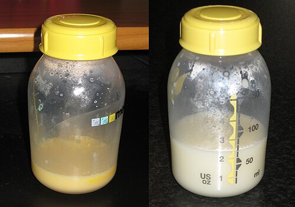
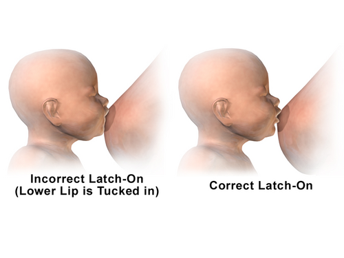

# ALEITAMENTO MATERNO

O aleitamento materno é tema recorrente em provas de Pediatria. Não se trata apenas de nutrição, mas de imunologia, endocrinologia e saúde pública. O conteúdo central envolve fisiologia da lactação, técnica de amamentação, avaliação do lactente, manejo de intercorrências e contraindicações absolutas, que são poucas e muito cobradas.

## Definições e Classificações da OMS e Ministério da Saúde

Antes de qualquer conduta, é necessário classificar o que o lactente está recebendo. As bancas frequentemente trocam "predominante" por "complementado".

- **Aleitamento Materno Exclusivo (AME):** A criança recebe somente leite materno, direto da mama ou ordenhado, e nenhum outro líquido ou sólido, com exceção de gotas ou xaropes contendo vitaminas, sais de reidratação oral, suplementos minerais ou medicamentos.

- **Aleitamento Materno Predominante:** O leite materno é a fonte principal, mas a criança recebe água ou bebidas à base de água (chás, sucos). Cuidado: isso não é recomendado, mas é uma classificação epidemiológica.

- **Aleitamento Materno Complementado:** A criança recebe leite materno e alimentos sólidos ou semissólidos. O objetivo aqui é complementar o leite, não substituí-lo.

- **Aleitamento Materno Misto ou Parcial:** A criança recebe leite materno e outros tipos de leite (fórmulas ou leite de vaca).

A recomendação oficial da OMS, do Ministério da Saúde e da SBP é clara: **AME até os 6 meses e aleitamento complementado até os 2 anos ou mais.**

## Fisiologia da Lactação: O Porquê do Sucesso ou do Fracasso

Para entender por que ocorre redução da produção láctea, é necessário compreender como o leite é produzido. A lactogênese ocorre em fases:

### Lactogênese I e II

A fase I ocorre na gestação, onde a glândula mamária se prepara sob influência da prolactina, mas o leite não "desce" porque os níveis altíssimos de progesterona placentária bloqueiam a ação da prolactina no receptor mamário.

**Ponto de prova:** a "apojadura" (lactogênese II) ocorre entre 24 e 72 horas pós-parto. O gatilho é a saída da placenta, com queda brusca da progesterona e liberação da ação da prolactina.

### O Papel da Prolactina e da Ocitocina

A distinção entre as funções é essencial:

- **Prolactina:** Produzida na hipófise anterior. Função: **Produção** do leite. O estímulo para sua liberação é a sucção do mamilo e o esvaziamento da mama. Se a mama não esvazia, o Fator de Inibição da Lactação (FIL) se acumula e avisa o cérebro para parar de produzir.

- **Ocitocina:** Produzida no hipotálamo e liberada pela hipófise posterior. Função: **Ejeção** do leite (contração das células mioepiteliais). O estímulo é emocional e sensorial (ver o bebê, ouvir o choro). O estresse e a dor inibem a ocitocina, o que explica por que mães ansiosas têm dificuldade na ejeção, embora a produção esteja normal.

## Composição do Leite Materno: O Padrão Ouro

O leite humano é vivo e dinâmico. Ele muda durante a mamada, durante o dia e conforme a idade do bebê.

### Colostro vs. Leite Maduro

*Figura 1 - Comparação visual entre colostro (à esquerda, amarelado e espesso) e leite maduro (à direita, mais branco e fluido). O colostro é rico em IgA secretória e proteínas, enquanto o leite maduro tem maior teor de gordura e lactose. Fonte: Tonicthebrown, CC BY 3.0 | Wikimedia Commons*
O **Colostro** (do 1º ao 5º dia) é amarelado e espesso. Ele é o "sonho" imunológico: rico em proteínas (especialmente anticorpos como IgA secretória) e eletrólitos, mas **pobre em gordura e lactose** quando comparado ao leite maduro. Ele funciona como uma primeira vacina e tem efeito laxativo para ajudar na eliminação do mecônio.

O **Leite Maduro** (após o 15º dia) tem mais gordura e lactose.

### Leite Anterior vs. Leite Posterior

Durante uma única mamada, a composição muda.

- **Leite Anterior:** Rico em água e anticorpos. Serve para hidratar.

- **Leite Posterior:** Rico em **gordura** (lipídios). É o que dá saciedade e faz o bebê ganhar peso.

**Cenário Clínico:** Se uma mãe troca o bebê de peito muito rápido (antes de esvaziar o primeiro), o bebê recebe muito leite anterior (lactose e água) e pouca gordura. Resultado: o bebê fica com fome logo, pode ter cólicas (pelo excesso de lactose) e não ganha peso adequadamente. A conduta é orientar o esvaziamento completo de uma mama antes de oferecer a outra.

### Comparação: Leite Humano vs. Leite de Vaca

Esta tabela cai em quase todas as provas de residência. Decore as diferenças:

| Componente | Leite Humano | Leite de Vaca | Por que importa? |
| --- | --- | --- | --- |
| Proteínas Totais | Menor quantidade | Muito maior (3x mais) | Excesso de proteína no leite de vaca causa sobrecarga renal. |
| Tipo de Proteína | Predomina Proteína do Soro (Alfa-lactoalbumina) | Predomina Caseína | A caseína forma um coalho pesado no estômago, dificultando a digestão. |
| Lactose | Maior quantidade | Menor quantidade | Lactose facilita absorção de cálcio e fornece energia para o cérebro. |
| Gorduras | Rico em DHA/ARA e Lipase | Pobre em ácidos graxos essenciais | A lipase do leite humano facilita a digestão das gorduras. |
| Eletrólitos (Na, K, Cl) | Menor quantidade | Muito maior | Leite de vaca causa alta carga soluta renal e risco de desidratação. |
| Ferro | Baixa quantidade, mas alta biodisponibilidade | Baixa quantidade e baixa biodisponibilidade | O ferro do leite humano é absorvido em 50%, o do leite de vaca em 10%. |

## Técnica de Amamentação: A Pega Correta

*Figura 2 - Comparação entre pega incorreta (esquerda: apenas mamilo na boca) e pega correta (direita: boca abrangendo boa parte da aréola, lábio inferior evertido). A pega inadequada é a principal causa de fissuras e dor ao amamentar. Fonte: BruceBlaus, CC BY-SA 4.0 | Wikimedia Commons*

Muitas questões de prova apresentam um caso de fissura mamária ou dor ao amamentar. A causa quase sempre é a **pega incorreta**.

**Sinais de Pega Adequada (Memorize isso):**

- Boca bem aberta (boca de peixe).

- Lábio inferior evertido (virado para fora).

- Aréola mais visível acima da boca do bebê do que abaixo (pega assimétrica).

- Queixo encostado na mama.

- Nariz livre ou apenas encostando levemente.

**Sinais de Posicionamento Adequado:**

- Rosto do bebê de frente para a mama.

- Corpo do bebê próximo e alinhado (cabeça e tronco no mesmo eixo).

- Bebê bem apoiado (mãe sustenta o bumbum, não só a cabeça).

Se a pega estiver errada, o bebê suga apenas o mamilo, causando dor e lesão (fissuras). Além disso, a sucção é ineficaz, o que leva ao baixo ganho de peso e à diminuição da produção de leite por falta de estímulo correto.

## Avaliação do Ganho de Peso e Eliminações

Um erro comum de alunos é achar que qualquer perda de peso no RN é patológica.

- **Perda de peso fisiológica:** O RN perde entre 7% a 10% do peso de nascimento nos primeiros dias de vida. Ele deve recuperar esse peso até o 10º ou 14º dia.

- **Ganho de peso esperado:** Após a fase inicial, esperamos um ganho médio de 20g a 30g por dia no primeiro mês.

**Ponto de prova:** se o bebê está em AME, tem bom ganho de peso, mas há queixa de choro frequente ou de "leite fraco", a conduta não é introduzir fórmula. Deve-se acolher, avaliar a técnica e reforçar que "leite fraco" não é diagnóstico.

**Eliminações:** Um bebê bem amamentado deve urinar várias vezes ao dia (6 ou mais após o 3º dia). As fezes do bebê em AME são amareladas, semilíquidas e podem ocorrer após cada mamada (reflexo gastrocólico) ou o bebê pode ficar vários dias sem evacuar (pseudoconstipação do lactente), desde que as fezes saiam pastosas e o bebê esteja bem. Isso ocorre porque o leite materno é tão bem absorvido que sobra pouco resíduo.

## Patologias da Mama no Puerpério

As bancas adoram diferenciar ingurgitamento, mastite e abscesso.

- **Ingurgitamento Mamário Fisiológico:** É a "apojadura". As mamas ficam cheias, mas o leite flui.

- **Ingurgitamento Patológico:** A mama está muito tensa, brilhante, edemaciada e o leite não flui. Pode haver febre. **Tratamento:** Ordenha de alívio da aréola (para amolecer e permitir a pega), compressas frias (para reduzir o edema) e mamadas frequentes. **Nunca** use compressa quente, pois aumenta a vasodilatação e piora o ingurgitamento.

- **Mastite:** Infecção do parênquima mamário (geralmente *Staphylococcus aureus*). Quadro: dor intensa, área de logose (calor, rubor, edema) localizada e sintomas sistêmicos (febre alta, prostração). **Tratamento:** Antibioticoterapia (Cefalexina) e, o mais importante, **NÃO interromper a amamentação**. O esvaziamento da mama é parte do tratamento.

- **Abscesso Mamário:** Complicação da mastite. Há flutuação à palpação. **Tratamento:** Drenagem cirúrgica + Antibiótico. A amamentação deve continuar na mama sadia. Na mama afetada, pode continuar se a incisão for longe da aréola e não houver saída de pus pelo mamilo.

## Contraindicações ao Aleitamento Materno

Este é um dos tópicos mais cobrados em questões. É essencial separar contraindicações absolutas, nas quais a amamentação não deve ocorrer, de contraindicações temporárias.

### Contraindicações Absolutas (Interrupção Permanente)

No Brasil, conforme o Ministério da Saúde:

- **Mãe infectada pelo HIV:** O risco de transmissão vertical pelo leite é de cerca de 15% a 20%.

- **Mãe infectada pelo HTLV-1 e HTLV-2:** Vírus associado a leucemias e neuropatias.

- **Criança com Galactosemia Clássica:** Erro inato do metabolismo onde o bebê não metaboliza a galactose (presente na lactose do leite materno).

**Atenção:** No caso de HIV e HTLV, a mãe tem direito a receber fórmula infantil gratuitamente pelo SUS até, pelo menos, os 6 meses de idade, e deve-se inibir a lactação (cabergolina é a droga de escolha).

### Contraindicações Temporárias (Interrupção por um período)

- **Herpes Simples:** Apenas se houver lesão ativa **na mama**. Se a lesão for em outro lugar, cobre-se a lesão e amamenta. Se for na mama, suspende-se daquele lado até a cicatrização.

- **Varicela:** Se a mãe apresentar vesículas 5 dias antes ou até 2 dias após o parto. Deve-se isolar a mãe do bebê até que as lesões virem crosta, mas o leite pode ser ordenhado e oferecido (se não houver lesão mamária).

- **Tuberculose Bacilífera:** A amamentação **NÃO** é contraindicada, mas a mãe deve usar máscara e não deve dormir com o bebê até completar 15 dias de tratamento. O bebê deve receber quimioprofilaxia primária.

- **Hepatite B:** Não contraindica. O bebê deve receber vacina e imunoglobulina nas primeiras 12 horas de vida.

- **Hepatite C:** Não contraindica, a menos que haja fissura mamária com sangramento (transmissão pelo sangue, não pelo leite).

- **Drogas e Medicamentos:** A maioria é compatível. Contraindicados: Amiodarona, sais de Ouro, quimioterápicos, radiofármacos, Bromocriptina (inibe a prolactina).

## Armazenamento do Leite Materno

Para a mãe que volta ao trabalho, a orientação deve ser precisa:

- **Frasco:** Vidro com tampa plástica, esterilizado (fervido por 15 min).

- **Validade (Regra do MS):**

- **Geladeira:** Até 12 horas.

- **Congelador/Freezer:** Até 15 dias.

- **Como oferecer:** Nunca usar mamadeira (risco de confusão de bicos). Oferecer em copinho ou colher. O leite deve ser aquecido em banho-maria fora do fogo (não ferver e não usar micro-ondas).

## Introdução Alimentar aos 6 Meses

Aos 6 meses, o leite materno sozinho já não supre as necessidades de ferro e zinco, e o bebê apresenta **sinais de prontidão**:

- Sustenta o tronco e a cabeça (senta com apoio).

- Perda do reflexo de extrusão da língua (não empurra a comida para fora).

- Demonstra interesse pelos alimentos.

- Consegue levar objetos à boca.

**Como introduzir:**

- Manter o leite materno em livre demanda.

- Introduzir "comida de verdade" (amassada com garfo, nunca batida no liquidificador ou peneirada).

- **Sucos:** Proibidos antes de 1 ano de idade (mesmo os naturais). Prefira a fruta in natura.

- **Água:** Deve ser oferecida assim que iniciar os sólidos.

## Iniciativa Hospital Amigo da Criança (IHAC)

As bancas amam os "10 Passos para o Sucesso da Amamentação". Não precisa decorar todos palavra por palavra, mas entenda a lógica:

- Ter uma norma escrita.

- Treinar a equipe.

- Informar as gestantes.

- **Ajudar a iniciar a amamentação na primeira meia hora após o parto (contato pele a pele).**

- Mostrar às mães como amamentar e manter a lactação mesmo separadas dos filhos.

- **Não dar ao RN nenhum outro alimento ou bebida além do leite materno, a menos que indicado.**

- Praticar o alojamento conjunto (mãe e bebê 24h juntos).

- Incentivar o aleitamento sob livre demanda.

- **Não dar bicos artificiais ou chupetas.**

- Encaminhar as mães a grupos de apoio na alta.

## Mitos e Dificuldades Comuns

### "Meu leite é fraco"

Não existe leite fraco. Mesmo mães desnutridas produzem leite com qualidade nutricional adequada, embora em menor volume. O que existe é técnica incorreta ou baixa frequência de mamadas.

### Confusão de Bicos

O uso de chupetas e mamadeiras altera a dinâmica muscular da face. Para mamar no peito, o bebê precisa "abocanhar" a aréola e fazer movimentos de ordenha. Na mamadeira, o leite cai por gravidade e o movimento é de "apertar" o bico. O bebê que usa bicos artificiais tende a morder o mamilo da mãe, causando dor e desmame precoce.

### O Pico de Crescimento

Por volta das 3 semanas, 6 semanas e 3 meses, o bebê pode pedir para mamar muito mais frequentemente por 2 ou 3 dias. Isso não é falta de leite; é o bebê "encomendando" mais produção para sua nova fase de crescimento. A orientação é manter a livre demanda.

## Pontos-Chave para Prova

- **Lactogênese II (Apojadura):** Gatilho é a queda da progesterona pós-parto.

- **Prolactina vs. Ocitocina:** Prolactina produz (hipófise anterior), Ocitocina ejeta (hipófise posterior).

- **Leite Humano vs. Vaca:** Leite humano tem menos proteína (predomina soro), menos eletrólitos e mais lactose.

- **Pega Correta:** Boca de peixe, lábio evertido, queixo no peito, aréola mais visível em cima.

- **HIV e HTLV 1/2:** Contraindicações ABSOLUTAS e PERMANENTES no Brasil.

- **Galactosemia:** Única contraindicação absoluta por parte do bebê.

- **Mastite:** NÃO suspender amamentação. Tratar com Cefalexina e esvaziamento.

- **Armazenamento:** 12 horas na geladeira, 15 dias no freezer.

- **Vitamina D:** 400 UI/dia desde o 1º dia de vida para todos.

- **Ferro:** 10-12,5 mg/dia dose fixa a partir dos 6 meses para bebês de termo AIG, em 2 ciclos de 3 meses (6-9m e 12-15m) — SBP 2026.

- **Perda de Peso:** Até 10% nos primeiros dias é fisiológico. Recupera em até 2 semanas.

- **Lipase:** Enzima do leite materno que facilita a digestão de gorduras (não é fator imunológico).

- **Tuberculose:** Mãe amamenta de máscara (após 15 dias de tratamento não precisa mais). Bebê faz quimioprofilaxia.

- **Hepatite B:** Amamentação liberada após vacina e imunoglobulina no RN.

- **Sucos:** Proibidos para menores de 1 ano (SBP/MS).

- **Confusão de Bicos:** Chupetas e mamadeiras são os maiores vilões do desmame precoce. 🍼

 Cópia offline para consulta pessoal.
 Fonte original:
 [https://www.medevo.com.br/material-apoio/ler/75493649-28f7-47ce-ab56-54d33bc4c873](https://www.medevo.com.br/material-apoio/ler/75493649-28f7-47ce-ab56-54d33bc4c873)
