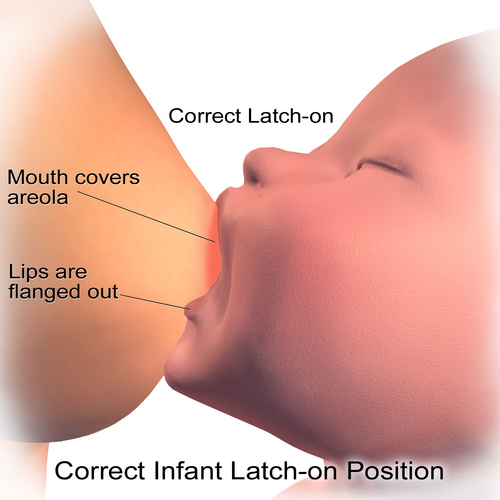

# ALEITAMENTO MATERNO NO PUERPÉRIO

Este material tem um recorte específico: **manejo do aleitamento no puerpério**, especialmente sala de parto, alojamento conjunto, primeiras 72 horas, alta hospitalar e intercorrências mamárias iniciais. O material geral de aleitamento aborda definições amplas, composição do leite e saúde pública; aqui, o foco é a conduta prática diante da puérpera e do recém-nascido nos primeiros dias.

Roteiro prático do puerpério

Sala de parto
 → contato pele a pele, primeira mamada, evitar separação desnecessária

0–24 horas
 → colostro em pequenos volumes, corrigir posição/pega, observar sonolência do RN

24–72 horas
 → apojadura, aumento do volume, risco de ingurgitamento e dor mamilar

Antes da alta
 → mamada observada, eliminações, perda ponderal, sinais de alerta e retorno

Após a alta
 → apoio precoce se dor, fissura, febre, baixa transferência ou ganho ponderal inadequado

A pergunta central no puerpério não é apenas “qual é a definição de aleitamento exclusivo?”, mas sim: **a dupla mãe–bebê está conseguindo transferir leite com segurança e sem dano mamilar?**

## Fisiologia da Lactação no Puerpério: Apojadura e Manutenção

A lactogênese, ou produção de leite, é dividida em fases. Durante a gestação, a glândula mamária se prepara sob influência do estrogênio (que estimula os ductos) e da progesterona (que estimula os alvéolos). No entanto, a mulher não produz leite em grandes volumes na gestação. Por que? Porque a progesterona é um potente inibidor da ação da prolactina nos receptores alveolares.

A lactogênese fase I ocorre na gestação, com a diferenciação das células alveolares. A lactogênese fase II, a famosa "apojadura" ou descida do leite, ocorre entre 24 a 72 horas após o parto. O gatilho para isso é a queda abrupta dos níveis de progesterona após a saída da placenta.

Ponto fisiológico importante: a apojadura não depende da sucção do bebê para começar, pois é desencadeada pela queda hormonal após a saída da placenta. No entanto, a manutenção da lactação (lactogênese fase III ou galactopoiese) depende do esvaziamento frequente da mama e do estímulo de sucção.

### O Binômio Hormonal: Prolactina e Ocitocina

No puerpério, é essencial distinguir claramente as funções:

- **Prolactina:** Produzida na hipófise anterior. Sua função é a PRODUÇÃO do leite. Ela aumenta com a sucção e é maior durante a noite.

- **Ocitocina:** Produzida no hipotálamo e liberada pela hipófise posterior. Sua função é a EJEÇÃO do leite (contração das células mioepiteliais). Ela é estimulada pelo contato pele a pele, pelo choro do bebê ou até pelo pensamento da mãe no filho. Por outro lado, o estresse e a dor podem inibir a ocitocina, dificultando a saída do leite, embora a produção continue.

## Composição do Leite Humano no Puerpério

O leite materno é espécie-específico. Se a questão comparar o leite humano com o leite de vaca, lembre-se: o leite humano tem MAIOR quantidade de lactose (carboidrato) e menor quantidade de proteínas e eletrólitos (o que sobrecarrega menos o rim imaturo do RN). Além disso, o leite materno também possui menos ferro, mas a sua biodisponibilidade é maior, ou seja, o bebê absorve melhor o ferro do leite humano, mesmo que o leite de vaca o possua em quantidades um pouco maiores. De maneira análoga, a principal proteína do leite de vaca, a caseína, tem uma absorção mais lenta.

### Fases do Leite

- **Colostro:** Produzido nos primeiros 3 a 5 dias. É um líquido amarelado, rico em proteínas e, principalmente, em fatores imunológicos como a IgA secretora. Ele tem menos gordura e menos lactose que o leite maduro. Pense no colostro como a "primeira vacina" do bebê.

- **Leite de Transição:** Entre o 6º e o 15º dia.

- **Leite Maduro:** Após o 15º dia.

### Leite Anterior vs. Leite Posterior

Esta é uma pegadinha clássica. O leite que sai no início da mamada (anterior) é rico em água e anticorpos, servindo para hidratar o bebê. O leite do final da mamada (posterior) é rico em gordura (lipídeos), sendo responsável pela saciedade e pelo ganho de peso. Se a mãe troca o bebê de peito muito rápido, ele só toma o leite anterior, fica com fome logo e não ganha peso adequadamente.

| Componente | Colostro | Leite Maduro | Leite de Vaca |
| --- | --- | --- | --- |
| Proteínas | Muito Alta (IgA) | Adequada | Muito Alta (sobrecarga renal) |
| Lactose | Menor | Alta | Menor |
| Gordura | Menor | Alta | Alta (mas difícil digestão) |
| Minerais | Altos | Baixos | Muito Altos |

## Técnica no Puerpério: Posição, Pega e Transferência de Leite

A maioria das complicações do puerpério, como fissuras, mastite e baixo ganho de peso, deriva de pega ou transferência inadequada. Por isso, a avaliação deve ser feita observando uma mamada real, e não apenas perguntando se o bebê está mamando.

### Sinais de pega adequada

- Boca bem aberta (boca de peixe).

- Lábio inferior evertido (virado para fora).

- Queixo tocando a mama.

- Aréola mais visível acima da boca do bebê do que abaixo (pega assimétrica).

- Narinas livres.

### Sinais de Posicionamento Adequado

- Rosto do bebê de frente para a mama (barriga com barriga).

- Corpo do bebê alinhado (cabeça e tronco no mesmo eixo).

- Bebê bem apoiado.

- Mãe relaxada.

Se a questão descreve uma mãe com dor e fissura, a conduta NUNCA é suspender o aleitamento ou usar pomadas milagrosas. A conduta é: **Observar a mamada e corrigir a pega.** O próprio leite materno deve ser passado na aréola após a mamada para auxiliar na cicatrização.

## Classificações do Aleitamento (OMS/Ministério da Saúde)

As bancas adoram confundir as definições. Seja preciso:

- **Aleitamento Materno Exclusivo (AME):** Apenas leite materno (direto da mama ou ordenhado). Pode receber gotas de vitaminas ou medicamentos. NÃO pode água, chá ou suco.

- **Aleitamento Materno Predominante:** Leite materno + água, chás ou sucos.

- **Aleitamento Materno Complementado:** Leite materno + alimentos sólidos ou semissólidos.

- **Aleitamento Materno Misto ou Parcial:** Leite materno + outros tipos de leite (fórmulas infantis).

A recomendação oficial é: AME até os 6 meses e complementado até os 2 anos ou mais.

## Contraindicações ao Aleitamento: Quando Dizer Não

Este é o tópico mais cobrado. No Brasil, as contraindicações absolutas são poucas, mas definitivas.

### Contraindicações Absolutas (Interrupção Definitiva)

- **HIV:** Risco de transmissão vertical pelo leite. No Brasil, com acesso a fórmulas, é proibido amamentar.

- **HTLV-1 e HTLV-2:** Vírus linfotrópicos com alto risco de transmissão e patologias graves.

- **Galactosemia Clássica (no bebê):** O bebê não metaboliza a galactose. É uma doença metabólica grave.

- **Psicose Puerperal:** Pelo risco de dano ao RN (contraindicação relativa ao ato, mas absoluta se houver risco de vida).

- **Uso de drogas ilícitas:** Especialmente cocaína e crack.

### Contraindicações Temporárias (Interrupção Momentânea)

- **Herpes Simples:** Apenas se houver lesão ativa NA MAMA. Se a lesão for em outro lugar, cobre-se a lesão e amamenta na outra mama.

- **Varicela:** Se a mãe apresentar vesículas 5 dias antes até 2 dias após o parto. O bebê deve ser isolado da mãe e receber imunoglobulina específica (VZIG).

- **Doença de Chagas:** Apenas na fase aguda da doença ou se houver sangramento mamilar (presença de tripomastigotas no leite).

- **Abscesso Mamário:** Suspende-se a amamentação APENAS na mama afetada até que seja drenado e iniciado o tratamento. A mama sadia continua normalmente.

### Situações que NÃO contraindicam

- **Hepatite B:** O RN deve receber vacina e imunoglobulina nas primeiras 12 horas. A amamentação é permitida.

- **Hepatite C:** Permitida, exceto se houver fissura mamilar com sangramento.

- **Tuberculose:** A mãe bacilífera deve amamentar usando máscara N95. O RN deve receber quimioprofilaxia primária (Isoniazida ou Rifampicina) e a vacina BCG é ADIADA até o fim da profilaxia (geralmente 3 meses).

- **Hanseníase:** Não contraindica, desde que a mãe esteja em tratamento.

- **Dengue/Zika:** Não contraindicam.

| Doença | Conduta na Amamentação |
| --- | --- |
| HIV / HTLV | Contraindicação Absoluta |
| Hepatite B | Permitida (fazer Vacina + IG no RN) |
| Hepatite C | Permitida (cuidado com sangue) |
| Tuberculose | Permitida (Mãe com máscara N95) |
| Galactosemia | Contraindicação Absoluta (Bebê) |
| Fenilcetonúria | Permitida (Mista/Controlada) |

## Intercorrências Mamárias no Puerpério

### 1. Ingurgitamento Mamário (Leite Empedrado)

Ocorre geralmente na apojadura. A mama fica distendida, brilhante, dolorosa e pode haver febre (febre do leite).

- **Causa:** Retenção de leite por esvaziamento incompleto ou excesso de produção.

- **Manejo:** Ordenha manual da aréola ANTES da mamada (para amaciar a aréola e facilitar a pega), amamentação em livre demanda e compressas FRIAS (para vasoconstrição e redução do edema). Nunca use compressas quentes, pois aumentam a vasodilatação e pioram o ingurgitamento.

### 2. Fissuras Mamilares

- **Causa:** Pega incorreta.

- **Manejo:** Corrigir a técnica. Passar o próprio leite na lesão. Exposição solar moderada. Não usar sabonetes ou álcool nos mamilos.

### 3. Mastite Puerperal

*Figura 1 - Mama com sinais de mastite puerperal: área de flogose (calor, rubor e edema) em um quadrante, com sinais sistêmicos associados. O esvaziamento da mama é parte fundamental do tratamento. Fonte: XXXANONXXX3245, CC BY-SA 4.0 | Wikimedia Commons*

É um processo inflamatório, podendo ou não ser infeccioso (geralmente *Staphylococcus aureus*).

- **Quadro Clínico:** Flogose (dor, calor, rubor, edema) em um quadrante da mama, associado a sintomas sistêmicos (febre alta, calafrios, mal-estar).

- **Manejo:** **NÃO SUSPENDER A AMAMENTAÇÃO.** O esvaziamento da mama é parte do tratamento. Se a dor for insuportável, ordenha-se.

- **Tratamento:** Antibioticoterapia (Cefalexina ou Amoxicilina com Clavulanato por 10 a 14 dias) e analgesia (Ibuprofeno/Paracetamol).

### 4. Abscesso Mamário

Complicação de uma mastite não tratada ou mal manejada.

- **Diagnóstico:** Flutuação ao exame físico.

- **Manejo:** Drenagem cirúrgica ou punção por agulha grossa. Manter amamentação na mama contralateral. Na mama afetada, suspender apenas se a drenagem for muito próxima à aréola, mas manter a ordenha para evitar novo ingurgitamento.

## Farmacologia e Amamentação

A regra geral é: a maioria dos medicamentos é compatível. No entanto, as bancas focam nas exceções.

- **Contraindicados:** Amiodarona (risco tireoidiano no bebê), sais de Lítio (toxicidade neurológica), Quimioterápicos, Radioisótopos, Ganciclovir, Cloranfenicol.

- **Uso com cautela:** Benzodiazepínicos (podem causar sedação no RN).

- **Seguros:** Paracetamol, Ibuprofeno, Penicilinas, Cefalosporinas, Insulina, Anti-hipertensivos (Metildopa, Hidralazina, Enalapril).

Cuidado com a **Bromocriptina ou Cabergolina**: são agonistas dopaminérgicos usados para INIBIR a lactação (ex: em mães HIV positivas ou após óbito fetal). Elas suprimem a prolactina.

## Situações especiais no puerpério e orientação de alta

### Perda de Peso Fisiológica

É normal o RN perder até 10% do peso nos primeiros dias de vida devido à perda de fluidos e baixa ingestão de colostro. O peso deve ser recuperado em até 10 a 14 dias. Se a perda for >10%, investigue a técnica de amamentação antes de pensar em fórmula.

### Icterícia e Amamentação

Existem dois tipos relacionados ao peito:

- **Icterícia do Aleitamento Materno:** Ocorre na primeira semana. Causa: o bebê está mamando POUCO. Isso aumenta a circulação êntero-hepática da bilirrubina. Conduta: Aumentar a frequência das mamadas.

- **Icterícia pelo Leite Materno:** Ocorre após a primeira semana. Causa: substâncias no leite materno que interferem na conjugação da bilirrubina. Conduta: Geralmente observação. Raramente suspende-se o leite por 24-48h (apenas se níveis muito altos).

### Armazenamento do Leite

- Geladeira: Até 12 horas.

- Freezer/Congelador: Até 15 dias.

- Descongelamento: Em banho-maria com fogo desligado. NUNCA no micro-ondas (destrói proteínas e anticorpos).

### Checklist antes da alta

Antes da alta da maternidade, a equipe deve confirmar:

- Pelo menos uma mamada observada com pega eficaz.

- Puérpera orientada sobre livre demanda e sinais de fome/saciedade.

- Diurese e evacuações compatíveis com idade do RN.

- Perda ponderal interpretada no contexto clínico.

- Ausência de fissura importante, dor incapacitante ou ingurgitamento intenso sem manejo.

- Orientação de retorno precoce se febre materna, mama hiperemiada dolorosa, RN sonolento, pouca diurese, icterícia intensa ou perda de peso excessiva.

### O Uso de Chupetas e Mamadeiras

A "confusão de bicos" é um termo técnico real. O mecanismo de sucção na mamadeira é diferente do peito. O uso de bicos artificiais leva ao desmame precoce e deve ser desencorajado.

## Pontos-chave

- **HIV e HTLV-1/2:** Contraindicações ABSOLUTAS e definitivas à amamentação no Brasil.

- **Galactosemia:** Única contraindicação absoluta por parte do recém-nascido.

- **Mastite:** A conduta principal é MANTER o aleitamento e esvaziar a mama, além do antibiótico (Cefalexina).

- **Pega Correta:** Boca de peixe, lábio evertido, queixo no peito e mais aréola visível acima.

- **Hormônios:** Prolactina produz (anterior), Ocitocina ejeta (posterior). Progesterona inibe a lactogênese na gestação.

- **Tuberculose:** Mãe amamenta de máscara N95. RN faz profilaxia e adia BCG.

- **Hepatite B:** Não contraindica. RN recebe vacina e IG nas primeiras 12h.

- **Apojadura:** Ocorre por queda da progesterona, independente da sucção inicial.

- **Leite Posterior:** Rico em gordura, garante saciedade e ganho de peso.

- **Ingurgitamento:** Compressas FRIAS e ordenha de alívio da aréola.

- **Medicamentos:** Amiodarona e Lítio são contraindicados.

- **Fenilcetonúria:** Permite aleitamento misto controlado (leite materno tem menos fenilalanina que o de vaca).

- **Febre Amarela:** Se a mãe for vacinada, suspender amamentação por 14 dias (risco de encefalite no bebê pelo vírus vacinal).

- **Pérola de Prova:** O leite humano tem mais lactose que o leite de vaca, mas o de vaca tem muito mais proteína (caseína), o que é inadequado para o bebê.

- **Inibição da Lactação:** Indicada em óbito fetal ou mães HIV+. Usa-se Cabergolina 1mg (dose única) ou enfaixamento das mamas (menos usado hoje).

- **Vínculo:** O contato pele a pele na primeira hora de vida (hora de ouro) é o maior preditor de sucesso na amamentação a longo prazo.

 Cópia offline para consulta pessoal.
 Fonte original:
 [https://www.medevo.com.br/material-apoio/ler/d75ee877-6770-4d3b-9add-0c17cace22d2](https://www.medevo.com.br/material-apoio/ler/d75ee877-6770-4d3b-9add-0c17cace22d2)
