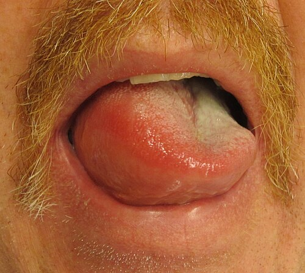
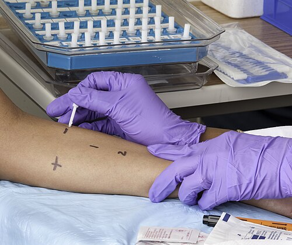

# ALERGIA À PROTEÍNA DO LEITE DE VACA: FENÓTIPO IGE E NÃO IGE

Para começar nossa conversa, preciso que você esqueça aquela confusão comum que os pais (e muitos médicos) fazem no consultório. Alergia à Proteína do Leite de Vaca (APLV) não tem nada a ver com Intolerância à Lactose. Enquanto a intolerância é um problema bioquímico, de falta de enzima (lactase) para quebrar um açúcar (lactose), a APLV é um erro do sistema imunológico que decide atacar uma proteína (caseína, alfa-lactoalbumina ou beta-lactoglobulina).

Se você entender essa base, já mata metade das questões de prova que tentam te confundir oferecendo "leite sem lactose" para um bebê com sangue nas fezes. Spoiler: não vai funcionar, porque o problema é a proteína.

## Fisiopatologia: O Porquê da Diferença entre IgE e Não IgE

A classificação da APLV em fenótipos não é apenas teórica, ela dita o tempo de reação e o tipo de sintoma. O sistema imune pode errar de duas formas principais.

Na **APLV IgE Mediada**, o corpo produz anticorpos IgE específicos contra a proteína do leite. Esses anticorpos ficam "sentados" nos mastócitos. Quando o bebê ingere o leite, a proteína se liga à IgE, o mastócito explode (degranula) e libera histamina. Por isso a reação é imediata, ocorre em minutos ou até duas horas após o contato.

Já na **APLV Não IgE Mediada**, o mecanismo é celular. São os linfócitos T e outras células que geram uma inflamação tardia, geralmente no trato gastrointestinal. Aqui não tem histamina voando rápido, então os sintomas demoram horas ou dias para aparecer. É por isso que o diagnóstico aqui é muito mais clínico e difícil, pois não existe um exame de sangue (IgE) ou teste de pele (Prick Test) que ajude. Se a prova te der um caso de proctocolite com IgE negativa, não exclua APLV. Pelo contrário, isso confirma o fenótipo Não IgE.

Existe ainda o fenótipo **Misto**, onde temos os dois mecanismos agindo, como acontece na Dermatite Atópica grave e na Esofagite Eosinofílica.

## Fenótipo IgE Mediado: A Reação Imediata

*Figura 1 - Angioedema de língua em reação alérgica IgE-mediada. O angioedema (edema de mucosas e tecido subcutâneo profundo) é uma manifestação clássica da APLV IgE-mediada, que ocorre minutos a horas após exposição à proteína do leite de vaca. Fonte: James Heilman, MD, CC BY-SA 3.0 | Wikimedia Commons*

Este é o quadro que assusta a família. O bebê toma a fórmula ou tem contato com o leite e, em menos de duas horas, apresenta o quadro clínico clássico.

### Manifestações Clínicas

As manifestações são predominantemente cutâneas e respiratórias, podendo evoluir para sistêmicas:

- **Urticária e Angioedema:** Placas eritematosas, pruriginosas e inchaço (lábios e pálpebras).

- **Sintomas Gastrointestinais Imediatos:** Vômitos em jato logo após a ingestão, diarreia aguda.

- **Sintomas Respiratórios:** Coriza, sibilância (chiado no peito) e tosse. Cuidado: sibilância isolada raramente é APLV, mas se vier acompanhada de sintomas cutâneos após o leite, acenda o alerta.

- **Anafilaxia:** A forma mais grave. Envolve dois ou mais sistemas ou hipotensão/choque.

### Diagnóstico no Fenótipo IgE

Aqui os exames ajudam. Podemos solicitar o **Teste de Contato (Prick Test)** ou a **IgE específica sérica** (antigamente chamada de RAST).

Um erro comum que o Dr. Will sempre aponta nas discussões de caso: um exame positivo (IgE alta) isolado NÃO faz diagnóstico de alergia. Ele indica sensibilização. Para ser alergia, precisa ter o exame positivo MAIS o sintoma clínico. Se o bebê tem IgE alta para leite, mas toma leite e não sente nada, ele não é alérgico.

## Fenótipo Não IgE Mediado: O Desafio Gastrointestinal

Este é o "queridinho" das bancas de pediatria, especialmente a Proctocolite Alérgica e a FPIES. Como o mecanismo é celular, os exames de IgE virão negativos. O diagnóstico é clínico: exclusão da proteína seguida de Teste de Provocação Oral (TPO).

### Proctocolite Alérgica Induzida por Proteína Alimentar (PAIPA)

É a causa mais comum de sangue nas fezes em lactentes jovens, muitas vezes em aleitamento materno exclusivo.

- **O cenário de prova:** Lactente de 2 a 8 semanas, com excelente estado geral, ganhando peso bem, mas que apresenta estrias de sangue e muco nas fezes.

- **O "Pulo do Gato":** O bebê está bem! Se o bebê tiver sangue nas fezes mas estiver toxemiado, pense em invaginação intestinal ou enterocolite necrotizante. Na proctocolite, o bebê é o "alérgico feliz".

### Enterocolite Induzida por Proteína Alimentar (FPIES)

Essa é a forma grave do fenótipo não IgE. Muita gente confunde com sepse ou gastroenterite viral grave.

- **Quadro Clínico:** Vômitos profusos e repetitivos que começam 1 a 4 horas após a ingestão da proteína, levando a palidez extrema, letargia e desidratação. Pode haver diarreia tardia (após 5 a 10 horas).

- **Dica de Prova:** A criança chega ao pronto-socorro parecendo que está em choque séptico, mas não tem febre e o quadro reverte rapidamente com hidratação venosa. O principal gatilho é o leite de vaca, mas soja e arroz também são causas comuns de FPIES.

### Enteropatia Induzida por Proteína Alimentar

Aqui a inflamação é no intestino delgado, causando má absorção.

- **Sintomas:** Diarreia crônica, esteatorreia (fezes gordurosas) e, o mais importante, **baixo ganho pondero-estatural** (falha de crescimento). Pode haver hipoalbuminemia e edema por perda proteica.

- **Diferencial:** Lembra muito a Doença Celíaca, mas ocorre em lactentes muito jovens que ainda nem comeram glúten, apenas leite de vaca.

## Tabela Comparativa: Fenótipos de APLV

| Característica | IgE Mediada | Não IgE Mediada |
| --- | --- | --- |
| **Tempo de Reação** | Imediata (minutos a 2h) | Tardia (horas a dias) |
| **Mecanismo** | Anticorpos IgE / Mastócitos | Células T / Inflamação tecidual |
| **Principais Sintomas** | Urticária, angioedema, anafilaxia | Sangue nas fezes, vômitos tardios, falha de crescimento |
| **Diagnóstico** | História + IgE/Prick Test + TPO | História + Exclusão + TPO (IgE é negativa) |
| **Exemplos Clínicos** | Urticária aguda, Choque anafilático | Proctocolite, FPIES, Enteropatia |
| **Risco de Anafilaxia** | Alto | Baixo (exceto desidratação na FPIES) |

## Diagnóstico: O Padrão-Ouro é o TPO

Não importa o que a alternativa diga, o padrão-ouro para o diagnóstico de APLV (tanto IgE quanto Não IgE) é o **Teste de Provocação Oral (TPO)**.

O fluxograma que você deve ter na cabeça para a prova é:

- **Suspeita Clínica:** Bebê com sintomas compatíveis.

- **Dieta de Exclusão:** Retiramos a proteína do leite de vaca da dieta do bebê (se usa fórmula) ou da mãe (se está em aleitamento materno).

- **Período de Observação:** Geralmente 2 a 4 semanas. Se for FPIES ou anafilaxia, os sintomas somem rápido. Se for proctocolite ou dermatite, pode demorar um pouco mais.

- **O TPO (O momento da verdade):** Se os sintomas melhoraram na exclusão, precisamos reintroduzir o leite para confirmar. Se os sintomas voltarem, diagnóstico confirmado. Se não voltarem, foi apenas uma coincidência (como uma gastroenterite viral passageira) e o bebê não tem APLV.

**Cuidado:** Se o bebê teve uma reação anafilática confirmada e tem IgE positiva, o TPO é contraindicado pelo risco de morte. Nesses casos, o diagnóstico já está fechado.

## Diagnóstico Diferencial: Onde os Alunos Erram

As bancas adoram colocar "pegadinhas" com diagnósticos que mimetizam a APLV. No MedEvo, sempre reforçamos que você deve olhar para o estado geral da criança.

- **Intolerância à Lactose Secundária:** Após uma gastroenterite viral, as vilosidades intestinais são lesadas e a lactase (que fica na ponta da vilosidade) some temporariamente. O bebê tem diarreia explosiva, ácida, com muita assadura e gases. Tratamento? Dieta sem lactose por tempo limitado (2 a 4 semanas), não exclusão de proteína.

- **Reflexo Gastrocólico:** RN que mama e evacua em seguida. Se as fezes forem normais e o ganho de peso estiver bom, isso é fisiológico, não é alergia.

- **Fissura Anal:** Causa comum de sangue vivo nas fezes. Mas aqui o sangue está "por fora" das fezes, o bebê costuma ter constipação e, ao examinar o ânus, você vê a lesão. Na APLV, o sangue está misturado às fezes ou vem com muco.

- **Invaginação Intestinal:** Emergência cirúrgica. Dor abdominal paroxística (o bebê chora desesperado e depois para), vômitos e as famosas fezes em "geleia de framboesa" (sangue com muco escuro). O estado geral é ruim.

## Tratamento: A Dieta de Exclusão

O tratamento da APLV é a exclusão total da proteína do leite de vaca. Mas como fazer isso depende de como esse bebê se alimenta.

### Lactente em Aleitamento Materno Exclusivo (AME)

**NUNCA suspenda o aleitamento materno.** A conduta é a dieta de exclusão para a mãe. Ela deve parar de comer leite e derivados.

- **Dica de Ouro:** Muitas vezes a soja também precisa ser retirada da dieta materna, pois existe uma taxa de reatividade cruzada (cerca de 10 a 40% nos casos não IgE).

- Se a mãe faz a dieta certinha por 2 a 4 semanas e o bebê não melhora, aí sim pensamos em outras alergias ou em fórmulas especiais, mas isso é exceção.

### Lactente em Uso de Fórmula

Se o bebê já usa fórmula comum, precisamos trocar por uma fórmula especial. Aqui a banca vai testar se você sabe a hierarquia das fórmulas.

- **Fórmulas Extensamente Hidrolisadas (FeH):** São a primeira escolha para a maioria dos casos. A proteína é "quebrada" em pedaços tão pequenos que o sistema imune não a reconhece.

- **Fórmulas de Aminoácidos (AA):** São a "artilharia pesada". Aqui não há proteína, apenas os tijolinhos (aminoácidos) soltos.

- **Quando usar AA direto?** Casos graves: anafilaxia, FPIES, falha de crescimento importante (enteropatia), ou se o bebê não melhorou com a FeH após 2 semanas.

- **Fórmula de Soja:** Só pode ser usada em bebês **acima de 6 meses** e apenas no fenótipo **IgE mediado**. Nunca use soja para proctocolite ou FPIES em lactentes jovens, pois o risco de alergia cruzada é altíssimo.

- **Leite de outros mamíferos (Cabra, Ovelha):** Proibidos. A proteína é muito parecida com a do leite de vaca e a reação cruzada é de quase 100%.

## Tabela de Escolha de Fórmulas

| Situação Clínica | Conduta de Primeira Escolha |
| --- | --- |
| APLV Leve a Moderada (Proctocolite) | Fórmula Extensamente Hidrolisada |
| APLV Grave (Anafilaxia, FPIES, Enteropatia) | Fórmula de Aminoácidos |
| Falha com Extensamente Hidrolisada | Migrar para Aminoácidos |
| Lactente > 6 meses, IgE mediado, sem sintomas GI | Pode-se considerar Soja (custo menor) |
| Lactente em Aleitamento Materno | Manter AM + Dieta de Exclusão Materna |

## Situações Especiais e Complicações

### Deficiência de Vitamina K e Coagulopatia

Bebês com diarreia crônica ou má absorção por APLV (fenótipo enteropatia) podem ter deficiência de vitaminas lipossolúveis. A falta de Vitamina K pode levar a sangramentos. Se a prova mostrar um bebê com APLV e tempo de protrombina (TP) alargado, a causa é a má absorção de Vitamina K.

### Hipoalbuminemia e Edema

Na Enteropatia por Proteína Alimentar, a inflamação intestinal é tão intensa que o bebê perde proteína para o lúmen do intestino (enteropatia perdedora de proteína). O resultado é edema bilateral, ascite e hipoalbuminemia grave. Isso pode ser confundido com desnutrição tipo Kwashiorkor, mas a causa base é a alergia.

### A Questão da Lactose na APLV

Muitas fórmulas extensamente hidrolisadas contêm lactose. Isso é um problema? Geralmente não. A lactose ajuda na absorção de cálcio e na microbiota intestinal. Só retiramos a lactose se o bebê estiver com uma intolerância secundária importante (diarreia explosiva e assaduras), mas a alergia em si é à proteína.

## Prognóstico e Reintrodução

A boa notícia para os pais é que a APLV na infância costuma ser transitória.

- **Fenótipo Não IgE (Proctocolite):** Geralmente resolve-se entre 12 e 18 meses de idade.

- **Fenótipo IgE Mediado:** Pode durar mais tempo, mas a maioria tolera o leite até a idade escolar.

A recomendação das diretrizes brasileiras (SBP e ASBAI) é manter a dieta de exclusão por pelo menos 6 a 12 meses (ou até o bebê completar 1 ano). Após esse período, realizamos um novo TPO para verificar se a criança já adquiriu tolerância. Se o TPO for negativo, o leite é reintroduzido gradualmente.

## Pontos-Chave para Prova

- **APLV vs. Intolerância:** APLV é reação à proteína (imunológico); Intolerância é reação ao açúcar/lactose (enzimático).

- **Padrão-Ouro Diagnóstico:** Teste de Provocação Oral (TPO). Exames de IgE e Prick Test só servem para o fenótipo IgE mediado.

- **Proctocolite Alérgica:** Bebê que está bem, ganha peso, mas tem sangue nas fezes. Fenótipo Não IgE. Conduta: Dieta de exclusão materna (se AM) ou fórmula extensamente hidrolisada.

- **FPIES:** Vômitos profusos, palidez e letargia 1 a 4 horas após o leite. Parece sepse, mas é alergia Não IgE. Tratamento agudo é hidratação venosa.

- **Primeira Escolha de Fórmula:** Extensamente Hidrolisada.

- **Indicações de Aminoácidos:** Anafilaxia, FPIES, falha de crescimento grave ou falha da extensamente hidrolisada.

- **Fórmula de Soja:** Apenas para > 6 meses e fenótipo IgE mediado. Contraindicada em casos gastrointestinais (Não IgE).

- **Leite de Cabra:** Nunca é opção para APLV devido à alta reação cruzada.

- **Aleitamento Materno:** Sempre deve ser mantido. A mãe faz a dieta de exclusão.

- **Duração da Dieta:** Geralmente 6 a 12 meses antes de tentar o primeiro TPO de reintrodução.

- **Sinal de Alarme:** Sangue nas fezes + perda de peso + vômitos = pensar em Enteropatia ou formas mais graves de APLV.

- **Diagnóstico Diferencial Clássico:** Gastroenterite viral causando intolerância transitória à lactose (fezes explosivas e ácidas, sem sangue).

- **O que NÃO fazer:** Não pedir IgE para suspeita de proctocolite (vai vir negativa e não exclui nada). Não prescrever leite sem lactose para tratar APLV.

- **Invaginação Intestinal:** Principal diferencial de sangramento retal agudo com dor abdominal e estado geral comprometido (fezes em geleia de framboesa). 🍼

Ao seguir esse raciocínio clínico, você deixa de apenas decorar fórmulas e passa a entender a jornada do paciente. Lembre-se do que sempre discutimos no MedEvo: a clínica soberana aliada ao mecanismo fisiopatológico é o que garante o acerto na questão difícil.

 Cópia offline para consulta pessoal.
 Fonte original:
 [https://www.medevo.com.br/material-apoio/ler/7aa4f0f2-83f5-489b-8965-188b4c1c7fb5](https://www.medevo.com.br/material-apoio/ler/7aa4f0f2-83f5-489b-8965-188b4c1c7fb5)
