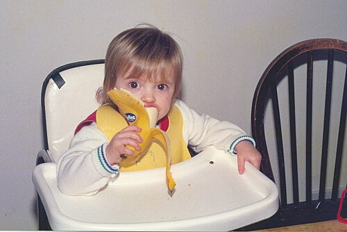
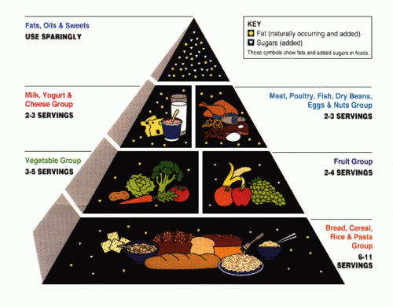

# ALIMENTAÇÃO COMPLEMENTAR

A alimentação complementar é um dos temas mais "quentes" em provas de residência médica e no dia a dia do consultório de pediatria. Por que? Porque é aqui que formamos o hábito alimentar da criança e prevenimos doenças que o adulto terá daqui a 40 anos.

Para a prova, você precisa entender que a transição do leite materno para os alimentos sólidos não é apenas uma mudança de cardápio, mas um marco do desenvolvimento neuropsicomotor e fisiológico.

## Definição e o Momento Certo

A Organização Mundial da Saúde (OMS), o Ministério da Saúde (MS) e a Sociedade Brasileira de Pediatria (SBP) são unânimes: o Aleitamento Materno Exclusivo (AME) deve ocorrer até os 6 meses de vida.

Alimentação complementar é definida como a oferta de qualquer alimento, líquido ou sólido, que não seja o leite materno, introduzida para preencher a lacuna nutricional que surge quando o leite materno sozinho já não supre todas as necessidades da criança.

### Por que exatamente aos 6 meses?

Muitos alunos erram questões por não entenderem a fisiologia por trás do número "6". Não é uma data arbitrária. A introdução aos 6 meses baseia-se em três pilares:

- **Maturidade Renal:** Antes dos 6 meses, a capacidade de filtração glomerular e a concentração urinária são limitadas. O rim do lactente jovem não lida bem com a carga de solutos (proteínas e eletrólitos) de uma dieta sólida.

- **Maturidade Gastrointestinal:** Aos 6 meses, há um aumento da produção de enzimas digestivas (como a amilase pancreática) e uma diminuição da permeabilidade intestinal a macromoléculas, o que reduz o risco de sensibilização alérgica.

- **Desenvolvimento Neuropsicomotor:** É aqui que surgem os chamados "sinais de prontidão".

### Sinais de Prontidão

*Figura 1 - Bebê explorando alimentação complementar com fruta in natura (banana), demonstrando coordenação mão-boca e interesse pelo alimento, sinais de prontidão para a introdução alimentar. A oferta da fruta inteira estimula a autonomia e o desenvolvimento motor orofacial. Fonte: Andy/Andrew Fogg, CC BY 2.0 | Wikimedia Commons*

A banca pode descrever um bebê de 5 meses e perguntar se já pode iniciar a papinha. Se ele não tiver os sinais abaixo, a resposta é NÃO.

- **Desaparecimento do reflexo de extrusão da língua:** O bebê para de empurrar tudo o que entra na boca para fora.

- **Sustentação do tronco e pescoço:** Ele consegue ficar sentado com o mínimo de apoio (essencial para evitar engasgos).

- **Interesse pelos alimentos:** O bebê observa os pais comendo e tenta alcançar a comida.

- **Coordenação mão-boca:** Ele consegue levar objetos à boca voluntariamente.

**Dica de Prova:** Se a questão trouxer um prematuro, a introdução alimentar deve considerar a **idade corrigida**. Um bebê nascido de 28 semanas que hoje tem 6 meses cronológicos, na verdade tem apenas cerca de 3 meses de idade corrigida. Ele ainda não está pronto!

## O Esquema de Introdução Passo a Passo

Esqueça as tabelas complexas de antigamente. A recomendação atual da SBP (2024) e do Guia do MS (2019) é simplificada e foca na variedade.

### Aos 6 meses: O Início

Ao completar 6 meses, o bebê deve manter o aleitamento materno sob livre demanda e iniciar:

- **Duas refeições de frutas:** Uma pela manhã e outra à tarde.

- **Uma refeição principal (almoço):** Chamada tecnicamente de "papa principal".

### Aos 7 meses: A Evolução

Mantém-se o aleitamento e as frutas, e introduz-se a **segunda refeição principal (jantar)**.

**Cuidado:** Um erro clássico de prova é dizer que o jantar deve ser introduzido apenas aos 8 ou 9 meses. A recomendação atual antecipou isso para os 7 meses para garantir o aporte calórico e de ferro.

### Composição da Papa Principal

A papa principal não é "sopa". Ela deve ser composta por quatro grupos alimentares obrigatoriamente:

- **Cereais ou Tubérculos:** Arroz, milho, macarrão, batata, mandioca, cará, inhame. (Fonte de energia).

- **Leguminosas:** Feijões de todas as cores, lentilha, grão-de-bico, ervilha seca. (Fonte de ferro e proteína vegetal).

- **Proteína Animal:** Carne bovina, frango, porco, peixe, vísceras (fígado) ou ovo. (Fonte de ferro heme e zinco).

- **Hortaliças:** Legumes (cenoura, abóbora, chuchu) e verduras (couve, espinafre, brócolis). (Fonte de vitaminas e fibras).

**Exemplo Clínico:** Se uma mãe chega ao consultório dizendo que faz a papinha apenas com batata, cenoura e frango, ela está errando. Falta o grupo das leguminosas (o feijão). No MedEvo, sempre reforçamos que a variedade é a chave para evitar deficiências de micronutrientes.

## Consistência e Textura: O Fim do Liquidificador

Este é o ponto onde os alunos mais perdem pontos por "vício de observação" (o que viam as avós fazerem).

- **A regra de ouro:** A comida deve ser **amassada com um garfo**, nunca liquidificada ou peneirada.

- **O Porquê:** A criança precisa aprender a mastigar (mesmo sem dentes, ela usa a gengiva) e a sentir as diferentes texturas. Liquidificar a comida retira as fibras e impede o desenvolvimento da musculatura orofacial, o que pode levar a problemas de fala e seletividade alimentar no futuro.

- **Evolução:** A consistência deve progredir gradualmente. Aos 12 meses, a criança já deve estar comendo a mesma comida da família, desde que esta seja saudável e com pouco sal.

## Alimentos Proibidos e Restritos (Ouro para Prova)

As bancas adoram testar se você conhece as restrições baseadas em evidências recentes.

### 1. Açúcar: Proibição Absoluta até os 2 anos

Nenhum tipo de açúcar (branco, mascavo, demerara, mel) deve ser oferecido antes dos 2 anos de idade.

- **Por que?** O paladar é formado nessa fase. O açúcar é altamente palatável e "vicia" o cérebro, levando à rejeição de vegetais e aumentando drasticamente o risco de obesidade, diabetes e cáries.

### 2. Mel: Proibição até 1 ano

O mel é contraindicado para menores de 1 ano devido ao risco de **botulismo intestinal**. Os esporos da bactéria *Clostridium botulinum* podem estar presentes no mel e, como a microbiota do bebê ainda é imatura, eles podem germinar e produzir a toxina.

### 3. Sucos: Proibição até 1 ano

Mesmo o suco natural, feito na hora, sem açúcar e sem coar, é proibido antes de 1 ano.

- **Por que?** Ao fazer o suco, você perde as fibras da fruta e concentra o açúcar (frutose), gerando um pico glicêmico desnecessário. Além disso, o suco "ocupa espaço" no estômago do bebê, fazendo com que ele mame menos ou coma menos a papa principal. Ofereça a fruta *in natura*.

### 4. Leite de Vaca Integral: Proibição até 1 ano

Este é o maior vilão das provas. O leite de vaca "de caixinha" ou em pó integral não deve ser oferecido antes de 1 ano. Se a mãe não puder amamentar, a alternativa é a **Fórmula Infantil**.

| Problema do Leite de Vaca | Consequência Clínica |
| --- | --- |
| Alta concentração de Proteínas e Sódio | Sobrecarga Renal de Solutos |
| Baixa biodisponibilidade de Ferro | Anemia Ferropriva |
| Micro-hemorragias intestinais | Perda oculta de sangue e anemia |
| Baixo teor de Ácidos Graxos Essenciais | Prejuízo ao desenvolvimento cerebral |

### 5. Sal e Temperos

O sal deve ser usado em quantidades mínimas, ou preferencialmente evitado, até 1 ano. Deve-se estimular o uso de temperos naturais (cebola, alho, salsinha, cebolinha, manjericão). Ultraprocessados (caldos de carne prontos, macarrão instantâneo) são proibidos.

## Alergia Alimentar: O Novo Paradigma

Antigamente, orientava-se adiar a introdução de alimentos alergênicos como ovo e peixe. **Esqueça isso.**

As diretrizes atuais da SBP (2024) mostram que a introdução precoce (a partir dos 6 meses) desses alimentos, enquanto a criança ainda está sob proteção do aleitamento materno, cria uma **janela imunológica de tolerância**.

- **Ovo:** Deve ser introduzido aos 6 meses, gema e clara, bem cozidos.

- **Peixe:** Deve ser introduzido aos 6 meses, sem espinhas.

- **Glúten:** Também deve ser introduzido aos 6 meses.

Adiar esses alimentos para depois de 1 ano, na verdade, **aumenta** o risco de a criança desenvolver alergia.

## Suplementação Profilática (SBP 2024)

Você não pode ir para a prova sem decorar as doses de Ferro e Vitamina D. As recomendações mudaram recentemente e as bancas estão atualizando as questões.

### Vitamina D

Segundo a atualização da SBP de novembro de 2024:

- **0 a 12 meses:** 400 UI/dia (independente do tipo de leite).

- **1 a 18 anos:** 600 UI/dia.

- **Início:** Na primeira semana de vida.

### Ferro

A suplementação de ferro depende do peso ao nascer e da idade gestacional. Para o RN a termo, de peso adequado, em AME:

- **Início:** Aos 3 meses de vida.

- **Dose:** 1 mg de ferro elementar/kg/dia.

- **Duração:** Até os 24 meses.

**Exceção Importante:** Se o bebê consome mais de 500 ml/dia de fórmula infantil, a SBP considera que ele já recebe ferro suficiente e a suplementação medicamentosa pode ser dispensada ou ajustada pelo pediatra.

| Condição do RN | Início da Suplementação de Ferro | Dose (Ferro Elementar) |
| --- | --- | --- |
| Termo, Peso Adequado (>2500g) | 6 meses | 10-12,5 mg/dia dose fixa, em ciclos (SBP 2026) |
| Prematuro ou Baixo Peso (1500-2500g) | 30 dias | 2 mg/kg/dia |
| Muito Baixo Peso (1000-1500g) | 30 dias | 3 mg/kg/dia |
| Extremo Baixo Peso (<1000g) | 30 dias | 4 mg/kg/dia |

*Nota: Após 1 ano de suplementação para prematuros, a dose geralmente passa para 1 mg/kg/dia até os 2 anos.*

## Situações Especiais e Dificuldades Alimentares

### O Bebê Vegano

É possível criar um bebê vegano? Sim, mas exige rigor. A SBP alerta que a **Vitamina B12 deve ser suplementada obrigatoriamente** em crianças com dieta vegetariana estrita, pois ela só é encontrada em fontes animais. Além disso, deve-se ter atenção redobrada ao zinco, cálcio e à combinação de aminoácidos (arroz + feijão é a combinação clássica para garantir proteína completa).

### Neofobia e Rejeição

É comum o bebê recusar um alimento novo. Isso não é "birra" nem significa que ele não gosta. Chama-se **neofobia**.

- **Conduta:** A orientação é oferecer o mesmo alimento novamente em dias diferentes e com preparações diferentes. Estudos mostram que são necessárias de **8 a 15 exposições** para que a criança aceite um novo sabor. Nunca force a alimentação; respeite os sinais de saciedade (virar o rosto, fechar a boca).

### O Método BLW (Baby-Led Weaning)

O BLW é uma técnica onde o bebê se alimenta sozinho com as mãos, com alimentos em cortes seguros (formato de palito).

- **Posicionamento SBP:** A SBP não recomenda o BLW exclusivo, mas sim um método **misto**. O importante é que a criança explore o alimento, sinta a textura e desenvolva autonomia, mas o cuidador deve garantir que a quantidade ingerida seja suficiente, oferecendo também a comida amassada na colher.

## Água e Hidratação

Enquanto o bebê está em AME, ele não precisa de água (o leite materno tem 88% de água).

- **A partir dos 6 meses:** Com o início da alimentação complementar, a oferta de água potável é **obrigatória** nos intervalos das refeições.

- **Por que?** A carga de solutos da comida exige mais água para a excreção renal. Não espere o bebê pedir; ele ainda não sabe expressar sede claramente.

## Impacto dos Alimentos Ultraprocessados

O Guia Alimentar para Crianças Menores de 2 Anos (MS, 2019) classifica os alimentos pelo grau de processamento (Classificação NOVA).

- **In natura ou minimamente processados:** Base da dieta (frutas, arroz, feijão, carnes).

- **Processados:** Usar com moderação (conservas, queijos).

- **Ultraprocessados:** **EVITAR TOTALMENTE** até os 2 anos (bolachas, salgadinhos, refrigerantes, iogurtes tipo "petit suisse", fórmulas de soja com açúcar).

**Pegadinha de Prova:** A alternativa diz que "sucos de caixinha para bebês são boas opções por serem fortificados". FALSO. São ultraprocessados, ricos em açúcar e aditivos químicos. Dr. Will sempre lembra: se o alimento tem uma lista de ingredientes que você não reconhece, ele não deve ir para o prato do lactente.

## Higiene Bucal

Muitos acham que a higiene começa só quando todos os dentes nascem. Erro!

- **Início:** Assim que nasce o **primeiro dente**.

- **Como:** Escova de dentes macia e **dentifrício fluoretado** (mínimo 1000 ppm de flúor).

- **Quantidade:** "Grão de arroz" para bebês que não sabem cuspir. O flúor é essencial para prevenir a cárie precocemente.

## Pontos-Chave para Prova

- **Aleitamento Materno Exclusivo (AME):** Até os 6 meses. Nenhuma gota de água ou chá antes disso.

- **Sinais de Prontidão:** Sentar com apoio, interesse pela comida, perda do reflexo de extrusão.

- **Consistência:** Sempre amassado com garfo. **NUNCA** liquidificar ou peneirar.

- **Grupos da Papa:** Cereais/Tubérculos + Leguminosas + Proteína Animal + Hortaliças.

- **Açúcar e Mel:** Proibidos até 2 anos e 1 ano, respectivamente. Mel pelo risco de botulismo.

- **Sucos:** Proibidos até 1 ano (mesmo os naturais). Oferecer a fruta inteira.

- **Leite de Vaca Integral:** Proibido até 1 ano. Causa anemia ferropriva e sobrecarga renal.

- **Janela Imunológica:** Introduzir ovo, peixe e glúten aos 6 meses para prevenir alergias.

- **Suplementação Vitamina D (SBP 2024):** 400 UI/dia até 12 meses; 600 UI/dia de 1 a 18 anos.

- **Suplementação Ferro (Termo):** 10-12,5 mg/dia dose fixa a partir dos 6 meses, em 2 ciclos de 3 meses (6-9m e 12-15m) — SBP 2026.

- **Água:** Iniciar obrigatoriamente junto com a alimentação complementar aos 6 meses.

- **Neofobia:** Recusa é normal. Reintroduzir o alimento de 8 a 15 vezes antes de desistir.

- **Bebês Veganos:** Suplementação obrigatória de Vitamina B12.

- **Higiene Bucal:** Iniciar no primeiro dente com pasta de dente com flúor (>1000 ppm).

- **Erro Clássico:** Achar que a papa de fruta substitui o leite materno. Ela complementa. O leite continua sendo a principal fonte calórica no início da transição.

 Cópia offline para consulta pessoal.
 Fonte original:
 [https://www.medevo.com.br/material-apoio/ler/bf333c57-266d-44b2-8778-9e7a45869017](https://www.medevo.com.br/material-apoio/ler/bf333c57-266d-44b2-8778-9e7a45869017)
