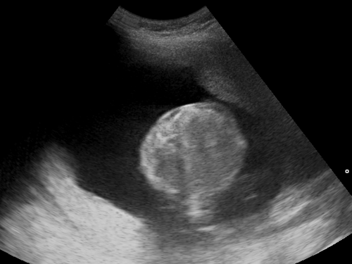
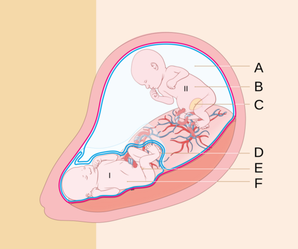

# ALTERAÇÕES DO LÍQUIDO AMNIÓTICO

Para entender as alterações do líquido amniótico (LA), você precisa primeiro visualizar o útero não como um tanque estático, mas como um sistema dinâmico de alta rotatividade. O líquido que está lá agora não é o mesmo de seis horas atrás. Se você compreender quem coloca e quem tira o líquido desse "tanque", as patologias deixam de ser decoreba e passam a ser lógicas.

## Fisiologia e Dinâmica do Líquido Amniótico

No início da gestação, o líquido amniótico é basicamente um ultrafiltrado do plasma materno e do próprio feto, através de sua pele ainda não queratinizada. No entanto, essa fase dura pouco. Por volta da 20ª semana, a pele do feto sofre queratinização, tornando-se impermeável. É aqui que o jogo muda e o rim fetal assume o protagonismo.

### As Fontes de Produção (Quem enche o tanque)

A partir da segunda metade da gestação, a principal fonte de produção do líquido amniótico é a urina fetal. O feto urina volumes consideráveis, que aumentam conforme a idade gestacional avança. Outra fonte importante, embora menor, é a secreção de fluido pulmonar. O pulmão fetal produz um líquido que é essencial para o seu próprio desenvolvimento e parte dele extravasa para a cavidade amniótica.

Muitos alunos esquecem da secreção pulmonar, mas ela é fundamental. Sem esse gradiente de pressão e volume, o pulmão não expande, levando à temida hipoplasia pulmonar.

### As Vias de Reabsorção (Quem esvazia o tanque)

O principal mecanismo de retirada do líquido é a deglutição fetal. O feto "bebe" o líquido amniótico, que é absorvido pelo seu trato gastrointestinal e volta para a circulação sistêmica, sendo eventualmente filtrado pela placenta.

Existe também a via intramembranosa, que é a troca de água e solutos diretamente entre o líquido amniótico e o sangue fetal que passa pela superfície da placenta e do cordão umbilical. Essa via é crucial para o ajuste fino do volume.

### O Volume ao Longo da Gestação

O volume de líquido amniótico aumenta progressivamente até atingir seu pico por volta da 34ª a 36ª semana, chegando a aproximadamente 800 a 1000 mL. Após a 38ª semana, é fisiológico que esse volume comece a declinar. É por isso que, no pós-datismo (após 42 semanas) ou mesmo na gestação prolongada (após 40 semanas), o oligoâmnio é um achado frequente e deve ser monitorado de perto.

## Avaliação Ultrassonográfica: ILA vs. MBV

*Figura 1 - Ultrassonografia obstétrica demonstrando polidrâmnio: o feto não preenche o diâmetro anteroposterior da cavidade uterina, com grande volume de líquido amniótico ao redor. O aumento do ILA (> 25 cm) ou do MBV (≥ 8 cm) define o diagnóstico. Fonte: Nevit Dilmen, CC BY-SA 3.0 | Wikimedia Commons*

Como medimos isso na prática? Não abrimos a barriga da paciente para medir o volume em um béquer. Usamos a ultrassonografia como estimativa indireta. Existem duas técnicas principais que você deve dominar para a prova.

### Índice de Líquido Amniótico (ILA)

Descrito por Phelan, o ILA divide o útero em quatro quadrantes, usando a linha negra (vertical) e a cicatriz umbilical (horizontal) como referências. Mede-se o maior bolsão vertical de líquido em cada quadrante, livre de partes fetais ou alças de cordão umbilical. A soma desses quatro valores em centímetros nos dá o ILA.

- **Normalidade:** Entre 8 cm e 18 cm (alguns autores consideram até 24 cm ou 25 cm como limite superior).

- **Oligodrâmnio:** ILA < 5 cm.

- **Polidrâmnio:** ILA > 25 cm.

### Maior Bolsão Vertical (MBV)

Também chamado de técnica de Chamberlain ou Máxima Profundidade Vertical (MAVP). Aqui, procuramos o maior bolsão de líquido em todo o útero, livre de cordão e membros, e medimos apenas sua dimensão vertical.

- **Oligodrâmnio:** MBV < 2 cm.

- **Normalidade:** MBV entre 2 cm e 8 cm.

- **Polidrâmnio:** MBV ≥ 8 cm.

**Dica de Ouro do Dr. Will:** Em gestações gemelares e na avaliação de vitalidade fetal no pós-termo, a diretriz da FEBRASGO e a literatura internacional (como o estudo de Manning) preferem o MBV. O ILA tende a superdiagnosticar oligoâmnio, o que leva a intervenções desnecessárias. Se a prova te der os dois valores e eles forem conflitantes, o MBV costuma ser o fiel da balança para evitar iatrogenias.

| Parâmetro | Oligodrâmnio | Normal | Polidrâmnio |
| --- | --- | --- | --- |
| **ILA** | < 5 cm | 8 - 24,9 cm | ≥ 25 cm |
| **MBV** | < 2 cm | 2 - 7,9 cm | ≥ 8 cm |

## Oligodrâmnio: Quando o Líquido Falta

O oligodrâmnio não é uma doença em si, mas um sinal de que algo está errado. A lógica aqui é simples: ou o feto não está produzindo urina, ou o líquido está vazando, ou a placenta não está entregando o que deveria.

### Etiologia e Fisiopatologia

As causas podem ser divididas em três grandes grupos:

- **Causas Ovulares (A mais comum):** Rotura Prematura de Membranas Ovulares (RPMO). Se a bolsa rompe, o líquido sai. No Brasil, essa é a causa número um de oligoâmnio agudo.

- **Causas Fetais:** Aqui pensamos em malformações do trato urinário. Se o feto tem agenesia renal bilateral (Síndrome de Potter), ele não produz urina. Se ele tem Válvula de Uretra Posterior (VUP), a urina não sai da bexiga para a cavidade.

- **Causas Materno-Placentárias:** Insuficiência placentária. Quando a placenta não funciona bem (comum na Pré-eclâmpsia ou no RCIU), o feto recebe menos oxigênio e nutrientes. Para sobreviver, ele faz a "centralização fetal" (reflexo de mergulho), priorizando o sangue para cérebro, coração e adrenais, e reduzindo o fluxo para os rins. Menos sangue no rim = menos urina = oligodrâmnio.

### Quadro Clínico e Diagnóstico

A gestante pode queixar-se de "barriga pequena" ou de que parou de crescer. Ao exame físico, a Altura Uterina (AU) estará abaixo do percentil esperado para a idade gestacional. As partes fetais são facilmente palpáveis (o útero fica "moldado" ao feto).

O diagnóstico é confirmado pelo USG (MBV < 2 cm ou ILA < 5 cm). Mas atenção: o diagnóstico de oligoâmnio obriga você a investigar a causa. O primeiro passo é sempre descartar RPMO (anamnese e exame especular). Se a bolsa estiver íntegra, olhamos para a morfologia fetal (rins) e para o Doppler (placenta).

### Complicações

O líquido amniótico serve para proteger o cordão de compressões e para permitir a expansão pulmonar. Portanto, as complicações são:

- **Hipoplasia Pulmonar:** Especialmente se o oligoâmnio ocorrer precocemente (antes de 24-26 semanas).

- **Compressão de Cordão:** Levando a desacelerações variáveis na cardiotocografia e sofrimento fetal agudo.

- **Sequência de Potter:** Fácies achatada, membros tortos e hipoplasia pulmonar devido à compressão mecânica crônica pelo útero.

### Conduta no Oligodrâmnio

A conduta depende da idade gestacional e da causa.

- **A termo (≥ 37 semanas):** Não há motivo para esperar. A conduta é a resolução da gestação. Se a vitalidade fetal estiver boa (Doppler e Cardiotocografia normais), a indução do parto é preferível, muitas vezes utilizando misoprostol se o colo for desfavorável.

- **Pré-termo:** Conduta expectante se a vitalidade estiver preservada. Hidratação materna (oral ou venosa) pode aumentar temporariamente o volume de LA, mas não resolve a causa base.

- **Malformações Incompatíveis com a Vida:** Conduta paliativa ou interrupção autorizada por lei em casos específicos (como anencefalia, embora esta cause polidrâmnio).

## Polidrâmnio: Quando o Líquido Sobra

O polidrâmnio ocorre em cerca de 1% a 2% das gestações. Diferente do oligoâmnio, que quase sempre indica gravidade, o polidrâmnio é idiopático (sem causa definida) em até 60% dos casos, especialmente os leves.

### Etiologia e Fisiopatologia

Para o líquido sobrar, ou o feto está urinando demais, ou ele não está engolindo.

- **Diabetes Mellitus (Gestacional ou Pré-gestacional):** É a causa clássica de prova. A hiperglicemia materna gera hiperglicemia fetal. O feto faz diurese osmótica (a glicose na urina "puxa" água). Resultado: poliúria fetal e polidrâmnio.

- **Malformações Gastrointestinais:** Qualquer coisa que impeça o feto de deglutir ou absorver o líquido.

- **Atresia de Esôfago:** O líquido não chega ao estômago. Dica de prova: se o USG mostrar polidrâmnio e estômago ausente ou muito pequeno, pense nisso.

- **Atresia Duodenal:** O sinal da "dupla bolha" no USG. Muito associado à Síndrome de Down (Trissomia do 21).

- **Alterações do SNC:** Anencefalia ou hidranencefalia. O feto perde o reflexo de deglutição e, no caso da anencefalia, há ainda a exposição das meninges e falta de hormônio antidiurético, aumentando a produção de líquido.

- **Hidropsia Fetal:** Causada por isoimunização Rh ou infecções congênitas (Parvovírus B19, Sífilis). O feto entra em insuficiência cardíaca, o que aumenta a produção de líquidos.

- **Gestação Gemelar:** Síndrome de Transfusão Feto-Fetal (STFF). O feto receptor faz poliúria (polidrâmnio) e o doador faz oligoâmnio (sequência oligo-poli).

### Quadro Clínico e Diagnóstico

A paciente apresenta AU acima do esperado, dificuldade de palpar partes fetais (o feto fica "dançando" no líquido, o chamado sinal do rechaço) e, em casos graves, dispneia materna por compressão do diafragma.

O diagnóstico ultrassonográfico é feito com ILA ≥ 25 cm ou MBV ≥ 8 cm. O polidrâmnio é classificado em leve, moderado ou acentuado, sendo que os casos acentuados (MBV > 12-15 cm) são os que mais se associam a malformações.

### Complicações

O excesso de líquido distende demais a fibra muscular uterina. Isso traz três riscos principais:

- **Trabalho de Parto Pré-termo:** O útero "acha" que já está na hora devido à distensão.

- **Atonia Uterina Pós-parto:** A fibra esticada demais não consegue contrair eficientemente após a saída do feto, causando hemorragia pós-parto.

- **Descolamento Prematuro de Placenta (DPP):** Se a bolsa rompe bruscamente, a descompressão rápida faz a placenta se descolar.

### Conduta no Polidrâmnio

- **Leve a Moderado:** Geralmente conduta expectante e controle do diabetes, se presente.

- **Sintomático (Dispneia materna):** Amniorredução terapêutica. Retira-se o excesso de líquido por amniocentese para alívio materno.

- **Uso de Inibidores da Prostaglandina (Indometacina):** A indometacina reduz a diurese fetal e aumenta a reabsorção intramembranosa.

- **Cuidado Crítico:** Não usar após a 32ª semana de gestação pelo risco de fechamento precoce do ducto arterioso fetal e hipertensão pulmonar. Além disso, pode causar oligoâmnio se não monitorado.

| Causa | Mecanismo | Dica de Prova |
| --- | --- | --- |
| **Diabetes** | Diurese Osmótica | Feto GIG (Grande para Idade Gestacional) |
| **Atresia Esôfago** | Defeito na Deglutição | Estômago não visível ao USG |
| **Atresia Duodenal** | Defeito na Absorção | Sinal da "Dupla Bolha" + Down |
| **Anencefalia** | Falta de reflexo/Exsudação | Ausência de calota craniana |
| **Isoimunização Rh** | Hidropsia/IC Fetal | Doppler de ACM alterado |

## Diagnóstico Diferencial e Pegadinhas de Prova

Muitas vezes, a banca vai tentar te confundir misturando as causas. Lembre-se: o que afeta o rim ou a chegada de sangue nele causa **OLIGO**. O que afeta a boca, o esôfago, o cérebro ou o metabolismo da glicose causa **POLI**.

**Erro Comum:** Achar que Doença Renal Obstrutiva (como VUP) causa polidrâmnio porque "acumula urina". Errado! Se a urina não sai do feto para a bolsa, o volume da bolsa diminui. Portanto, obstrução urinária fetal causa oligodrâmnio.

**Outra Pegadinha:** A Doença de Hirschsprung (megacólon congênito). Ela é uma obstrução intestinal baixa. Como a absorção do líquido amniótico ocorre principalmente no intestino delgado proximal, o Hirschsprung geralmente **NÃO** causa polidrâmnio. As atresias altas (esôfago e duodeno) são as grandes vilãs.

No MedEvo, sempre reforçamos que a análise do líquido deve ser integrada ao perfil biofísico fetal. Um ILA de 4 cm em uma paciente de 41 semanas com Doppler normal pode ser apenas fisiológico, enquanto o mesmo ILA em uma paciente com 28 semanas e pré-eclâmpsia é um sinal de alarme gravíssimo.

## Situações Especiais

### Rotura Prematura de Membranas (RPMO)

Se a paciente chega com história de perda líquida e o USG mostra oligoâmnio, o diagnóstico é RPMO até que se prove o contrário. A conduta antes de 34 semanas é expectante (corticoides para maturação pulmonar, antibioticoterapia para latência e vigilância de infecção). Após 34 semanas, a tendência na maioria dos serviços brasileiros, seguindo o Ministério da Saúde, é a resolução, embora a conduta possa ser individualizada até 36 semanas em casos selecionados.

### Pós-datismo

O volume de LA é um dos componentes do Perfil Biofísico Fetal (PBF). No pós-datismo, o oligoâmnio isolado (MBV < 2 cm) é indicação de interrupção da gravidez, pois reflete a queda da reserva placentária.

### O Recém-Nascido de Mãe Diabética

Não se esqueça que o polidrâmnio aqui é apenas a ponta do iceberg. Esse RN tem risco de Síndrome do Desconforto Respiratório (o excesso de insulina fetal inibe a produção de surfactante pelos pneumócitos tipo II), hipoglicemia neonatal e hiperbilirrubinemia.

## Pontos-Chave para Prova

- **Produção Principal (> 20 sem):** Urina fetal.

- **Remoção Principal:** Deglutição fetal.

- **Critério Oligodrâmnio:** ILA < 5 cm ou MBV < 2 cm.

- **Critério Polidrâmnio:** ILA > 25 cm ou MBV ≥ 8 cm.

- **Causa mais comum de Oligoâmnio:** RPMO (sempre descarte primeiro!).

- **Causa mais comum de Polidrâmnio:** Idiopática (na prática), mas Diabetes Mellitus e Malformações (em provas).

- **Sinal da Dupla Bolha:** Atresia duodenal (associada a Down e Polidrâmnio).

- **Sequência de Potter:** Agenesia renal → Oligoâmnio → Hipoplasia pulmonar + deformidades faciais/membros.

- **Indometacina:** Pode ser usada para polidrâmnio, mas **NUNCA** após 32 semanas (risco de fechar o ducto arterioso).

- **Atonia Uterina:** Complicação importante do polidrâmnio no pós-parto imediato por sobredistensão.

- **Válvula de Uretra Posterior:** Causa clássica de oligodrâmnio por obstrução da saída da urina.

- **Centralização Fetal:** Na insuficiência placentária, o feto desvia sangue do rim para o cérebro, causando oligodrâmnio.

- **Técnica do ILA:** Transdutor deve estar perpendicular ao solo, não à curvatura do útero.

- **Líquido Meconial:** Se o RN for vigoroso, a conduta é apenas observação e cuidados de rotina. Não se aspira mais traqueia de rotina.

- **Hipoplasia Pulmonar:** É a complicação mais grave do oligodrâmnio precoce, pois o líquido é necessário para o desenvolvimento dos alvéolos. 💡

 Cópia offline para consulta pessoal.
 Fonte original:
 [https://www.medevo.com.br/material-apoio/ler/e091d75a-1107-409b-92e2-1094e73d1827](https://www.medevo.com.br/material-apoio/ler/e091d75a-1107-409b-92e2-1094e73d1827)
