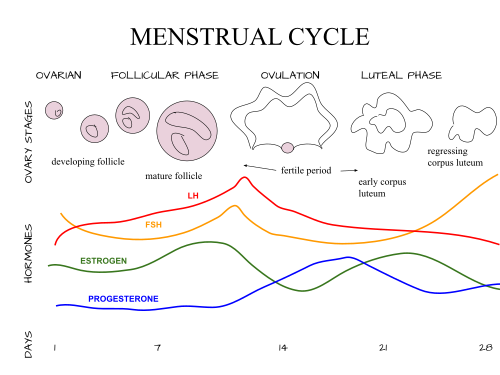

# AMENORREIA

Para entender amenorreia, você não precisa decorar uma lista de duzentas doenças. Você precisa entender como o "eixo" funciona. Se a menstruação não desce, algo está interrompendo o caminho entre o cérebro e o absorvente. Como professor, eu vejo muitos alunos se perderem em fluxogramas complexos, mas a lógica é simples: ou o estímulo não está sendo produzido (hipotálamo/hipófise), ou o ovário não está respondendo, ou o sangue não tem por onde sair (útero/vagina).

Vamos dividir o estudo em dois grandes grupos, mas sempre com um olho no que a banca quer de você.

## Definições e Critérios Diagnósticos

A primeira coisa que você deve saber é quando parar de observar e começar a investigar. As bancas adoram números, e aqui houve uma mudança importante nos últimos anos que você deve fixar.

### Amenorreia Primária

É aquela paciente que nunca menstruou na vida. O critério clássico que ainda cai muito é:

- Ausência de menarca aos 13 anos SEM caracteres sexuais secundários (a menina não tem mama nem pelos).

- Ausência de menarca aos 15 anos COM caracteres sexuais secundários presentes.

Por que essa diferença? Porque a telarca (surgimento da mama) indica que o eixo hipotálamo-hipófise-ovário já despertou e está produzindo estrogênio. Se tem mama e não tem sangue, o problema provavelmente é anatômico. Se não tem nem mama aos 13 anos, o eixo sequer "ligou".

### Amenorreia Secundária

É a ausência de menstruação em quem já menstruava antes. Os critérios são:

- Ausência de menstruação por 3 meses ou mais em mulheres com ciclos previamente regulares.

- Ausência de menstruação por 6 meses ou mais em mulheres com ciclos previamente irregulares.

Cuidado: algumas bancas podem citar "mais de 3 ciclos" em vez de 3 meses. O conceito é o mesmo: houve uma interrupção persistente.

## O Primeiro Passo: Excluir o Óbvio

Antes de pedir cariótipo ou ressonância de sela túrcica, você deve fazer o básico. Em qualquer caso de amenorreia secundária (e até na primária, se houver caracteres sexuais), o primeiro exame é sempre o Beta-hCG.

Parece óbvio, mas é o erro mais comum em provas e na vida real. Não importa se a paciente diz que é virgem ou se usa camisinha: exclua gravidez. No MedEvo, sempre reforçamos que a causa mais comum de amenorreia secundária é a gestação.

Após excluir gravidez, o "trio inicial" de exames laboratoriais é:

- Beta-hCG.

- TSH (disfunções tireoidianas alteram o GnRH).

- Prolactina (a hiperprolactinemia inibe o GnRH).

## Amenorreia Secundária: A Investigação Passo a Passo

Se o Beta-hCG, o TSH e a Prolactina vieram normais, agora entramos na propedêutica clássica. Aqui, usamos testes hormonais para "conversar" com o corpo da paciente.

### Passo 1: Teste da Progesterona

Administramos progesterona (ex: Medroxiprogesterona 10mg por 5 a 10 dias) e esperamos.

- **Teste Positivo (Sangrou):** Significa que a paciente tem estrogênio (o endométrio foi preparado), o útero é funcional e o trato de saída está pérvio. O diagnóstico aqui é anovulação. Se ela não ovula, não produz progesterona natural, e o endométrio fica crescendo até descamar de forma irregular ou parar de vez. A causa mais comum de teste da progesterona positivo é a Síndrome dos Ovários Policísticos (SOP).

- **Teste Negativo (Não sangrou):** Duas hipóteses: ou não tem estrogênio para preparar o endométrio, ou o útero/vagina estão obstruídos.

### Passo 2: Teste do Estrogênio + Progesterona

Se ela não sangrou com progesterona, damos estrogênio (para crescer o endométrio) seguido de progesterona (para descamar).

- **Teste Positivo (Sangrou):** O útero funciona. Se ele funciona mas não sangrou antes, é porque falta estrogênio. O problema é "lá em cima" (ovário ou cérebro).

- **Teste Negativo (Não sangrou):** Se você deu o hormônio e mesmo assim não desceu sangue, o problema é o "alvo". O útero está com sinéquias (Síndrome de Asherman) ou há uma obstrução anatômica.

### Passo 3: Dosagem de FSH

Se o teste de Estrogênio + Progesterona foi positivo, sabemos que faltam hormônios. Agora precisamos saber se o culpado é o ovário ou o comando central.

- **FSH Alto (> 20-40 UI/L):** O cérebro está gritando (mandando FSH), mas o ovário não responde. Diagnóstico: Insuficiência Ovariana Prematura (IOP) ou Falência Ovariana. É o hipogonadismo hipergonadotrófico.

- **FSH Baixo ou Normal:** O ovário até trabalharia, mas não recebe ordens. O problema é no Hipotálamo ou na Hipófise. É o hipogonadismo hipogonadotrófico.

### Tabela 1: Resumo da Propedêutica Hormonal

| Teste/Exame | Resultado | Interpretação | Causa Provável |
| --- | --- | --- | --- |
| Beta-hCG | Positivo | Gravidez | Gestação |
| Progesterona | Sangrou | Estrogênio presente / Anovulação | SOP |
| Estrogênio + Prog. | Não sangrou | Causa Uterina / Trato de saída | Síndrome de Asherman |
| FSH | Elevado | Causa Ovariana | IOP / Disgenesia |
| FSH | Baixo/Normal | Causa Central | Estresse / Kallmann |

## Amenorreia Primária: O Caminho das Pedras

Na amenorreia primária, o exame físico é o seu melhor amigo. Como Dr. Will costuma dizer, "não peça exame antes de olhar para a paciente".

### Com Caracteres Sexuais Secundários (Tem Mama)

Se ela tem mama, ela tem estrogênio. Se tem estrogênio e não menstrua, o problema é anatômico. O próximo passo é a Ultrassonografia (USG) pélvica para ver se existe útero.

- **Com Útero:** Investigar obstruções como Hímen Imperfurado ou Septo Vaginal Transverso. A paciente costuma ter dor pélvica cíclica (o sangue fica retido, a chamada criptomenorreia).

- **Sem Útero:** Aqui o bicho pega. Você precisa pedir o Cariótipo para diferenciar duas síndromes clássicas de prova:

- **Síndrome de Mayer-Rokitansky-Kuster-Hauser (MRKH):** Cariótipo 46,XX. É uma agenesia mulleriana. A menina tem ovários (logo, tem caracteres sexuais), mas não tem útero e os 2/3 superiores da vagina.

- **Síndrome de Insensibilidade Androgênica Completa (Morris):** Cariótipo 46,XY. É um homem geneticamente, mas o receptor de testosterona não funciona. A testosterona vira estrogênio na periferia, o que gera mamas. Mas, como tem testículo (que produz hormônio antimulleriano), ela não tem útero. Dica de prova: a paciente de Morris tem poucos ou nenhuns pelos pubianos.

### Sem Caracteres Sexuais Secundários (Não tem Mama)

Se não tem mama, não tem estrogênio. O problema é no eixo. O primeiro exame é o FSH.

- **FSH Alto (Hipogonadismo Hipergonadotrófico):** O ovário não funciona. A causa mais comum é a Disgenesia Gonadal.

- **Síndrome de Turner (45,X):** Baixa estatura, pescoço alado, tórax em escudo.

*Figura 1 - Cariótipo 45,X demonstrando apenas um cromossomo X e ausência do segundo cromossomo sexual (canto inferior direito). Este padrão cromossômico é diagnóstico da Síndrome de Turner, causa clássica de amenorreia primária com hipogonadismo hipergonadotrófico. Fonte: The cat~commonswiki, CC BY-SA 3.0 | Wikimedia Commons*
 * **Disgenesia Gonadal Pura (46,XX ou 46,XY - Síndrome de Swyer):** A gônada é em fita e não produz hormônios.
2. **FSH Baixo (Hipogonadismo Hipogonadotrófico):** O problema é central.
 * **Síndrome de Kallmann:** Falha na migração dos neurônios produtores de GnRH e dos neurônios olfatórios. Clássico de prova: Amenorreia primária + Anosmia (não sente cheiro).

## Causas Específicas: O que você não pode esquecer

### Síndrome de Asherman

É a presença de sinéquias (cicatrizes) dentro do útero que impedem o crescimento do endométrio. A história típica de prova é: paciente que teve uma hemorragia pós-parto ou abortamento, passou por uma curetagem uterina vigorosa e nunca mais menstruou. O diagnóstico padrão-ouro é a Histeroscopia.

### Síndrome de Sheehan

É a necrose hipofisária pós-parto devido a uma hemorragia grave (choque hipovolêmico). A hipófise da gestante é maior e mais vascularizada; se o fluxo cai bruscamente, ela morre. O primeiro sinal costuma ser a agalactia (ausência de leite), seguida de amenorreia e outros sinais de insuficiência hipofisária.

### Hiperprolactinemia

A prolactina alta inibe o GnRH. Causas comuns:

- **Fisiológicas:** Gestação, amamentação, sono, estresse.

- **Farmacológicas:** Neurolépticos (sulpirida, haloperidol), metoclopramida, anticoncepcionais, antidepressivos tricíclicos.

- **Patológicas:** Prolactinomas (adenomas de hipófise).

Cuidado com o "Efeito Gancho" (Hook Effect): em prolactinomas gigantes, o exame de laboratório pode vir falsamente baixo. É necessário diluir a amostra.

### Amenorreia Hipotalâmica Funcional

É muito comum em atletas de alta performance, pacientes com anorexia nervosa ou sob estresse extremo. O excesso de exercício ou a baixa disponibilidade energética aumenta o cortisol e o CRH, que por sua vez inibem o GnRH. O tratamento não é dar hormônio, mas sim ajustar o estilo de vida (ganho de peso, redução de carga de treino).

### Tabela 2: Diagnóstico Diferencial de Amenorreia Primária (Sem Útero)

| Característica | Síndrome de Morris | Síndrome de Rokitansky |
| --- | --- | --- |
| Cariótipo | 46, XY | 46, XX |
| Gônada | Testículos (abdominais/inguinais) | Ovários (pélvicos) |
| Pelos Pubianos | Ausentes ou escassos | Normais |
| Nível de Testosterona | Alto (nível masculino) | Baixo (nível feminino) |
| Malformação Renal | Rara | Comum (associada) |

## Tratamento Farmacológico e Condutas

O tratamento da amenorreia é sempre o tratamento da causa base. Não se trata o sintoma "falta de menstruação" sem saber o porquê.

- **Hiperprolactinemia:** A primeira escolha são os agonistas dopaminérgicos (Cabergolina ou Bromocriptina). Eles mimetizam a dopamina, que é o freio natural da prolactina. A Cabergolina é preferida por ter menos efeitos colaterais e posologia mais fácil (0,5mg uma ou duas vezes por semana).

- **SOP:** Se a paciente não quer engravidar, usamos Anticoncepcionais Orais Combinados (ACO) para proteger o endométrio (evitar hiperplasia por estrogênio sem oposição) e tratar o hirsutismo. Se quer engravidar, indutores de ovulação (Letrozol ou Clomifeno).

- **Insuficiência Ovariana Prematura:** Terapia de Reposição Hormonal (TRH) é mandatória para prevenir osteoporose e doenças cardiovasculares, além de tratar sintomas climatéricos.

- **Hímen Imperfurado:** O tratamento é cirúrgico (himenotomia em cruz).

- **Síndrome de Morris:** Os testículos devem ser removidos após a puberdade devido ao risco de malignização (gonadoblastoma), seguido de reposição estrogênica.

## Situações Especiais e Pegadinhas

### O Uso de ACO e a Amenorreia

Muitas pacientes em uso de pílula combinada param de menstruar. Se o Beta-hCG for negativo, a causa é a atrofia endometrial causada pelo progestágeno do comprimido. Isso não é doença, é efeito do fármaco.

### Adolescente e a Imaturidade do Eixo

Nos primeiros dois anos após a menarca, é normal ter ciclos anovulatórios e períodos de amenorreia. Isso ocorre pela imaturidade do eixo hipotálamo-hipófise. A conduta é observação e orientação, a menos que haja sangramento excessivo.

### Síndrome de Savage

Também chamada de Síndrome dos Ovários Resistentes. A paciente tem folículos, mas eles não respondem ao FSH. É uma causa rara de hipogonadismo hipergonadotrófico. Diferencia-se da IOP apenas por biópsia ovariana (que raramente é feita na prática).

## Pontos-Chave para Prova 🩺

- **Beta-hCG sempre:** É o primeiro exame na amenorreia secundária e na primária com caracteres sexuais.

- **Definição de Primária:** 13 anos sem mama OU 15 anos com mama.

- **Definição de Secundária:** 3 meses (regular) ou 6 meses (irregular).

- **Teste da Progesterona Positivo:** Indica anovulação (tem estrogênio e útero ok). Causa clássica: SOP.

- **Teste Estrogênio + Progesterona Negativo:** Indica causa uterina (Asherman) ou obstrução.

- **FSH Elevado:** Indica causa ovariana (IOP ou Disgenesia).

- **FSH Baixo:** Indica causa hipotalâmica ou hipofisária.

- **Síndrome de Kallmann:** Amenorreia primária + Anosmia + FSH baixo.

- **Síndrome de Turner:** Causa mais comum de disgenesia gonadal; cariótipo 45,X.

- **Rokitansky vs. Morris:** Rokitansky é 46,XX (tem pelos); Morris é 46,XY (não tem pelos).

- **Síndrome de Asherman:** Amenorreia após curetagem; diagnóstico por histeroscopia.

- **Síndrome de Sheehan:** Necrose da hipófise após hemorragia pós-parto grave.

- **Prolactinoma:** Tratamento inicial é clínico (Cabergolina), raramente cirúrgico.

- **Hímen Imperfurado:** Causa dor pélvica cíclica e abaulamento vaginal azulado.

- **O que NÃO fazer:** Nunca iniciar tratamento com pílula anticoncepcional em uma paciente com amenorreia sem antes investigar a causa. Isso "mascara" o diagnóstico.

- **Cuidado com a Sulpirida:** É um neuroléptico muito associado à galactorreia e amenorreia em provas.

- **Anorexia e Exercício:** Causam amenorreia hipotalâmica por queda do GnRH.

- **Gonadoblastoma:** Risco aumentado em pacientes com fragmento de cromossomo Y (como no Morris ou Swyer); exige remoção das gônadas.

 Cópia offline para consulta pessoal.
 Fonte original:
 [https://www.medevo.com.br/material-apoio/ler/5f1acb94-54ae-4b5c-9601-b2653ba32d5a](https://www.medevo.com.br/material-apoio/ler/5f1acb94-54ae-4b5c-9601-b2653ba32d5a)
