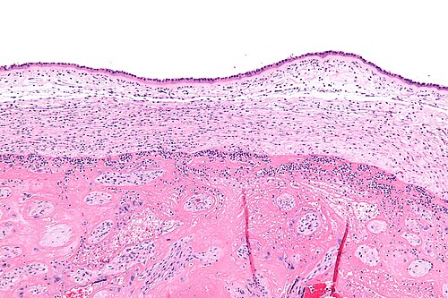
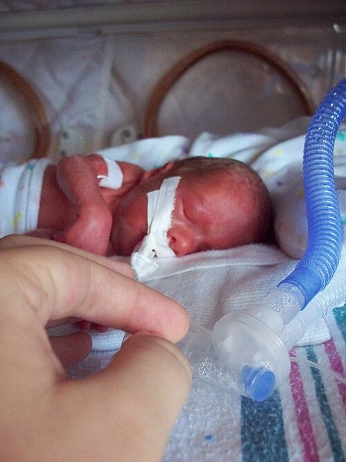

# AMNIORREXE PREMATURA: CORIOAMNIONITE E PROFILAXIAS

A ruptura prematura de membranas ovulares (RPMO), também chamada de amniorrexe prematura ou PROM, é definida pela ruptura das membranas antes do início do trabalho de parto, independentemente da idade gestacional. Quando ocorre antes de 37 semanas, recebe o nome de ruptura prematura pré-termo de membranas (RPMPT ou PPROM).

A condução depende de três eixos: idade gestacional, presença de infecção intra-amniótica e condição materno-fetal. O ponto crítico é reconhecer quando a conduta expectante deixa de ser segura. Corioamnionite clínica, sofrimento fetal, descolamento prematuro de placenta, prolapso de cordão ou trabalho de parto avançado indicam interrupção da gestação, independentemente da idade gestacional.

## 1) Conceitos essenciais

| Termo | Definição prática |
| --- | --- |
| RPMO/PROM | Ruptura de membranas antes do início do trabalho de parto. |
| RPMPT/PPROM | Ruptura de membranas antes de 37 semanas. |
| Latência | Intervalo entre a ruptura das membranas e o nascimento. |
| Infecção intra-amniótica/corioamnionite clínica | Síndrome infecciosa/inflamatória intrauterina, geralmente associada a febre materna e sinais materno-fetais. |
| Antibioticoterapia de latência | Antibiótico usado na RPMPT estável para prolongar a gestação e reduzir infecção; não trata corioamnionite instalada. |
| Profilaxia para GBS | Antibiótico intraparto para prevenir sepse neonatal precoce por Streptococcus agalactiae. |
| Antibioticoterapia terapêutica | Tratamento de infecção intra-amniótica/corioamnionite, endometrite, sepse ou infecção materna estabelecida. |

A separação entre esses três usos de antibiótico é fundamental. Latência, profilaxia de GBS e tratamento da corioamnionite têm objetivos, doses e duração diferentes.

## 2) Fisiopatologia e fatores de risco

As membranas ovulares dependem da integridade do colágeno e da matriz extracelular. Infecção subclínica, inflamação, sangramento e estresse oxidativo ativam metaloproteinases, proteases e citocinas, reduzindo a resistência do âmnio e do córion.

Fatores associados à RPMO/RPMPT:

| Fator | Comentário clínico |
| --- | --- |
| Antecedente de RPMPT ou parto prematuro | Forte preditor de recorrência. |
| Infecção genital ou urinária | Vaginose bacteriana, cervicites e bacteriúria podem participar do processo inflamatório. |
| Tabagismo | Reduz integridade tecidual e aumenta inflamação. |
| Sangramento de segundo ou terceiro trimestre | Relaciona-se a inflamação decidual e descolamento. |
| Sobredistensão uterina | Gestação múltipla e polidrâmnio. |
| Procedimentos invasivos | Amniocentese, fetoscopia e outros procedimentos podem aumentar risco. |
| Colo curto/insuficiência cervical | Associação com parto prematuro e infecção ascendente. |

## 3) Diagnóstico

O diagnóstico é clínico na maioria dos casos. A avaliação deve minimizar risco de infecção ascendente.

### Exame inicial

- Realizar **exame especular estéril**.

- Procurar saída de líquido pelo orifício externo do colo, acúmulo em fundo de saco vaginal ou saída após Valsalva/Tarnier.

- Avaliar cor, odor e aspecto do líquido.

- Evitar toque vaginal digital se não houver trabalho de parto ativo ou parto iminente, pois o exame digital aumenta risco de infecção intra-amniótica e reduz latência.

### Testes auxiliares

| Teste | Achado esperado | Limitações |
| --- | --- | --- |
| pH/nitrazina | Líquido amniótico é alcalino, geralmente pH 7,0–7,5. | Sangue, sêmen, vaginose e antissépticos podem gerar falso-positivo. |
| Cristalização/ferning | Padrão em folha de samambaia após secagem. | Muco cervical e técnica inadequada podem confundir. |
| Testes de proteínas amnióticas | PAMG-1, IGFBP-1 ou combinações similares. | Custo maior; úteis quando exame clínico é inconclusivo. |
| Ultrassonografia | Oligoidrâmnio apoia o diagnóstico e avalia apresentação/crescimento. | ILA normal não exclui ruptura; oligoidrâmnio tem outras causas. |

O hemograma e marcadores inflamatórios isolados não confirmam corioamnionite. Leucocitose pode ocorrer por gestação, estresse, trabalho de parto ou corticoide.

## 4) Conduta por idade gestacional

A presença de infecção intra-amniótica, instabilidade materna, sofrimento fetal, prolapso de cordão ou descolamento placentário sobrepõe-se à idade gestacional e indica interrupção.

| Situação | Conduta geral |
| --- | --- |
| ≥ 37 semanas | Interrupção da gestação, geralmente por indução do parto, com profilaxia para GBS quando indicada. |
| 34 a 36 semanas e 6 dias | Conduta individualizada. Muitos protocolos adotam interrupção; diretrizes internacionais aceitam manejo expectante selecionado até 37 semanas quando não há infecção, sofrimento fetal ou contraindicação e conforme status de GBS. Não se usam antibióticos de latência nem tocólise de rotina. Corticoide pode ser considerado se parto antes de 37 semanas for provável e não houver curso prévio, conforme protocolo local. |
| 24 a 33 semanas e 6 dias | Conduta expectante hospitalar se estável: vigilância materno-fetal, corticoide, antibiótico de latência, cultura/profilaxia de GBS conforme indicação e sulfato de magnésio para neuroproteção se parto iminente em idade gestacional indicada. |
| < 24 semanas | Aconselhamento individualizado. A conduta deve ponderar viabilidade, risco materno, hipoplasia pulmonar, infecção e recursos neonatais. Sinais de infecção ou instabilidade indicam interrupção. |

## 5) Conduta expectante na RPMPT estável (

| Esquema clássico de 7 dias | Observações |
| --- | --- |
| Ampicilina 2 g IV a cada 6 h por 48 h + eritromicina 250 mg IV a cada 6 h por 48 h; depois amoxicilina 250 mg VO a cada 8 h por 5 dias + eritromicina base 333 mg VO a cada 8 h por 5 dias | Azitromicina pode substituir eritromicina em protocolos que adotam essa alternativa. |
| Evitar amoxicilina-clavulanato | Associada a maior risco de enterocolite necrosante em estudos de RPMPT. |

Se houver diagnóstico de corioamnionite, o esquema de latência deve ser interrompido e substituído por antibioticoterapia terapêutica, com interrupção da gestação.

## 6) Corioamnionite clínica / infecção intra-amniótica

*Figura 1 - Infiltrado neutrofílico em membranas ovulares, compatível com corioamnionite histológica.*

A corioamnionite é uma infecção/inflamação geralmente ascendente, frequentemente polimicrobiana, envolvendo microrganismos aeróbios, anaeróbios, Ureaplasma, Mycoplasma, Gardnerella, estreptococos do grupo B, enterobactérias e Bacteroides. O diagnóstico é clínico na maioria dos cenários assistenciais.

### Critérios clínicos

Suspeitar fortemente quando houver febre materna sem outra causa evidente, especialmente:

| Critério | Interpretação |
| --- | --- |
| Temperatura materna ≥ 39,0 °C | Pode bastar para suspeita de infecção intra-amniótica. |
| Temperatura 38,0–38,9 °C persistente | Reforça suspeita quando associada a outro achado. |
| Taquicardia fetal | Frequência cardíaca fetal > 160 bpm por pelo menos 10 min. |
| Taquicardia materna | Frequência materna > 100 bpm. |
| Leucocitose materna | Geralmente > 15.000/mm³, interpretando com cautela se houve corticoide. |
| Dor/hipersensibilidade uterina | Sinal clínico relevante. |
| Líquido amniótico purulento ou fétido | Forte sugestão de infecção ascendente. |

A ausência de leucocitose não exclui infecção. O diagnóstico diferencial de febre intraparto inclui pielonefrite, infecção respiratória, apendicite, tromboflebite, febre por analgesia peridural e outras causas.

## 7) Tratamento da corioamnionite: antibiótico, parto e via de nascimento

Uma vez estabelecida a suspeita clínica, a conduta deve ser imediata:

- Iniciar antibioticoterapia intravenosa no momento do diagnóstico, sem aguardar o parto.

- Administrar antitérmico e hidratação, conforme necessidade clínica.

- Monitorar mãe e feto.

- Interromper a gestação; a corioamnionite contraindica manutenção expectante.

- Preferir parto vaginal quando possível. Corioamnionite isolada não é indicação de cesariana.

### Antibioticoterapia terapêutica

| Cenário | Esquema recomendado ou aceitável |
| --- | --- |
| Corioamnionite clínica intraparto, sem indicação imediata de cesariana | Ampicilina 2 g IV a cada 6 h + gentamicina 5 mg/kg IV a cada 24 h. Esquemas tradicionais com gentamicina 1,5 mg/kg IV a cada 8 h também aparecem em protocolos. |
| Cesariana após diagnóstico de corioamnionite | Manter ampicilina + gentamicina e **adicionar cobertura anaeróbia**: clindamicina 900 mg IV no clampeamento do cordão ou metronidazol 500 mg IV, conforme protocolo local. |
| Alergia a penicilina | Ajustar conforme risco de anafilaxia, cultura quando disponível e protocolo institucional; opções incluem cefazolina em alergia de baixo risco ou clindamicina/vancomicina associada a gentamicina em cenários selecionados. |
| Sepse, choque, imunossupressão ou falha clínica | Ampliar cobertura conforme protocolo local e avaliação de infectologia/obstetrícia; ampicilina-sulbactam ou piperacilina-tazobactam podem ser consideradas em serviços que as adotam. |

A correção mais importante é não confundir os esquemas:

- **Ampicilina + gentamicina** é regime intraparto de primeira linha em muitas diretrizes para corioamnionite clínica.

- A infecção é polimicrobiana e pode envolver anaeróbios; por isso, **se houver cesariana**, deve-se acrescentar clindamicina ou metronidazol para reduzir risco de endometrite e infecção pós-operatória.

- Em quadros graves, sepse, persistência de febre ou protocolos específicos, a cobertura deve ser ampliada.

- Clindamicina + gentamicina isoladamente é mais típica de cobertura pós-parto/endometrite ou de cenários de alergia/estratégia institucional; não deve ser apresentada como substituição universal obrigatória de ampicilina + gentamicina em toda corioamnionite intraparto.

### Pós-parto

| Situação | Conduta usual |
| --- | --- |
| Parto vaginal, melhora clínica e ausência de sepse | Antibiótico pós-parto prolongado não é rotineiramente necessário. |
| Cesariana | Realizar cobertura anaeróbia; uma dose adicional pós-parto costuma ser suficiente em muitos protocolos se houver boa evolução. |
| Febre persistente, bacteremia, sepse, abscesso ou instabilidade | Prolongar e ajustar antibioticoterapia conforme foco, culturas e evolução clínica. |

*Figura 2 - A RPMPT expõe o recém-nascido aos riscos da prematuridade; por isso, a conduta expectante segura busca ganhar tempo sem tolerar infecção materno-fetal.*

## 8) Profilaxia para Streptococcus do grupo B (GBS)

A profilaxia intraparto para GBS previne sepse neonatal precoce. Ela é diferente da antibioticoterapia de latência e do tratamento da corioamnionite.

Indicações clássicas:

| Indicação | Conduta |
| --- | --- |
| Cultura retovaginal positiva em triagem recente | Profilaxia intraparto. |
| Bacteriúria por GBS na gestação atual | Profilaxia intraparto, independentemente de cultura posterior. |
| Recém-nascido anterior com doença invasiva por GBS | Profilaxia intraparto. |
| Status desconhecido + parto pré-termo | Profilaxia intraparto. |
| Status desconhecido + ruptura de membranas ≥ 18 h | Profilaxia intraparto. |
| Status desconhecido + febre intraparto | Profilaxia intraparto; se houver suspeita de corioamnionite, tratar como infecção intra-amniótica, não apenas como profilaxia. |

Esquema usual: penicilina cristalina 5 milhões UI IV de ataque, seguida de 2,5–3 milhões UI IV a cada 4 h até o parto. Ampicilina 2 g IV de ataque seguida de 1 g IV a cada 4 h é alternativa frequente.

Quando a paciente com RPMPT recebe ampicilina no esquema de latência e entra em trabalho de parto durante esse período, há cobertura para GBS. Se o ciclo de latência terminou e o parto ocorre depois, a profilaxia de GBS deve ser reavaliada no intraparto conforme indicações.

## 9) Doses de referência

| Medicação | Indicação | Dose comum |
| --- | --- | --- |
| Betametasona | Maturação pulmonar fetal | 12 mg IM, 2 doses com intervalo de 24 h. |
| Dexametasona | Maturação pulmonar fetal | 6 mg IM, 4 doses com intervalo de 12 h. |
| Ampicilina + eritromicina | Latência na RPMPT < 34 semanas | 48 h IV seguidas de 5 dias VO, completando 7 dias. |
| Azitromicina | Alternativa à eritromicina em latência | Dose conforme protocolo institucional. |
| Penicilina cristalina | Profilaxia intraparto para GBS | 5 milhões UI IV de ataque; depois 2,5–3 milhões UI IV a cada 4 h. |
| Ampicilina | Profilaxia alternativa para GBS | 2 g IV de ataque; depois 1 g IV a cada 4 h. |
| Ampicilina + gentamicina | Corioamnionite clínica | Ampicilina 2 g IV 6/6 h + gentamicina 5 mg/kg IV 1 vez ao dia. |
| Clindamicina | Anaeróbios em cesariana com corioamnionite | 900 mg IV no clampeamento do cordão; repetir conforme protocolo/evolução. |
| Metronidazol | Alternativa para anaeróbios em cesariana | 500 mg IV, conforme protocolo local. |
| Sulfato de magnésio | Neuroproteção fetal se parto prematuro iminente | Ataque de 4 g IV; manutenção conforme protocolo. |

## 10) Situações que mudam a conduta

| Achado | Impacto |
| --- | --- |
| Corioamnionite clínica | Interromper conduta expectante, iniciar antibiótico terapêutico e planejar parto. |
| Sofrimento fetal agudo | Interrupção conforme urgência obstétrica. |
| Descolamento prematuro de placenta | Interrupção e estabilização materna. |
| Prolapso de cordão | Emergência obstétrica. |
| Trabalho de parto ativo avançado | Não tentar prolongar latência. |
| Oligoidrâmnio persistente muito precoce | Aumenta risco de hipoplasia pulmonar e deformidades compressivas. |
| Febre isolada após analgesia peridural | Exige avaliação; se critérios de infecção não forem preenchidos, evitar diagnóstico automático, mas manter vigilância. |

## 11) Resumo prático

- RPMO é ruptura das membranas antes do trabalho de parto.

- RPMPT é RPMO antes de 37 semanas.

- Diagnóstico: exame especular; toque digital deve ser evitado fora de trabalho de parto ativo ou parto iminente.

- Ultrassonografia ajuda, mas não confirma nem exclui isoladamente.

- RPMO a termo: interrupção da gestação.

- RPMPT < 34 semanas estável: conduta expectante hospitalar, corticoide, antibiótico de latência, avaliação de GBS e vigilância.

- Antibioticoterapia de latência é ampicilina + macrolídeo, seguida de amoxicilina + macrolídeo; evitar amoxicilina-clavulanato.

- Corioamnionite clínica contraindica conduta expectante.

- Tratamento da corioamnionite: antibiótico intravenoso imediato e parto; via vaginal é preferida se não houver indicação obstétrica de cesariana.

- Ampicilina + gentamicina é esquema intraparto de primeira linha em muitas diretrizes; em cesariana deve-se adicionar cobertura anaeróbia com clindamicina ou metronidazol.

- Profilaxia de GBS não substitui tratamento de corioamnionite.

- Antibiótico pós-parto prolongado não é rotina quando há boa evolução; persistência de febre, bacteremia, sepse ou abscesso exige ampliação/continuação.

Referências principais: ACOG Committee Opinion No. 712, Intrapartum Management of Intraamniotic Infection, Obstet Gynecol 2017; ACOG Practice Bulletin No. 217, Prelabor Rupture of Membranes, Obstet Gynecol 2020; Conde-Agudelo A, Romero R, Jung EJ, Garcia Sánchez AJ. Management of Clinical Chorioamnionitis: An Evidence-Based Approach. Am J Obstet Gynecol. 2020;223(6):848–869; StatPearls/NCBI Bookshelf, Preterm and Term Prelabor Rupture of Membranes, atualização 2024; StatPearls/NCBI Bookshelf, Chorioamnionitis, atualização 2023.

 Cópia offline para consulta pessoal.
 Fonte original:
 [https://www.medevo.com.br/material-apoio/ler/ee267182-188c-4166-9dd3-fd26236d5c18](https://www.medevo.com.br/material-apoio/ler/ee267182-188c-4166-9dd3-fd26236d5c18)
