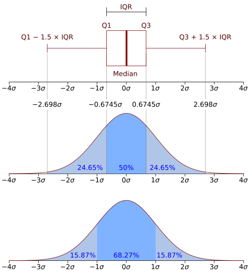

# AMOSTRAGEM E REPRESENTAÇÃO GRÁFICA

Para entender bioestatística, você precisa parar de ver números e começar a ver processos. Na prova de residência, o examinador não quer que você seja um matemático, ele quer saber se você consegue interpretar um estudo científico para aplicar na sua prática clínica ou se você entende os indicadores de saúde da população que você vai atender.

## A Lógica da Amostragem: Por que não estudamos todo mundo?

Imagine que você quer saber a prevalência de hipertensão no Brasil. Seria impossível examinar cada um dos mais de 200 milhões de brasileiros. Isso seria um Censo. O Censo é a coleta de dados de todos os elementos de uma população. No Brasil, o IBGE faz isso, mas é caro, demorado e logisticamente complexo.

Por isso, usamos a Amostra. A amostra é um subconjunto da população. A ideia central aqui é a Representatividade. Se a sua amostra não representa a população, qualquer conclusão que você tirar dela estará errada para o "mundo real". Isso é o que chamamos de erro de inferência.

Muitos alunos erram questões achando que a amostra é o único jeito de estudar uma população. Cuidado: o Censo existe, ele só não é prático para a maioria das pesquisas. A amostra é mais econômica e permite um controle de qualidade muito mais rigoroso dos dados coletados, o que pode, paradoxalmente, torná-la mais precisa que um censo mal executado.

### População vs. Amostra

A população é o conjunto total de indivíduos que compartilham uma característica (ex: todos os diabéticos do Rio de Janeiro). A amostra é a parte desse grupo que você realmente estuda. O objetivo da bioestatística é a Inferência Estatística: pegar o que descobrimos na amostra e dizer "provavelmente isso acontece na população toda".

## Métodos de Amostragem Probabilística

Aqui está o coração das questões de prova. Para que uma amostra seja estatisticamente válida para inferência, cada indivíduo da população deve ter uma probabilidade conhecida e diferente de zero de ser selecionado. Isso é Amostragem Probabilística.

### Amostragem Aleatória Simples

É o famoso sorteio. Você numera a lista de pacientes de 1 a 100 e sorteia 20. Todos têm a mesma chance. É o método mais puro, mas exige que você tenha a lista completa de todos os indivíduos (o que raramente acontece em grandes populações).

### Amostragem Sistemática

A banca vai te dar um cenário assim: "O pesquisador decidiu abordar cada 5º paciente que entrava no ambulatório". Isso é amostragem sistemática. Você define um intervalo (K) baseado no tamanho da população e da amostra desejada.

Cuidado com a pegadinha: para ser considerada probabilística, o primeiro indivíduo deve ser escolhido por sorteio aleatório entre 1 e K. Se o pesquisador simplesmente decide começar pelo primeiro que ele gosta, o rigor se perde.

### Amostragem Estratificada

Imagine que você quer estudar a altura dos brasileiros. Se você sortear 100 pessoas e, por azar, 90 forem homens, sua média de altura será puxada para cima. Para evitar isso, você divide a população em estratos (homens e mulheres) e sorteia proporcionalmente dentro de cada grupo.

O objetivo da estratificação é garantir que subgrupos importantes (estratos homogêneos internamente) estejam representados. Isso aumenta a precisão do estudo sem precisar aumentar tanto o tamanho da amostra.

### Amostragem por Conglomerados (Clusters)

Muitos alunos confundem Estratificada com Conglomerados. Anote a diferença:
Na Estratificada, você sorteia indivíduos dentro de grupos.
No Conglomerado, você sorteia os grupos.

Exemplo clássico: você quer estudar crianças em escolas. Em vez de sortear crianças de todas as escolas da cidade (caro e difícil), você sorteia 10 escolas (conglomerados) e estuda todos os alunos daquelas escolas. O conglomerado é geralmente uma unidade geográfica ou administrativa.

| Tipo de Amostragem | Como funciona | Vantagem principal |
| --- | --- | --- |
| Aleatória Simples | Sorteio puro de uma lista completa | Fácil compreensão e execução se houver lista |
| Sistemática | Seleção por intervalo fixo (ex: cada 10º) | Praticidade no fluxo de atendimento |
| Estratificada | Divide em grupos (sexo, idade) e sorteia dentro | Garante representatividade de subgrupos |
| Conglomerados | Sorteia grupos inteiros (bairros, escolas) | Logística e custo reduzidos |

## Métodos de Amostragem Não Probabilística

Aqui o bicho pega na validade interna do estudo. Se não há sorteio, há viés de seleção.

### Amostragem por Conveniência

É o que mais vemos em trabalhos de conclusão de curso e, infelizmente, em muitas questões de prova. O pesquisador seleciona quem está "à mão". "Pesquisa feita com os pacientes que estavam na sala de espera na segunda-feira de manhã".

Por que isso é ruim? Porque os pacientes de segunda de manhã podem ser diferentes dos de sexta à tarde (talvez os de segunda sejam mais graves, ou morem mais perto). Você não pode generalizar esses dados para a população geral. No MedEvo, sempre reforçamos: amostra de conveniência não permite inferência estatística segura.

### Amostragem por Cotas e "Bola de Neve"

A amostragem por cotas é a versão "não-probabilística" da estratificada. Você decide que precisa de 50 homens e 50 mulheres, mas seleciona os primeiros que aparecerem até bater a meta.

Já a "Bola de Neve" (Snowball) é usada para populações de difícil acesso (ex: usuários de drogas injetáveis, profissionais do sexo). Você acha um indivíduo, e ele te indica outros. É útil para estudos qualitativos, mas péssima para estatística descritiva populacional.

## Vieses de Amostragem e Seleção

O erro clássico de prova é confundir erro amostral com viés.
O Erro Amostral é inerente ao processo. Se você sorteia 10 pessoas, elas nunca serão exatamente iguais à média da população. Isso se resolve aumentando o tamanho da amostra (n).

O Viés de Seleção é um erro sistemático. Se você quer estudar saúde do idoso e faz a pesquisa no 3º andar de um prédio sem elevador, você excluiu os idosos com limitação de mobilidade. Não importa se você entrevistar 1 milhão de idosos ali, seu dado estará viciado.

### Viés de Não-Resposta

Acontece muito em inquéritos telefônicos ou por e-mail. Se 40% das pessoas não respondem, você tem um problema. Quem não respondeu é diferente de quem respondeu? Geralmente sim. Pessoas mais doentes ou mais ocupadas tendem a não responder, o que distorce a prevalência de doenças.

## Randomização: O Padrão-Ouro

Em Ensaios Clínicos Randomizados (ECR), a randomização é a "mágica" que permite isolar o efeito da intervenção. Ao alocar os participantes aleatoriamente entre grupo intervenção e grupo controle, você espera que as características (conhecidas e desconhecidas) se distribuam de forma homogênea.

Por que fazemos isso? Para garantir grupos comparáveis. Se o grupo que recebeu o remédio novo for mais jovem que o grupo controle, você não saberá se a melhora foi pelo remédio ou pela idade. A randomização minimiza o viés de seleção e os fatores de confundimento.

## Variáveis: O que estamos medindo?

Antes de desenhar um gráfico, você precisa saber que tipo de "bicho" é a sua variável.

-

**Qualitativas (Categóricas):** Definem categorias.

- *Nominais:* Sem ordem (ex: Sexo, Cor dos olhos, Tipo sanguíneo).

- *Ordinais:* Existe uma hierarquia (ex: Estadiamento de câncer, Escolaridade, Escala de dor).

-

**Quantitativas (Numéricas):** Definem números.

- *Discretas:* Números inteiros, contagens (ex: Número de filhos, número de batimentos cardíacos). Você não tem 2,5 filhos.

- *Contínuas:* Podem assumir qualquer valor em um intervalo, aceitam decimais (ex: Peso, Altura, Pressão Arterial, Renda Familiar).

Cuidado: A Renda Familiar Per Capita é uma variável quantitativa contínua, mas as bancas adoram transformá-la em ordinal ao criar faixas (ex: de 1 a 2 salários mínimos). Fique atento ao que a questão descreve.

## Representação Gráfica: O Gráfico Certo para a Variável Certa

*Figura 1 - Curva de distribuição normal (Gaussiana) com as faixas de desvio padrão. Cada faixa representa 1 desvio padrão (σ): 68,2% dos dados estão dentro de ±1σ, 95,4% dentro de ±2σ e 99,7% dentro de ±3σ (regra empírica 68-95-99,7). Fonte: M. W. Toews, CC BY 2.5 | Wikimedia Commons*

As bancas amam cobrar qual gráfico deve ser usado. Se você usar um gráfico de linhas para mostrar tipos sanguíneos, você errou.

### Gráfico de Barras e Setores (Pizza)

Usados para variáveis qualitativas ou quantitativas discretas.
As barras são separadas. Se as barras estiverem coladas, o nome muda para Histograma. O gráfico de setores é bom para mostrar proporções de um todo, mas evite se houver muitas categorias (fica ilegível).

### Histograma e Polígono de Frequências

Exclusivos para variáveis quantitativas contínuas.
No Histograma, a área das barras representa a frequência. As barras são coladas para mostrar a continuidade da variável (ex: faixas etárias). Se você ligar os pontos médios do topo de cada barra do histograma, você tem o Polígono de Frequências.

### Gráfico de Dispersão (Scatter Plot)

Usado para avaliar a relação entre duas variáveis quantitativas (ex: Peso vs. Altura). Cada ponto é um indivíduo. Se os pontos formam uma tendência de subida, há correlação positiva. Se descem, correlação negativa. Se estão espalhados sem ordem, não há correlação linear.

### Gráfico de Linhas (Série Temporal)

Essencial para mostrar a evolução de um dado ao longo do tempo (ex: Incidência de Dengue de 2010 a 2020). O eixo X é sempre o tempo.

## Medidas de Tendência Central e a Armadilha da Média

Média, Mediana e Moda. Parece fácil, mas a prova vai te testar na Assimetria.

- **Média:** Soma de tudo dividido pelo número de indivíduos. É muito sensível a valores extremos (outliers).

- **Mediana:** O valor que divide a amostra ao meio (50% acima, 50% abaixo). É robusta, não se altera por um valor extremo.

- **Moda:** O valor que mais se repete.

Exemplo clínico: Em uma enfermaria com 5 pacientes, as idades são: 20, 22, 25, 28 e 95 anos.
A média será puxada para cima pelo idoso de 95 anos, não representando bem os jovens. A mediana (25 anos) reflete muito melhor o "centro" desse grupo.

Em distribuições assimétricas (como Renda ou Tempo de Permanência Hospitalar), a mediana é a melhor medida de tendência central. Se a Média > Mediana, temos uma assimetria positiva (cauda para a direita).

## Curva ROC: A Queridinha das Bancas

A Curva ROC (Receiver Operating Characteristic) avalia a acurácia de um teste diagnóstico que gera resultados contínuos (ex: valor do PSA, Glicemia).

- **Eixo Y:** Sensibilidade (Taxa de Verdadeiros Positivos).

- **Eixo X:** 1 - Especificidade (Taxa de Falsos Positivos).

O que você precisa saber:

- Quanto mais a curva se aproxima do canto superior esquerdo, melhor o teste.

- A área abaixo da curva (AUC) mede a acurácia global. AUC = 1.0 é o teste perfeito. AUC = 0.5 é igual a jogar uma moeda (não serve para nada).

- O ponto de corte ideal geralmente é o que está mais próximo do canto superior esquerdo, equilibrando sensibilidade e especificidade.

## Curvas de Nelson Moraes: O Raio-X da Saúde de uma População

Este tema cai muito em Medicina Preventiva. Nelson Moraes criou curvas que mostram a proporção de óbitos por faixas etárias, o que indica o nível de desenvolvimento de uma região.

- **Tipo I (Forma de U):** Nível de saúde MUITO BAIXO. Morre-se muito na infância e muito na velhice. É o perfil de países subdesenvolvidos.

- **Tipo II (Forma de L ou U invertido):** Nível de saúde BAIXO. A mortalidade infantil ainda é muito alta, mas diminui um pouco em relação ao Tipo I.

- **Tipo III (Forma de V ou de "Pipa"):** Nível de saúde REGULAR. A mortalidade infantil começa a cair e a de idosos a subir.

- **Tipo IV (Forma de J ou J invertido):** Nível de saúde ELEVADO. Poucos óbitos infantis, a grande maioria dos óbitos ocorre em idosos (> 50 anos). É o perfil de países desenvolvidos e o que o Brasil vem perseguindo na transição epidemiológica.

Dica de ouro: Se a questão falar em "Mortalidade Proporcional por Idade", pense imediatamente em Nelson Moraes.

## Diagrama de Controle Epidemiológico

Como saber se um aumento de casos de gripe é uma epidemia ou apenas o esperado para o inverno? Usamos o Diagrama de Controle.

Ele é construído com base na média de casos dos últimos 10 anos (excluindo anos epidêmicos) e um intervalo de confiança (geralmente 2 desvios-padrão).

- Abaixo do Limite Inferior: Sucesso, controle ou erradicação.

- Entre os Limites: Faixa endêmica (esperado).

- Acima do Limite Superior: Epidemia.

## Forest Plot: Lendo uma Metanálise

O Forest Plot (Gráfico de Floresta) é a representação visual de uma Revisão Sistemática com Metanálise.

- **Linha Vertical Central:** É a linha de nulidade. No caso de Risco Relativo (RR) ou Odds Ratio (OR), o valor é 1.0. Se o intervalo de confiança tocar essa linha, o resultado não tem significância estatística.

- **Quadrados:** Representam o efeito pontual de cada estudo individual. O tamanho do quadrado geralmente é proporcional ao "peso" do estudo (tamanho da amostra).

- **Linhas Horizontais:** Representam o Intervalo de Confiança (IC 95%) de cada estudo.

- **Losango (Diamante):** É o resultado combinado (o "resumão"). As pontas laterais do losango são os limites do IC da metanálise. Se o losango não toca a linha vertical, a metanálise é estatisticamente significante.

## Falácia Ecológica

Este é um conceito teórico que vira e mexe aparece. A falácia ecológica ocorre quando você tenta aplicar uma conclusão observada em dados agregados (populacionais) a um indivíduo.

Exemplo: "Cidades com maior consumo de vinho têm menor taxa de infarto". Você não pode afirmar que "se o Sr. João beber vinho, ele não vai infartar". O estudo ecológico olha para o grupo, não para o indivíduo. Dr. Will sempre lembra: o erro é a inferência do grupo para o sujeito.

## Transição Demográfica e Pirâmide Etária

A pirâmide etária é um gráfico de barras duplo (homens vs. mulheres).

- **Base larga:** Alta natalidade (país jovem/subdesenvolvido).

- **Topo largo:** Envelhecimento populacional (país desenvolvido).

O Brasil vive uma transição demográfica acelerada: a base está estreitando (queda da fecundidade) e o topo está alargando (aumento da esperança de vida). Isso muda o perfil de morbimortalidade: saem as doenças infectocontagiosas e entram as doenças crônico-degenerativas e as causas externas (acidentes e violência).

## Tabelas Comparativas para Revisão Rápida

### Diferença entre Tipos de Variáveis e Gráficos

| Variável | Exemplo | Gráfico Recomendado |
| --- | --- | --- |
| Qualitativa Nominal | Tipo Sanguíneo | Barras ou Setores |
| Qualitativa Ordinal | Estadiamento TNM | Barras (mantendo a ordem) |
| Quantitativa Discreta | Nº de internações | Barras ou Pontos |
| Quantitativa Contínua | Peso, Altura, Idade | Histograma ou Boxplot |
| Relação entre duas Contínuas | IMC e Pressão Arterial | Dispersão (Scatter Plot) |

### Interpretação do Diagrama de Controle

| Situação | Posição no Gráfico | Significado Epidemiológico |
| --- | --- | --- |
| Incidência < Limite Inferior | Abaixo da curva mínima | Controle, eliminação ou subnotificação |
| Incidência entre Limites | Dentro do canal | Endemia (comportamento esperado) |
| Incidência > Limite Superior | Acima da curva máxima | Epidemia ou surto |

## Pontos-Chave para Prova

- **Amostragem Probabilística:** É a única que permite inferência estatística com rigor. Exige sorteio (aleatoriedade).

- **Randomização:** Serve para criar grupos comparáveis, distribuindo fatores de confundimento (conhecidos ou não) de forma igual entre os grupos. É o principal antídoto contra o viés de seleção em ensaios clínicos.

- **Viés de Seleção:** Ocorre quando a amostra não representa a população alvo por erro no método de recrutamento.

- **Média vs. Mediana:** Em provas, se houver valores muito discrepantes (ex: salários de 1.000 reais e um de 1.000.000), a média será "mentirosa". A mediana é a medida de escolha para dados assimétricos.

- **Curva ROC:** O eixo Y é a Sensibilidade. O ponto mais alto e à esquerda é o melhor. A área sob a curva (AUC) define a acurácia do teste.

- **Nelson Moraes Tipo IV:** É o "J" invertido. Indica nível de saúde elevado (maioria morre idosa). O Brasil caminha para este modelo.

- **Falácia Ecológica:** Erro de atribuir ao indivíduo uma observação feita em nível populacional.

- **Forest Plot:** Se o diamante (resultado da metanálise) tocar a linha do 1.0 (em RR ou OR), o resultado não tem significância estatística (p > 0,05).

- **Amostragem Sistemática:** O primeiro elemento deve ser aleatório; os demais seguem um intervalo fixo (K).

- **Amostragem por Conglomerados:** Você sorteia a unidade (ex: o bairro) e não o indivíduo. Muito comum em pesquisas do Ministério da Saúde pela facilidade logística.

- **Histograma:** As barras são coladas porque a variável é contínua. Se houver espaço entre as barras, é um gráfico de barras para variáveis discretas ou qualitativas.

- **O que NÃO fazer:** Nunca generalize resultados de uma amostra de conveniência para a população geral como se fosse uma verdade absoluta. A banca vai tentar te convencer de que um estudo feito com "voluntários de um site" representa o Brasil. Não caia nessa.

- **Cálculo Amostral:** Em estudos analíticos, o tamanho da população total (N) geralmente não entra no cálculo, mas sim a magnitude do efeito esperado, o poder do teste e o nível de significância.

- **VIGITEL:** É um exemplo clássico de estudo transversal (inquérito telefônico) que usa amostragem probabilística para estimar prevalência de fatores de risco no Brasil.

- **Precisão vs. Acurácia:** Precisão é a proximidade dos resultados entre si (baixa variância). Acurácia é a proximidade do resultado com o valor real (ausência de viés). Um estudo pode ser preciso, mas totalmente viciado (errado).

 Cópia offline para consulta pessoal.
 Fonte original:
 [https://www.medevo.com.br/material-apoio/ler/62eb1fde-d6a0-4095-a032-5f3013b26f21](https://www.medevo.com.br/material-apoio/ler/62eb1fde-d6a0-4095-a032-5f3013b26f21)
