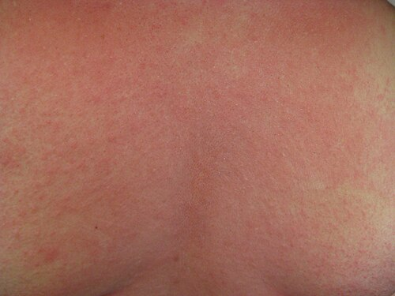
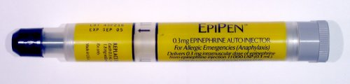

# ANAFILAXIA E MANEJO AGUDO: ADRENALINA IM E ALTA SEGURA

A anafilaxia é a "emergência das emergências" na Alergologia e Imunologia. Se você não agir rápido, o paciente morre. Se você agir certo, o resultado é quase imediato. Nas provas de residência, o examinador não quer apenas saber se você conhece a dose da adrenalina; ele quer saber se você reconhece o quadro precocemente e se tem a segurança de tratar antes mesmo de ter certeza absoluta, porque na anafilaxia, a dúvida mata.

## Fisiopatologia: Por que o corpo "explode" em inflamação?

Para entender o manejo, você precisa entender o que está acontecendo nos vasos e tecidos do seu paciente. A anafilaxia clássica é uma reação de **Hipersensibilidade Tipo I (Gell e Coombs)**, mediada por anticorpos IgE.

Imagine que o paciente já foi sensibilizado a um alérgeno (veneno de abelha, amendoim, penicilina). O corpo produziu IgE específica que está "sentada" na superfície de mastócitos e basófilos. Quando o alérgeno entra novamente, ele faz uma ponte entre essas IgEs. Isso causa uma degranulação explosiva.

O que sai de dentro dessas células? Principalmente **histamina**, mas também triptase, leucotrienos e prostaglandinas.

- A histamina causa vasodilatação sistêmica (queda da resistência vascular periférica → choque) e aumento da permeabilidade vascular (extravasamento de líquido para o terceiro espaço → edema e urticária).

- Nos pulmões, temos bronconstrição e hipersecreção de muco.

- No trato gastrointestinal, há aumento da motilidade.

**Dica do Dr. Will:** Lembre-se que existe a reação anafilactoide (termo antigo, hoje chamado de anafilaxia não imunológica). O quadro clínico é idêntico, mas não depende de IgE. Ocorre por ativação direta do mastócito (ex: contraste radiológico, opioides, AINEs). Para a prova e para a conduta, o tratamento é exatamente o mesmo.

## Diagnóstico: Os Critérios do NIAID/FAAN

*Figura 1 - Rash urticariforme no tronco de paciente em anafilaxia. As lesões cutâneas (urticária, angioedema) estão presentes em 80-90% dos casos, mas sua ausência não exclui o diagnóstico. Fonte: James Heilman, MD, CC BY-SA 3.0 | Wikimedia Commons*

Muitos alunos erram questões por esperarem o paciente estar chocado para diagnosticar anafilaxia. Erro fatal. O diagnóstico é **estritamente clínico**. Não se pede exame laboratorial para decidir se vai aplicar adrenalina.

Segundo a diretriz da ASBAI (Associação Brasileira de Alergia e Imunologia) e o consenso mundial da WAO (World Allergy Organization), o diagnóstico é altamente provável se um dos três critérios abaixo for preenchido:

### Critério 1: Início agudo com envolvimento de pele/mucosa + 1 sistema

Este é o cenário mais comum (80-90% dos casos).

- Início agudo (minutos a horas) de sintomas na pele ou mucosa (urticária generalizada, prurido, flushing, edema de lábios/língua/úvula).

- **E PELO MENOS UM DOS SEGUINTES:**

- Comprometimento respiratório (dispneia, sibilância, estridor, hipoxemia).

- Queda da pressão arterial ou disfunção de órgão-alvo (síncope, hipotonia, incontinência).

### Critério 2: Dois ou mais sistemas após exposição a alérgeno provável

Aqui, o paciente foi exposto a algo que ele provavelmente tem alergia. Se ele apresentar **dois ou mais** dos seguintes, é anafilaxia:

- Envolvimento cutâneo-mucoso.

- Comprometimento respiratório.

- Queda da PA ou sintomas de choque.

- Sintomas gastrointestinais persistentes (cólica abdominal intensa, vômitos repetidos).

**Pegadinha de prova:** Note que o sintoma gastrointestinal isolado não fecha critério no item 1, mas fecha no item 2. Se o paciente comeu camarão e começou com urticária e vômitos, é anafilaxia.

### Critério 3: Queda da PA após exposição a alérgeno conhecido

Se o paciente sabe que é alérgico a picada de abelha, é picado e a pressão cai, você não precisa de urticária ou falta de ar para diagnosticar. É anafilaxia.

- **Adultos:** PA sistólica < 90 mmHg ou queda > 30% da linha de base.

- **Crianças:** PA sistólica baixa para a idade ou queda > 30%.

| Sistema | Manifestações Clínicas |
| --- | --- |
| **Cutâneo (80-90%)** | Urticária, angioedema, prurido, calor, eritema. |
| **Respiratório (70%)** | Estridor (edema de glote), sibilos, dispneia, tosse, coriza. |
| **Gastrointestinal (45%)** | Náuseas, vômitos, cólicas, diarreia. |
| **Cardiovascular (45%)** | Hipotensão, taquicardia (ou bradicardia paradoxal), choque, arritmias. |

## O Pilar do Tratamento: Adrenalina (Epinefrina)

Se você sair desta aula lembrando apenas uma coisa, que seja: **Adrenalina IM é a primeira, segunda e terceira conduta.**

Por que IM e não SC (subcutânea)? Estudos mostram que a absorção na face anterolateral da coxa (vasto lateral) é muito mais rápida e atinge picos plasmáticos maiores do que a via subcutânea ou a aplicação no deltoide. O músculo da coxa é altamente vascularizado e a adrenalina ali age rápido para reverter a vasodilatação e a bronconstrição.

### Dose e Administração

- **Dose Adulto:** 0,3 a 0,5 mg (0,3 a 0,5 mL da solução 1:1.000).

- **Dose Pediátrica:** 0,01 mg/kg (máximo de 0,3 mg por dose).

- **Via:** Intramuscular, face anterolateral da coxa.

- **Intervalo:** Pode ser repetida a cada 5 a 15 minutos se não houver melhora.

**Erro clássico de prova:** A alternativa dirá para "diluir a adrenalina em 10mL de soro e fazer IM". **Errado!** A adrenalina para uso IM é usada pura (concentração 1mg/mL ou 1:1.000). A diluição é reservada para o uso intravenoso em ambiente de UTI/Emergência monitorada.

### Por que a Adrenalina funciona?

- **Alfa-1 adrenérgico:** Causa vasoconstrição, aumentando a resistência vascular periférica (sobe a PA) e reduzindo o edema de glote e a urticária.

- **Beta-1 adrenérgico:** Aumenta a contratilidade e a frequência cardíaca (inotrópico e cronotrópico positivo).

- **Beta-2 adrenérgico:** Promove broncodilatação e, o mais importante, **estabiliza a membrana dos mastócitos**, impedindo que eles continuem liberando mediadores.

**Atenção:** Não existe contraindicação absoluta ao uso de adrenalina na anafilaxia. Mesmo em idosos ou cardiopatas, o risco de morrer pela anafilaxia supera o risco de uma arritmia pela droga.

## Manejo Passo a Passo na Emergência

Ao receber o paciente, a equipe deve agir de forma coordenada. No MedEvo, sempre reforçamos a sistematização:

- **Remover o gatilho:** Se for uma infusão de contraste ou antibiótico, pare imediatamente. Se for um ferrão de abelha, remova-o (raspando, não espremendo).

- **Pedir ajuda e Adrenalina IM:** Não espere o acesso venoso. Aplique a adrenalina primeiro.

- **Posicionamento:** Decúbito dorsal com pernas elevadas (Trendelenburg reverso). Isso favorece o retorno venoso.

- *Cuidado:* Se o paciente estiver vomitando, use a posição lateral. Se estiver com desconforto respiratório grave, ele pode preferir ficar sentado, mas cuidado com a "síndrome do ventrículo vazio" ao levantá-lo bruscamente.

- **Oxigênio:** Máscara de alta concentração (10-15 L/min).

- **Expansão Volêmica:** Acesso venoso calibroso e Soro Fisiológico 0,9% ou Ringer Lactato.

- **Dose:** 20 mL/kg em bólus rápido. Pacientes anafiláticos podem perder até 35% do volume intravascular para o terceiro espaço em minutos.

- **Monitorização:** Oximetria, ECG e PA não invasiva.

## Medicamentos de Segunda Linha (Adjuvantes)

Aqui é onde muitos alunos perdem tempo e a banca adora cobrar. **Anti-histamínicos e Corticoides NÃO tratam anafilaxia aguda.** Eles não salvam vidas no momento do choque.

- **Anti-histamínicos (H1 e H2):** Servem apenas para sintomas cutâneos (prurido e urticária). Use difenidramina ou prometazina (H1) associada a ranitidina ou cimetidina (H2). Eles não revertem obstrução de via aérea ou hipotensão.

- **Corticoides (Metilprednisolona ou Hidrocortisona):** Demoram de 4 a 6 horas para começar a agir. Sua principal função é tentar prevenir a **Reação Bifásica** (aquele retorno dos sintomas horas depois do quadro inicial).

- **Beta-2 agonistas inalatórios (Salbutamol):** Úteis se houver broncoespasmo (sibilos) persistente após a adrenalina. Lembre-se: o salbutamol não trata edema de glote (estridor), quem trata isso é a adrenalina.

## Situações Especiais e Casos Refratários

### O Paciente em uso de Beta-bloqueador

Este é um clássico das provas. O beta-bloqueador "ocupa" o receptor onde a adrenalina deveria agir. O resultado? A adrenalina não funciona bem e pode haver uma vasoconstrição alfa-1 sem oposição, gerando bradicardia e hipertensão paradoxal ou choque refratário.

- **Conduta:** Se o paciente não responde à adrenalina, use **GLUCAGON**.

- **Por que?** O glucagon tem um receptor próprio no coração que ativa a adenilato ciclase independentemente do receptor beta, exercendo efeito inotrópico e cronotrópico positivo.

### Choque Refratário

Se após 2 ou 3 doses de adrenalina IM e expansão volêmica vigorosa o paciente continua chocado, você deve iniciar **Adrenalina IV contínua**.

- Isso deve ser feito em bomba de infusão, com monitorização cardíaca contínua, preferencialmente em ambiente de terapia intensiva.

### Diagnóstico Diferencial

Nem tudo que incha e coça é anafilaxia.

- **Síncope Vasovagal:** O paciente fica pálido, tem bradicardia e pele fria. Na anafilaxia, geralmente há taquicardia e a pele pode estar quente/eritematosa inicialmente.

- **Crise de Pânico:** Pode haver dispneia e taquicardia, mas não há urticária, angioedema ou hipotensão real.

- **Aspiração de Corpo Estranho:** Início súbito de estridor, mas sem sintomas cutâneos.

- **Angioedema por IECA:** Geralmente apenas edema de face/língua, sem urticária e sem choque. O mecanismo é a bradicinina, não a histamina.

| Condição | Diferencial Chave |
| --- | --- |
| **Síncope Vasovagal** | Bradicardia, palidez, ausência de lesões de pele. |
| **Crise de Asma** | Ausência de sintomas cutâneos ou hipotensão. |
| **Urticária Aguda** | Apenas pele; sem sintomas sistêmicos (resp/CV/GI). |
| **Angioedema Hereditário** | Edema sem urticária, história familiar, início mais lento. |

## Observação e Alta Segura

Você tratou o paciente, ele melhorou. Pode mandar para casa? **Não imediatamente.**

Existe o risco da **Reação Bifásica**. Em até 20% dos casos, os sintomas retornam 1 a 72 horas após a resolução do quadro inicial (geralmente nas primeiras 8-12 horas), mesmo sem nova exposição ao alérgeno.

**Tempo de Observação Recomendado:**

- Sintomas leves (apenas cutâneos que responderam rápido): 4 a 6 horas.

- Sintomas graves ou instabilidade hemodinâmica: 12 a 24 horas (internação).

### Critérios para Alta Segura

Para o paciente ir embora, ele precisa:

- Estar assintomático há pelo menos 4-6 horas.

- Receber prescrição de **Adrenalina Autoinjetável** (se disponível no Brasil, como o EpiPen, embora o acesso ainda seja difícil e muitas vezes dependa de importação).

- Receber um plano de ação por escrito (o que fazer se os sintomas voltarem).

- Prescrição de anti-histamínico e corticoide oral por 3 a 5 dias (para conforto e redução de risco de sintomas tardios).

- Encaminhamento obrigatório para o **Alergista**.

**Dica de Prova:** A dosagem de **Triptase Sérica** pode ajudar a confirmar o diagnóstico retrospectivamente. Ela deve ser colhida entre 1 e 2 horas após o início dos sintomas. Se vier alta, confirma ativação de mastócitos. Se vier normal, não exclui anafilaxia.

## Resumo do Manejo Farmacológico

| Medicação | Dose (Adulto) | Papel na Anafilaxia |
| --- | --- | --- |
| **Adrenalina 1:1.000** | 0,3 - 0,5 mg IM | **1ª Linha.** Salva vidas. |
| **SF 0,9%** | 20 mL/kg IV | Expansão volêmica no choque. |
| **Glucagon** | 1 - 5 mg IV (lento) | Se uso de Beta-bloqueador. |
| **Difenidramina** | 25 - 50 mg IV/IM | 2ª Linha. Apenas para urticária/prurido. |
| **Hidrocortisona** | 200 - 500 mg IV | 2ª Linha. Prevenção de fase tardia. |
| **Salbutamol** | 2,5 - 5 mg (nebulização) | Adjuvante para broncoespasmo. |

## Pontos-Chave para Prova 🚀

- **Diagnóstico é CLÍNICO:** Não espere exames. Envolvimento de ≥ 2 sistemas após alérgeno provável = Anafilaxia.

- **Adrenalina IM é a prioridade:** Dose 0,3-0,5 mg em adultos; 0,01 mg/kg em crianças. Local: Vasto lateral da coxa.

- **Via de administração:** IM é superior à SC. IV é apenas para choque refratário e por especialistas.

- **Pele nem sempre está presente:** Em 10-20% dos casos (especialmente nos mais graves e rápidos), as lesões cutâneas podem não aparecer.

- **Beta-bloqueadores:** Se o paciente usa e não responde à adrenalina, a resposta é **Glucagon**.

- **Corticoides e Anti-histamínicos:** São adjuvantes. Nunca devem atrasar a aplicação da adrenalina.

- **Reação Bifásica:** Ocorre em até 20% dos casos. Por isso, o tempo mínimo de observação é de 4-6 horas.

- **Triptase Sérica:** É o marcador laboratorial de escolha, colhido idealmente em 1-2 horas após o início do quadro.

- **Picada de Solenopsis (Formiga de fogo):** Caracteriza-se por pústulas estéreis que aparecem após 24h. Se houver sintomas sistêmicos imediatos, trate como anafilaxia.

- **Alta Segura:** Sempre orientar evitar o gatilho, prescrever adrenalina autoinjetável e encaminhar ao especialista.

- **Erro comum:** Achar que hipotensão é obrigatória. Não é! Edema de glote com PA normal já é anafilaxia grave.

- **Mortalidade:** As principais causas de morte na anafilaxia são o edema de vias aéreas superiores (asfixia) e o colapso circulatório (choque).

- **Posicionamento:** Manter o paciente em decúbito dorsal com pernas elevadas para evitar o colapso circulatório súbito.

- **Contraindicações:** Não há contraindicação absoluta para adrenalina IM na anafilaxia.

Lembre-se do que sempre discutimos no MedEvo: na prova, se o enunciado descreve um paciente que comeu algo ou foi picado e começou a "inchar" ou "chiar", a resposta quase certamente será "Adrenalina IM". Não perca tempo com acessos venosos difíceis ou corticoides milagrosos antes de garantir a dose na coxa.

 Cópia offline para consulta pessoal.
 Fonte original:
 [https://www.medevo.com.br/material-apoio/ler/bac40ea5-108f-4345-92a4-b4b7e2099773](https://www.medevo.com.br/material-apoio/ler/bac40ea5-108f-4345-92a4-b4b7e2099773)
