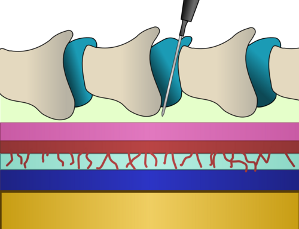
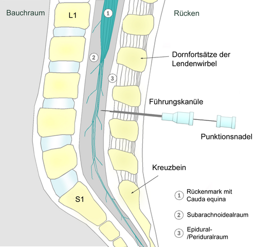

# ANALGESIA E ANESTESIA NO PARTO

Para entender analgesia obstétrica, você precisa primeiro tirar da cabeça a ideia de que anestesia é apenas "dar um tiro" de medicação nas costas da paciente. Na obstetrícia, lidamos com dois binômios fundamentais: a fisiologia do trabalho de parto e a segurança materno-fetal. Se você entender por que a dor acontece e como ela muda ao longo do parto, as técnicas anestésicas deixam de ser uma lista para decorar e passam a ser uma escolha lógica.

Muitos alunos erram questões básicas por não diferenciarem a dor da fase de dilatação da dor da fase de expulsão. Vamos começar por aí, pois é a base de tudo o que a FEBRASGO e o Ministério da Saúde preconizam.

## Fisiologia da Dor no Parto: O Porquê do Sofrimento

A dor no parto não é estática. Ela evolui em localização, tipo de fibra nervosa e intensidade. No primeiro estágio do trabalho de parto (fase de dilatação), a dor é predominantemente visceral. Ela é causada pela dilatação do colo uterino e pelas contrações do segmento inferior do útero.

Esses estímulos viajam por fibras do tipo C (lentas e amielínicas) e entram na medula espinhal nos níveis de T10 a L1. É por isso que, no início, a gestante sente uma dor mal localizada, referida na região lombar e no baixo ventre.

Já no segundo estágio (fase de expulsão), o cenário muda. Além da contração uterina, temos a distensão da vagina, do períneo e do assoalho pélvico pela passagem do feto. Aqui, a dor é somática, transmitida por fibras A-delta (rápidas e mielinizadas) através do nervo pudendo, alcançando os segmentos sacrais S2 a S4.

**Dica de prova:** As bancas adoram perguntar qual o nível medular de cada fase. Lembre-se: Fase 1 = T10-L1 (Lombar alta/Torácica baixa). Fase 2 = S2-S4 (Sacral). Se você fizer um bloqueio que só pega T10, a paciente ainda vai sentir muita dor na hora que o bebê estiver coroando.

### A Tríade de Dick-Read: Medo, Tensão e Dor

O Dr. Grantly Dick-Read, um precursor do parto natural, descreveu que o medo gera tensão muscular, que por sua vez aumenta a percepção da dor. Esse ciclo vicioso aumenta a liberação de catecolaminas (adrenalina e noradrenalina), que podem reduzir o fluxo sanguíneo uteroplacentário e até diminuir a contratilidade uterina.

Por isso, quando o Dr. Will ou qualquer preceptor insistir em métodos não farmacológicos, não é apenas "humanização" por ideologia, é fisiologia. Reduzir o medo reduz a dor e melhora o desfecho do parto.

## Métodos Não Farmacológicos: A Primeira Linha de Defesa

De acordo com a Diretriz Nacional de Assistência ao Parto Normal do Ministério da Saúde, os métodos não farmacológicos devem ser oferecidos a todas as mulheres antes de partirmos para as drogas. O objetivo aqui é o suporte emocional e físico.

- **Suporte Contínuo (Acompanhante):** Ter alguém de confiança reduz a necessidade de analgesia regional e aumenta a satisfação da mulher. É a intervenção com melhor custo-benefício.

- **Banho de Imersão e Chuveiro:** A água morna promove relaxamento muscular e reduz a pressão hidrostática, o que alivia a dor. Cuidado: o banho de imersão é mais eficaz na fase ativa (após 4-5 cm de dilatação).

- **Massagens e Técnicas de Relaxamento:** Estimulam fibras nervosas periféricas que "fecham o portão" para a dor na medula (Teoria das Comportas).

- **TENS (Estimulação Elétrica Transcutânea):** É aceitável, embora as evidências de redução de dor intensa sejam menores que o banho, mas é uma opção válida e muito cobrada em provas como método não farmacológico.

- **Liberdade de Posição:** Ficar deitada (litotomia) no primeiro estágio é o pior cenário. Posições verticais ajudam a gravidade e o encaixe fetal, reduzindo o tempo de trabalho de parto.

| Método | Mecanismo Principal | Recomendação (MS) |
| --- | --- | --- |
| Acompanhante | Suporte emocional / Redução de ansiedade | Forte recomendação |
| Banho de imersão | Relaxamento muscular / Teoria das comportas | Recomendado na fase ativa |
| Massagem lombar | Contraestímulo sensorial | Recomendado |
| TENS | Bloqueio da condução nervosa (portão) | Opção válida |
| Bola suíça | Mobilidade pélvica / Relaxamento | Recomendado |

## Analgesia Farmacológica Sistêmica

Quando os métodos não farmacológicos não são suficientes e a paciente solicita alívio, entramos no campo farmacológico. Aqui, o cuidado é dobrado: tudo o que você dá para a mãe atravessa a placenta.

### Opioides Sistêmicos

A Meperidina foi muito usada no passado, mas hoje é desencorajada por muitas diretrizes devido ao seu metabólito (normeperidina), que tem meia-vida longa no recém-nascido e causa depressão respiratória prolongada.

O Remifentanil em bomba de infusão controlada pela paciente (PCA) tem ganhado espaço por ter uma meia-vida curtíssima, sendo metabolizado por esterases plasmáticas tanto na mãe quanto no feto.

### O Perigo dos Benzodiazepínicos

**Atenção total aqui:** Nunca use benzodiazepínicos (como o Diazepam ou Midazolam) para "acalmar" uma gestante em trabalho de parto. Eles atravessam a placenta e causam a "Síndrome do Bebê Mole" (Floppy Infant Syndrome), caracterizada por hipotonia, hipotermia, dificuldade de sucção e depressão respiratória no RN. As bancas amam colocar isso como alternativa correta para "o que não fazer".

### Óxido Nitroso

Uma mistura de 50% de óxido nitroso e 50% de oxigênio (Entonox) pode ser inalada pela paciente. É seguro, não afeta a contratilidade uterina e tem rápida eliminação. O problema é que o alívio da dor é modesto, funcionando mais como um ansiolítico.

## Analgesia Regional: O Padrão-Ouro

*Figura 1 - Representação diagramática de um corte longitudinal sagital da coluna vertebral, mostrando o espaço epidural onde o cateter peridural é posicionado. Fonte: Southwest, CC BY-SA 4.0 | Wikimedia Commons*

Se a questão de prova pergunta qual a técnica mais eficaz para o alívio da dor no parto, a resposta é: **Analgesia Regional (Neuroaxial)**. Ela permite que a mulher fique acordada, participe do processo e tenha um bloqueio sensitivo de alta qualidade.

### 1. Analgesia Epidural (Peridural)

É a técnica mais flexível. Introduzimos um cateter no espaço epidural, permitindo doses repetidas ou infusão contínua.

- **Vantagem:** Permite titular o bloqueio. Se o parto evoluir para uma cesariana de urgência, você já tem o cateter no lugar para fazer uma dose anestésica.

- **Desvantagem:** Início de ação mais lento (15-20 minutos).

### 2. Raquianestesia

*Figura 2 - Diagrama mostrando o princípio da raquianestesia: a agulha espinhal é introduzida entre os processos espinhosos de L3/L4, atravessando até o espaço subaracnoide para injeção de anestésicos locais. Fonte: PhilippN, CC BY-SA 3.0 | Wikimedia Commons*
Consiste na injeção de anestésico diretamente no líquido cefalorraquidiano (espaço subaracnoide).

- **Vantagem:** Início imediato e bloqueio motor mais intenso.

- **Desvantagem:** Duração limitada (não há cateter, é dose única). Geralmente reservada para o período expulsivo iminente ou cesariana.

### 3. Técnica Combinada (Duplo Bloqueio)

É o "estado da arte". Você faz uma raqui para alívio imediato e deixa um cateter epidural para manutenção. É excelente para primigestas que ainda têm um longo caminho pela frente.

**Exemplo Clínico:** Imagine uma primigesta com 3 cm de dilatação, extremamente ansiosa e com dor nota 10. Antigamente, dizia-se que precisava esperar chegar aos 4 ou 5 cm para não "parar o parto". **Esqueça isso.** Segundo a FEBRASGO e a ASA (American Society of Anesthesiologists), a analgesia deve ser iniciada a pedido da paciente, independentemente da dilatação cervical. No MedEvo, sempre reforçamos: não se nega analgesia por "falta de dilatação".

### Impactos da Analgesia Regional no Parto

Este é o tópico que mais cai em provas de residência. Você precisa saber o que a analgesia regional FAZ e o que ela NÃO FAZ:

- **NÃO aumenta** a taxa de cesariana.

- **NÃO aumenta** o risco de dor nas costas crônica.

- **PODE prolongar** o segundo estágio (expulsivo) em cerca de 15 a 20 minutos.

- **AUMENTA** a chance de parto vaginal instrumental (fórceps ou vácuo-extrator), pois a paciente perde um pouco da sensação de puxo e o tônus da musculatura do assoalho pélvico diminui, dificultando a rotação interna da cabeça fetal.

## Bloqueio do Nervo Pudendo

O bloqueio do nervo pudendo é uma técnica essencial para o obstetra, especialmente em partos vaginais assistidos (fórceps) ou quando há necessidade de uma episiotomia ou reparo de lacerações extensas.

**Anatomia Crítica:** O nervo pudendo (S2-S4) passa próximo à espinha isquiática. Para realizar o bloqueio, o médico palpa a espinha isquiática através da parede vaginal e injeta o anestésico local (geralmente lidocaína) logo atrás dela, onde o nervo passa pelo forame isquiático menor.

- **Indicação:** Analgesia do períneo e terço inferior da vagina no período expulsivo.

- **O que ele NÃO bloqueia:** A dor das contrações uterinas (que vem de T10-L1). Portanto, o bloqueio de pudendo é para o "finalzinho" e para o períneo, não para o trabalho de parto inteiro.

## Anestesia para Cesariana

Quando o parto precisa ser cirúrgico, as opções mudam de foco: saímos da analgesia (alívio da dor mantendo movimento) para a anestesia (bloqueio total de dor e movimento).

### Raquianestesia (Primeira Escolha)

É a técnica de eleição para cesarianas eletivas e a maioria das urgências.

- **Por que?** É rápida, confiável e evita as complicações da via aérea e da anestesia geral.

- **Nível do bloqueio:** Para uma cesariana, precisamos de um nível sensitivo até **T4** (linha dos mamilos). Por que tão alto se o corte é lá embaixo? Porque a manipulação do peritônio e a exteriorização do útero causam estímulos vagais e dor referida alta.

### Anestesia Geral

Reservada para situações de extrema emergência (ex: prolapso de cordão com bradicardia fetal mantida, descolamento prematuro de placenta com choque) ou quando a anestesia regional é contraindicada.

- **O maior risco:** Aspiração pulmonar do conteúdo gástrico (Síndrome de Mendelson). A gestante é sempre considerada "estômago cheio" devido à compressão mecânica do útero e à progesterona, que lentifica o esvaziamento gástrico.

- **Técnica:** Indução em sequência rápida com compressão da cartilagem cricoide (Manobra de Sellick).

| Técnica | Indicação Principal | Vantagem | Risco Principal |
| --- | --- | --- | --- |
| Raquianestesia | Cesariana Eletiva/Urgência | Início rápido, mãe acordada | Hipotensão arterial |
| Epidural | Parto Vaginal / Cesariana | Titulação, uso de cateter | Punção dural acidental |
| Geral | Emergência Extrema | Rapidez na indução | Aspiração / Via aérea difícil |

## Complicações da Analgesia e Anestesia Regional

Você não pode ir para a prova sem dominar as complicações. Elas são o "prato principal" das questões de anestesia obstétrica.

### 1. Hipotensão Arterial

É a complicação mais comum após o bloqueio neuroaxial (raqui ou epidural).

- **Fisiopatologia:** O anestésico bloqueia as fibras simpáticas pré-ganglionares (simpatectomia química), levando à vasodilatação periférica e redução do retorno venoso.

- **Tratamento:**

- Desvio do útero para a esquerda (aliviar compressão da veia cava).

- Expansão volêmica (cristaloides).

- Vasopressores: A **Fenilefrina** é hoje a primeira escolha (menos acidose fetal que a efedrina), mas a Efedrina ainda é muito citada em provas.

- **Erro clássico:** Achar que se usa uterotônico (Ocitocina) para tratar hipotensão de anestesia. Pelo contrário, a ocitocina em bolus pode PIORAR a hipotensão.

### 2. Cefaleia Pós-Punção Dural (CPPD)

Ocorre quando a agulha (especialmente a de epidural, que é grossa) perfura acidentalmente a dura-máter, causando vazamento de líquor.

- **Clínica:** Cefaleia frontal ou occipital que piora muito na posição ortostática (em pé) e melhora ao deitar.

- **Tratamento:** Hidratação, cafeína, analgésicos. Se não resolver, o tratamento definitivo é o **Blood Patch** (Tampão Sanguíneo Epidural), onde injetamos sangue autólogo no espaço epidural para "selar" o furo.

### 3. Toxicidade Sistêmica dos Anestésicos Locais (LAST)

Ocorre se o anestésico for injetado acidentalmente dentro de um vaso sanguíneo.

- **Sintomas:** Gosto metálico na boca, zumbido, dormência perioral, evoluindo para convulsões e parada cardiorrespiratória.

- **Antídoto:** Emulsão lipídica a 20%.

## Contraindicações à Anestesia Regional

Este tópico é "decoreba" obrigatória, pois cai direto.

**Contraindicações Absolutas:**

- Recusa da paciente (autonomia).

- Infecção no local da punção (risco de meningite).

- Coagulopatia grave ou Trombocitopenia severa.

- Qual o valor de corte? Para a maioria das diretrizes, **plaquetas abaixo de 70.000 a 80.000/mm³** contraindicam o bloqueio neuroaxial pelo risco de hematoma epidural (que pode causar paraplegia).

- Hemorragia materna não controlada com choque hipovolêmico (a vasodilatação do bloqueio causaria colapso circulatório).

**Contraindicações Relativas:**

- Estenose aórtica ou mitral grave (não toleram queda na pré-carga).

- Neuropatias pré-existentes.

- Plaquetopenia moderada (entre 80k e 100k) - deve-se avaliar a tendência de queda.

## Situações Especiais: Pré-eclâmpsia e Jejum

### Pré-eclâmpsia

A paciente com pré-eclâmpsia é um desafio. Ela está "encharcada" no interstício, mas hipovolêmica no intravascular.

- A anestesia regional é PREFERÍVEL à geral, pois ajuda a controlar a pressão arterial e evita a resposta hipertensiva da intubação (que pode causar AVC).

- **O limite:** Sempre cheque as plaquetas antes de puncionar. Se houver plaquetopenia < 75.000, a conduta muda.

### Jejum no Trabalho de Parto

As diretrizes da ASA e da FEBRASGO mudaram a visão rígida do passado.

- **Líquidos claros (água, suco sem gomos, chá, isotônicos):** Permitidos até **2 horas** antes do procedimento (ou durante o trabalho de parto de baixo risco).

- **Sólidos:** Jejum de 6 a 8 horas.
No trabalho de parto ativo, a recomendação é permitir líquidos claros para evitar a cetose e a desidratação, mas evitar sólidos devido ao risco de aspiração caso uma cesariana de emergência seja necessária.

## Anatomia do Nervo Pudendo e Inervação Perineal

Para fechar o entendimento do período expulsivo, vamos detalhar a anatomia que as bancas de anatomia pélvica adoram misturar com obstetrícia.

O nervo pudendo origina-se do plexo sacral (S2, S3, S4). Ele sai da pelve pelo forame isquiático maior, passa por trás do ligamento sacroespinhoso (perto da espinha isquiática) e reentra no períneo pelo forame isquiático menor.

Ele se divide em três ramos principais:

- **Nervo Hemorroidário Inferior:** Inerva o esfíncter anal e a pele perianal.

- **Nervo Perineal:** Inerva os músculos do períneo e o escroto/grandes lábios.

- **Nervo Dorsal do Clitóris/Pênis:** Inerva a sensibilidade profunda.

Quando você faz o bloqueio de pudendo, você está tentando atingir o tronco principal antes dessa divisão, garantindo anestesia de todo o assoalho pélvico.

## Pontos-Chave para Prova

- **Fases da Dor:** Fase 1 (Dilatação) é visceral, T10-L1. Fase 2 (Expulsivo) é somática, S2-S4 (Nervo Pudendo).

- **Indicação de Analgesia:** A pedido da paciente, independentemente da dilatação cervical. Não se deve esperar os 4 cm se a dor for intensa.

- **Métodos Não Farmacológicos:** Devem ser oferecidos primeiro. Banho de imersão é eficaz na fase ativa. Suporte contínuo é o padrão-ouro de humanização.

- **Benzodiazepínicos:** Contraindicados no TP. Causam hipotonia e depressão neonatal (Síndrome do Bebê Mole).

- **Analgesia Regional e Cesárea:** A analgesia de parto NÃO aumenta o risco de cesariana, mas aumenta o risco de parto instrumental (fórceps).

- **Hipotensão Pós-Bloqueio:** Complicação mais comum. Tratar com decúbito lateral esquerdo, fluidos e vasopressores (Fenilefrina/Efedrina).

- **Cefaleia Pós-Raqui:** Posicional (piora em pé). Tratamento definitivo é o Blood Patch.

- **Plaquetopenia:** Contraindicação absoluta para bloqueio neuroaxial se < 70.000-80.000/mm³. Risco de hematoma epidural.

- **Anestesia Geral:** Risco principal é a aspiração pulmonar (Síndrome de Mendelson). Requer indução em sequência rápida e manobra de Sellick.

- **Jejum:** Líquidos claros são permitidos até 2 horas antes em pacientes de baixo risco.

- **Bloqueio de Pudendo:** Referência anatômica é a espinha isquiática. Essencial para fórceps e episiotomia.

- **Tríade de Dick-Read:** Medo-Tensão-Dor. O objetivo dos métodos psicofísicos é quebrar esse ciclo.

- **Efeito no RN:** Opioides sistêmicos (especialmente Meperidina) podem causar depressão respiratória neonatal. Analgesia regional bem feita tem impacto mínimo no Apgar.

- **Simpatectomia:** É o mecanismo da hipotensão na anestesia regional (bloqueio das fibras simpáticas que correm junto com os nervos espinhais). 💡

Como o Dr. Will sempre diz nas discussões de caso do MedEvo, a melhor anestesia é aquela que garante a segurança da mãe e do bebê, respeitando o protagonismo da mulher. Se você dominar a diferença entre a dor visceral e somática e souber manejar a hipotensão e a plaquetopenia, você acerta qualquer questão sobre esse tema.

 Cópia offline para consulta pessoal.
 Fonte original:
 [https://www.medevo.com.br/material-apoio/ler/b096e832-fb9e-4911-bf26-d89b80747f6a](https://www.medevo.com.br/material-apoio/ler/b096e832-fb9e-4911-bf26-d89b80747f6a)
