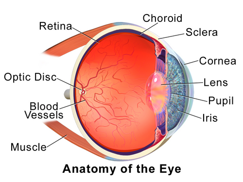
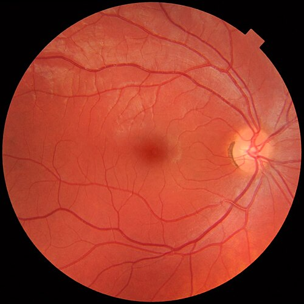

# ANATOMIA E EMBRIOLOGIA

Para entender a oftalmologia de verdade, você precisa parar de ver o olho como uma "bolinha" isolada e passar a enxergá-lo como uma extensão do sistema nervoso central envolta por estruturas de suporte altamente especializadas. Se você dominar a base que vou te passar agora, as questões de glaucoma, retina e estrabismo vão deixar de ser decoreba e passarão a ser puramente lógicas.

## Embriologia Ocular: Onde Tudo Começa

A embriologia é o terror de muitos residentes, mas as bancas amam porque é fácil criar pegadinhas trocando as origens teciduais. O segredo aqui é entender que o olho deriva de três folhetos principais: ectoderma (dividido em neuroectoderma e ectoderma de superfície), mesoderma e as células da crista neural.

### Neuroectoderma: O "Cérebro" do Olho

Tudo começa por volta da 3ª semana de gestação. O sulco neural se fecha e forma o tubo neural. O olho surge como uma evaginação desse tubo, as vesículas ópticas. Por isso, o nervo óptico não é um nervo periférico comum, ele é um trato do sistema nervoso central.

Do neuroectoderma derivam:

- Retina (tanto o epitélio pigmentado quanto a retina neurossensorial).

- Fibras do nervo óptico.

- Músculos esfíncter e dilatador da pupila (Cuidado: esta é uma exceção clássica de prova, pois a maioria dos músculos do corpo vem do mesoderma, mas os da íris vêm do neuroectoderma).

- Epitélio posterior da íris e do corpo ciliar.

### Ectoderma de Superfície: As Lentes e o Revestimento

Pense no ectoderma de superfície como o que "vem de fora". Quando a vesícula óptica toca o ectoderma de superfície, ela induz a formação da placa do cristalino.

Do ectoderma de superfície derivam:

- Cristalino.

- Epitélio da córnea.

- Glândula lacrimal.

- Epitélio da conjuntiva e anexos (cílios, glândulas de Meibomius).

### Crista Neural: O "Curinga" da Oftalmologia

Se você tiver que chutar a origem de alguma estrutura estrutural do olho na prova, chute crista neural. Ela é responsável por quase todo o arcabouço do globo ocular.

Da crista neural derivam:

- Estroma da córnea e endotélio corneano (Sim, o endotélio não é epitélio de superfície!).

- Esclera.

- Malha trabecular.

- Estroma da íris e do corpo ciliar.

- Melanócitos uveais.

### Mesoderma: O Sangue e os Músculos

O mesoderma contribui com a parte vascular e os músculos extraoculares.

- Endotélio vascular.

- Músculos extraoculares.

- Porção temporal da esclera (em parte).

**Tabela 1: Resumo das Origens Embriológicas**

| Origem | Estruturas Principais |
| --- | --- |
| **Neuroectoderma** | Retina, Nervo Óptico, Músculos da Íris, Epitélio Ciliar |
| **Ectoderma Superfície** | Cristalino, Epitélio Corneano, Glândula Lacrimal |
| **Crista Neural** | Estroma/Endotélio Corneano, Esclera, Trabeculado, Estroma da Íris |
| **Mesoderma** | Músculos Extraoculares, Endotélio Vascular |

### O Fechamento da Fissura Embrionária

Este é um ponto crítico. A vesícula óptica se invagina para formar o cálice óptico. Na parte inferior, fica uma abertura chamada fissura embrionária (ou fetal). Ela deve se fechar por volta da 6ª ou 7ª semana.

Se não fechar? Temos o **Coloboma**. O coloboma é sempre inferior ou inferonasal justamente porque é ali que a fissura se fecha por último. Se a prova te mostrar um coloboma superior, desconfie: ou é cirúrgico ou é uma síndrome muito rara, pois o embriológico "raiz" é inferior.

## A Órbita: A Casa do Olho

A órbita não é apenas um buraco no crânio. Ela tem formato de pirâmide quadrangular, com o ápice voltado para trás e a base para frente.

### Ossos da Órbita

São 7 ossos. Para decorar, pense nas paredes:

- **Teto:** Frontal e asa menor do esfenoide.

- **Assoalho:** Maxilar, zigomático e palatino (O palatino é o "intruso" que ninguém lembra, mas ele está lá no fundo).

- **Parede Lateral:** Zigomático e asa maior do esfenoide.

- **Parede Medial:** Etmoide, lacrimal, maxilar e esfenoide.

**Dica de Prova:** A parede mais fraca é o assoalho (causa das fraturas em *blow-out*), mas a parede mais fina é a lâmina papirácea do etmoide (parede medial). Por que isso importa? Porque sinusites etmoidais podem atravessar essa parede fina e causar celulite orbitária rapidamente, especialmente em crianças.

### Ápice Orbitário e Fendas

Aqui é onde o MedEvo foca, porque as bancas adoram anatomia de passagens nervosas.

- **Canal Óptico:** Passa o Nervo Óptico (NC II) e a Artéria Oftálmica.

- **Fissura Orbitária Superior (FOS):**

- **Acima do Anel de Zinn:** Nervo Lacrimal, Frontal e Troclear (NC IV), além da Veia Oftálmica Superior.

- **Dentro do Anel de Zinn:** Nervo Oculomotor (NC III - ramos superior e inferior), Nervo Abducente (NC VI) e Nervo Nasociliar.

**Erro Comum:** Achar que o Nervo Troclear (IV) passa dentro do anel de Zinn. Ele passa por fora! O anel de Zinn é a origem comum dos músculos retos. Se o paciente tem uma síndrome do ápice orbitário, ele perde a visão (nervo óptico) e a motilidade. Se for apenas a Síndrome da Fissura Orbitária Superior, a visão costuma estar preservada, mas o olho está "congelado".

## O Globo Ocular: Camadas e Dimensões

*Figura 1 - Corte transversal do globo ocular mostrando as três túnicas (fibrosa, vascular e nervosa), cristalino, câmaras anterior e posterior, humor vítreo e nervo óptico. Fonte: BruceBlaus/Blausen Medical, CC BY 3.0 | Wikimedia Commons*

Um olho adulto médio tem cerca de 24 mm de diâmetro anteroposterior. Se for muito maior (ex: 26 mm), o paciente é míope axial. Se for menor (ex: 21 mm), é hipermetrope.

O olho é dividido em três túnicas:

- **Fibrosa:** Córnea e Esclera.

- **Vascular (Úvea):** Íris, Corpo Ciliar e Coroide.

- **Nervosa:** Retina.

### A Córnea: A Lente Principal

A córnea é o principal elemento refrativo do olho, com cerca de 43 a 44 Dioptrias. Ela é avascular (precisa ser transparente!) e altamente inervada pelo nervo trigêmeo (V1 - ramo nasociliar).

As 5 camadas clássicas (da frente para trás):

- **Epitélio:** Estratificado, com grande capacidade de regeneração.

- **Camada de Bowman:** Uma zona acelular de colágeno. **Cuidado:** Se lesionar a Bowman, cicatriza com opacidade (leucoma). Ela não se regenera.

- **Estroma:** Corresponde a 90% da espessura. As fibras de colágeno são organizadas de forma perfeita para permitir a passagem da luz.

- **Membrana de Descemet:** A membrana basal do endotélio. Ao contrário da Bowman, ela se regenera e é muito resistente.

- **Endotélio:** Uma única camada de células hexagonais. **Pérola Clínica:** O endotélio humano não sofre mitose. Nascemos com cerca de 3.000 a 4.000 células/mm². Se elas morrerem por trauma ou cirurgia, as vizinhas apenas se esticam para cobrir o buraco. Se cair abaixo de 500-700 células/mm², a córnea descompensa e incha (edema de córnea).

### A Esclera e o Limbo

A esclera é o "branco do olho". Ela é mais espessa no polo posterior (1,0 mm) e mais fina logo atrás das inserções dos músculos retos (0,3 mm). Isso é vital em cirurgias: é nesse ponto fino que o risco de perfuração ocular é maior.

O **Limbo** é a zona de transição entre a córnea transparente e a esclera opaca. É onde ficam as *Stem Cells* (células-tronco) do epitélio corneano, nas paliçadas de Vogt. Se o paciente sofre uma queimadura química que destrói o limbo, ele perde a capacidade de renovar o epitélio da córnea, levando à "conjuntivalização" da córnea.

### A Úvea: O Trato Vascular

A úvea é o sistema de nutrição e controle de luz.

- **Íris:** O diafragma do olho. A cor depende da quantidade de melanina no estroma anterior. O epitélio posterior é sempre pigmentado (exceto no albinismo).

- **Corpo Ciliar:** Tem duas funções vitais. A *Pars Plicata* produz o humor aquoso. O músculo ciliar faz a **acomodação** (muda o formato do cristalino para enxergar de perto).

- **Coroide:** Uma rede vascular densa que nutre os fotorreceptores da retina.

### O Cristalino

Uma lente biconvexa, transparente e avascular. Ele cresce a vida toda! Novas fibras são formadas na periferia e empurram as antigas para o centro, o que explica por que o núcleo do cristalino fica mais denso com a idade (esclerose nuclear).

Ele é segurado pelas **Zônulas de Zinn**, que se ligam ao corpo ciliar. Quando o músculo ciliar contrai, a zônula relaxa, o cristalino fica mais arredondado e o poder dióptrico aumenta. Isso é a acomodação. Com o tempo, o cristalino perde elasticidade, gerando a presbiopia (vista cansada).

## A Retina: Onde a Mágica Acontece

A retina é um tecido complexo com 10 camadas. Para a prova, você não precisa decorar cada detalhe histológico de todas, mas precisa entender a hierarquia.

**As 10 camadas (de fora para dentro - do epitélio para o vítreo):**

- Epitélio Pigmentado da Retina (EPR).

- Camada de Fotorreceptores (Cones e Bastonetes).

- Membrana Limitante Externa.

- Nuclear Externa (corpos celulares dos fotorreceptores).

- Plexiforme Externa.

- Nuclear Interna (células bipolares, amácrinas, horizontais).

- Plexiforme Interna.

- Camada de Células Ganglionares (os axônios destas células formam o nervo óptico).

- Camada de Fibras Nervosas.

- Membrana Limitante Interna.

**Ponto de Atenção:** O descolamento de retina "clássico" ocorre entre a camada 1 (EPR) e a camada 2 (fotorreceptores). É um espaço virtual que remonta ao espaço entre as duas paredes do cálice óptico na embriologia. Por isso, o EPR fica colado na coroide, enquanto o restante da retina se solta.

### Mácula e Fóvea

*Figura 2 - Fotografia de fundo de olho normal, mostrando o disco óptico (à direita na imagem), a mácula (centro escuro) e a distribuição dos vasos retinianos arteriais e venosos. Fonte: Mikael Häggström, CC0/Domínio Público | Wikimedia Commons*

A mácula é a região central responsável pela visão de detalhes e cores. No centro da mácula está a fóvea.

- Na fóvea, temos apenas cones.

- As camadas internas da retina são "empurradas" para o lado para que a luz atinja os fotorreceptores diretamente.

- A fóvea é avascular (Zona Avascular Foveal - ZAF), sendo nutrida exclusivamente pela coroide subjacente.

## Músculos Extraoculares e Motilidade

Como o Dr. Will sempre enfatiza, motilidade ocular é geometria pura. Temos 6 músculos em cada olho: 4 retos e 2 oblíquos.

### Inervação (A Regra de Ouro)

- **LR6:** Reto Lateral pelo VI par (Abducente).

- **SO4:** Oblíquo Superior pelo IV par (Troclear).

- **R3:** Todos os outros (Reto Superior, Inferior, Medial e Oblíquo Inferior) pelo III par (Oculomotor).

### Ações dos Músculos

Aqui é onde o aluno se confunde. Lembre-se: os retos nascem no fundo da órbita (Anel de Zinn) e vão para frente. Os oblíquos têm direções anguladas.

**Tabela 2: Ações dos Músculos Extraoculares**

| Músculo | Ação Primária | Ação Secundária | Ação Terciária |
| --- | --- | --- | --- |
| **Reto Medial** | Adução | - | - |
| **Reto Lateral** | Abdução | - | - |
| **Reto Superior** | Elevação | Intorsão | Adução |
| **Reto Inferior** | Depressão | Extorsão | Adução |
| **Oblíquo Superior** | Intorsão | Depressão | Abdução |
| **Oblíquo Inferior** | Extorsão | Elevação | Abdução |

**Dica para não esquecer:**

- Os **Oblíquos** são **AB**dutores (O "B" de oblíquo lembra Abdução).

- Os **Superiores** são **IN**torsores (S-IN).

- Os **Retos Verticais** (RS e RI) são **AD**utores.

**Exemplo Clínico:** Paciente chega com queixa de diplopia vertical que piora ao ler ou descer escadas. Ao exame, apresenta inclinação da cabeça para o lado oposto ao olho afetado. Diagnóstico? Paralisia do IV par (Oblíquo Superior). Por que? Porque o OS é o principal depressor quando o olho está em adução (posição de leitura).

## Vascularização Ocular

Toda a irrigação arterial do olho vem da **Artéria Oftálmica**, o primeiro ramo importante da Artéria Carótida Interna.

- **Artéria Central da Retina:** Entra no nervo óptico e irriga as camadas internas da retina. Ela é uma artéria terminal. Se entupir, a retina interna morre (infarto).

- **Artérias Ciliares Posteriores Curtas:** Irrigam a coroide e a cabeça do nervo óptico.

- **Artérias Ciliares Posteriores Longas e Artérias Ciliares Anteriores:** Formam o Grande Círculo Arterial da Íris.

A drenagem venosa é feita pelas **Veias Vorticosas** (que drenam a úvea) e pela **Veia Central da Retina**. Ambas desembocam nas Veias Oftálmicas Superior e Inferior, que por sua vez drenam para o **Seio Cavernoso**.

**Importância Clínica:** Uma fístula carótido-cavernosa aumenta a pressão nas veias oftálmicas, causando proptose pulsátil, quemose (edema da conjuntiva) e aumento da pressão intraocular.

## O Sistema Lacrimal

O sistema é dividido em produção e drenagem.

- **Produção:** Glândula lacrimal principal (no quadrante superolateral da órbita) e glândulas acessórias (Krause e Wolfring).

- **Drenagem:** Ponto lacrimal → Canalículos → Canalículo Comum → Saco Lacrimal → Ducto Nasolacrimal → Meato Inferior do Nariz.

**Pegadinha de Prova:** Onde desemboca o ducto nasolacrimal? No **Meato Inferior**. As bancas adoram dizer que é no meato médio. Lembre-se: o olho está "em cima", mas a lágrima desce até o "porão" do nariz (meato inferior). A válvula que impede o refluxo de ar do nariz para o olho é a **Válvula de Hasner**. Se ela não abrir ao nascimento, temos a obstrução congênita do ducto nasolacrimal.

## Vias Ópticas: Do Olho ao Córtex

O caminho que a luz percorre após virar impulso elétrico é alvo frequente de questões de neurologia e oftalmologia.

- **Nervo Óptico:** Axônios das células ganglionares.

- **Quiasma Óptico:** Onde ocorre o cruzamento das fibras da **retina nasal** (que enxergam o campo temporal). As fibras da retina temporal não cruzam.

- **Trato Óptico:** Leva as fibras do quiasma até o Corpo Geniculado Lateral (CGL).

- **Radiações Ópticas:**

- As fibras inferiores (alça de Meyer) passam pelo lobo temporal.

- As fibras superiores passam pelo lobo parietal.

- **Córtex Visual (V1):** Área 17 de Brodmann, nos lábios da fissura calcarina (lobo occipital).

**Tabela 3: Localização da Lesão e Defeito de Campo Visual**

| Local da Lesão | Defeito de Campo |
| --- | --- |
| **Nervo Óptico** | Amaurose ipsilateral (cegueira total de um olho) |
| **Quiasma (Central)** | Hemianopsia Bitemporal (clássico de adenoma de hipófise) |
| **Trato Óptico** | Hemianopsia Homônima Contralateral |
| **Lobo Temporal** | Quadrantanopsia Superior Contralateral ("Pie in the sky") |
| **Lobo Parietal** | Quadrantanopsia Inferior Contralateral ("Pie on the floor") |
| **Córtex Occipital** | Hemianopsia Homônima com preservação macular |

Por que a mácula é preservada em lesões occipitais vasculares? Porque a ponta do lobo occipital (representação da mácula) tem dupla irrigação: Artéria Cerebral Posterior e Artéria Cerebral Média.

## Anatomia do Ângulo da Câmara Anterior

Para quem vai estudar Glaucoma, entender o ângulo é fundamental. No exame de gonioscopia, vemos as estruturas do ângulo. Da frente para trás (da córnea para a íris):

- **Linha de Schwalbe:** O fim da membrana de Descemet.

- **Malha Trabecular:** Onde o aquoso é drenado. Tem a parte não pigmentada (anterior) e a pigmentada (posterior).

- **Esporão Escleral:** Uma projeção da esclera onde o músculo ciliar se insere.

- **Banda do Corpo Ciliar:** A parte mais profunda do ângulo.

Se você consegue ver a banda do corpo ciliar na gonioscopia, o ângulo é aberto. Se você só vê a linha de Schwalbe ou nada, o ângulo é fechado.

## Pontos-Chave para Prova

- **Origem do Cristalino:** Ectoderma de superfície.

- **Origem da Retina e Nervo Óptico:** Neuroectoderma.

- **Origem do Endotélio Corneano:** Crista neural (não é mesoderma!).

- **Coloboma Típico:** Sempre inferior/inferonasal por falha no fechamento da fissura embrionária.

- **Parede mais fraca da órbita:** Assoalho (maxilar).

- **Parede mais fina da órbita:** Medial (lâmina papirácea do etmoide).

- **Conteúdo do Canal Óptico:** Nervo óptico e Artéria Oftálmica.

- **Músculo Oblíquo Superior:** Inervado pelo IV par, sua ação primária é a intorsão.

- **Camadas da Córnea:** O epitélio se regenera; a Bowman não; o endotélio não faz mitose em humanos.

- **Espessura da Esclera:** Mais fina atrás das inserções dos retos (0,3 mm).

- **Nutrição da Fóvea:** Exclusivamente pela coroide (é avascular).

- **Drenagem Lacrimal:** O ducto nasolacrimal desemboca no meato inferior.

- **Hemianopsia Bitemporal:** Lesão no quiasma óptico (clássico de compressão por tumor de hipófise).

- **Músculo Ciliar:** Responsável pela acomodação; inervado por fibras parassimpáticas do III par.

- **Glândula Lacrimal:** Origem no ectoderma de superfície.

- **Vascularização da Retina:** Camadas internas pela artéria central da retina; camadas externas (fotorreceptores) pela coroide. 👁️

Este guia cobre a base estrutural necessária para enfrentar as provas de residência. Lembre-se: na anatomia ocular, a função sempre segue a forma. Se você entender onde a estrutura está e de onde ela veio, o diagnóstico clínico se torna intuitivo.

 Cópia offline para consulta pessoal.
 Fonte original:
 [https://www.medevo.com.br/material-apoio/ler/4448c983-1d57-4218-9a13-0bb9ea694cb9](https://www.medevo.com.br/material-apoio/ler/4448c983-1d57-4218-9a13-0bb9ea694cb9)
