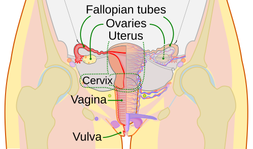

# ANATOMIA E EMBRIOLOGIA DO TRATO GENITAL FEMININO

Para entender a ginecologia, você precisa dominar a base. Não adianta tentar entender uma histerectomia ou um prolapso genital se você não visualiza onde as estruturas estão e de onde elas vieram. A embriologia explica a anatomia, e a anatomia explica a patologia. Nas provas de residência, as bancas adoram cobrar as malformações uterinas e a vascularização pélvica, pois são temas que separam quem decorou de quem realmente entende a lógica do corpo humano.

## Embriologia do Trato Genital: O Caminho da Diferenciação

Tudo começa no estágio indiferenciado. Até a 6ª ou 7ª semana de gestação, o embrião possui o potencial para se tornar masculino ou feminino. Temos dois pares de ductos genitais: os ductos de Wolff (mesonéfricos) e os ductos de Müller (paramesonéfricos).

A decisão de qual caminho seguir depende fundamentalmente do cromossomo Y e do gene SRY. Se o SRY estiver presente, as gônadas se tornam testículos. Se estiver ausente, a gônada indiferenciada se torna um ovário. No MedEvo, sempre reforçamos: o "padrão básico" da natureza é o feminino. Para ser homem, é preciso um esforço hormonal ativo.

### O Papel das Células de Sertoli e Leydig

No feto masculino, os testículos produzem duas substâncias cruciais:

- Hormônio Anti-Mülleriano (AMH), produzido pelas células de Sertoli: Ele faz os ductos de Müller regredirem.

- Testosterona, produzida pelas células de Leydig: Ela mantém os ductos de Wolff, que formarão o epidídimo, ducto deferente e vesículas seminais.

No feto feminino, como não há AMH, os ductos de Müller persistem e se desenvolvem. Como não há testosterona em níveis significativos, os ductos de Wolff regredirem.

### Derivados dos Ductos de Müller (Paramesonéfricos)

Este é o ponto que mais cai em prova. Você precisa saber exatamente o que os ductos de Müller formam:

- Tubas uterinas.

- Útero (corpo e colo).

- Terço superior (ou 2/3 superiores, dependendo da literatura) da vagina.

Cuidado: as mamas NÃO derivam dos ductos de Müller. Elas se originam do ectoderma (linha mamária). Erro clássico de prova é incluir os ductos mamários na lista de derivados Müllerianos.

### A Formação da Vagina e Genitália Externa

A vagina tem uma origem embrionária dupla, o que explica por que algumas malformações afetam apenas a parte superior. Enquanto o terço superior vem de Müller, os 2/3 inferiores (ou terço inferior) derivam do seio urogenital.

A genitália externa feminina se desenvolve na ausência de di-hidrotestosterona (DHT). O tubérculo genital vira o clitóris, as pregas urogenitais viram os pequenos lábios e as tumefações labioescrotais viram os grandes lábios.

## Malformações Congênitas: Quando a Fusão Falha

As malformações uterinas ocorrem por falhas na fusão ou na canalização dos ductos de Müller. Como o Dr. Will costuma explicar, imagine os ductos de Müller como dois tubos que precisam se unir no meio para formar uma cavidade única (o útero).

### Classificação das Malformações Müllerianas

*Figura 1 - Classificação ilustrada das malformações uterinas müllerianas, desde o útero normal até as variantes didelfo, bicorno, septado, arqueado e agenesia (MRKH). Fonte: EternamenteAprendiz, CC BY-SA 4.0 | Wikimedia Commons*

| Tipo de Malformação | Mecanismo Fisiopatológico | Impacto Clínico/Obstétrico |
| --- | --- | --- |
| Agenesia Mülleriana (MRKH) | Falha total de desenvolvimento dos ductos. | Amenorreia primária, útero ausente, vagina curta. |
| Útero Didelfo | Falha COMPLETA de fusão dos ductos. | Dois úteros, dois colos, frequentemente septo vaginal. |
| Útero Bicorno | Falha PARCIAL de fusão dos cornos uterinos. | Aumento de risco de prematuridade e má apresentação fetal. |
| Útero Septado | Falha na reabsorção do septo mediano. | Pior prognóstico obstétrico (abortamento de repetição). |
| Útero Arqueado | Pequena indentação no fundo uterino. | Variante da normalidade, geralmente sem impacto. |

O útero septado é o campeão de questões sobre infertilidade e abortamento, pois o septo é um tecido pouco vascularizado, onde o embrião não consegue se implantar adequadamente. Já o útero didelfo é a representação máxima da falha de fusão.

### Síndrome de Mayer-Rokitansky-Küster-Hauser (MRKH)

Esta síndrome é a "queridinha" das provas de amenorreia primária. A paciente tem fenótipo feminino normal, mamas desenvolvidas (porque tem ovários funcionantes e produz estrogênio) e pelos pubianos normais. No entanto, ela não menstrua. Ao exame, observa-se agenesia de útero e dos 2/3 superiores da vagina. O cariótipo é 46,XX.

Não confunda com a Síndrome de Insensibilidade Androgênica (SIA ou CAIS). Na SIA, o paciente é 46,XY, tem testículos (geralmente intra-abdominais) que produzem AMH. Por isso, também não tem útero. A diferença é que na SIA os pelos são escassos ou ausentes e há testosterona em níveis masculinos no sangue, embora o corpo não responda a ela.

## Anatomia da Vulva e Períneo

A vulva é o conjunto da genitália externa. O clitóris é o órgão erétil, homólogo ao pênis masculino, formado por corpos cavernosos (não esponjosos).

### Glândulas de Bartholin e Skene

As glândulas de Bartholin localizam-se na porção posterior dos grandes lábios, profundamente ao músculo bulbocavernoso. Sua função é a lubrificação vaginal durante o coito. Quando o ducto obstrui, forma-se o cisto de Bartholin; se infectar, temos a bartholinite. Já as glândulas de Skene são parauretrais, homólogas à próstata masculina.

### Músculos do Assoalho Pélvico

Aqui o aluno costuma se desesperar, mas vamos simplificar. O assoalho pélvico é dividido em diafragma pélvico e diafragma urogenital.

O Diafragma Pélvico é a estrutura de sustentação mais importante e é composto por:

- Músculo Levantador do Ânus: subdividido em puborretal, pubococcígeo e iliococcígeo.

- Músculo Coccígeo.

O músculo puborretal forma uma "alça" ao redor do reto e é fundamental para a continência fecal. Se a prova perguntar qual o principal músculo de sustentação dos órgãos pélvicos, a resposta é o levantador do ânus.

Na camada mais superficial, temos o Músculo Bulbocavernoso (ou bulboesponjoso), que circunda o orifício vaginal e se insere no clitóris e no corpo perineal. Em lactentes, é comum a sinéquia vulvar (coalescência dos pequenos lábios), cujo tratamento inicial é clínico, com estrogênio tópico ou apenas observação e higiene, evitando-se a separação traumática.

## O Útero e suas Conexões

*Figura 2 - Esquema ilustrativo do sistema reprodutor feminino em corte frontal, mostrando útero, tubas uterinas, ovários, colo uterino e vagina. Fonte: CDC/Mysid, Domínio Público | Wikimedia Commons*

O útero é um órgão muscular oco, dividido em fundo, corpo, istmo e colo (cérvix). O istmo é a zona de transição que, durante a gestação, se alonga para formar o segmento inferior do útero, onde são feitas as incisões de cesariana.

### O Colo Uterino e a JEC

O colo possui dois tipos de epitélio: o colunar (glandular) no canal endocervical e o escamoso na ectocérvix. O encontro entre eles é a Junção Escamo-Colunar (JEC).

- Na infância e menopausa: A JEC está internalizada no canal cervical (devido ao baixo estrogênio).

- Na vida reprodutiva: A JEC fica visível na ectocérvix.

Os Cistos de Naboth são achados benignos comuns, resultantes da obstrução de glândulas cervicais pelo epitélio escamoso durante o processo de metaplasia. Não exigem tratamento.

### Ligamentos de Sustentação e Suspensão

Muitos alunos confundem os ligamentos. Pense assim: alguns suspendem (como cordas) e outros apenas recobrem (como lençóis).

- Ligamentos Cardinais (Mackenrodt) e Uterossacros: São os principais responsáveis por manter o útero no lugar. A falha neles gera prolapso uterino.

- Ligamento Largo: É apenas uma prega de peritônio que recobre o útero e as tubas. Não tem função de sustentação importante.

- Ligamento Redondo: Sai do corno uterino e vai até os grandes lábios através do canal inguinal. Ele ajuda a manter o útero em anteflexão, mas não sustenta contra a gravidade.

- Ligamento Infundibulopélvico (Suspensório do Ovário): Contém os vasos ovarianos. Guarde isso: se você vai retirar o ovário (ooforectomia), você precisa ligar este ligamento.

## Vascularização Pélvica: Onde o Cirurgião Treme

A irrigação do trato genital feminino é rica e possui várias anastomoses. A artéria principal é a Ilíaca Interna (ou Hipogástrica), que se ramifica em diversos vasos.

### Artéria Uterina

Ramo da ilíaca interna, a artéria uterina caminha no parâmetro e cruza SUPERIORMENTE ao ureter ("água passa por baixo da ponte"). Esta é a relação anatômica mais importante da pelve cirúrgica. Durante uma histerectomia, o ureter corre sério risco de ser ligado ou lesado justamente nesse ponto.

### Irrigação Ovariana

O ovário tem uma irrigação dupla, o que o protege de isquemia, mas dificulta o controle de hemorragias.

- Artéria Ovariana: Ramo direto da Aorta Abdominal (surge logo abaixo das artérias renais). Isso ocorre porque o ovário "nasce" no abdome e desce para a pelve, levando sua vascularização original.

- Ramo Ovariano da Artéria Uterina: Uma anastomose que vem da artéria uterina.

A drenagem venosa ovariana segue uma assimetria clássica:

- Veia Ovariana Direita: Drena direto para a Veia Cava Inferior.

- Veia Ovariana Esquerda: Drena para a Veia Renal Esquerda.
Essa diferença explica por que a varicocele (no homem) e a síndrome de congestão pélvica (na mulher) são mais comuns do lado esquerdo, devido à maior pressão hidrostática na veia renal.

## As Tubas Uterinas e a Anatomia Ovariana

As tubas são divididas em quatro partes: intersticial (dentro do útero), istmo (mais estreita), ampola (onde ocorre a fertilização) e infundíbulo (onde ficam as fímbrias). O orifício abdominal da tuba está no infundíbulo.

Os ovários não são recobertos por peritônio (são órgãos intraperitoneais "nus"), o que facilita a disseminação de células neoplásicas para a cavidade abdominal. Eles contêm as células da granulosa (que produzem estrogênio sob estímulo do FSH) e as células da teca (que produzem androgênios sob estímulo do LH).

## A Pelve Obstétrica: O Caminho do Parto

A classificação de Caldwell-Moloy divide as pelves em quatro tipos básicos, baseando-se no formato do estreito superior.

| Tipo de Pelve | Características | Prognóstico de Parto |
| --- | --- | --- |
| Ginecoide | Arredondada, diâmetro transverso amplo. | Ideal (mais comum em mulheres, 50%). |
| Antropoide | Diâmetro anteroposterior maior que o transverso (ovalada vertical). | Favorável, comum em raças negras. |
| Androide | Formato de "coração", estreito anterior agudo. | Desfavorável (comum em homens). |
| Platipeloide | Diâmetro transverso muito maior que o AP (achatada). | Muito raro, dificulta o encaixe. |

Lembre-se: o estreito superior da pelve tem o diâmetro transverso maior que o anteroposterior (conjugata obstétrica). Já no estreito inferior, o diâmetro anteroposterior torna-se mais favorável. A espinha isquiática, localizada no estreito médio, é o ponto de referência para o "plano zero de De Lee" e para o bloqueio do nervo pudendo.

## Desenvolvimento Puberal e Estadiamento de Tanner

A puberdade feminina segue uma ordem cronológica previsível: Telarca (botão mamário) -> Pubarca (pelos) -> Estirão de crescimento -> Menarca (primeira menstruação).

O estadiamento de Tanner é fundamental:

- M1/P1: Pré-puberal.

- M2: Broto mamário (telarca). É o primeiro sinal visível da puberdade.

- M3: Aumento da mama e aréola, sem separação de contornos.

- M4: Projeção da aréola e do mamilo formando uma segunda proeminência acima do contorno da mama.

- M5: Mama adulta, aréola recua ao contorno da mama.

P2 refere-se a pelos longos e finos nos grandes lábios. Se uma questão descreve "Tanner M2 P2", ela está falando de uma menina que acabou de entrar na puberdade.

## Pontos-Chave para Prova

- O útero, as tubas e o terço superior da vagina derivam dos ductos paramesonéfricos (Müller).

- A falha completa de fusão dos ductos de Müller resulta em útero didelfo (dois colos, dois úteros).

- A Síndrome de Mayer-Rokitansky-Küster-Hauser (MRKH) cursa com amenorreia primária, cariótipo 46,XX, mamas normais, mas ausência de útero e vagina curta.

- A artéria uterina cruza por cima do ureter, uma relação anatômica crítica em cirurgias pélvicas.

- Os ovários recebem sangue da artéria ovariana (ramo da aorta) e do ramo ovariano da artéria uterina.

- A veia ovariana esquerda drena para a veia renal esquerda; a direita drena para a veia cava inferior.

- O diafragma pélvico é formado pelos músculos levantador do ânus (puborretal, pubococcígeo, iliococcígeo) e coccígeo.

- O clitóris é formado por corpos cavernosos e é homólogo ao pênis.

- Os bulbos vestibulares são homólogos ao corpo esponjoso masculino.

- O útero septado é a malformação Mülleriana com pior prognóstico obstétrico (abortos de repetição).

- A espinha isquiática é o marco anatômico para o bloqueio do nervo pudendo e para os planos de De Lee.

- Cistos de Naboth são benignos e ocorrem no colo uterino por metaplasia escamosa.

- Cistos de Gartner são remanescentes dos ductos de Wolff (mesonéfricos) localizados nas paredes laterais da vagina.

- A pelve ginecoide é a mais favorável ao parto vaginal, enquanto a androide é a mais desfavorável.

- A primeira conduta na sinéquia vulvar em lactentes é o uso de estrogênio tópico ou medidas conservadoras, nunca separação manual forçada.

- O Hormônio Anti-Mülleriano (AMH) é produzido pelas células de Sertoli e causa a regressão dos ductos de Müller no feto masculino.

- O clitóris NÃO possui corpo esponjoso, apenas corpos cavernosos. 💡

 Cópia offline para consulta pessoal.
 Fonte original:
 [https://www.medevo.com.br/material-apoio/ler/9effc883-7d54-4bf7-ad31-c2f7a3d1abd0](https://www.medevo.com.br/material-apoio/ler/9effc883-7d54-4bf7-ad31-c2f7a3d1abd0)
