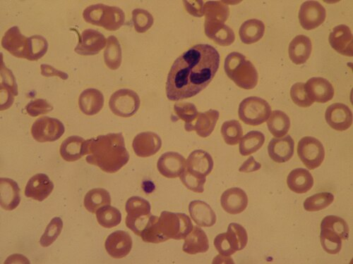

# ANEMIAS

Para entender as anemias na pediatria, você precisa parar de decorar nomes e começar a entender como o sangue é fabricado. Imagine a medula óssea como uma fábrica. Para produzir uma hemácia perfeita, eu preciso de tijolos (ferro), de operários qualificados (DNA funcionando bem via B12 e Folato) e de um projeto arquitetônico correto (globinas). Se falta tijolo, a célula sai pequena (microcítica). Se o operário está lento, a célula demora a se dividir e cresce demais (macrocítica). Se o projeto está errado, a célula sai com defeito e é destruída antes da hora (hemólise).

A definição clássica de anemia é a redução da massa de glóbulos vermelhos ou da concentração de hemoglobina (Hb) abaixo de dois desvios padrão para a idade e sexo. Na prova, os valores de corte da OMS são seus melhores amigos:

- 6 meses a 5 anos: Hb < 11 g/dL.

- 5 anos a 11 anos: Hb < 11,5 g/dL.

- 12 a 14 anos: Hb < 12 g/dL.

Cuidado com o primeiro erro clássico: o nadir fisiológico do lactente. Por volta dos 2 a 3 meses de vida, a hemoglobina cai naturalmente para cerca de 9 a 11 g/dL. Por que isso acontece? Porque ao nascer, o bebê para de viver em um ambiente hipóxico (útero) e passa a ter muito oxigênio disponível. Isso avisa os rins para diminuírem a produção de eritropoetina. Se você vir um lactente de 3 meses, em aleitamento materno exclusivo, com Hb de 10,5 g/dL e VCM normal, não trate. É a anemia fisiológica do lactente.

## Classificação das Anemias: O Mapa da Mina

Não tente diagnosticar uma anemia olhando apenas para a hemoglobina. A hemoglobina diz "se" tem anemia. Quem diz "qual" é a anemia são os índices hematimétricos e os reticulócitos.

### A Cinética: A Fábrica está Parada ou o Produto está Quebrando?

O primeiro passo é olhar os reticulócitos. Eles são as hemácias jovens, recém-saídas da fábrica.

- Reticulócitos Baixos (Hipoproliferativas): A fábrica está com problemas. Falta matéria-prima (ferro, B12) ou a própria fábrica está infiltrada (leucemia, aplasia).

- Reticulócitos Altos (Hiperproliferativas): A fábrica está a todo vapor, mas o sangue está sumindo. Ou está havendo hemólise (destruição) ou sangramento agudo.

### A Morfologia: O Tamanho e a Cor Importam

Aqui usamos o VCM (Volume Corpuscular Médio) e o HCM/CHCM (Hemoglobina Corpuscular Média).

- Microcíticas (VCM baixo): Deficiência de ferro, Talassemias, Anemia de Doença Crônica (fases tardias), Sideroblástica.

- Macrocíticas (VCM alto): Deficiência de B12 e Folato (Megaloblásticas), hipotireoidismo, doenças hepáticas.

- Normocíticas: Doença crônica (fase inicial), doenças renais, esferocitose (pode ser normo ou micro).

## Anemia Ferropriva: A Rainha das Provas

A deficiência de ferro é a causa mais comum de anemia no mundo e na infância. Nas provas de residência, ela aparece em lactentes com erros alimentares ou adolescentes com dieta inadequada.

### Por que a criança fica anêmica?

O estoque de ferro do bebê é formado no último trimestre da gestação. Por isso, o prematuro é um forte candidato à anemia. Após o nascimento, o ferro vem da dieta. O leite materno tem pouco ferro, mas ele é altamente biodisponível (absorve 50%). O leite de vaca, além de ter pouco ferro e baixa absorção (10%), causa micro-hemorragias intestinais por irritação da mucosa.

Atenção à pérola clínica: Lactente de 1 ano, cuja dieta é baseada em leite e arrozina, apresentando palidez, é o cenário clássico de Anemia Ferropriva. O uso precoce de leite de vaca in natura é um dos principais fatores de risco.

### O Diagnóstico Laboratorial Passo a Passo

A deficiência de ferro não acontece de uma hora para outra. Ela segue uma ordem lógica que as bancas amam cobrar:

- Primeiro cai a Ferritina: É o estoque acabando. É o marcador mais precoce e sensível.

- Depois cai o Ferro Sérico e a Saturação de Transferrina (IST), enquanto a Capacidade de Ligação do Ferro (TIBC) aumenta (o corpo está "desesperado" para captar ferro).

- Por fim, a Hemoglobina cai e o VCM diminui.

No hemograma da anemia ferropriva, você encontrará:

- Microcitose (VCM baixo) e Hipocromia (HCM/CHCM baixos).

- RDW Elevado (Anisocitose): Isso é fundamental! O RDW mede a variação de tamanho entre as células. Como a deficiência é progressiva, o sangue tem células velhas normais e células novas pequenas. Isso diferencia a ferropriva da Talassemia minor, onde o RDW costuma ser normal (todas as células são pequenas por igual).

- Protoporfirina Eritrocitária Livre (PEL) elevada: Sem ferro para se ligar, a protoporfirina sobra.

### Tratamento e Resposta Terapêutica

O tratamento é feito com Ferro Elementar na dose de 3 a 5 mg/kg/dia. Não confunda a dose do sal (Sulfato Ferroso) com a dose do ferro elementar. A orientação é administrar longe das refeições (1h antes ou 2h depois), preferencialmente com suco cítrico para aumentar a absorção.

Como saber se o tratamento está funcionando? Segundo o MedEvo, a primeira resposta é laboratorial: o aumento dos reticulócitos ocorre entre 3 a 10 dias (pico em 7 dias). A hemoglobina começa a subir após 2 semanas. O tratamento deve durar de 3 a 6 meses, ou até que a ferritina se normalize para repor os estoques.

Se a criança não responde ao ferro oral, pense em: má adesão (causa mais comum), dose insuficiente, perda sanguínea persistente (parasitoses como ancilostomíase) ou erro diagnóstico (era talassemia!). Outra suspeita importante em casos refratários com diarreia crônica e baixo ganho de peso é a Doença Celíaca.

### Profilaxia: Onde as Bancas Fazem a Festa

Existem duas diretrizes principais no Brasil, e você precisa saber qual a sua prova segue.

**Tabela 1: Profilaxia de Ferro (SBP vs. Ministério da Saúde)**

| Categoria | Sociedade Brasileira de Pediatria (SBP) | Ministério da Saúde (PNAFE) |
| --- | --- | --- |
| **Recém-nascido a Termo (Peso > 2500g)** | 10-12,5 mg/dia dose fixa, 2 ciclos (6-9m e 12-15m) — SBP 2026 | 10-12,5 mg/dia (PNSF) |
| **Prematuros e Baixo Peso (< 2500g)** | 2 mg/kg/dia a partir de 30 dias por 1 ano. Depois, 1 mg/kg/dia por mais 1 ano. | 2 mg/kg/dia a partir de 30 dias até 24 meses. |
| **Muito Baixo Peso (< 1500g)** | 3 mg/kg/dia a partir de 30 dias por 1 ano. Depois, 1 mg/kg/dia por mais 1 ano. | (Segue a regra de < 2500g) |

Cuidado: Se a criança recebe mais de 500 ml/dia de fórmula infantil, a SBP diz que não precisa suplementar, pois a fórmula já é fortificada. O clampeamento tardio do cordão umbilical (após 1 a 3 minutos) é uma medida fundamental para garantir bons estoques iniciais de ferro.

## Anemias Megaloblásticas: Os Operários em Greve

Aqui o problema é a síntese de DNA. Sem B12 ou Folato, a célula não consegue se dividir corretamente, resultando em macrocitose (VCM > 100) e neutrófilos hipersegmentados (mais de 5 lobos).

### Deficiência de Vitamina B12 (Cobalamina)

Causas comuns em pediatria: dietas veganas estritas sem suplementação ou má absorção (anemia perniciosa, ressecções ileais).
Diferencial crítico: A deficiência de B12 causa sintomas neurológicos (parestesias, atraso no desenvolvimento neuropsicomotor - DNPM) devido à desmielinização dos cordões posteriores da medula.

### Deficiência de Folato

Causas: Dieta pobre em vegetais verdes, uso de drogas que antagonizam o folato (Metotrexato, Sulfametoxazol-Trimetoprima, Fenitoína) ou consumo exclusivo de leite de cabra in natura (clássico de prova!). Diferente da B12, a deficiência de folato NÃO causa sintomas neurológicos.

Ambas podem causar pancitopenia (anemia + leucopenia + plaquetopenia) em casos graves, pois a falha na síntese de DNA afeta todas as linhagens da medula.

## Anemias Hemolíticas: O Destino Trágico das Hemácias

Nas anemias hemolíticas, a sobrevida da hemácia (que deveria ser de 120 dias) é encurtada. O laboratório típico mostra:

- Hb baixa + Reticulócitos altos.

- Bilirrubina Indireta alta (causando icterícia).

- LDH alto (enzima dentro da célula que vaza).

- Haptoglobina baixa (proteína que "limpa" a hemoglobina livre).

### Anemia Falciforme (HbSS)

*Figura 1 - Esfregaço de sangue periférico de paciente com anemia falciforme (HbSS), mostrando hemácias em formato de foice (sickle cells) características da polimerização da hemoglobina S. Fonte: Dr Graham Beards, CC BY-SA 3.0 | Wikimedia Commons*

É a hemoglobinopatia mais comum no Brasil. Ocorre a troca do ácido glutâmico pela valina na cadeia beta da hemoglobina. Em situações de hipóxia ou estresse, a HbS polimeriza, deformando a hemácia em "foice".

- Clínica: Crises álgicas (vaso-oclusão), síndrome torácica aguda, sequestro esplênico (emergência com queda súbita de Hb e baço gigante) e dactilite (mão-pé) em lactentes.

- Diagnóstico: Eletroforese de hemoglobina (padrão ouro). O teste do pezinho detecta precocemente (padrão HbFS).

- Pérola: Criança negra com dor abdominal súbita, palidez e esplenomegalia? Suspeite de crise de sequestro esplênico.

### Talassemias

Aqui o problema é quantitativo: produz-se pouca cadeia alfa ou beta.

- Talassemia Major: Anemia grave, dependente de transfusão, fácies talassêmica (expansão da medula óssea nos ossos da face).

- Talassemia Minor: Frequentemente confundida com anemia ferropriva. É uma anemia microcítica e hipocrômica leve, mas com RDW normal e contagem de hemácias (RBC) muitas vezes elevada. O diagnóstico é feito pela eletroforese de Hb (na beta-talassemia minor, a HbA2 estará aumentada, > 3,5%).

### Esferocitose Hereditária (Minkowski-Chauffard)

Defeito nas proteínas da membrana (espectrina, anquirina). A hemácia perde o formato de disco bicôncavo e vira uma esfera. O baço não gosta de esferas e as destrói.

- Marca registrada: CHCM elevado (a célula está "murcha" e concentrada). O teste de fragilidade osmótica confirma o diagnóstico.

### Deficiência de G6PD

A G6PD protege a hemácia contra o estresse oxidativo. Sem ela, a exposição a certas substâncias (naftalina, favismo, infecções, drogas como sulfas e primaquina) causa hemólise aguda.

- No esfregaço: Corpos de Heinz (hemoglobina precipitada) e "bite cells" (células mordidas pelo baço).

## Diagnóstico Diferencial de Febre e Hepatoesplenomegalia

Este é um tópico quente que conecta a hematologia com a infectologia pediátrica. Quando uma criança apresenta anemia associada a febre prolongada e aumento de vísceras, você deve abrir o leque:

- Leishmaniose Visceral (Calazar): Pancitopenia grave, febre arrastada, emagrecimento e um baço gigantesco. Comum em áreas endêmicas. O diagnóstico pode ser feito pelo aspirado de medula óssea (pesquisa de formas amastigotas).

- Leucemia Linfoide Aguda (LLA): É a neoplasia mais comum da infância. Apresenta-se com dor óssea (muitas vezes noturna), palidez, febre, petéquias e linfonodomegalia. O hemograma pode mostrar blastos, mas nem sempre. A pancitopenia com dor óssea é o sinal de alerta máximo.

- Lúpus Eritematoso Sistêmico (LES) Juvenil: Adolescente com febre, artrite, citopenias e sintomas sistêmicos. Investigar com ANA (FAN), anti-dsDNA e anti-Sm.

**Tabela 2: Diagnóstico Diferencial das Anemias Microcíticas**

| Parâmetro | Anemia Ferropriva | Talassemia Minor | Anemia de Doença Crônica |
| --- | --- | --- | --- |
| **VCM** | Baixo | Muito Baixo | Normal ou Baixo |
| **RDW** | Elevado | Normal | Normal |
| **Ferritina** | Baixa | Normal ou Alta | Normal ou Alta |
| **Ferro Sérico** | Baixo | Normal | Baixo |
| **TIBC** | Elevado | Normal | Baixo |
| **Hemácias (RBC)** | Baixas | Normais ou Altas | Baixas |

## Situações Especiais e Condutas de Emergência

### Quando Transfundir?

Não existe um número mágico de hemoglobina para todos, mas em pediatria, a decisão é clínica. Segundo as diretrizes, a transfusão de concentrado de hemácias (10 mL/kg) é indicada se:

- Hb < 7 g/dL com sinais de descompensação hemodinâmica (taquicardia, taquipneia, sopro sistólico).

- Anemia grave com perda aguda de sangue.

- Crises de sequestro esplênico ou síndrome torácica aguda na anemia falciforme.

Cuidado: Transfundir rápido demais uma criança com anemia crônica grave pode causar insuficiência cardíaca por sobrecarga volêmica.

### Parasitoses e Anemia

Sempre que encontrar eosinofilia no hemograma de uma criança com anemia, sem história de atopia (asma, rinite), pense em parasitose intestinal. Ancilostomíase e Necatoríase são causas clássicas de perda crônica de ferro pelo trato gastrointestinal.

### O Papel da Dieta

O tratamento da anemia ferropriva não é apenas dar sulfato ferroso. É orientação dietética. O Dr. Will sempre reforça: o ferro heme (carnes) é muito mais absorvido que o ferro não-heme (vegetais). Se for comer feijão, oriente a ingestão de vitamina C (laranja) na mesma refeição para converter o ferro férrico em ferro ferroso, que é o que o intestino absorve. Evite chás e laticínios junto com as principais refeições, pois os taninos e o cálcio competem com a absorção do ferro.

## Pontos-Chave para Prova

- **Critério Diagnóstico (6m-5a):** Hemoglobina < 11 g/dL.

- **Anemia Fisiológica do Lactente:** Ocorre aos 2-3 meses, Hb entre 9-11 g/dL, VCM normal. Não requer tratamento.

- **Pérola da Ferropriva:** Ferritina baixa é o primeiro sinal; RDW alto ajuda a diferenciar de Talassemia.

- **Dose de Tratamento (Ferro Elementar):** 3 a 5 mg/kg/dia.

- **Resposta ao Ferro:** Reticulocitose em 3 a 10 dias é o primeiro sinal de melhora.

- **Profilaxia SBP:** Começa aos 6 meses para bebês a termo (10-12,5 mg/dia dose fixa, em ciclos) — SBP 2026.

- **Profilaxia MS:** Começa aos 6 meses para bebês a termo (10-12,5 mg/dia conforme PNSF).

- **Prematuros (< 2500g):** Profilaxia começa com 30 dias de vida (2 mg/kg/dia).

- **Talassemia Minor:** Microcitose importante com RDW normal e RBC aumentado.

- **Anemia Falciforme:** Diagnóstico definitivo por Eletroforese de Hemoglobina. Crise de sequestro esplênico é emergência.

- **Deficiência de B12:** Causa macrocitose e sintomas neurológicos (diferente do folato).

- **Leite de Cabra:** Clássico fator de risco para deficiência de folato.

- **Esferocitose:** CHCM elevado e fragilidade osmótica aumentada.

- **G6PD:** Hemólise após estresse oxidativo (drogas, infecção). Presença de Corpos de Heinz.

- **Calazar (Leishmaniose):** Tríade de febre prolongada + pancitopenia + hepatoesplenomegalia maciça.

- **O que NÃO fazer:** Não tratar anemia fisiológica do lactente e não esquecer de investigar a causa da deficiência de ferro (não é só repor, é achar o porquê).

- **Contraindicação Absoluta:** Não fazer suplementação de ferro em pacientes com anemias hemolíticas (risco de sobrecarga de ferro), a menos que haja deficiência de ferro comprovada concomitante.

- **Primeira Escolha na Ferropriva:** Ferro oral (Sulfato Ferroso é o mais comum e barato).

Este guia cobre a espinha dorsal das anemias na pediatria. Ao analisar uma questão, siga sempre o fluxo: Hemoglobina (tem anemia?) → Reticulócitos (a fábrica funciona?) → VCM/RDW (qual o tamanho e a variação?). Com esse raciocínio, você não erra mais.

 Cópia offline para consulta pessoal.
 Fonte original:
 [https://www.medevo.com.br/material-apoio/ler/1a155c55-8ebd-448c-ae27-386ebf9275fb](https://www.medevo.com.br/material-apoio/ler/1a155c55-8ebd-448c-ae27-386ebf9275fb)
