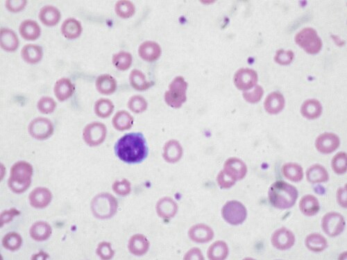
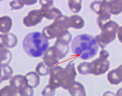
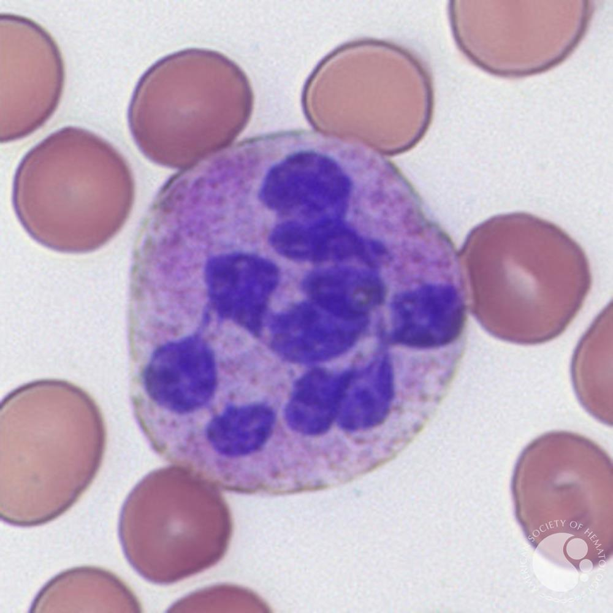

# ANEMIAS

Para começar nossa conversa, tire uma coisa da cabeça: anemia não é um diagnóstico final. Se você escrever apenas "anemia" no prontuário ou na hipótese diagnóstica de uma questão, você parou no meio do caminho. Anemia é um sinal de que algo está errado. É como febre. Nosso trabalho aqui é entender a lógica por trás da queda da hemoglobina para que, na hora da prova, você não precise decorar listas infinitas, mas sim deduzir a causa.

A Organização Mundial da Saúde (OMS) define anemia como Hemoglobina (Hb) < 13 g/dL para homens e Hb < 12 g/dL para mulheres (e < 11 g/dL para gestantes e crianças de 6 a 59 meses). Mas cuidado: o corpo não lê livro. Um paciente com Hb de 12.5 que costumava ter 15 está anemiado para a realidade dele.

## O Primeiro Filtro: A Resposta Medular

Sempre que você pegar um hemograma com anemia, o primeiro dado que você deve procurar não é o VCM. É o **Índice de Reticulócitos Corrigido**. Por quê? Porque ele me diz se a fábrica (medula óssea) está funcionando.

Mas como corrigir os reticulócitos? Podemos usar duas fórmulas:

- **Hematócrito * Reticulócitos / 40**

- **Hemoglobina * Reticulócitos / 15**

Se os reticulócitos estão altos (> 2% ou > 100.000/mm³), a medula está saudável e tentando compensar uma perda. Isso acontece em duas situações: ou o sangue está saindo (hemorragia) ou as hemácias estão sendo destruídas (hemólise). Chamamos de **anemias hiperproliferativas**.

Se os reticulócitos estão baixos (< 2%), o problema é na produção. Ou falta matéria-prima (ferro, B12, folato), ou a fábrica está doente (aplasia, infiltração por câncer), ou o estímulo (eritropoietina) sumiu. Chamamos de **anemias hipoproliferativas**.

Vamos ver um exemplo: paciente com hematócrito de 20% e reticulócitos de 10%. Os reticulócitos mesmo antes da correção já estão bem elevados, mas vamos conferir.

Hematócrito * Reticulócitos / 40 = 20 * 10 / 40 = **5%**

Os reticulócitos corrigidos são de 5%, ou seja, estamos diante de uma anemia **hiperproliferativa**, a qual pode ser resultado de processos como hemólise ou sangramento, como veremos adiante.

**Dica de Prova:** Se a banca te der uma Hb de 7 g/dL com reticulócitos de 1%, ela está gritando que a medula não está respondendo. Isso exclui hemólise aguda como causa primária do momento.

## Mapa Mestre: Hipoproliferativa vs. Hiperproliferativa

O jeito mais seguro de resolver anemia no adulto é sempre passar por dois eixos: **produção medular** e **morfologia**.

### 1) Produção medular: reticulócitos corrigidos

| Eixo | O que significa | Principais causas | Próximos exames |
| --- | --- | --- | --- |
| **Hipoproliferativa** | Medula não respondeu adequadamente | ferropriva, doença crônica/DRC, B12/folato, álcool, hipotireoidismo, hepatopatia, aplasia, mielodisplasia, infiltração medular | ferritina/TSAT, B12/folato, creatinina/eTFG, TSH, função hepática, esfregaço; considerar mielograma se pancitopenia/blastos/dacriócitos |
| **Hiperproliferativa** | Medula respondeu; hemácia está sendo perdida/destruída | sangramento agudo/oculto ou hemólise | história de sangramento, sangue oculto/endoscopia conforme risco, LDH, bilirrubina indireta, haptoglobina, Coombs direto, esfregaço |

### 2) Morfologia: VCM

| VCM | Raciocínio de prova | Causas que você deve lembrar |
| --- | --- | --- |
| **Microcítica (<80 fL)** | problema de hemoglobina | ferropriva, talassemia, doença crônica, sideroblástica, chumbo |
| **Normocítica (80-100 fL)** | pode ser início de quase tudo; use reticulócitos | sangramento/hemólise se reticulócito alto; DRC/doença crônica/endócrina/medular se baixo |
| **Macrocítica (>100 fL)** | separar megaloblástica de não megaloblástica | B12/folato; álcool, hepatopatia, hipotireoidismo, fármacos, mielodisplasia, reticulocitose |

### Fluxograma prático em 6 passos

- Confirme anemia e gravidade/sintomas.

- Calcule reticulócitos corrigidos/índice reticulocitário.

- Se reticulócito alto: procure sangramento ou hemólise.

- Se reticulócito baixo: classifique por VCM e procure deficiência, inflamação/DRC, endocrinopatia ou doença medular.

- Sempre olhe **RDW + esfregaço**: anisocitose, esquizócitos, esferócitos, células em alvo, dacriócitos e blastos mudam a hipótese.

- Não trate “anemia” isoladamente: trate a causa e reconheça sinais de urgência.

## Anemias Microcíticas: O Problema do Tamanho

Quando o VCM (Volume Corpuscular Médio) está baixo (< 80 fL), a hemácia é pequena. Por que ela é pequena? Porque faltou hemoglobina para preenchê-la. A hemoglobina é formada por Heme (Ferro + Protoporfirina) + Globinas. Se faltar qualquer um desses, a célula fica pequena e pálida (hipocrômica).

## Anemia Ferropriva: A Rainha das Provas

É a causa mais comum de anemia no mundo. O ferro é essencial para carregar o oxigênio. Sem ele, a eritropoiese sofre.

**A Fisiopatologia do Estoque:**
O ferro não acaba de uma vez. Existe uma hierarquia na depleção:

- Primeiro, caem os estoques: **Ferritina baixa**. Este é o primeiro marcador a se alterar.

- Depois, o ferro circulante cai e a capacidade de transporte aumenta: **Ferro sérico baixo e TIBC (Capacidade Total de Ligação do Ferro) alto**.

- Por fim, a hemoglobina cai e o VCM diminui.

**Pegadinha de Prova Atualizada:** A ferritina é o melhor exame inicial para estoque de ferro, mas é proteína de fase aguda. Em adultos sem inflamação, revisão clínica da AAFP 2025 considera deficiência de ferro quando a ferritina é **< 45 ng/mL** ou quando está entre **46-99 ng/mL com saturação de transferrina < 20%**. Em pacientes com inflamação, ferritina **< 100 ng/mL** ainda pode indicar deficiência. Ferritina baixa continua sendo altamente específica: se está baixa, pense em falta real de ferro.

**Quadro Clínico e Pérolas:**
Além da astenia e palidez, procure por:

- **Pica ou Pagofagia:** Desejo de comer substâncias não nutritivas (gelo, terra, tijolo).

- **Glossite e Queilose Angular:** Língua lisa e feridas no canto da boca.

- **Síndrome de Plummer-Vinson:** Anemia ferropriva + disfagia por membranas esofágicas (risco de câncer de esôfago).

- **Coiloníquia:** Unhas em colher.

**O RDW na Ferropriva:**
O RDW (Amplitude de Distribuição dos Eritrócitos) mede a variação de tamanho entre as hemácias (anisocitose). Na anemia ferropriva, o RDW está **aumentado**. Por que? Porque a medula começa a produzir células cada vez menores à medida que o ferro acaba, gerando uma população mista. Na Talassemia minor (principal diferencial), o RDW costuma ser normal, pois todas as células são igualmente pequenas desde o início.

**Tratamento e investigação etiológica:**

- **Ferro oral** é primeira linha para a maioria dos adultos. A dose clássica ainda aparece como 100-200 mg/dia de ferro elementar, mas esquemas **em dias alternados** melhoram absorção e tolerabilidade em muitos pacientes.

- **Dica prática:** tomar longe de leite, antiácidos e inibidores de bomba quando possível; vitamina C/suco cítrico pode ajudar, mas o principal é adesão.

- **Resposta terapêutica:** reticulocitose em 5-7 dias; reavaliar Hb em **2-4 semanas**. Se não houver resposta adequada, pense em má adesão, dose insuficiente, sangramento persistente, má absorção, diagnóstico errado ou necessidade de ferro IV.

- **Não pare quando a Hb normalizar:** manter tratamento por meses para repor estoque, acompanhando ferritina/TSAT.

- **Causa é obrigatória:** em homens e mulheres pós-menopausa, ferropriva exige investigação de sangramento gastrointestinal, geralmente com endoscopia alta + colonoscopia. Em adultos, considerar também doença celíaca e *Helicobacter pylori*, especialmente quando não há causa óbvia ou há refratariedade.

- **Ferro IV:** considerar se intolerância/má absorção do oral, doença inflamatória intestinal ativa, bariátrica/gastrectomia, sangramento persistente, doença renal/uso de EPO ou resposta inadequada.

**Mais uma pegadinha de prova: ferritina ou medula óssea?**

A demonstração de ausência de ferro na medula é a documentação direta do estoque, mas é invasiva e raramente necessária. Na prática clínica e nas provas, o caminho é **ferritina + saturação de transferrina + contexto inflamatório**; mielograma/biopsia entra quando o diagnóstico permanece obscuro ou há suspeita de doença medular associada.

### Anemia de Doença Crônica

Aqui o problema não é falta de ferro no corpo, mas sim ferro "preso". Em estados inflamatórios (infecções crônicas, neoplasias, colagenoses), o fígado produz **Hepcidina**.
A hepcidina bloqueia a ferroportina (a porta de saída do ferro do enterócito e do macrófago). Resultado: o ferro fica estocado, mas não chega na medula.

**Perfil Laboratorial:**

- Ferro sérico: Baixo.

- TIBC: Baixo (diferente da ferropriva).

- Ferritina: Normal ou Alta (é o ferro estocado que não sai).

### Tabela 1: Diagnóstico Diferencial das Anemias Microcíticas

| Parâmetro | Ferropriva | Doença Crônica | Talassemia Minor | Sideroblástica |
| --- | --- | --- | --- | --- |
| **Ferro Sérico** | Baixo | Baixo | Normal/Alto | Alto |
| **Ferritina** | Baixa | Normal/Alta | Normal/Alta | Alta |
| **TIBC** | Alto | Baixo | Normal | Normal |
| **RDW** | Alto | Normal | Normal | Alto |
| **Eletroforese Hb** | Normal | Normal | Alterada (HbA2/F) | Normal |
| **Índice de Mentzer (VCM/RBC)** | Geralmente > 13 | Variável | Geralmente < 13 | Variável |
| **Pista clínica** | perda crônica, menorragia, GI, dieta | inflamação, DRC, câncer, infecção crônica | história familiar/etnia, microcitose desproporcional | álcool, drogas, chumbo, mielodisplasia |

## Anemias Normocíticas e Hipoproliferativas: Onde o Material Costuma Ficar Superficial

Normocítica não significa “normal”: significa que o VCM ainda não te entregou a etiologia. Aqui o reticulócito manda.

### Reticulócito baixo: produção insuficiente

| Causa | Pista clínica/laboratorial | O que pedir/lembrar |
| --- | --- | --- |
| **Doença renal crônica** | creatinina/eTFG alteradas; Hb baixa com VCM normal | falta de eritropoietina; tratar DRC, ferro e considerar EPO em cenário adequado |
| **Anemia da inflamação/doença crônica** | ferro baixo, TIBC baixo, ferritina normal/alta | hepcidina alta prende ferro no macrófago; comum em infecção crônica, câncer, doença reumatológica |
| **Endócrina/metabólica** | hipotireoidismo, hepatopatia, alcoolismo | TSH, função hepática; pode virar macro/normo |
| **Medular** | pancitopenia, blastos, dacriócitos, sintomas B, esplenomegalia | mielodisplasia, aplasia, leucemia, mielofibrose, mieloma/infiltração; pedir esfregaço e encaminhar hematologia |
| **Deficiências iniciais** | ferropriva inicial pode ser normocítica; B12/folato podem começar discretas | ferritina/TSAT, B12, folato; não espere sempre VCM extremo |

### Reticulócito alto: sangue perdido ou destruído

Se o VCM é normal e o reticulócito corrigido está alto, pense em **hemorragia** ou **hemólise** antes de procurar causas raras. Sangramento digestivo oculto em adulto/idoso e hemólise com LDH/BI/haptoglobina alterados são os caminhos de prova.

### Red flags de doença medular

Pancitopenia, neutropenia, plaquetopenia, blastos, dacriócitos, perda ponderal, febre prolongada, dor óssea, hipercalcemia/insuficiência renal ou anemia desproporcional em idoso exigem investigação medular/hematologia. Não rotule como “anemia de doença crônica” sem checar esses sinais.

## Anemias Macrocíticas: Quando a Célula é Grande

VCM > 100 fL. Não caia na simplificação “macro = B12/folato”. O primeiro passo é separar **megaloblástica** de **não megaloblástica** pelo esfregaço e pelos reticulócitos.

| Tipo | Esfregaço/pista | Causas comuns |
| --- | --- | --- |
| **Megaloblástica** | macro-ovalócitos + neutrófilos hipersegmentados | deficiência de B12, folato, fármacos antifolato/anticonvulsivantes, má absorção |
| **Não megaloblástica** | macrócitos redondos ou reticulocitose; sem hipersegmentação | álcool, hepatopatia, hipotireoidismo, mielodisplasia, hemólise/hemorragia com reticulocitose, fármacos |

**Por que a célula fica grande na megaloblástica?**
A B12 e o folato são necessários para síntese de DNA. Sem eles, o núcleo da hemácia demora a maturar, mas o citoplasma continua crescendo. O resultado é uma célula grande e imatura. Isso afeta todas as linhagens, por isso é comum ver pancitopenia leve.

**Como investigar macro no adulto:** B12, folato, reticulócitos, esfregaço, TSH, função hepática, álcool/fármacos e, em idoso com citopenias ou displasia no esfregaço, pensar em mielodisplasia.

## Deficiência de B12 (Cobalamina)

A B12 depende do **Fator Intrínseco** (produzido nas células parietais do estômago) para ser absorvida no **íleo terminal**.

- **Causas:** Anemia Perniciosa (autoimune contra células parietais), cirurgia bariátrica, ressecção de íleo, vegetarianismo estrito.

- **O Diferencial Clínico:** A deficiência de B12 causa **sintomas neurológicos** (degeneração combinada subaguda da medula). O paciente apresenta parestesias, perda de sensibilidade vibratória e propriocepção, e até demência. Além disso, há um aumento do **ácido metilmalônico** que não é vista na deficiência de folato. Na verdade, o aumento do ácido metilmalônico é mais sensível e precoce para o diagnóstico dessa deficiência que a dosagem sérica da própria vitamina B12.

- **Laboratório:** VCM muito alto (> 110), **neutrófilos hipersegmentados** (patognomônico em provas), **macroovalócitos** (hemácias grandes e de formato oval), aumento de LDH e Bilirrubina Indireta (por eritropoiese ineficaz - as células morrem na medula).

*Figura 3 - Neutrófilo hipersegmentado: achado clássico da anemia megaloblástica. Fonte: American Society of Hematology.*

**Cuidado:** Se você der Ácido Fólico para um paciente com deficiência de B12, a anemia melhora, mas o quadro neurológico piora drasticamente. Sempre cheque a B12 antes!

### Deficiência de Folato

Muito comum em etilistas crônicos e desnutridos. O quadro é idêntico ao da B12, mas **sem sintomas neurológicos**. A reserva de folato no corpo é pequena (meses), enquanto a de B12 é grande (anos).

## Anemias Hemolíticas: A Destruição Precoce

Aqui o tempo de vida da hemácia (normalmente 120 dias) é encurtado. A medula está a mil por hora (reticulocitose).

**Marcadores Gerais de Hemólise (Obrigatório decorar):**

- **Reticulócitos:** Aumentados.

- **LDH (Lactato Desidrogenase):** Aumentado (liberado de dentro da hemácia).

- **Bilirrubina Indireta:** Aumentada (pelo metabolismo do heme).

- **Haptoglobina:** Baixa (ela se liga à hemoglobina livre para limpá-la do sangue).

### Anemia Falciforme (HbSS)

Uma substituição de ácido glutâmico por valina na cadeia beta da hemoglobina. Em situações de hipóxia, a hemoglobina se polimeriza e deforma a hemácia em "foice".

**As Crises Agudas:**

- **Crise Vaso-oclusiva (Álgica):** A mais comum. Obstrução de capilares por foices. A **Dactilite** (mão-pé) é a primeira manifestação em lactentes.

- **Síndrome Torácica Aguda (STA):** Infiltrado pulmonar novo + febre/dor torácica. É a principal causa de morte. Manejo: Oxigênio, Analgesia, Antibiótico (ceftriaxone + macrolídeo) e, se grave, transfusão de troca.

- **Sequestro Esplênico:** Emergência pediátrica. O baço "segura" todo o sangue. O paciente chega com palidez súbita, choque e um baço gigante. Conduta: Hidratação e transfusão imediata.

- **Crise Aplásica:** Queda súbita de reticulócitos (fábrica parou). Geralmente causada pelo **Parvovírus B19**.

**Pérola de Prova:** O paciente falciforme faz **autoesplenectomia** por microinfartos repetidos até os 5 anos. Por isso, ele se torna funcionalmente asplênico e tem alto risco de infecção por germes encapsulados (*S. pneumoniae, H. influenzae, Neisseria*). Vacinação e Penicilina profilática são fundamentais.

### Deficiência de G6PD

A G6PD protege a hemácia contra o estresse oxidativo. Sem ela, substâncias oxidantes (Dapsona, Primaquina, Nitrofurantoína, Fava) causam a precipitação da hemoglobina, formando os **Corpúsculos de Heinz**. No esfregaço, vemos as "hemácias mordidas" (bite cells) pelo baço tentando tirar esses corpúsculos.

### Anemia Hemolítica Autoimune (AHAI)

O sistema imune ataca a própria hemácia.

- **Anticorpos Quentes (IgG):** Mais comum. Associado a Lúpus, LLC ou idiopática. Tratamento: Corticoide.

- **Anticorpos Frios (IgM):** Associado a Micoplasma e Mononucleose. Tratamento: Evitar o frio, Rituximabe.

- **Diagnóstico:** **Teste de Coombs Direto Positivo**. Ele detecta o anticorpo grudado na hemácia.

## Hemoglobinúria Paroxística Noturna (HPN)

Um tema que o MedEvo sempre destaca pela sua tríade clássica:

- **Hemólise Intravascular** (urina escura pela manhã).

- **Pancitopenia**.

- **Tromboses em locais atípicos** (veia porta, veias supra-hepáticas - Síndrome de Budd-Chiari).

O defeito é a ausência de proteínas que protegem a hemácia do sistema complemento (CD55 e CD59). O diagnóstico é feito por **Citometria de Fluxo**.

## Emergências Hematológicas: PTT e SHU

Se você vir no enunciado: **Anemia Hemolítica Microangiopática (Esquizócitos no sangue periférico) + Trombocitopenia**, você está diante de uma emergência.

- **Púrpura Trombocitopênica Trombótica (PTT):** Deficiência da enzima ADAMTS13. Pentade clássica: Febre + Anemia Hemolítica + Trombocitopenia + Alteração Neurológica + Disfunção Renal.

- **Tratamento:** Plasmaférese. **NUNCA dê plaquetas**, você vai "alimentar o fogo" da trombose microvascular.

- **Síndrome Hemolítico-Urêmica (SHU):** Geralmente em crianças após diarreia sanguinolenta (*E. coli* O157:H7). O foco é a insuficiência renal aguda.

## Tabela 2: Diferenciando as Hemolíticas pelo Esfregaço

| Achado no Esfregaço | Suspeita Clínica |
| --- | --- |
| **Esquizócitos** | PTT, SHU, CIVD (Hemólise Microangiopática) |
| **Esferócitos** | Esferocitose Hereditária ou AHAI |
| **Células em Alvo (Target Cells)** | Hemoglobinopatias (Talassemia, C, E), Doença Hepática |
| **Dacriócitos (Lágrima)** | Mielofibrose (Ocupação medular) |
| **Drepanócitos (Foice)** | Anemia Falciforme |
| **Corpúsculos de Heinz / Bite Cells** | Deficiência de G6PD |
| **Pontilhado Basófilo** | Intoxicação por Chumbo (Saturnismo) ou Talassemia |

## Indicações de Transfusão Sanguínea

Não transfundimos números, transfundimos pacientes. No entanto, para fins de prova e diretrizes gerais:

- **Hb < 7 g/dL:** Indicação geral para a maioria dos pacientes estáveis hospitalizados.

- **Hb < 8 g/dL:** Pacientes submetidos a cirurgias ortopédicas, cardíacas ou com doença cardiovascular prévia.

- **Hb < 9-10 g/dL:** Se houver sintomas de hipóxia, choque hemorrágico ativo ou síndrome coronariana aguda.

**Lembre-se:** Na anemia crônica compensada (ex: renal crônico com Hb 8), o corpo se adaptou. Não precisa transfundir se estiver assintomático. O foco é tratar a causa (Eritropoietina).

## Anemia Aplástica

Aqui a fábrica fechou. O paciente tem **Pancitopenia** (Anemia + Leucopenia + Trombocitopenia) e a biópsia de medula mostra **hipocelularidade** (substituição por gordura), sem células anormais.

- **Causas:** Idiopática (maioria), drogas (cloranfenicol, inseticidas), vírus (Hepatites não-A-G).

- **Gravidade:** Definida pelos critérios de Camitta (Neutrófilos < 500, Plaquetas < 20.000, Reticulócitos < 1%).

## Pontos-Chave para Prova

- **Anemia não é diagnóstico final:** confirme Hb baixa, avalie sintomas/gravidade e descubra a causa.

- **Primeiro eixo:** reticulócito corrigido. Alto = hiperproliferativa (sangramento/hemólise). Baixo = hipoproliferativa (deficiência, inflamação/DRC, endócrina ou medular).

- **Segundo eixo:** VCM. Microcítica = ferropriva/talassemia/doença crônica/sideroblástica/chumbo; normocítica = use reticulócitos; macrocítica = megaloblástica vs não megaloblástica.

- **Ferropriva:** ferritina baixa é altamente específica. Em adultos sem inflamação, ferritina <45 ng/mL ou 46-99 + TSAT <20% sugere deficiência; com inflamação, ferritina <100 pode ser deficiência.

- **Ferropriva em homem ou pós-menopausa:** investigar perda GI, incluindo endoscopia alta + colonoscopia; considerar doença celíaca e *H. pylori*.

- **Tratamento ferropriva:** ferro oral é primeira linha; dias alternados melhoram absorção/tolerância. Reavaliar resposta em 2-4 semanas; sem resposta = adesão, sangramento, má absorção ou ferro IV.

- **Talassemia minor:** microcitose importante com RBC normal/alto, RDW normal e Mentzer <13; confirme com eletroforese quando indicado.

- **Anemia de doença crônica/DRC:** ferro baixo + TIBC baixo + ferritina normal/alta; hepcidina prende ferro; DRC reduz EPO.

- **Macrocitose:** B12/folato causam macro-ovalócitos e neutrófilos hipersegmentados; álcool, hepatopatia, hipotireoidismo, fármacos, reticulocitose e mielodisplasia também causam macro.

- **B12 vs folato:** B12 pode ter neuropatia e ácido metilmalônico elevado; folato não. Nunca “mascare” B12 dando só folato se houver suspeita.

- **Hemólise:** reticulocitose + LDH alto + bilirrubina indireta alta + haptoglobina baixa. Coombs direto positivo sugere AHAI; esquizócitos sugerem microangiopatia.

- **Anemia falciforme:** eletroforese confirma HbS; crise aplásica por parvovírus = reticulocitopenia; sequestro esplênico = queda Hb + esplenomegalia súbita + reticulocitose.

- **G6PD:** crise após estresse oxidativo (dapsona, primaquina, nitrofurantoína, fava); bite cells/Heinz.

- **PTT/SHU:** anemia hemolítica microangiopática + trombocitopenia + esquizócitos. PTT exige plasmaférese; evite plaquetas salvo sangramento ameaçador/procedimento essencial.

- **HPN:** hemólise intravascular + pancitopenia + trombose atípica; diagnóstico por citometria de fluxo (CD55/CD59).

- **Doença medular:** pancitopenia, blastos, dacriócitos, citopenias em idoso, dor óssea/hipercalcemia/IR ou sintomas B pedem esfregaço, mielograma/biopsia e hematologia.

- **Transfusão:** decisão é clínica, não só número; estratégia restritiva em pacientes estáveis costuma usar Hb <7 g/dL e limiar maior em cardiopatia/cirurgia/sintomas, sempre individualizando.

## Fontes verificadas nesta revisão

- American Family Physician/AAFP, 2025: *Iron Deficiency Anemia: Evaluation and Management* — ferritina/TSAT, investigação etiológica, H. pylori/celíaca, ferro em dias alternados e reavaliação de resposta.

- American Family Physician/AAFP, 2018: *Anemia in Older Adults* — abordagem por VCM, ferritina em micro/normocítica, reticulócitos/esfregaço na macrocítica, DRC/inflamação/mielodisplasia e transfusão em sintomáticos.

- American Family Physician/AAFP, 2009: *Evaluation of Macrocytosis* — macro megaloblástica vs não megaloblástica, B12/folato, álcool, fármacos, hipotireoidismo, hepatopatia e mielodisplasia.

 Cópia offline para consulta pessoal.
 Fonte original:
 [https://www.medevo.com.br/material-apoio/ler/d6040d91-afb0-4ebe-ba85-a67ed9fe13b7](https://www.medevo.com.br/material-apoio/ler/d6040d91-afb0-4ebe-ba85-a67ed9fe13b7)
