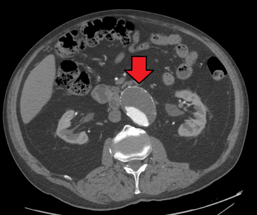
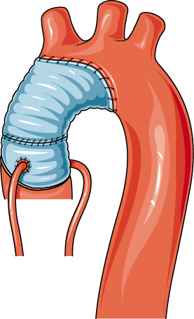

# ANEURISMAS

Para entender aneurismas, você precisa esquecer a ideia de que eles são apenas "balões" que estouram. Como professor, vejo muitos alunos errando questões por não compreenderem a dinâmica da parede arterial. Um aneurisma é uma **dilatação arterial permanente e focal**, que envolve as três camadas da parede do vaso (íntima, média e adventícia), com um aumento de pelo menos **50% do diâmetro normal** esperado para aquele segmento.

Se a aorta de um paciente mede normalmente 2 cm e ela dilata para 2,5 cm, isso é uma ectasia. Se chegar a 3 cm, aí sim temos um aneurisma de aorta abdominal (AAA). Guarde esse número: **3,0 cm** é o ponto de corte para o diagnóstico de AAA na prática clínica e nas provas.

## Fisiopatologia: O "Porquê" da Dilatação

Por que a artéria dilata? Não é apenas "pressão alta". A causa principal é a **degeneração da túnica média**. Imagine a parede da aorta como uma malha de elastina e colágeno. No aneurisma, ocorre um desequilíbrio entre a síntese e a degradação dessas proteínas, mediado por metaloproteinases de matriz (MMPs).

A aterosclerose, embora classicamente associada, hoje é vista mais como um fator facilitador ou um marcador de risco do que a causa primária única. A inflamação crônica na parede do vaso leva à perda de células musculares lisas e ao enfraquecimento estrutural.

**Cuidado com a pegadinha:** A maioria dos aneurismas de aorta abdominal é **infrarrenal**. Por quê? Porque a aorta infrarrenal tem menos camadas de lamelas elásticas e não possui *vasa vasorum* na túnica média (sua nutrição depende da difusão do lúmen). Isso a torna o "elo mais fraco" da corrente.

## Aneurisma de Aorta Abdominal (AAA)

*Figura 1 - TC de abdome com contraste demonstrando aneurisma de aorta abdominal (AAA) infrarrenal, com seta indicando a dilatação aneurismática e trombo mural. Fonte: James Heilman, MD, CC BY-SA 4.0 | Wikimedia Commons*

*Figura 2 - Ilustração esquemática de aneurisma de aorta, sem rótulos em idioma estrangeiro. Fonte: Laboratoires Servier / Smart Servier, CC BY-SA 3.0 | Wikimedia Commons*

Este é o "rei" das provas de cirurgia vascular. Quase 80% das questões sobre o tema focam aqui.

### Fatores de Risco e Rastreio

Você precisa saber quem é o paciente clássico: homem, idoso e **tabagista**. O tabagismo é o fator de risco modificável mais forte, tanto para a formação quanto para a expansão do aneurisma.

**Diretriz de Rastreio (SBACV/SVS):**

- **Quem?** Homens entre 65 e 75 anos que já fumaram (mesmo que tenham parado).

- **Como?** Ultrassonografia (USG) de abdome.

- **Por que não mulheres?** A prevalência é muito menor. O rastreio em mulheres é individualizado, geralmente reservado para aquelas com história familiar de primeiro grau ou tabagistas pesadas.

**Dica do Dr. Will:** Se a prova trouxer um paciente com aneurisma poplíteo, procure um AAA. Cerca de 40-50% dos pacientes com aneurisma de artéria poplítea têm um AAA associado. O contrário não é tão frequente, mas a associação é uma "pérola" que as bancas amam.

### Quadro Clínico: Do Silêncio à Catástrofe

A imensa maioria dos AAA é **assintomático**, descoberto em exames de imagem feitos por outro motivo (o famoso "incidentaloma").

Quando há sintomas, o mais comum é a **dor lombar ou abdominal vaga**, que indica expansão rápida ou compressão de estruturas vizinhas. No exame físico, a **massa abdominal pulsátil** é o achado clássico, mas sua sensibilidade é baixa em pacientes obesos.

**A Tríade Clássica da Ruptura (Memorize isto!):**

- Dor abdominal ou lombar súbita e intensa.

- Hipotensão (choque).

- Massa abdominal pulsátil.

**Erro comum de prova:** Achar que o paciente com AAA roto chega sempre em choque profundo. Muitos chegam com "estabilidade temporária" devido ao tamponamento do hematoma no espaço retroperitoneal. Se o paciente tem dor e você sabe que ele tem um aneurisma, ele está roto até que se prove o contrário.

### Diagnóstico por Imagem

- **USG de Abdome:** Excelente para rastreio e acompanhamento de aneurismas pequenos. É barato e não tem radiação.

- **Angiotomografia (Angio-TC) de Aorta:** É o **padrão-ouro para o planejamento cirúrgico**. Ela define a anatomia, a relação com as artérias renais (colo proximal) e a extensão para as ilíacas.

- **Cuidado:** Não se pede Angio-TC para "vigilância" de aneurisma pequeno (risco de nefrotoxicidade e radiação desnecessária). O USG resolve isso.

### Critérios de Intervenção (Onde o aluno trava)

Por que não operamos todo mundo? Porque o risco da cirurgia (mortalidade de 1-5% na eletiva) deve ser menor que o risco de ruptura anual.

**Indicações de Tratamento Eletivo:**

- **Diâmetro:** ≥ 5,5 cm em homens ou ≥ 5,0 cm em mulheres. (Mulheres rompem com diâmetros menores, por isso o limiar é mais baixo).

- **Crescimento Rápido:** Aumento > 0,5 cm em 6 meses ou > 1,0 cm em 1 ano.

- **Sintomáticos:** Qualquer AAA que cause dor deve ser operado, independente do tamanho.

- **Aneurismas Saculares:** Têm maior risco de ruptura que os fusiformes, sendo frequentemente indicados para correção mesmo com diâmetros menores.

| Diâmetro (Homem) | Conduta (Vigilância) |
| --- | --- |
| 3,0 - 3,9 cm | USG anual |
| 4,0 - 4,9 cm | USG a cada 6 meses |
| 5,0 - 5,4 cm | USG/TC a cada 3 meses ou considerar cirurgia se risco cirúrgico baixo |
| ≥ 5,5 cm | Intervenção (Cirurgia) |

### Tratamento: Aberto vs. Endovascular (EVAR)

Aqui o MedEvo te ajuda a decidir. A escolha depende da anatomia e do risco cirúrgico do paciente.

-

**Cirurgia Aberta (Aneurismectomia + Prótese de Dacron):**

- O cirurgião "abre o abdome", pinça a aorta (clampeamento), abre o saco aneurismático e costura uma prótese.

- **Vantagem:** Durabilidade. Raramente precisa de reintervenção.

- **Desvantagem:** Maior trauma cirúrgico, maior tempo de recuperação, maior risco de complicações cardíacas e respiratórias imediatas.

-

**Tratamento Endovascular (EVAR):**

- Através da artéria femoral, inserimos uma endoprótese que "exclui" o aneurisma da circulação.

- **Vantagem:** Menos invasivo, menor mortalidade perioperatória, recuperação rápida.

- **Desvantagem:** Exige anatomia favorável (colo proximal adequado para fixação). Necessita de acompanhamento rigoroso com imagem para o resto da vida devido ao risco de **Endoleaks** (vazamentos).

**O que é o Colo Proximal?** É o segmento de aorta "sadia" entre as artérias renais e o início do aneurisma. Se não houver pelo menos 10-15 mm de colo, a endoprótese convencional não fixa bem.

### Complicações Pós-Operatórias

- **Isquemia de Cólon:** Ocorre em cerca de 1-3% das cirurgias. Acontece pela ligadura da **Artéria Mesentérica Inferior (AMI)** sem circulação colateral adequada (Arcos de Riolan e Drummond). Suspeite se o paciente apresentar diarreia sanguinolenta e dor abdominal no 2º ou 3º dia de pós-operatório.

- **Fístula Aorto-Entérica (FAE):** Uma complicação tardia e temida. A prótese erode para dentro do duodeno (3ª porção). O paciente apresenta uma "hemorragia sentinela" (sangramento digestivo leve que para sozinho) seguida de uma hemorragia maciça.

- **Insuficiência Renal Aguda:** Pode ocorrer por clampeamento suprarrenal na cirurgia aberta ou por contraste/embolização de cristais de colesterol no EVAR.

## Aneurismas de Aorta Torácica (AAT)

Os AAT são menos comuns que os abdominais, mas trazem desafios anatômicos maiores.

### Etiologia e Localização

- **Aorta Ascendente:** Frequentemente associada à degeneração cística da média, valva aórtica bicúspide e doenças do tecido conjuntivo (Marfan, Ehlers-Danlos).

- **Arco Aórtico:** Desafio cirúrgico devido aos ramos braquiocefálicos.

- **Aorta Descendente:** Principalmente ateroscleróticos.

### Indicações de Cirurgia no AAT

As diretrizes brasileiras e internacionais sugerem:

- **Aorta Ascendente:** ≥ 5,5 cm (ou > 5,0 cm em pacientes com Marfan). Se o paciente for operar a valva aórtica por outro motivo, corrige-se a aorta se > 4,5 cm.

- **Aorta Descendente:** ≥ 5,5 cm para tratamento endovascular (TEVAR) ou ≥ 6,0 cm para cirurgia aberta.

**Sintomas Compressivos:** Diferente do AAA, o AAT pode causar rouquidão (compressão do nervo laríngeo recorrente), disfagia (compressão do esôfago) ou tosse/dispneia (compressão da traqueia).

**Risco de Isquemia Medular:** Na correção de aneurismas toracoabdominais, o clampeamento ou a cobertura da **Artéria de Adamkiewicz** (grande artéria radicular anterior) pode levar à paraplegia. Esta é uma "pérola" clássica de prova de residência.

## Aneurismas Periféricos

Aqui a regra muda completamente. O risco principal não é a ruptura, mas sim a **trombose e embolização distal**.

### Aneurisma de Artéria Poplítea

É o aneurisma periférico mais comum.

- **A Regra dos 50%:** 50% são bilaterais; 50% estão associados a AAA.

- **Clínica:** Frequentemente se manifesta como isquemia aguda de membro (trombose do aneurisma) ou "síndrome dos dedos azuis" (microembolização distal).

- **Indicação de Cirurgia:** Diâmetro **> 2,0 cm** ou presença de trombos murais/sintomas.

- **Tratamento:** Bypass (ponte) com veia safena é o padrão-ouro.

### Aneurisma de Artéria Femoral

Geralmente associado a outros aneurismas. O risco de ruptura é baixo, mas pode causar compressão nervosa ou trombose.

- **Pseudoaneurisma Femoral:** Cuidado! Isso não é um aneurisma verdadeiro. É uma complicação de punção arterial (ex: cateterismo). O sangue sai da artéria e fica contido pelos tecidos adjacentes. O diagnóstico é pelo USG Doppler ("sinal do Yin-Yang").

## Aneurismas Viscerais

### Artéria Esplênica

É o aneurisma visceral mais comum.

- **Perfil:** Mais comum em mulheres multíparas.

- **Risco de Ruptura:** Baixo, exceto na **gravidez** (especialmente no 3º trimestre), onde a mortalidade materna e fetal é altíssima.

- **Indicação de Cirurgia:**

- Diâmetro > 2,0 cm.

- Mulheres em idade fértil ou que planejam engravidar.

- Sintomáticos.

### Artéria Hepática

Segundo mais comum. Tem maior risco de ruptura que o esplênico, por isso a tendência é intervir se > 2,0 cm ou se for sacular.

## Diagnóstico Diferencial de Dor Abdominal Aguda

Em um paciente idoso com dor abdominal, você deve pensar em AAA, mas não pode esquecer de outros "vilões":

| Diagnóstico | Pistas Clínicas | Exame de Escolha |
| --- | --- | --- |
| **AAA Roto** | Tríade: Dor + Hipotensão + Massa Pulsátil | USG (instável) / Angio-TC (estável) |
| **Dissecção de Aorta** | Dor "em facada" que irradia para o dorso, assimetria de pulsos | Angio-TC |
| **Isquemia Mesentérica** | Dor desproporcional ao exame físico, fibrilação atrial | Angio-TC (fase arterial) |
| **Cólica Renal** | Dor em flanco irradiada para região inguinal, hematúria | TC sem contraste |

## Manejo do AAA Roto: A Emergência Real

Se você estiver no plantão e chegar um paciente com suspeita de AAA roto, o tempo é músculo (e vida).

- **Estabilização Inicial:** Dois acessos venosos calibrosos. **Hipotensão Permissiva**: Não tente normalizar a pressão (manter PAS entre 80-90 mmHg). Se você subir muito a pressão, você "expulsa" o coágulo que está tamponando o sangramento e o paciente morre na sua frente.

- **Diagnóstico Rápido:** Se instável, USG beira-leito (FAST vascular) para confirmar o aneurisma. Se estável, Angio-TC para planejar a via (aberta vs. endovascular).

- **Controle Proximal:** O objetivo do cirurgião é chegar na aorta acima do aneurisma e "fechar a torneira". No AAA infrarrenal, o controle pode ser feito no hiato diafragmático (supracelíaco) se o hematoma impedir o acesso ao colo renal.

## Pontos-Chave para Prova 💡

- **Definição:** Dilatação > 50% do diâmetro normal. Para aorta abdominal, diagnóstico se **> 3,0 cm**.

- **Principal Fator de Risco:** Tabagismo (mais importante que HAS para aneurismas).

- **Rastreio:** Homens, 65-75 anos, tabagistas (USG abdome).

- **Indicação Cirúrgica AAA:** ≥ 5,5 cm (homens), ≥ 5,0 cm (mulheres), crescimento rápido (> 0,5 cm/6 meses) ou sintomáticos.

- **Aneurisma Poplíteo:** Risco é **isquemia/trombose**, não ruptura. Operar se > 2,0 cm.

- **Aneurisma Esplênico:** Atenção total à **gestante** ou mulher em idade fértil. Operar se > 2,0 cm.

- **Tríade do AAA Roto:** Dor abdominal + Hipotensão + Massa pulsátil. (Presente em apenas 25-50% dos casos).

- **Complicação Pós-Aneurismectomia:** Diarreia sanguinolenta = **Isquemia de cólon** (ligadura da AMI).

- **Fístula Aorto-Entérica:** Sangramento "sentinela" em paciente com prótese aórtica prévia.

- **Endoleaks (Vazamentos):** Complicação exclusiva do EVAR. O Tipo II (fluxo retrógrado por colaterais como AMI ou lombares) é o mais comum.

- **Anatomia:** O primeiro ramo da aorta abdominal são as **artérias frênicas inferiores**. A artéria de Adamkiewicz é vital na cirurgia torácica para evitar infarto medular.

- **O que NÃO fazer:** Não perca tempo pedindo Angio-TC em paciente com AAA roto e instabilidade hemodinâmica franca. O destino é o centro cirúrgico.

- **Pegadinha de Prova:** A alternativa dirá que a aterosclerose é a causa primária. Lembre-se: a causa é a **degeneração da túnica média**; a aterosclerose é um fator associado.

- **Valores de Referência:** Aorta normal ~2,0 cm. Ectasia 2,1-2,9 cm. Aneurisma ≥ 3,0 cm.

Este material cobre a base necessária para enfrentar as questões de cirurgia vascular nas principais bancas do Brasil. Lembre-se: no aneurisma, o diâmetro dita a conduta, mas o sintoma dita a urgência. Como sempre dizemos no MedEvo, entender a anatomia é 50% do caminho para não cair nas pegadinhas de técnica cirúrgica.

 Cópia offline para consulta pessoal.
 Fonte original:
 [https://www.medevo.com.br/material-apoio/ler/67f857c2-e887-4bb4-beea-1ca6ac54b1c9](https://www.medevo.com.br/material-apoio/ler/67f857c2-e887-4bb4-beea-1ca6ac54b1c9)
