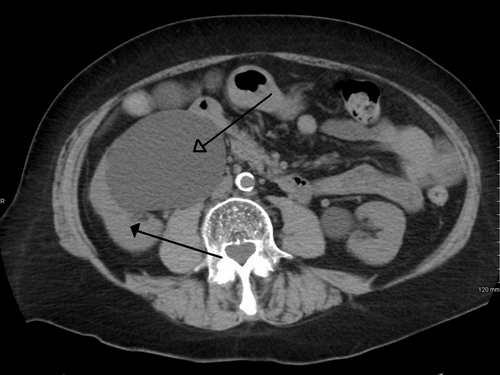
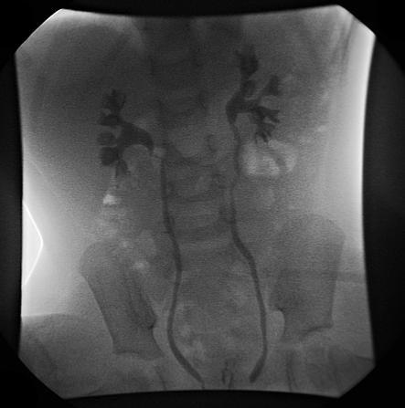

# ANOMALIAS DO TRATO URINÁRIO

Para entender as anomalias do trato urinário, você precisa primeiro esquecer a ideia de que a anatomia é algo estático. Na urologia pediátrica, tudo é sobre fluxo e pressão. Se o xixi não desce porque algo está "apertado" (obstrução) ou se ele resolve subir para onde não devia (refluxo), o rim vai sofrer. E é exatamente isso que as bancas de residência cobram: você sabe identificar onde está o problema e, mais importante, sabe quando colocar a mão ou quando apenas observar?

## O Ponto de Partida: Hidronefrose Antenatal

*Figura 1 - Tomografia computadorizada demonstrando hidronefrose significativa do rim esquerdo, com dilatação acentuada da pelve renal e cálices. Fonte: James Heilman, MD, CC BY-SA 3.0 | Wikimedia Commons*

Hoje em dia, a maioria das anomalias chega ao cirurgião pediátrico via ultrassom (USG) obstétrico. O termo "hidronefrose" é apenas um sinal, não um diagnóstico. É como dizer que o paciente tem "febre". Nossa missão é descobrir a causa.

A medida do diâmetro anteroposterior (DAP) da pelve renal é o que define a gravidade. No segundo trimestre, valores acima de 4 mm nos preocupam; no terceiro trimestre, acima de 7 mm. Se no pós-natal o USG mostrar um DAP > 10-15 mm, ligue o sinal de alerta.

Por que isso importa? Porque a hidronefrose pode ser apenas transitória (o mais comum) ou esconder algo grave como uma Válvula de Uretra Posterior (VUP), que é uma emergência urológica.

## Estenose da Junção Uretero-Piélica (JUP)

Esta é a causa mais comum de hidronefrose neonatal obstrutiva. Imagine que a saída da pelve renal para o ureter é como o gargalo de uma garrafa. Na estenose de JUP, esse gargalo é estreito demais.

### Fisiopatologia e o "Porquê" da Obstrução

A causa geralmente é intrínseca: um segmento aperistáltico do ureter. O músculo ali não empurra a urina. Às vezes, a causa é extrínseca: um vaso polar inferior (uma artéria renal anômala) que "cruza" e aperta a JUP.

O resultado é o mesmo: a pelve renal dilata para tentar acomodar a urina, a pressão sobe e, se nada for feito, o parênquima renal é esmagado contra a cápsula, levando à perda de função.

### Diagnóstico: O Jogo dos Exames

Aqui as bancas adoram te confundir. Grave esta regra de ouro que sempre reforçamos no MedEvo:

- **USG:** Vê a anatomia (dilatação da pelve, mas ureter fino/não visualizado).

- **Cintilografia Renal DTPA ou MAG3 (Dinâmica):** Avalia a **excreção**. Se o radiofármaco demora a sair mesmo após o diurético (furosemida), temos uma obstrução mecânica.

- **Cintilografia Renal DMSA (Estática):** Avalia a **função relativa** e cicatrizes. Se um rim tem menos de 40% da função total, ele está sofrendo.

### Tratamento: A Técnica de Anderson-Hynes

Se o paciente tem sintomas (dor, infecção) ou perda progressiva de função renal (queda > 10% na cintilografia), a cirurgia é mandatória.

A técnica padrão-ouro é a **Pieloplastia de Anderson-Hynes** (Pieloplastia Desmembrada).
**Por que "desmembrada"?** Porque nós cortamos o ureter, retiramos o segmento doente (o estreitamento) e o costuramos de volta na pelve renal, agora de forma bem ampla. É a técnica mais cobrada em provas de cirurgia pediátrica.

## Refluxo Vesicoureteral (RVU)

*Figura 2 - Uretrocistografia miccional (VCUG) demonstrando refluxo vesicoureteral bilateral grau III, com material de contraste refluindo da bexiga para ambos os ureteres e sistemas coletores renais. Fonte: RadsWiki, CC BY-SA 3.0 | Wikimedia Commons*

Se na JUP o problema é a descida, no RVU o problema é a subida. A urina que já está na bexiga volta para o ureter e para o rim.

### A Anatomia do Erro

Normalmente, o ureter entra na bexiga de forma oblíqua, criando um túnel submucoso que funciona como uma válvula: quando a bexiga enche ou contrai, ela aperta esse túnel e fecha o ureter. No RVU, esse túnel é curto ou o ureter entra "direto" (perpendicular), e a válvula falha.

### Classificação Internacional do Refluxo

Você precisa decorar os graus, pois a conduta depende disso:

- **Grau I:** Refluxo apenas para o ureter (não atinge a pelve).

- **Grau II:** Atinge a pelve e cálices, mas sem dilatá-los.

- **Grau III:** Dilatação leve/moderada da pelve e cálices.

- **Grau IV:** Dilatação moderada com tortuosidade do ureter.

- **Grau V:** Grande dilatação, ureter muito tortuoso e perda das impressões papilares nos cálices.

### O Diagnóstico e a "Pegadinha" da Cistografia

O exame padrão para diagnóstico é a **Cistouretrografia Miccional (CUGM)**.
**Dica de Prova:** O USG pode ser normal em refluxos de baixo grau! Se a questão fala em criança com Infecção do Trato Urinário (ITU) febril de repetição, você TEM que investigar RVU com CUGM, mesmo que o USG seja inocente.

E o DMSA? Como mencionei antes, o DMSA serve para ver **cicatrizes renais**. Se o refluxo está causando infecções que "queimam" o rim, o DMSA vai mostrar áreas de hipocaptação.

### Conduta: Quando operar?

A maioria dos graus I a III resolve espontaneamente com o crescimento da criança (o túnel ureteral se alonga). Usamos profilaxia antibiótica e observamos.
Operamos (reimplante ureteral) se:

- Falha do tratamento clínico (ITUs de repetição apesar do antibiótico).

- Piora da função renal ou surgimento de novas cicatrizes no DMSA.

- Graus persistentes em crianças maiores.

## Megaureter Primário

O termo "megaureter" significa apenas um ureter largo (> 7 mm). Ele pode ser:

- **Refluxivo:** O xixi sobe e dilata o ureter.

- **Obstrutivo:** Existe um estreitamento na Junção Uretero-Vesical (JUV).

- **Não-refluxivo e Não-obstrutivo:** É apenas largo, sem doença funcional (comum em recém-nascidos).

O **Megaureter Primário Obstrutivo** é o que mais cai. O tratamento cirúrgico (reimplante ureteral com modelagem do ureter) é indicado em pacientes sintomáticos, com ITUs recorrentes ou disfunção renal progressiva. Note que a lógica é a mesma da JUP: se o rim está sofrendo ou o paciente está doente, a faca é o caminho.

## Duplicidade Pieloureteral

Aqui a embriologia prega peças. Em vez de um broto ureteral, temos dois. Isso pode ser uma duplicidade incompleta (ureteres se unem antes da bexiga - "Y") ou completa (dois orifícios na bexiga).

### A Lei de Weigert-Meyer

Esta lei é o terror dos alunos, mas o Dr. Will simplifica para você:

- O ureter que drena o **polo superior** do rim desemboca mais **baixo** (ectópico) e mais medial na bexiga. Ele tende a ser **obstrutivo** (pode ter ureterocele).

- O ureter que drena o **polo inferior** desemboca mais **alto** e lateral. Ele tende a ter **refluxo**.

**Exemplo Clínico:** Menina de 4 anos com queixa de "molhar a calcinha o dia todo", mas que urina normalmente no vaso. Suspeite de **Ectopia Ureteral**. O ureter do polo superior pode estar desembocando na vagina ou uretra distal, abaixo do esfíncter. Ela goteja urina continuamente porque não há esfíncter segurando aquele ureter específico.

## Hipospádia

Saímos do rim e fomos para a uretra. A hipospádia é definida por uma tríade clássica:

- Abertura ectópica do meato uretral na face **ventral** do pênis.

- **Cordee** (curvatura peniana ventral).

- Capuz prepucial dorsal (excesso de pele em cima, falta embaixo).

### Quando e Por Que Operar?

A idade ideal para correção é entre **6 e 12 meses**.
**Por que tão cedo?**

- Melhor cicatrização e menor taxa de complicações.

- Menor trauma psicológico para a criança.

- O pênis tem tamanho suficiente para a delicadeza da técnica.

**Erro clássico de prova:** Orientar a circuncisão (posto) antes da correção da hipospádia. **NUNCA** faça isso. O cirurgião precisa daquela pele do "capuz" para reconstruir a uretra. Se você tirar a pele, tirou o material de construção do urologista.

## Válvula de Uretra Posterior (VUP)

Esta é a anomalia obstrutiva mais grave. Ocorre apenas em meninos. Uma membrana na uretra prostática impede a saída da urina.

### O Quadro Clínico e o Sinal da "Orelha de Burro"

O feto tem bexigoma, hidronefrose bilateral e, crucialmente, **oligodramnia** (pouco líquido amniótico). Sem líquido, o pulmão não desenvolve (hipoplasia pulmonar).
No USG ou na Cistografia, podemos ver o divertículo de bexiga, que as bancas chamam de **sinal da orelha de burro**.

O tratamento inicial é a drenagem da bexiga (sondagem) e estabilização metabólica, seguido da ablação da válvula por endoscopia.

## Trauma de Bexiga: Um parêntese necessário

Embora não seja uma "anomalia congênita", o trauma vesical aparece nas mesmas provas de urologia pediátrica.

### Rotura Intraperitoneal vs. Extraperitoneal

Esta diferenciação determina se o paciente vai para o centro cirúrgico ou para a enfermaria.

| Tipo de Rotura | Localização | Conduta | Por que? |
| --- | --- | --- | --- |
| **Intraperitoneal** | Cúpula vesical (ponto mais fraco) | **Laparotomia Exploradora + Reparo** | A urina cai na cavidade peritoneal, causando peritonite química e sepse. |
| **Extraperitoneal** | Base ou colo vesical (geralmente associada a fratura de pelve) | Conservador (Sonda de Foley) | A urina fica contida no espaço retropúbico. A bexiga cicatriza sozinha se estiver drenada. |

**Dica de Ouro:** Se a questão diz "paciente com trauma pélvico, dor abdominal difusa e sinal de irritação peritoneal", a rotura é intraperitoneal. Conduta? Laparotomia imediata.

## Diagnóstico Diferencial: O Abdome Agudo Neonatal

Muitas vezes, uma malformação urinária pode ser confundida ou estar associada a problemas intestinais. As bancas gostam de colocar tudo no mesmo cesto de "Abdome Agudo Neonatal Cirúrgico".

- **Atresia Intestinal:** Vômitos biliosos precoces e distensão.

- **Doença de Hirschsprung (Megacólon Congênito):** Atraso na eliminação de mecônio (> 48h). O reto está vazio no toque retal, mas há saída explosiva de fezes após a retirada do dedo.

- **Volvo de Intestino Médio:** Uma emergência absoluta por má rotação intestinal. O intestino "torce" e sofre isquemia.

Lembre-se: se um recém-nascido não urina, pense em VUP. Se não evacua, pense em Hirschsprung ou Atresia.

## Tabelas Comparativas para Fixação

### Tabela 1: Cintilografia Renal - Qual pedir?

| Exame | O que avalia | Principal Indicação |
| --- | --- | --- |
| **DMSA** | Parênquima e função tubular (estático) | Pesquisa de cicatrizes (RVU, ITU de repetição) |
| **DTPA / MAG3** | Fluxo e excreção (dinâmico) | Avaliação de obstrução (Estenose de JUP) |

### Tabela 2: JUP vs. RVU

| Característica | Estenose de JUP | Refluxo Vesicoureteral (RVU) |
| --- | --- | --- |
| **Local da falha** | Saída do rim (Junção Uretero-Piélica) | Entrada na bexiga (Junção Uretero-Vesical) |
| **Ureter no USG** | Fino ou não visualizado | Frequentemente dilatado (se grau alto) |
| **Exame Chave** | Cintilografia DTPA | Cistouretrografia Miccional (CUGM) |
| **Cirurgia Padrão** | Pieloplastia de Anderson-Hynes | Reimplante Ureteral |

### Tabela 3: Conduta na Hidronefrose Antenatal Pós-Parto

| Achado Pós-Natal | Conduta Sugerida |
| --- | --- |
| Hidronefrose Bilateral (Menino) | Suspeitar de VUP -> Sondagem + CUGM Urgente |
| Hidronefrose Unilateral Leve | USG após 48-72h de vida (evitar desidratação neonatal) |
| Hidronefrose Unilateral Grave | USG + Antibioticoprofilaxia + DTPA após 4-6 semanas |

## O "Porquê" das Condutas: Antecipando Erros

Muitos alunos erram ao pedir USG de rins e vias urinárias nas primeiras 24 horas de vida de um bebê com hidronefrose antenatal. **Não faça isso!**
Nas primeiras 24-48 horas, o recém-nascido está fisiologicamente desidratado. O fluxo urinário é baixo e a hidronefrose pode "desaparecer" falsamente no exame. O ideal é esperar após o 3º dia de vida, a menos que haja suspeita de VUP (bexigoma, hidronefrose bilateral grave).

Outro erro comum: achar que toda duplicidade renal precisa de cirurgia. A maioria é assintomática e achado de exame. Só operamos se houver complicação (refluxo grave no polo inferior ou obstrução/ureterocele no polo superior).

## Pontos-Chave para Prova 🎯

- **Estenose de JUP:** Causa mais comum de hidronefrose obstrutiva neonatal. Técnica cirúrgica: Pieloplastia de Anderson-Hynes.

- **Hipospádia:** Tríade é abertura ventral + cordee + capuz prepucial. Cirurgia entre 6-12 meses. **NUNCA** circuncidar antes da correção.

- **Refluxo Vesicoureteral (RVU):** Diagnóstico por Cistografia (CUGM). DMSA serve para ver cicatrizes renais.

- **Válvula de Uretra Posterior (VUP):** Exclusiva de meninos. Causa bexigoma e hidronefrose bilateral. É uma emergência.

- **Lei de Weigert-Meyer:** Polo superior = ectopia/obstrução. Polo inferior = refluxo.

- **Trauma de Bexiga Intraperitoneal:** Sempre cirúrgico (Laparotomia). Ocorre na cúpula vesical.

- **Trauma de Bexiga Extraperitoneal:** Tratamento conservador com sonda de Foley (na maioria dos casos).

- **Megaureter Primário Obstrutivo:** Cirurgia se houver perda de função renal ou ITUs febris de repetição.

- **DMSA vs DTPA:** DMSA = Cicatriz/Função fixa. DTPA = Obstrução/Excreção.

- **Ectopia Ureteral em Meninas:** Suspeite se houver gotejamento contínuo de urina apesar de micções normais.

- **Sinal da Orelha de Burro:** Divertículo vesical na cistografia, sugestivo de VUP.

- **Hidronefrose Antenatal:** O diâmetro da pelve renal > 15 mm no pós-natal é forte preditor de necessidade cirúrgica.

- **Profilaxia Antibiótica:** Indicada em RVU de alto grau e hidronefroses graves enquanto se aguarda investigação.

- **Cicatriz Renal:** A presença de cicatriz no DMSA é o principal fator de risco para hipertensão arterial e insuficiência renal crônica no futuro dessas crianças.

- **Ureterocele:** Dilatação cística da porção terminal do ureter dentro da bexiga; comum no polo superior de sistemas duplicados.

Ao revisar este material, lembre-se do que sempre discutimos no MedEvo: a anatomia pediátrica é dinâmica. O rim da criança tem uma capacidade de recuperação fantástica, desde que você alivie a pressão ou interrompa o refluxo antes que as cicatrizes se tornem permanentes. Se a questão de prova te der um DMSA com função < 10% naquele rim, muitas vezes a conduta não é mais a pieloplastia, mas sim a nefrectomia, pois o órgão já perdeu sua viabilidade. Fique atento a esses detalhes!

 Cópia offline para consulta pessoal.
 Fonte original:
 [https://www.medevo.com.br/material-apoio/ler/af53967a-a836-4945-ba3b-2611bbe5a658](https://www.medevo.com.br/material-apoio/ler/af53967a-a836-4945-ba3b-2611bbe5a658)
