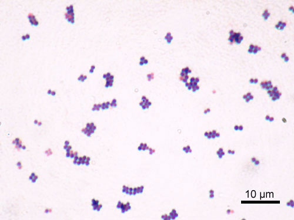

# ANTIBIOTICOPROFILAXIA CIRÚRGICA

Para entender a antibioticoprofilaxia, você precisa primeiro separar dois mundos na sua cabeça: o mundo da **prevenção** e o mundo do **tratamento**. Se o paciente já tem uma infecção instalada (um abscesso, uma peritonite por apendicite perfurada há 3 dias), você não está fazendo profilaxia; você está tratando.

A antibioticoprofilaxia cirúrgica consiste na administração de antimicrobianos a pacientes que **não** apresentam evidência de infecção ativa, com o objetivo de reduzir a carga bacteriana no sítio cirúrgico durante o procedimento. O foco aqui é evitar a Infecção do Sítio Cirúrgico (ISC).

## Fisiopatologia e o "Porquê" da Profilaxia

Por que damos o antibiótico antes da incisão? Existe um conceito chamado "Corrida pela Superfície". No momento em que o cirurgião faz a incisão, o tecido subcutâneo e as cavidades ficam expostos. Há uma competição entre as células de defesa do hospedeiro e as bactérias (da pele do paciente ou do ambiente) para colonizar aquele tecido.

Se a bactéria "ganhar a corrida" e se aderir ao tecido ou a um implante (prótese), ela pode formar um biofilme, tornando-se quase invulnerável ao sistema imune e aos antibióticos sistêmicos posteriores. Por isso, o antibiótico deve estar presente no **tecido** (não apenas no sangue) no exato momento em que a lâmina do bisturi toca a pele.

Como dizemos no MedEvo, a profilaxia não serve para "esterilizar" o paciente, mas para reduzir o inóculo bacteriano a um nível que o sistema imunológico consiga controlar.

## Classificação das Cirurgias por Potencial de Contaminação

*Figura 1 - Microscopia com coloração de Gram (aumento de 1.000x) mostrando Staphylococcus aureus, o principal agente causador de Infecção do Sítio Cirúrgico (ISC), arranjado em cachos característicos de cocos Gram-positivos. Fonte: Y Tambe, CC BY-SA 3.0 | Wikimedia Commons*

Esta é a tabela mais importante da sua vida para provas de residência. As bancas amam trocar os conceitos. A indicação da profilaxia depende diretamente desta classificação, proposta originalmente por Altemeier.

### 1. Cirurgias Limpas

São aquelas realizadas em tecidos estéreis ou passíveis de descontaminação, sem abertura de tratos (respiratório, digestório, geniturinário ou orofaríngeo). O trauma é não penetrante e não há inflamação local.

- **Exemplos:** Hernioplastia inguinal, tireoidectomia, mastectomia, cirurgias cardíacas e ortopédicas eletivas.

- **Risco de ISC:** < 2%.

- **Conduta:** Geralmente **não** precisam de profilaxia, **exceto** se houver uso de próteses/implantes (ex: tela na hérnia, válvula cardíaca) ou se as consequências de uma infecção forem catastróficas (ex: neurocirurgia).

### 2. Cirurgias Limpas-Contaminadas (Potencialmente Contaminadas)

Ocorre a abertura controlada de tratos colonizados (digestório, respiratório ou urinário), sob condições controladas e sem contaminação incomum.

- **Exemplos:** Colecistectomia eletiva, gastrectomia, histerectomia vaginal, orofaringe.

- **Risco de ISC:** 3-11%.

- **Conduta:** Profilaxia **sempre** indicada.

### 3. Cirurgias Contaminadas

Ocorre em tecidos recentemente traumatizados (menos de 4 horas), com inflamação aguda (sem pus), ou quando há quebra importante de técnica asséptica (ex: massagem cardíaca aberta) ou extravasamento grosseiro de conteúdo de víscera oca.

- **Exemplos:** Apendicite aguda sem perfuração (inflamação franca), ferimentos traumáticos abertos recentes, colecistite aguda.

- **Risco de ISC:** 10-17%.

- **Conduta:** Profilaxia **sempre** indicada.

### 4. Cirurgias Infectadas (Sujas)

Presença de infecção prévia, pus, tecido necrótico ou víscera oca perfurada com tempo de evolução prolongado (geralmente > 4-6 horas).

- **Exemplos:** Peritonite por perfuração de cólon, abscesso drenado, ferida traumática com tecido desvitalizado e corpo estranho.

- **Conduta:** Aqui não falamos em profilaxia, mas em **Antibioticoterapia Terapêutica**. O antibiótico será mantido por dias (5, 7, 10 dias), dependendo da resposta clínica.

| Classificação | Definição | Exemplo Clássico | Conduta ATB |
| --- | --- | --- | --- |
| **Limpa** | Sem abertura de tratos, sem inflamação | Tireoidectomia | Só se prótese/implante |
| **Limpa-Contaminada** | Abertura controlada de tratos | Colecistectomia eletiva | Dose única profilática |
| **Contaminada** | Inflamação aguda ou trauma < 4h | Colecistite aguda | Dose única profilática |
| **Infectada** | Pus, necrose, perfuração > 4h | Abscesso, Peritonite | Tratamento (curativo) |

## Princípios de Administração: O Timing é Tudo

Se você administrar o antibiótico na enfermaria 2 horas antes da cirurgia, você errou. Se administrar após o clampeamento do cordão umbilical na cesárea (como se fazia antigamente), você também está desatualizado perante as diretrizes mais recentes (embora algumas bancas ainda cobrem o clampeamento, a ANVISA e a OMS recomendam pré-incisão).

### O Momento da Administração (Timing)

O objetivo é atingir o **Pico Sérico e Tecidual** no momento da incisão.

- **Regra Geral:** 30 a 60 minutos antes da incisão cutânea (geralmente na indução anestésica).

- **Exceções (Vancomicina e Fluoroquinolonas):** Como exigem infusão lenta para evitar efeitos colaterais (como a Síndrome do Homem Vermelho da Vancomicina), devem ser iniciadas **60 a 120 minutos** antes da incisão.

### Repetição da Dose (Repique)

Muitos alunos esquecem que o antibiótico tem meia-vida. Se a cirurgia demorar muito, o nível tecidual cai abaixo da Concentração Inibitória Mínima (CIM).
Você deve repetir a dose intraoperatória se:

- **Duração da cirurgia > 2 meias-vidas do fármaco.** (Para a Cefazolina, cuja meia-vida é de ~2h, repete-se a cada 4 horas).

- **Perda sanguínea volumosa (> 1.500 ml).** O antibiótico vai embora com o sangue e é diluído pela reposição volêmica.

- **Queimaduras extensas** (alteram o volume de distribuição).

**Cuidado:** O tempo para repetição conta a partir da dose profilática inicial, não do início da cirurgia.

### Duração da Profilaxia

A diretriz é clara: **Dose única é o ideal.**
Se houver necessidade de manter, o limite máximo é de **24 horas**. Manter antibiótico por 3, 5 ou 7 dias "por segurança" em cirurgias não infectadas é um erro grave que favorece a resistência bacteriana e a infecção por *Clostridioides difficile*. Em cirurgias cardíacas, algumas diretrizes ainda aceitam até 48 horas, mas a tendência mundial é a redução para 24h.

## Escolha do Antimicrobiano

A escolha não é aleatória. Ela deve cobrir os patógenos mais prováveis daquele sítio cirúrgico.

### O Coringa: Cefazolina (Cefalosporina de 1ª Geração)

É a droga de escolha para a grande maioria das cirurgias (cardíacas, ortopédicas, vasculares, ginecológicas e gerais).

- **Por que?** Excelente cobertura para *Staphylococcus aureus* (principal patógeno da pele), meia-vida razoável, baixo custo e baixa toxicidade.

- **Dose:** 2g EV (se o paciente tiver > 120kg, a dose deve ser 3g).

### Cirurgias Colorretais e Apendicectomia

Aqui o inimigo muda. Além dos Gram-positivos da pele, temos Gram-negativos entéricos (*E. coli*) e **Anaeróbios** (*Bacteroides fragilis*).

- **Opções:**

- Cefoxitina (Cefalosporina de 2ª geração que cobre anaeróbios).

- Cefazolina + Metronidazol.

- Amoxicilina + Clavulanato.

### O Paciente Alérgico à Penicilina

Esta é uma pegadinha clássica de prova. Se a alergia for leve (ex: apenas rash cutâneo), você ainda pode usar Cefalosporinas, pois a reação cruzada é baixa (~1%).
Porém, se a alergia for **Grave/Anafilática**, você deve evitar todos os betalactâmicos.

- **Alternativa para Gram-positivos:** Clindamicina ou Vancomicina.

- **Alternativa para Gram-negativos:** Gentamicina (Aminoglicosídeo) ou Ciprofloxacino (Quinolona).

- **Exemplo em Colectomia:** Clindamicina + Gentamicina.

| Sítio Cirúrgico | Patógenos Prováveis | Droga de Escolha |
| --- | --- | --- |
| Pele / Ortopedia / Cardíaca | *S. aureus, S. epidermidis* | Cefazolina |
| Gastroduodenal | Gram-negativos, Gram-positivos | Cefazolina |
| Biliar (Eletiva) | Gram-negativos (*E. coli, Klebsiella*) | Cefazolina |
| Colorretal / Apêndice | Gram-negativos e Anaeróbios | Cefoxitina ou Cefazolina + Metronidazol |
| Urológica | *E. coli, Proteus* | Ciprofloxacino ou SMX-TMP |

## Situações Especiais e "Pérolas" de Prova

### 1. O Uso da Vancomicina

Não se usa Vancomicina de rotina para todo mundo. Ela é reservada para:

- Hospitais com alta prevalência de MRSA (*S. aureus* resistente à meticilina).

- Pacientes colonizados por MRSA.

- Alergia grave a betalactâmicos.

- Lembre-se: Vancomicina é inferior à Cefazolina para o *S. aureus* sensível (MSSA). Se o paciente não tem risco de MRSA, a Cefazolina protege mais!

### 2. Colecistectomia Videolaparoscópica

Em pacientes jovens, saudáveis (ASA 1 ou 2), para cirurgia eletiva de colelitíase, a antibioticoprofilaxia é **discutível** e muitas vezes desnecessária. No entanto, as bancas costumam indicar se houver fatores de risco: ASA ≥ 3, diabetes, colecistite aguda, gravidez ou se houver conversão para cirurgia aberta.

### 3. Esplenectomia

Aqui a preocupação não é apenas o sítio cirúrgico, mas a sepse pós-esplenectomia por germes encapsulados (*S. pneumoniae, H. influenzae, N. meningitidis*).

- **Conduta:** Vacinação idealmente 2 semanas **antes** da cirurgia eletiva. Se for urgência (trauma), vacinar 2 semanas **após** a cirurgia.

### 4. Obesidade

O Dr. Will sempre lembra nas discussões de caso: o tecido adiposo é mal vascularizado e as doses padrão de antibiótico podem não atingir a CIM. Para pacientes com IMC > 35 ou peso > 120kg, a dose de Cefazolina deve ser aumentada para 3g.

### 5. Profilaxia para Endocardite Infecciosa

Não confunda com profilaxia de sítio cirúrgico. A profilaxia para endocardite é indicada em procedimentos que manipulam mucosa gengival ou periapical dos dentes em pacientes de **alto risco**:

- Portadores de próteses valvares.

- Endocardite prévia.

- Cardiopatias congênitas cianóticas não reparadas.

- **Droga:** Amoxicilina 2g VO, 1 hora antes do procedimento.

## Medidas Não Farmacológicas (Tão importantes quanto o ATB)

A prova pode te perguntar sobre o "Bundle" de prevenção de infecção. O antibiótico é apenas um dos pilares.

- **Tricotomia:** Se necessária, deve ser feita com **tricotomizador elétrico** imediatamente antes da cirurgia. **Nunca** use lâmina de barbear (razor), pois ela cria microabrasões que servem de nicho para proliferação bacteriana, aumentando o risco de infecção.

- **Controle Glicêmico:** Manter glicemia < 200 mg/dL no perioperatório (mesmo em não diabéticos).

- **Normotermia:** O paciente hipotérmico faz vasoconstrição periférica, diminuindo a chegada de oxigênio e de antibiótico ao tecido.

- **Oxigenação:** Manter saturação adequada para otimizar a função dos neutrófilos.

- **Higienização das Mãos:** Continua sendo a medida isolada mais eficaz para prevenir infecção hospitalar.

## Erros Comuns que as Bancas Adoram

- **Confundir Profilaxia com Tratamento:** Se a questão descreve um paciente com febre, leucocitose e secreção purulenta no peritônio, a resposta **nunca** será "dose única de cefazolina". Será tratamento por tempo prolongado.

- **Trocar o Timing:** Dizer que o antibiótico deve ser feito "na enfermaria" ou "após a cirurgia". O correto é na indução anestésica.

- **Errar a Cefalosporina:** Usar Ceftriaxone (3ª geração) para profilaxia de pele. Ceftriaxone é excelente para Gram-negativos, mas inferior à Cefazolina para *S. aureus*. Além disso, induz muito mais resistência bacteriana.

- **Alergia a Frutos do Mar:** Existe um mito de que quem tem alergia a frutos do mar não pode usar Povidine (PVPI). Isso é falso. A alergia ao iodo é raríssima; a alergia a frutos do mar é a proteínas do animal. No entanto, na prática, prefere-se Clorexidina pela maior eficácia residual.

## Tabelas de Consulta Rápida

### Tabela de Repique (Dose Intraoperatória)

| Antibiótico | Meia-vida aproximada | Repetir dose após |
| --- | --- | --- |
| **Cefazolina** | 2 horas | 4 horas |
| **Cefoxitina** | 1 hora | 2 horas |
| **Clindamicina** | 3 horas | 6 horas |
| **Vancomicina** | 6-8 horas | Não costuma repetir |

### Manejo de Alergia à Penicilina

| Tipo de Reação | Conduta para Profilaxia |
| --- | --- |
| **Leve (Exantema tardio)** | Pode usar Cefazolina com cautela |
| **Grave (Anafilaxia, Edema de Glote)** | **NÃO** usar betalactâmicos. Usar Clindamicina ou Vancomicina |

## Pontos-Chave para Prova 🎯

- **Objetivo:** Ter nível tecidual acima da CIM no momento da incisão e durante todo o ato operatório.

- **Timing Padrão:** 30-60 min antes da incisão.

- **Timing Vancomicina/Quinolonas:** 60-120 min antes da incisão (devido ao tempo de infusão).

- **Duração:** Dose única ou no máximo 24 horas.

- **Cirurgia Limpa:** Só faz profilaxia se houver implante de prótese ou se for neurocirurgia/cardíaca.

- **Cirurgia Limpa-Contaminada:** Sempre faz profilaxia.

- **Cirurgia Infectada:** Não é profilaxia, é tratamento (antibioticoterapia).

- **Cefazolina:** Droga de escolha para a maioria das cirurgias. Dose de 2g (3g se > 120kg).

- **Cirurgia Colorretal:** Exige cobertura para anaeróbios (*B. fragilis*). Cefoxitina ou Cefazolina + Metronidazol.

- **Repique:** Repetir dose se a cirurgia durar > 2 meias-vidas da droga ou se perda sanguínea > 1.500ml.

- **Tricotomia:** Apenas se necessário, com tricotomizador elétrico. **Lâmina de barbear é proibida.**

- **Clorexidina:** Superior ao Povidine (PVPI) por ter maior efeito residual e não ser inativada por matéria orgânica.

- **Apendicectomia não complicada:** Profilaxia na indução. Se houver pus/perfuração, vira tratamento.

- **Traqueostomia:** É cirurgia limpa-contaminada, mas as diretrizes geralmente **não** recomendam profilaxia de rotina.

- **Cesariana:** Administrar 30-60 min antes da incisão (não esperar o clampeamento do cordão).

- **Vancomicina:** Não é superior à cefazolina para MSSA; usar apenas se risco de MRSA ou alergia grave.

- **Gentamicina:** Não atravessa bem a barreira hematoencefálica; não serve para profilaxia/tratamento de SNC.

- **Descalonamento:** Sempre que possível, ajustar o antibiótico para o espectro mais estreito baseado em culturas (em caso de tratamento).

 Cópia offline para consulta pessoal.
 Fonte original:
 [https://www.medevo.com.br/material-apoio/ler/ee8e3ec1-bdfb-4eaf-a897-7532c02aacc5](https://www.medevo.com.br/material-apoio/ler/ee8e3ec1-bdfb-4eaf-a897-7532c02aacc5)
