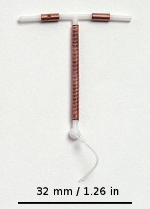

# ANTICONCEPÇÃO DE EMERGÊNCIA

A anticoncepção de emergência (AE) é um daqueles temas que, na prática do pronto-socorro ou do posto de saúde, parece simples, mas que nas provas de residência se torna um campo minado de detalhes técnicos e protocolos específicos. O primeiro conceito que você precisa fixar é que a AE não é um método abortivo. Se você entender o mecanismo de ação, entenderá por que as bancas batem tanto na tecla do tempo de uso.

Diferente do que o senso comum propaga, a AE não deve ser chamada de "pílula do dia seguinte", pois esse termo sugere que ela só funciona se tomada em 24 horas, o que é um erro. Ela é um método de resgate, indicado para situações onde houve falha do método habitual (ruptura de preservativo, esquecimento de pílula) ou em casos de violência sexual.

## Mecanismo de Ação: O Porquê do Tempo

Para entender a AE, você precisa lembrar do ciclo menstrual. A ovulação ocorre após um pico do hormônio luteinizante (LH). O objetivo principal da anticoncepção de emergência hormonal, especialmente o Levonorgestrel, é retardar ou inibir a ovulação.

Se a paciente toma a medicação antes do pico de LH, o Levonorgestrel consegue impedir que o folículo se rompa. Agora, preste atenção: se a ovulação já tiver ocorrido, o Levonorgestrel não tem efeito significativo sobre a implantação do blastocisto nem sobre uma gestação já iniciada. É por isso que ele não é abortivo.

Por que isso cai na prova? Porque a banca quer saber se você entende que a eficácia diminui conforme o tempo passa. Quanto mais perto da ovulação a mulher estiver, ou quanto mais tempo ela demorar para tomar o remédio após a relação, maior o risco de o pico de LH já ter acontecido.

No caso do DIU de Cobre, o mecanismo é diferente. Ele causa uma reação inflamatória estéril no endométrio que é tóxica para os espermatozoides e óvulos, impedindo a fertilização. Ele também pode impedir a implantação, sendo o único método que mantém alta eficácia mesmo se a fertilização já tiver ocorrido, desde que inserido no prazo.

## Métodos Disponíveis e Posologia

No Brasil, trabalhamos principalmente com três frentes, mas duas dominam as questões de prova e a rotina do SUS.

### Levonorgestrel (LNG)

*Figura 1 - Comprimido de anticoncepção de emergência (Levonorgestrel 1,5mg) em embalagem blister unitária, a apresentação mais comum para dose única. Fonte: Mettiche, Domínio Público | Wikimedia Commons*

É o padrão-ouro das provas para casos de violência sexual e uso ambulatorial. É um progestágeno isolado.
A dose preconizada é de 1,5 mg. Você pode encontrar em duas apresentações:

- Dose única de 1,5 mg (mais comum e com melhor adesão).

- Duas doses de 0,75 mg, com intervalo de 12 horas entre elas.

Cuidado: a eficácia é a mesma entre as duas formas de administração do LNG, mas a dose única evita que a paciente esqueça a segunda tomada. Em provas de violência sexual, a recomendação da FEBRASGO e do Ministério da Saúde é preferencialmente a dose única de 1,5 mg o mais precocemente possível.

### Acetato de Ulipristal (UPA)

Este é um modulador seletivo do receptor de progesterona. Ele é mais potente que o Levonorgestrel porque consegue adiar a ovulação mesmo quando o pico de LH já começou a subir (mas ainda não atingiu o máximo).
Dose: 30 mg em dose única.
Janela: Pode ser usado até 120 horas (5 dias) após a relação, mantendo a eficácia constante ao longo desses dias.

### DIU de Cobre

*Figura 2 - Dispositivo intrauterino (DIU) de cobre modelo Paragard, o método de anticoncepção de emergência mais eficaz, podendo ser inserido até 120 horas após a relação desprotegida e mantido como contracepção de longa duração. Fonte: LeiaWonder, CC BY-SA 4.0 | Wikimedia Commons*

Muitos alunos esquecem que o DIU é um método de emergência. Na verdade, ele é o método mais eficaz de todos.
Indicação: Pode ser inserido até 5 dias (120 horas) após a relação desprotegida.
Vantagem: Além da emergência, ele já permanece como um método contraceptivo de longa duração (LARC) para a paciente.

### Método de Yuzpe

Este método é histórico e raramente usado hoje devido aos efeitos colaterais, mas ainda aparece em alternativas de prova para te confundir. Consiste no uso de pílulas anticoncepcionais combinadas comuns (Etinilestradiol + Levonorgestrel) em altas doses.
Por que caiu em desuso? Porque causa muita náusea e vômito devido ao estrogênio. Se a questão te der a opção entre Levonorgestrel isolado e Yuzpe, o Levonorgestrel é sempre superior por ter menos efeitos gastrointestinais.

### Tabela 1: Comparativo de Métodos de Emergência

| Método | Composição | Janela de Uso | Eficácia |
| --- | --- | --- | --- |
| Levonorgestrel | Progestágeno (1,5mg) | Até 72h (ideal) a 120h | Alta (decai após 72h) |
| Ulipristal | Modulador Progesterona | Até 120h | Superior ao LNG |
| DIU de Cobre | Cobre | Até 120h | O mais eficaz (>99%) |
| Yuzpe | EE + LNG | Até 72h | Menor eficácia / Mais efeitos |

## Indicações e Janela de Oportunidade

A pergunta clássica de prova é: "Até quando posso prescrever?".
Segundo o Ministério da Saúde e a FEBRASGO, a AE deve ser oferecida o mais rápido possível.

- Até 72 horas: Período de eficácia máxima para o Levonorgestrel.

- De 72 a 120 horas: O Levonorgestrel ainda pode ser usado (embora com eficácia reduzida), mas o Ulipristal ou o DIU de Cobre seriam as escolhas ideais aqui.

Imagine uma paciente que chega ao serviço 4 dias após uma relação desprotegida. Se você tiver apenas o Levonorgestrel, você deve prescrever? Sim. É melhor do que nada, e as diretrizes brasileiras autorizam o uso até o 5º dia, embora deixem claro que a eficácia é bem menor após as 72 horas iniciais.

## Manejo de Efeitos Colaterais

O efeito colateral mais temido é o vômito. Se a paciente vomitar a medicação, o que fazer?
A regra é clara:

- Vômito dentro de 2 horas após a ingestão: Deve-se repetir a dose.

- Vômito após 2 horas da ingestão: Não precisa repetir, a absorção já foi suficiente.

Dica do Dr. Will: Se a paciente já tem histórico de náuseas com anticoncepcionais ou se você está usando o método de Yuzpe, prescrever um antiemético 30 minutos antes da AE é uma conduta inteligente que evita o retrabalho e a falha do método.

## Anticoncepção de Emergência na Violência Sexual

Este é o tópico que mais gera questões. No atendimento à vítima de violência sexual, a AE é uma prioridade absoluta dentro do protocolo de profilaxias.

Diferente de uma relação consensual onde houve falha do preservativo, na violência sexual você não tem controle sobre o ciclo da vítima e o risco de gravidez é alto. O protocolo brasileiro exige que a AE seja oferecida a toda mulher em idade reprodutiva que sofreu violência sexual, independentemente da fase do ciclo menstrual, desde que dentro do prazo de 120 horas.

### O Protocolo de Profilaxia Pós-Exposição (PEP)

A AE não anda sozinha na violência sexual. Ela faz parte de um "pacote" de cuidados. As bancas adoram misturar as drogas. Vamos organizar:

- HIV: Tenofovir (300mg) + Lamivudina (300mg) + Dolutegravir (50mg) por 28 dias. Deve ser iniciado preferencialmente em 2h, no máximo 72h.

- Sífilis: Penicilina Benzatina 2,4 milhões UI (IM, dose única).

- Gonorreia: Ceftriaxona 500mg (IM, dose única).

- Clamídia: Azitromicina 1g (VO, dose única).

- Tricomoníase: Metronidazol 2g (VO, dose única).

- Hepatite B: Vacina (se não vacinada) + Imunoglobulina específica (se o agressor for sabidamente HBsAg+ ou se a vítima não tiver esquema vacinal completo).

### Tabela 2: Profilaxia na Violência Sexual (Resumo MedEvo)

| Alvo | Medicação | Dose / Esquema |
| --- | --- | --- |
| Gravidez | Levonorgestrel | 1,5 mg dose única |
| HIV | TDF + 3TC + DTG | 1x ao dia por 28 dias |
| Sífilis | Penicilina Benzatina | 2,4 milhões UI IM |
| Gonococo | Ceftriaxona | 500 mg IM |
| Clamídia | Azitromicina | 1 g VO |
| Tricomonas | Metronidazol | 2 g VO |

Importante: Para a profilaxia de ISTs não virais (sífilis, clamídia, gonorreia, tricomoníase), o protocolo atual do Ministério da Saúde recomenda o tratamento preventivo imediato na primeira consulta. Não se espera o resultado de exames para tratar uma vítima de violência sexual.

## Aspectos Legais e Éticos

Aqui é onde muitos alunos perdem pontos por desconhecimento da legislação brasileira.
Para oferecer a anticoncepção de emergência e todo o protocolo de violência sexual:

- NÃO é necessário Boletim de Ocorrência (BO).

- NÃO é necessário exame de corpo de delito.

- A palavra da mulher tem presunção de veracidade.

Se uma questão de prova disser que o médico deve aguardar a autorização policial para dar a pílula, essa alternativa está ERRADA. O atendimento é um direito à saúde, não um ato jurídico.

Outro ponto: a objeção de consciência. O médico pode se recusar a realizar um aborto legal (salvo risco de morte), mas ele NÃO pode se recusar a fornecer anticoncepção de emergência alegando que é "abortiva", pois, tecnicamente e legalmente, ela não é.

## Situações Especiais e Pegadinhas

### A Paciente Obesa

Estudos mostram que mulheres com IMC > 30 kg/m² têm uma taxa de falha maior com o Levonorgestrel. O fármaco é lipossolúvel e acaba sendo sequestrado pelo tecido adiposo, reduzindo sua concentração sérica.
Nesses casos, a diretriz sugere que o Acetato de Ulipristal ou o DIU de Cobre são preferíveis. Se apenas o LNG estiver disponível, alguns protocolos sugerem dobrar a dose (3mg), embora isso não seja um consenso absoluto em todas as diretrizes, a FEBRASGO menciona essa possibilidade.

### Uso Repetido da AE

A AE pode ser usada mais de uma vez no mesmo ciclo?
Sim. Não há contraindicação médica absoluta. No entanto, é um sinal de alerta para o médico. Se a paciente precisa de AE repetidamente, o método de base dela está falhando ou é inexistente. O seu papel é acolher e transitar para um método de alta eficácia (como o DIU ou implante).

### Interação Medicamentosa

Drogas que induzem as enzimas hepáticas (como Fenitoína, Carbamazepina, Rifampicina e alguns antirretrovirais) podem reduzir a eficácia do Levonorgestrel e do Ulipristal. Para essas pacientes, o DIU de Cobre é a escolha perfeita.

### Amamentação

O Levonorgestrel é seguro durante a amamentação. Já o Ulipristal exige que a mulher interrompa a amamentação por 7 dias após o uso, pois ele é excretado no leite e não temos dados de segurança robustos. Isso é uma "pérola" de prova de alto nível.

## Diagnóstico Diferencial e Exames

Antes de prescrever a AE, você precisa de um teste de gravidez?
A resposta curta é: Não, se isso for atrasar a tomada da medicação.
A AE não funciona se a mulher já estiver grávida, mas também não causa mal ao feto (não é teratogênica nas doses usadas). Portanto, se a paciente tem certeza de que a relação de risco foi recente, prescreva primeiro e investigue depois.

Agora, se a paciente chega relatando uma relação desprotegida há 3 dias, mas a última menstruação dela foi há 2 meses e ela tem ciclos regulares, ela provavelmente já está grávida de uma relação anterior. Nesse caso, o teste de gravidez é prudente para evitar o uso desnecessário de hormônios, mas nunca deve ser uma barreira burocrática.

## Seguimento Pós-AE

O que orientar para a paciente após ela tomar o Levonorgestrel?

- A menstruação pode atrasar ou adiantar alguns dias. Isso gera muita ansiedade. Avise-a.

- Se a menstruação atrasar mais de 7 dias da data esperada, ela DEVE fazer um teste de gravidez (Beta-HCG).

- A AE não protege contra relações sexuais futuras no mesmo ciclo. Ela deve usar preservativo até a próxima menstruação.

- Início de método anticoncepcional regular: Se ela usou LNG, pode começar o anticoncepcional regular imediatamente. Se usou Ulipristal, deve esperar 5 dias para começar um método hormonal (pois o Ulipristal e a progesterona do anticoncepcional podem competir pelo mesmo receptor e um anular o efeito do outro).

### Tabela 3: Quando iniciar o método regular após AE?

| Método de Emergência Usado | Início do Anticoncepcional Regular |
| --- | --- |
| Levonorgestrel | Imediatamente (Quick Start) |
| Método de Yuzpe | Imediatamente |
| Acetato de Ulipristal | Após 5 dias |
| DIU de Cobre | Já serve como método regular |

## Erros Comuns em Provas

- Achar que o Levonorgestrel é abortivo: A banca vai dizer que ele impede a nidação (implantação). Errado. Ele age na ovulação.

- Exigir BO para atendimento de violência sexual: Erro clássico de ética e legalidade.

- Negar AE para menores de idade: Adolescentes têm direito à prescrição de AE sem necessidade de autorização dos pais se tiverem capacidade de discernimento (o que geralmente é o caso).

- Esquecer do DIU de Cobre: O DIU é a resposta para "qual o método mais eficaz" ou "qual o método para quem usa anticonvulsivantes".

## Exemplo Clínico 1

Paciente, 22 anos, nuligesta, vítima de violência sexual há 48 horas. Refere que o agressor não utilizou preservativo. Ela faz uso irregular de anticoncepcional oral. Qual a conduta imediata em relação à anticoncepção e profilaxias?

Resposta:

- Anticoncepção: Levonorgestrel 1,5 mg dose única (está dentro da janela de 72h).

- Profilaxia HIV: TDF + 3TC + DTG por 28 dias (está dentro da janela de 72h).

- Profilaxia ISTs não virais: Penicilina Benzatina + Ceftriaxona + Azitromicina + Metronidazol.

- Vacinação: Verificar status para Hepatite B e Tétano.

- Notificação: Notificação compulsória (obrigatória para o serviço de saúde), mas o BO é decisão da paciente.

## Exemplo Clínico 2

Paciente, 28 anos, chega ao consultório 4 dias após falha do preservativo com parceiro fixo. Ela está no 12º dia do ciclo (período fértil). Ela deseja o método mais eficaz possível para evitar a gestação.

Resposta:
Aqui o Levonorgestrel já perdeu muita eficácia (passou de 72h). O Ulipristal seria uma opção, mas a questão pede o "mais eficaz possível". A resposta correta é a inserção do DIU de Cobre, que pode ser feito até o 5º dia (120h) e tem taxa de falha próxima de zero.

## Pontos-Chave para Prova 🚀

- O Levonorgestrel (LNG) deve ser usado preferencialmente em até 72 horas (3 dias), mas pode ser usado até 120 horas (5 dias) com menor eficácia.

- A dose padrão de LNG é 1,5 mg em dose única.

- O mecanismo principal do LNG é o retardo ou inibição da ovulação; ele NÃO impede a nidação nem é abortivo.

- O DIU de Cobre é o método de emergência mais eficaz e pode ser inserido até 5 dias após o coito.

- Acetato de Ulipristal (30 mg) é eficaz até 120 horas e é superior ao LNG, especialmente entre 72-120h.

- Se a paciente vomitar em até 2 horas após a tomada, a dose deve ser repetida.

- Na violência sexual, a AE deve ser feita o mais rápido possível, sem necessidade de BO ou exame de corpo de delito.

- Profilaxia para HIV na violência sexual deve ser iniciada em até 72 horas.

- Profilaxia para Sífilis, Gonorreia, Clamídia e Tricomoníase deve ser feita na primeira consulta (esquema "kit pós-estupro").

- O uso de AE não é contraindicação para amamentação (exceto Ulipristal, que requer pausa de 7 dias).

- Pacientes com IMC > 30 têm menor eficácia com LNG; considerar dobrar a dose ou usar DIU/Ulipristal.

- Após usar Ulipristal, deve-se aguardar 5 dias para iniciar ou retomar o anticoncepcional hormonal regular.

- A AE não possui contraindicações absolutas segundo os Critérios de Elegibilidade da OMS (Categoria 1 para quase tudo), pois os riscos da gestação indesejada superam os riscos do hormônio em dose única.

- O sangramento vaginal após o uso da AE não é necessariamente uma menstruação; pode ser apenas um sangramento por privação hormonal.

- O método de Yuzpe (combinado) causa mais efeitos colaterais (náuseas/vômitos) que o método isolado de Levonorgestrel.

- A eficácia da AE é sempre menor do que o uso regular e correto de métodos anticoncepcionais de rotina.

- Em provas, se houver dúvida sobre o tempo na violência sexual, lembre-se: 72h é o limite "mágico" para HIV e eficácia plena do LNG, mas 120h é o limite final para AE e DIU.

 Cópia offline para consulta pessoal.
 Fonte original:
 [https://www.medevo.com.br/material-apoio/ler/ffcba59b-a547-40c4-9f7c-68da665be1e6](https://www.medevo.com.br/material-apoio/ler/ffcba59b-a547-40c4-9f7c-68da665be1e6)
