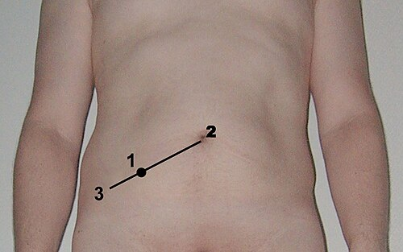

# APENDICITE AGUDA: DIAGNÓSTICO, ESCORE DE ALVARADO, TRATAMENTO

A apendicite aguda é a causa mais comum de abdome agudo cirúrgico no mundo. Se você vai prestar prova de residência no Brasil, este tema não é apenas "importante", ele é obrigatório. As bancas adoram a apendicite porque ela permite cobrar anatomia, fisiopatologia, semiologia e conduta cirúrgica em uma única questão.

Para entender a apendicite, você precisa parar de decorar listas e começar a entender o processo evolutivo da doença. É isso que diferencia o aluno que "acha" que sabe do médico que acerta a questão difícil.

## Anatomia e Fisiopatologia: O "Porquê" dos Sintomas

O apêndice cecal é um órgão linfoide vestigial localizado na base do ceco, onde as três tênias colônicas se encontram. Guarde essa informação: a convergência das tênias é o seu principal marco anatômico para localizar o apêndice durante uma cirurgia difícil.

A irrigação arterial é feita pela **artéria apendicular**, que é um ramo terminal da **artéria ileocólica** (esta, por sua vez, deriva da artéria mesentérica superior). Por ser uma artéria terminal, qualquer aumento de pressão na parede do apêndice compromete rapidamente o fluxo sanguíneo, levando à isquemia e necrose.

### O Mecanismo de Obstrução

A apendicite não começa com uma infecção; ela começa com uma **obstrução da luz**.

- Em adultos, a causa principal é o **fecalito** (ou apendicolito).

- Em crianças e adultos jovens, a causa mais comum é a **hiperplasia linfoide** (frequentemente após uma infecção viral respiratória ou intestinal).

- Causas menos comuns incluem corpos estranhos, parasitas (como *Ascaris*) e neoplasias (carcinoide ou adenocarcinoma).

**O que acontece após a obstrução?**

- O apêndice continua produzindo muco, mas ele não tem para onde sair.

- A pressão intraluminal sobe.

- Essa distensão estimula fibras nervosas viscerais aferentes (T8-T10). É por isso que a dor inicial é **periumbilical ou epigástrica** e mal definida. É uma dor visceral.

- O aumento da pressão obstrui o retorno venoso, gerando edema e translocação bacteriana.

- Quando a inflamação atinge a serosa do apêndice e o peritônio parietal adjacente, a dor "migra" para a **fossa ilíaca direita (FID)**. Agora a dor é somática, bem localizada e intensa.

**Dica de Prova:** A anorexia é o sintoma mais consistente e precoce. Se o paciente chega com fome e comendo um sanduíche, desconfie fortemente do diagnóstico de apendicite.

## Quadro Clínico e Semiologia

O diagnóstico da apendicite é, primariamente, **clínico**. Em um homem jovem com história clássica, você não precisa de tomografia para indicar a cirurgia.

### A Sequência de Murphy

A apresentação clássica segue uma ordem cronológica:

- Anorexia (sempre o primeiro).

- Dor periumbilical vaga.

- Náuseas e/ou vômitos (geralmente após o início da dor).

- Migração da dor para a FID (Ponto de McBurney).

- Febre baixa (se for alta desde o início, pense em perfuração ou outro diagnóstico).

### Sinais Semiológicos (O que cai na prova)

*Figura 1 - Localização do Ponto de McBurney na superfície abdominal, referência clássica para dor na apendicite aguda. Fonte: Steven Fruitsmaak, CC BY-SA 3.0 | Wikimedia Commons*

As bancas amam nomes próprios. Vamos revisar os principais:

- **Sinal de Blumberg:** Dor à descompressão brusca no ponto de McBurney. Indica irritação peritoneal.

- **Sinal de Rovsing:** Dor na FID ao realizar a palpação ou compressão retrógrada do cólon descendente/sigmoide (quadrante inferior esquerdo). O deslocamento de gases distende o ceco e irrita o apêndice inflamado.

- **Sinal do Psoas:** Dor à extensão da coxa direita com o paciente em decúbito lateral esquerdo. Indica **apêndice retrocecal** (o apêndice inflamado está em contato com o músculo psoas).

- **Sinal do Obturador:** Dor à rotação interna da coxa direita flexionada. Indica apendicite pélvica.

- **Sinal de Lapinski:** Dor à compressão da FID enquanto o paciente eleva o membro inferior direito estendido.

- **Sinal de Dunphy:** Dor na FID que piora com a tosse.

**Cuidado:** Muitos alunos confundem Blumberg com a doença. Blumberg é apenas um sinal de peritonite. Se a dor for no quadrante superior direito à descompressão, o sinal de Blumberg é positivo ali, sugerindo colecistite, por exemplo.

## Escore de Alvarado

O Escore de Alvarado foi criado para estratificar o risco e ajudar na decisão clínica. Como o Dr. Will sempre enfatiza nas discussões do MedEvo, o Alvarado serve para nos dizer quem podemos mandar para casa, quem precisa de imagem e quem vai direto para o bloco.

| Critério | Pontuação |
| --- | --- |
| **Sintomas** | |
| Dor que migra para a FID | 1 |
| Anorexia | 1 |
| Náuseas e/ou Vômitos | 1 |
| **Sinais** | |
| Defesa/Dor à palpação na FID | 2 |
| Descompressão dolorosa (Blumberg) | 1 |
| Temperatura > 37,3°C | 1 |
| **Laboratório** | |
| Leucocitose (> 10.000/mm³) | 2 |
| Desvio à esquerda (Neutrofilia) | 1 |
| **Total** | **10** |

**Interpretação e Conduta:**

- **0-3 pontos:** Baixa probabilidade. Investigar outras causas e considerar alta com orientação.

- **4-6 pontos:** Probabilidade intermediária. **Indicação de Exame de Imagem** (TC ou USG).

- **7-10 pontos:** Alta probabilidade. **Indicação Cirúrgica** (em homens jovens, pode-se dispensar a imagem).

**Pegadinha de Prova:** A Proteína C Reativa (PCR) **NÃO** faz parte do Escore de Alvarado original, embora seja muito utilizada na prática clínica moderna para aumentar a sensibilidade diagnóstica.

## Diagnóstico por Imagem

Quando a clínica é duvidosa (Alvarado 4-6), precisamos de exames complementares.

- **Tomografia Computadorizada (TC) de Abdome:** É o padrão-ouro (Gold Standard) no adulto. Possui sensibilidade e especificidade acima de 95%.

- *Achados:* Apêndice com diâmetro > 6mm, borramento da gordura periapendicular, presença de apendicolito, realce parietal (sinal do alvo) e presença de líquido livre.

- **Ultrassonografia (USG):** Primeira escolha em **crianças e gestantes** para evitar radiação.

- *Achados:* Apêndice não compressível, diâmetro > 6mm, apendicolito (sombra acústica).

- *Limitação:* É examinador-dependente e dificultada pela obesidade ou gases intestinais.

- **Ressonância Magnética (RM):** Excelente opção para gestantes quando a USG é inconclusiva.

- **Radiografia de Abdome:** Valor muito limitado. Pode mostrar um apendicolito calcificado (5-10% dos casos) ou sinais indiretos como escoliose antálgica e apagamento da sombra do psoas, mas não confirma o diagnóstico.

## Diagnóstico Diferencial

A apendicite é a "grande simuladora". O diagnóstico diferencial varia conforme a idade e o sexo:

| Grupo | Principais Diferenciais |
| --- | --- |
| **Crianças** | Linfadenite mesentérica (comum após IVAS), Intussuscepção, Divertículo de Meckel. |
| **Mulheres Jovens** | DIP (Doença Inflamatória Pélvica), Gravidez Ectópica, Cisto de Ovário Roto, Endometriose. |
| **Idosos** | Diverticulite (lado direito é raro, mas existe), Neoplasia de Ceco, Isquemia Mesentérica. |
| **Qualquer idade** | Ureterolitíase (cólica renal), Apendagite epiploica, Doença de Crohn. |

**Dica Clínica:** A **Apendagite Epiploica** é uma inflamação dos apêndices gordurosos do cólon. O quadro clínico é idêntico à apendicite, mas o paciente geralmente não tem febre nem leucocitose. O tratamento é **conservador** (AINEs). Se você operar, vai encontrar um apêndice normal.

## Tratamento da Apendicite Aguda

*Figura 2 - Peça de apendicectomia mostrando apêndice aumentado e inflamado com mucosa hiperêmica em caso de apendicite aguda. Fonte: Ed Uthman, CC BY 2.0 | Wikimedia Commons*

O tratamento padrão é a **Apendicectomia**.

### 1. Preparo Pré-operatório

- Jejum.

- Hidratação venosa para corrigir distúrbios hidroeletrolíticos.

- **Antibioticoterapia Profilática:** Deve cobrir Gram-negativos e anaeróbios. O esquema clássico é Cefazolina + Metronidazol (ou Cefoxitina).

- *Atenção:* Na apendicite não complicada, o antibiótico é apenas **profilático** (dose única no pré-operatório). Se houver perfuração ou pus (complicada), torna-se **terapêutico** (mantido por 4 a 7 dias).

### 2. Via de Acesso

- **Laparoscópica:** É a preferencial hoje em dia. Vantagens: menor dor pós-operatória, retorno mais rápido às atividades, menor taxa de infecção de ferida operatória e permite explorar toda a cavidade (fundamental em mulheres com dúvida diagnóstica).

- **Aberta (Laparotomia):** Incisões de **McBurney** (oblíqua) ou **Davis-Rockey** (transversa). É a escolha em locais sem suporte de vídeo ou em pacientes instáveis.

### 3. O Apêndice "Branco" (Normal)

Se você indicou a cirurgia e, ao abrir, o apêndice parece normal, o que fazer?
A recomendação atual é: procure outra causa (Meckel, Crohn, DIP). Se não encontrar nada, a maioria dos cirurgiões opta por realizar a apendicectomia incidental para evitar confusões diagnósticas futuras, embora isso seja debatido.

### 4. Tratamento Não Operatório (Conservador)

Em casos selecionados de apendicite **não complicada** (sem apendicolito, sem sinais de perfuração), o tratamento apenas com antibióticos pode ser considerado. No entanto, o risco de recorrência em um ano é de cerca de 25-30%. Para provas de residência, a cirurgia ainda é a resposta correta na maioria dos cenários.

## Complicações e Manejo do Abscesso

Nem toda apendicite vai direto para o bisturi. Se o paciente chega com mais de 5-7 dias de evolução e apresenta uma massa palpável na FID, ele provavelmente tem um **Plastron** ou um **Abscesso Periapendicular**.

**Conduta no Abscesso Bloqueado:**

- Estabilização clínica e Antibioticoterapia venosa.

- **Drenagem Percutânea** guiada por TC ou USG (se o abscesso for > 4cm e acessível).

- **Apendicectomia de Intervalo:** Realizada após 6 a 8 semanas.

- *Por que não operar na hora?* Porque a inflamação intensa e as aderências tornam a cirurgia extremamente perigosa, com alto risco de lesão de alças intestinais e necessidade de hemicolectomia direita não planejada.

**Complicações Pós-operatórias:**

- **Infecção de Sítio Cirúrgico (Abscesso de Parede):** É a complicação mais comum no pós-op imediato.

- **Abscesso Intracavitário:** Suspeitar se o paciente mantiver febre ou íleo paralítico após o 5º dia de pós-operatório. Requer nova imagem e, geralmente, drenagem.

- **Pileflebite:** Trombose séptica da veia porta. É uma complicação rara e gravíssima, manifestando-se com icterícia, febre alta e calafrios.

- **Obstrução Intestinal por Aderências:** É a complicação **tardia** mais comum.

## Situações Especiais

### 1. Gestantes

A apendicite é a emergência cirúrgica não obstétrica mais comum na gestação.

- **Deslocamento Anatômico:** Com o crescimento do útero, o apêndice é empurrado para cima. No terceiro trimestre, a dor pode ser no quadrante superior direito (flanco).

- **Diagnóstico:** USG é o primeiro exame. RM é o segundo.

- **Tratamento:** Cirúrgico. A apendicectomia laparoscópica é segura em qualquer trimestre, mas deve-se ter cuidado com a pressão do pneumoperitônio. A apendicectomia (principalmente) aberta durante a gravidez frequentemente é seguida por trabalho de parto prematuro pela manipulação e mediadores inflamatórios, mas raramente leva a nascimento prematuro (parto pré-termo), se usados tocolíticos e anestésicos.

### 2. Idosos

Apresentação frequentemente atípica. O idoso pode não ter febre, a dor pode ser vaga e o leucograma pode estar normal. Isso leva ao atraso diagnóstico e a uma taxa de perfuração muito maior (até 50-70%). Em idosos com dor abdominal, o limiar para solicitar TC deve ser baixo.

### 3. Tumores de Apêndice

Às vezes, o patologista nos surpreende com um tumor no apêndice retirado.

- **Tumor Carcinoide:** Se < 1cm e na ponta, a apendicectomia é suficiente. Se > 2cm ou se houver invasão da base ou do mesoapêndice, está indicada a **Hemicolectomia Direita**.

- **Adenocarcinoma:** Sempre requer Hemicolectomia Direita, independentemente do tamanho.

## Pontos-Chave para Prova 🎯

- **Etiologia:** Obstrução luminal (fecalito em adultos, hiperplasia linfoide em jovens).

- **Fisiopatologia da Dor:** Visceral (periumbilical) -> Somática (FID/McBurney).

- **Sintoma mais precoce:** Anorexia.

- **Sinal de Rovsing:** Dor na FID ao comprimir a FIE.

- **Sinal do Psoas:** Indica apêndice retrocecal.

- **Escore de Alvarado:** ≥ 7 indica cirurgia; 4-6 indica imagem. PCR não faz parte do escore original.

- **Exame de Escolha:** TC de abdome com contraste (Adultos); USG (Crianças/Gestantes).

- **Achado na TC:** Apêndice > 6mm e borramento da gordura.

- **Antibiótico na Apendicite Não Complicada:** Apenas profilaxia pré-operatória (dose única).

- **Apendicite Complicada (Abscesso > 4cm):** Tratamento conservador inicial (ATB + Drenagem) + Apendicectomia de intervalo (6-8 semanas).

- **Complicação Pós-op mais comum:** Infecção da ferida operatória (abscesso de parede).

- **Complicação Tardia mais comum:** Obstrução intestinal por bridas/aderências.

- **Gestante:** A dor "sobe" conforme a idade gestacional. USG é o exame inicial.

- **Tumor Carcinoide > 2cm:** Indicação de Hemicolectomia Direita.

- **O que NÃO fazer:** Não use RX de abdome para confirmar apendicite. Não dê alta para um Alvarado 5 sem realizar um exame de imagem ou observação clínica rigorosa.

Este guia cobre a vasta maioria das questões de residência médica sobre apendicite. Lembre-se: na dúvida, siga a evolução clínica. A apendicite é uma doença dinâmica!

 Cópia offline para consulta pessoal.
 Fonte original:
 [https://www.medevo.com.br/material-apoio/ler/4e89d263-9952-4ab5-9414-9d36d45a3ed3](https://www.medevo.com.br/material-apoio/ler/4e89d263-9952-4ab5-9414-9d36d45a3ed3)
