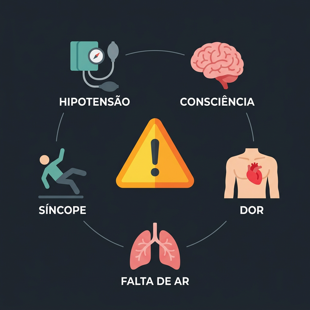
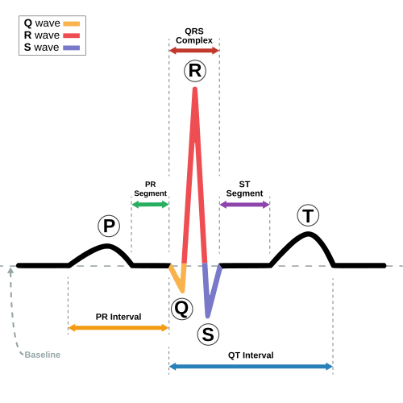
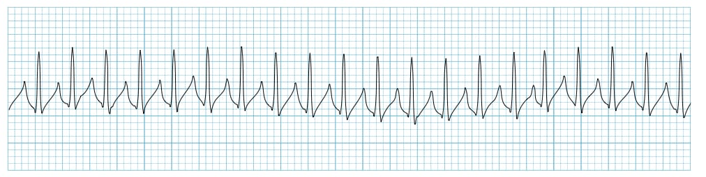
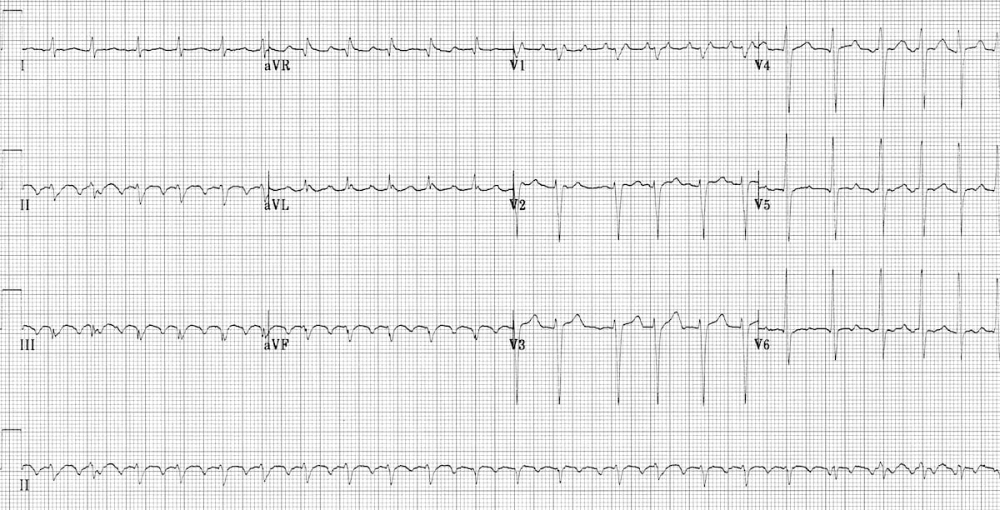
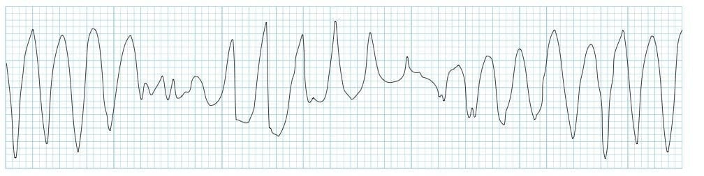

# ARRITMIAS

Para entender arritmias, você não precisa decorar mil traçados de ECG. Você precisa entender a **lógica da condução elétrica** e, acima de tudo, a **repercussão hemodinâmica**. No dia da prova e no plantão, a primeira pergunta nunca deve ser “qual é o nome dessa arritmia?”, mas sim:

> **Esse paciente está instável?**

A partir disso, o raciocínio fica muito mais simples. As arritmias podem ser divididas em dois grandes grupos:

- **Bradiarritmias**: frequência cardíaca baixa ou falha de condução.

- **Taquiarritmias**: frequência cardíaca alta, com QRS estreito ou largo.

Mas antes de classificar o traçado, é obrigatório avaliar se a arritmia está causando instabilidade.

### Critérios de Instabilidade Hemodinâmica

*Mnemônico visual dos 5 sinais clássicos de instabilidade hemodinâmica nas arritmias.*

Este é o “mantra” da cardiologia de emergência. Se o paciente apresenta qualquer um dos sinais abaixo decorrentes da arritmia, a conduta deve ser imediata.

Os cinco principais sinais são:

- **Hipotensão ou choque**: pressão sistólica baixa ou sinais de má perfusão.

- **Alteração aguda do nível de consciência**: sonolência, confusão, torpor ou agitação por baixo débito cerebral.

- **Dor torácica isquêmica**: a frequência muito alta ou muito baixa compromete a perfusão coronariana.

- **Insuficiência cardíaca aguda ou edema agudo de pulmão**: o coração não consegue manter débito adequado.

- **Síncope**: perda súbita de consciência por hipofluxo cerebral.

Os algoritmos de suporte avançado de vida da AHA usam exatamente essa lógica: na bradicardia, procurar hipotensão, alteração mental, choque, desconforto isquêmico ou insuficiência cardíaca aguda; na taquicardia com pulso, se houver instabilidade, a conduta é cardioversão elétrica sincronizada quando aplicável. ([cpr.heart.org](https://cpr.heart.org/-/media/CPR-Files/CPR-Guidelines-Files/2025-Algorithms/Algorithm-ACLS-Bradycardia-250514.pdf?sc_lang=en))

**Atenção prática:**
Paciente com FA, frequência ventricular alta e PA 80/40 mmHg não é questão de escore de anticoagulação naquele momento. Se a instabilidade é causada pela arritmia, a conduta é **cardioversão elétrica sincronizada imediata**.

## Como Ler uma Arritmia no ECG

Antes de decorar nomes, use primeiro um algoritmo curto. Ele evita que você confunda diagnóstico eletrocardiográfico com conduta de emergência.

### Algoritmo de 30 segundos

| Pergunta | Se a resposta for “sim” | Conduta mental imediata |
| --- | --- | --- |
| **1. Tem pulso?** | Não | PCR: desfibrilar FV/TV sem pulso; RCP + adrenalina em assistolia/AESP. |
| **2. Está instável por causa da arritmia?** | Sim | Taquicardia com pulso: cardioversão sincronizada; bradicardia: atropina/marcapasso/droga vasoativa. |
| **3. É bradi ou taqui?** | Bradi < 50 sintomática; taqui geralmente > 100, com maior preocupação se ≥ 150 | Define qual algoritmo seguir. |
| **4. QRS estreito ou largo?** | Largo ≥ 120 ms | Pense primeiro em TV até prova em contrário, principalmente se cardiopatia estrutural. |
| **5. Regular ou irregular?** | Irregular | FA, flutter variável, taquicardia atrial multifocal ou FA com WPW se QRS largo e muito irregular. |
| **6. Tem onda P organizada?** | Não ou dissociada | Ajuda a separar FA, bloqueios AV, ritmo juncional e TV. |

Depois desse filtro rápido, a leitura detalhada fica mais segura.

Antes de decorar nomes, siga esta sequência:

### 1. Tem pulso?

Se não tem pulso, não é mais “tratamento de arritmia com pulso”: é protocolo de parada cardiorrespiratória.

- **FV ou TV sem pulso**: desfibrilação.

- **Assistolia ou AESP**: RCP + adrenalina + procurar causas reversíveis.

### 2. O paciente está estável ou instável?

Se estiver instável, a conduta costuma ser elétrica:

- Taquiarritmia instável com pulso: **cardioversão elétrica sincronizada**.

- Bradiarritmia instável: **atropina, marcapasso transcutâneo e/ou drogas vasoativas**, conforme o cenário.

### 3. A frequência é baixa ou alta?

- **Bradicardia**: geralmente FC < 50 bpm quando associada a sintomas.

- **Taquicardia**: FC > 100 bpm, mas no ACLS a taquiarritmia clinicamente relevante costuma ter FC ≥ 150 bpm, salvo exceções.

### 4. O QRS é estreito ou largo?

- **QRS estreito**: < 120 ms. Sugere origem supraventricular.

- **QRS largo**: ≥ 120 ms. Sugere origem ventricular ou condução aberrante.

### 5. O ritmo é regular ou irregular?

Essa pergunta separa boa parte das taquiarritmias.

| QRS | Ritmo regular | Ritmo irregular |
| --- | --- | --- |
| Estreito | TSVP, flutter 2:1, taquicardia atrial | FA, flutter com condução variável, taquicardia atrial multifocal |
| Largo | TV monomórfica, TSV com aberrância | FA com aberrância, FA + WPW, TV polimórfica |

### 6. Existe onda P?

Pergunte:

- Existe onda P antes de todo QRS?

- Toda onda P gera QRS?

- O intervalo PR é fixo?

- A onda P tem morfologia sinusal?

- Há mais ondas P do que QRS?

Essa etapa ajuda muito nas bradiarritmias e nos bloqueios atrioventriculares.

## Ritmo Sinusal Normal

O ritmo sinusal normal vem do nó sinoatrial.

Características no ECG:

- Onda P positiva em DII, DIII e aVF.

- Onda P negativa em aVR.

- Cada onda P é seguida de um QRS.

- Intervalo PR constante.

- Frequência entre 60 e 100 bpm.

- QRS estreito, se não houver bloqueio de ramo.

Alterações possíveis do ritmo sinusal:

| Alteração | Definição | Comentário |
| --- | --- | --- |
| Bradicardia sinusal | Ritmo sinusal com FC < 60 bpm | Pode ser normal em atletas, sono ou hipertonia vagal |
| Taquicardia sinusal | Ritmo sinusal com FC > 100 bpm | Geralmente resposta a febre, dor, hipovolemia, ansiedade, anemia, sepse |
| Arritmia sinusal respiratória | Variação da FC com a respiração | Comum em jovens; geralmente benigna |
| Pausa sinusal | Falha temporária do nó sinusal | Pode causar tontura ou síncope se prolongada |
| Bloqueio sinoatrial | Estímulo nasce, mas não sai adequadamente do nó sinusal | Pode simular pausa no ECG |
| Doença do nó sinusal | Disfunção do nó sinusal | Mais comum em idosos; pode alternar bradicardia e taquiarritmia |

**Atenção prática:**
Taquicardia sinusal quase sempre é consequência de alguma causa. Não trate apenas o número da frequência. Procure febre, dor, hipovolemia, hipóxia, anemia, sepse, TEP, hipertireoidismo, abstinência ou uso de estimulantes.

## Bradiarritmias

Consideramos bradicardia uma frequência cardíaca baixa, mas o que importa é se ela causa sintomas. Um atleta dormindo com FC 45 bpm pode estar normal. Um idoso com FC 45 bpm, síncope e hipotensão está em risco.

### Fisiologia do Nó Sinoatrial e da Condução

O nó sinusal é o “marcapasso natural” do coração.

O estímulo segue esta ordem:

- Nó sinusal.

- Átrios.

- Nó atrioventricular.

- Feixe de His.

- Ramos direito e esquerdo.

- Fibras de Purkinje.

- Ventrículos.

Se o nó sinusal falha, temos alterações como bradicardia sinusal, pausa sinusal ou doença do nó sinusal.
Se o estímulo nasce no átrio, mas não chega adequadamente ao ventrículo, temos os bloqueios atrioventriculares.

### Principais Causas de Bradicardia

Antes de colocar marcapasso em todo mundo, lembre das causas reversíveis.

| Grupo | Exemplos |
| --- | --- |
| Fisiológicas | Sono, atleta, hipertonia vagal |
| Medicamentos | Betabloqueadores, verapamil, diltiazem, digoxina, amiodarona, clonidina |
| Isquemia | IAM inferior, isquemia do nó AV |
| Metabólicas | Hipercalemia, hipotireoidismo, hipotermia |
| Neurológicas | Hipertensão intracraniana, reflexo vagal |
| Degenerativas | Fibrose do sistema de condução em idosos |
| Infecciosas/inflamatórias | Doença de Chagas, miocardite, doença de Lyme em alguns contextos |

## Bloqueios Atrioventriculares — BAV

*Traçado real evidenciando onda P e complexo QRS em ritmos independentes, caracterizando dissociação atrioventricular, a marca do BAVT.*

Os bloqueios atrioventriculares acontecem quando o estímulo atrial atrasa ou falha ao passar para os ventrículos.

### BAV de 1º Grau

No BAV de 1º grau, todo estímulo passa, mas passa devagar.

Características:

- Intervalo PR > 200 ms.

- PR fixo.

- Toda onda P conduz para QRS.

- Geralmente assintomático.

**Como pensar:**
“Passa tudo, mas passa atrasado.”

Costuma ser benigno, mas pode aparecer com uso de betabloqueador, bloqueador de canal de cálcio, digoxina, aumento do tônus vagal ou doença do sistema de condução.

### BAV de 2º Grau Mobitz I — Wenckebach

No Mobitz I, o nó AV vai cansando progressivamente até falhar.

Características:

- PR vai aumentando progressivamente.

- Depois, uma onda P não conduz.

- Após a pausa, o ciclo recomeça.

- Geralmente é suprahisiano, no nó AV.

- Pode ser benigno, especialmente em jovens, atletas ou durante o sono.

**Como pensar:**
“Vai demorando, demorando, demorando… até bloquear.”

Frase clássica:

> PR alonga progressivamente até uma P bloqueada.

### BAV de 2º Grau Mobitz II

No Mobitz II, o problema é mais grave.

Características:

- PR constante.

- De repente, uma onda P não conduz.

- Não há alongamento progressivo do PR.

- Geralmente é infrahisiano, no sistema His-Purkinje.

- Tem maior risco de evoluir para BAV total.

**Como pensar:**
“Estava conduzindo normal e, do nada, falhou.”

Esse bloqueio é perigoso e costuma indicar doença estrutural do sistema de condução. Frequentemente exige marcapasso, especialmente se sintomático ou associado a QRS largo.

### BAV de Alto Grau

É quando várias ondas P consecutivas não conduzem para os ventrículos.

Exemplo:

- Condução 3:1.

- Condução 4:1.

- Duas ou mais ondas P bloqueadas em sequência.

É uma situação de alto risco, principalmente se houver sintomas ou QRS largo.

### BAV de 3º Grau — BAV Total

No BAV total, átrios e ventrículos batem de forma independente.

Características:

- Dissociação atrioventricular.

- Ondas P sem relação fixa com QRS.

- Frequência atrial maior que a ventricular.

- Ritmo de escape ventricular ou juncional.

- Pode causar síncope, choque, insuficiência cardíaca ou morte súbita.

**Como pensar:**
“O átrio toca uma música e o ventrículo toca outra.”

Exemplo clássico:

> Idoso, diabético, chega com síncope e FC de 32 bpm. ECG mostra ondas P a 80 bpm e QRS a 30 bpm, sem relação entre eles. Diagnóstico: BAV total. Conduta: marcapasso.

### Tabela — Como Diferenciar os BAVs

| Tipo de BAV | O que acontece? | PR | Risco |
| --- | --- | --- | --- |
| 1º grau | Todas as P conduzem | PR longo e fixo | Baixo |
| 2º grau Mobitz I | PR aumenta até bloquear | PR progressivamente maior | Geralmente baixo |
| 2º grau Mobitz II | P bloqueia subitamente | PR fixo | Alto |
| Alto grau | Várias P não conduzem | Variável | Alto |
| 3º grau/BAVT | Nenhuma relação P-QRS | Dissociação AV | Muito alto |

## Doença do Nó Sinusal

A doença do nó sinusal é comum em idosos e em pacientes com doença estrutural cardíaca.

Pode se manifestar como:

- Bradicardia sinusal inapropriada.

- Pausas sinusais.

- Bloqueio sinoatrial.

- Síndrome bradi-taqui.

### Síndrome Bradi-Taqui

É uma forma importante da doença do nó sinusal.

O paciente alterna:

- Episódios de bradicardia ou pausas.

- Episódios de taquiarritmia atrial, principalmente fibrilação atrial.

Pista de prova:

> Idoso com palpitações, tonturas, pausas no Holter e episódios de FA paroxística.

O tratamento pode envolver marcapasso para proteger contra bradicardia, permitindo tratar melhor as taquiarritmias.

## Manejo da Bradicardia Sintomática

Se o paciente tem bradicardia, primeiro avalie se há instabilidade.

### Paciente estável

Conduta:

- Monitorização.

- ECG de 12 derivações.

- Investigar causas reversíveis.

- Suspender drogas bradicardizantes, se possível.

- Corrigir distúrbios eletrolíticos.

- Avaliar isquemia.

- Considerar Holter se sintomas intermitentes.

### Paciente instável

A sequência do ACLS é:

- **Atropina 1 mg IV em bolus**.

- Repetir a cada 3 a 5 minutos, se necessário.

- Dose máxima total: 3 mg.

- Se não houver resposta: marcapasso transcutâneo e/ou dopamina ou adrenalina.

- Considerar marcapasso transvenoso e avaliação especializada.

As doses recomendadas pela AHA são atropina 1 mg IV, repetível a cada 3 a 5 minutos até 3 mg; dopamina 5 a 20 mcg/kg/min; e adrenalina 2 a 10 mcg/min. ([cpr.heart.org](https://cpr.heart.org/-/media/CPR-Files/CPR-Guidelines-Files/2025-Algorithms/Algorithm-ACLS-Bradycardia-250514.pdf?sc_lang=en))

### Quando a atropina pode falhar?

A atropina age principalmente bloqueando o tônus vagal no nó AV. Por isso, pode funcionar mal quando o bloqueio é abaixo do nó AV.

Situações em que você deve pensar cedo em marcapasso:

- BAV Mobitz II.

- BAV total.

- BAV de alto grau.

- QRS largo com bradicardia importante.

- Paciente transplantado cardíaco.

- Instabilidade grave.

**Pérola clínica:**
No BAV total com choque cardiogênico, não perca tempo insistindo em atropina. Prepare marcapasso transcutâneo e suporte avançado.

## Taquiarritmias: O Raciocínio Clínico

Taquicardia é FC > 100 bpm. Mas, na emergência, muitas taquicardias só causam instabilidade quando a frequência está muito alta, geralmente acima de 150 bpm. Ainda assim, pacientes com cardiopatia estrutural podem descompensar com frequências menores.

O primeiro divisor é o QRS.

### QRS Estreito

QRS < 120 ms.

Sugere que o estímulo está usando normalmente o sistema His-Purkinje. Portanto, a origem costuma ser supraventricular.

Exemplos:

- Taquicardia sinusal.

- TSVP.

- Fibrilação atrial.

- Flutter atrial.

- Taquicardia atrial.

- Taquicardia atrial multifocal.

### QRS Largo

QRS ≥ 120 ms.

Pode ser:

- Taquicardia ventricular.

- Taquicardia supraventricular com aberrância.

- Taquicardia com bloqueio de ramo prévio.

- Taquicardia em paciente com via acessória.

- Distúrbio metabólico, como hipercalemia.

**Regra de segurança:**
Taquicardia de QRS largo deve ser tratada como **taquicardia ventricular** até prova em contrário.

## Taquicardias de QRS Estreito

### 1. Taquicardia Sinusal

A taquicardia sinusal é uma resposta fisiológica ou secundária a algum estresse.

Características:

- FC > 100 bpm.

- Onda P sinusal antes de todo QRS.

- Ritmo regular.

- Início e término geralmente graduais.

Causas comuns:

- Febre.

- Dor.

- Ansiedade.

- Hipovolemia.

- Anemia.

- Hipóxia.

- Sepse.

- TEP.

- Hipertireoidismo.

- Abstinência.

- Uso de beta-agonistas, cafeína, cocaína ou anfetaminas.

**Conduta:**
Trate a causa. Não adianta apenas “baixar a frequência” sem corrigir o motivo da taquicardia.

### 2. Taquicardia Supraventricular Paroxística — TSVP

*TSVP típica: traçado sem onda P visível, com FC extremamente elevada e QRS estreito.*

A TSVP geralmente ocorre por mecanismo de reentrada, especialmente reentrada nodal.

Características:

- Início súbito.

- Término súbito.

- Ritmo regular.

- QRS estreito.

- FC geralmente entre 150 e 250 bpm.

- Onda P ausente, retrógrada ou escondida no QRS.

Sintomas:

- Palpitações.

- Ansiedade.

- Tontura.

- Dispneia.

- Dor torácica.

- Poliuria após reversão, em alguns casos.

### Tratamento da TSVP Estável

-

**Manobras vagais**

- Valsalva modificada é uma das melhores opções.

- Em lactentes/crianças pequenas, pode-se usar gelo na face com cuidado técnico.

-

**Adenosina**

- 6 mg IV em bolus rápido + flush.

- Se não reverter, 12 mg IV.

A AHA recomenda manobras vagais e adenosina em taquicardias regulares de QRS estreito; a dose de adenosina é 6 mg IV rápido seguida de flush, com segunda dose de 12 mg se necessário. ([cpr.heart.org](https://cpr.heart.org/-/media/CPR-Files/CPR-Guidelines-Files/2025-Algorithms/Algorithm-ACLS-Tachycardia-250514.pdf?sc_lang=en))

### O que a adenosina faz?

Ela bloqueia transitoriamente o nó AV. Isso pode interromper arritmias dependentes do nó AV, como a TSVP por reentrada nodal.

Efeitos esperados:

- Rubor.

- Falta de ar.

- Dor ou aperto no peito.

- Sensação de morte iminente.

- Pausa breve no ECG.

Avise o paciente antes.

### Cuidados com Adenosina

Evitar ou usar com muita cautela em:

- Asma grave ou broncoespasmo ativo.

- Transplantado cardíaco.

- Uso de dipiridamol.

- Taquicardia irregular de QRS largo.

- Suspeita de FA com WPW.

### 3. Fibrilação Atrial — FA

*Marca registrada da Fibrilação Atrial: ritmo absolutamente irregular e ausência de ondas P bem definidas.*

A fibrilação atrial é a arritmia sustentada mais comum na prática clínica.

Características no ECG:

- Ritmo irregularmente irregular.

- Ausência de onda P organizada.

- Ondas fibrilatórias na linha de base.

- QRS geralmente estreito, salvo aberrância ou bloqueio de ramo.

- Frequência ventricular variável.

No exame físico:

- Pulso irregular.

- Variação da intensidade da primeira bulha.

- Déficit de pulso, em alguns casos.

### Causas e Fatores Associados

- Idade avançada.

- Hipertensão.

- Insuficiência cardíaca.

- Valvopatia mitral.

- Doença coronariana.

- Hipertireoidismo.

- Obesidade.

- Apneia do sono.

- Álcool.

- Pós-operatório.

- Infecção, sepse ou doença aguda.

## Manejo da Fibrilação Atrial

O manejo da FA tem quatro pilares:

- Avaliar instabilidade.

- Controlar frequência.

- Considerar controle de ritmo.

- Prevenir tromboembolismo.

As diretrizes mais recentes passaram a priorizar o **CHA₂DS₂-VA** como ferramenta prática de risco tromboembólico, retirando o sexo feminino como ponto isolado. Em muitas provas brasileiras e em parte das referências americanas, o **CHA₂DS₂-VASc** ainda aparece, então vale conhecer os dois modelos. Os DOACs seguem preferidos sobre a varfarina na maioria dos pacientes elegíveis, e a varfarina permanece para cenários como estenose mitral moderada/grave ou válvula mecânica. ([American College of Cardiology](https://www.acc.org/latest-in-cardiology/ten-points-to-remember/2023/11/27/19/46/2023-acc-guideline-for-af-gl-af))

### FA Instável

Se a FA causa:

- Hipotensão.

- Choque.

- Dor torácica isquêmica.

- Edema agudo de pulmão.

- Rebaixamento do nível de consciência.

- Síncope.

A conduta é:

**Cardioversão elétrica sincronizada imediata.**

Não espere anticoagulação se o paciente está instável.

### FA Estável: Controle de Frequência

O objetivo é reduzir a resposta ventricular.

Opções comuns:

- Betabloqueadores: metoprolol, esmolol.

- Bloqueadores de canal de cálcio não diidropiridínicos: diltiazem, verapamil.

- Digoxina, especialmente em pacientes selecionados com insuficiência cardíaca ou hipotensão, mas tem início mais lento.

- Amiodarona em casos selecionados, especialmente quando outras opções são inadequadas.

**Erro comum:**
Anlodipina não controla frequência. Ela é diidropiridínica e atua principalmente na vasculatura. Para controlar FC, os bloqueadores de canal de cálcio usados são **verapamil** e **diltiazem**.

### Cuidado na Insuficiência Cardíaca

Em paciente com fração de ejeção reduzida ou descompensação importante, verapamil e diltiazem podem piorar o quadro por efeito inotrópico negativo. Nesses casos, costuma-se preferir betabloqueador com cautela, digoxina ou amiodarona, conforme o cenário.

### FA Estável: Controle de Ritmo

Controle de ritmo significa tentar restaurar o ritmo sinusal.

Pode ser feito por:

- Cardioversão elétrica.

- Cardioversão farmacológica.

- Ablação em casos selecionados.

Antes de cardioverter, pense no tempo de FA e no risco tromboembólico.

### FA com menos de 24 horas

Nas diretrizes mais atuais, o ponto de menor preocupação tromboembólica para cardioversão precoce foi encurtado para **24 horas**. Em pacientes com início claramente conhecido há menos de 24 horas e risco tromboembólico baixo, pode-se considerar cardioversão precoce, sempre individualizando a anticoagulação peri e pós-procedimento.

### FA com 24 horas ou mais, ou tempo desconhecido

A partir de **24 horas** já há maior preocupação com trombo atrial, e a conduta fica mais cautelosa.

Opções:

- Anticoagular por pelo menos 3 semanas antes da cardioversão e manter por pelo menos 4 semanas depois.

- Ou fazer ecocardiograma transesofágico para excluir trombo e cardioverter com anticoagulação adequada.

**Resumo prático:** o antigo corte de 48 horas perdeu espaço nas diretrizes europeias mais recentes; para prova atualizada, pense em **24 horas** como o novo limiar de maior cautela.

## Anticoagulação na FA

A anticoagulação reduz o risco de AVC cardioembólico.

### CHA₂DS₂-VA

As diretrizes europeias de 2024 passaram a priorizar o **CHA₂DS₂-VA**, retirando o sexo feminino como ponto isolado. A ideia é que o sexo feminino funcione mais como **modificador de risco** do que como critério independente para anticoagular sozinho.

| Critério | Pontos |
| --- | --- |
| Insuficiência cardíaca | 1 |
| Hipertensão | 1 |
| Idade ≥ 75 anos | 2 |
| Diabetes mellitus | 1 |
| AVC/AIT/tromboembolismo prévio | 2 |
| Doença vascular: IAM, DAOP, placa aórtica | 1 |
| Idade 65-74 anos | 1 |

### Interpretação prática atual

| Pontuação CHA₂DS₂-VA | Conduta geral |
| --- | --- |
| 0 | Não anticoagular rotineiramente |
| 1 | Considerar anticoagulação conforme contexto |
| ≥ 2 | Anticoagulação indicada |

### CHA₂DS₂-VASc

O **CHA₂DS₂-VASc** continua aparecendo em muitas provas brasileiras, em materiais antigos e em parte das referências americanas. Nele, o sexo feminino ainda soma 1 ponto:

| Critério | Pontos |
| --- | --- |
| Insuficiência cardíaca | 1 |
| Hipertensão | 1 |
| Idade ≥ 75 anos | 2 |
| Diabetes mellitus | 1 |
| AVC/AIT/tromboembolismo prévio | 2 |
| Doença vascular: IAM, DAOP, placa aórtica | 1 |
| Idade 65-74 anos | 1 |
| Sexo feminino | 1 |

### Interpretação clássica do CHA₂DS₂-VASc

| Pontuação | Conduta geral |
| --- | --- |
| Homem 0 ou mulher 1 | Não anticoagular rotineiramente |
| Homem 1 ou mulher 2 | Considerar anticoagulação individualizada |
| Homem ≥ 2 ou mulher ≥ 3 | Anticoagulação indicada, salvo contraindicação |

**Como usar para prova:** se a questão estiver ancorada em diretriz europeia atualizada, pense primeiro em **CHA₂DS₂-VA**. Se a banca citar escore clássico, diretriz mais antiga ou referência americana, ainda pode cobrar o **CHA₂DS₂-VASc**.

### DOAC ou Varfarina?

Preferir DOACs na maioria dos pacientes com FA não valvar:

- Apixabana.

- Rivaroxabana.

- Dabigatrana.

- Edoxabana.

Usar varfarina em:

- Válvula mecânica.

- Estenose mitral moderada a grave, especialmente reumática.

- Algumas situações específicas, como contraindicação ou indisponibilidade de DOAC.

**Importante:**
Aspirina não substitui anticoagulação para prevenção de AVC na FA quando há indicação de anticoagulante.

### 4. Flutter Atrial

*Flutter atrial: note o padrão clássico em zigue-zague contínuo, em “dente de serra”, na linha de base.*

O flutter atrial é uma taquiarritmia atrial organizada, geralmente por circuito de reentrada no átrio direito.

Características:

- Ondas F em “dente de serra”.

- Melhor vistas em DII, DIII e aVF.

- Frequência atrial em torno de 250-350 bpm.

- Condução AV comum de 2:1, gerando FC ventricular perto de 150 bpm.

- Ritmo pode ser regular ou variável.

### Ponto de atenção

Flutter 2:1 pode parecer taquicardia regular de QRS estreito a 150 bpm. Sempre suspeite de flutter quando a frequência estiver muito fixa em torno de 150.

### Tratamento

Semelhante à FA:

- Se instável: cardioversão elétrica sincronizada.

- Se estável: controle de frequência, anticoagulação conforme risco e estratégia de ritmo.

- Cardioversão elétrica costuma funcionar muito bem.

- Ablação do istmo cavotricuspídeo é tratamento definitivo em muitos casos.

### 5. Taquicardia Atrial Focal

É uma taquicardia originada em foco atrial fora do nó sinusal.

Características:

- Onda P visível, mas com morfologia diferente da P sinusal.

- Ritmo geralmente regular.

- Pode ter aquecimento e desaceleração gradual.

- Frequência atrial geralmente 100-250 bpm.

Associações:

- Doença pulmonar.

- Hipóxia.

- Distúrbios eletrolíticos.

- Intoxicação digitálica.

- Pós-operatório.

- Cardiopatia estrutural.

Tratamento:

- Corrigir causa.

- Betabloqueador ou bloqueador de canal de cálcio, se apropriado.

- Ablação em casos recorrentes ou refratários.

### 6. Taquicardia Atrial Multifocal

Caracteriza-se por múltiplos focos atriais.

Critérios no ECG:

- FC > 100 bpm.

- Pelo menos 3 morfologias diferentes de onda P.

- Intervalos PR variáveis.

- Ritmo irregular.

Associação clássica:

**DPOC ou doença pulmonar grave.**

Tratamento:

- Corrigir hipóxia.

- Tratar exacerbação pulmonar.

- Corrigir hipocalemia e hipomagnesemia.

- Evitar antiarrítmico desnecessário.

- Betabloqueador ou verapamil/diltiazem em casos selecionados, com cautela.

## Taquicardias de QRS Largo

Taquicardia de QRS largo é uma das áreas mais importantes em prova e plantão.

**Regra de ouro:**
Se é taquicardia regular de QRS largo, trate como **taquicardia ventricular** até prova em contrário.

Errar uma TSV com aberrância como TV costuma ser menos perigoso do que errar uma TV como TSV e dar medicação inadequada.

### 1. Taquicardia Ventricular Monomórfica Sustentada

Características:

- QRS largo.

- Ritmo regular.

- Frequência geralmente 120-250 bpm.

- Complexos QRS com morfologia semelhante entre si.

- Pode haver dissociação AV.

- Pode haver captura ou fusão, achados que favorecem TV.

### Definição de TV Sustentada

- Duração > 30 segundos; ou

- Qualquer duração se causar instabilidade hemodinâmica.

### Causas

- Doença coronariana.

- Cicatriz pós-IAM.

- Cardiomiopatias.

- Miocardite.

- Chagas.

- Distúrbios eletrolíticos.

- Drogas pró-arrítmicas.

### Tratamento

#### TV com pulso e instável

**Cardioversão elétrica sincronizada.**

#### TV com pulso e estável

Opções:

- Amiodarona.

- Procainamida, quando disponível e adequada.

- Sotalol em alguns contextos.

- Avaliação especializada.

A AHA recomenda, na taquicardia estável de QRS largo, considerar adenosina apenas se o ritmo for regular e monomórfico, além de antiarrítmico e consulta especializada; para amiodarona, a dose inicial é 150 mg em 10 minutos, seguida de infusão. ([cpr.heart.org](https://cpr.heart.org/-/media/CPR-Files/CPR-Guidelines-Files/2025-Algorithms/Algorithm-ACLS-Tachycardia-250514.pdf?sc_lang=en))

#### TV sem pulso

Não é cardioversão sincronizada. É:

**Desfibrilação + RCP + protocolo de parada.**

### 2. Taquicardia Ventricular Não Sustentada

Definição:

- Três ou mais batimentos ventriculares consecutivos.

- Duração menor que 30 segundos.

- Sem instabilidade sustentada.

Importância:

- Pode ser achado incidental.

- Em cardiopatas, aumenta preocupação com risco arrítmico.

- Em pacientes com disfunção ventricular, pode indicar maior risco de morte súbita.

Conduta depende do contexto:

- Investigar cardiopatia estrutural.

- Corrigir eletrólitos.

- Rever medicamentos.

- Avaliar isquemia.

- Considerar Holter, ecocardiograma e avaliação cardiológica.

### 3. Extrassístoles Ventriculares

São batimentos ventriculares prematuros.

Características:

- QRS largo e prematuro.

- Sem onda P sinusal antes do QRS ectópico.

- Pausa compensatória após o batimento.

- Podem ser isoladas, pareadas ou em salvas.

Podem ocorrer em pessoas saudáveis, mas merecem atenção quando:

- São muito frequentes.

- São polimórficas.

- Acontecem em salvas.

- Ocorrem em paciente com cardiopatia.

- Vêm associadas a síncope, dor torácica ou disfunção ventricular.

Causas comuns:

- Cafeína.

- Estresse.

- Álcool.

- Hipocalemia.

- Hipomagnesemia.

- Isquemia.

- Cardiomiopatias.

### 4. Torsades de Pointes — TV Polimórfica com QT Longo

*Torsades de Pointes: torção dos complexos QRS em torno da linha de base, geralmente associada a intervalo QT prolongado.*

Torsades de Pointes é uma taquicardia ventricular polimórfica associada a prolongamento do intervalo QT.

Características:

- QRS largo.

- Polimórfica.

- Eixo parece “torcer” ao redor da linha de base.

- Pode degenerar para fibrilação ventricular.

### Causas de QT Longo

#### Distúrbios eletrolíticos

- Hipocalemia.

- Hipomagnesemia.

- Hipocalcemia.

#### Medicamentos

- Macrolídeos.

- Quinolonas.

- Antipsicóticos.

- Antidepressivos tricíclicos.

- Metadona.

- Antieméticos como ondansetrona.

- Alguns antiarrítmicos, inclusive amiodarona e sotalol.

#### Outras causas

- QT longo congênito.

- Bradicardia importante.

- Isquemia.

- Hipotermia.

### Tratamento

- Sulfato de magnésio 2 g IV.

- Corrigir potássio e magnésio.

- Suspender drogas que prolongam QT.

- Se instável ou sem pulso: choque conforme protocolo.

- Se recorrente com bradicardia: considerar aumento da FC com marcapasso ou isoproterenol em situações selecionadas.

### 5. Fibrilação Ventricular

É ritmo de parada cardiorrespiratória.

Características:

- Atividade elétrica caótica.

- Sem QRS organizado.

- Sem pulso.

- Sem débito cardíaco efetivo.

Conduta:

- RCP imediata.

- Desfibrilação.

- Adrenalina.

- Amiodarona ou lidocaína se refratária.

- Procurar causas reversíveis.

## Cardioversão vs. Desfibrilação

### Cardioversão Elétrica Sincronizada

Usada em taquiarritmias com pulso e instabilidade.

Exemplos:

- FA instável.

- Flutter instável.

- TSVP instável.

- TV monomórfica com pulso e instável.

É sincronizada com o QRS para evitar choque durante a onda T, o que poderia induzir fibrilação ventricular.

### Desfibrilação

Usada quando não há pulso em ritmos chocáveis:

- Fibrilação ventricular.

- Taquicardia ventricular sem pulso.

Não é sincronizada.

| Procedimento | Quando usar? | Sincronização |
| --- | --- | --- |
| Cardioversão | Taquiarritmia com pulso e instabilidade | Sim |
| Desfibrilação | FV ou TV sem pulso | Não |

## Alterações de Condução Intraventricular

Além das arritmias, as provas cobram muito bloqueios de ramo e fasciculares.

### Bloqueio de Ramo Direito — BRD

Características gerais:

- QRS ≥ 120 ms no bloqueio completo.

- Padrão rSR’ em V1.

- Onda S larga em DI e V6.

Associações:

- Pode ser benigno.

- Doença de Chagas.

- TEP.

- Cardiopatias congênitas.

- Doença degenerativa do sistema de condução.

### Bloqueio de Ramo Esquerdo — BRE

Características gerais:

- QRS ≥ 120 ms.

- QRS alargado e entalhado em DI, aVL, V5 e V6.

- Ausência de q em derivações laterais.

- Alterações secundárias de ST-T.

Importância:

- Pode indicar cardiopatia estrutural.

- Dificulta diagnóstico de IAM pelo ECG.

- Em paciente com insuficiência cardíaca e QRS largo, pode ter implicação para terapia de ressincronização.

### Hemibloqueio Anterior Esquerdo — HBAE

Características:

- Desvio do eixo para a esquerda.

- qR em DI/aVL.

- rS em DII, DIII e aVF.

- QRS não tão largo quanto bloqueio de ramo completo.

### Hemibloqueio Posterior Esquerdo — HBPE

Características:

- Desvio do eixo para a direita.

- Deve excluir outras causas de eixo direito, como hipertrofia de VD, DPOC e TEP.

### Chagas

Na doença de Chagas, o padrão clássico cobrado é:

**Bloqueio de ramo direito + hemibloqueio anterior esquerdo.**

## Pré-excitação e WPW

### Síndrome de Wolff-Parkinson-White — WPW

É causada por uma via acessória, geralmente o feixe de Kent, que permite condução elétrica fora do nó AV.

Características no ECG em ritmo sinusal:

- PR curto < 120 ms.

- Onda delta.

- QRS alargado.

- Alteração secundária de ST-T.

### Por que é perigosa?

O nó AV normalmente funciona como um “freio” entre átrios e ventrículos. Na WPW, a via acessória pode permitir condução muito rápida para os ventrículos.

O maior perigo é:

**FA com WPW**

Nesse caso, o ritmo costuma ser:

- Irregular.

- Muito rápido.

- QRS largo e variável.

- Risco de degenerar para fibrilação ventricular.

### O que NÃO fazer na FA com WPW

Evite bloqueadores do nó AV:

- Adenosina.

- Verapamil.

- Diltiazem.

- Betabloqueadores.

- Digoxina.

Essas drogas podem favorecer condução pela via acessória.

### Tratamento

- Se instável: cardioversão elétrica sincronizada.

- Se estável: antiarrítmico adequado conforme protocolo e avaliação especializada.

- Tratamento definitivo: ablação da via acessória.

## Intoxicação Digitálica

A digoxina pode causar várias arritmias porque aumenta o tônus vagal e altera a automaticidade cardíaca.

### Fatores de Risco

- Idade avançada.

- Doença renal.

- Hipocalemia.

- Hipomagnesemia.

- Hipercalcemia.

- Interações medicamentosas.

- Desidratação.

### Manifestações

- Náuseas.

- Vômitos.

- Confusão.

- Alterações visuais.

- Bradicardia.

- Bloqueios AV.

- Extrassístoles.

- Taquiarritmias atriais.

### ECG

Achado clássico, mas não necessariamente intoxicação:

- Infra de ST em “colher” ou “bigode de Salvador Dalí”.

Arritmia sugestiva:

- Taquicardia atrial com bloqueio AV variável.

### Tratamento

- Suspender digoxina.

- Corrigir potássio e magnésio.

- Monitorização.

- Anticorpo anti-digoxina em intoxicações graves, arritmias ameaçadoras, hiperpotassemia importante ou instabilidade.

## Doença de Chagas e Arritmias

A doença de Chagas é muito relevante nas provas brasileiras.

Pode causar:

- Bloqueio de ramo direito.

- Hemibloqueio anterior esquerdo.

- Bloqueios AV.

- Extrassístoles ventriculares.

- Taquicardia ventricular.

- Disfunção ventricular.

- Aneurisma apical.

- Morte súbita.

ECG clássico:

**BRD + HBAE**

Em paciente chagásico, cuidado com drogas que reduzem muito a frequência, pois pode haver doença avançada do sistema de condução.

## Alterações do Intervalo QT

O QT representa o tempo de despolarização e repolarização ventricular.

### QT Longo

Aumenta risco de Torsades de Pointes.

Causas:

- Hipocalemia.

- Hipomagnesemia.

- Hipocalcemia.

- Antiarrítmicos.

- Antipsicóticos.

- Macrolídeos.

- Quinolonas.

- Antidepressivos tricíclicos.

- Metadona.

- QT longo congênito.

Conduta:

- Suspender drogas causadoras.

- Corrigir eletrólitos.

- Magnésio se Torsades.

- Monitorização.

### QT Curto

Menos cobrado, mas pode ocorrer com:

- Hipercalcemia.

- Algumas síndromes congênitas raras.

- Efeito digitálico.

## Distúrbios Eletrolíticos e ECG

### Hipercalemia

Alterações progressivas:

- Onda T apiculada.

- Encurtamento do QT.

- Prolongamento do PR.

- Achatamento ou desaparecimento da onda P.

- Alargamento do QRS.

- Padrão em “sine wave”.

- FV ou assistolia.

Tratamento se alteração de ECG ou hipercalemia grave:

- Gluconato de cálcio.

- Insulina com glicose.

- Beta-agonista.

- Bicarbonato em situações específicas.

- Remoção de potássio: diurético, resina em alguns casos, diálise.

### Hipocalemia

Pode causar:

- Onda U.

- Achatamento de T.

- Depressão de ST.

- Extrassístoles.

- Taquiarritmias ventriculares.

- Aumento do risco de toxicidade digitálica.

### Hipocalcemia

- Prolonga QT.

### Hipercalcemia

- Encurta QT.

## Drogas Antiarrítmicas Mais Cobradas

| Droga | Classe | Usos comuns | Efeitos/alertas |
| --- | --- | --- | --- |
| Adenosina | Bloqueio transitório do nó AV | TSVP regular | Rubor, broncoespasmo, pausa, sensação de morte |
| Betabloqueadores | Classe II | FA, flutter, taquicardia sinusal sintomática, algumas TSV | Broncoespasmo, bradicardia, hipotensão |
| Verapamil/Diltiazem | Classe IV | Controle de FC em FA/flutter, algumas TSV | Evitar em IC com FE reduzida/descompensada |
| Amiodarona | Classe III | FA, TV, FV refratária | Tireoide, pulmão, fígado, pele, córnea, QT |
| Lidocaína | Classe Ib | Arritmias ventriculares, especialmente isquêmicas | Toxicidade neurológica |
| Procainamida | Classe Ia | TV estável, algumas arritmias com pré-excitação | Hipotensão, prolonga QT |
| Digoxina | Inotrópico/cronotrópico negativo | Controle de FC em FA selecionada | Intoxicação, arritmias, cuidado na DRC |

## Situações Especiais

### FA + WPW

Pense quando houver:

- Ritmo irregular.

- QRS largo.

- Frequência muito alta.

- Morfologia do QRS variável.

Conduta:

- Se instável: cardioversão elétrica sincronizada.

- Evitar bloqueadores do nó AV.

- Avaliação especializada.

### Taquicardia de QRS Largo Regular

Até prova em contrário:

**É TV.**

Não trate como TSVP de forma automática.

### Taquicardia de QRS Largo Irregular

Principais hipóteses:

- FA com aberrância.

- FA com WPW.

- TV polimórfica.

Adenosina não deve ser usada em taquicardia irregular de QRS largo.

## Síncope e Arritmias

Nem toda síncope é arritmia, mas toda síncope potencialmente cardíaca deve ser levada a sério.

### Síncope Vasovagal

Pistas:

- Jovem.

- Gatilho emocional.

- Dor.

- Calor.

- Ambiente fechado.

- Pródomos: náusea, sudorese, escurecimento visual.

### Síncope Ortostática

Pistas:

- Ocorre ao levantar.

- Idosos.

- Diuréticos.

- Desidratação.

- Neuropatia autonômica.

- Queda da PA ortostática.

### Síncope Cardíaca

Pistas de alto risco:

- Súbita, sem pródromos.

- Durante esforço.

- Em decúbito.

- Associada a palpitações.

- História de cardiopatia.

- História familiar de morte súbita.

- ECG alterado.

- Sopro cardíaco importante.

**Atenção prática:**
Síncope em cardiopata não é “só desmaio”. É alto risco até prova em contrário.

## Tabelas de Revisão Rápida

### Tabela 1 — Taquicardia por QRS e Regularidade

| Tipo | Regular | Irregular |
| --- | --- | --- |
| QRS estreito | TSVP, flutter 2:1, taquicardia atrial | FA, flutter variável, taquicardia atrial multifocal |
| QRS largo | TV monomórfica, TSV com aberrância | FA com aberrância, FA com WPW, Torsades/TV polimórfica |

### Tabela 2 — Principais Arritmias e Condutas

| Arritmia | ECG típico | Conduta se estável | Conduta se instável |
| --- | --- | --- | --- |
| TSVP | Regular, QRS estreito, P invisível | Vagal, adenosina | Cardioversão sincronizada |
| FA | Irregularmente irregular, sem P | Controle FC/ritmo + anticoagulação conforme risco | Cardioversão sincronizada |
| Flutter | Dente de serra | Controle FC/ritmo + anticoagulação conforme risco | Cardioversão sincronizada |
| TV monomórfica | Regular, QRS largo | Antiarrítmico | Cardioversão sincronizada |
| TV sem pulso/FV | Sem pulso | Não se aplica | Desfibrilação + RCP |
| Torsades | TV polimórfica + QT longo | Magnésio e corrigir causas | Choque se instável/sem pulso |
| BAVT | Dissociação AV | Marcapasso se indicado | Marcapasso urgente |

### Tabela 3 — BAVs

| BAV | Frase para memorizar | Gravidade |
| --- | --- | --- |
| 1º grau | PR longo, tudo conduz | Baixa |
| Mobitz I | PR aumenta até bloquear | Geralmente baixa |
| Mobitz II | PR fixo e bloqueia do nada | Alta |
| Alto grau | Muitas P não conduzem | Alta |
| BAVT | P e QRS independentes | Muito alta |

## Pontos-Chave para Prova 🎯

- A primeira pergunta em qualquer arritmia é: **estável ou instável?**

- Instabilidade por taquiarritmia com pulso geralmente indica **cardioversão elétrica sincronizada**.

- TV sem pulso e FV indicam **desfibrilação**, não cardioversão.

- Bradicardia sintomática: atropina 1 mg IV; se falhar, marcapasso transcutâneo e/ou dopamina/adrenalina.

- Atropina pode falhar em BAV Mobitz II, BAV alto grau e BAV total.

- BAV de 1º grau: PR > 200 ms e toda P conduz.

- Mobitz I: PR aumenta progressivamente até bloquear.

- Mobitz II: PR fixo, mas algumas ondas P não conduzem.

- BAV total: dissociação AV.

- TSVP estável: manobra vagal, depois adenosina.

- Adenosina deve ser evitada em taquicardia irregular de QRS largo e em suspeita de FA com WPW.

- FA: ritmo irregularmente irregular, sem ondas P.

- Flutter: ondas em dente de serra, muitas vezes com FC perto de 150 bpm se condução 2:1.

- Anlodipina não controla frequência cardíaca.

- Verapamil e diltiazem controlam frequência, mas devem ser evitados em IC com fração de ejeção reduzida/descompensada.

- Anticoagulação na FA depende de risco tromboembólico, geralmente pelo CHA₂DS₂-VASc.

- DOACs são preferidos na maioria dos pacientes com FA, exceto válvula mecânica e estenose mitral moderada/grave.

- Taquicardia regular de QRS largo deve ser considerada TV até prova em contrário.

- Torsades de Pointes está associada a QT longo e trata-se com sulfato de magnésio.

- Hipercalemia pode alargar QRS e evoluir para padrão em sine wave.

- Doença de Chagas: BRD + HBAE é combinação clássica.

- Síncope súbita, sem pródromos, em cardiopata ou durante esforço é sinal de alto risco.

## Resumo Final

Para acertar arritmias, siga sempre este roteiro:

- **Tem pulso?**

- **Está instável?**

- **É bradicardia ou taquicardia?**

- **O QRS é estreito ou largo?**

- **O ritmo é regular ou irregular?**

- **Tem onda P?**

- **Existe causa reversível?**

Com esse raciocínio, você não depende de decorar todos os traçados. Você entende o mecanismo, reconhece o risco e escolhe a conduta correta.

 Cópia offline para consulta pessoal.
 Fonte original:
 [https://www.medevo.com.br/material-apoio/ler/9aff2492-6fae-4a94-a781-bf7c40b236f2](https://www.medevo.com.br/material-apoio/ler/9aff2492-6fae-4a94-a781-bf7c40b236f2)
