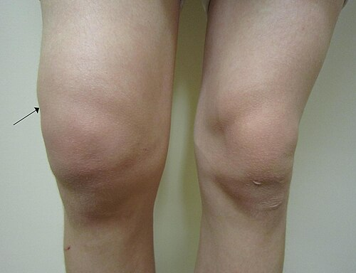
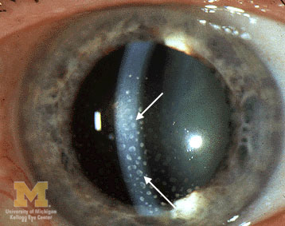

# ARTRITE IDIOPÁTICA JUVENIL

Para começar nosso estudo, você precisa entender que a Artrite Idiopática Juvenil (AIJ) não é uma doença única. O termo AIJ funciona como um "guarda-chuva" que abriga diferentes formas de artrite crônica que acometem crianças e adolescentes.

A definição clássica, que você deve levar para a prova, é: presença de artrite em uma ou mais articulações, com duração mínima de 6 semanas, em um paciente com menos de 16 anos de idade, após a exclusão de todas as outras causas possíveis.

Por que 6 semanas? Porque a maioria das artrites virais ou reacionais se resolve em menos de um mês. Se a inflamação persiste além de um mês e meio, o reumatologista pediátrico liga o sinal de alerta para a cronicidade. E por que "idiopática"? Porque, apesar dos avanços, ainda não conhecemos a causa exata, embora saibamos que existe uma base autoimune e inflamatória robusta.

## Classificação e Subtipos: O Coração da Prova

A classificação da ILAR (International League of Associations for Rheumatology) é a que as bancas utilizam. Ela divide a AIJ em sete categorias principais. Entender cada uma delas é o que separa o aluno que decora do aluno que entende a clínica.

### AIJ Sistêmica (Antiga Doença de Still)

Esta é a forma que mais cai em provas de pediatria geral e infectologia, porque ela se apresenta como uma Febre de Origem Indeterminada.

O quadro clínico clássico envolve febre alta (geralmente acima de 39 graus), de caráter intermitente ou "cotidiano", que ocorre uma ou duas vezes ao dia, preferencialmente no final da tarde ou noite, e retorna ao normal (ou subnormal) no restante do dia. Junto com a febre, surge o exantema evanescente: manchas rosadas (cor de salmão), que não coçam, e que aparecem e desaparecem junto com os picos febris.

Por que isso é importante? Porque se você vir uma criança com febre há 2 semanas, rash que some rápido e artrite, a banca está gritando "AIJ Sistêmica". Além disso, é comum encontrar hepatoesplenomegalia, linfonodomegalia e serosite (pericardite ou pleurite).

**Dica de Prova:** Na AIJ sistêmica, os exames laboratoriais mostram uma inflamação absurda. VHS e PCR lá no alto, leucocitose importante (muitas vezes acima de 20.000 ou 30.000), trombocitose e anemia de doença crônica. O FAN e o Fator Reumatoide costumam ser negativos aqui.

### AIJ Oligoarticular

*Figura 1 - Derrame articular no joelho direito (seta), achado típico na AIJ oligoarticular que acomete grandes articulações. Fonte: James Heilman, MD, CC BY-SA 3.0 | Wikimedia Commons*

É o subtipo mais comum, representando cerca de 50% dos casos. Ela acomete 4 ou menos articulações nos primeiros 6 meses de doença. Geralmente atinge grandes articulações, como joelhos e tornozelos, de forma assimétrica.

Aqui mora o maior perigo e a pegadinha favorita das bancas: a Uveíte Anterior Crônica. Diferente da uveíte da Artrite Reativa, que é aguda e dolorosa (olho vermelho), a uveíte da AIJ oligoarticular é assintomática e "branca". A criança não reclama, o olho não fica vermelho, mas a inflamação está lá destruindo a visão.

**O marcador de risco:** Se o paciente tem AIJ oligoarticular e o FAN (Fator Antinuclear) é positivo, o risco de uveíte é altíssimo. Por isso, esses pacientes precisam de avaliação periódica com lâmpada de fenda pelo oftalmologista, mesmo que não tenham queixas.

### AIJ Poliarticular (Fator Reumatoide Negativo e Positivo)

Aqui temos o acometimento de 5 ou mais articulações nos primeiros 6 meses.

- **FR Negativo:** Costuma acometer meninas mais novas e tem um prognóstico razoável.

- **FR Positivo:** É a forma que mais se assemelha à Artrite Reumatoide do adulto. Acomete adolescentes, é simétrica, pega pequenas articulações das mãos e pés, e é agressiva, com alto potencial erosivo.

### AIJ Relacionada à Entesite

Imagine um menino, com mais de 6 anos, que começa com dor no calcanhar (entesite do tendão de Aquiles ou da fáscia plantar) e artrite em membros inferiores. Ele pode evoluir com dor lombar inflamatória (sacroileíte). Este subtipo está fortemente associado ao HLA-B27. É o equivalente pediátrico das espondiloartropatias do adulto.

### AIJ Psoriásica

O diagnóstico é feito quando a criança tem artrite e psoríase cutânea, ou artrite mais dois dos seguintes: dactilite ("dedo em salsicha"), depressões ungueais (pitting) ou história familiar de psoríase em parente de primeiro grau.

Cuidado: a artrite pode aparecer anos antes das lesões de pele. Se a banca descrever uma criança com artrite e dactilite, pense em psoríase mesmo sem manchas nos cotovelos ainda.

## Diagnóstico Diferencial: Onde os Alunos Erram

Como professor, vejo muitos alunos perderem questões por não saberem diferenciar a AIJ de outras patologias comuns na infância. Vamos organizar isso em uma tabela comparativa para facilitar sua visualização.

| Patologia | Padrão da Artrite | Características Marcantes | Laboratório Típico |
| --- | --- | --- | --- |
| **AIJ** | Crônica (> 6 semanas), aditiva | Rigidez matinal, claudicação | VHS/PCR elevados, FAN pode ser + |
| **Febre Reumática** | Aguda, migratória, grandes articulações | Resposta dramática ao AAS, história de faringite | ASLO elevado, evidência de estrepto |
| **Artrite Séptica** | Monoartrite aguda, sinais flogísticos intensos | Febre alta, recusa de deambular, dor à mobilização passiva | Leucocitose, punção com pus |
| **Leucemia (LLA)** | Dor óssea intensa, pode simular artrite | Palidez, petéquias, dor noturna que acorda a criança | Citopenias (anemia, plaquetopenia) |
| **Sinovite Transitória** | Aguda, quadril | Pós-infecção viral, autolimitada | Exames normais ou pouco alterados |

### O Fantasma da LLA (Leucemia Linfoblástica Aguda)

Este é o diagnóstico diferencial mais crítico. A LLA pode se manifestar com dor articular e febre, mimetizando a AIJ sistêmica.

Como diferenciar? Na LLA, a dor costuma ser óssea (metáfise dos ossos longos) e não apenas articular. A dor da LLA frequentemente acorda a criança à noite e é desproporcional aos sinais físicos de inflamação. No hemograma, a AIJ sistêmica faz leucocitose e trombocitose (muita inflamação), enquanto a LLA costuma fazer citopenias (anemia, neutropenia, plaquetopenia) ou apresentar blastos.

**Regra de ouro do Dr. Will:** Nunca inicie corticoide para uma suspeita de AIJ sem antes ter certeza de que não é leucemia. O corticoide pode "mascarar" a LLA, dificultar o diagnóstico e piorar o prognóstico oncológico.

## Fisiopatologia: Por que a articulação inflama?

Na AIJ, ocorre uma sinovite crônica. O sistema imune, por motivos genéticos e gatilhos ambientais, passa a atacar a membrana sinovial. Isso gera hiperplasia da sinóvia e formação do "pannus" (um tecido inflamatório invasivo).

Esse pannus libera citocinas inflamatórias, como o TNF-alfa, IL-6 e IL-1. Na AIJ sistêmica, a IL-1 e a IL-6 são as grandes vilãs, o que explica por que os pacientes respondem tão bem aos bloqueadores dessas citocinas.

A inflamação crônica perto das placas de crescimento ósseo explica por que essas crianças podem ter assimetria de membros. O aumento do fluxo sanguíneo na região inflamada pode acelerar o crescimento de um membro em relação ao outro (hipermetria) ou, em casos graves, levar ao fechamento precoce da epífise, resultando em encurtamento.

## Quadro Clínico e Exame Físico

O sinal cardinal da AIJ não é a dor aguda, mas sim a rigidez matinal. A criança acorda "travada", demora para começar a andar ou pede colo logo cedo. Conforme ela se movimenta, a articulação "esquenta" e a dor melhora. Isso é o oposto da dor mecânica, que piora com o esforço.

No exame físico, procure por:

- **Edema articular:** Às vezes sutil, melhor visto comparando com o lado contralateral.

- **Limitação da amplitude de movimento:** Perda da extensão completa do joelho ou cotovelo.

- **Calor local:** Mas raramente há rubor (se houver muito rubor, pense em artrite séptica).

- **Atrofia muscular:** Ocorre por desuso da musculatura adjacente à articulação inflamada (ex: atrofia do quadríceps na artrite de joelho).

## Diagnóstico Laboratorial e de Imagem

Não existe um "exame da AIJ". O diagnóstico é clínico e de exclusão.

- **VHS e PCR:** Úteis para monitorar atividade de doença, mas podem estar normais na forma oligoarticular.

- **FAN (Fator Antinuclear):** Não serve para dar o diagnóstico de AIJ, mas sim para estratificar o risco de uveíte.

- **Fator Reumatoide:** Geralmente negativo na criança. Quando positivo, indica um subtipo específico (poliarticular FR+) de pior prognóstico.

- **ASLO:** Frequentemente solicitado de forma errada. O ASLO alto apenas indica contato prévio com o estreptococo, não confirma Febre Reumática. Muitos alunos erram questões achando que ASLO + Artrite = Febre Reumática. Lembre-se: a artrite da Febre Reumática é migratória e dura poucos dias em cada articulação.

- **Radiografia:** No início, mostra apenas aumento de partes moles e osteopenia justa-articular. Sinais de erosão óssea e redução do espaço articular são achados tardios e indicam dano permanente.

- **Ultrassonografia:** Excelente para detectar sinovite subclínica e guiar infiltrações.

## Tratamento: A Escada Terapêutica

O objetivo do tratamento é a remissão completa para permitir que a criança cresça e se desenvolva normalmente. No MedEvo, enfatizamos que o tratamento deve ser agressivo desde o início se houver sinais de mau prognóstico.

### 1. Anti-inflamatórios Não Esteroidais (AINEs)

São a primeira linha para controle de sintomas (dor e rigidez). Naproxeno (10 a 20 mg/kg/dia, dividido em 2 doses) é muito utilizado. Importante: o AINE sozinho raramente leva à remissão da doença crônica; ele serve para "ganhar tempo" enquanto as outras drogas fazem efeito.

### 2. Corticoides

Usados para "ponte" ou em manifestações sistêmicas graves (pericardite, síndrome de ativação macrofágica). Na AIJ oligoarticular, a infiltração intra-articular com hexacetonida de triancinolona é extremamente eficaz e pode ser o único tratamento necessário por muito tempo.

**Cuidado:** Evite corticoide oral prolongado em crianças devido aos efeitos colaterais no crescimento, ossos e metabolismo.

### 3. DMARDs Sintéticos (Drogas Modificadoras do Curso da Doença)

O Metotrexato é o padrão-ouro. Dose: 10 a 15 mg/m² de superfície corporal, uma vez por semana (via oral ou subcutânea). Sempre associar ácido fólico (5 mg/semana) 24 a 48 horas após o metotrexato para reduzir efeitos colaterais como náuseas e estomatite.

### 4. DMARDs Biológicos

Se o paciente não responde ao metotrexato após 3 a 6 meses, partimos para os biológicos.

- **Anti-TNF (Etanercepte, Adalimumabe):** Excelentes para as formas poli e oligoarticulares.

- **Anti-IL-6 (Tocilizumabe) ou Anti-IL-1 (Anakinra):** São as drogas de escolha para a AIJ Sistêmica.

## Complicações Graves

### Síndrome de Ativação Macrofágica (SAM)

É a complicação mais temida da AIJ Sistêmica. É uma forma de linfo-histiocitose hemofagocítica secundária. Ocorre uma "tempestade de citocinas" e os macrófagos começam a fagocitar as próprias células sanguíneas.

**Como suspeitar na prova:** O paciente com AIJ sistêmica, que estava com VHS muito alto e muitas plaquetas, subitamente apresenta queda do VHS, queda das plaquetas, febre persistente, disfunção hepática e aumento absurdo da ferritina (muitas vezes > 10.000 ng/mL). Isso é uma emergência médica!

### Uveíte Anterior Crônica

Como já discutimos, é a principal causa de cegueira evitável na AIJ. Pode levar a catarata, glaucoma e ceratopatia em faixa. O tratamento é feito com colírios de corticoide e midriáticos, mas casos graves exigem imunossupressão sistêmica (Adalimumabe é excelente aqui).

## Prognóstico e Metas

O prognóstico melhorou drasticamente com os biológicos. Antigamente, víamos muitas crianças em cadeiras de rodas; hoje, a meta é "zero articulações inflamadas".

Fatores de pior prognóstico:

- Início em idade muito jovem.

- Fator Reumatoide positivo.

- Acometimento de quadris ou coluna cervical.

- Presença de erosões no diagnóstico.

- Persistência de marcadores inflamatórios altos apesar do tratamento.

## Resumo de Condutas por Subtipo

Para facilitar sua revisão rápida antes da prova, utilize esta estrutura mental:

- **Oligoarticular:** AINE ou Infiltração -> Se falhar: Metotrexato -> Se falhar: Biológico. **Obrigatório:** Rastreio de Uveíte.

- **Poliarticular:** Metotrexato precoce -> Se falhar: Anti-TNF.

- **Sistêmica:** AINE (casos leves) -> Se febre persistir: Anti-IL-1 ou Anti-IL-6. Corticoide se houver risco de vida (serosite grave).

- **Entesite:** AINE -> Se falhar (axial): Anti-TNF direto (Metotrexato não funciona bem para coluna).

## Diagnóstico Diferencial Detalhado: O "Pulo do Gato"

Muitas questões de residência colocam casos clínicos limítrofes. Veja como diferenciar:

- **Artrite Reativa:** Geralmente após infecção gastrointestinal (Shigella, Salmonella) ou urinária. É aguda, assimétrica, em membros inferiores. Pode ter dactilite, mas a história de infecção prévia é a chave.

- **Dermatomiosite Juvenil:** Além da artrite, apresenta fraqueza muscular proximal e simétrica, heliotropo (mancha arroxeada nas pálpebras) e pápulas de Gottron (lesões sobre as articulações dos dedos).

- **Lúpus Eritematoso Sistêmico (LES) Pediátrico:** A artrite do lúpus é muito parecida com a da AIJ poliarticular, mas o lúpus costuma ter outros sinais: malar rash, fotossensibilidade, nefrite (proteinúria/hematúria) e citopenias. O FAN no lúpus é quase sempre positivo em títulos altos.

## Pontos-Chave para Prova

- **Definição:** Artrite em ≥ 1 articulação, por ≥ 6 semanas, em < 16 anos, excluindo outras causas.

- **AIJ Sistêmica:** Febre diária (pico vespertino) + Rash cor de salmão evanescente + Artrite + Hepatoesplenomegalia.

- **Uveíte Anterior:** É a complicação extra-articular mais comum, especialmente na forma oligoarticular com FAN positivo. É assintomática (olho branco).

- **Exame Obrigatório:** Lâmpada de fenda (Slit Lamp) periódica para rastrear uveíte em pacientes com AIJ, especialmente se FAN+.

- **AIJ Oligoarticular:** Até 4 articulações nos primeiros 6 meses. É a forma mais comum.

- **AIJ Poliarticular FR+:** Meninas adolescentes, pequenas articulações, simétrica, agressiva (semelhante à AR do adulto).

- **Diagnóstico Diferencial Crítico:** LLA (Leucemia Linfoblástica Aguda). Suspeitar se houver dor óssea noturna, citopenias ou queda do estado geral importante.

- **Febre Reumática vs AIJ:** A artrite da FR é migratória e responde rápido ao AAS. A da AIJ é aditiva e crônica.

- **Tratamento de Primeira Linha:** AINEs para sintomas; Metotrexato é o DMARD de escolha para a maioria das formas.

- **Biológicos na AIJ Sistêmica:** Bloqueadores de IL-1 (Anakinra) e IL-6 (Tocilizumabe) são os mais eficazes.

- **Síndrome de Ativação Macrofágica:** Queda súbita de VHS e plaquetas + Ferritina astronômica em paciente com AIJ sistêmica.

- **O que NÃO fazer:** Não iniciar corticoide oral sem excluir neoplasia (leucemia). Não usar ASLO isolado para diagnosticar Febre Reumática.

- **Prognóstico:** Acometimento de quadril e coluna cervical são sinais de gravidade e pior prognóstico funcional.

- **FAN na AIJ:** Não serve para diagnóstico, mas sim para indicar risco de uveíte anterior crônica.

- **Rigidez Matinal:** É o sintoma clínico que melhor caracteriza a dor inflamatória da AIJ.

Ao revisar este material, foque na diferenciação clínica entre os subtipos e na importância do rastreio oftalmológico. As bancas adoram o cenário da criança com artrite leve no joelho, FAN positivo e a necessidade de exame de lâmpada de fenda. Se você dominar isso, dominará a AIJ nas provas.

 Cópia offline para consulta pessoal.
 Fonte original:
 [https://www.medevo.com.br/material-apoio/ler/e8a91f8a-0e64-45fe-8588-0f2576436b50](https://www.medevo.com.br/material-apoio/ler/e8a91f8a-0e64-45fe-8588-0f2576436b50)
