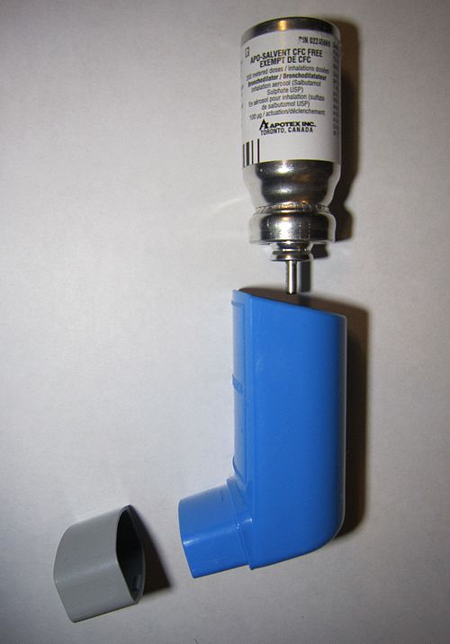

# ASMA

A asma não é apenas uma doença de "chiado no peito". Se você guardar apenas essa imagem, vai errar questões de prova que exploram a variante tosse ou o paciente que chega silencioso na emergência. Para entender a asma, você precisa visualizar uma inflamação crônica das vias aéreas que leva a dois fenômenos fundamentais: a hiperresponsividade brônquica e a limitação variável ao fluxo aéreo.

O que define a asma nas provas de residência é a palavra variabilidade. Os sintomas variam ao longo do tempo e em intensidade, e a obstrução ao fluxo de ar também varia, sendo tipicamente reversível.

## Fisiopatologia: O Porquê da Obstrução

Por que o brônquio do asmático fecha? Não é apenas contração muscular. A patogenia envolve uma orquestra de células, principalmente eosinófilos, mastócitos e linfócitos T (perfil Th2). Quando o paciente entra em contato com um gatilho, como ácaros, pólen ou fumaça, ocorre a degranulação dessas células e a liberação de mediadores como histamina e leucotrienos.

Isso gera um tripé patológico:

- Bronconstrição (espasmo da musculatura lisa).

- Edema de mucosa (inflamação da parede do brônquio).

- Hipersecreção de muco (tampões que obstruem a luz).

Com o tempo, se essa inflamação não for controlada com Corticosteroides Inalatórios (CI), ocorre o remodelamento das vias aéreas. O brônquio sofre fibrose e hipertrofia muscular, e aquela obstrução que era "reversível" torna-se fixa. É por isso que, na MedEvo, sempre enfatizamos: tratar asma é tratar inflamação, não apenas abrir o brônquio com "bombinha de alívio".

## Quadro Clínico e Diagnóstico

O diagnóstico da asma é clínico e funcional. Os sintomas clássicos são dispneia, sibilância, tosse crônica e aperto no peito. Mas atenção às características desses sintomas: eles costumam piorar à noite ou ao despertar, e são desencadeados por exercício, riso, alérgenos ou ar frio.

Cuidado: a rouquidão NÃO é um sintoma típico de asma. Se a questão trouxer rouquidão, pense em diagnóstico diferencial ou efeito colateral do uso incorreto do corticoide inalatório (candidíase oral ou disfonia).

### A Espirometria: O Padrão-Ouro

Para confirmar a asma, precisamos demonstrar a limitação variável do fluxo aéreo. O achado típico é um Distúrbio Ventilatório Obstrutivo (DVO) que reverte após o uso de broncodilatador (BD).

Os critérios de reversibilidade na espirometria para adultos são:

- Aumento do VEF1 > 12% em relação ao valor pré-BD.

- Aumento absoluto do VEF1 > 200 mL.

Se o paciente tem sintomas, mas a espirometria é normal, o que fazer? Não descarte asma. Como a doença é variável, ele pode estar em um momento bom. Nesses casos, solicitamos o Teste de Broncoprovocação (com Metacolina ou Histamina). Um teste negativo praticamente exclui asma (alto valor preditivo negativo), enquanto um teste positivo confirma a hiperresponsividade brônquica.

### Diagnóstico Diferencial

Nem tudo que chia é asma. Em crianças, pense em corpo estranho ou bronquiolite. Em adultos, o principal diferencial é a DPOC.

| Característica | Asma | DPOC |
| --- | --- | --- |
| Início | Geralmente na infância/juventude | Geralmente após os 40 anos |
| Tabagismo | Independente do fumo | Fortemente associado |
| Sintomas | Variáveis, pioram à noite | Progressivos, persistentes |
| Reversibilidade | Frequentemente completa | Parcial ou ausente |
| Inflamação | Predomínio de Eosinófilos | Predomínio de Neutrófilos |

Outro diferencial importante é a Síndrome do Gotejamento Pós-Nasal, que causa tosse crônica e pode mimetizar a asma variante tosse. A diferença é que, no gotejamento, o paciente tem sensação de "limpar a garganta" e a espirometria é normal, sem resposta ao BD.

## Classificação do Controle e Risco (GINA 2026)

As bancas amam cobrar a classificação de controle, pois ela orienta o ajuste terapêutico. O GINA avalia **as últimas 4 semanas** e separa duas ideias: controle de sintomas e risco futuro de exacerbação.

Pergunte ao paciente:

- Sintomas diurnos mais de 2 vezes por semana?

- Algum despertar noturno por asma?

- Necessidade de medicação de alívio por sintomas mais de 2 vezes por semana?

- Alguma limitação de atividade por causa da asma?

Classificação:

- **Controlada:** nenhum “sim”.

- **Parcialmente controlada:** 1 a 2 “sim”.

- **Não controlada:** 3 a 4 “sim”.

**Atenção GINA 2026:** esse item de “alívio > 2 vezes/semana” vale para SABA. Se o paciente usa alívio anti-inflamatório, como CI-formoterol, esse uso já entrega corticoide inalatório junto com o broncodilatador; portanto, interprete a frequência junto com sintomas, risco e dose de manutenção.

Além do controle atual, sempre procure risco futuro: exacerbação grave no último ano, internação/UTI prévia, uso excessivo de SABA, baixa adesão, técnica inalatória ruim, VEF1 baixo, tabagismo, comorbidades, eosinofilia/FeNO elevado quando disponíveis e exposição persistente a gatilhos.

Erro clássico de prova: achar que o uso de medicação antes do exercício conta automaticamente como “asma não controlada”. O uso preventivo para broncoconstrição induzida por exercício é uma exceção; avalie o contexto.

## Tratamento Farmacológico de Manutenção — Modelo de Steps do GINA 2026

A mensagem central do GINA 2026 é a mesma que mudou a prática moderna: **não tratar asma com SABA isolado**. Todo adulto/adolescente com asma deve receber estratégia contendo corticoide inalatório (CI), porque mesmo pacientes com sintomas pouco frequentes podem ter exacerbação grave ou fatal.

O tratamento é organizado em dois “trilhos” (*tracks*):

- **Track 1 — preferencial:** o alívio é feito com **CI-formoterol**. É preferido porque reduz exacerbações graves, exposição a corticoide sistêmico e atendimentos urgentes, além de simplificar o tratamento com um único inalador em muitas etapas.

- **Track 2 — alternativo:** usado quando Track 1 não está disponível ou não é adequado. O alívio é com **CI-SABA** quando disponível ou SABA, mas nunca como SABA “solto” sem corticoide inalatório associado ao plano.

### Track 1 preferencial: CI-formoterol como alívio anti-inflamatório

**Conceitos:**

- **AIR:** *anti-inflammatory reliever* — alívio anti-inflamatório com CI-formoterol usado quando há sintomas.

- **MART/SMART:** manutenção e alívio com o mesmo inalador de CI-formoterol, usado nos Steps em que há dose diária de manutenção.

- Apenas combinações com **formoterol** servem para alívio, porque ele é LABA de início rápido. Salmeterol não serve para resgate.

| Step GINA 2026 | Esquema didático do Track 1 | Quando pensar |
| --- | --- | --- |
| **Steps 1–2** | CI-formoterol em baixa dose **se necessário** | Sintomas pouco frequentes ou asma leve, mas ainda com necessidade de CI no resgate |
| **Step 3** | CI-formoterol baixa dose **diário** + CI-formoterol se necessário | Sintomas mais frequentes, despertar noturno, risco de exacerbação ou falha do Step 1–2 |
| **Step 4** | CI-formoterol dose média diário + CI-formoterol se necessário | Persistência de sintomas/exacerbações após revisar técnica, adesão e gatilhos |
| **Step 5** | Encaminhar/avaliar especialista; considerar LAMA, dose alta selecionada e fenotipagem para biológicos | Asma difícil/grave apesar de tratamento otimizado |

**Como subir step:** antes de aumentar dose, confirme diagnóstico, adesão, técnica inalatória, exposição a gatilhos e comorbidades. Se houver crise grave recente, VEF1 baixo ou sintomas persistentes, suba com mais urgência.

**Como descer step:** se controle sustentado por pelo menos 2–3 meses e baixo risco, reduza gradualmente para menor dose eficaz, sem retirar completamente o CI.

### Track 2 alternativo: quando não dá para usar CI-formoterol

O Track 2 exige mais cuidado, porque o paciente pode usar só o broncodilatador e “esquecer” o anti-inflamatório. Por isso, educação e plano escrito são indispensáveis.

| Step GINA 2026 | Esquema didático do Track 2 | Observação de prova |
| --- | --- | --- |
| **Step 1** | CI-SABA se necessário, ou CI tomado sempre que usar SABA se CI-SABA não disponível | A novidade prática é manter alívio com componente anti-inflamatório; SABA isolado não é plano adequado |
| **Step 2** | CI baixa dose diário + alívio conforme Track 2 | Alternativa clássica para sintomas leves persistentes |
| **Step 3** | CI-LABA baixa dose diário + alívio conforme Track 2 | LABA nunca deve ser usado sem CI na asma |
| **Step 4** | CI-LABA dose média diário + alívio conforme Track 2 | Reavaliar adesão/técnica antes de escalar |
| **Step 5** | Especialista; LAMA, dose alta selecionada, azitromicina em casos específicos e/ou biológicos conforme fenótipo | Não chamar de “grave” antes de corrigir fatores modificáveis |

### Step 5 e asma grave: fenotipar antes de biológico

Asma grave é aquela que permanece não controlada apesar de terapia otimizada em alta intensidade, ou que piora ao tentar reduzir essa terapia. Não confunda com asma “aparentemente grave” por má técnica, baixa adesão, rinossinusite, obesidade, DRGE, tabagismo ou exposição ocupacional.

Biológicos cobrados em prova:

- **Anti-IgE (omalizumabe):** fenótipo alérgico com sensibilização e IgE/faixa compatível.

- **Anti-IL-5/IL-5R (mepolizumabe, benralizumabe, reslizumabe conforme disponibilidade):** asma eosinofílica/exacerbadora.

- **Anti-IL-4Rα (dupilumabe):** asma tipo 2/eosinofílica, inclusive com necessidade de corticoide oral em contextos selecionados.

- **Anti-TSLP (tezepelumabe):** opção para asma grave, inclusive com benefício mais amplo em relação a biomarcadores, conforme indicação local.

### Resumo das medicações

- **SABA** (salbutamol, fenoterol, terbutalina): broncodilatador rápido e curto. Útil em crise, mas uso isolado como estratégia de rotina aumenta risco.

- **Formoterol:** LABA de início rápido; pode compor alívio quando combinado a CI.

- **Salmeterol:** LABA de início lento; não serve para resgate.

- **CI** (budesonida, beclometasona, fluticasona): base anti-inflamatória do tratamento.

- **LAMA** (tiotrópio): add-on em pacientes selecionados, especialmente Steps altos.

- **Antileucotrienos** (montelucaste): úteis em rinite/asma induzida por exercício/AERD em alguns pacientes, mas geralmente inferiores ao CI para controle anti-inflamatório.

Dr. Will costuma lembrar: “O corticoide inalatório é o seguro de vida do asmático. O broncodilatador é apenas o extintor de incêndio”.

## Manejo da Crise Aguda (Exacerbação)

*Figura 1 - Inalador dosimetrado (MDI) de salbutamol, beta-2 agonista de curta ação usado em crise/exacerbação. Fonte: James Heilman, MD, CC BY-SA 3.0 | Wikimedia Commons*

*Figura 2 - Crise asmática: inflamação, broncoconstrição e aumento de muco reduzem o calibre das vias aéreas. Fonte: NIH/NHLBI, domínio público | Wikimedia Commons*

Quando o paciente chega na emergência com crise, você precisa ser rápido. O objetivo é reverter a obstrução e tratar a inflamação precocemente.

### Avaliação de Gravidade

- Crise Leve/Moderada: Fala frases completas, prefere sentar a deitar, não usa musculatura acessória, FC 100-120 bpm, SpO2 90-95%, Pico de Fluxo (PEF) > 50%.

- Crise Grave: Fala palavras isoladas, agitação, uso de musculatura acessória (tiragem), FC > 120 bpm, SpO2 < 90%, PEF ≤ 50%.

- Insuficiência Respiratória Iminente: Tórax silencioso (ausência de sibilos por falta de fluxo), cianose, bradicardia, exaustão respiratória, confusão mental.

### Conduta na Emergência

- Oxigênio: Alvo de SpO2 entre 93-95% em adultos (94-98% em crianças). Evite hiperóxia.

- SABA: Salbutamol 4-10 jatos a cada 20 minutos na primeira hora. O uso de espaçador é tão eficaz quanto a nebulização e reduz riscos de contaminação.

- Brometo de Ipratrópio (SAMA): Adicionar nas crises moderadas a graves. Reduz taxa de hospitalização.

- Corticoide Sistêmico: Prednisolona oral (40-50mg) ou Hidrocortisona IV. O efeito demora de 4 a 6 horas para começar. A via oral é preferível por ser menos invasiva e ter eficácia igual à IV.

- Sulfato de Magnésio IV: Considerar em crises graves que não respondem ao tratamento inicial.

Cuidado: Antibióticos NÃO são rotina na crise de asma. Só use se houver febre persistente, infiltrado no Raio-X ou sinais claros de pneumonia bacteriana. A maioria das crises é desencadeada por vírus.

## Situações Especiais e Pegadinhas

### Asma Induzida por AAS (Doença Respiratória Exacerbada por Aspirina - DREA)

Ocorre em pacientes que possuem a tríade de Samter: Asma + Polipose Nasal + Intolerância a AAS/AINEs. O mecanismo é o desvio da via da COX-1 para a via dos leucotrienos. Se a prova citar pólipos nasais em um asmático, pense em evitar AAS.

### Asma Ocupacional

Suspeite quando os sintomas melhoram nos finais de semana ou férias. É a doença ocupacional respiratória mais comum. O diagnóstico pode exigir a medida do Pico de Fluxo Expiratório várias vezes ao dia, dentro e fora do trabalho.

### Asma na Gestante

Regra de ouro: o risco de uma asma descontrolada para o feto (hipóxia) é muito maior do que o risco das medicações. O tratamento é igual ao da não gestante. A Budesonida é o CI com mais estudos de segurança, mas se a paciente já usa outro e está controlada, mantenha.

### Asma Fatal: Fatores de Risco

Quem tem mais chance de morrer de asma?

- História de intubação prévia por asma.

- Hospitalização ou visita à emergência no último ano.

- Uso atual ou interrupção recente de corticoide oral.

- Uso excessivo de SABA (> 1 frasco/mês).

- Baixa adesão ao tratamento ou problemas psiquiátricos.

## Tratamento Não Farmacológico

Não adianta dar a melhor bombinha se o paciente dorme com um urso de pelúcia cheio de ácaros.

- Controle ambiental: Retirar tapetes, cortinas e carpetes do quarto. Lavar roupas de cama com água quente (> 55°C).

- Cessação do tabagismo: Fundamental para evitar a resistência ao corticoide.

- Atividade física: Deve ser incentivada. O exercício melhora a capacidade cardiovascular e reduz a percepção de dispneia. Se houver asma induzida por exercício, usa-se o resgate 15 minutos antes da atividade.

- Vacinação: Influenza anual e Pneumocócica (conforme calendário).

## Tabelas de Referência para Memorização

### Tabela 1: Classificação de Gravidade (Retrospectiva)

A gravidade é definida pelo nível de tratamento necessário para manter o controle.

| Gravidade | Tratamento Necessário |
| --- | --- |
| Leve | Controlada com Etapa 1 ou 2 (CI dose baixa) |
| Moderada | Controlada com Etapa 3 ou 4 (CI+LABA) |
| Grave | Requer Etapa 5 ou permanece não controlada apesar de doses altas |

### Tabela 2: Metas de Fluxo e Gasometria na Crise

A gasometria não é necessária em toda crise, apenas nas graves ou que não melhoram.

| Achado | Interpretação |
| --- | --- |
| pH normal / PaCO2 normal | Sinal de alerta! O asmático em crise deve estar em alcalose respiratória (hiperventilando). Se o CO2 normalizou, ele está cansando. |
| PaCO2 > 45 mmHg | Acidose respiratória e falência iminente. Indicação de UTI. |
| PEF < 50% | Crise grave. |
| Pulso Paradoxal | Queda da PAS > 10 mmHg na inspiração. Indica hiperinsuflação grave. |

## Pontos-Chave para Prova

- Diagnóstico: Clínica + Espirometria (VEF1/CVF < 0,75 e aumento do VEF1 > 12% e > 200ml após BD).

- Espirometria normal não exclui asma: Se a suspeita for alta, peça Teste de Broncoprovocação com Metacolina.

- **GINA 2026:** SABA isolado não deve ser usado como estratégia de rotina; todo paciente deve ter tratamento contendo CI. Track 1 com CI-formoterol como alívio anti-inflamatório é a estratégia preferencial quando disponível.

- Tratamento Preferencial (GINA): CI + Formoterol (Track 1) para manutenção e alívio em todas as etapas.

- SABA isolado: Nunca mais. O uso isolado de Beta-2 de curta aumenta o risco de morte.

- Crise de Asma: A primeira conduta é SABA (4-10 puffs) + Corticoide Sistêmico precoce.

- Via de administração: Preferencialmente inalatória para manutenção e resgate. Oral para corticoide na crise.

- Magnésio IV: Reservado para crises graves que não respondem à terapia inicial (SABA + Ipratrópio + Corticoide).

- Tórax Silencioso: É um sinal de gravidade extrema, indicando que o fluxo de ar é insuficiente até para gerar sibilos.

- Gasometria na crise: O achado de PaCO2 normal ou elevada em um paciente taquipneico é sinal de exaustão respiratória.

- Asma Induzida por Exercício: O tratamento é o controle da asma de base. O uso de SABA ou CI+Formoterol 15 min antes do exercício é uma estratégia válida.

- Corticoides: O uso crônico de corticoide sistêmico (oral) é fator de risco para asma fatal e deve ser evitado, preferindo-se o escalonamento da terapia inalatória.

- Fenoterol vs. Formoterol: Fenoterol é SABA (curta). Formoterol é LABA (longa) de início rápido. Guarde essa diferença para não cair em pegadinha de nomenclatura.

- O que NÃO fazer: Não pedir Raio-X de tórax para todo mundo (apenas se suspeita de complicação ou infecção). Não usar sedativos. Não usar antibióticos de rotina.

- Pulso Paradoxal: É a queda da pressão arterial sistólica maior que 10 mmHg durante a inspiração, sinalizando gravidade na crise aguda.

- Adesão: Sempre cheque a técnica inalatória e a adesão antes de aumentar o degrau do tratamento. Muitos pacientes "não controlados" apenas usam a bombinha errado.

Ao revisar asma para as provas, lembre-se que as bancas estão migrando para as atualizações do GINA. O conceito de que "asma intermitente não precisa de corticoide" caiu por terra. Todo asmático, por definição, tem inflamação e, portanto, se beneficia de corticoide inalatório, nem que seja apenas no momento do resgate.

 Cópia offline para consulta pessoal.
 Fonte original:
 [https://www.medevo.com.br/material-apoio/ler/8bbdb1ce-418a-4f6b-b9eb-529d1da1efb0](https://www.medevo.com.br/material-apoio/ler/8bbdb1ce-418a-4f6b-b9eb-529d1da1efb0)
