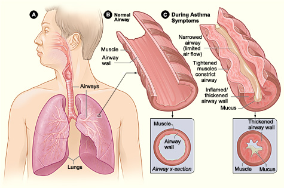
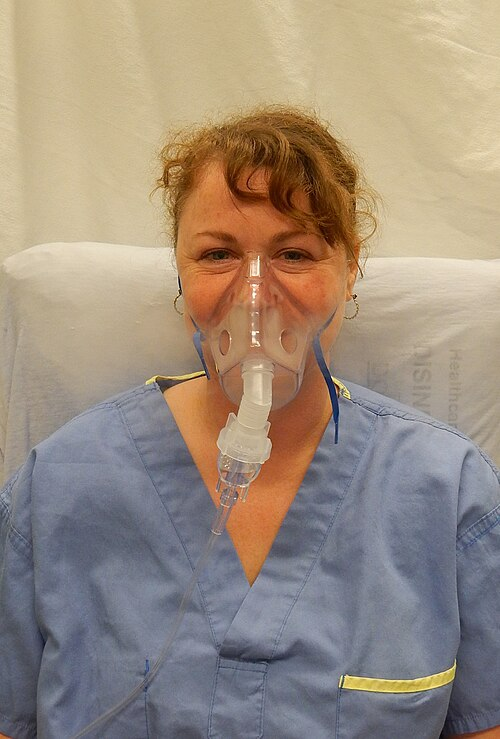

# ASMA NA CRIANÇA

Para entender a asma na pediatria, você precisa tirar da cabeça a ideia de que asma é apenas "chiado no peito". Se você for para a prova achando que todo sibilo é asma, você vai errar questões de corpo estranho, bronquiolite e até insuficiência cardíaca. A asma é, fundamentalmente, uma doença inflamatória crônica. O que define a asma é a hiper-responsividade das vias aéreas e uma limitação variável ao fluxo aéreo.

Por que "variável"? Porque o paciente asmático tem momentos em que está ótimo e momentos em que está em crise. Essa reversibilidade, seja espontânea ou com uso de medicação, é a marca registrada que as bancas de residência cobram incessantemente.

## Fisiopatologia: O Porquê do Chiado

*Figura 1 - Comparação entre via aérea normal (B) e via aérea durante crise de asma (C), com broncoconstrição, edema de mucosa e hipersecreção de muco. Fonte: NIH/NHLBI, Domínio Público | Wikimedia Commons*

A inflamação na asma não é uma inflamação qualquer. É uma orquestra mediada principalmente por linfócitos Th2, que recrutam eosinófilos e estimulam a produção de IgE pelos linfócitos B. Quando o paciente entra em contato com um gatilho (poeira, mofo, fumaça de cigarro, infecção viral), ocorre uma cascata de eventos:

- **Broncoconstrição:** O músculo liso brônquico contrai bruscamente.

- **Edema de Mucosa:** A parede do brônquio incha, diminuindo o lúmen.

- **Hipersecreção de Muco:** O muco fica espesso e forma "rolhas" que obstruem a passagem do ar.

O resultado disso é o aprisionamento aéreo. O ar entra, mas tem dificuldade extrema para sair. É por isso que o tempo expiratório do asmático é prolongado e é por isso que ouvimos o sibilo, que nada mais é do que o som do ar passando por um tubo estreitado.

## Diagnóstico: O Desafio da Idade

Aqui mora a primeira grande pegadinha de prova. Como diagnosticar asma em uma criança de 2 anos que não consegue soprar um espirômetro?

### O Lactente Sibilante e o PAPI

Até os 5 ou 6 anos, o diagnóstico de asma é eminentemente clínico. Não pedimos espirometria para bebês. O problema é que "nem tudo que chia é asma" nessa idade. Muitas crianças sibilam apenas quando ficam gripadas (sibilantes transitórios ou persistentes não atópicos).

Para separar o "joio do trigo", usamos o Índice Preditivo de Asma (PAPI ou API). Ele serve para nos dizer qual criança pequena que sibila tem alta probabilidade de continuar sibilando e se tornar um asmático escolar/adulto.

**Critérios Maiores:**

- Pai ou mãe com asma.

- Diagnóstico médico de dermatite atópica.

- Sensibilização a aeroalérgenos (poeira, ácaro).

**Critérios Menores:**

- Sensibilização a alimentos (leite, ovo, amendoim).

- Sibilância fora de quadros gripais.

- Eosinofilia periférica (igual ou maior que 4%).

Para o PAPI ser positivo, a criança deve ter tido 3 ou mais episódios de sibilância no último ano E apresentar 1 critério maior OU 2 critérios menores. Se o PAPI for positivo, a chance dessa criança ter asma no futuro é muito alta. Guarde isso: o PAPI não "dá" o diagnóstico de asma, ele prediz o risco.

### Diagnóstico em Maiores de 6 Anos

Aqui a conversa muda. O padrão-ouro é a Espirometria. O que buscamos? Um distúrbio ventilatório obstrutivo que reverte após o uso de broncodilatador (salbutamol).

Os valores que você deve memorizar para a prova:

- **VEF1/CVF (Índice de Tiffeneau) reduzido:** Geralmente abaixo de 0,80 ou 0,85 em crianças.

- **Resposta ao Broncodilatador:** Aumento do VEF1 maior que 12% em relação ao valor pré-BD.

Se a espirometria for normal, mas a suspeita clínica for muito alta, podemos lançar mão do teste de broncoprovocação (com metacolina ou exercício), mas isso raramente cai em provas de residência geral. O foco é a reversibilidade.

## Diagnóstico Diferencial: As Armadilhas

Muitas questões de prova colocam um quadro que parece asma, mas não é. Como diferenciar?

| Patologia | Pista na Questão | Diferencial Chave |
| --- | --- | --- |
| **Corpo Estranho** | Início súbito, engasgo prévio, sibilo UNILATERAL. | Na asma o sibilo é disseminado. |
| **Bronquiolite** | Primeiro episódio de sibilância em < 2 anos, pródromos virais. | Asma é recorrente. |
| **Fibrose Cística** | Tosse crônica, diarreia (esteatorreia), baixo ganho ponderal. | Teste do pezinho ou suor alterados. |
| **Refluxo (DRGE)** | Tosse noturna, sibilância que não melhora com corticoide. | Sintomas digestivos associados. |
| **Mycoplasma** | Escolar com tosse seca persistente, febre baixa, RX com infiltrado. | Responde a macrolídeos, não a BD. |

**Exemplo Clínico Rápido:** Criança de 10 meses, estava brincando com peças pequenas, começa com tosse súbita e sibilo apenas no pulmão direito. Conduta? Não é salbutamol! É broncoscopia para retirada de corpo estranho. O sibilo unilateral é o "red flag" clássico.

## Manejo da Asma Estável (Manutenção)

O tratamento da asma não é feito apenas na crise. O objetivo é o controle total dos sintomas. Segundo a GINA e a Sociedade Brasileira de Pediatria (SBP), o tratamento é baseado em "Steps" (Etapas).

O conceito fundamental aqui, que o Dr. Will sempre enfatiza no MedEvo, é: **O corticoide inalatório (CI) é a base de tudo.** Nunca trate um asmático persistente apenas com "bombinha de resgate" (salbutamol). Isso aumenta a mortalidade.

### Classificação de Controle

Antes de escolher o Step, avaliamos se a asma está controlada nas últimas 4 semanas:

- Sintomas diurnos (> 2x/semana?).

- Despertar noturno por asma?

- Necessidade de medicação de resgate (> 2x/semana?).

- Limitação de atividades?

- **Controlada:** Nenhum item.

- **Parcialmente Controlada:** 1 a 2 itens.

- **Não Controlada:** 3 a 4 itens.

### Os Steps de Tratamento (Resumo para Prova)

- **Step 1:** Apenas resgate com SABA (Beta-2 de curta ação, como salbutamol). Reservado para quem tem sintomas raros (menos de 2x por mês).

- **Step 2:** Corticoide Inalatório (CI) em dose baixa diária. É a porta de entrada para a maioria dos pacientes.

- **Step 3:** CI dose baixa + LABA (Beta-2 de longa ação, como formoterol) OU CI dose média.

- **Step 4:** CI dose média + LABA.

- **Step 5:** Encaminhar para especialista, considerar imunobiológicos (Omalizumabe).

**Cuidado:** Em crianças menores de 5 anos, evitamos o uso de LABA precocemente. Se o Step 2 não funcionar, preferimos dobrar a dose do CI antes de pensar em associar outras drogas.

## Manejo da Crise Asmática na Emergência

Este é o tópico que mais cai. Se você souber isso, você acerta 60% das questões de asma. A primeira coisa a fazer é avaliar a gravidade.

### Avaliação de Gravidade

- **Leve/Moderada:** Fala frases completas, prefere sentar a deitar, não usa musculatura acessória de forma intensa, SatO2 90-95%.

- **Grave:** Fala palavras isoladas, posição de tripé (inclinado para frente), batimento de asa de nariz, retrações subcostais e supraclaviculares, SatO2 < 90%.

- **Muito Grave (Iminência de Parada):** Sonolência, confusão mental, **tórax silencioso**.

**O que é o Tórax Silencioso?** É quando a obstrução é tão severa que não há fluxo de ar suficiente nem para gerar o sibilo. Se você atende uma criança com esforço respiratório brutal e o pulmão está "mudo", prepare o material de intubação. Se após o primeiro salbutamol ela começar a sibilar, isso é sinal de MELHORA (o ar voltou a passar).

### Conduta na Crise (Passo a Passo)

*Figura 2 - Máscara de nebulização utilizada na crise asmática para administração de broncodilatadores. Fonte: James Heilman, MD, CC BY-SA 4.0 | Wikimedia Commons*

- **Oxigênio:** Manter SatO2 entre 93-95% (em crianças). Não precisa de 100%, o excesso de O2 pode piorar a relação ventilação-perfusão.

- **Beta-2 Agonista de Curta Ação (SABA):** Salbutamol é o rei.

- Preferência: MDI (bombinha) com espaçador. É tão eficaz quanto a nebulização, mais rápido e com menos efeitos colaterais.

- Dose: 2 a 4 jatos (crise leve) ou até 10 jatos (crise grave) a cada 20 minutos na primeira hora.

- **Brometo de Ipatrópio (Anticolinérgico):**

- Só tem benefício comprovado na **crise moderada a grave** e na **primeira hora** de tratamento. Ele reduz a taxa de hospitalização.

- **Corticoide Sistêmico:**

- Deve ser administrado precocemente (idealmente na primeira hora).

- Via oral (Prednisolona 1-2 mg/kg/dia) é tão eficaz quanto a via venosa. Deixamos a via venosa (Metilprednisolona ou Hidrocortisona) para quem está vomitando ou em insuficiência respiratória grave.

- **Sulfato de Magnésio IV:**

- Indicado em crises graves que não respondem ao tratamento inicial (SABA + Ipatrópio + Corticoide). Ele atua bloqueando os canais de cálcio e promovendo broncodilatação. É uma droga de "resgate" para evitar a UTI.

### Quando Intubar?

A intubação na asma é a última opção, pois a pressão positiva no pulmão hiperinsuflado pode causar barotrauma (pneumotórax) e colapso hemodinâmico.
Indicações:

- Rebaixamento do nível de consciência (Glasgow < 12).

- Exaustão respiratória (a criança para de brigar para respirar).

- Hipoxemia refratária.

- **Acidose respiratória progressiva:** Se o PCO2 está subindo ou está "normal" em um paciente que está cansado, isso é sinal de fadiga. O esperado na crise de asma inicial é um PCO2 BAIXO (pela taquipneia). Um PCO2 de 40 mmHg em quem está em sofrimento respiratório é sinal de falência iminente.

## Tabelas Comparativas para Memorização

### Tabela 1: Gravidade da Crise e Conduta Inicial

| Achado Clínico | Crise Leve/Moderada | Crise Grave | Iminência de IOT |
| --- | --- | --- | --- |
| **Fala** | Frases | Palavras | Silêncio |
| **Consciência** | Agitado | Muito agitado | Sonolento/Torpor |
| **Musc. Acessória** | Ausente/Leve | Marcada | Movimento paradoxal |
| **Frequência Cardíaca** | < 100-120 bpm | > 120 bpm | Bradicardia (sinal tardio) |
| **SatO2 (Ar ambiente)** | 90 - 95% | < 90% | < 90% |
| **Conduta** | SABA + considerar Corticoide VO | SABA + Ipatrópio + Corticoide Sistêmico + O2 | O2 + SABA/Ipatrópio + IOT + UTI |

### Tabela 2: Corticoide Inalatório vs. Sistêmico

| Característica | Corticoide Inalatório (CI) | Corticoide Sistêmico |
| --- | --- | --- |
| **Indicação** | Manutenção (prevenção) | Crise aguda (exacerbação) |
| **Exemplos** | Fluticasona, Budesonida, Beclometasona | Prednisolona, Hidrocortisona |
| **Objetivo** | Reduzir inflamação crônica | Reverter inflamação aguda e edema |
| **Efeitos Colaterais** | Candidíase oral, rouquidão | Osteoporose, HAS, Cushing (uso crônico) |

## Situações Especiais e Pegadinhas de Prova

### Sibilância Pós-Viral

Muitas crianças sibilam apenas quando têm resfriados. A conduta aqui não é dar corticoide inalatório para o resto da vida. A conduta é:

- Evitar tabagismo passivo (fator de risco principal).

- Manter aleitamento materno.

- Vacinação em dia (Influenza e Pneumococo).

- Uso de SABA apenas durante os sintomas.

### Anafilaxia vs. Asma

Se a questão descreve uma criança que comeu algo ou foi picada por um inseto e começou a chiar, mas também tem urticária, vômitos ou hipotensão: **O diagnóstico é Anafilaxia.**
A primeira droga não é o salbutamol, é a **Adrenalina Intramuscular**. O salbutamol pode ser usado depois para o broncoespasmo, mas a adrenalina salva a vida.

### Efeitos Adversos das Medicações

As bancas adoram cobrar o que as drogas causam de ruim:

- **Beta-2 agonistas:** Taquicardia, tremores e **hipocalemia** (o potássio entra na célula).

- **Corticosteroides sistêmicos (uso prolongado):** Supressão do eixo hipotálamo-hipófise-adrenal, atraso no crescimento, catarata e osteoporose.

- **Brometo de Ipatrópio:** Boca seca, midríase (se cair no olho).

## Critérios de Alta após Crise

Não se dá alta para um paciente que acabou de sair de uma crise grave. Para ir para casa, a criança deve:

- Estar estável com SABA a cada 4 horas.

- SatO2 > 94% em ar ambiente.

- Exame físico normal (ou muito próximo do normal).

- Ter garantido o tratamento de casa: Corticoide oral por 3 a 5 dias e técnica correta de uso da bombinha.

**Dica de Ouro:** Sempre que prescrever alta, revise a técnica do espaçador. O erro mais comum no tratamento da asma não é a droga errada, é a técnica errada.

## Pontos-Chave para Prova

- **Diagnóstico em < 5 anos:** Clínico, baseado em recorrência e no PAPI.

- **Diagnóstico em > 6 anos:** Espirometria com prova broncodilatadora positiva (VEF1 > 12%).

- **PAPI Positivo:** 1 critério maior (pais com asma ou dermatite atópica) ou 2 menores (eosinofilia, sibilância sem gripe, alergia alimentar).

- **Base do Tratamento de Manutenção:** Corticoide Inalatório (CI). O SABA é apenas para alívio.

- **Crise Moderada/Grave:** A tríade de ouro é Oxigênio + Salbutamol + Corticoide Sistêmico.

- **Brometo de Ipatrópio:** Usar apenas na primeira hora da crise moderada/grave.

- **Sulfato de Magnésio:** Adjuvante na crise grave refratária. Dose: 40-50 mg/kg (máx 2g).

- **Tórax Silencioso:** Sinal de gravidade extrema, indica obstrução quase total.

- **PCO2 "Normal" na Crise:** Indica fadiga muscular e iminência de insuficiência respiratória.

- **Espaçador vs. Nebulização:** O espaçador é preferível por ser mais eficiente e seguro.

- **Corticoterapia Oral:** 1-2 mg/kg de prednisolona por 3-5 dias. Não precisa de desmame se usado por menos de 14 dias.

- **Diagnóstico Diferencial:** Sibilo unilateral = Corpo Estranho até que se prove o contrário.

- **LABA (Formoterol/Salmeterol):** Nunca usar sozinho. Sempre associado ao Corticoide Inalatório.

- **Vacinação:** Asmáticos devem receber vacina para Influenza anualmente.

- **Contraindicação Absoluta:** Não use Beta-bloqueadores não seletivos em asmáticos (risco de broncoespasmo severo).

- **Erro Comum:** Achar que corticoide inalatório causa os mesmos efeitos colaterais que o sistêmico (Cushing, etc.). Na dose habitual, o CI é seguro. 🩺

 Cópia offline para consulta pessoal.
 Fonte original:
 [https://www.medevo.com.br/material-apoio/ler/4bc2a7c2-a371-46b9-a33e-9c326dc31506](https://www.medevo.com.br/material-apoio/ler/4bc2a7c2-a371-46b9-a33e-9c326dc31506)
