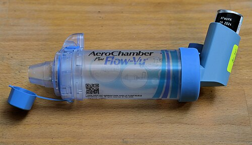
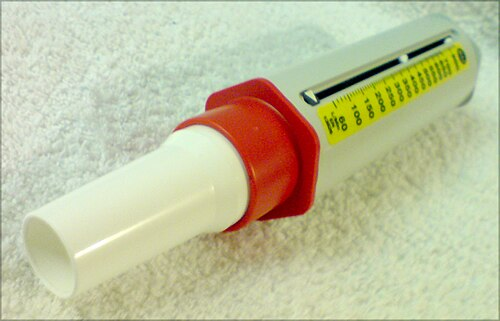

# ASMA NA INFÂNCIA

A asma é a doença crônica mais comum da infância e, consequentemente, um dos temas que mais aparecem em provas de residência. Mas não se engane: as bancas não querem apenas que você saiba que "asma chia". Elas querem que você saiba diferenciar o lactente que vai ser asmático daquele que só tem um quadro transitório, que saiba manejar uma crise grave no pronto-socorro e, principalmente, que entenda como escalonar o tratamento crônico.

Para entender a asma, você precisa visualizar a fisiopatologia. Não é apenas um "aperto" no peito. É uma tríade: inflamação crônica da via aérea, hiperresponsividade brônquica (o pulmão reage exageradamente a estímulos que não deveriam causar nada) e limitação variável ao fluxo aéreo. Por que "variável"? Porque o paciente asmático tem momentos de normalidade intercalados com crises. Se a obstrução fosse fixa, pensaríamos em outras patologias, como sequelas de bronquiolite obliterante ou malformações.

## Fisiopatologia: O Porquê dos Sintomas

Por que o paciente sibila? O sibilo é o som do ar passando por uma via estreitada. Na asma, esse estreitamento ocorre por três motivos principais:

- **Broncoespasmo:** A musculatura lisa brônquica contrai bruscamente.

- **Edema de mucosa:** A inflamação traz líquido e células de defesa para a parede do brônquio, inchando-a.

- **Hipersecreção de muco:** Glândulas produzem muco espesso que obstrui a luz.

Nas provas, guarde que a asma é predominantemente uma doença de resposta TH2, com participação de IgE, eosinófilos e mastócitos. É por isso que a história de atopia (dermatite atópica e rinite alérgica) é tão valiosa no diagnóstico. Quando você vê uma questão mencionando a "marcha atópica", ela está descrevendo a progressão clássica: a criança começa com dermatite atópica no lactente, evolui com rinite e culmina na asma.

## O Desafio do Diagnóstico: O Lactente Sibilante

Aqui está o primeiro grande "nó" da pediatria. Nem todo bebê que chia tem asma. Na verdade, a maioria dos lactentes que sibilam durante infecções virais não será asmática no futuro. Como diferenciar?

Usamos os fenótipos de sibilância, baseados no clássico estudo de Tucson:

- **Sibilantes Transitórios:** Começam a chiar antes de 1 ano e param por volta dos 3 anos. Geralmente são prematuros ou filhos de mães fumantes. O problema aqui é o calibre da via aérea, que é pequeno, e não a inflamação alérgica.

- **Sibilantes Persistentes (Não Atópicos):** Chiam por infecções virais (VSR é o vilão aqui) e tendem a melhorar na adolescência. Não têm história de alergia.

- **Sibilantes Atópicos/Asma Típica:** Começam mais tarde ou persistem após os 3 anos. Têm história familiar, IgE alta e testes alérgicos positivos. Estes são os verdadeiros asmáticos.

### Índice Preditivo de Asma (API)

Como as bancas cobram isso? Elas dão um caso de um lactente com sibilância recorrente (3 ou mais episódios no último ano) e perguntam se ele tem risco de asma. Você deve aplicar o API (Asthma Predictive Index).

**Critérios Maiores:**

- Pai ou mãe com asma.

- Diagnóstico médico de dermatite atópica (Pérola clínica: é o critério mais forte em questões).

- Sensibilização a aeroalérgenos.

**Critérios Menores:**

- Sibilância sem resfriado (chiado "do nada").

- Eosinofilia periférica (≥ 4%).

- Sensibilização a alimentos (leite, ovo, amendoim).

**Diagnóstico de API positivo:** 1 critério maior OU 2 critérios menores. Se o API é positivo, a chance dessa criança ter asma aos 6-13 anos é muito alta.

## Diagnóstico Clínico e Funcional

Em escolares (geralmente > 6 anos), o diagnóstico é mais fácil porque podemos usar a espirometria. Em menores de 5 anos, o diagnóstico é **essencialmente clínico**.

### Quadro Clínico

Os sintomas clássicos são: dispneia, tosse crônica (geralmente seca e pior à noite ou ao acordar), sibilância e opressão torácica.

- **Dica de prova:** Se a tosse for sempre produtiva, com catarro amarelado constante, pense em fibrose cística ou bronquiectasias, não em asma pura.

- **Gatilhos:** Exercício físico, riso, choro, fumaça de cigarro, ácaros e infecções virais.

### Espirometria (O padrão-ouro para > 6 anos)

Buscamos o distúrbio ventilatório obstrutivo com **reversibilidade**.

- **VEF1/CVF (Índice de Tiffeneau) reduzido:** Abaixo do limite inferior da normalidade (geralmente < 0,80 ou 0,85 em crianças).

- **Prova Broncodilatadora (PBD) positiva:** Aumento do VEF1 > 12% em relação ao valor pré-BD. Algumas diretrizes em pediatria sugerem que um aumento de 10% já é muito sugestivo.

Se a espirometria for normal, mas a suspeita for alta, podemos usar o teste de broncoprovocação (com metacolina ou exercício), buscando a hiperresponsividade. Mas cuidado: um teste de broncoprovocação negativo praticamente exclui asma, mas um positivo não confirma sozinho (outras doenças podem causar hiperresponsividade).

## Diagnóstico Diferencial: As Pegadinhas

Muitas questões colocam um "bebê chiador" que não responde a nada. Se o tratamento para asma falha, você deve questionar o diagnóstico.

| Suspeitar de... | Se o paciente apresentar... |
| --- | --- |
| **Aspiração de Corpo Estranho** | Sibilância localizada (unilateral), início súbito, sem pródromos virais. |
| **Refluxo Gastroesofágico (DRGE)** | Vômitos, ganho de peso insuficiente, sibilância relacionada à alimentação. |
| **Fibrose Cística** | Tosse produtiva crônica, baqueteamento digital, diarreia crônica (esteatorreia). |
| **Malformações (Anel Vascular)** | Estridor associado, disfagia, sintomas desde o nascimento. |
| **Bronquiolite Viral Aguda** | Primeiro episódio de sibilância em < 2 anos, com pródromos virais (coriza, febre). |

**Atenção:** A diretriz brasileira e o GINA reforçam que a radiografia de tórax não é necessária para o diagnóstico de asma, mas é fundamental para excluir diagnósticos diferenciais (como tuberculose ou malformações) em crianças que não respondem ao tratamento.

## Manejo da Asma Crônica

> **ATUALIZAÇÃO GINA 2026:** em adultos e adolescentes, o Track 1 preferido usa CI-formoterol em baixa dose como medicação de alívio anti-inflamatória (AIR) e, quando indicado, como manutenção e alívio (MART). Em crianças de 6 a 11 anos, a GINA 2026 também inclui CI-formoterol em baixa dose sob demanda como opção preferencial para sintomas infrequentes; alternativas aceitáveis são CI-SABA sob demanda ou CI sempre que SABA for usado. Em menores de 5 anos, o resgate segue com SABA via MDI + espaçador/máscara, e o controlador principal, quando indicado, é CI diário em baixa dose. Portanto, evite SABA sem componente anti-inflamatório em maiores de 5 anos, mas não extrapole AIR/MART para pré-escolares.

O objetivo aqui não é apenas tratar a crise, mas manter a criança sem sintomas. O tratamento é baseado em ciclos: **Avaliar → Ajustar → Revisar**.

### Classificação do Controle (GINA)

Nas últimas 4 semanas, a criança teve:

- Sintomas diurnos > 2x/semana?

- Algum despertar noturno por asma?

- Necessidade de medicação de alívio > 2x/semana? (não contar uso preventivo antes do exercício).

- Alguma limitação de atividade física?

- **Controlada:** Nenhum item positivo.

- **Parcialmente Controlada:** 1 a 2 itens positivos.

- **Não Controlada:** 3 a 4 itens positivos.

### O Escalonamento Terapêutico (Steps)

*Figura 1 - Inalador dosimetrado (MDI) acoplado a espaçador/aerocâmara, dispositivo preferencial para administração de medicação inalatória por spray em crianças. Fonte: Rasbak, CC BY-SA 4.0 | Wikimedia Commons.*

*Figura 2 - Medidor de pico de fluxo expiratório (peak flow), útil para monitorar variação do fluxo expiratório em crianças maiores que conseguem realizar a manobra. Fonte: Tomhannen, domínio público | Wikimedia Commons.*

O tratamento mudou nos últimos anos e precisa ser organizado por faixa etária. Nos maiores de 5 anos, deve-se evitar broncodilatador de alívio sem componente anti-inflamatório. Nos menores de 5 anos, o SABA continua sendo o resgate, mas sintomas frequentes, exacerbações ou fatores de risco exigem controlador com corticoide inalatório.

#### Crianças de 0 a 5 anos (GINA 2026/SBP):

- **Etapa 1:** SABA (salbutamol) sob demanda para alívio, via MDI + espaçador com máscara ou bocal conforme idade. Reserve para sintomas raros e reavalie técnica, gatilhos e diagnóstico.

- **Etapa 2 (início do controle):** CI em baixa dose diário por pelo menos 2-3 meses quando há sintomas recorrentes, despertares, exacerbações ou risco aumentado. Montelucaste é alternativa menos efetiva e exige alerta sobre eventos neuropsiquiátricos.

- **Etapa 3:** Se técnica e adesão estão adequadas, aumentar CI para dose média ou dobrar a dose baixa por período definido, com reavaliação próxima.

- **Etapa 4:** Encaminhar ao especialista e revisar diagnóstico diferencial. MART/CI-formoterol não é recomendado para menores de 5 anos; há dados insuficientes para CI-LABA em menores de 4 anos.

#### Crianças de 6 a 11 anos:

- **Etapa 1 (sintomas infrequentes):** CI-formoterol em baixa dose sob demanda (AIR) é opção preferencial na GINA 2026. Alternativas: CI-SABA sob demanda ou CI em baixa dose sempre que SABA for usado. Evite SABA isolado.

- **Etapa 2:** CI em baixa dose diário + SABA/CI-SABA sob demanda, ou estratégia AIR quando disponível e apropriada.

- **Etapa 3:** CI-LABA em baixa dose ou CI em dose média; alternativa: MART com CI-formoterol em baixa dose.

- **Etapa 4:** CI-LABA em dose média ou MART com maior dose de manutenção; encaminhar ao especialista se precisar desse degrau.

#### Adolescentes (> 12 anos):

Seguem a lógica do adulto. O **Track 1 preferido** usa CI-formoterol em baixa dose como alívio (AIR) nos steps iniciais e como manutenção + alívio (**MART/SMART**) nos steps 3-5. O formoterol é um LABA de início rápido, por isso pode ser usado no resgate quando combinado ao CI. O Track 2 (SABA ou CI-SABA como alívio) fica para quando CI-formoterol não está disponível, não é adequado ou não será usado corretamente.

**Pérola de Prova:** uso frequente de medicação de alívio, despertares, limitação de atividade ou exacerbações indicam mau controle. Antes de subir o degrau, confira técnica inalatória, adesão, exposição a gatilhos e diagnóstico; se a asma ficar controlada por 3 meses, considere step-down.

## Manejo da Crise Aguda no Pronto-Socorro

A crise de asma é uma emergência pediátrica frequente. O primeiro passo é classificar a gravidade.

### Avaliação da Gravidade

- **Leve/Moderada:** Fala frases completas, prefere sentar a deitar, não está agitada, SatO2 92-95%, frequência respiratória aumentada, mas sem uso de musculatura acessória importante.

- **Grave:** Fala palavras isoladas, sentada para frente (posição de tripé), agitada, SatO2 < 92%, frequência respiratória muito alta, tiragens intercostais e supraclaviculares evidentes.

- **Muito Grave (Iminência de Parada):** Tórax silencioso (não há sibilo porque não há ar passando!), confusão mental, exaustão, cianose, SatO2 < 90%.

### Conduta na Crise

- **Oxigênio:** na GINA 2026, não é rotina se SatO2 está ≥92%. Se precisar, titule para 92-95% em crianças de 6 a 11 anos; em ≤5 anos, mantenha SatO2 ≥92%. Use cateter ou máscara conforme necessidade clínica.

- **Beta-2 Agonista de Curta Ação (SABA):** Salbutamol ou Fenoterol.

- **Preferência:** spray dosimetrado com espaçador. É tão eficaz quanto a nebulização e costuma gerar menos taquicardia e menos agitação.

- **Quantidades práticas na primeira hora:**

- **Menores de 6 anos, crise leve a moderada:** 2 a 3 puffs por ciclo.

- **Menores de 6 anos, crise grave:** 6 puffs por ciclo.

- **Crianças com 6 anos ou mais:** 6 a 10 puffs por ciclo.

- **Esquema:** repetir a cada 20 minutos, por 3 ciclos na primeira hora. Como regra prática alternativa, algumas referências usam 1 puff para cada 2-3 kg, com máximo de 10 puffs por ciclo.

- **Após a primeira hora:** reavaliar resposta clínica, frequência respiratória, uso de musculatura acessória e saturação para decidir espaçamento das doses, necessidade de internação ou escalonamento.

- **Brometo de Ipratrópio (Anticolinérgico):** Deve ser adicionado ao SABA nas **crises moderadas a graves** ainda na primeira hora. Ele reduz a taxa de hospitalização. Não tem benefício comprovado após a estabilização inicial.

- **Corticoide Sistêmico:** Fundamental para tratar a inflamação e evitar a fase tardia da crise.

- Via de escolha: **Oral** (Prednisolona 1-2 mg/kg/dia). A via IV (Hidrocortisona ou Metilprednisolona) é reservada para quem não consegue deglutir ou está em insuficiência respiratória grave.

- Tempo: 3 a 5 dias. Não precisa de desmame se usado por menos de 7-10 dias.

- **Sulfato de Magnésio IV:** Reservado para crises graves que não responderam ao tratamento inicial (SABA + Ipratrópio + Corticoide). Ele atua bloqueando os canais de cálcio e promovendo broncodilatação.

**O que NÃO fazer na crise:**

- Não peça Raio-X de rotina (apenas se suspeitar de complicação como pneumotórax ou pneumonia).

- Não use antibióticos de rotina (a maioria das crises é viral).

- Não use mucolíticos ou sedativos.

- Não use Aminofilina (alto risco de toxicidade e baixa eficácia comparada aos novos protocolos).

## Dispositivos Inalatórios e Técnica

De nada adianta a melhor medicação se ela não chegar ao pulmão. Na prática, técnica inalatória inadequada e má adesão estão entre as causas mais frequentes de falha terapêutica na asma pediátrica.

- **Lactentes e Pré-escolares (< 4-5 anos):** Spray (MDI) + Espaçador + Máscara facial. A máscara deve estar bem acoplada ao rosto.

- **Escolares (> 5-6 anos):** Spray + Espaçador + Bocal. O bocal é melhor que a máscara porque evita a deposição da droga na face e nariz.

- **Adolescentes:** Podem usar inaladores de pó seco (DPI), desde que tenham fluxo inspiratório suficiente.

**Dica de Ouro:** Sempre peça para o paciente (ou cuidador) demonstrar a técnica na consulta. Muitos esquecem de agitar o frasco ou de esperar entre um jato e outro.

## Situações Especiais e Complicações

### Asma e Exercício

Muitas crianças apresentam sintomas apenas durante a atividade física. Isso é a Broncoconstrição Induzida pelo Exercício (BIE). O aquecimento ajuda. Quem usa CI-formoterol como alívio pode utilizá-lo antes do esforço; quem usa SABA deve ter o componente anti-inflamatório garantido conforme a faixa etária e o step. Se for frequente, a asma de base não está controlada e precisa de revisão do controlador.

### Efeitos Colaterais dos Corticoides Inalatórios (CI)

Uma dúvida comum dos pais: "Doutor, o corticoide vai deixar meu filho baixinho?".
A resposta baseada em evidências: O CI em doses baixas/médias pode causar uma redução transitória na velocidade de crescimento no primeiro ano de uso (cerca de 1 cm), mas o impacto na altura final é mínimo ou inexistente. O risco de uma asma não controlada (que causa despertares e uso de corticoide oral) é muito pior para o crescimento e para a vida da criança.

### Distúrbios Eletrolíticos

Lembre-se que o uso intensivo de Beta-2 agonistas (Salbutamol) pode causar **hipocalemia** (o potássio entra na célula) e taquicardia. Em crises graves tratadas no PS, monitorize o potássio.

## Pontos-Chave para Prova

- **Critério Diagnóstico em < 5 anos:** Clínico. Use o API (Índice Preditivo de Asma). Dermatite atópica é o critério maior mais cobrado.

- **Espirometria:** VEF1/CVF reduzido com resposta ao broncodilatador (> 12% de melhora no VEF1).

- **Tratamento de Escolha (Manutenção):** Corticoide inalatório (CI). Em >5 anos, evite SABA sem CI; em ≤5 anos, SABA é o resgate, mas CI diário é o controlador quando sintomas/risco justificam.

- **AIR/MART:** GINA 2026 inclui CI-formoterol sob demanda (AIR) como opção em 6-11 anos desde sintomas infrequentes; MART entra nos steps 3-4. Adolescentes seguem Track 1 preferido com AIR/MART.

- **Crise Moderada/Grave:** SABA + Ipratrópio + Corticoide Sistêmico (preferencialmente ORAL).

- **Sulfato de Magnésio:** Droga de resgate na crise grave refratária.

- **Sinal de Gravidade Extrema:** Tórax silencioso (ausência de sibilos por fluxo aéreo insuficiente).

- **Meta de Saturação:** se O2 for necessário, 92-95% em 6-11 anos; em ≤5 anos, manter ≥92%.

- **Diagnóstico Diferencial:** Se houver sibilância unilateral fixa, pense em corpo estranho. Se houver estridor desde o nascimento, pense em anel vascular ou laringomalácia.

- **Efeito Colateral SABA:** Hipocalemia e tremores.

- **Manejo de Manutenção:** Se a asma está controlada por 3 meses, tente o *step-down* (reduzir a dose em 25-50%).

- **Não fazer na crise:** Não usar antibióticos, não pedir Raio-X de rotina e não usar mucolíticos.

- **Técnica Inalatória:** Espaçador é obrigatório para crianças que usam spray (MDI). O bocal é superior à máscara em maiores de 5 anos. 🩺

 Cópia offline para consulta pessoal.
 Fonte original:
 [https://www.medevo.com.br/material-apoio/ler/016ee12f-9b4e-4954-a2c7-b7412d025a04](https://www.medevo.com.br/material-apoio/ler/016ee12f-9b4e-4954-a2c7-b7412d025a04)
