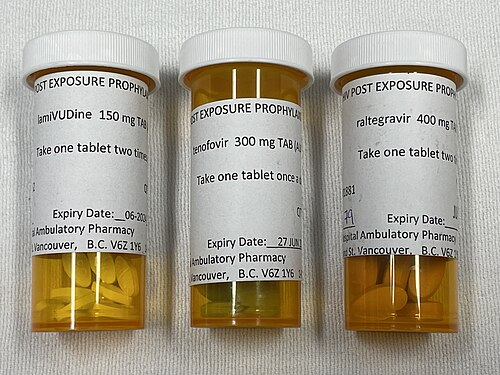

# ATENDIMENTO À VÍTIMA DE VIOLÊNCIA SEXUAL

Quando uma vítima de violência sexual cruza a porta do pronto-socorro ou do seu consultório, o relógio biológico e o relógio legal começam a correr contra nós. Como professor, vejo muitos alunos ficarem nervosos com a burocracia, mas a primeira coisa que você precisa entender é: o atendimento médico é soberano e precede qualquer trâmite policial. Se a paciente chega com uma hemorragia genital grave, você não pergunta se ela fez o Boletim de Ocorrência (BO), você estabiliza a paciente.

A violência sexual é uma emergência médica e social. O seu papel aqui é triplo: acolher para evitar a revitimização, tratar para prevenir agravos (infecções e gravidez) e documentar para garantir direitos. Nas provas de residência, o foco costuma recair sobre os prazos das profilaxias e a autonomia do paciente, especialmente adolescentes. Vamos dissecar cada passo desse atendimento.

## Acolhimento e Aspectos Ético-Legais

O acolhimento não é apenas "ser legal". É uma diretriz técnica. O Ministério da Saúde e a FEBRASGO enfatizam que o atendimento deve ser multidisciplinar (médico, enfermagem, psicologia, serviço social).

Um erro clássico que vejo em provas é a confusão sobre a necessidade de documentos policiais. Guarde isso: **para o atendimento médico e para a realização do aborto legal, NÃO é necessária a apresentação de Boletim de Ocorrência ou autorização judicial.** Se a questão disser que você deve aguardar o BO para prescrever a profilaxia, a alternativa está errada.

### O Sigilo Médico e a Notificação Compulsória

Aqui mora uma das maiores "pegadinhas" de prova. Existe uma diferença crucial entre Notificação Compulsória e Denúncia Policial.

- **Notificação Compulsória:** É obrigatória para TODO caso de violência sexual, conforme a Lei 10.778/2003. Ela tem fins epidemiológicos. Se a vítima for adulta e capaz, você notifica o sistema de saúde, mas mantém o sigilo em relação à polícia, a menos que haja autorização dela.

- **Violência contra Criança ou Adolescente:** Aqui o sigilo é mitigado. Se houver suspeita ou confirmação de violência contra menores de 18 anos, a notificação ao Conselho Tutelar ou Juizado da Infância e Juventude é obrigatória e imediata, independentemente do consentimento dos responsáveis.

Recentemente, a Lei 14.737/2023 reforçou o direito da mulher de ter um acompanhante de sua escolha em qualquer atendimento de saúde, sem necessidade de aviso prévio. Isso é muito cobrado como "humanização do atendimento".

## Avaliação Clínica e Coleta de Vestígios

O exame físico deve ser minucioso, mas sempre com o consentimento da vítima. Se ela se recusar a ser examinada naquele momento, você deve respeitar e focar nas profilaxias medicamentosas.

### Exame Físico e Lesões Traumáticas

Procure por lesões extragenitais (equimoses, marcas de mordedura, escoriações) e genitais. No exame ginecológico, avaliamos a integridade do hímen (em casos de mulheres cisgênero que não iniciaram vida sexual), presença de lacerações e sangramentos.

Um ponto que o Dr. Will sempre reforça nas discussões de caso: o trauma anorretal. Se houver relato de coito anal, o exame proctológico é mandatório.

- **Pérola Clínica:** Se você encontrar uma lesão retal extraperitoneal com menos de 6 horas de evolução, a conduta é a sutura primária imediata. Não há necessidade de colostomia nesses casos precoces. A colostomia fica reservada para lesões complexas, infectadas ou com grande atraso no atendimento.

### Coleta de Vestígios (O papel do Ginecologista)

Embora o exame de corpo de delito oficial seja feito no Instituto Médico Legal (IML), o ginecologista que faz o primeiro atendimento deve estar apto a coletar vestígios se o IML não estiver disponível ou se a coleta imediata for crucial para não perder a prova (como o sêmen, que degrada rápido).

A coleta de secreção vaginal para pesquisa de espermatozoides e DNA deve ser feita preferencialmente com swabs secos. Lembre-se de documentar tudo no prontuário com riqueza de detalhes, usando termos descritivos (ex: "lesão linear de 2cm em fúrcula vaginal") em vez de termos subjetivos.

## Profilaxia de Infecções Sexualmente Transmissíveis (ISTs)

Este é o tópico que mais cai. Você precisa saber as drogas, as doses e, principalmente, o tempo limite. O "número mágico" aqui é 72 horas.

### Profilaxia Pós-Exposição (PEP) para HIV

A PEP deve ser iniciada o mais rápido possível, idealmente nas primeiras 2 horas após a exposição, tendo como limite máximo 72 horas. Por que 72 horas? Porque após esse período, a integração do DNA viral ao genoma do hospedeiro já ocorreu de forma sistêmica, e a medicação perde sua eficácia preventiva.

Segundo o Protocolo Clínico e Diretrizes Terapêuticas (PCDT) do Ministério da Saúde, o esquema de escolha atual é:

- **Tenofovir (TDF) 300 mg + Lamivudina (3TC) 300 mg (em dose combinada)**: 1 comprimido uma vez ao dia.

- **Dolutegravir (DTG) 50 mg**: 1 comprimido uma vez ao dia.

- **Duração**: 28 dias.

**Cuidado:** Se a paciente for lactante, ela pode fazer a PEP, mas a amamentação deve ser suspensa temporariamente devido ao risco de transmissão vertical se a mãe se infectar durante o período de janela imunológica. A reintrodução só ocorre após 12 semanas se o anti-HIV da mãe for não reagente.

### Profilaxia para ISTs Não-Virais

*Figura 1 - Medicamentos antirretrovirais utilizados na Profilaxia Pós-Exposição (PEP) ao HIV, que deve ser iniciada em até 72 horas após a exposição. Fonte: Doc James, CC BY-SA 4.0 | Wikimedia Commons*

Diferente do HIV, para sífilis, gonorreia e clamídia, fazemos o tratamento empírico (esquema sindrômico) imediatamente, sem esperar exames.

| Infecção | Droga de Escolha | Dose e Via |
| --- | --- | --- |
| **Sífilis** | Penicilina Benzatina | 2,4 milhões UI, IM (dose única) |
| **Gonorreia** | Ceftriaxone | 500 mg, IM (dose única) |
| **Clamídia** | Azitromicina | 1 g, VO (dose única) |
| **Tricomoníase** | Metronidazol | 2 g, VO (dose única) |

**Por que Ceftriaxone 500mg?** Antigamente usávamos 250mg ou Ciprofloxacino. O Ciprofloxacino foi abandonado devido à alta resistência do gonococo. A dose de 500mg é a recomendação atual para garantir eficácia.

### Hepatite B e HPV

A profilaxia da Hepatite B depende do status vacinal da vítima:

- **Vítima vacinada (com anti-HBs conhecido > 10):** Nada a fazer.

- **Vítima não vacinada ou com esquema incompleto:** Iniciar/completar esquema vacinal (0, 1 e 6 meses) + Imunoglobulina Humana Anti-Hepatite B (IGHAHB) em até 14 dias (idealmente nas primeiras 48h).

Para o HPV, o Ministério da Saúde recomenda a vacinação em vítimas de violência sexual de 9 a 45 anos (mulheres e homens), seguindo o esquema de três doses (0, 2 e 6 meses).

## Anticoncepção de Emergência (AE)

A gravidez decorrente de estupro é um dos traumas mais graves que a vítima pode enfrentar. A AE deve ser oferecida a todas as mulheres em idade fértil que sofreram penetração vaginal sem proteção, independentemente da fase do ciclo menstrual.

- **Esquema de escolha:** Levonorgestrel 1,5 mg, VO, dose única.

- **Prazo:** Até 5 dias (120 horas) após o coito, mas a eficácia é muito maior se tomada nas primeiras 72 horas.

- **Observação importante:** O Levonorgestrel NÃO é abortivo. Ele age retardando ou inibindo a ovulação. Se a implantação já ocorreu, ele não tem efeito. Por isso, não há contraindicação absoluta, nem mesmo para pacientes com histórico de trombose (o risco trombótico de uma dose única de progestágeno é desprezível perto do risco de uma gestação indesejada).

No MedEvo, sempre discutimos que, se a paciente já usa um método contraceptivo eficaz (como DIU ou implante), a AE pode ser dispensada, mas na dúvida (ex: ela esqueceu pílulas), sempre prescreva.

## Interrupção Legal da Gravidez

Se a profilaxia falhar ou se a vítima chegar ao serviço já grávida em decorrência da violência, ela tem direito ao aborto legal. No Brasil, o aborto é permitido em três situações: risco de vida materno, anencefalia fetal e estupro.

Para o caso de estupro:

- **Não precisa de BO.**

- **Não precisa de autorização judicial.**

- **Não precisa de exame de corpo de delito.**

- **O que precisa?** O relato da vítima. A palavra da mulher tem presunção de veracidade. O médico deve colher um termo de relato circunstanciado, assinado pela paciente.

A equipe de saúde deve ser composta por médico, psicólogo e assistente social. O médico pode alegar **objeção de consciência** para não realizar o procedimento, DESDE QUE haja outro profissional disponível para fazê-lo e que não haja risco de morte para a paciente. A instituição, no entanto, não tem objeção de consciência; o serviço de saúde deve garantir o direito da paciente.

## Atendimento a Populações Específicas

### O Adolescente e a Autonomia

Este é um tema quente em provas de ética médica. O adolescente (entre 12 e 18 anos incompletos) tem direito ao sigilo profissional e à autonomia sobre seu corpo, desde que tenha capacidade de discernimento.

- **Cenário:** Adolescente de 15 anos chega sozinha pedindo contracepção de emergência após violência. Você deve atendê-la, prescrever a medicação e manter o sigilo, mesmo que os pais não saibam.

- **Exceção:** Se houver risco iminente à vida ou à saúde da paciente, ou se a violência for praticada por quem detém a guarda, o sigilo deve ser quebrado para proteção da menor (notificação ao Conselho Tutelar).

### Homens Transgênero

Um homem trans (pessoa que nasceu com fenótipo feminino, mas se identifica com o gênero masculino) que possui útero e ovários e sofre violência sexual com penetração vaginal tem o MESMO risco de gravidez e ISTs que uma mulher cisgênero. O atendimento deve ser idêntico em termos de profilaxia, respeitando-se o nome social e a identidade de gênero.

## Seguimento e Saúde Mental

O atendimento não termina quando a paciente sai do consultório com as receitas. O trauma psicológico é, muitas vezes, mais duradouro que as lesões físicas.

- **Suporte Psicológico:** Deve ser iniciado imediatamente. O Transtorno de Estresse Pós-Traumático (TEPT), depressão e disfunções sexuais são complicações frequentes.

- **Retorno Laboratorial:**

- **6 semanas:** Sorologias (HIV, Sífilis, Hepatites).

- **3 meses:** Repetir sorologias.

- **6 meses:** Repetir sorologias (fechamento do protocolo).

Lembre-se: o abuso sexual na infância está associado a um aumento drástico no risco de transtornos de ansiedade, distúrbios alimentares e dor pélvica crônica na vida adulta. No entanto, uma pegadinha comum de prova é dizer que aumenta a satisfação sexual ou causa esquizofrenia — ambas afirmações são falsas.

## Diagnóstico Diferencial de Dor Pélvica Pós-Trauma

Muitas vítimas desenvolvem dor pélvica crônica. Ao avaliar essas pacientes meses depois, considere:

- **Dor Miofascial:** Frequentemente associada ao trauma e ao tensionamento crônico da musculatura do assoalho pélvico. O tratamento envolve fisioterapia pélvica e, às vezes, medicações para dor neuropática.

- **Sequelas de ISTs:** Doença Inflamatória Pélvica (DIP) subclínica se a profilaxia não foi feita ou falhou.

## Pontos-Chave para Prova

- **Prioridade Zero:** O atendimento médico e as profilaxias precedem qualquer burocracia policial ou judicial.

- **Janela da PEP HIV:** Máximo de 72 horas. Esquema: TDF + 3TC + DTG por 28 dias.

- **Anticoncepção de Emergência:** Levonorgestrel 1,5 mg dose única. Prazo ideal até 72h, limite de 120h (5 dias).

- **Profilaxia IST Não-Viral:** Ceftriaxone 500mg IM + Azitromicina 1g VO + Penicilina Benzatina 2,4 mi UI IM.

- **Notificação Compulsória:** Obrigatória em todos os casos. Para adultos, não implica em denúncia policial automática (respeita o sigilo). Para menores, a comunicação ao Conselho Tutelar é obrigatória.

- **Aborto Legal:** No caso de estupro, basta o consentimento e o relato da vítima. Não se exige BO ou decisão judicial.

- **Lactantes:** Podem fazer PEP, mas devem suspender a amamentação temporariamente até a confirmação da sorologia negativa após 12 semanas.

- **Lesão Retal:** Se extraperitoneal e < 6h, sutura primária. Não faça colostomia de rotina.

- **Hepatite B:** Se não vacinada, Vacina + Imunoglobulina (IGHAHB).

- **HPV:** Vacina recomendada para vítimas de 9 a 45 anos.

- **Sigilo no Adolescente:** É a regra, desde que haja capacidade de discernimento, exceto em situações de risco de vida ou para sua proteção.

- **Exame de Corpo de Delito:** O médico assistente pode e deve registrar os achados, mas o exame oficial é do IML. Nunca atrase a profilaxia para esperar o IML.

- **Pegadinha de Prova:** A alternativa que diz que "é necessário esperar o resultado do teste rápido de HIV para iniciar a PEP" está ERRADA. Inicie a PEP imediatamente e, se o teste da vítima vier positivo (infecção prévia), você ajusta para tratamento.

- **Primeira Escolha AE:** Levonorgestrel é a primeira escolha, mesmo em pacientes com risco de trombose.

- **Acompanhante:** Direito garantido pela Lei 14.737/23 em qualquer atendimento de saúde para mulheres. 💡

 Cópia offline para consulta pessoal.
 Fonte original:
 [https://www.medevo.com.br/material-apoio/ler/c4736c46-829a-4905-a643-a675d5833b20](https://www.medevo.com.br/material-apoio/ler/c4736c46-829a-4905-a643-a675d5833b20)
