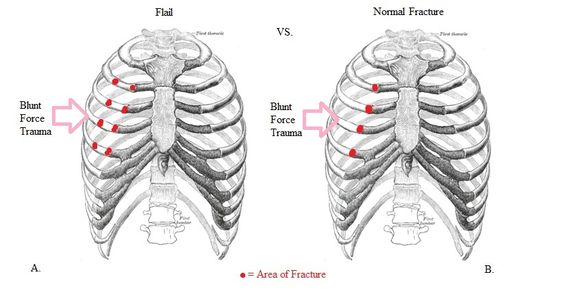
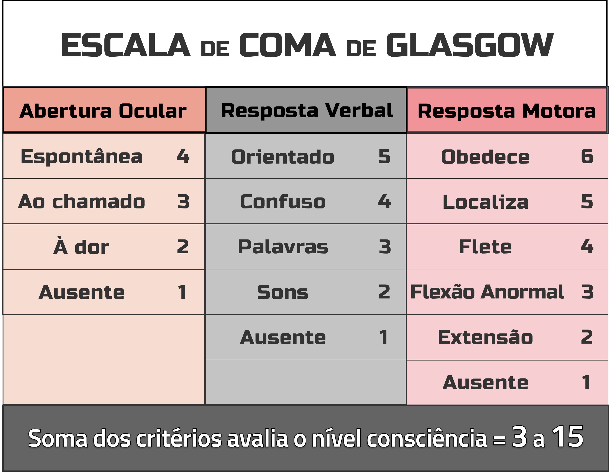
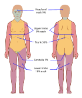

# ATENDIMENTO AO POLITRAUMATIZADO

O atendimento ao politraumatizado não é uma corrida de velocidade, mas sim uma corrida de prioridades. Se você tentar resolver tudo ao mesmo tempo, o paciente morre. O segredo que as bancas de residência exploram é justamente a sua capacidade de seguir a sistematização do ATLS (Advanced Trauma Life Support).

Por que seguimos o ABCDE? Porque essa ordem reflete o que mata o paciente mais rápido. Não adianta tratar uma fratura exposta de fêmur se o paciente não tem uma via aérea pérvia. O foco aqui é a "Hora de Ouro", aquele período inicial onde suas intervenções salvam vidas.

## A Preparação e o Exame Primário

Antes do paciente chegar, a equipe deve estar paramentada. Isso é proteção para você e para o paciente. No trauma, tratamos todos como potencialmente infectados.

O exame primário é o coração da prova. É aqui que 80% das questões se concentram. Vamos dissecar cada letra, focando no que o examinador quer que você erre.

### A: Via Aérea e Controle da Coluna Cervical

A primeira coisa que você faz ao chegar perto de um paciente é perguntar: "Qual o seu nome?". Se ele responder com clareza, você já sabe que a via aérea está pérvia (A) e que há perfusão cerebral mínima (C).

Cuidado: se o paciente está agitado, ele pode estar hipóxico. Se está obnubilado, ele pode estar hipercápnico.

A proteção da coluna cervical é obrigatória. Todo politraumatizado tem lesão de coluna cervical até que se prove o contrário. O colar cervical sozinho não imobiliza, ele restringe o movimento. A imobilização correta exige o colar, os coxins laterais e a prancha rígida.

#### Trauma Cervical Penetrante

Aqui existe um ponto clássico de prova. Se a questão descreve um ferimento por arma branca no pescoço, olhe para o platisma. Se o platisma foi perfurado, a conduta muda.

Antigamente, dividíamos o pescoço em zonas (I, II e III). Hoje, a tendência é a avaliação por angiotomografia se o paciente estiver estável. Porém, para a prova, guarde esta pérola: trauma cervical penetrante com platisma perfurado na Zona II (entre a cartilagem cricóide e o ângulo da mandíbula) com sinais de instabilidade ou lesão vascular/aerodigestiva óbvia exige exploração cirúrgica imediata.

### B: Respiração e Ventilação

No "B", não basta o ar entrar, ele tem que trocar. Você precisa avaliar a expansibilidade, auscultar e percutir.

O erro comum aqui é confundir Pneumotórax Hipertensivo com Hemotórax Maciço. No hipertensivo, o murmúrio vesicular está abolido e o som é timpânico (hiperressonância). No hemotórax, o som é maciço.

#### Pneumotórax Hipertensivo

É um diagnóstico clínico. Se você esperar o Raio X para diagnosticar, o paciente morre e você reprova. O tratamento é a descompressão imediata.

A diretriz atual (ATLS 10ª e 11ª edições) recomenda a descompressão por agulha (14G ou 16G) no 4º ou 5º espaço intercostal (EIC), na linha axilar média. Cuidado: muitas questões antigas ainda trazem o 2º EIC na linha hemiclavicular. Se a questão for atual, prefira o 5º EIC. Após a agulha, o dreno de tórax é obrigatório.

> **Pneumotórax no trauma:** entrada de ar no espaço pleural leva ao colapso parcial ou total do pulmão. No trauma, sinais de gravidade incluem dispneia, assimetria ventilatória, hipotensão e desvio de traqueia quando há pneumotórax hipertensivo. A conduta é imediata quando há instabilidade: descompressão e drenagem torácica conforme protocolo. *Figura 1 - Pneumotórax: comparação entre pulmão normal (esquerda) e pneumotórax (direita), mostrando o colapso pulmonar e acúmulo de ar no espaço pleural. Fonte: Blausen Medical, CC BY 3.0*

#### Tórax Instável e Respiração Paradoxal

Ocorre quando há fratura de dois ou mais costelas consecutivas em dois ou mais pontos. O segmento "solto" se move ao contrário do resto do tórax (encolhe na inspiração).

Atenção: o que mata no tórax instável não é a fratura, é a contusão pulmonar subjacente. Se o paciente apresentar respiração paradoxal, agitação e sinais de insuficiência respiratória, a conduta é intubação orotraqueal e ventilação com pressão positiva. Isso faz a "estabilização pneumática" do tórax.

*Figura 2 - Tórax Instável (Flail Chest): à esquerda, fratura costal simples; à direita, tórax instável com segmento flutuante e respiração paradoxal. Fonte: Wikimedia Commons, CC BY-SA 3.0*

### C: Circulação com Controle de Hemorragia

No trauma, choque é hemorrágico até prova em contrário. A prioridade é controlar sangramento externo, reconhecer hipoperfusão e decidir cedo por hemoderivados quando há sangramento importante. Se não há pulso central palpável, não perca tempo procurando pulso periférico.

#### Classificação atual do choque hemorrágico

As classes I-IV continuam úteis como linguagem inicial, mas não devem ser usadas como régua rígida. Sinais vitais podem enganar: hipotensão é tardia, idosos e pacientes em betabloqueador podem não fazer taquicardia, atletas podem tolerar perdas maiores e gestantes compensam por mais tempo. Por isso, interprete a tabela junto com perfusão cutânea, estado mental, diurese, lactato/base deficit, mecanismo do trauma e resposta à ressuscitação.

| Parâmetro | Classe I | Classe II | Classe III | Classe IV |
| --- | --- | --- | --- | --- |
| Perda sanguínea estimada | < 15% | 15-30% | 30-40% | > 40% |
| Frequência cardíaca típica | Normal ou < 100 | > 100 | > 120 | > 140, podendo cair no pré-PCR |
| Pressão arterial | Geralmente normal | Normal ou pulso estreitado | Pode reduzir | Reduzida de forma importante |
| Estado mental/perfusão | Alerta, perfusão preservada | Ansiedade, pele fria, enchimento lentificado | Confusão, oligúria, pele fria | Letargia, anúria, choque profundo |
| Conduta que muda desfecho | Controle do sangramento e monitorização | Controle do sangramento, acesso calibroso, pequena carga de cristaloide aquecido e preparo de sangue | Hemoderivados precoces, considerar protocolo de transfusão maciça e controle definitivo da hemorragia | Transfusão maciça e controle imediato da hemorragia |

#### Como usar na prática

Não espere o paciente preencher uma classe perfeita para agir. Um índice de choque (FC/PAS) acima de 0,9-1,0, extremidades frias, alteração do sensório, pele moteada, oligúria, lactato subindo ou base deficit importante já devem acelerar a investigação e o controle da fonte de sangramento.

| Resposta à ressuscitação inicial | O que sugere | Próxima decisão |
| --- | --- | --- |
| Resposta rápida e sustentada | Sangramento controlado ou perda menor | Manter monitorização, investigação dirigida e evitar excesso de cristaloide |
| Resposta transitória | Sangramento ativo provável | Acionar hemoderivados e controle definitivo: centro cirúrgico, radiologia intervencionista ou tamponamento conforme a fonte |
| Sem resposta | Hemorragia grave ou choque não hemorrágico associado | Protocolo de transfusão maciça, controle imediato da hemorragia e reavaliação de causas obstrutivas/cardiogênicas |

#### Reposição volêmica

Abandone a ideia de 2 litros de soro para todo politraumatizado. Em adultos, use até 1 litro de cristaloide aquecido e balanceado, preferindo Ringer lactato quando disponível, enquanto obtém acesso venoso calibroso, tipagem/prova cruzada e hemoderivados. Se a resposta for transitória ou ausente, a prioridade deixa de ser mais soro e passa a ser sangue em estratégia balanceada, controle da hemorragia e prevenção da tríade letal.

O ácido tranexâmico deve ser considerado o mais cedo possível, idealmente dentro de 3 horas do trauma, quando há sangramento significativo ou risco de hemorragia importante, desde que não haja contraindicação local relevante.

A hipotensão permissiva busca PAS em torno de 80-90 mmHg, ou PAM de 50-60 mmHg, até o controle do sangramento em pacientes sem sinais de trauma cranioencefálico grave. No TCE grave, essa estratégia não se aplica: evite hipotensão e priorize pressão de perfusão cerebral, seguindo o protocolo local.

#### Trauma Pélvico

O trauma de bacia é uma "caixa preta" que pode esconder litros de sangue. Se houver instabilidade pélvica (ex: compressão anteroposterior tipo CAP III), a conduta inicial é fechar a bacia com um lençol ou cinta pélvica na altura dos trocanteres maiores.

Se o paciente continuar chocado mesmo após fechar a bacia, o tamponamento extraperitoneal ou a angiografia com embolização são as opções para controle do sangramento venoso ou arterial, respectivamente.

### D: Incapacidade (Exame Neurológico)

Aqui usamos a Escala de Coma de Glasgow (GCS). Lembre-se que a escala foi atualizada para incluir a reatividade pupilar (GCS-P).

*Figura 3 - Escala de Coma de Glasgow (ECG): parâmetros de abertura ocular, resposta verbal e resposta motora com suas respectivas pontuações. Fonte: Wikimedia Commons, CC BY-SA 4.0*

No TCE leve (GCS 13-15), a dúvida é: quem precisa de Tomografia (TC)?
Segundo os critérios de imagem, indicamos TC se houver: amnésia pós-traumática > 30 min, mecanismo de alta energia, vômitos (2 ou mais episódios), idade > 65 anos ou sinais de fratura de base de crânio (Sinal de Guaxinim ou Sinal de Battle).

### E: Exposição e Controle do Ambiente

O paciente deve ser despido completamente, mas não pode ficar frio. A hipotermia faz parte da Tríade Letal do Trauma.

#### A Tríade Letal

Este conceito cai em toda prova de cirurgia. É um ciclo vicioso:

- Hipotermia: Inibe a cascata de coagulação.

- Acidose: Ocorre pela má perfusão tecidual (metabolismo anaeróbio).

- Coagulopatia: Piora o sangramento, que piora a acidose e a hipotermia.

*Figura 4 - Tríade Letal do Trauma (Trauma Triad of Death): ciclo vicioso entre hipotermia, acidose metabólica e coagulopatia. Fonte: Cburnett, CC BY 3.0*

Para quebrar esse ciclo, usamos o "Controle de Danos" (Damage Control Surgery). Em vez de uma cirurgia definitiva de 6 horas, fazemos uma cirurgia rápida para parar o sangramento e conter a contaminação, mandamos o paciente para a UTI para aquecer e corrigir a coagulopatia, e só depois voltamos para a reconstrução definitiva.

## Métodos Diagnósticos no Trauma (Adjuntos)

Enquanto você faz o ABCDE, alguns exames podem ser feitos à beira do leito. Os dois principais são o Raio X (tórax e bacia) e o FAST.

### FAST (Focused Assessment for Sonography in Trauma)

O FAST não serve para ver lesão de órgão sólido (como laceração de fígado). Ele serve para ver líquido livre (sangue).
As 4 janelas do FAST são:

- Pericárdica (Subxifoide).

- Hepatorrenal (Espaço de Morrison).

- Esplenorrenal.

- Suprapúbica (Bexiga/Pelve).

O e-FAST (extended) inclui a avaliação das pleuras para buscar pneumotórax.
Lembre-se: paciente instável com FAST positivo = Bloco Cirúrgico. Paciente estável com FAST positivo = Tomografia para avaliar a extensão da lesão.

## Traumas Específicos e Particularidades

### Trauma Abdominal

O sinal de irritação peritoneal (abdome em tábua, descompressão dolorosa) é indicação de laparotomia imediata no trauma penetrante.

Se o paciente tem uma dor abdominal súbita e intensa, e o Raio X mostra pneumoperitônio (ar abaixo do diafragma), o diagnóstico provável é perfuração de víscera oca, como uma úlcera gastroduodenal. Isso é uma emergência cirúrgica.

No trauma contuso, o órgão mais lesado é o baço. No trauma penetrante por arma branca, é o fígado. Por arma de fogo, é o intestino delgado.

### Trauma Vascular e Isquemia Aguda

A isquemia arterial aguda é uma emergência. O quadro clássico são os 5 Ps: Pain (dor), Pallor (palidez), Paresthesia (parestesia), Poikilothermia (poiquilotermia) e Pulselessness (ausência de pulso).

Muitas vezes, isso ocorre sobre uma doença pré-existente (DAOP). Se o paciente já tinha dor crônica nas pernas (claudicação) e agora agudizou, suspeite de trombose arterial. Se foi um início súbito em paciente com fibrilação atrial, pense em embolia. A Classificação de Rutherford ajuda a decidir a urgência: se houver perda de sensibilidade e fraqueza muscular (Rutherford IIb), a revascularização deve ser imediata.

### Queimaduras

O manejo inicial segue o ABCDE. No "A", cuidado com a lesão inalatória (estridor, fuligem nas narinas, queimadura de face). Se houver suspeita, a intubação deve ser precoce, antes que o edema feche tudo.

Para a reposição volêmica, usamos a Fórmula de Parkland (ou a fórmula atualizada do ATLS):

- 4 mL (ou 2 mL em diretrizes mais recentes para adultos) x Peso (kg) x % de Superfície Corporal Queimada (SCQ).

- Metade do volume nas primeiras 8 horas (contadas a partir do momento da queimadura, não da chegada ao hospital).

- A outra metade nas 16 horas seguintes.

Para calcular a SCQ, usamos a Regra dos Nove de Wallace:

- Cabeça: 9%

- Cada braço: 9%

- Tronco anterior: 18%

- Tronco posterior: 18%

- Cada perna: 18%

- Genitália: 1%

*Figura 5 - Regra dos Nove de Wallace: diagrama da distribuição percentual da superfície corporal para cálculo da área queimada (SCQ). Fonte: Wikimedia Commons, CC BY-SA 3.0*

### Trauma por Explosão

As explosões causam lesões por quatro mecanismos, e as bancas adoram classificar isso:

- Primária: Onda de choque (barotrauma). Afeta órgãos com ar (ouvido, pulmão, intestino).

- Secundária: Estilhaços e projéteis atingindo a vítima.

- Terciária: A vítima é lançada contra um objeto ou o chão.

- Quaternária: Tudo o mais (queimaduras, inalação de fumaça, esmagamento).

## Medicina Legal e Cronologia das Lesões

Como professor, vejo muitos alunos ignorarem a parte de Medicina Legal, mas ela cai! A datação de equimoses é o tema favorito. A cor da mancha muda conforme a hemoglobina é degradada.

| Tempo Decorrido | Coloração da Equimose |
| --- | --- |
| 1º ao 3º dia | Vermelho-violácea / Azulada |
| 4º ao 6º dia | Azulada / Esverdeada |
| 7º ao 10º dia | Amarelada |
| 15º ao 20º dia | Desaparecimento |

Isso é o Espectro Equimótico de Legrand. Se o examinador descreve uma lesão amarela e outra roxa, ele quer que você saiba que as agressões ocorreram em momentos diferentes.

## Situações Especiais e Erros Comuns

### O "Faca In Situ"

Se o paciente chega com uma faca cravada no tórax ou abdome, a regra de ouro é: NÃO REMOVA. A faca pode estar fazendo um tamponamento temporário de um vaso. A remoção deve ser feita no centro cirúrgico. Se o paciente estiver estável, a TC de tórax/abdome ajuda a planejar a cirurgia.

### Fraturas Expostas

A classificação de Gustilo-Anderson guia o tratamento. Para a prova, foque na conduta inicial: alinhamento da fratura, imobilização temporária, antibioticoterapia precoce (geralmente Cefalosporina de 1ª geração, adicionando Gentamicina se for Gustilo III) e profilaxia do tétano.

### POCUS (Point-of-Care Ultrasound)

O POCUS vai além do FAST. Ele permite avaliar a função cardíaca (choque obstrutivo vs. hipovolêmico) e guiar procedimentos como o acesso venoso central. Na prática, o ultrassom à beira-leito complementa o exame físico e ajuda a responder rapidamente se há líquido livre, pneumotórax ou componente cardiogênico/obstrutivo do choque.

## Pontos-Chave para Prova 🩺

- **Pneumotórax Hipertensivo:** Diagnóstico clínico. Descompressão imediata no 4º ou 5º EIC na linha axilar média (adultos).

- **Tríade Letal:** Hipotermia, Acidose e Coagulopatia. O objetivo do Controle de Danos é interromper este ciclo.

- **FAST:** Avalia líquido livre, não lesão de órgão. As 4 janelas são pericárdica, hepatorrenal, esplenorrenal e pélvica.

- **Trauma Cervical:** Platisma perfurado na Zona II com sinais de alarme = Exploração cirúrgica.

- **Choque hemorrágico:** use as classes I-IV como estimativa, mas decida pela perfusão, índice de choque, lactato/base deficit e resposta à ressuscitação. Resposta transitória ou ausente exige hemoderivados e controle da fonte.

- **Queimaduras:** fórmula clássica de Parkland = 4 mL x kg x %SCQ, com metade nas primeiras 8h do evento; protocolos atuais podem iniciar com 2 mL/kg/% em adultos e titular por diurese/perfusão.

- **Tórax Instável:** O tratamento foca na dor e na ventilação, pois a contusão pulmonar é a verdadeira vilã.

- **Equimose Amarela:** Indica lesão com cerca de 7 a 10 dias (Espectro de Legrand).

- **Tamponamento Extraperitoneal:** Usado em fraturas pélvicas instáveis com sangramento persistente após estabilização da bacia.

- **Isquemia Aguda:** 5 Ps (Dor, Palidez, Parestesia, Poiquilotermia, Pulso ausente). Rutherford IIb exige cirurgia imediata.

- **TCE Leve:** Indicação de TC se houver vômitos, idade > 65 anos, amnésia > 30 min ou sinais de fratura de base de crânio.

- **Explosão Primária:** Lesão por onda de pressão (barotrauma), sendo a ruptura de tímpano a mais comum.

- **Hipotensão permissiva:** alvo de PAS 80-90 mmHg até controle do sangramento em trauma hemorrágico sem TCE grave; em TCE grave, evite hipotensão.

- **Contraindicação Absoluta:** Nunca passe sonda vesical se houver sangue no meato uretral, equimose perineal ou próstata cefalizada (sinais de lesão de uretra).

- **Reposição inicial:** até 1 litro de cristaloide aquecido e balanceado enquanto prepara sangue; se a resposta for transitória ou ausente, não insista em soro, priorize hemoderivados e controle da hemorragia.

- **O que NÃO fazer:** Não espere Raio X para tratar pneumotórax hipertensivo. Não retire objetos encravados fora do centro cirúrgico.

Este material cobre a espinha dorsal do atendimento ao politraumatizado. Ao ler uma questão, identifique primeiro em qual letra do ABCDE o paciente está "travado". A resposta quase sempre será a conduta para resolver aquela letra antes de passar para a próxima.

 Cópia offline para consulta pessoal.
 Fonte original:
 [https://www.medevo.com.br/material-apoio/ler/8f22dba2-77d8-4610-97c3-c6cd815b171a](https://www.medevo.com.br/material-apoio/ler/8f22dba2-77d8-4610-97c3-c6cd815b171a)
