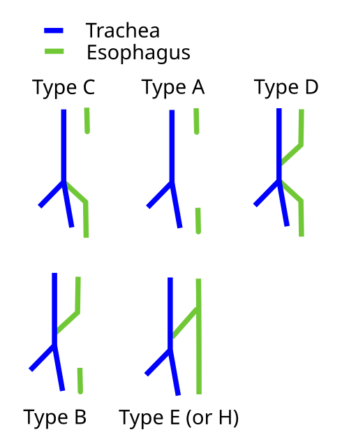
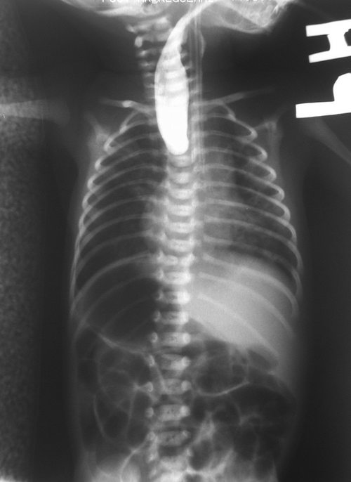

# ATRESIA DE ESÔFAGO E FÍSTULA TRAQUEOESOFÁGICA

A atresia de esôfago (AE) não é apenas uma "interrupção" do tubo digestivo; é uma falha complexa de septação embrionária que desafia o cirurgião pediátrico e o intensivista desde o primeiro minuto de vida do recém-nascido (RN). Para entender este tema, você precisa visualizar o que acontece na 4ª semana de gestação. O intestino anterior, que deveria se dividir em dois tubos paralelos (traqueia na frente, esôfago atrás), falha em completar esse processo. O resultado? Um esôfago que termina em fundo cego e, frequentemente, uma comunicação anômala com a via aérea.

## Embriologia e Fisiopatologia: O Porquê do Defeito

Por que isso acontece? Entre a 4ª e a 6ª semana de vida fetal, o septo traqueoesofágico deve separar o divertículo respiratório do esôfago dorsal. Se esse septo se desvia ou se a proliferação celular falha, a separação é incompleta.

Aqui está o primeiro conceito que as bancas amam: a pressão do líquido amniótico e a deglutição fetal. Se o esôfago está obstruído (atresia), o feto não deglute o líquido amniótico adequadamente. Isso explica por que o **polidrâmnio materno** é um sinal de alerta clássico no pré-natal.

Mas cuidado: nem toda atresia de esôfago cursa com polidrâmnio. Se houver uma fístula traqueoesofágica (FTE) distal, o líquido pode passar da traqueia para o esôfago distal e chegar ao estômago. Guarde isso: polidrâmnio é muito mais comum na atresia pura (sem fístula).

## Classificação de Gross: O Mapa da Mina

Você não pode ir para uma prova de residência sem decorar a Classificação de Gross. Ela é o padrão-ouro para descrever a anatomia do defeito. No MedEvo, sempre reforçamos que a frequência de cada tipo é o que define a sua suspeita clínica inicial.

| Tipo (Gross) | Descrição | Frequência Aproximada |
| --- | --- | --- |
| **Tipo A** | Atresia de esôfago pura (sem fístula) | 8% |
| **Tipo B** | Atresia com fístula traqueoesofágica proximal | 1% |
| **Tipo C** | Atresia com fístula distal (o "C" de Comum) | 85% |
| **Tipo D** | Atresia com fístula proximal e distal | 2% |
| **Tipo E** | Fístula em "H" (sem atresia) | 4% |

*Figura 1 - Classificação de Gross da atresia de esôfago e fístula traqueoesofágica, mostrando os cinco tipos anatômicos (A-E). O Tipo C (atresia com fístula distal) é o mais comum (~85%). Fonte: Jmarchn, CC BY-SA 3.0 | Wikimedia Commons*

**Dica de Professor:** O Tipo C é o rei das provas. Por que ele é o mais comum? Porque ele explica a apresentação clássica: um bebê que saliva muito (atresia proximal) e que tem o abdome distendido (ar passando da traqueia para o estômago via fístula distal).

Se a questão mencionar um abdome "escavado" ou sem gás no raio-X, ela está te empurrando para o **Tipo A (Atresia Pura)**. Sem fístula distal, o ar não chega ao intestino.

## Malformações Associadas: O VACTERL

Raramente a atresia de esôfago vem sozinha. Em cerca de 50% dos casos, o bebê apresenta outras malformações. O acrônimo **VACTERL** é obrigatório no seu arsenal:

- **V**ertebral (hemivértebras, escoliose)

- **A**nal (atresia anal/ânus imperfurado)

- **C**ardíaca (CIV, Tetralogia de Fallot, CIA) - *A mais comum e a que mais impacta o prognóstico imediato.*

- **T**raqueo-**E**sofágica (a própria AE/FTE)

- **R**enal (agenesia renal, displasia)

- **L**imb (membros - hipoplasia de rádio)

**Exemplo Clínico:** Você recebe um RN com sialorreia e impossibilidade de passar sonda orogástrica. Qual o próximo passo após estabilizar? Você deve solicitar um Ecocardiograma e um Raio-X de coluna e membros. Por quê? Porque se o arco aórtico for à direita (presente em 5% dos casos), o cirurgião pode precisar mudar a via de acesso cirúrgico (toracotomia à esquerda em vez da clássica à direita).

## Quadro Clínico: A Tríade da Suspeita

Como o Dr. Will costuma dizer nas discussões de caso, o diagnóstico de atresia de esôfago é clínico e deve ser feito na sala de parto ou nas primeiras horas de vida.

- **Sialorreia excessiva:** O bebê "espuma" pela boca. Ele não consegue engolir a própria saliva, que se acumula no fundo cego superior e transborda.

- **Engasgos e Cianose:** Ao tentar a primeira mamada, o leite preenche o coto superior e transborda para a laringe (aspiração). O bebê tosse, sufoca e fica roxo.

- **Distensão Abdominal (se houver fístula distal):** Cada vez que o bebê chora ou respira, o ar passa da traqueia para o estômago.

**Atenção para a Fístula em H (Tipo E):** Esta é a "pegadinha" dos examinadores. Como não há atresia (o esôfago é contínuo), o diagnóstico costuma ser tardio. A criança apresenta pneumonias de repetição, tosse crônica ao ingerir líquidos e distensão abdominal gasosa. É aquele paciente que "escapa" do diagnóstico neonatal e chega ao pediatra com 6 meses de vida com quadro respiratório arrastado.

## Diagnóstico: O Teste da Sonda

*Figura 2 - Radiografia com contraste no esôfago superior demonstrando atresia esofágica, com interrupção da progressão do contraste. Fonte: DrM!KEY, Copyrighted free use | Wikimedia Commons*

O diagnóstico definitivo não exige exames complexos inicialmente.

**O padrão-ouro inicial é a tentativa de passagem de uma sonda orogástrica (SOG) calibrosa (número 10 ou 12).**

Se a sonda encontrar resistência entre 10 a 12 cm da rima labial, a suspeita está confirmada. O próximo passo é o **Raio-X de tórax e abdome com a sonda no lugar**.

O que você verá no Raio-X?

- A sonda enrolada no coto superior (confirmando a atresia).

- Presença de gás no estômago/intestino: Confirma fístula distal (Tipo C ou D).

- Ausência de gás (abdome opaco): Sugere Atresia Pura (Tipo A) ou com fístula proximal apenas (Tipo B).

**Erro Comum:** Injetar contraste no coto superior para "ver melhor". **Não faça isso!** O risco de aspiração maciça de contraste para o pulmão é altíssimo. Se for absolutamente necessário (em casos de dúvida diagnóstica rara), usa-se uma quantidade mínima (0,5ml) de contraste hidrossolúvel, sob fluoroscopia, e aspira-se logo em seguida. Mas, para a prova: o diagnóstico é clínico + sonda + raio-X simples.

## Manejo Pré-operatório: Protegendo o Pulmão

O maior inimigo do bebê com AE/FTE não é a falta de comida, mas sim a **pneumonite química**. O conteúdo gástrico (ácido) sobe pela fístula distal e vai para o pulmão, enquanto a saliva transborda do coto superior.

A conduta imediata inclui:

- **Posição de Fowler (30-45 graus):** Para evitar que o suco gástrico reflua pela fístula distal para a traqueia.

- **Sonda de Replogle (aspiração contínua):** Uma sonda de lúmen duplo colocada no coto superior para aspirar a saliva 24h por dia.

- **Nada por via oral (NPO) e Hidratação Venosa.**

- **Antibioticoterapia profilática:** Geralmente iniciada devido ao alto risco de aspiração.

**Cuidado com a Ventilação Mecânica:** Se o bebê tiver desconforto respiratório grave e precisar de intubação, temos um problema. A ventilação com pressão positiva pode desviar o ar preferencialmente pela fístula para o estômago, causando distensão gástrica maciça, que empurra o diafragma e piora ainda mais a ventilação (um ciclo vicioso). Nesses casos, a gastrostomia de urgência pode ser necessária para descompressão.

## Tratamento Cirúrgico: O Momento da Verdade

O objetivo final é a ligadura da fístula e a anastomose primária do esôfago (unir as duas pontas).

A cirurgia clássica é realizada via **toracotomia extrapleural direita**. Por que extrapleural? Porque se a anastomose vazar (uma complicação comum), o conteúdo esofágico não cai direto na cavidade pleural, evitando um empiema fulminante. Atualmente, centros de excelência realizam o procedimento via toracoscopia.

**E se a distância entre os cotos for muito grande (Long Gap)?**
Isso acontece geralmente na Atresia Pura (Tipo A). Se a distância for maior que 3-4 corpos vertebrais, a anastomose primária pode ser impossível no primeiro momento.

- **Conduta:** Faz-se uma gastrostomia para alimentação e espera-se o crescimento dos cotos (estimulado por alongamentos ou apenas tempo) por algumas semanas/meses antes de tentar a reconstrução.

## Estratificação de Risco: Waterson vs. Spitz

As bancas podem cobrar como prevemos o sucesso do tratamento.

**Classificação de Spitz (mais moderna e utilizada):**

- **Grupo I:** Peso > 1500g e sem anomalias cardíacas maiores (Sobrevivência 97%).

- **Grupo II:** Peso < 1500g OU anomalia cardíaca maior (Sobrevivência 59%).

- **Grupo III:** Peso < 1500g E anomalia cardíaca maior (Sobrevivência 22%).

Perceba que o peso e o coração são os grandes determinantes. Se o bebê é prematuro extremo e tem uma cardiopatia grave, a cirurgia do esôfago pode ter que ser adiada ou estagiada.

## Complicações Pós-operatórias: O que esperar?

Mesmo com uma cirurgia perfeita, o esôfago "consertado" nunca é igual ao original.

- **Estenose de Anastomose (mais comum):** Ocorre em até 40% dos casos. O bebê começa a apresentar disfagia quando introduz alimentos sólidos. O tratamento é a dilatação esofágica endoscópica.

- **Deiscência (Fístula) da Anastomose:** Geralmente manifesta-se com saliva pelo dreno de tórax. A maioria fecha espontaneamente com tratamento conservador (NPO e nutrição parenteral).

- **Refluxo Gastroesofágico (DRGE):** Quase todos os pacientes têm. O esôfago é curto, a junção esofagogástrica é tracionada para cima e a motilidade é ruim. Muitos precisam de fundoplicatura (Cirurgia de Nissen) futuramente.

- **Traqueomalácia:** A traqueia no local da fístula é "mole" e pode colapsar durante a expiração ou tosse, causando o famoso "latido de cachorro" (tosse metálica) e episódios de cianose (dying spells).

## Fístula Traqueoesofágica Adquirida: O Cenário do Adulto e UTI

Diferente da congênita, a FTE adquirida é uma lesão de "desgaste" ou invasão.

### Etiologia Benigna (Iatrogênica)

A causa número um é a **lesão por balonete (cuff) de tubo endotraqueal ou cânula de traqueostomia**.

- **O Porquê:** Se a pressão do balonete for superior à pressão de perfusão capilar da mucosa traqueal (> 25-30 mmHg), ocorre isquemia. Como o esôfago está logo atrás da traqueia, a necrose pode perfurar a parede posterior da traqueia e a parede anterior do esôfago, criando a fístula.

- **Fator de Risco:** Uso concomitante de sonda nasogástrica rígida (que faz o "contraponto" de pressão atrás do esôfago).

### Etiologia Maligna

Geralmente causada por câncer de esôfago avançado ou câncer de pulmão/traqueia que invade o órgão vizinho. O prognóstico aqui é reservado, e o tratamento costuma ser paliativo com stents (próteses) esofágicos e/ou traqueais.

| Característica | FTE Congênita | FTE Adquirida (Benigna) |
| --- | --- | --- |
| **Público** | Recém-nascidos | Pacientes em UTI (VM prolongada) |
| **Mecanismo** | Falha embrionária | Isquemia por pressão do balonete |
| **Diagnóstico** | Teste da sonda / Rx | Broncoscopia / Endoscopia |
| **Tratamento** | Cirurgia neonatal | Cirurgia de reconstrução / Stents |

## Cistos de Duplicação Esofágica

Para fechar o tema de malformações, não esqueça da duplicação esofágica. É uma estrutura cística, revestida por mucosa digestiva e com camada muscular própria, aderida ao esôfago.

- **Clínica:** Frequentemente assintomática no RN. Pode causar disfagia ou sintomas respiratórios (compressão da traqueia) na infância ou vida adulta.

- **Diagnóstico:** Muitas vezes é um achado incidental em exames de imagem ou investigado por massa mediastinal.

- **Tratamento:** Ressecção cirúrgica, pois há risco de hemorragia (se houver mucosa gástrica ectópica produzindo ácido dentro do cisto) ou infecção.

## Pontos-Chave para Prova

- **Tipo mais comum:** Atresia de esôfago com fístula distal (Tipo C de Gross) - 85% dos casos.

- **Sinal pré-natal clássico:** Polidrâmnio (especialmente nos tipos sem fístula distal).

- **Sinal pós-natal imediato:** Sialorreia excessiva ("espumação") e engasgos na primeira mamada.

- **Diagnóstico inicial:** Impossibilidade de progressão de sonda orogástrica calibrosa (para em 10-12 cm).

- **Raio-X com gás no estômago:** Confirma que existe uma fístula distal (Tipo C ou D).

- **VACTERL:** Sempre investigar malformações cardíacas (Ecocardiograma) e renais antes da cirurgia.

- **Posicionamento pré-op:** Fowler (cabeceira elevada) para evitar refluxo gástrico para o pulmão via fístula.

- **Fístula em H (Tipo E):** Diagnóstico tardio; cursa com pneumonias de repetição e distensão abdominal.

- **Principal causa de FTE adquirida benigna:** Pressão excessiva do balonete (cuff) do tubo endotraqueal em pacientes ventilados.

- **Complicação pós-operatória mais frequente:** Estenose da anastomose (trata-se com dilatação).

- **Contraindicação relativa à anastomose primária:** "Long gap" (grande distância entre os cotos, > 3-4 corpos vertebrais).

- **O que NÃO fazer:** Injetar contraste em grande quantidade no coto superior (risco de pneumonia aspirativa grave).

- **Fator prognóstico principal (Spitz):** Peso ao nascer (< 1500g) e presença de cardiopatia grave.

- **Tratamento da FTE maligna:** Geralmente paliativo com colocação de stents autoexpansíveis.

- **Diferencial de Atresia Pura (Tipo A):** Raio-X com abdome totalmente sem gás ("abdome cego").

- **Traqueomalácia:** Causa tosse metálica e estridor no pós-operatório tardio de AE. 🩺

 Cópia offline para consulta pessoal.
 Fonte original:
 [https://www.medevo.com.br/material-apoio/ler/e3fb3dbc-afe2-4a9f-a124-7d094c929ab1](https://www.medevo.com.br/material-apoio/ler/e3fb3dbc-afe2-4a9f-a124-7d094c929ab1)
