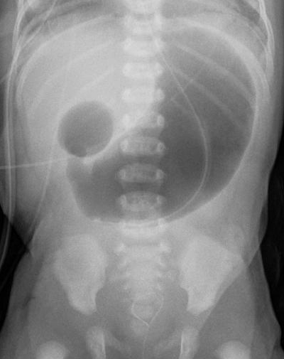
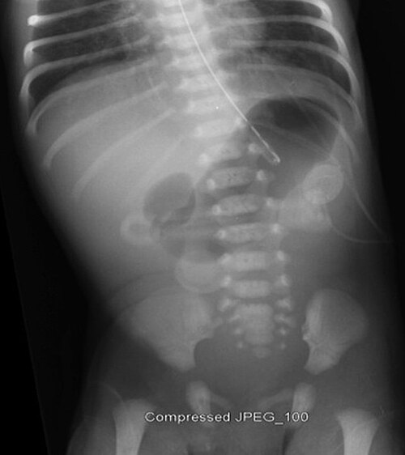

# ATRESIAS INTESTINAIS

As atresias intestinais representam uma das causas mais comuns de obstrução intestinal no período neonatal. Para a sua prova de residência, você não deve apenas decorar nomes; você precisa entender a lógica embriológica e vascular por trás de cada lesão. É essa lógica que define se o bebê terá malformações associadas ou se será um evento isolado.

Quando falamos em atresia, estamos falando de uma interrupção completa da luz intestinal. Se a interrupção for parcial, chamamos de estenose. O ponto fundamental aqui é a localização: quanto mais alta a obstrução, mais precoce é o vômito e menor é a distensão abdominal.

## Atresia Duodenal

A atresia duodenal é o "carro-chefe" das provas de cirurgia pediátrica. O que você precisa fixar logo de cara é a etiologia. Diferente das atresias mais distais, a atresia duodenal ocorre por uma falha na recanalização do lúmen intestinal entre a 8ª e a 10ª semana de gestação (Teoria de Tandler).

Normalmente, o epitélio do duodeno prolifera até ocluir a luz e, depois, sofre vacuolização para recanalizar. Se isso falha, temos a atresia. Como esse erro ocorre muito cedo no desenvolvimento embrionário, é comum que venha acompanhado de outras "broncas".

### Associações e Genética

Cuidado aqui: a associação mais clássica é com a **Síndrome de Down (Trissomia do 21)**, presente em cerca de 30% dos casos. Se a questão de prova descreve um RN com fácies característica e vômitos biliosos, sua mente deve ir direto para atresia duodenal.

Além do Down, temos a associação com pâncreas anular (onde o pâncreas "abraça" o duodeno), malformações cardíacas e a clássica associação com atresia de esôfago. Lembre-se: o examinador pode citar a Síndrome de VACTERL, e a atresia duodenal pode estar no espectro das malformações gastrointestinais.

### Quadro Clínico e o Sinal da Dupla Bolha

*Figura 1 - Radiografia abdominal de neonato demonstrando o clássico sinal da dupla bolha (double bubble), patognomônico da atresia duodenal. Fonte: Kinderradiologie Olgahospital Klinikum Stuttgart, CC BY-SA 3.0 | Wikimedia Commons*

O sinal clínico patognomônico é o **vômito bilioso precoce** (nas primeiras 24-48h de vida) **sem distensão abdominal**. Por que sem distensão? Porque a obstrução é muito alta! O ar não progride para o restante do intestino, então o abdome fica escavado ou plano.

Na radiografia simples de abdome em ortostase, encontramos o famoso **Sinal da Dupla Bolha**. Uma bolha corresponde ao estômago e a outra à porção proximal do duodeno, ambas dilatadas com ar.

**Dica do Dr. Will:** Se houver ar distal à dupla bolha, não é atresia completa; pense em estenose duodenal ou em uma obstrução extrínseca, como o Volvo de Intestino Médio. A atresia clássica não permite a passagem de ar para o resto do tubo digestivo.

### Tratamento: A Técnica de Diamante

O tratamento é cirúrgico, mas nunca é uma emergência de "correr para a sala" sem estabilizar. Primeiro, passamos uma sonda orogástrica para descompressão e corrigimos os distúrbios hidroeletrolíticos.

A cirurgia de escolha é a **duodeno-duodenostomia latero-lateral**, preferencialmente a técnica **"Diamond-shaped" (em diamante)** descrita por Kimura. O objetivo é anastomosar a porção dilatada (proximal) com a porção colabada (distal) de forma a evitar estenoses futuras.

| Característica | Atresia Duodenal |
| --- | --- |
| **Etiologia** | Falha de recanalização (Tandler) |
| **Associação Principal** | Síndrome de Down (30%) |
| **Radiografia** | Sinal da Dupla Bolha |
| **Vômitos** | Biliosos (85% dos casos) |
| **Cirurgia** | Duodenoduodenostomia em Diamante |

## Atresia Jejunoileal

Aqui a história muda completamente. Esqueça a falha de recanalização. A teoria mais aceita para as atresias de jejuno e íleo é a **Teoria do Acidente Vascular Intrauterino**.

Imagine que o intestino estava se formando bonitinho, mas em algum momento houve um "infarto" segmentar (por volvo, intussuscepção fetal ou hérnia interna). Aquele pedaço de intestino morre e é reabsorvido, deixando um "buraco" ou uma corda fibrosa entre as alças saudáveis.

Como esse evento é tardio na gestação e puramente vascular, a associação com Síndrome de Down é **rara**. O bebê costuma ser hígido, exceto pela atresia.

### Classificação de Grosfeld

As bancas adoram cobrar a classificação, pois ela define a gravidade e o prognóstico:

- **Tipo I:** Membrana mucosa intraluminal. A parede externa está íntegra.

- **Tipo II:** Dois cotos cegos conectados por um cordão fibroso.

- **Tipo IIIa:** Cotos cegos separados por um defeito no mesentério em forma de "V".

- **Tipo IIIb (Apple Peel / Casca de Maçã):** Atresia jejunal alta com grande perda de intestino e mesentério. O intestino distal se enrola ao redor de um único vaso (artéria ileocólica). É a de pior prognóstico.

- **Tipo IV:** Atresias múltiplas ("em colar de contas").

### Clínica e Diagnóstico

Diferente da duodenal, aqui temos **distensão abdominal importante** e vômitos biliosos. Quanto mais distal a atresia (íleo terminal), maior a distensão e mais tardio o vômito.

No RX, veremos múltiplas alças dilatadas com níveis hidroaéreos e **ausência de ar no reto**. O enema opaco é fundamental aqui para diferenciar de outras causas (como Íleo Meconial ou Doença de Hirschsprung) e para avaliar se existe o chamado "microcólon" de desuso.

### Tratamento e a Síndrome do Intestino Curto

O tratamento consiste na ressecção dos segmentos atrésicos e anastomose primária. No entanto, se o paciente perder muito intestino (especialmente no Tipo IIIb ou IV), ele pode evoluir com **Síndrome do Intestino Curto (SIC)**.

Na MedEvo, sempre reforçamos: a válvula ileocecal é o seu bem mais precioso. Se o cirurgião precisar ressecar o íleo terminal e a válvula, o paciente terá problemas graves de absorção de vitamina B12 (levando à anemia megaloblástica) e de sais biliares.

Para casos de SIC, existem técnicas de alongamento intestinal:

- **Procedimento de Bianchi:** O intestino é dividido longitudinalmente e transformado em dois tubos mais finos, que são conectados em série.

- **STEP (Serial Transverse Enteroplasty):** Grampeamentos transversais alternados que criam um caminho em "zigue-zague", aumentando o tempo de trânsito e a área de absorção.

## Obstruções Gástricas e Pilóricas

Embora menos comuns que as intestinais, as obstruções na saída do estômago causam uma confusão clássica em provas.

### Atresia de Piloro

É uma condição rara, mas com uma associação "de ouro" para provas: **Epidermólise Bolhosa**. Se a questão mencionar um RN com bolhas na pele e obstrução gástrica (vômitos não biliosos e apenas uma bolha de ar no estômago), não pense duas vezes.

### Estenose Hipertrófica de Piloro (EHP)

Atenção: a EHP **não é uma atresia**. É uma hipertrofia da musculatura circular do piloro que ocorre semanas após o nascimento.

- **Idade:** 3 a 6 semanas de vida (não nasce com isso!).

- **Vômitos:** Não biliosos, em jato, após as mamadas.

- **Exame Físico:** Massa em formato de oliva palpável no epigástrio (**Oliva Pilórica**).

- **Distúrbio Metabólico:** Alcalose metabólica hipoclorêmica e hipocalêmica (pela perda de H+ e Cl- no vômito).

O tratamento é a **Piloromiotomia de Fredet-Ramstedt**. Mas cuidado: a cirurgia só deve ser feita **após** a correção dos distúrbios eletrolíticos. Operar um bebê com alcalose grave é erro médico e erro de prova.

## Divertículo de Meckel: O Grande Camaleão

O Divertículo de Meckel não é uma atresia, mas é o remanescente congênito mais comum do trato gastrointestinal (2% da população). Ele é um divertículo verdadeiro (tem todas as camadas da parede) e resulta da falha no fechamento do **ducto onfalomesentérico**.

### A Regra dos 2

As bancas amam essa mnemotecnia:

- Ocorre em **2%** da população.

- Localiza-se a cerca de **2 pés** (60 cm) da válvula ileocecal.

- Tem cerca de **2 polegadas** de comprimento.

- Pode conter **2 tipos** de mucosa ectópica (gástrica é a mais comum, mas pode ter pancreática).

- Manifesta-se geralmente antes dos **2 anos** de idade.

### Por que o Meckel sangra?

Esta é a pergunta clássica. O divertículo em si não sangra por "ser um buraco". Ele sangra porque a **mucosa gástrica ectópica** produz ácido clorídrico. Como o íleo adjacente não tem proteção contra o ácido, ele sofre ulceração.

O resultado é uma **hemorragia digestiva baixa (enterorragia) indolor** e recorrente em uma criança previamente saudável. Se a criança tem dor e sinais de obstrução, o Meckel pode ter causado uma intussuscepção ou um volvo.

### Diagnóstico e Conduta

O padrão-ouro para o diagnóstico de Meckel com sangramento é a **Cintilografia com Pertecnetato de Tecnécio-99m**. Esse radiofármaco tem afinidade pelas células muco-secretoras da mucosa gástrica. Se "brilhar" no íleo terminal, o diagnóstico está feito.

**Cuidado:** Se o Meckel causar obstrução ou diverticulite (quadro igual a apendicite, mas com dor mais central), a cintilografia não ajuda muito. O tratamento é sempre a ressecção cirúrgica (diverticulectomia ou ressecção segmentar do íleo).

| Diferencial | Divertículo de Meckel | Intussuscepção Intestinal |
| --- | --- | --- |
| **Dor** | Indolor (se sangramento puro) | Dor em cólica súbita e intensa |
| **Aspecto das fezes** | Sangue vivo ou "em tijolo" | Geleia de morango (muco + sangue) |
| **Massa palpável** | Raro | Massa em "salsicha" no hipocôndrio |
| **Diagnóstico** | Cintilografia | Ultrassonografia (Sinal do Alvo) |

## Malformações de Rotação e Volvo

Este é o diagnóstico que tira o sono do cirurgião pediátrico. A má rotação intestinal ocorre quando o intestino não faz o giro de 270 graus anti-horário em torno da artéria mesentérica superior durante a vida fetal.

O resultado são as **Bridas de Ladd** (faixas fibrosas que tentam fixar o ceco na parede abdominal, mas acabam comprimindo o duodeno) e um mesentério de base estreita, propenso a torcer.

### Volvo de Intestino Médio (Midgut Volvulus)

Se um RN com menos de 1 mês apresenta **vômitos biliosos súbitos e dor abdominal**, você deve considerar Volvo até que se prove o contrário. É uma emergência catastrófica porque a torção obstrui o suprimento sanguíneo de todo o intestino delgado.

Se houver sinais de peritonite ou choque, a laparotomia é imediata. Se o bebê estiver estável, o exame de escolha é o **REED (Radiografia de Esôfago, Estômago e Duodeno)**, que mostrará o duodeno em "saca-rolhas" ou "bico de pássaro".

O tratamento é a **Manobra de Ladd**:

- Destorcer o intestino (sentido anti-horário).

- Lise das bridas de Ladd.

- Alargamento da base do mesentério.

- Apendicectomia profilática (já que o ceco ficará no lado esquerdo, o que confundiria um diagnóstico futuro de apendicite).

## Diagnóstico Diferencial de Obstrução Neonatal

Para não errar em prova, você precisa organizar as causas de vômitos biliosos no RN. O examinador vai te dar pistas sutis.

| Nível da Obstrução | Causa Provável | Achado Radiológico |
| --- | --- | --- |
| **Gástrico/Pilórico** | Atresia de Piloro / EHP | Bolha única / Estômago dilatado |
| **Duodenal** | Atresia Duodenal | Sinal da Dupla Bolha (sem ar distal) |
| **Duodenal (Extrínseco)** | Volvo / Pâncreas Anular | Dupla Bolha com algum ar distal |
| **Jejunoileal** | Atresia Jejunoileal | Múltiplas alças e níveis hidroaéreos |
| **Colônico/Distal** | Hirschsprung / Íleo Meconial | Distensão generalizada |

### O Caso do Ascaris Lumbricoides

Embora não seja uma malformação congênita, a obstrução por *Ascaris* aparece frequentemente em questões de abdome agudo obstrutivo pediátrico no Brasil.
O quadro é de uma criança maior (2-10 anos) com dor abdominal e massa palpável ("bolo de vermes").

**Tratamento:** Inicialmente conservador com SNG, hidratação e óleo mineral. O uso de anti-helmínticos (como Albendazol) deve ser evitado na fase aguda, pois a morte maciça dos vermes libera toxinas e piora a inflamação/obstrução. O tratamento medicamentoso é feito após a resolução do quadro obstrutivo. Piperazina e óleo mineral eram a conduta clássica para "paralisar" os vermes.

## Pontos-Chave para Prova 🎯

- **Atresia Duodenal:** Associada a Down; falha de recanalização; sinal da dupla bolha; vômito bilioso sem distensão.

- **Atresia Jejunoileal:** Causa vascular; sem associação com Down; classificação de Grosfeld (Tipo IIIb é o "Apple Peel").

- **Vômitos Biliosos no RN:** É Volvo de Intestino Médio até que se prove o contrário. Emergência cirúrgica!

- **Estenose Hipertrófica de Piloro:** Vômitos NÃO biliosos; alcalose metabólica hipoclorêmica; oliva pilórica; 3-6 semanas de vida.

- **Divertículo de Meckel:** Causa mais comum de hemorragia digestiva baixa indolor em crianças; remanescente do ducto onfalomesentérico; diagnóstico por cintilografia.

- **Regra dos 2 (Meckel):** 2% da população, 2 pés da válvula ileocecal, 2 polegadas, 2 tipos de mucosa (gástrica/pancreática).

- **Atresia de Piloro:** Pense sempre na associação com Epidermólise Bolhosa.

- **Síndrome do Intestino Curto:** Ressecção de íleo terminal causa anemia megaloblástica (falta de B12).

- **Procedimentos de Alongamento:** Bianchi (divisão longitudinal) e STEP (grampeamento transverso).

- **Sinal da Dupla Bolha:** Estômago e Duodeno proximal dilatados. Se houver ar distal, a obstrução é incompleta (estenose ou brida).

- **Tratamento da Atresia Duodenal:** Duodenoduodenostomia em diamante (Kimura).

- **Contraindicação Absoluta:** Não dar anti-helmíntico para criança com obstrução total por Ascaris antes de desobstruir.

- **Pegadinha de Prova:** A Síndrome de Turner NÃO tem associação clássica com atresia duodenal (o Down sim).

- **Localização do Meckel:** Sempre na borda antimesentérica do íleo.

- **Vômitos na EHP:** São sempre não biliosos porque a obstrução é proximal à ampola de Vater.

- **Conduta no Volvo:** Manobra de Ladd (destorção + lise de bridas + apendicectomia).

- **Diagnóstico de Volvo:** REED é o melhor exame para ver a posição do ângulo de Treitz e o aspecto em "saca-rolhas".

- **Lembre-se:** Na atresia de esôfago com fístula distal, pode haver ar no estômago, mas se houver atresia duodenal associada, esse ar ficará "preso" formando a dupla bolha.

 Cópia offline para consulta pessoal.
 Fonte original:
 [https://www.medevo.com.br/material-apoio/ler/a20790fe-b911-451b-8bb4-98627bffdaa1](https://www.medevo.com.br/material-apoio/ler/a20790fe-b911-451b-8bb4-98627bffdaa1)
